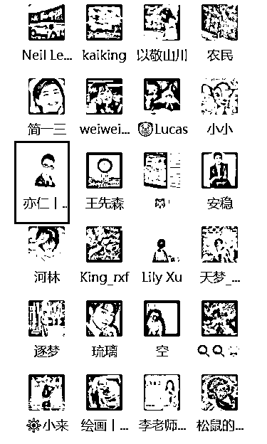
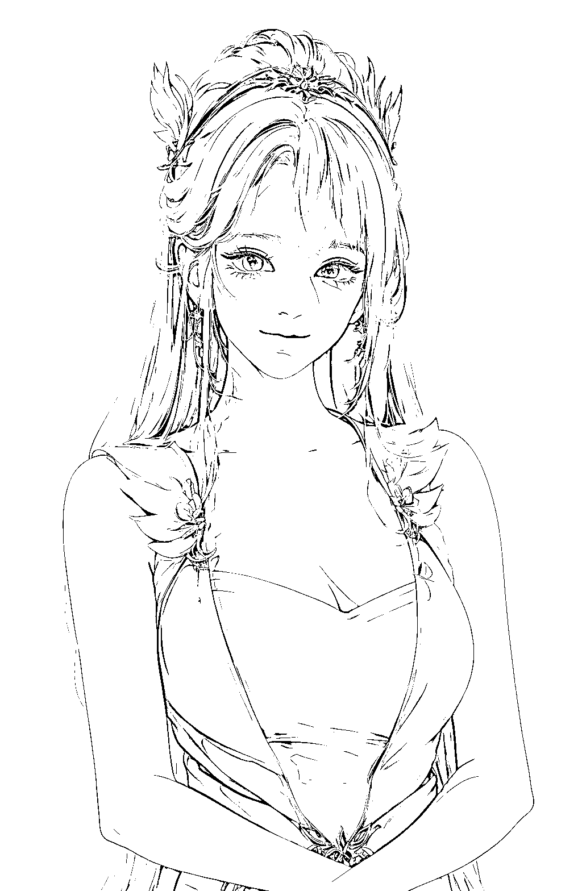
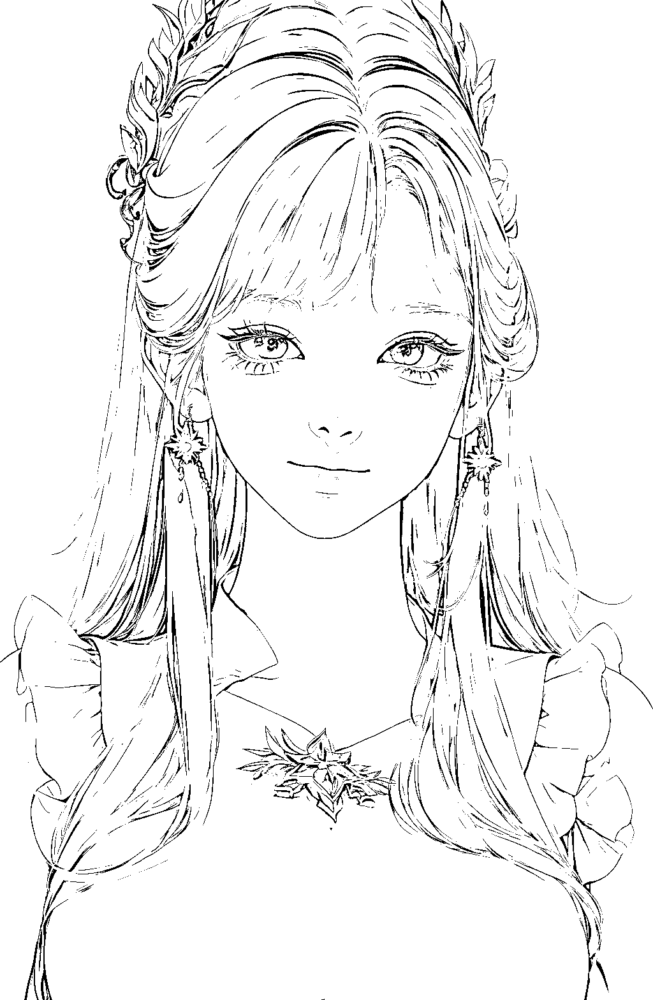

# 《月入过万的小红书头像壁纸玩法与制作方法拆解》

> 原文：[`www.yuque.com/for_lazy/thfiu8/iskciqu47m3xagdr`](https://www.yuque.com/for_lazy/thfiu8/iskciqu47m3xagdr)

<ne-h2 id="de23cc1e" data-lake-id="de23cc1e"><ne-heading-ext><ne-heading-anchor></ne-heading-anchor><ne-heading-fold></ne-heading-fold></ne-heading-ext><ne-heading-content><ne-text id="ubd663e5f">(162 赞)《月入过万的小红书头像壁纸玩法与制作方法拆解》</ne-text></ne-heading-content></ne-h2> <ne-p id="u72d0aa87" data-lake-id="u72d0aa87"><ne-text id="u8e061754">作者： 蕃茄</ne-text></ne-p> <ne-p id="u034810ce" data-lake-id="u034810ce"><ne-text id="ufbe3a3be">日期：2023-04-13</ne-text></ne-p> <ne-p id="u3142c1b2" data-lake-id="u3142c1b2"><ne-text id="u8b2598c5">拆解 月入过万的 【小红书】头像壁纸玩法与制作方法</ne-text></ne-p> <ne-p id="uf109090e" data-lake-id="uf109090e"><ne-text id="u4c2c4741">连【亦仁老大】都在潜伏的小红书头像壁纸群玩法</ne-text></ne-p> <ne-p id="u41b22c99" data-lake-id="u41b22c99"><ne-text id="uf0daa0f8">详情请见飞书文档</ne-text></ne-p> <ne-p id="u3958275f" data-lake-id="u3958275f">[<ne-text id="ud8537c14">https://wurchmz1an.feishu.cn/docx/XiwmdQFijotSRAxrBv8c1dLmndr?from=from_copylink</ne-text>](https://wurchmz1an.feishu.cn/docx/XiwmdQFijotSRAxrBv8c1dLmndr?from=from_copylink)<ne-card data-card-name="image" data-card-type="inline" id="D79nx" data-event-boundary="card"></ne-card></ne-p> <ne-p id="u2e167d1f" data-lake-id="u2e167d1f"><ne-card data-card-name="image" data-card-type="inline" id="ftvVx" data-event-boundary="card"></ne-card></ne-p> <ne-p id="ucb39ca45" data-lake-id="ucb39ca45"><ne-card data-card-name="image" data-card-type="inline" id="qFRKl" data-event-boundary="card"></ne-card></ne-p> <ne-p id="uc7a6530a" data-lake-id="uc7a6530a"><ne-card data-card-name="image" data-card-type="inline" id="ig6lK" data-event-boundary="card"></ne-card></ne-p> <ne-p id="u237e12db" data-lake-id="u237e12db"><ne-card data-card-name="image" data-card-type="inline" id="QwkJH" data-event-boundary="card"></ne-card></ne-p> <ne-p id="u035db3ac" data-lake-id="u035db3ac"><ne-card data-card-name="image" data-card-type="inline" id="UBt6R" data-event-boundary="card"></ne-card></ne-p> <ne-p id="uc2f9ecd1" data-lake-id="uc2f9ecd1"><ne-card data-card-name="image" data-card-type="inline" id="OklqI" data-event-boundary="card"></ne-card></ne-p> <ne-p id="u179987fe" data-lake-id="u179987fe"><ne-card data-card-name="image" data-card-type="inline" id="QDXIp" data-event-boundary="card"></ne-card></ne-p> <ne-p id="u7bdb5a2b" data-lake-id="u7bdb5a2b"><ne-card data-card-name="image" data-card-type="inline" id="ZM71A" data-event-boundary="card"></ne-card></ne-p> <ne-hole id="u0ffc5611" data-lake-id="u0ffc5611"><ne-card data-card-name="hr" data-card-type="block" id="xxzlx" data-event-boundary="card"><ne-p id="u3e3b4b3f" data-lake-id="u3e3b4b3f"><ne-text id="u0a43ec1b">评论区：</ne-text></ne-p> <ne-p id="u17b8925d" data-lake-id="u17b8925d"><ne-text id="u2ec079a6">IDO 老徐 : 👍🏻👍🏻👍🏻</ne-text> <ne-text id="ud07611f8">Happy : 太牛了</ne-text> <ne-text id="ue728e799">虚十七 : 在抖音应该也有可行性</ne-text> <ne-text id="u13a0d967">蕃茄 : 在抖音已经有在做的了，不过抖音做的是 小姐姐跳舞</ne-text> <ne-text id="u5fa7a919">千穹 : 666</ne-text> <ne-text id="ufd172399">安逸 : 赞</ne-text> <ne-text id="uaa8994e7">胡恩惠 : 这个群从哪进啊</ne-text> <ne-text id="u02031745">蕃茄 : 封群了，进不去 群主不是我</ne-text></ne-p></ne-card></ne-hole>