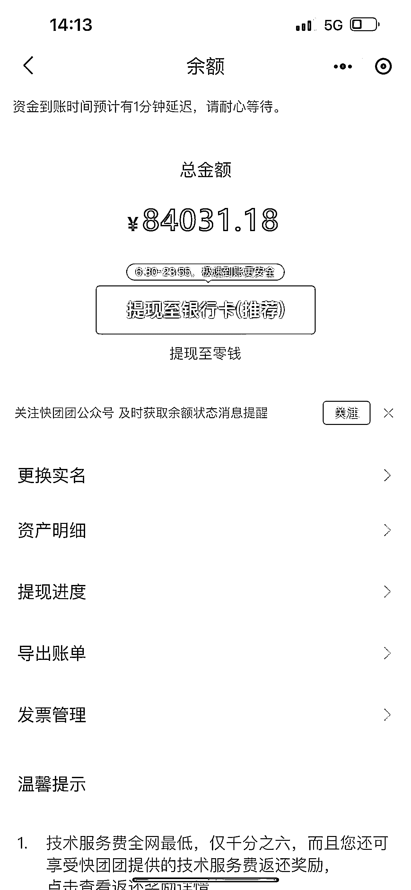
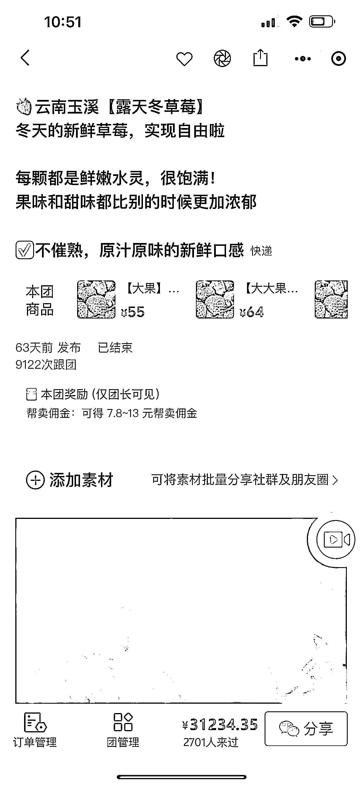

# 《快团团新手如何帮卖月佣金达到 8 万》

> 原文：[`www.yuque.com/for_lazy/thfiu8/gycvsilsnz84ac9s`](https://www.yuque.com/for_lazy/thfiu8/gycvsilsnz84ac9s)

## (84 赞)《快团团新手如何帮卖月佣金达到 8 万》 

作者： 贾璐 Luca 

日期：2023-04-11 

（篇文章来自于 3 月 8 日在大航海的快团团经验分享） 

我现在的主要线上营收是无人直播电商，大家都知道抖音、快手的直播规则瞬息万变，且用户群体没有复购。钱是赚了不少，但压力很大，且对未来迷茫。 

但快团团不一样，它是基于社群运营，有着超强的黏性的复购。所以我从去年 12 月慢慢测试，权当是“一个人的副业”快团团实验成绩吧。 

# 成就 

“一个人的副业”快团团实验成绩 

1、一个月时间，达到全国排名 1797 

2、单月帮卖佣金达到 8 万 

3、疫情期间，小区开团卖面包，净利润 2 万 

 

# 卖的什么 

##   

## 帮卖类 

### （一）帮卖的类目 

快团团帮卖，我主打的三种类目： 

1、时令水果类：草莓、橙子、枇杷、芒果…… 

2、卖生活方式：鲜花、香薰蜡烛…… 

3、预制菜：凉皮、鸭掌煲、螺蛳粉…… 

至于为什么主打这三个类目，我理解的在快团团的“人货场”，货和人的需求，对人的理解是匹配和一致的，卖货先要理解人，基于人的需求，选择对应的货，才能大卖，具体的后面会再讲到。 

### （二）重点打爆款单品 

重点讲一下帮卖爆款单品—草莓，只是草莓一个月赚了 3 万多，一单平均佣金是 11 元，卖了 2800 多单，复购率 40%以上。 

为什么选择草莓作为爆款原因： 

1、应季水果，一年只有 3 个月当季，大家期待已久， 

2、口味酸甜，小朋友们尤其喜欢，家长会为小朋友持续买单 

3、草莓客单价高，利润高。线下水果店价格普遍偏高，电商价格有一定优势 

 

具体详细内容查看飞书 

[https://r7weuqivm5.feishu.cn/docx/SYkqdYJ4FoEXOlxQpitcWY8Rnqg?from=from_copylink](https://r7weuqivm5.feishu.cn/docx/SYkqdYJ4FoEXOlxQpitcWY8Rnqg?from=from_copylink)

评论区： 

林家少爷 : 密码是多少啊，想拜读拜读不了 o(╥﹏╥)o 成为精锐 : 密码呀，姐姐 贾璐 Luca : 现在应该可以正常打开，不用密码了吧 蛋  总 : 同在广州，方便加留个 v 张乐乐 : 团品您那边如何解决配送问题呢？ 星漫🍊 : 很受用，真厉害 贾璐 Luca : 快递 贾璐 Luca : 我私聊您哈！不方便对外发