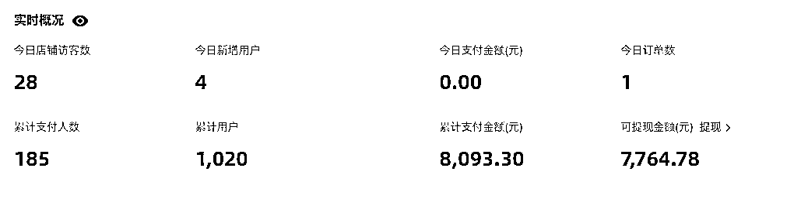
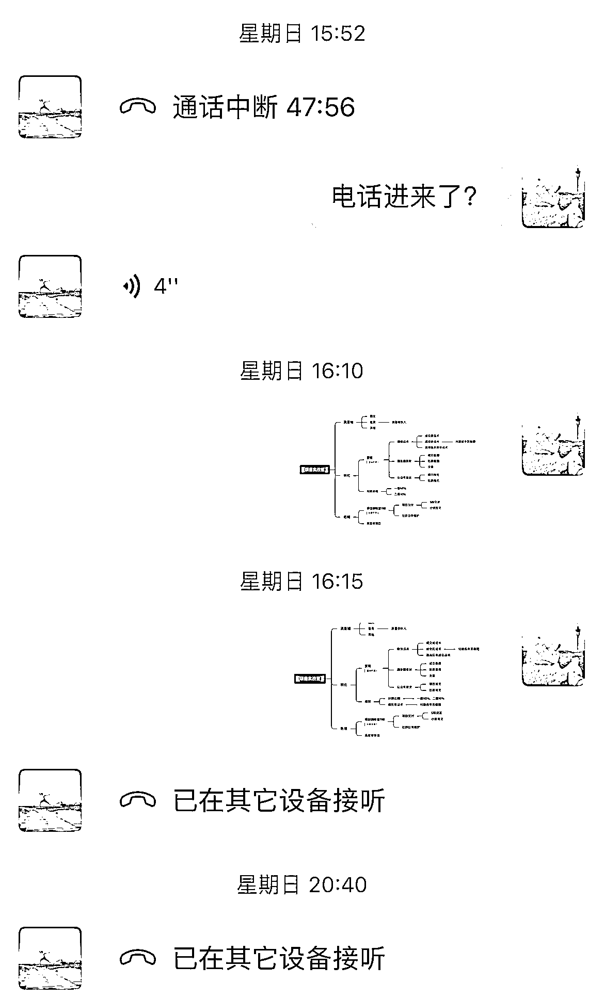

# 《普通人如何打造自己的创业类付费社群，2 个月引流 200+ 付费用户，变现 9900+》

> 原文：[`www.yuque.com/for_lazy/thfiu8/figdg922l2hncw5q`](https://www.yuque.com/for_lazy/thfiu8/figdg922l2hncw5q)

<ne-h2 id="af64565a" data-lake-id="af64565a"><ne-heading-ext><ne-heading-anchor></ne-heading-anchor><ne-heading-fold></ne-heading-fold></ne-heading-ext><ne-heading-content><ne-text id="u9ffb6480">(44 赞)《普通人如何打造自己的创业类付费社群，2 个月引流 200+ 付费用户，变现 9900+》</ne-text></ne-heading-content></ne-h2> <ne-p id="u78035d2d" data-lake-id="u78035d2d"><ne-text id="u2b6f61cc">作者： 新侠</ne-text></ne-p> <ne-p id="uab1222e3" data-lake-id="uab1222e3"><ne-text id="u6b034c64">日期：2023-04-10</ne-text></ne-p> <ne-p id="ub9ce01ea" data-lake-id="ub9ce01ea"><ne-text id="u6e869414">大家好，我是新侠，主职是苹果供应链中某上市公司中层，管理 20+人的工程师团队和 50+人的普工团队，善于数据分析和团队管理（企业），副业是在互联网上捣鼓一点小项目。</ne-text></ne-p> <ne-p id="u544bb070" data-lake-id="u544bb070"><ne-text id="u591d69d3">我在今年初正式开始了我的互联网项目探索之路，并一路抄袭、模仿、创造，最终创建了一个互联网项目付费社群。</ne-text></ne-p> <ne-p id="ub37425bd" data-lake-id="ub37425bd"><ne-text id="ub4649866">2 个月的时间社群从 19.9 一路涨价至 199，最终吸纳 200+会员，</ne-text><ne-text id="ue142fff9" ne-bold="true">总共变现 9900+</ne-text></ne-p> <ne-quote id="u08d9180f" data-lake-id="u08d9180f"><ne-p id="u1430093f" data-lake-id="u1430093f"><ne-card data-card-name="image" data-card-type="inline" id="MQrwm" data-event-boundary="card"></ne-card></ne-p> <ne-quote id="u5a7d37f7" data-lake-id="u5a7d37f7"><ne-p id="ue89227ef" data-lake-id="ue89227ef"><ne-card data-card-name="image" data-card-type="inline" id="V89pS" data-event-boundary="card"></ne-card></ne-p> <ne-p id="uafebc1c6" data-lake-id="uafebc1c6"><ne-text id="udac14c56">同时，在 4/2 把我的项目思路和方法教给一个完全没有接触过互联网的小白（我的小舅子）。</ne-text></ne-p> <ne-p id="u37d6da5c" data-lake-id="u37d6da5c"><ne-text id="u65f9dd5e" ne-bold="true">4/6 他成功开单，跑通闭环，共 4 天时间。</ne-text></ne-p> <ne-p id="u5836dc07" data-lake-id="u5836dc07"><ne-card data-card-name="image" data-card-type="inline" id="zF0qF" data-event-boundary="card"></ne-card></ne-p> <ne-p id="u06ba850b" data-lake-id="u06ba850b"><ne-card data-card-name="image" data-card-type="inline" id="CbNac" data-event-boundary="card"></ne-card></ne-p> <ne-p id="ue316b388" data-lake-id="ue316b388"><ne-text id="u2c2cea15">虽然经过几个月的跌跌撞撞，好在总算趟出来一条可行的互联网道路，并且经过验证这套方法同样适用于其他和我们一样的普通人操作。</ne-text></ne-p> <ne-p id="u9820efcf" data-lake-id="u9820efcf"><ne-text id="u7df6d25e">本文我尝试着把我整个项目中遇到的问题，我的解决方式以及我的一些思考记录下来，当作是一个复盘，也希望能对你有所启发。</ne-text></ne-p> <ne-p id="u15fc50d1" data-lake-id="u15fc50d1"><ne-text id="u3f5b1214">正文请移步飞书：</ne-text></ne-p> <ne-p id="u887a2e78" data-lake-id="u887a2e78">[<ne-text id="uffac369a">https://pbw5yhoa0k.feishu.cn/docx/K3oEdbAo1o5fq4xlSf3cOhkMnrg</ne-text>](https://pbw5yhoa0k.feishu.cn/docx/K3oEdbAo1o5fq4xlSf3cOhkMnrg)</ne-p> <ne-hole id="u377362f2" data-lake-id="u377362f2"><ne-card data-card-name="hr" data-card-type="block" id="rqoWE" data-event-boundary="card"><ne-p id="u837f66e5" data-lake-id="u837f66e5"><ne-text id="uc416e6ef">评论区：</ne-text></ne-p> <ne-p id="u14705a6e" data-lake-id="u14705a6e"><ne-text id="u680407ed">老崔要瘦身 : 你好，怎么加入社群</ne-text> <ne-text id="u42e277d7">新侠 : 我不是来拉人头的哈😂主要是分享和复盘</ne-text> <ne-text id="u014bba34">一恒 : 写的真好。倾囊相授了。</ne-text> <ne-text id="u8d43f32c">新侠 : 共同学习</ne-text> <ne-text id="u1efcebfb">魔方 : 优秀，目前我有往这个方向发展</ne-text> <ne-text id="u7f5fd6e6">新侠 : [抱拳]可以多交流共同学习</ne-text> <ne-text id="u7453e04c">魔方 : 多多想你学习</ne-text> <ne-text id="u08e64808">老崔要瘦身 : cuishaoxuan123，学习一下</ne-text></ne-p></ne-card></ne-hole></ne-quote></ne-quote>