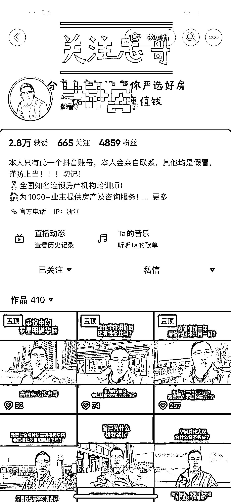
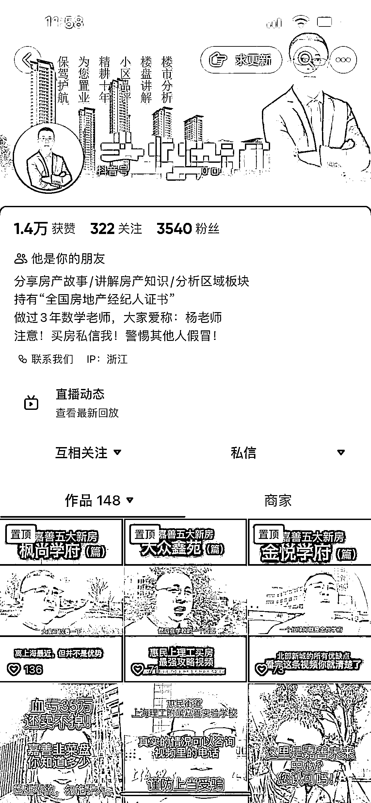
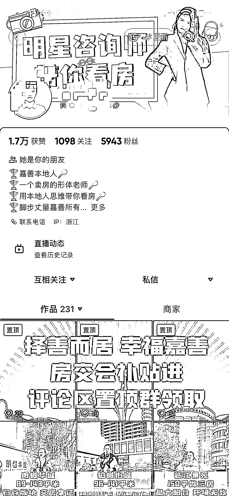
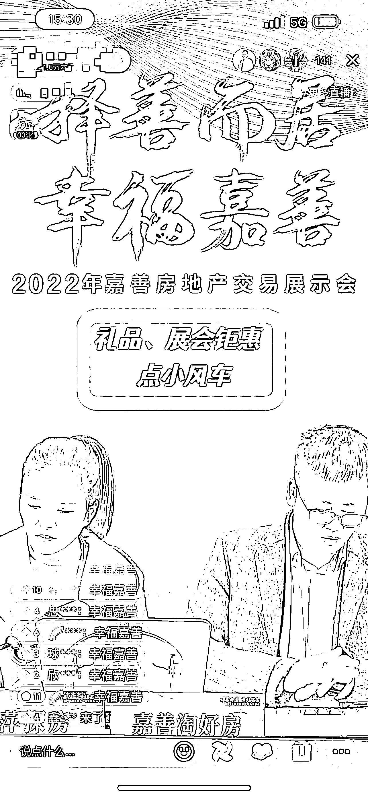
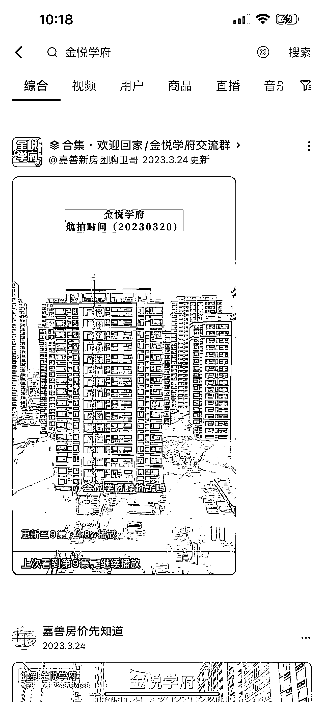
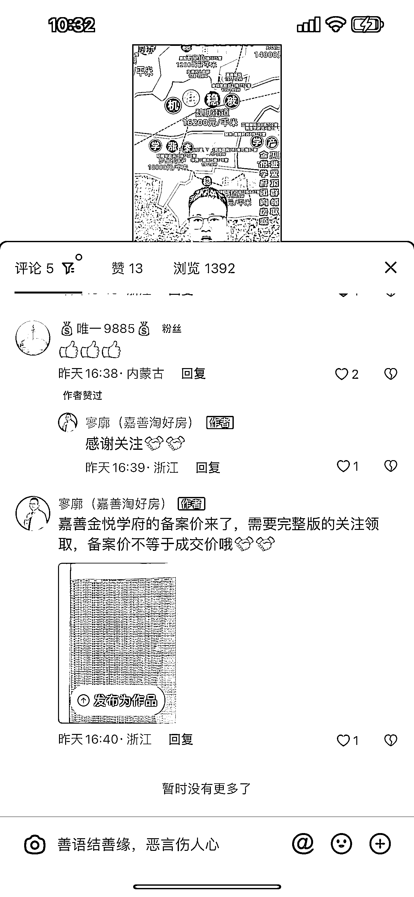
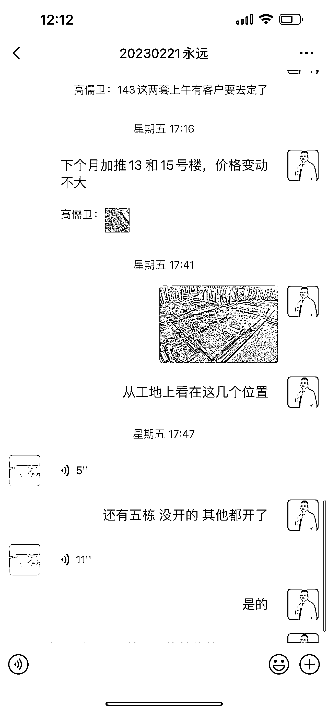
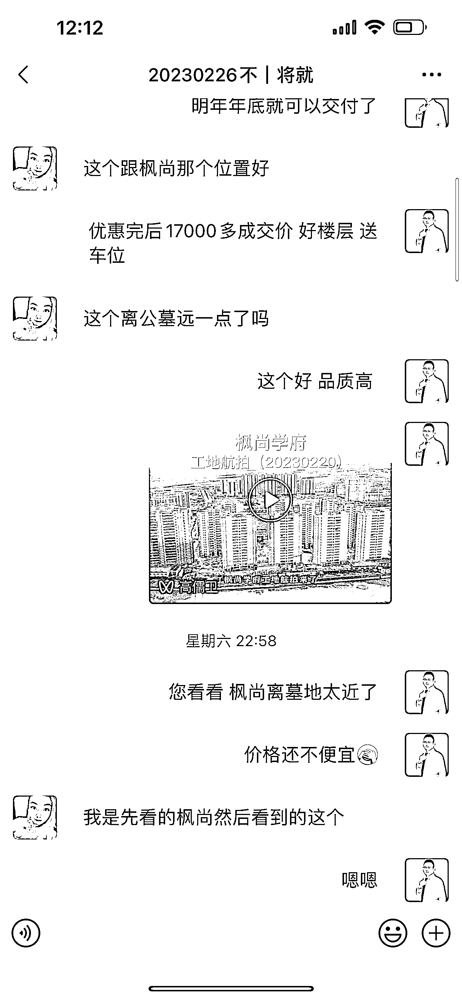
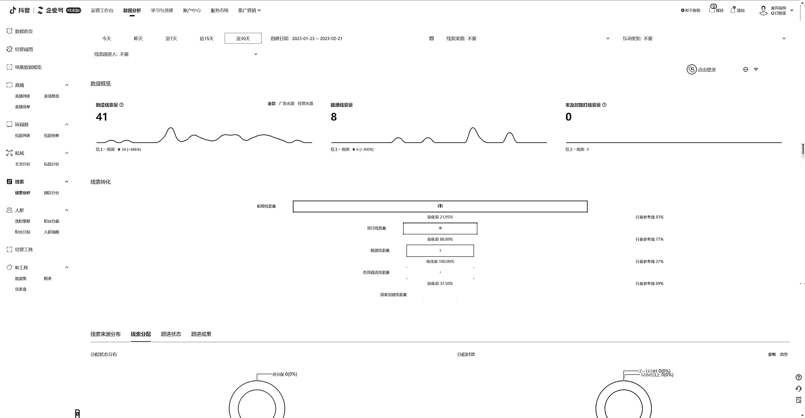

# 《房产 IP 矩阵定位多客群，单月变现 50W+的经验分享》

> 原文：[`www.yuque.com/for_lazy/thfiu8/moh27uy6gkz9hi52`](https://www.yuque.com/for_lazy/thfiu8/moh27uy6gkz9hi52)

## (150 赞)《房产 IP 矩阵定位多客群，单月变现 50W+的经验分享》 

作者： 高儒卫 

日期：2023-04-14 

你有见过这样的房产类视频吗？有的用本地方言介绍房子；有的到外地探访别人的房子；有的采用航拍效果讲解房子……这类视频，其实都是在通过打造不同的 IP 来做房产销售，而且还有可能是同一个团队做的，其目的就是吸引不同类型的精准用户群体。 

我们团队五个人，从去年开始做房产 IP 矩阵，目前已经实现月稳定变现 50W+ 了。接下来，我通过以下六点和大家分享房产 IP 矩阵账号的玩法。无论你是用户还是账号操盘手，相信都会有一定的参考价值，也欢迎大家一起交流讨论更新的玩法。 

1、赚钱的房产 IP 是怎么样的？ 

2、为什么要做房产 IP 矩阵？ 

3、如何搭建房产矩阵 IP 

4、短视频 + 直播两条路走得更稳； 

5、如何提升转化率 

6、过程中的经验分享 

  

从事房产行业，14 年在上海开过房产投资公司，16 年因上海限购升级转战环沪，从事房地产营销全案代理，通过百度、360、安居客、房天下等线上引流实现首开业绩第一、销售额超 3 亿。 

后因房地产持续下行结束了之前的公司，19 年看准短视频赛道，开始做抖音账号，期间断断续续，直到 21 年加入生财之前已没产生什么结果。 

转变是从刷精华帖加实践，从此对做抖音认知升级，到加入孤狼老师的大航海一期，后面二期，三期，在去年 10 月开始每个月稳定变现 50+。 

  

不以赚钱为目的的房产 IP 都是耍流氓，以终为始，因为房产的高客单价、区域性强、抖音对房产这块的严控等特殊属性，所以从开始起号就要考虑清楚账号的名字，头像，头图和备注以及要给粉丝的呈现视频形式，目前我们的账号以探房和口播为主； 

（1）探房客群更精准，这块配合抖音 SEO 效果会更好，有长尾效应，留好钩子后会起到更好的效果。这块需要注意的是文案里面的关键词要选好用好。 

我们探房号一个找的是本地达人，方言配合关键词，不管是在抖音搜索还是本地人客群的选择上，有更好的优势，一般本地粉丝更愿意相信本地人，有一个差异化，单视频平均每天留电 8 组； 

另一个探房号是外地达人，从业年限长，经验丰富，形象气质已不错，能吸引一部分外地粉丝和上海限购买环沪的客户群体，平均每天留电 5 组左右。 

（2）口播客群相比来说比较宽泛，文案也要去多设计，关键要有冲突，要有自己的观点，也要配合抖音 SEO 去做，人设打好了，客群信任度比较高，目前我们有两个达人主要已是做的口播，视频平均每天留电 3 组左右。 

我自己的抖音号做过口播，探房，都不怎么理想，目前改变形式，靠航拍讲解效果都比口播，探房好，目前是航拍加直播的展现形式去做，效果还可以； 

 

高客单比价策略，不同形式做，让客户认为我们不是一起的，这样会更好，让客户多对比，背后其实都是我们一群人，大家都买过房，不管去买新房还是二手房，基本上手上销售或者中介不少于 10 个吧。 

在抖音同样的原理，粉丝会问很多人，出于这一点考虑，我们开始做矩阵 IP，通过不同的形式去网客户，就像钓鱼一样，用鱼竿一次只能钓一条，用网就不同了，单个 IP 配合多个 IP ，效果好。 

而且还可以起到背后相互打配合的作用，还有很关键的一点是前期起号变现有一定周期，目前我们能做到一个账号半个月就能稳定获客开单了，很多人基本上半年都开不了，大概率都会放弃，设定好分成比率，能做到 1+1>2; 

 

目前五个人，平均一个月 15 单左右，变现 50 来万，每天更新的账号有五个，要保持日更和直播其实真不容易，前两天看生财大佬分享的日剪辑上百条不错，接下来可以去试试； 

当下不管是开发商销售还是中介都由之前线下发传单或者打电话逐渐转移到抖音这块了，大家都想低成本获客，竞争已加大了。 

我这边是环沪的小县城，关注房产的就那么多，流量在分流，所以接下来要更大的曝光就得多账号去发视频，发优质视频，文案还得深挖。 

所以接下来我们除了口播和探房视频外，会重点去发楼盘项目的航拍视频，拍好配音，这样效率会更高些； 

接下来重点拆解一下这五个账号是怎么做的，从最新的重客率来看，做矩阵 IP 是太有必要了，经常能发现不同的粉丝在同行的评论区和直播间，我们自己已能发现，所以客户都会多看多比较 

（1）嘉善杨老师讲房和嘉善忠哥选房主要以口播为主。 

起号阶段以发大家关心的房产问题为主，等基础粉丝完成后再发区域垂直视频热点，这种流量话题基本上都是自嗨型的，对变现没有多大作用。 

到第三步就开始针对板块的新房做客观的分析，各楼盘之间的优劣势，真诚输出真人出镜建立人设，通过钩子设计吸引的粉丝基本上都是真正短时间考虑买房的客群了，注意一些违禁词语的使用 [【最全违禁词】直播高频违规行为规范.pdf](https://ivwbamr5lt.feishu.cn/file/boxcnWF9rDxRYllsJ4DR6zdgKpf) 

 

 

（2）春萍探房和善昱探房主要以新房和二手房楼盘介绍为主。 

从最开始就是比较垂直的，发的视频都是围绕房子去发，客群已比较直接，只要账号蓝 V 认证或者资质认证后，基本上的内容都可以发，线索会好于口播号，同样是真人出镜去拍摄，一个上午可以拍一周的视频使用。 

这里刚开始起号的时候找几个本地豪宅，大家都知道的热点盘去拍摄，这样流量已会大不少，能快点把号起来。 

 

 

这里很关键的一点是选达人，根据达人去拍符合他人设的视频，每个账号的定位就能定哪一面的客群，做矩阵 IP，账号交叉定位会更好； 

去年房交会，相关部门邀请我们去给政府宣传直播，已是看中了多账号直播的影响力。 

 

 

（3）做什么样的内容引流比较好呢？ 

刚开始的时候我们走了很多湾路，发的视频虽然流量大自嗨型蹭热点，一点用都没有，评论区全是不买房的，而且其他城市很多同行已能刷到，评论区好多是同行。 

论对于房产的特殊性，区域性比较强来说，这不是好内容，好的内容一定是吸引精准客群的内容； 

（4）我们是怎么做的呢？ 

首先营销性不要太强，其次是根据客户真正关心的东西去持续性输出，无非就是地段、学校、商场、交通、规划发展以及担心买了房子会站岗，我现在用航拍配合全景去制作视频，同时通过地图直播的形式去录播，作为视频去发布。 

目前已会通过抖音 SEO，选好词后在直播和视频中去体现，最近我们的号已经霸屏了，这样的客户目的性更强更精准。怎么做好抖音 SEO 在我们的航海手册里面太清楚不过了，连接里面好好看看[https://search01.shengcaiyoushu.com/docx/AekudxFR6oRiwmxYlePcReAAn5f](https://search01.shengcaiyoushu.com/docx/AekudxFR6oRiwmxYlePcReAAn5f) 

最近我发现了一个玩法，售楼处不是都会公示五证、不利因素以及备案价吗，我把热点楼盘都拍了一遍，在之前和之后的视频下面去评论，可以大大提升完播率，真正想买房的客户肯定会认真看完，毕竟几百万不是小事。 

 

 

 

 

 

目前短视频门槛低竞争比较激烈，除了日更短视频外，我们目前主要配合直播一起用，直播时效性高，能更好的树立人设。 

有一定的门槛，不是每个人都可以做的，主要集中在晚上八点到十一点这段时间直播，目前遇到的问题就是同时在线人数没有大的突破，不过不影响效果，之前是有空就播，接下来会固定好时间； 

目前使用的是直播伴侣 通过航拍和地图去讲解项目，让粉丝朋友能更直观的了解项目信息。 

需要注意的是开播之前需要新建好组件预约，开播的同时给他挂上，这样可以避免一定的风控，少强制断播，[直播小风车——图文教程（3.17）](https://bytedance.feishu.cn/docs/doccnhRfE77VTnOSrH3Y0jlBsqe) 视频同时已会发视频号，开始已有留电了。接下来也会多去关注这块的信息。 

 

任何产品都要去交易，房产如何提升转化率呢，这特别考验销售的综合谈判能力，我们几个达人都是从业五年以上，每个达人这块都有一定的承接能力。 

我们之前有个探房账号，留电视频直播都不错，最快死在了最后一步，复盘调整策略后，效果有了明显的提升，确实有的人适合做流量，有的人适合做转化； 

（1）探房号我们会配合自己的讲解加上航拍，加微信后会第一时间发给客户，这样体验瞬间就不一样了，视频号转发给客户，这个功能挺好用的，这样可以流水线的把基本问题讲清楚。 

（2）私域的运营这块已很关键，我有不明白的，就会把生财精华帖当字典检索出来，看一看用一用，实测很香。 

多发朋友圈转化，通过朋友圈展示个人实力和交付的结果，非常重要，这块很重要，接下来已会重点去做。 

当日引流的客户以日期备注好，发航拍视频，客户体验更好。 

 

 

 

（3）短视频和直播对应的流量如何更好的承接到变现呢？ 

除了上面基础的沟通之外我们自己总结了一套自己的玩法，可以看看 

带看前一天的策划： 

1）自驾客户今天一定要安排交叉拖底方案。 

2）自驾客户想一下明天如何转盘？ 

3）明天案场销售指定谁？今天就要和销售预约好。 

4）带看路线规划好。 

5）安排和客户是老乡的带看搭档（这点非常重要） 

6）专车接送（提醒让客户带上家人一起来） 

7）邀约盘，炮灰盘，主打盘（每一个楼盘的房源销售政策提前摸透） 

8）2+1 模式必须落地 

9）带看搭档提明确好，谁负责促销？谁负责主攻？ 

10）报备细节再过一遍。 

11）提前拉群客户情况及时沟通， 

特别提示： 

低价吸引来的客户，如何打配合圆回来？谁来配合，如何配合？ 

专车接送/家人陪伴/选好搭档/带看路线/转盘细节/案场销售/楼盘体量/ ABC 促销 

 

（1）短视频内容大于一切，播放少不是账号的问题，专心打磨内容就行，关于账号的定位，起号的方法大家可以多看看之前的抖音商业 IP 航海手册，很实用； 

（2）达人的分成比例要设定合理，不然账号做起来了达人就单干了，尽量找强流量弱转化的会好些 ； 

（3）单个账号上限就矩阵，效果已不会差； 

之前都是在家里办公，今年租了一个门店和一个写字楼，门店承接二手房多一些，写字楼主做新房，直播已比较安静，希望会越来越好。 

更多实践可以看看我之前的航海分享，谢谢大家[我的生财之路【高儒卫】](https://ivwbamr5lt.feishu.cn/docs/doccnuSL0SMMN5N8YBO7M2KNJYd?from=from_copylink) 

 

 

 

 

 

评论区： 

财女小马达 : 分享给一个房产朋友 郑智超 : 高老师您好，我们是一个创业团队，目前在做针对房产直播的地图工具，已经有一些种子客户在使用了。不知道是否有兴趣聊聊[呲牙] 大虎 : 感谢分享 高儒卫 : 多多交流[握手] 高儒卫 : [握手] 高儒卫 : 可以呀 我现在已在用一些地图[握手] 孙伟悦 : 半个同行，我之前在阳光城和旭辉做营销经理，现在已经转战线上开公司了[握手] 高儒卫 : 哈哈，我已在旭辉做了三年[握手][握手]