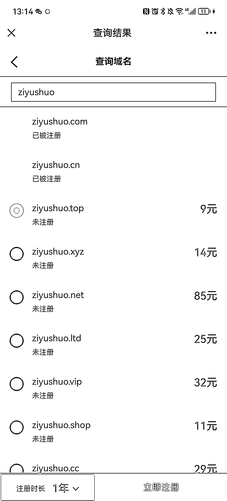
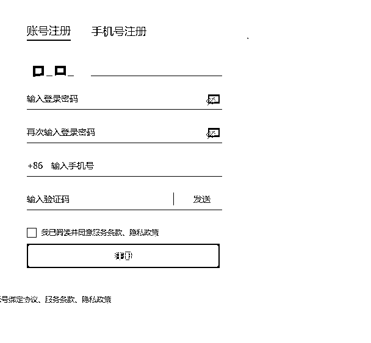
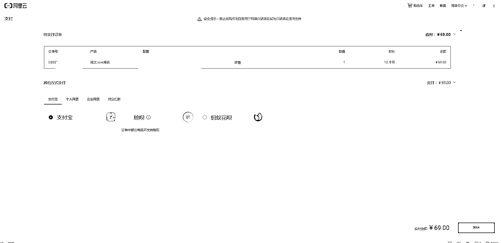
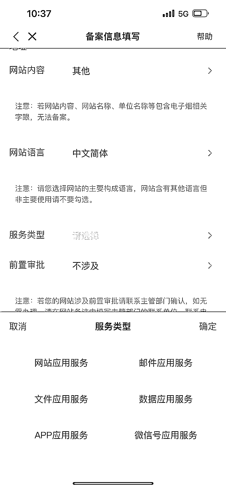
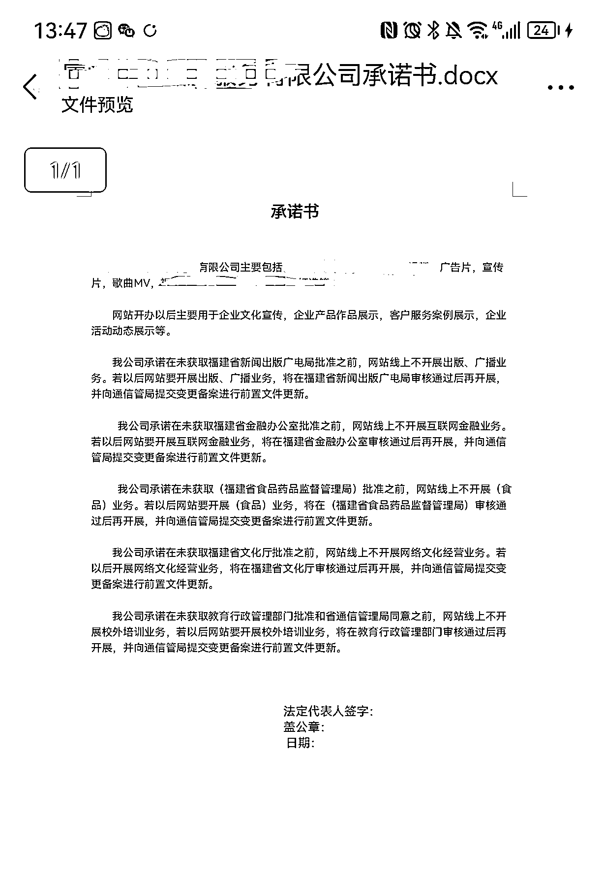
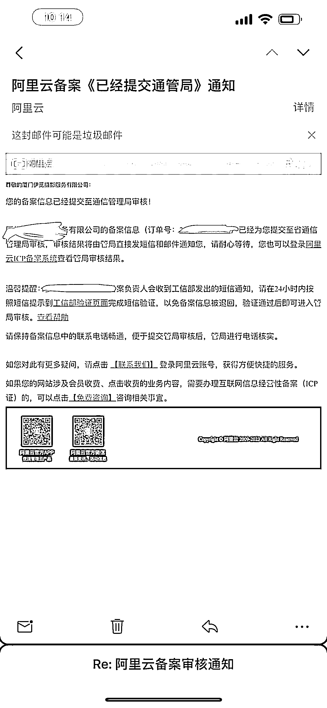
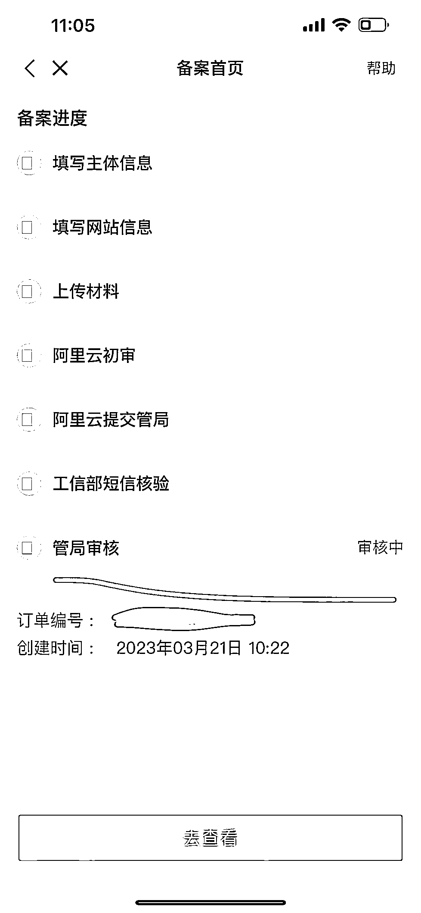
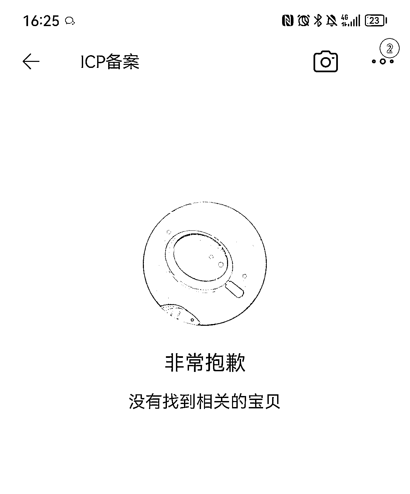
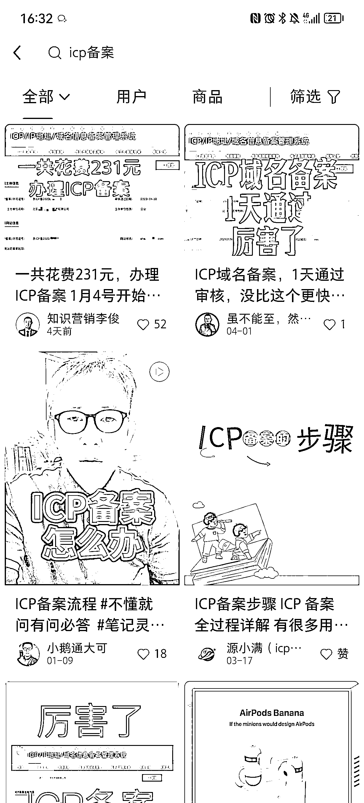
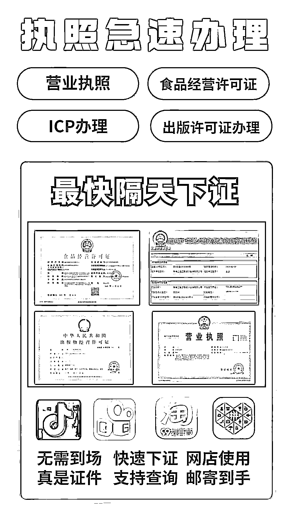

# 《通过办理 ICP 备案，挖掘到一个可以长期稳定，月入过万的副业》

> 原文：[`www.yuque.com/for_lazy/thfiu8/bmme5itmry0hhrkw`](https://www.yuque.com/for_lazy/thfiu8/bmme5itmry0hhrkw)

## (48 赞)《通过办理 ICP 备案，挖掘到一个可以长期稳定，月入过万的副业》 

作者： 蓝子鱼 

日期：2023-04-10 

上个月有朋友要办理 ICP 备案，让我帮忙找一下，我去淘宝找了两家，一家开价 800，一家开价 500，但是 800 的在本地，所以选择这家 800 的，资料提交到华为云后台审核的时候，显示经营类目带有食品经营，代办的说要把食品经营给移除经营范围，不然谁也过不了。 

后面她又找了其他人推荐两个代办，有一个人看到经营范围比较多，直接加价到 1000 才能给办，还说注册公司选太多范围，要付出代价，要加钱。另外一个说里面有教育咨询要移除掉，不移除也办不了。 

最后有一个朋友介绍，给他们办 ICP 备案的商家，域名要自己付钱，如果认证不过会退钱，最这个营业执照经营范围没有改变，也办理下来了，上次参加视频号航海，有一个圈友花了 600 块在淘宝办的，发现这个行业没有一个标准的定价。 

我朋友每找一个人的时候都会拉我进群，通过这次办理的过程，挖掘出可以代办理 ICP 备案的业务，本来是分享给我朋友，但是他最近有事比较忙，所以分享出来给想找副业的朋友。 

现在视频号要上架虚拟课程都需要 ICP 备案，或者 ICP 认证。现在很多人都需要，没有 ICP 备案就没办法在视频号上架课程，所以就有人专门代办 ICP 备案或者 ICP 认证，相信生财里面很多圈友就需要这样的服务。 

一、如何办理 ICP 备案 

ICP 备案：英文全称：Internet Content Provider，中文全称：网络内容提供商。ICP 可以理解为向广大用户提供互联网信息业务和增值业务的电信运营商，是经国家主管部门批准的正式运营企业或部门。 

在抖音，视频号上传自己的课程都需要 ICP 备案网站上的截图，需求还是比较大的。 

还有一个证是 ICP 经营许可证，这个要提交的资料就更多了，认证也更加严格，对公司成立时间，医社保都会有要求，暂时我们不讨论这个，后期有资源也可以对接人来做。 

办理 ICP 备案流程： 

先让客户付钱，开一家淘宝店，客户付完钱才开始办事。 

第一步：去万网阿里云注册一个域名 

网址：[https://wanwang.aliyun.com/domain/tld?spm=5176.27916026.J_8455036360.1.5d903ec62rvEX0#.com](https://wanwang.aliyun.com/domain/tld?spm=5176.27916026.J_8455036360.1.5d903ec62rvEX0#.com) 

进去以后输入你想要的域名，查询是否有人注册，没有人注册的可以选，价格不一样，一年几十块钱。 

 

①注册万网账号 

 

②购买网址需要的资料： 

公司营业执照，经营范围 

创始人名字，手机，身份证 

一个可以收到验证码的邮箱 

③填写完资料以后等待审核 

④审核成功以后付钱 

 

⑤法人下载阿里云 APP，需要扫脸验证 

 

这个账号密码，就是注册万网的那个账号密码 

登进去以后，点最下面的控制台 

 

进去选择 ICP 备案 

 

然后填写资料 

 

下一步进入备案资料填写，其中有一项写着不涉及的，要选网站应用服务。 

 

下一步有需要用扫描身份证，所以一定要提醒带身份证，还有法人找到白色背景拍照上传，上传好了就等待阿里云审核，这期间会有打电话过来，一定要注意接听。 

 

审核成功通过以后，如果营业执照里面涉及需要办证的，但是自己又没有相关证件，那就需要提交承诺书，承诺书可以在阿里万网那边找，每个省份要求不一样。 

 

提交承诺书以后就等通讯管理局审查 

 

要注意接收短信，收到短信以后，点短信验证，才可以进入备案排队当中。 

 

完成短信验证以后，就进入通讯管理局的审核，正常 7 到 20 天下来，大部分一周左右就可以下来，在阿里云 APP 也可以查看审核结果。 

 

没什么问题就通过了，如果有问题再根据问题进行调整，很多问题主要出在经营范围，如果你公司经营范围里面有，但实际没有经营，就需要写承诺书。 

备案查询网站：[https://beian.miit.gov.cn/](https://beian.miit.gov.cn) 

输入营业执照名称就可以看是否备案成功。 

注册的时候选择阿里云，不要选择华为云，华为云审核比较严。 

目前的收费，淘宝高的 800，低一点的 500，建议可以原价 800，现在公司十周年优惠价 500 元，不过全额退款。 

二、如何获取精准意向客户 

做这个项目除了要知道如何办理 ICP 备案，更重要的是要掌握获取客户和商务谈判的能力，要学会利用线上平台低成本获客。 

1、淘宝获客 

在淘宝开店是这个项目里面比较关键的一个点，因为很多都是线上没见面的客户，直接转微信信任成本比较高，所以需要一个淘宝店来收款。 

如果自己暂时没办法开淘宝店铺的，也可以找已有的财务公司进行合作，让客户拍他们的链接，然后你们再去结算。 

我 3 月份找的时候还在淘宝可以搜索 icp 备案，现在不知道什么原因，已经查不到了，但是可以用来收款。 

 

2、小红书获客 

小红书是目前我能想到最适合获客的平台，获客的方式也比较简单粗暴，就是分享办理 icp 备案的流程，有流程很多人还是不会，这时候就可以帮他们办理。 

 

 

最近淘宝不知道为什么下架 icp 备案相关的搜索词，这样流量就全在自媒体和搜索引擎里面，搜索引擎比较费钱不适合个人来做，所以小红书就非常合适，多做几个号，做好内容模板，矩阵获客非常舒适。 

做小红书账号要注意的三个点： 

①账号搭建要专业，从头像，昵称，简介，内容风格，让人一看就觉得你很专业，特别容易信任你。 

②不仅要分享办理 icp 备案的流程，更重要的是要展示你的实力，你每天都有客户 icp 备案下来，这种内容特别容易吸引精准客户。 

你分享教程吸引的是想学习如何办的，白嫖党会非常多，如果分享多少钱能办下来，那来的都是精准付费用户，内容决定吸引的人群。 

③引流路径要搭好，让精准目标客户能够主动加上你，需要在文章或者评论区，悄悄留下联系方式，小号带带节奏。 

3、客户转介绍 

我们就是通过其他人的介绍，最后找到这个人办理下来的，所以私域客户转介绍也非常重要。 

私域朋友圈打造非常重要，有些人加过来不一定会立马下单，会先观察你的朋友圈一段时间，所以你的朋友圈也非常重要，可以分享你办理什么业务，经常晒一些成功案例。 

开始加客户之前，先加十个同行，把一些朋友圈搬过来发十几天，这样客户加过来看到的就是你已经发很久了，而不是一个空白号，可以快速建立信任感。 

客户咨询的时候要耐心一点，有些客户就是比较啰嗦，但是不代表她不会买单，她有这个需求，那她的圈子也会有，有可能会有转介绍。 

三、通过这些客户重复变现，增加收入 

本来是想给朋友做，所以不同渠道的收益也都有问过，大家可以做一个参考。 

1、与财务公司合作 

注册 ICP 备案的前提是要有公司，有些人目前还没有公司，所以需要先注册一个公司，就可以与财务公司合作，包括公司注册，代理记账，地址挂靠，还有一些杂七杂八的证件。 

包括我们遇到的第一个，承诺书没写好，一直过不了，就需要更改经营范围，这些也是财务公司可以接的业务。 

最近也更好几个做财务的朋友聊天，一单的分成至少 500 以上，当然不同的情况价格不一样，可以拿 cps 分成，也可以直接卖线索。 

2、抖音小店入驻，开抖音橱窗，视频号上架课程，小红书商店资质 

这些博主把课程和证件做出来以后还要上架到平台上面，就需要入驻，开橱窗这些功能，他们的时间很宝贵，有些人就愿意花钱找人办事，节省时间，像生财风向标里面的一些抖音相关的，比如一个实名认证多个抖音账号，绑定 50 个员工号等等，都可以作为相关业务。 

最近大家在做小红书店铺，食品的需要食品经营许可证，卖书的需要出版社经营许可证，这些都是可以进行对接的，自己把流程走一遍就知道如何申请了。 

 

3、与知识付费平台合作 

办理 ICP 备案的大部分都是知识博主，他们也需要线上平台来交付课程，可以跟这些平台的销售进行合作，目前了解到小鹅通这个渠道能给到的是 10%，包括最近抖音不能上架课程，很多人也会有购买小程序的需求。 

4、知识付费的课程和社群 

有些人有卖课的想法，但是自己还没有课程，所以还需要学习如何更快的把课程做出来，这也是一个需求，可以在朋友圈分销相关的课程。 

有些老师会做课，但是不会卖课和社群运营，可以推荐相关的课程，包括生财有术的拉新，这些也是精准意向用户。 

在与客户交流的过程中，也可以发现很多客户的需求，可以自己来接，也可以把客户介绍给其他人拿佣金。 

现在平台之间的竞争非常激烈，政策也一直在变化，有些副业只能做一阵子，我觉得帮人办理业务的这个可以长期去做，只要在互联网平台做生意就需要这些证件，而且随着制度的完善，需要的证件越来越多，是一个不错的项目。 

有些新朋友可能短期还没有能力全部自己做，也可以找人合作，有些人专门办理 icp，有些人专门负责在小红书获取客户，合作共赢才能更快赚到钱，希望这个项目能够帮助到一些人圈友，生财航海里面就有很多圈友需要这些业务，好好服务他们，都能有不错的收入，有了口碑还有持续不断的转介绍。 

评论区： 

汉宜 : 要办一个，如何联系你呢 蓝子鱼 : ➕我：lanziyu0721 布衣 : 万网目前备案要方便一些，这个可以自己去办，前期是阿里那边预审核，有问题阿里那边都会给你打电话让你如何去修改，你按要求改了就行 蓝子鱼 : 是的，就是在万网里面备案 袁咩咩 : 牛 Yang_ : 请教个问题，填写网站运营者时，如何解决自己收不到阿里云的回访电话，是运营人名写公司的，手机号 邮箱号填自己的吗 蓝子鱼 : 建议是尽量填法人的吧 猫哥 : [捂脸]这个我去年干过，主要做的腾讯备案，是比较简单的，去年也接了单帮别人搞。备案多了会提示要网站运营计划书，要 IP 地址和备案地一致等问题。备案成本很低，相当于就一个域名费用 + 服务器备案码。自己备案域名可以直接再企业微信领取，相当于 0 成本了。