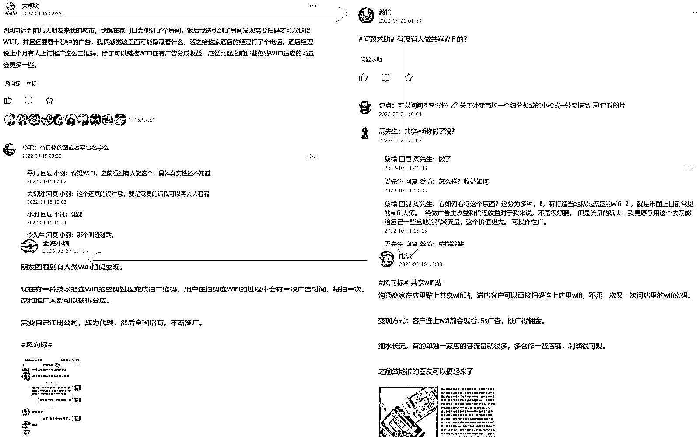
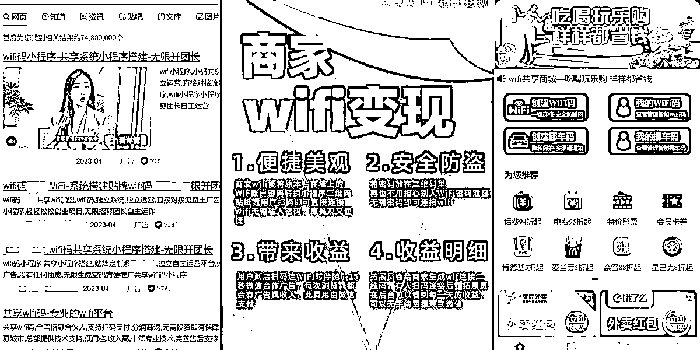

# 《共享 WiFi 码项目拆解之基础篇》

> 原文：[`www.yuque.com/for_lazy/thfiu8/xfgrqebnxh3pn3ey`](https://www.yuque.com/for_lazy/thfiu8/xfgrqebnxh3pn3ey)

<ne-h2 id="405f740c" data-lake-id="405f740c"><ne-heading-ext><ne-heading-anchor></ne-heading-anchor><ne-heading-fold></ne-heading-fold></ne-heading-ext><ne-heading-content><ne-text id="u437e455e">(30 赞)《共享 WiFi 码项目拆解之基础篇》</ne-text></ne-heading-content></ne-h2> <ne-p id="u8e023d04" data-lake-id="u8e023d04"><ne-text id="ub418841f">作者： 大风</ne-text></ne-p> <ne-p id="ue079fac7" data-lake-id="ue079fac7"><ne-text id="uaa1781ea">日期：2023-04-13</ne-text></ne-p> <ne-p id="u562a6cf7" data-lake-id="u562a6cf7"><ne-text id="u58224ecb">大家好，我是大峰，生财航海家，互联网 8 年从业者，主要服务于 B 端客户</ne-text></ne-p> <ne-p id="ubfd547d6" data-lake-id="ubfd547d6"><ne-text id="ubca3fa9e">关于 WiFi 码，其实目前是比较热门的，不少从业者正在这个赛道上捞钱。但是咱们的生财圈里，详细的讲解暂时不多</ne-text></ne-p> <ne-p id="u5ac76688" data-lake-id="u5ac76688"><ne-text id="ua52a1a01">这个项目在生财从去年开始就有人中标，最早是去年的 4 月 15 日，圈友大柳树发的帖子；进入 23 年，上个月有 2 个关于 WiFi 码的中标。只是不知道有没有圈友进入这个赛道，继续深耕。接下来我抛砖引玉，从我的视角来聊一下 WiFi 码项目</ne-text></ne-p> <ne-p id="u5ff8c8c4" data-lake-id="u5ff8c8c4"><ne-card data-card-name="image" data-card-type="inline" id="r8r8z" data-event-boundary="card"></ne-card></ne-p> <ne-p id="uca831de0" data-lake-id="uca831de0"><ne-text id="u5064f4ae">关于 WiFi 码项目，我仔细做了下市场调查，发现这个项目虽然不大，但真要详细的把它写完整，还是需要花点时间的。</ne-text></ne-p> <ne-p id="uaedfa2e7" data-lake-id="uaedfa2e7"><ne-text id="u0da5c8ab">基于此，我把它拆解成三部分。分别是基础篇，招商加盟篇和个人创业篇。接下来，我会尽量简洁的把这个项目拆清楚。（对共享 WiFi 码项目感兴趣的小伙伴可以在下边扣 1，大峰会尽快完成交稿。）</ne-text></ne-p> <ne-p id="uc08a5e24" data-lake-id="uc08a5e24"><ne-text id="u1619bd69" ne-bold="true">今天是第一部分，共享 WiFi 码项目拆解之基础篇</ne-text></ne-p> <ne-p id="ub56ba162" data-lake-id="ub56ba162"><ne-text id="ua09979d9" ne-bold="true">WiFi 码的发展：</ne-text><ne-text id="uc33619ab">共享 WiFi 码最早诞生于 21 年 6 月份，后来投入商业化，到 22 年上半年，只有部分地推团队在做这个项目。</ne-text></ne-p> <ne-p id="u157e0e59" data-lake-id="u157e0e59"><ne-text id="u4cc633bc">22 年第三个季度开始在网上火起来，当时不少发相关视频的小伙伴流量都还不错。</ne-text></ne-p> <ne-p id="ufbe14699" data-lake-id="ufbe14699"><ne-text id="u85dcfe46">进入 23 年，继去年 YQ 结束，实体店全面复苏，共享 WiFi 码热度更是有增无减。</ne-text></ne-p> <ne-p id="uc1170ed5" data-lake-id="uc1170ed5"><ne-text id="u0ecfe992">创业成本低，管道收益可观，市场前景好等等关键词，都是该项目火爆的原因。</ne-text></ne-p> <ne-p id="ucd1d3ee6" data-lake-id="ucd1d3ee6"><ne-text id="uccc2f206" ne-bold="true">共享 WiFi 码工作原理：</ne-text><ne-text id="ue097a39e">共享 WiFi 码工作原理非常简单，就是通过后台把 WiFi 绑定到 WiFi 码贴牌，然后再贴到桌子或墙上。</ne-text></ne-p> <ne-p id="u9cdcd6f8" data-lake-id="u9cdcd6f8"><ne-text id="u7dc5f7be">客户直接使用手机扫码就可链接 WiFi，无需手动输入繁琐密码，快捷方便。</ne-text></ne-p> <ne-p id="u82599f90" data-lake-id="u82599f90"><ne-text id="u1f76a1e1" ne-bold="true">共享 WiFi 码盈利逻辑：</ne-text><ne-text id="u47889d82">客户扫码链接 WiFi 的过程中，会观看 15 秒左右的视频广告，观看完成之后，即可产生 0.3 元-1.5 元的广告费（绝大多数是 0.3 元以下，很多宣传的比较高，慎信），商家和推广者来分这个费用。</ne-text></ne-p> <ne-p id="u4d8dc702" data-lake-id="u4d8dc702"><ne-text id="u8508189d" ne-bold="true">WiFi 码存在的必要性：</ne-text><ne-text id="u9ad6dfe9">。</ne-text></ne-p> <ne-p id="u4005a832" data-lake-id="u4005a832"><ne-text id="u02a8016f">WiFi 码作为一个场所类的应用，适合有实体店且顾客较长时间在实体店活动的场所</ne-text></ne-p> <ne-p id="uf6dae2ff" data-lake-id="uf6dae2ff"><ne-text id="uf2257e05">比如：饭店，咖啡馆，茶室，棋牌室，台球厅，体育馆，图书馆，甚至自己家里。</ne-text></ne-p> <ne-p id="u1eb745b1" data-lake-id="u1eb745b1"><ne-text id="u92f6dbb9">其实，所有有 WiFi 的场所，都可以贴一张 WiFi 码。</ne-text></ne-p> <ne-p id="u407cf721" data-lake-id="u407cf721"><ne-text id="u6c24f6d8">对于商家来说：设置 WiFi 码有以下优点：</ne-text></ne-p> <ne-p id="u9d5e3664" data-lake-id="u9d5e3664"><ne-text id="ub163d276">1.降低沟通成本：商家不用反复跟客户说自家 WiFi 码账号和密码</ne-text></ne-p> <ne-p id="u73495a9c" data-lake-id="u73495a9c"><ne-text id="u69d46e63">2.提升客户体验：解决手输密码的痛点。客户不用手动输入繁琐的 WiFi 密码，且 WiFi 码就放在了面前（桌子等显眼位置）</ne-text></ne-p> <ne-p id="u36c50313" data-lake-id="u36c50313"><ne-text id="u0a4a8eb4">3.增加额外收入：客户链接 WiFi 之前，可设置观看 15s 的广告，增加被动收入。（如果为客户体验，可不设置）</ne-text></ne-p> <ne-p id="u3aa8c724" data-lake-id="u3aa8c724"><ne-text id="u34e88980">4.增加宣传渠道：客户扫 WiFi 码之后，可以自动跳转到商家店面。既展示商家形象，又宣传自家产品。支持在线支付，再主动配合店面活动等，帮助自己提升销售额。（用平台 WiFi 码的一般无此功能）</ne-text></ne-p> <ne-p id="u16557155" data-lake-id="u16557155"><ne-text id="uf37e89fa" ne-bold="true">总结一下：</ne-text><ne-text id="u5507cb0d">共享 WiFi 码从 21 年产生到现在，1 年半多时间里，在发展上经历了从落地到商业化再到引爆的过程。</ne-text></ne-p> <ne-p id="u2196875b" data-lake-id="u2196875b"><ne-text id="udc3d6ad9">究其原因是 WiFi 码具有成本低，可复制，市场大的特点。</ne-text></ne-p> <ne-p id="ua69b6b0f" data-lake-id="ua69b6b0f"><ne-text id="ue70bac0b">虽说共享 WiFi 码在技术上不算创新，但是在模式上是相当创新的，毕竟解决了全民链接 WiFi 需要问老板密码的痛点。</ne-text></ne-p> <ne-p id="uc4965edc" data-lake-id="uc4965edc"><ne-card data-card-name="image" data-card-type="inline" id="TWhKG" data-event-boundary="card"></ne-card></ne-p> <ne-p id="uc194be56" data-lake-id="uc194be56"><ne-text id="u739b0d76">（备注：图片如有侵权，联系删除，谢谢！）</ne-text></ne-p> <ne-p id="u0ebdabbc" data-lake-id="u0ebdabbc"><ne-text id="u083809c0">以上是大部分人对 WiFi 码的了解，接下来，我们稍微深入一下：</ne-text></ne-p> <ne-p id="ucfac583b" data-lake-id="ucfac583b"><ne-text id="u5aa70353" ne-bold="true">WiFi 码入场者的赚钱模式：</ne-text></ne-p> <ne-p id="uca203436" data-lake-id="uca203436"><ne-text id="ucdb42e70">共享 WiFi 码项目发展到现在，主要有三个赚钱模式，</ne-text></ne-p> <ne-p id="u74aa9872" data-lake-id="u74aa9872"><ne-text id="uf690bd3f" ne-bold="true">1.0 模式，我们称之为平台模式，</ne-text><ne-text id="ucbdc7c15">平台模式是 WiFi 码出来到现在的主流玩法。</ne-text></ne-p> <ne-p id="ub3d7a91e" data-lake-id="ub3d7a91e"><ne-text id="ude4d7776">它的玩法主要是，公司搭建一个共享 WiFi 码的小程序平台，招募合伙人，收点押金或加盟费，让合伙人去搞地推。</ne-text></ne-p> <ne-p id="u04e6bfac" data-lake-id="u04e6bfac"><ne-text id="u87661501">这种模式一般是平台给补贴，奖励大多是激活一张码奖励 1 元，成功链接 WiFi 码并看完广告，奖励 0.1-1.5 元不等；当然也有其他玩法，有送 WiFi 打码机的产生利润平分的，也有拉团队自己干的。</ne-text></ne-p> <ne-p id="u52081146" data-lake-id="u52081146"><ne-text id="ubfaccb59">这里边做的较大的一般都是自己开发的源码，当然也不乏有买个不知名源码或者坑位就直接入场的。</ne-text></ne-p> <ne-p id="u0df3b8c5" data-lake-id="u0df3b8c5"><ne-text id="uc7ad4e32" ne-bold="true">2.0 模式，我们称之为卖工具</ne-text><ne-text id="u3250c85b">。他们的主要客户群体是想进入 WiFi 码市场，却苦于没有技术做支持的。</ne-text></ne-p> <ne-p id="u64050f95" data-lake-id="u64050f95"><ne-text id="u320bebb9">许多招商和软件开发上看准这个市场，出了不少 WiFi 码坑位或源码或独立部署。目前价位大多 2000 元-30000 元之间，品质良莠不齐。</ne-text></ne-p> <ne-p id="u6d9bd61e" data-lake-id="u6d9bd61e"><ne-text id="ufd28a587">源码这个行业的水是比较深的，服务器，后续服务，bug 修复，功能更新，版权等都是坑点。想入场的朋友，选择服务商时一定要擦亮眼睛。</ne-text></ne-p> <ne-p id="u1fcc4969" data-lake-id="u1fcc4969"><ne-text id="u460e8809" ne-bold="true">3.0 模式，这个模式我称之为 B 端模式（也叫聚合模式）</ne-text><ne-text id="ud58d4000">，顾名思义这个模式更加完善，整合了小程序大部分功能，这种模式可以更轻松的拿下 B 端客户，并且形成强链接。</ne-text></ne-p> <ne-p id="u598d36ce" data-lake-id="u598d36ce"><ne-text id="ud5e15734">这个模式有一定的门槛（市场和开发），目前做的相对不多（大部分小公司实力有限，无法在这么短时间内就完成独立开发并整合）。</ne-text></ne-p> <ne-p id="ub5231730" data-lake-id="ub5231730"><ne-text id="u84f8e02b">这个模式的详细拆解我们后边再聊，关于变现模式，感兴趣朋友的可以先讨论一下。</ne-text></ne-p> <ne-p id="u66e69b57" data-lake-id="u66e69b57"><ne-text id="uca3d216f" ne-bold="true">总结：</ne-text><ne-text id="ua8d5842d">共享 WiFi 在变现模式上经历了从平台到铲子再到整合的阶段。时间紧，任务重，很多基础其实并不扎实。</ne-text></ne-p> <ne-p id="u4a94b215" data-lake-id="u4a94b215"><ne-text id="u94b29ac9">虽然表面看很多人入场，实则鱼龙混杂，真正能经受住考验的依旧不多。</ne-text></ne-p> <ne-p id="u38aaf233" data-lake-id="u38aaf233"><ne-text id="u51ccba8f">WiFi 码自出现一年多的时间里，因为种种原因，市场远远没有达到饱和。</ne-text></ne-p> <ne-p id="u2a953573" data-lake-id="u2a953573"><ne-text id="ucc83e55d">我去公司楼下吃饭，周围门店都还用着传统的 WiFi 链接方式。</ne-text></ne-p> <ne-p id="ub918a61a" data-lake-id="ub918a61a"><ne-text id="ueaf049d1">感兴趣的圈友可以稍微调查一下自己的周围，看看有没有共享 WiFi 码，是什么模式（平台或聚合），以及体验怎么样？</ne-text></ne-p> <ne-p id="ue77b8af8" data-lake-id="ue77b8af8"><ne-card data-card-name="image" data-card-type="inline" id="ZV9f9" data-event-boundary="card"></ne-card></ne-p> <ne-p id="uae8a8e5e" data-lake-id="uae8a8e5e"><ne-text id="u729df066">（备注：图片如有侵权，联系删除，谢谢！）</ne-text></ne-p> <ne-p id="uccd52d8f" data-lake-id="uccd52d8f"><ne-text id="u477522bd">最后我提一句，生财有术的知识库真的藏宝无数，大家不要只看，一定要下场去干。</ne-text></ne-p> <ne-p id="uf674d8a1" data-lake-id="uf674d8a1"><ne-text id="u1e2bf5b7">亦老大点中标或加精华都是有道理的，如果跟自己相关，一定要好好琢磨，最好下水深挖。</ne-text></ne-p> <ne-p id="udfe9306c" data-lake-id="udfe9306c"><ne-text id="ud588abae">以上</ne-text></ne-p> <ne-hole id="ucde39a39" data-lake-id="ucde39a39"><ne-card data-card-name="hr" data-card-type="block" id="ikMYb" data-event-boundary="card"><ne-p id="ubef8cf4d" data-lake-id="ubef8cf4d"><ne-text id="u0fd5169d">评论区：</ne-text></ne-p> <ne-p id="u2ec6aeb7" data-lake-id="u2ec6aeb7"><ne-text id="u5a66b9c7">一瞬成空 : 可执行性强[愉快]</ne-text> <ne-text id="u380212ae">大风 : 市场大[偷笑]</ne-text> <ne-text id="u2906f300">木头人 : 😂有多少人和我一样，几年没连接过外面的 wifi 了，手机流量够够的</ne-text> <ne-text id="u54086bbe">大龙 dylan : 电量不够[呲牙]，wifi 省电</ne-text> <ne-text id="u0c18a184">金多多 : 没有，我也想找超大流量卡，不卡顿那种</ne-text> <ne-text id="ucbe7142a">乐之 leis : 用的什么卡，可推荐一下吗？</ne-text> <ne-text id="u11afb305">张宇凡 : WiFi 大师项目的开发者路过[耶]</ne-text> <ne-text id="u2641bbec">不明 : 这个挺适合地推团队做的</ne-text></ne-p></ne-card></ne-hole>