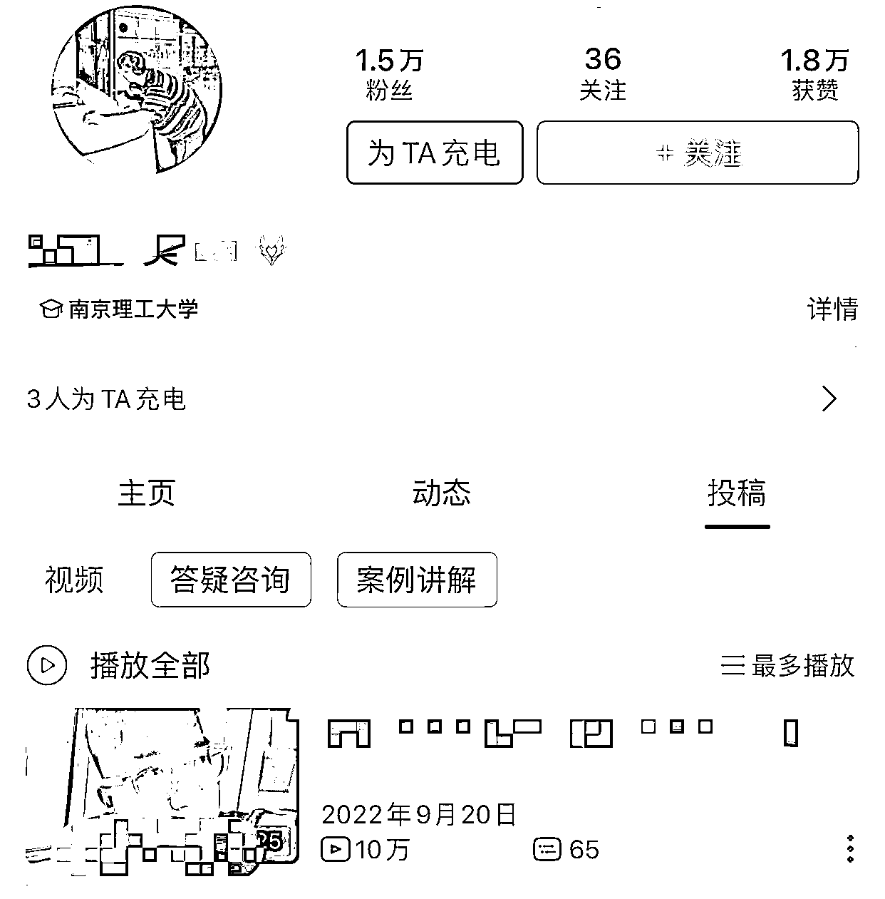
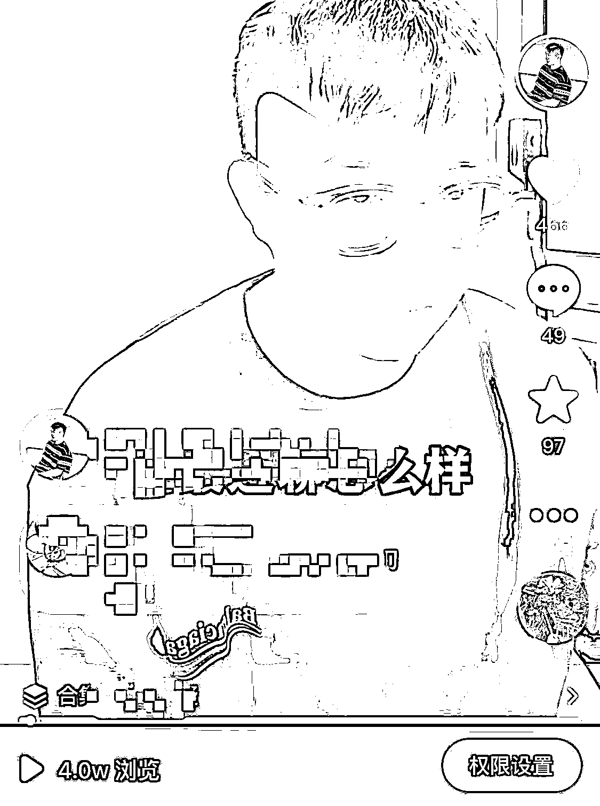
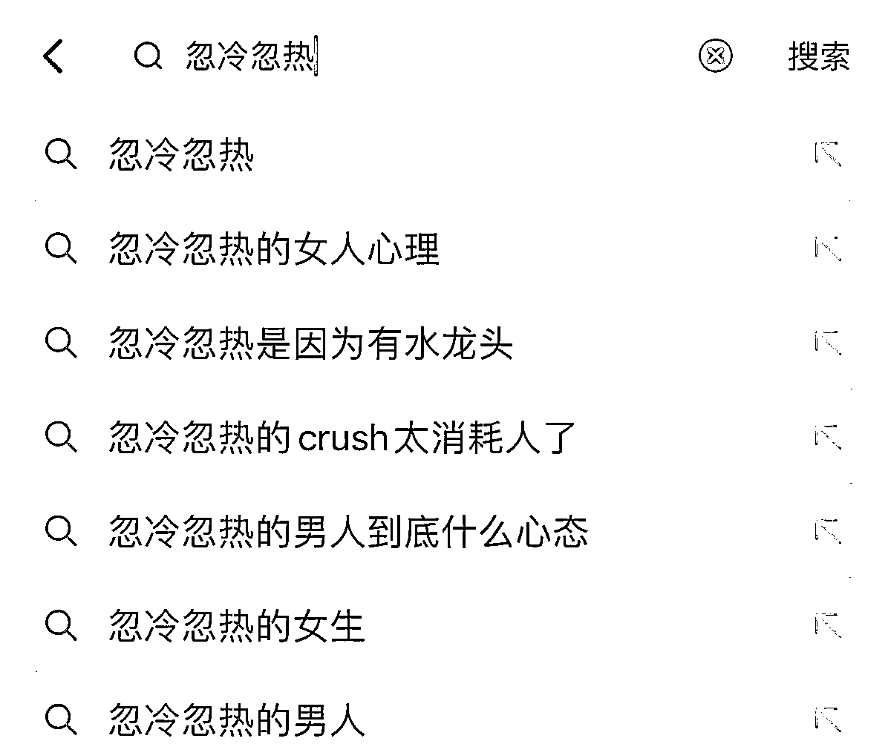
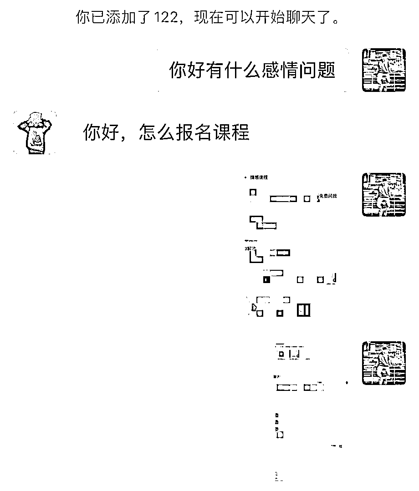

# 《普通人做情感 IP，从 0-1 起盘，单日变现 5W+的体验》

> 原文：[`www.yuque.com/for_lazy/thfiu8/bhnom3nggnhq744e`](https://www.yuque.com/for_lazy/thfiu8/bhnom3nggnhq744e)

<ne-h2 id="82764524" data-lake-id="82764524"><ne-heading-ext><ne-heading-anchor></ne-heading-anchor><ne-heading-fold></ne-heading-fold></ne-heading-ext><ne-heading-content><ne-text id="ud06e85d3">(72 赞)《普通人做情感 IP，从 0-1 起盘，单日变现 5W+的体验》</ne-text></ne-heading-content></ne-h2> <ne-p id="ud7e4b170" data-lake-id="ud7e4b170"><ne-text id="u7ea83c5e">作者： 吴铮</ne-text></ne-p> <ne-p id="u7576e63a" data-lake-id="u7576e63a"><ne-text id="u018a41b2">日期：2023-04-13</ne-text></ne-p> <ne-p id="u87dd928b" data-lake-id="u87dd928b"><ne-text id="u9a8dc47d">大家好，我叫吴铮，之前一直是自主创业，做过淘宝，做过短视频 ，现在是一个情感博主，单日最高变现 5w+，希望和生财的小伙伴们多交流 ，多学习，多认识一些朋友。</ne-text></ne-p> <ne-p id="u73290f32" data-lake-id="u73290f32"><ne-text id="u81c55a43" ne-bold="true">先说成果吧，B 站做了四个号，每一个号基本 1w 粉丝</ne-text></ne-p> <ne-p id="ue9dc5d1a" data-lake-id="ue9dc5d1a"><ne-card data-card-name="image" data-card-type="inline" id="pqLNn" data-event-boundary="card"></ne-card></ne-p> <ne-p id="ub564e573" data-lake-id="ub564e573"><ne-card data-card-name="image" data-card-type="inline" id="KSNhp" data-event-boundary="card"></ne-card></ne-p> <ne-p id="u7bedb4f4" data-lake-id="u7bedb4f4"><ne-card data-card-name="image" data-card-type="inline" id="cgGx8" data-event-boundary="card"></ne-card></ne-p> <ne-p id="u43b8b86d" data-lake-id="u43b8b86d"><ne-card data-card-name="image" data-card-type="inline" id="bZ5Id" data-event-boundary="card"></ne-card></ne-p> <ne-p id="u48826f5a" data-lake-id="u48826f5a"><ne-text id="u77239756" ne-bold="true">抖音粉丝一个 6000 粉丝，一条百万播放</ne-text></ne-p> <ne-p id="uce278ac3" data-lake-id="uce278ac3"><ne-card data-card-name="image" data-card-type="inline" id="OG46i" data-event-boundary="card"></ne-card></ne-p> <ne-p id="u948b5e2d" data-lake-id="u948b5e2d"><ne-card data-card-name="image" data-card-type="inline" id="MAJSI" data-event-boundary="card"></ne-card></ne-p> <ne-p id="u475f054f" data-lake-id="u475f054f"><ne-card data-card-name="image" data-card-type="inline" id="ARxas" data-event-boundary="card"></ne-card></ne-p> <ne-p id="u1766bcaf" data-lake-id="u1766bcaf"><ne-text id="u8d040852" ne-bold="true">另外我的矩阵号也已经跑通 ：</ne-text></ne-p> <ne-p id="ub6875070" data-lake-id="ub6875070"><ne-card data-card-name="image" data-card-type="inline" id="E4Ao1" data-event-boundary="card"></ne-card></ne-p> <ne-p id="ue0f9a7be" data-lake-id="ue0f9a7be"><ne-text id="u79b51b3c" ne-bold="true">看了我这篇，你能够学到什么？</ne-text></ne-p> <ne-p id="uc06346fa" data-lake-id="uc06346fa"><ne-text id="udd656f37">1. 为什么选择男性情感行业 ？</ne-text></ne-p> <ne-p id="u9f42dd89" data-lake-id="u9f42dd89"><ne-text id="ue873266f">2. 我是如何在情感行业做流量，销售，以及设置产品体系的</ne-text></ne-p> <ne-p id="u4f7f22d8" data-lake-id="u4f7f22d8"><ne-text id="u10e2dd58">3. 对情感盘的反思和复盘</ne-text></ne-p> <ne-p id="u00f03c20" data-lake-id="u00f03c20"><ne-text id="u5a458822" ne-bold="true">一，为什么我从事情感行业？</ne-text></ne-p> <ne-p id="u6038f290" data-lake-id="u6038f290"><ne-text id="uf41ae586">那其实跟我的经历有一定的关系，因为我自己之前感情经历不好 ，感情受挫，在感情当中没有主动权，那有段时间我就自己去研究学习，结果学完之后，自己有收获，确实有用 ，同时我也发现周围的男生也遇到过我类似的问题，找我沟通完之后，豁然开朗 ，所以我就在想，</ne-text><ne-text id="u251684b2" ne-bold="true">既然我能够帮助别人，我对这个行业也感兴趣，那我是不是可以也可以利用这一点去赚钱。</ne-text></ne-p> <ne-p id="ubb93e6b5" data-lake-id="ubb93e6b5"><ne-text id="uc1bf6fb6">所以我就准备去尝试了一下，因为当时我有本质工作，做电商，也相当于创业，所以就算这个新项目我做不起来，其实也没啥关系，试试就试试呗</ne-text></ne-p> <ne-p id="ucf8c9f68" data-lake-id="ucf8c9f68"><ne-text id="u9952826b">但是在做的过程中其实我也会有我的顾虑：</ne-text></ne-p> <ne-p id="u9efaccab" data-lake-id="u9efaccab"><ne-text id="u2fe9d901">第一呢，我没什么经验 ，不一定能做的很好</ne-text></ne-p> <ne-p id="u0e195298" data-lake-id="u0e195298"><ne-text id="u2bef9524">第二呢，肯定有很多我不会的地方</ne-text></ne-p> <ne-p id="u9d576885" data-lake-id="u9d576885"><ne-text id="u621e8e10">但是我后面也没想多，先做再说，做的过程中，不断地学习呗 ，能力也是慢慢一点练的，当时我也对短视频知识运营一点也不知道，只是看别人怎么去拍，我就直接模仿去做了。</ne-text></ne-p> <ne-p id="uc5bfb7b2" data-lake-id="uc5bfb7b2"><ne-text id="uca71e942">所以一开始我是现在 b 站做的一个号 ，那个号起来很快 ，我就是去讲了讲我自己的感情经历 ，我对我感情的一些看法，然后去录制视频 ，当时也没有想这么多，结果视频发出去之后，视频就爆了，用户对我很认可，大家都有我类似的经历和遇到的难题，那既然有观众认可我，就相当于我有了正向反馈，所以我就一直坚持了下去。</ne-text></ne-p> <ne-p id="u24f3eeda" data-lake-id="u24f3eeda"><ne-text id="u29e6a437" ne-bold="true">第二：我是如何做流量，销售，以及产品设计的</ne-text></ne-p> <ne-p id="u567d1174" data-lake-id="u567d1174"><ne-text id="u49019c7b" ne-bold="true">1.流量端：</ne-text></ne-p> <ne-p id="uc0afea52" data-lake-id="uc0afea52"><ne-text id="ub56d7c46" ne-bold="true">第一步：还是要确定好你的目标人群</ne-text></ne-p> <ne-p id="u4bed8bc1" data-lake-id="u4bed8bc1"><ne-text id="u9883ce2c">首先你一定要懂你的用户群体，你所做这个人群的生意，他们有什么痛点，他们在乎哪些事情，他们想解决哪些问题？</ne-text></ne-p> <ne-p id="ufaefbf91" data-lake-id="ufaefbf91"><ne-text id="u4dc167c9">所以你要去</ne-text><ne-text id="u2cc30a64" ne-bold="true">围绕你的用户群体去做选题</ne-text></ne-p> <ne-p id="uf1e73112" data-lake-id="uf1e73112"><ne-text id="uc4ac2851">比如说我的用户，他们可能在感情当中比较被动 ，患得患失，或者在聊天过程中不知道如何去和女生沟通交流 ，男性的个人成长，那这些痛点，都可以去成为我的内容素材</ne-text></ne-p> <ne-p id="u7455b656" data-lake-id="u7455b656"><ne-text id="u3a1cbbc2">那我原来录制素材的方式，只是凭自己感觉，可能就是想到哪就去录了，那我现在的话更加有一个宏观的认识 ，你前期账户想快速起来，你的选题越贴近你的目标人群，那你前期账户打上标签的速度也会越快，这个是我做我矩阵账户时候得到的经验。</ne-text></ne-p> <ne-p id="u0a96d507" data-lake-id="u0a96d507"><ne-text id="uab05229f" ne-bold="true">第二步，需要去参考同行</ne-text></ne-p> <ne-p id="u7120c16a" data-lake-id="u7120c16a"><ne-text id="u9eb2bef7">给大家的建议，新手就是一上来千万不要去原创 ，知识创造者其实都存在思维盲区 ，总觉得自己是对的，或者觉得自己的内容好 ，但是一发出来视频 500 播放量 ，其实在我看来，</ne-text><ne-text id="u00f3ee02" ne-bold="true">核心还是不能沉浸在自我创造过程中，你觉得好，那只是你觉得，但是用户和平台不一定会觉的好</ne-text></ne-p> <ne-p id="u64dd8795" data-lake-id="u64dd8795"><ne-text id="uec55be6c">所以我们就去找那些，本身同行他们火过的并且符合你的目标人群的选题，把内容拔下来，</ne-text></ne-p> <ne-p id="ud89a4dc3" data-lake-id="ud89a4dc3"><ne-text id="u767023c5">用自己的语言重新改变一下，发布出去，这种视频其实依旧能够获得流量</ne-text></ne-p> <ne-p id="uc5f59f9f" data-lake-id="uc5f59f9f"><ne-text id="u2f934e89">也是想告诉大家，火过的内容，其实还会火一遍的，因为除了我自己验证过，我也看过参哥有些火过的视频，会重复的发在不同的账户上面，这个是我得到的启发。</ne-text></ne-p> <ne-p id="ub6ec4976" data-lake-id="ub6ec4976"><ne-text id="uc8f7e343" ne-bold="true">第三步：要做高价值可变现的流量</ne-text></ne-p> <ne-p id="u303605e4" data-lake-id="u303605e4"><ne-text id="ufc15e7b5">你会发现，你借鉴同行火过的视频，你的视频会有流量 ，但是呢，用户可能会刷到你，给你点赞，但是并不一定会给你掏钱，因为现在短视频行业内卷抄袭太严重了 ，你一定要做出更高质量可以变现的视频内容</ne-text></ne-p> <ne-p id="u8361c210" data-lake-id="u8361c210"><ne-text id="ucadd0bb3">那什么叫做可以变现的流量 ，</ne-text><ne-text id="uf2c769ae" ne-bold="true">就是用户看完你的视频之后，有付费的意愿 ，认可你</ne-text><ne-text id="udbaf22fc">，愿</ne-text><ne-text id="u5a821b55" ne-bold="true">意去给你交钱</ne-text></ne-p> <ne-p id="u81e74dda" data-lake-id="u81e74dda"><ne-text id="u9dd6e08d">那我们就倒推，用户为什么看完视频愿意给你交钱，</ne-text></ne-p> <ne-p id="u78916dae" data-lake-id="u78916dae"><ne-text id="u7581b8f0">第一，信任 看完你的视频之后觉得你靠谱</ne-text></ne-p> <ne-p id="ub0e36649" data-lake-id="ub0e36649"><ne-text id="u370c6281">第二，专业，相信你能够解决我的问题</ne-text></ne-p> <ne-p id="u1995ff17" data-lake-id="u1995ff17"><ne-text id="ua58ab7ce">第三，能学到东西，想成为你这样</ne-text></ne-p> <ne-p id="u94455e3c" data-lake-id="u94455e3c"><ne-text id="u1195c6a4">那这个时候我就重新的去设置了一种内容形式，</ne-text><ne-text id="ucf72d012" ne-bold="true">情感连麦的内容形式</ne-text></ne-p> <ne-p id="u7cd42526" data-lake-id="u7cd42526"><ne-card data-card-name="image" data-card-type="inline" id="AoubP" data-event-boundary="card"></ne-card></ne-p> <ne-p id="uf6d3d363" data-lake-id="uf6d3d363"><ne-text id="uf99637ab">那为什么用这种内容形式？</ne-text></ne-p> <ne-p id="uba44ed64" data-lake-id="uba44ed64"><ne-text id="u435f58d5">首先连麦的过程，就是一问一答，那给观众的感觉就是会更加的真实</ne-text></ne-p> <ne-p id="u00aba6a0" data-lake-id="u00aba6a0"><ne-text id="uf7d6e236">其次，在连麦过程中，我能够解答用户问题的时候，其实就体现出来我的专业，同时我的一些观点，让用户听起来有收获</ne-text></ne-p> <ne-p id="uaeb8c91a" data-lake-id="uaeb8c91a"><ne-text id="u487016c2">所以当观众听完之后，如果他正好有这方面感情问题的时候，就会直接来找我做咨询，那这种视频的变现效率会更高</ne-text></ne-p> <ne-p id="u227e430a" data-lake-id="u227e430a"><ne-text id="u89270d68">我们其实就可以把这种类型的视频，</ne-text><ne-text id="u751de113" ne-bold="true">叫做业务过程展示型视频</ne-text></ne-p> <ne-p id="u87d14fe7" data-lake-id="u87d14fe7"><ne-text id="ue93aadbe">这种视频，相对于口播来说，会更加的具有说服力 ，对一个观众来说，当看到口播觉得在巴拉巴拉讲大道理 ，而另外一种就是以案例存在更真实的一种呈现形式，感觉会完全的不一样，同时吸引的粉丝质量也会比较高，付费意愿也会更强。</ne-text></ne-p> <ne-p id="udb6d2792" data-lake-id="udb6d2792"><ne-text id="uf9142e10">其实还有一种博商和参哥那边的流量玩法，我以后再单独写一篇文章告诉大家。</ne-text></ne-p> <ne-p id="uda0efe5a" data-lake-id="uda0efe5a"><ne-text id="ua52dd16a" ne-bold="true">那总结下流量的打法：</ne-text></ne-p> <ne-p id="u6c6b39c1" data-lake-id="u6c6b39c1"><ne-text id="uf21c6dac">1. 确定自己的目标人群，确定选题</ne-text></ne-p> <ne-p id="u09580710" data-lake-id="u09580710"><ne-text id="ud10874d3">2. 借鉴同行的火过的话题，去获得泛流量，获得精准的人群</ne-text></ne-p> <ne-p id="u8e9323d0" data-lake-id="u8e9323d0"><ne-text id="u30a1146c">3. 做案例型视频，获得信任，成交</ne-text></ne-p> <ne-p id="u0f7b6229" data-lake-id="u0f7b6229"><ne-text id="u26eed1ae">这里也给大家去推荐另外一种做流量的小方法，</ne-text><ne-text id="u041b36fa" ne-bold="true">铺搜索流量的关键词</ne-text></ne-p> <ne-p id="u4dda7d20" data-lake-id="u4dda7d20"><ne-text id="ub3468faf">因为无论你抖音还是 b 站，平台机制会限制你视频的流量，视频过了推荐期之后，就不会再分给你播放量了</ne-text></ne-p> <ne-p id="u382696bb" data-lake-id="u382696bb"><ne-text id="u08c83bad">所以我接下来的策略，就是去布局关键词，看用户经常搜索哪些关键词，我就去做对应的视频内容 ，去吃搜索流量，那这种用户其实来的也会比较精准</ne-text></ne-p> <ne-p id="u079d8e15" data-lake-id="u079d8e15"><ne-card data-card-name="image" data-card-type="inline" id="u6ai1" data-event-boundary="card"></ne-card></ne-p> <ne-p id="u73ffce9a" data-lake-id="u73ffce9a"><ne-text id="u634f9064">那我对整个做流量端的看法：</ne-text></ne-p> <ne-p id="u3c3c9f50" data-lake-id="u3c3c9f50"><ne-text id="ue47b4173">1.要明白自己的核心竞争力是什么？</ne-text></ne-p> <ne-p id="u98ccae44" data-lake-id="u98ccae44"><ne-text id="uefcc414b">我曾经很焦虑，觉得你自己好不容易写一条文案出来，结果别人直接就能给你抄走 ，你就会特别的没有安全感，后来我反思了一下我核心的能力是什么，能够解决别人的问题，并且能够根据不同的案例，可以产生无限的素材，那这个时候我就不怕别人抄袭了</ne-text></ne-p> <ne-p id="ub7ac3d6f" data-lake-id="ub7ac3d6f"><ne-text id="u6c4232a5">这个短时间能够解决别人的问题，其实这个东西就存在一定的壁垒，短时间别人也复制不了</ne-text></ne-p> <ne-p id="udc4c5821" data-lake-id="udc4c5821"><ne-text id="ue0f5f667">2. 短视频说到底就是素材之争</ne-text></ne-p> <ne-p id="ud630b8db" data-lake-id="ud630b8db"><ne-text id="ufa2fa4a1">单位时间内，你能够产生越多优质素材，并且这些优质素材能够直接触达变现的，你就能在短视频端口有更多的竞争力</ne-text></ne-p> <ne-p id="u162e3da4" data-lake-id="u162e3da4"><ne-text id="u58c0f3da">只不过不同行业素材成本不一样 ，比如说如果是医美的，那么你需要找到大量的用户去来配合你去来拍案例整形对比前后的素材，这种素材成本是很贵的，那情感行业就是对应的情感有问题的故事案例</ne-text></ne-p> <ne-p id="u4b6f1225" data-lake-id="u4b6f1225"><ne-text id="u6f4ca711" ne-bold="true">2.关于销售</ne-text></ne-p> <ne-p id="ud7a465a6" data-lake-id="ud7a465a6"><ne-text id="u0e460374">很多人好奇，我是如何销售的，很简单，顾客加我的时候，我基本上是不销售，我就是直接告诉他我的产品收费标准，直接让顾客转账就行了。</ne-text></ne-p> <ne-p id="u31f57226" data-lake-id="u31f57226"><ne-card data-card-name="image" data-card-type="inline" id="m7JJJ" data-event-boundary="card"></ne-card></ne-p> <ne-p id="u8845a88a" data-lake-id="u8845a88a"><ne-card data-card-name="image" data-card-type="inline" id="TBsER" data-event-boundary="card"></ne-card></ne-p> <ne-p id="u86e6c172" data-lake-id="u86e6c172"><ne-text id="uf899f8b7">就是你不能说我佛系，现在我对销售的理解，其实就是真正的</ne-text><ne-text id="u63ff8761" ne-bold="true">让顾客认可到你的价值</ne-text> <ne-text id="u9d51d828">，你最起码让顾客知道，付费完可以从你这里获得什么，而并不是对顾客坑蒙拐骗 ，用一些销售技巧去逼单的，可能有用，但是我不会这么去做 ，因为靠这种感性情绪下去成交的，用户可能本身不认可你，到时候也会有售后扯皮，甚至是退钱</ne-text></ne-p> <ne-p id="u4bf6ad27" data-lake-id="u4bf6ad27"><ne-text id="u0a285a4d">我之前接触的同行，有做情感挽回的，他们就是打着抱着男生想挽回的心理，给他们一种付完钱就能挽回成功的错觉，然后让客户交钱，那客户总会有不理智的时候，那最后反而清醒过来，觉得你在欺骗他</ne-text></ne-p> <ne-p id="ud24b7591" data-lake-id="ud24b7591"><ne-text id="u8acac017">当然我的认知可能有点局限，我知道的一些宝妈盘，很多时候就是去打女性的情绪价值卖点去作为交付的，他们这部分群体需要陪伴，需要情绪价值，所以没有所谓的好坏，其实还是看自己行业的选择，看顾客真正想要什么。</ne-text></ne-p> <ne-p id="u834f38b7" data-lake-id="u834f38b7"><ne-text id="u79e3fb8c">所以我唯一的销售动作，就是去发朋友圈，做私域营销</ne-text></ne-p> <ne-p id="u44983e32" data-lake-id="u44983e32"><ne-text id="u010c9935">我的朋友圈分为三类：</ne-text></ne-p> <ne-p id="uffe676d2" data-lake-id="uffe676d2"><ne-text id="uf668352a">第一类：是植入我自己的人设</ne-text></ne-p> <ne-p id="u334e6d0c" data-lake-id="u334e6d0c"><ne-text id="u4e7d91ce">我是谁，我每天在干嘛，我有什么样子的生活感悟 ，我的阶段性的进展，我拿到什么结果</ne-text></ne-p> <ne-p id="u683fea44" data-lake-id="u683fea44"><ne-text id="u6473cccc">发这部分的内容，其实就是让用户更了解我是一个什么样子的人，更容易信任我</ne-text></ne-p> <ne-p id="ua76c57ad" data-lake-id="ua76c57ad"><ne-text id="u090ddc91">第二类：输出干货</ne-text></ne-p> <ne-p id="ua2dfee1e" data-lake-id="ua2dfee1e"><ne-text id="u1721b192">这部分其实是为了给用户提供价值，比如说用户比较关注的情感知识，或者是我我自己的成长感悟，对大家有利的信息</ne-text></ne-p> <ne-p id="u018f5f67" data-lake-id="u018f5f67"><ne-text id="u636d9209">第三类：营销</ne-text></ne-p> <ne-p id="u58859635" data-lake-id="u58859635"><ne-text id="ucb8dacd9">晒产品的好评，用户反馈，产品介绍</ne-text></ne-p> <ne-p id="u83a1e03e" data-lake-id="u83a1e03e"><ne-text id="u876c9706">那这种用户更愿意在我的私域停留，不会把我给删除，因为觉得我对他们有用 ，我只是顺带的去告诉他们我卖什么产品 。</ne-text></ne-p> <ne-p id="u933e7421" data-lake-id="u933e7421"><ne-text id="u2f43d2b2" ne-bold="true">3.关于产品体系设计</ne-text></ne-p> <ne-p id="uab8480bb" data-lake-id="uab8480bb"><ne-text id="u02f5f736">1.1299 基础课程   这个主要就是情感知识教学，更系统化的学习 ，网课让他们自己去看</ne-text></ne-p> <ne-p id="u01237d30" data-lake-id="u01237d30"><ne-text id="u69b89e65">2.2980 私人服务   这个其实就属于一对一指导，服务周期一个月</ne-text></ne-p> <ne-p id="u39fe7c14" data-lake-id="u39fe7c14"><ne-text id="u18182ff4">其实这个是属于重服务，其实在我看来，还好 ，因为顾客问你的事情，基本上几句话就能够解决，不需要花很长时间，而且很多人学习，没什么意志力，学了一段时间就放弃了。</ne-text></ne-p> <ne-p id="u93a5697f" data-lake-id="u93a5697f"><ne-text id="u1be31686">愿意学的人，觉得我指导不错，服务时间到了我还会让他们去升单 2980-12800-30000 都有 </ne-text></ne-p> <ne-p id="u750b517f" data-lake-id="u750b517f"><ne-text id="u723a9fb7">3.4980  线下展示面服务</ne-text></ne-p> <ne-p id="u33308b8d" data-lake-id="u33308b8d"><ne-text id="ue1f1255c">很多男生没有异性，他们也希望能够改变自己，认识不到女生，那有种需求的会联系我</ne-text></ne-p> <ne-p id="u1ca88bb7" data-lake-id="u1ca88bb7"><ne-text id="u6fe1edc6">4.12800  情感 ip</ne-text></ne-p> <ne-p id="u1da21700" data-lake-id="u1da21700"><ne-text id="ufb515936">有些男生，对情感行业感兴趣也想做这个行业赚钱，那我就教他们一比一如何去复制我，从内容创造，到短视频运营知识，从 0-1 到底该如何跑通</ne-text></ne-p> <ne-p id="u09dfec2f" data-lake-id="u09dfec2f"><ne-text id="u412b374f">那我对这个产品体系的理解</ne-text></ne-p> <ne-p id="ue6bb071a" data-lake-id="ue6bb071a"><ne-text id="u9100d743">第一. 尽可能的去做高客单</ne-text></ne-p> <ne-p id="ub4f254bb" data-lake-id="ub4f254bb"><ne-text id="u640a1002">同样的时间花费还是希望你能够收到更多的钱 ，同样的服务内容 ，你花的时间精力都是一样的，收的钱越多越好</ne-text></ne-p> <ne-p id="u6ca0380d" data-lake-id="u6ca0380d"><ne-text id="u7fbc3b55">第二. 不要做太重的交付</ne-text></ne-p> <ne-p id="u88e574cc" data-lake-id="u88e574cc"><ne-text id="uad475d4f">比如说你流量爆发的时候 ，你后端的交付其实是承接不过来的，你一个人的时间精力有限 ，所以你必须需要有标准化的产品，去减少你的时间精力</ne-text></ne-p> <ne-p id="u7318ea9b" data-lake-id="u7318ea9b"><ne-text id="u7ea446da">第三，复购</ne-text></ne-p> <ne-p id="u2e974724" data-lake-id="u2e974724"><ne-text id="u230e4297">其实知识类型的课程复购其实挺难的，所以这个行业其实是做流量的生意，需要想办法源源不断地去获取流量 ，但是其实在我看来流量是一方面，我在接触很多顾客之后，发现他们很多人还是学不会，所以还会接着报名，复购</ne-text></ne-p> <ne-p id="ua56b756c" data-lake-id="ua56b756c"><ne-text id="u75507720" ne-bold="true">三．复盘</ne-text></ne-p> <ne-p id="uad68c4ba" data-lake-id="uad68c4ba"><ne-text id="uba211375">1. 流程标准化</ne-text></ne-p> <ne-p id="u4ccb304c" data-lake-id="u4ccb304c"><ne-text id="u48472bbc">现在流量，销售，交付，其实都是我一个人，原来我甚至自己还去做剪辑，后来发现有些重复的不是很复杂的工作，我应该交给其他人，我应该去做最有价值的一部分内容，所以我现在剪辑交出去了 ，文案创作也交出去了 ，后面我会单独的去做流量板块，销售，交付也希望能够从我的学员中，培养出来，我到时候只需要去分钱就行</ne-text></ne-p> <ne-p id="u4e5fbea3" data-lake-id="u4e5fbea3"><ne-text id="ue5fb8e69">但我对管理这一块，现在没什么经验，自己平时接触的也比较少 ，可能自己之后还需要多去接触接触，多学习。</ne-text></ne-p> <ne-p id="uc5dd165a" data-lake-id="uc5dd165a"><ne-text id="u1c454363">2. 男性情感这个行业</ne-text></ne-p> <ne-p id="u602b3b4c" data-lake-id="u602b3b4c"><ne-text id="u87ebb8e0">之前看很多人其实说过，不建议做男性这个生意，因为让男生掏钱是一件很困难的事情，本身我这个用户群体，本身可能也没什么钱，但是女性用户群体不一样，更愿意去为情感买单，愿意去投资自己，所以女性情感行业的上限，比男性更高</ne-text></ne-p> <ne-p id="u5c368d1d" data-lake-id="u5c368d1d"><ne-text id="u7d9ac44c">这可能就像参哥说的，赛道决定一切，你本身从事的行业天花板在这边摆着，你做不出来很高的业绩</ne-text></ne-p> <ne-p id="u297d6f50" data-lake-id="u297d6f50"><ne-text id="u36fb8755">3. 之后的想法</ne-text></ne-p> <ne-p id="ua6924ec3" data-lake-id="ua6924ec3"><ne-text id="u8951a8a6">第一条路：男性情感接着做，到时候接孵化的 ip，去谈合作，谈后端分润，ip 只做流量 ，销售交付，我去打造团队来做 ，那这种方式相当于做乘法，各个部门效率拉到最高</ne-text></ne-p> <ne-p id="ucac2bb45" data-lake-id="ucac2bb45"><ne-text id="u894967d3">第二条路：做其他类型知识付费的行业</ne-text></ne-p> <ne-p id="uec845b97" data-lake-id="uec845b97"><ne-text id="ud6674432">核心还是懂用户，懂变现，懂流量</ne-text></ne-p> <ne-p id="ue8640a02" data-lake-id="ue8640a02"><ne-text id="ue4b029ca">因为这一套 IP 底层的操盘方法论 我实操过，我拿到成果过，所以我相信我从事其他的行业，或者帮别人去 IP 孵化 ，其实也能够做出来</ne-text></ne-p> <ne-hole id="ufd114023" data-lake-id="ufd114023"><ne-card data-card-name="hr" data-card-type="block" id="Xl00n" data-event-boundary="card"><ne-p id="u6edcacd1" data-lake-id="u6edcacd1"><ne-text id="uc7ab46b4">评论区：</ne-text></ne-p> <ne-p id="u139fbc54" data-lake-id="u139fbc54"><ne-text id="ucd223769">吴铮 : 刚改了下图，重新发布了下[社会社会]</ne-text> <ne-text id="u626fcb62">AI 训练师小凡 : 这么帅</ne-text> <ne-text id="u72ba0f84">吴铮 : 普通人[呲牙]</ne-text> <ne-text id="ue067c53e">方小宝🎏 : [呲牙]果真赚钱的领域真的是秒不可言。</ne-text> <ne-text id="u692f3349">吴铮 : [呲牙]</ne-text> <ne-text id="uf41153ad">Tommy : 参哥的套路，被融入到了骨子里，做个人 ip 还有必要打码吗[呲牙]</ne-text> <ne-text id="u7f50229b">吴铮 : 有必要[呲牙]</ne-text> <ne-text id="u291b249e">Tommy : 等着看你各种被刷屏的时候[得意]</ne-text></ne-p></ne-card></ne-hole>