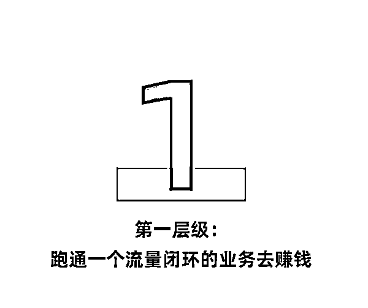
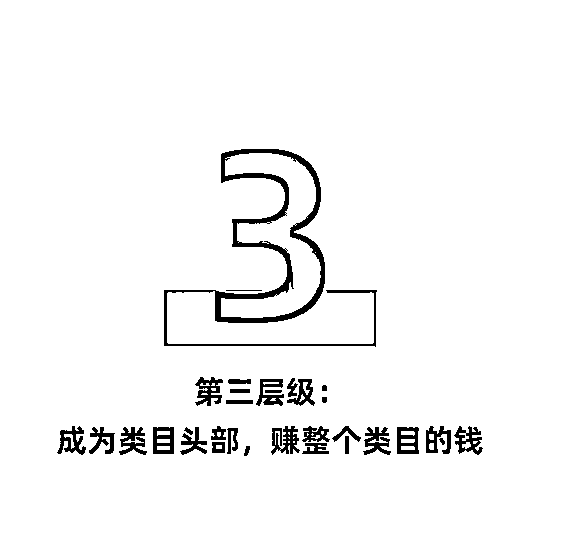
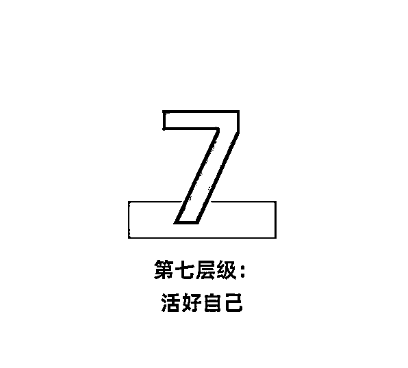

# 《你创业的层级决定利润的天花板》

> 原文：[`www.yuque.com/for_lazy/thfiu8/oh8h9ng8d7r6delf`](https://www.yuque.com/for_lazy/thfiu8/oh8h9ng8d7r6delf)

## (精华帖)(181 赞)《你创业的层级决定利润的天花板》 

作者： 孙策 

日期：2023-04-06 

一般每年我都会出去逛一圈，然后看看大家在做什么，发现挺多优秀的创业者突然的崛起，反超了自己蛮多的，反思了一下自己，我从 16 年开始创业到现在也差不多有 7 年，均下来算年产值并不高，也反思自己很多业务都是在低水平的重复，并没有每一年都在进步以及增长， 

就开始思考创业层级的问题，收入可以波动，但是创业的层级一定要增加 

 

现在绝大多数创业者在这一个环节的居多，跑通一个闭环且能赚到钱， 

流量型业务指的是流量套利的业务，类似于微信淘宝客（引流到微信群，在微信群进行卖货，获得佣金）、抖音混剪（大量的混剪博取抖音流量，用户购买，获得佣金），这种类型的业务，是人数最多的创业者，没有核心壁垒，复制容易，所以如果有一批人赚钱了，会有一大批人进行跟进，所以人数众多； 

这种业务天花板很有限，是因为组建不起来优秀的团队，一方面吸纳不了人才，人才会迅速掌握全流程，很快就会走，另一方面人培养起来，也会走，也就说，人来人走会形成一种动态平衡， 

而且你只能向下兼容，不能向上兼容更多大佬入局， 

在这个层级的创业者会做的特别的累，要把控更多的环节、更多的细节，而且回过头，发现只是积累了现金，而没有积累下任何的东西。 

 

产品型业务指的是能打磨一个产品，用产品去获客、去变现， 

类似于：运营一个公众号，把这个公众号当作你的产品；运营一个抖音号，把这个抖音号当作你的产品；运营一个小程序、运营一个工具、运营一个 ip 等， 

产品型的创业者相对流量型的创业者少了很多，构建产品是有足够的壁垒的，产品就是你的营盘，可以向上吸纳，吸纳更多优秀的人，也不怕优秀的人走，因为就算走了，这些优秀的人知识的沉淀，也沉淀到这个产品上了， 

这个产品会不断的进化，依靠产品本身去获客，去变现， 

向上吸纳人才与向下兼容求职者，一个兼容一个吸纳，一词之差，但是整体差的是一个层级， 

在这个层级的创业者可以不那么累，可以把握更多的核心关键节点，解放创始人，可以下足够多子，盘活后面足够多的棋， 

在这个层级的创业，年利润是可以做到千万级甚至几千万级。 

 

无论你是产品型创业者或者是流量型创业者，无一例外都是对应的一些垂直细分类目，很多创业者是快速做到头部，开始对整个行业进行赋能，包括：供应链、团队管理、玩法等， 

现在主流的都是业务+业务 ip 的方式在走，这个层级不仅仅是业务形成了壁垒，而且这个创业者也成为了这个类目的名片，一旦占据了这个位置，第二个出现的人永远是第二，也就形成了壁垒， 

在这个层级的创业者，不仅仅赚了业务的钱，而且还赚了这个类目增长的钱，因此在这个层级的创业者还是有一定地位的。 

 

前三个层级有明显的问题，业务都是有周期的，很多业务可能三年消亡或者是两年消亡，这也是困扰绝大多数成熟创业者的一个难题， 

第四层级就是圈行业，提高抗周期性，我们要把类目变成行业，举个例子：电商，电商里面之前是做淘宝货架电商后面是短视频推荐点上，现在是做直播电商，这 10 多年有电商行业里面有各种小周期，但是整个电商的大周期都是增长的，也就说在这个行业内既能建立深厚的壁垒，也能创新引领行业的发展， 

在这个层级的创业者，已经是创业多年的老炮，小周期已经波动不到这个层级的创业者。 

 

道生一、一生二、二生三、三生万物，在这个阶段需要找到一个最本源的东西，贯穿行业，能建立起万物，创造出一个生态系统， 

在这个层级的创业者，能找到最本源的东西，也就是自己的道在哪里？ 

新能源汽车中，理想、小鹏、蔚来，我认为理想最能杀出来，现在市值也是小鹏+蔚来，理想找到了自己理想汽车最本源的道，家，围绕的家创造出自己的生态系统，生态系统中的产品相互促进理想“家“的道， 

或者是一类创业者找到自己本源的道，例如：服务、抖音等，通过服务贯穿行业，建立属于自己的服务宇宙生态系统，或者是通过抖音贯穿行业，抖音+万物，建立属于自己的抖音宇宙生态系统， 

或是找到永恒的存在道，例如：社区等，社区里的业务一浪又一浪，但是社区永远在， 

在这个层级的创业者，完全做到了知行合一， 

 

阿里巴巴讲到要活 102 年，特斯拉加速世界向可持续能源转变， 

第六层级要结合两个来看，一个是要活得久，另一个就是要推动某一个领域的发展， 

推动一个领域的发展必然要有几代人的努力，而且需要持续资源、人力的投入，因此活得久也变的极其的核心， 

 

到达了第七层级，已经完成见天地、见众生、见自己， 

在道家已经成“圣”、在佛家已经成“佛”， 

可以做到本来无一物，何处惹尘埃的境界， 

真正可以追寻自己、活好自己。 

归根结底就是不要低水平的重复，没有进步就是退步。 

评论区： 

芷蓝 : 好文，低级 IP 做流量，中级 IP 做产品，高级 IP 赋能行业，顶级 IP 把自己变成行业。 孙策 : [抱拳][抱拳] 亦仁 : 排版优秀 上官无延 : 总结的漂亮 罗本 : 迭代和升级 好好学习 : 牛逼 小栾出品 : 焦虑的低级 IP 迫不及待想转入中级圈层，各种探索 孙策 : 这个不是以 IP 来探讨的，是以层级来探讨的