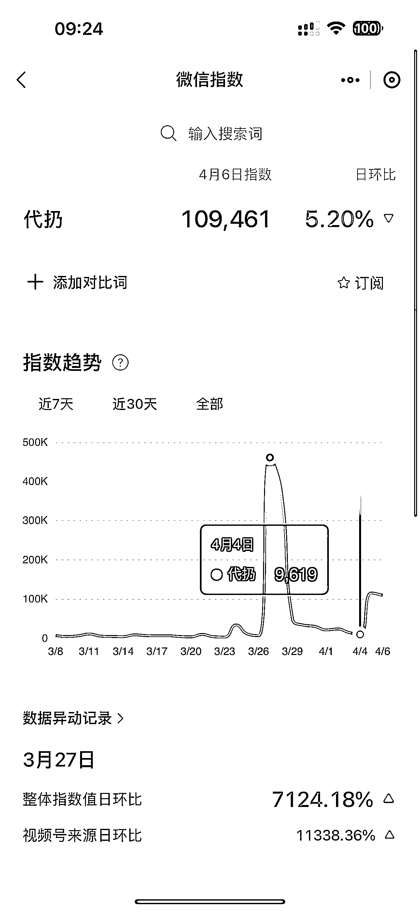
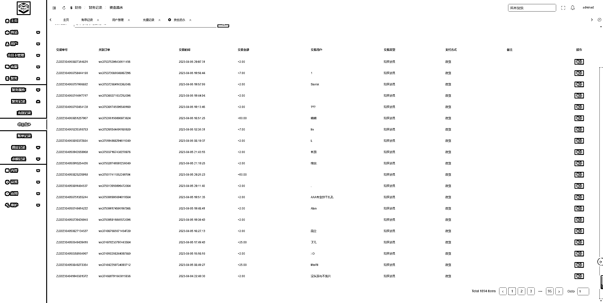
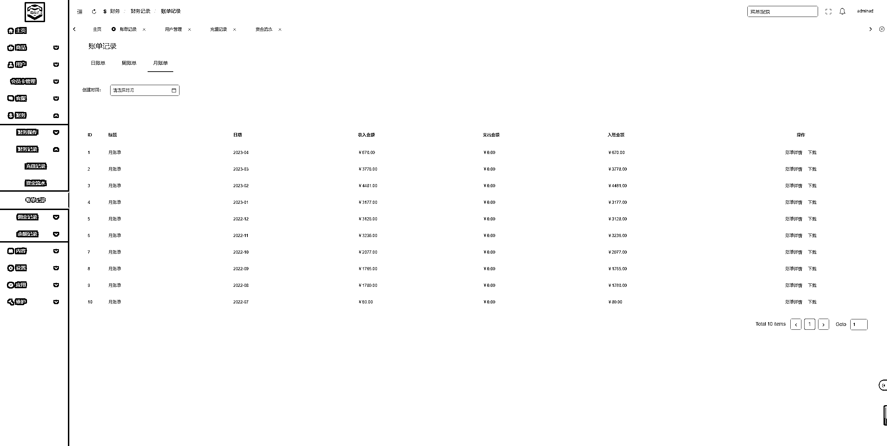

# 《挖掘需求实现方法论》

> 原文：[`www.yuque.com/for_lazy/thfiu8/hscrgdvgdbg9oa0z`](https://www.yuque.com/for_lazy/thfiu8/hscrgdvgdbg9oa0z)

## (40 赞)《挖掘需求实现方法论》 

作者： 老薛 

日期：2023-04-07 

互联网的任何一种声音都是一项需求表达。而如果实现了这一表达，或者说满足这个表达，你将获得你需要的财富。 

 

例如微信指数中的这些需要帮忙的需求。 

 

从需求层次论来分析，我粗略总结三种需求， <ne-oli index-type="0">1.  1 急性需求、（用户几乎不考虑费用，直接付款，例如药物，等急迫需求的物品，赶时间，非要不可） <ne-oli index-type="0">2.  2 普通需求、（用户需求不那么明确，有更好，没有也能凑合，这期间纯在价格谈判，例如：你在吃火锅，多一份和少一份时蔬对你来说毫无影响） <ne-oli index-type="0">3.  3 一般需求、（这个比较直观，例如某宝的收藏功能，也许只是一时喜欢某个小物件，添加了收藏，几年都不会下单，）                  

  通过对需求的总结再把以上关键词+（指数）对号入座就能匹配出需求的强度。更能挖掘到适合的产品和服务不同人群。从而定制收费标准。 

  以上需求层次可配对任何销售行业，例如房产中介，汽车销售员，仅通过沟通方式破解对方心里那个“你有多想要” 即可断定对方的需求摆在第几层。 

 很多行业绝大多数已经坑位满满了。普通人 VS 一个大型服务类公司，还存在什么机会？那是因为你对赚钱的欲望没有拉满，同样你赚钱的欲望也分为以上三种类型。 

以上是对数据的总结和挖掘，实操我们选用了 4 线城市做为试验点关键词代扔进行了实验。 

代扔 属于普通需求，经过调研我们得知，服务的群体男女比例均衡，需要扔的物品属于垃圾，家电，家具。等 

准备动作，微信公众号-小程序（服务器）-域名+1 名服务人员每天工作时长不超过 2 小时+一辆 100 多块的垃圾车+50 快宣传成本。总投入不超过 2000 元。 

首选硬件环境搭建完善以后，找一个相对年轻人居多小区，打印 500 张小卡片提交。一天完整推广。 

当天 40 多名用户直付包月卡，2 名季度卡，63 张实验卡（日卡）。合计付款 1246 元。 

 

（最近收款情况） 

 

实验证明普通需求，可以满足绝大多数年轻人，有需求的用户，给用户带来便捷。 

 

2022 年 9 月份服务至今，接近 1000 位用户，总结了很多衍生问题。并产生表格以外的收入。表格中的收录除了初期投入的 2000 成本没有其他额外支出。 

1、遇到装修户主有大量垃圾清理。一般情况下户主额外多加清理卫生的费用。10-50 不等。 

2、扔垃圾的同时存在 30%以上的可回收垃圾，分拣垃圾是比较脏的动作，赠送给职业做卫生的阿姨。或者收入低廉劳动者。 

3、有家电，家具需要代扔的一个人工也无法完成，此时联络了当地的二手回收人员上门回收，可以从户主收取一笔搬运费后转售也一笔不错的收入。可回收有好有坏，有的沙发几乎全新，摆不下的，直接挂上闲鱼同城秒收，就挂 9.9\. 家电也是极低。几乎都被秒拍。 

4、需要进家里整理卫生，并且把垃圾带走，也是额外收入费用一次收费 200-300 不等（用第三方软件邀请钟点工来清理 150） 

5、垃圾出奇多的。一般户主都愿意支付 8.8/10 元等作为辛苦费。或者快递包裹的可回收垃圾多可以抵消。 

6、菜鸟驿站代取快递的，每一趟 3 元。 

7、代溜狗的一次 60 分钟 30 块，统一一个时间，一个人溜 5 条狗。 

从这个领域衍生了接近一半私域，由于服务时间 22:00-24:00 代买酒的，代买烟的，代把雨伞的。几乎所有私域用户都认识。朋友圈随手发一个多多买菜都能引发百人下单+美团优选。 

资金无法统计完全，预估这个实验从开始投入至今（一人一小区服务了超过 1000 名用户，）共计收入约 5w。 

总结： 

从代扔引发二手家电代扔，引发代取包裹，代做卫生、代买菜、代买早餐、代买药物、甚至还有接孩子的需求无法满足。 

当然过于高档的小区会有物业干预，目前还没尝试，但是服务的一群相对懒一些的用户，或者说时间紧张的用户。都相对来说比较大方，到期自动续费，复购率 60%， 

这个仅仅是一个小区，如果多个小区，不同城市，或者将小程序更加完善城市化裂变。这个资金会成几何倍数增长。 

在美团还没有问世之前，跑腿服务，还是很优质的，美团出来以后，跑腿服务受到的影响几乎忽略不计， 

因为服务的这群里人，需要体验感，需要快速服务，需要更懂你。甚至需要一个老字号的小吃，你都知道口味是微辣中辣，吃香菜而不加葱。 

用心服务一群高能力，高消费的用户，你所得到的认知都在提升，深夜的一瓶矿泉水都愿意支付给你 3 位数人，一定有他的道理。 

如果你到了陌生城市要扎根，要足够了解这座城市就去送外卖吧。用心送。用心服务。离开家的时候有垃圾顺手带走。在众多快递小哥面前让别人记住你。 

当记住你的人多了，你的事业就变革了。当你的私域多了。你关注到的朋友圈就是你的世界。 

如果还想你的世界在升华一个高度，那就把他们分类。 

评论区： 

周彦充 : 你估计你没有做过代扔这个项目吧？ 书情小跟班 : 学习了，涨知识，谢谢分享 老薛 : 是星球用户程序免费送 老薛 : [愉快] 金九渊 : 牛逼 livy : 您好，您在做代扔这个项目么？ Kevin : 厉害