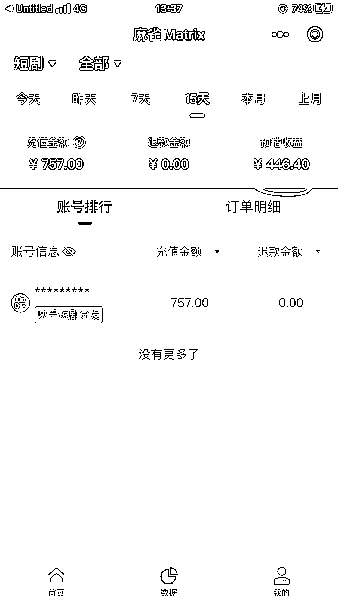
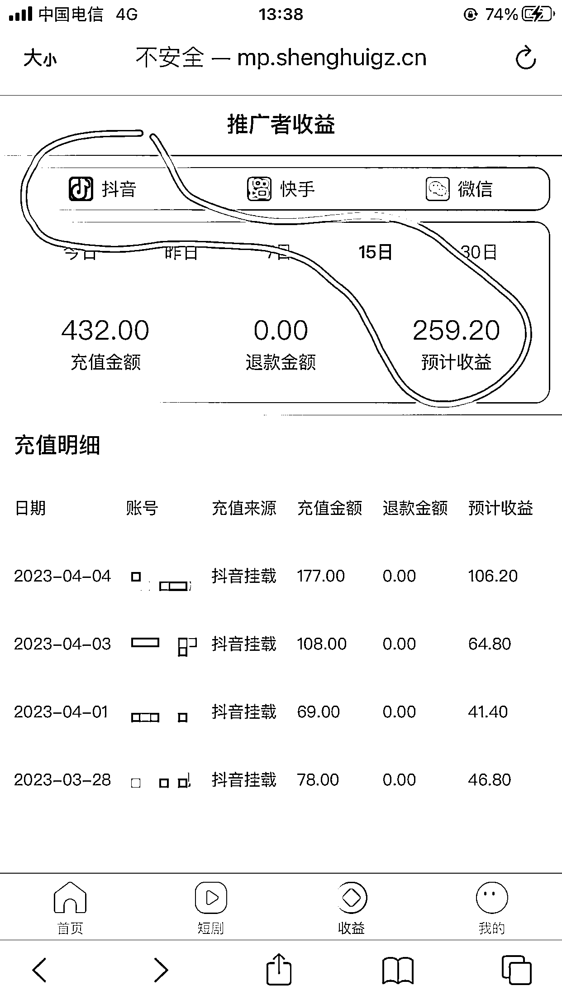
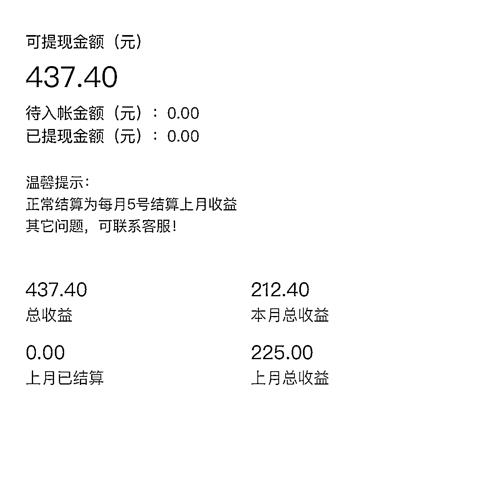

# 《认识生财 1 个月，我干了些什么》

> 原文：[`www.yuque.com/for_lazy/thfiu8/ma9cf1f6k7g675er`](https://www.yuque.com/for_lazy/thfiu8/ma9cf1f6k7g675er)

<ne-h2 id="71044c92" data-lake-id="71044c92"><ne-heading-ext><ne-heading-anchor></ne-heading-anchor><ne-heading-fold></ne-heading-fold></ne-heading-ext><ne-heading-content><ne-text id="u039fa822">(97 赞)《认识生财 1 个月，我干了些什么》</ne-text></ne-heading-content></ne-h2> <ne-p id="uc9d525c2" data-lake-id="uc9d525c2"><ne-text id="u6c9e79cf">作者： 肖一</ne-text></ne-p> <ne-p id="uef98d7fd" data-lake-id="uef98d7fd"><ne-text id="u9212a22e">日期：2023-04-05</ne-text></ne-p> <ne-p id="u488327bf" data-lake-id="u488327bf"><ne-text id="ud1ab1ea2">新人正式报道打卡！</ne-text> <ne-text id="ua04c0471">大家好，我是 3.18 加入生财有术的肖一，来刷个脸，汇报一下认识生财 1 个月，我干了些什么：</ne-text></ne-p> <ne-p id="uc106d01b" data-lake-id="uc106d01b"><ne-text id="u0374a587">1、我主职是做教育 SaaS 系统的 B 端产品经理，大环境影响和家庭变故因素，让我今年开始有着强烈的赚钱欲望和寻求圈层突破改变的想法。</ne-text> <ne-text id="u730caad8">偶然机会发现生财有术知识星球，有幸被鱼丸拉入 3 天免费体验营。当时的心态就是进去溜达一圈看看得了，完全没有付费的打算。</ne-text></ne-p> <ne-p id="u2d33ee9f" data-lake-id="u2d33ee9f"><ne-text id="ub051b92c">2、这一看根本就停不下来，宝藏！且内容写的实操性还挺强。3 天时间熬夜疯狂扫过一遍平台帖子后，迅速选择了一个自己能操作的项目「短剧分发」，但还是有很多细节不清楚，于是加了作者。</ne-text> <ne-text id="u01f5691e">这里要抱歉下，看到一些帖子里是有作者联系方式的，所以那三天也是疯狂加了很多人，也没打招呼（现在知道怎么打招呼了）。</ne-text></ne-p> <ne-p id="u38a4769e" data-lake-id="u38a4769e"><ne-text id="u99d22d50">3、刚好思蒙短剧项目在做一个训练打卡营，完成任务就可以退保证金，抱着试试心态就加入了。</ne-text> <ne-text id="uf7e0784f">快手跟抖音是同步发的，每天发大概 1~2 个视频。大概在发视频的第 4 天就开始出单有收益了。</ne-text></ne-p> <ne-p id="u4e665520" data-lake-id="u4e665520"><ne-text id="u646859d1">4、拿到这个正反馈后，差不多生财有术体验营也结束了几天，选择果断付费。但是要 3 月 18 日才开放。</ne-text> <ne-text id="ua5bc2bdc">于是继续操作这个项目，直到保证金赚回来，挣到自己副业外的第一个 1000 元。</ne-text></ne-p> <ne-p id="u65752816" data-lake-id="u65752816"><ne-text id="u9d691e56">说说这个项目过程，除了钱以外我的收获吧：</ne-text></ne-p> <ne-p id="uf0301cc9" data-lake-id="uf0301cc9"><ne-text id="u823b5455">5、因为这个项目还比较新，所以平台方不是很稳定，一下小程序无法挂载，规则渠道调整，一下又是佣金变化更换剧场……</ne-text> <ne-text id="ub3dbbba8">总之是一天一个变，又没有收益不得其法时，有放弃的想法。</ne-text></ne-p> <ne-p id="u51b15a09" data-lake-id="u51b15a09"><ne-text id="u3187b127">6、不过还是多坚持了一下，怎么着也要把保证金先赚回来再说吧。</ne-text> <ne-text id="u2c42c568">于是着力研究对标账号和数据比较好有差异化的同行。试着跟随其中 1 条视频模板，照着剪了 4 条出来，分了 2 天同步发布到抖音，快手，视频号上。</ne-text></ne-p> <ne-p id="u96735992" data-lake-id="u96735992"><ne-text id="uc32e0188">7、没想到凌晨一点发的，第二天早上发现视频号就爆了，104W 播放，涨了四千八百多粉。不过转化并不多，充值金额两百多，佣金才 138 块多。</ne-text></ne-p> <ne-p id="u4a7afc9c" data-lake-id="u4a7afc9c"><ne-text id="ucb33f34b">8、于是我继续研究同行，做了评论区引导，加入演员粉丝群，在演员视频下评论等操作。同样视频在抖音，快手开始转化增多，停更 1 周了都还在转化。</ne-text></ne-p> <ne-p id="u5641bb15" data-lake-id="u5641bb15"><ne-text id="u88f6a220">9、做短剧过程让我找到了一些网感和剪辑视频的技能，我觉得这个是可以迁移到其他项目上的技能，这是目前最大的价值吧。</ne-text></ne-p> <ne-p id="uc490677f" data-lake-id="uc490677f"><ne-text id="u671ef73e">10、通过分析为什么有的剧能火爆，转化很高的在这个过程中，我发现了针对短剧剪辑手们的一个小痛点。</ne-text> <ne-text id="ubc302e85">目前剧场方不会把所有的片单资源都发出来，谁能抢先一步发出来就可能获得抢先爆火的机会。</ne-text> <ne-text id="uda5e2ee0">淘宝拼多多上就出现了这种虚拟项目，卖剧场方的资源，还有代理模式。具体他们这个资源怎么获得，是否涉及侵权，还得研究一下。</ne-text></ne-p> <ne-p id="u1419c0e9" data-lake-id="u1419c0e9"><ne-text id="u77a6e23f">11、但给了我一个思路，我可以顺着去试试做无货源，淘宝拼多多上，抖音上其实都是在卖短剧，只是模式不同。</ne-text></ne-p> <ne-p id="u282724d4" data-lake-id="u282724d4"><ne-text id="uf73f46e4">啰嗦了这么多，其实就是想说这是我来到生财的第一个正反馈，给了我很大的信心和鼓舞。希望能对其它圈友有帮助。</ne-text></ne-p> <ne-p id="u4f3bc480" data-lake-id="u4f3bc480"><ne-text id="u4b91a0c6">可能后面会有很多坑。但是有前辈给总结这么多宝贵的经验，一点也不怕。我们是站在巨人的肩膀上啊！希望能在这里交到志同道合的伙伴，共同致富，赚到第一笔 1W、10W……</ne-text> <ne-text id="u9d998b0d">2023.04.05</ne-text><ne-card data-card-name="image" data-card-type="inline" id="B4tiD" data-event-boundary="card"></ne-card></ne-p> <ne-p id="u8220f280" data-lake-id="u8220f280"><ne-card data-card-name="image" data-card-type="inline" id="obEfg" data-event-boundary="card"></ne-card></ne-p> <ne-p id="ue21b8d1a" data-lake-id="ue21b8d1a"><ne-card data-card-name="image" data-card-type="inline" id="b9430" data-event-boundary="card"></ne-card></ne-p> <ne-p id="u087a780a" data-lake-id="u087a780a"><ne-card data-card-name="image" data-card-type="inline" id="PbhKu" data-event-boundary="card"></ne-card></ne-p> <ne-hole id="u195105ab" data-lake-id="u195105ab"><ne-card data-card-name="hr" data-card-type="block" id="HrK8m" data-event-boundary="card"><ne-p id="u43fc6bc6" data-lake-id="u43fc6bc6"><ne-text id="u99f8b5db">评论区：</ne-text></ne-p> <ne-p id="u86742c17" data-lake-id="u86742c17"><ne-text id="u80ce5a1e">木头 : 加油[强]</ne-text> <ne-text id="u0ff8522f">罗宇 : 加油[强]</ne-text> <ne-text id="ud1cb44e6">读行 : 加油</ne-text> <ne-text id="ud2b7fb73">肖一 : [抱拳]</ne-text> <ne-text id="ub96b9306">肖一 : [抱拳]</ne-text> <ne-text id="u021682bf">肖一 : 一起加油[抱拳]</ne-text> <ne-text id="u77e3b971">亦仁 : 行动力强，说干就干，加上生财带来的信息增量，感觉很快就要起飞。</ne-text> <ne-text id="uac840a0c">谦羽【生命成长教练】 : 哇撒，这行动力杠杠的</ne-text></ne-p></ne-card></ne-hole>