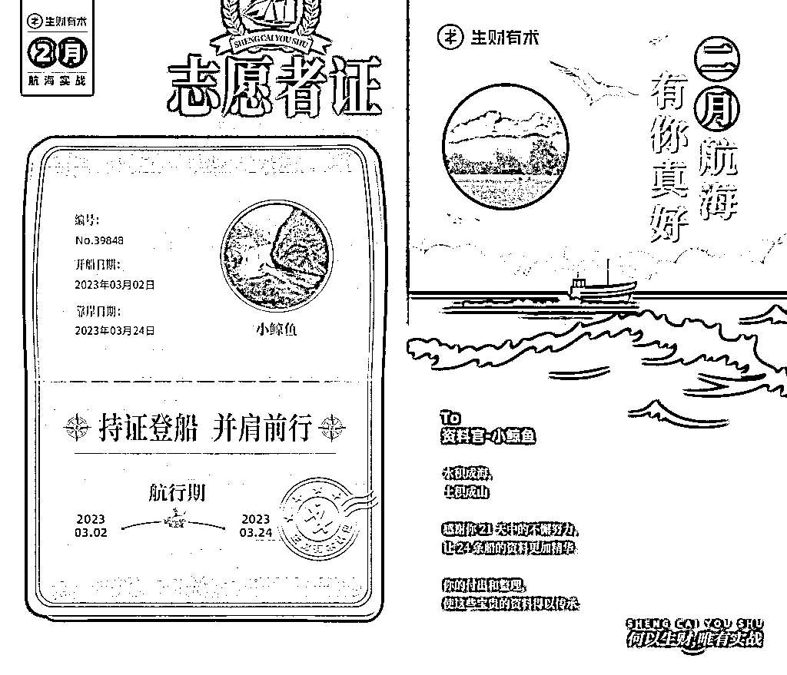
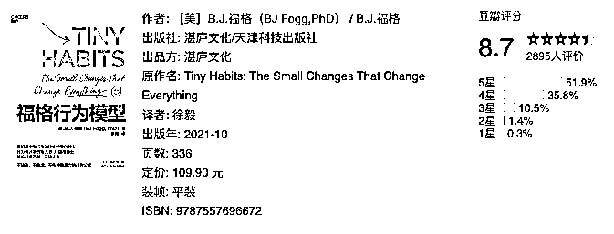
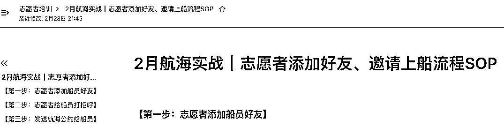
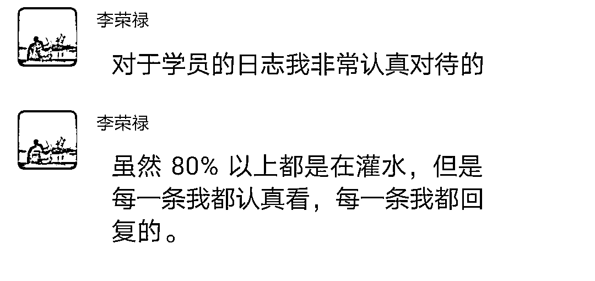
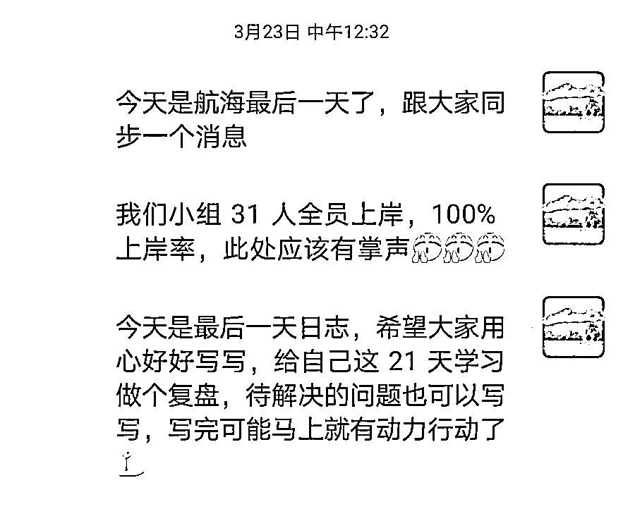

# 《志愿者可能是新手小白参与航海的最优解》

> 原文：[`www.yuque.com/for_lazy/thfiu8/ibh6c60oik1svw8t`](https://www.yuque.com/for_lazy/thfiu8/ibh6c60oik1svw8t)

## (70 赞)《志愿者可能是新手小白参与航海的最优解》 

作者： 小鲸鱼 

日期：2023-04-03 

哈喽，这里是做新媒体写作的小鲸鱼，加入生财一年了，这是我第一次做志愿者&资料官的经验复盘 

虽然标题很含蓄，用了「可能」，但如果你跟我一样自诩为新手小白，没有目标方向，又对各个项目一知半解，还不想错过航海项目，all in 之前，听我一句劝，试试先当个航海的志愿者看看～ 

 

### 一、做 2 月航海志愿者的满满收获 

#### 1、获得了超多链接 

1.  认识了责任心爆棚的@茶色-宋仪，事事有回应的宝藏 girl，爱你宋宋～ 

2.  认识了口头上总说「问题不大」，但事无巨细，认真负责的领队@施霖 

3.  认识了给我机会做资料官的激励达人@小霸王 

4.  链接到了志愿者里的隐藏大佬百万哥@李荣禄 

5.  链接到了志愿者里一直有她传说的@九儿，可可爱爱，社群运营一级棒 

6.  还有我群里各位船员伙伴，感谢一路陪伴 

#### 2、学会了提问，得到了很多帮助 

这是我做两期船员，从来没出现过的情况 

做船员，基本都是「默默无闻，打卡就完」的状态，不好奇也不怎么喜欢发问～ 

当了志愿者，责任心满溢，不清楚的、不了解的，都要去找人或进志愿者大群问问，志愿者大群是宝藏，大家都超级耐思，超级热心，很多还是多期志愿者，随便甩问题，花式答案等着你～ 

PS：问题范围，其实也不只限于志愿者职责方面的内容，群里隐藏大佬很多，实战项目你也可以照问不误！ 

另外，还要谢谢宋宋给我的正向鼓励和反馈，我们俩都是资料管理组的志愿者和资料官，我遇到的很多问题，她会主动提出建议和各种解决方案，让我做志愿者这 21 天，非常有安全感！ 

而且我们也是 2 月航海才认识的，你就说做志愿者香不香，哈哈，我上船之前都没想到，会认识一个话很投机的好朋友～ 

#### 3、更沉浸式的参加了航海 

上面也说过了，我之前参加过两期航海，都是船员身份，但参与感不是很强，原因嘛，我总结了下，一是项目不太适合我，二是我本身有很多疑惑，又没有提问，一知半解的就仓促结束了 

但身份变成志愿者以后，视角不一样了，参与感反而更强了 

1.  【做资料官】主要负责把群内的资料分门别类，从群内聊天精华到工具包，整理的过程又是一遍学习的过程，教练和船员的输出，让我对负责的资料管理这个项目有了更清晰的认知 

2.  【做志愿者】被动的熟悉了生财的打卡后台，航海资料放在哪里，是我以前从来不关注的事情，现在知道了以后，突然觉得自己以前真的是错过不少宝藏！！！ 

####   

####   

#### 4、得到了 75 术值 

哈哈，志愿者和资料官一起的，惊喜～ 

虽然目标是做个及格的志愿者，但根据术值，我就照葫芦画瓢，给自己浅浅打个 75 分吧～ 

60 分及格，爆棚责任感+10，兢兢业业催打卡+5，其他 25 分是上升空间～ 

 

好了，如果你觉得以上收获，看的还算心动的话，那可以继续看下面的方法论啦，保证加分的那种～ 

↓↓↓ 

### 二、新手做志愿者不焦虑的方法：60 分就好 

不知道有没有人跟我一样，是想报名做志愿者看看，又各种杞人忧天的，虽然这次做志愿者，我收获满满，但报名的时候不知道啊，就各种想东想西劝退自己了 

跟我上手航海项目一个路径：看热闹——了解下——感觉不适合自己——放弃 

还好，朋友推荐的一本书《福格行为模型》，在这时候发挥了作用，推荐大家去看，拖延症福音 

 

实操了下书里的方法，我给自己设立了一个 60 分的目标，填写申请表，也只写了一个 80%上岸率 

目标拉低，降低了恐惧感，战战兢兢上船了 

结果上船才发现，这些担心都是多余的 

因为，志愿者 SOP 流程超级详细！！！ 

 

一步步跟着操作，纯粹当工具人也能完成任务！ 

对我这个社恐来说，巨有安全感 

直到那会儿才放心 

后面做资料官也是，担心自己做不了 

小霸王说会有培训，比较轻松，这一句话的动力超强，我信了，去了，哈哈，确实很简单 

还好没有被自己的假设拦路虎给劝退 

 

### 三、怎么成为一名 90 分的志愿者？ 

虽然上船给自己定的 60 分目标，但完成情况可以打到 75 分～ 

我第 2 次去做志愿者的话，目标会是 90 分，为了这个目标， 也希望能帮助其他萌新，下面我总结了几条优秀志愿者的实操经验分享，希望自己下次用的上，如果也能碰巧帮到你就更好了～ 

#### 1、项目能报几个就报几个！ 

航海项目对志愿者的要求是：只能参加一个项目去当志愿者，但你还可以选「非实战」项目当船员 

所以估摸着自己有时间的话，实战和非实战一定要多报上 

1.  好处一：两种体验，一边做志愿者为船员服务，一边做船员，同时学习其他志愿者的服务！ 

2.  好处二：还用说咩，技多不压身，尤其是不知道哪个项目适合自己的时候，多学，有备无患 

同理：报名志愿者的同时，还可以再报一个资料官，如果两者都做过一遍，下次还可以试试领队 

学着不断在自己的舒适区边缘试探，成长的会更快！！！ 

#### 2、一定要多问问题！！ 

不会就问，不懂就问，纠结就问！ 

志愿者大群里多的是有经验的学长学姐，N 多大佬会热心的提供帮助，就怕你不问！！！ 

当然，最好先把给的志愿者培训手册吃透！！！ 

前期还会直播培训，有时间一定要参加！ 

#### 3、自己尽量也跟着打卡，形成一个模范带头作用 

做志愿者，其实是可以不用打卡的，但是！ 

跟着打卡有一个很好的模范效果 

如图 

是我们资料整理二组领队施霖，在群里直接放自己的打卡图，通知打卡，还蛮有说服力的～ 

他还连续打了 21 天卡，服气！！！ 

 

#### 4、别把船员只当做船员 

这一点，我还挺有感触的～ 

因为从头到尾，我的关注点都在，如何让群活跃起来，如何不让船员掉队，如何破冰等等，但看到志愿者里的隐形大佬-百万哥的分享，才发现，原来我的关注点还是窄了～ 

从对待船员日志的态度，到挨个沟通所费的心思，到如何看待做志愿者这件事，这种认知差距之大，我在下船的那一刻 get 到了～ 

大佬，我悟了 

 

 

#### 5、向专业的人请教是最快成长的方法 

志愿者群里多的是利他属性极强的小天使，比如像九儿这种名声在外的，都是超级乐于助人的存在，多多链接，有礼貌地去请教，比自己闷头苦想效果好得多，效率也高得多！！！ 

这一点，放到实战项目上也是一样 

#### 6、小群破冰要趁早 

破冰环节，是拉完小群最该做的第 1 个动作！ 

因为本来小群人数就少，三十个左右，只有破冰先让大家稍微熟悉一下， 后续才不会冷清的不像话～ 

但这个环节，我憋到了航海第三天左右，才开始鼓励大家做自己介绍！！！ 

因为这个环节是大群里有的，我以为小群不用搞 

这也是个新手误区，「自以为是」 

有志愿者分享了小群的互动，热热闹闹的，奈何我错过了最好的破冰环节，还赶上了周末，大家大多都有安排，so 破了又好像没完全破～ 

 

### 四、上岸率 100%的经验总结 

这个上岸率，除了要归功于船员的自律、我的负责，还有运气的成分在～ 

虽然我确实有在努力认真的催船员打卡，从「只剩 6 次请假机会」，到「日更也有希望上岸」，不管对方是否回复，都敦促了 

但有一些不可控因素，比如船员有紧急事情处理，或者突然联系不到的情况，是没办法靠主观意志去改变的 

所以，总结一句话：佛系看待上岸率，尽自己最大努力完成任务才是最重要的～ 

 

———————— 

以上 

这也是我最后一次称呼自己是新手小白啦，很神奇，以前我喜欢新手小白这个标签，因为这个标签意味着，我可以对任何项目或干货说不懂，对自己说算了，给自己一个放弃的理由 

这次做志愿者，让我体会到不做新手小白的成就感了，你懂的多一点点再多一点点，向别人输出的时候，其实是在对自己一遍遍强化，在舒适区边缘反复横跳，其实是很爽的体验 

希望和我一样曾自诩新手小白的伙伴，也能速速摆脱这个标签的束缚，这篇复盘就算是给我自己留个底吧，下次做志愿者可以做个对照组复盘，哈哈 

评论区： 

心之所向 : 小白报道 小鲸鱼 : 航海开了，速度上船，撕掉小白标签[机智] 阿狸 : 优秀啊[强] 北辰 : 努力跨出自己的第一步，才会有接下来的第二步，第三步 小鲸鱼 : 哈哈，多谢🙏 小鲸鱼 : 是的[强] 茶色-宋仪 : 小鲸鱼太棒啦~ 辰安 : 萌新报道，我也要做志愿者[机智]