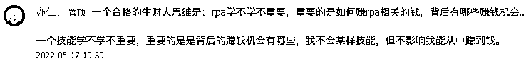

# 《7 天 9000+ 份红包雨，我用影刀 RPA 爬取生财见面会群微信红包数据》

> 原文：[`www.yuque.com/for_lazy/thfiu8/kblfrya26mk1t50h`](https://www.yuque.com/for_lazy/thfiu8/kblfrya26mk1t50h)

## (41 赞)《7 天 9000+ 份红包雨，我用影刀 RPA 爬取生财见面会群微信红包数据》 

作者： 邹培盛 

日期：2023-04-03 

大家好呀，我是阿盛，坐标广州，在做量化交易和流程咨询，也在用 RPA 帮中小企业和超级个体将业务流程“超自动化”运作。 

这次分享的是一个“红包数据爬虫”的制作过程，一说到爬取数据，大家可能会想到网页爬虫，用 python 代码或八爪鱼等工具，从电商或自媒体平台扒数据，在手机端把 APP 数据导出的插件和应用估计也见过，但是微信群的红包数据爬虫可能比较新鲜吧~ 

虽然这明显是属于“手工耿”类的应用，有点技术，看似无用，但有趣的是想法（万一微调或换个场景后就能搞钱呢？)，所以我将这次分享定义为一个“熟悉场景里的新鲜操作”技术分享帖，让非技术圈友能一窥 RPA 的能力和技术实现，理解 RPA 自动化流程的思路，可以识别出自己业务中高频重复的部分，在需要用自动化提升效率时，可以和开发者有更高效的沟通。 

>>如果手机端排版错乱可移步飞书查阅 → [链接](https://ih195hg9y3.feishu.cn/docx/EtosdPFUuo1iPexWVKxclw4jnYg) <ne-h3 id="c8ddc812" data-lake-id="c8ddc812">〇、阅读指引</ne-h3> 

为节省圈友们宝贵的时间，预估不同了解程度的圈友可能的收获： 

 <ne-h3 id="4d8e6029" data-lake-id="4d8e6029">一、缘起</ne-h3> 

这个月生财圈里最大的事情莫过于“三年磨一见”的千人见面会了，从上周在见面会群里就开始各小组的自我介绍，每天晚上 1 小时，足足分享 8 天时间。 

既然“谈钱不伤感情”，见面随喜一个红包，让钱流动起来，这样的互动挺符合生财的调性，一天还行，这要是持续一周，那不得是一场红包暴雨？ 

是的，这就是见面会的实景，并且还有一位气象观测员，记录了这场暴雨中每一滴雨水的流向。 

来看几个数据： <ne-oli index-type="0"><ne-oli-i>1</ne-oli-i><ne-oli-c class="ne-oli-content" id="ue0920728" data-lake-id="ue0920728">4 秒：每个发出的红包（大部分为 50 份）被抢完的时间约为 4 秒。</ne-oli-c></ne-oli> <ne-oli index-type="0"><ne-oli-i>2</ne-oli-i><ne-oli-c class="ne-oli-content" id="ue13692c8" data-lake-id="ue13692c8">9000 份：在抓取数据时，最开始两天的很多红包已经打不开，按有记录的每一天 1000+推算，群里一共发出的红包份数超过 9000。</ne-oli-c></ne-oli> <ne-oli index-type="0"><ne-oli-i>3</ne-oli-i><ne-oli-c class="ne-oli-content" id="u84a020fb" data-lake-id="u84a020fb">76.42 元：手气最佳的群友，一个红包抢到了 76.42 元，这个红包是总额 200 元，分成 5 份。</ne-oli-c></ne-oli> <ne-oli index-type="0"><ne-oli-i>4</ne-oli-i><ne-oli-c class="ne-oli-content" id="u5b5fa54c" data-lake-id="u5b5fa54c">0.06 元：某位非酋群友，在平均每人 4 元的红包里，抢到了 0.06 元。</ne-oli-c></ne-oli> 

 

虽然我把爬取的数据做了个透视表，但因为涉及群友隐私，就不放出完整版了（如果想要另做测试，欢迎拉我进有红包雨的群~)，不过可以放出我自己的数据，徒手抢了 38 个红包，平均 3.9 元，相当标准的均值了。 

 

显然我并不是“蓄谋已久”地要搞事情，而是在 3 月 22 号晚上，最后一场圈友介绍结束后，鱼丸再次发出见面会流程和地点提醒时，才发觉“呀，真的要见面了呢”，回想起这几天群里的介绍，能让我印象深刻的介绍，按不严格的分类是有三种：有成果，有能力，有作品。 

作品类可以分三个台阶： <ne-oli index-type="0"><ne-oli-i>1</ne-oli-i><ne-oli-c class="ne-oli-content" id="u6104b8ee" data-lake-id="u6104b8ee">展示型作品——“哇塞”：用这个作品了解作者的能力，需要哪些产品或服务找他就对了，作品呈现如文章、文档、图片和视频等。</ne-oli-c></ne-oli> <ne-oli index-type="0"><ne-oli-i>2</ne-oli-i><ne-oli-c class="ne-oli-content" id="u88f20021" data-lake-id="u88f20021">属于工具或方法——“啊哈”：不仅能看，还可以用，让有需要的人眼前一亮，例如针对某短视频平台的批量剪辑工具。</ne-oli-c></ne-oli> <ne-oli index-type="0"><ne-oli-i>3</ne-oli-i><ne-oli-c class="ne-oli-content" id="ua6788026" data-lake-id="ua6788026">常见场景可用——“我要”：更大众化的工具，戳中在日常场景中的痛点，并且你给了解决方案。比如有位技术大佬说他做了能下载 99％网页视频的插件，你见到了是不是会想要？哪怕是已经用过类似的，会不会想要再收一个备用？</ne-oli-c></ne-oli> 

那么，当我在和圈友见面时，可以提起一件什么样的事情能留下一点印象？ 

从当时最应景的场景出发，和现在做的事情结合起来，还要有点意思，想法就有了： <ne-oli index-type="0"><ne-oli-i>1</ne-oli-i><ne-oli-c class="ne-oli-content" id="u99a8fe2d" data-lake-id="u99a8fe2d">场景：生财见面会相关话题</ne-oli-c></ne-oli> <ne-oli index-type="0"><ne-oli-i>2</ne-oli-i><ne-oli-c class="ne-oli-content" id="u2e41c369" data-lake-id="u2e41c369">事情：用 RPA 操作微信，批量获取数据</ne-oli-c></ne-oli> <ne-oli index-type="0"><ne-oli-i>3</ne-oli-i><ne-oli-c class="ne-oli-content" id="uccf7e543" data-lake-id="uccf7e543">有趣：统计一下群里的红包数据，这没人做过（也少有机会能达到这个数量)</ne-oli-c></ne-oli> <ne-oli index-type="0"><ne-oli-i>4</ne-oli-i><ne-oli-c class="ne-oli-content" id="uaedf67f5" data-lake-id="uaedf67f5">作品有三份：红包数据、RPA 应用和精华文:)</ne-oli-c></ne-oli> 

确定想法后，接着就可以开始捋一下实现思路了。 <ne-h3 id="f5530e84" data-lake-id="f5530e84">二、实现思路</ne-h3> <ne-h4 id="4c6797ff" data-lake-id="4c6797ff">小白也能看懂的 RPA 简介</ne-h4> 

首先还是要照顾非技术的圈友，了解一下 RPA 是什么，和其他软件工具有什么不同： 

RPA（Robotic Process Automation，即机器人流程自动化），这是一种通过软件模拟人类在计算机上执行操作的技术，可以帮助我们自动完成一些重复性的工作，例如数据录入、发送邮件、网页操作和控制软件等。 

请注意这里的加粗：模拟人类在计算机上执行操作。 

按我的理解，RPA 可以定义为”软件的软件“，它的核心功能是可以模仿人类的操作，使用鼠标、键盘或指令来操控其他各种软件（网页浏览器也属于软件），还可以进行数据处理、调用 API 等需要用代码实现的功能。 

前者早就有”按键精灵“等应用可以做到基础的点击、输入，后者是编程的常规操作，但是把这两项能力结合起来，加上人工智能技术的文本识别、图像识别和自然语言处理，RPA 就能“看见”它要操作的软件和内容具体是什么，即使你把软件的窗口缩小或是挪一下位置，它也能找到对应的按键在哪里。 

并且 RPA 软件大多是属于“可视化编程”或是“低代码”，就是把操作其他软件的各项基础能力，包装成一个个积木块，你拖动一下就能加入这个功能，可以看一下我在影刀 RPA 做的“微信群红包爬虫”应用的编辑界面。 

 

当我想要点击手机屏幕中的红包是，只需要把“点击元素”这一个指令，拖到右侧流程中，然后在配置选择“红包元素”，就能完成这一个动作。 

其他的大部分操作，都是找到需要用到的指令，拖拽过去，按需求进行配置。这种制作应用的方式，是不是像极了搭积木？ 

那么，会不会因为简单，就意味着功能弱一些呢？这里可以参考一下《我的世界》这种“积木游戏”，像我估计就只能拼出一棵树，高手可以搭一个城堡，而大神就可以做出一整部方块人版的《我的三体》，在 B 站连出三季，豆瓣评分 9.4。 

 

简单，意味着可以有更高的开放性，也同样能让更多有想法、有痛点的人，可以迈过开发的门槛，让想法得以实现。就像现在大热的 ChatGPT 或 AI 绘画同样如此，一个产品的界面只有一个输入框，你能表达清楚遇到的问题或是描述你想要的画面，AI 就会帮你实现。所以对于这类具备较高开放性的工具，值得研究一番，提升搞钱效率。 <ne-h4 id="a295a3b7" data-lake-id="a295a3b7">开发过程</ne-h4> 

好了，现在可以进入正题啦，我已经知道想要“获取一个微信群里所有红包的数据”，那要怎么“教会”RPA 机器人，让它能帮我去把上百个红包全都打开，用小本本做好记录呢？ 

在我做一个 RPA 机器人的时候，一般会分成这 5 个步骤：手动操作-步骤梳理-模块开发-运行测试-修复 BUG，可以完成一个小应用的开发。 <ne-h4 id="e9a82df1" data-lake-id="e9a82df1">手动操作</ne-h4> 

前面我们已经对 RPA 的工作原理做了介绍，它是“模拟人类在计算机上执行操作”，既然要“模拟”，我们就得先做好示范，并且不只是“能用就行”的常规操作，还要考虑到异常情况。 

我们先看常规操作是怎么看到一个红包数据的： <ne-oli index-type="0"><ne-oli-i>1</ne-oli-i><ne-oli-c class="ne-oli-content" id="u36984ad9" data-lake-id="u36984ad9">在群聊里找到红包。</ne-oli-c></ne-oli> <ne-oli index-type="0"><ne-oli-i>2</ne-oli-i><ne-oli-c class="ne-oli-content" id="ubd259b91" data-lake-id="ubd259b91">点开红包，如果是你抢到的，会直接进入红包里面，没有抢到的，会显示“手慢了”，就需要再点击“看看大家手气”，才能进入红包里面。</ne-oli-c></ne-oli> <ne-oli index-type="0"><ne-oli-i>3</ne-oli-i><ne-oli-c class="ne-oli-content" id="uf9c3a834" data-lake-id="uf9c3a834">在红包里，可以看到关键数据：发送红包的群友名字、抢到的群友名字和对应的金额、抢到红包的时间。</ne-oli-c></ne-oli> <ne-oli index-type="0"><ne-oli-i>4</ne-oli-i><ne-oli-c class="ne-oli-content" id="u0020603e" data-lake-id="u0020603e">接着就是退出红包页面，返回到群聊，继续找下一个红包。</ne-oli-c></ne-oli> 

重复这 4 个步骤，就可以把群里所有的红包数据全部收集。 

这里有一个小细节，当你打开一个红包时，会发现里面的群友名字和金额，是没法直接复制的，如果手动统计的话，只能选择...敲键盘录入，除了费时不说，还有可能出错。但是用 RPA，是可以直接识别到这些文字内容，按原样保存。这类“不可复制”的情况在很多网页、软件和 APP 的场景里是常有的，也是使用 RPA 的一个优势。 

那么群里的红包会有哪些“异常情况”呢？这也是拜生财群友所赐，才能一次尝试个够，比如： <ne-oli index-type="0"><ne-oli-i>1</ne-oli-i><ne-oli-c class="ne-oli-content" id="u1e5fd820" data-lake-id="u1e5fd820">异形红包：颜色或外形跟普通的红包不同，用图像作为识别的话可能会被略过，所以不能用“图像”识别，需要用“元素”来识别出红包，具体的操作这里就不展开说明了，开始用起来就懂的。</ne-oli-c></ne-oli> 

 <ne-oli index-type="0"><ne-oli-i>1</ne-oli-i><ne-oli-c class="ne-oli-content" id="u3d031781" data-lake-id="u3d031781">红包封面图：进入红包后，有些封面图尺寸较大，或者是一个视频，占据了大半个屏幕，就看不到下面的数据，这时直接读取是会程序出错的，需要加一步灵魂操作——向上轻轻滑动一下屏幕，图片或视频就会收起，可以继续读取数据。</ne-oli-c></ne-oli> <ne-oli index-type="0"><ne-oli-i>2</ne-oli-i><ne-oli-c class="ne-oli-content" id="u23aeccb3" data-lake-id="u23aeccb3">干扰元素：在群聊里还会有不少聊天记录，会影响采集的过程，比如打开了一个过期的红包，就没法看到红包内容，或者是有一些可能会被识别为红包的头像、表情包等，一旦点进去，就会卡在里面，这些情况都需要识别出来，返回到群聊里，才能继续。</ne-oli-c></ne-oli> 

 <ne-h4 id="fa1b9b7c" data-lake-id="fa1b9b7c">步骤梳理</ne-h4> 

好了，现在我们已经知道要怎么查看群聊里红包数据，并且可能有哪些要可能出现的异常情况，那就能够画出一个流程图，教会 RPA 怎么去做这件事情。 

其实不止是 RPA，所有的编程语言，都是在对机器做一次“操作流程”培训，内容其实也非常清晰，因为流程无非只有三种：顺序（逐个去做的）、循环（重复做的）和分支（判断要不要做的）。那些看起来复杂可怕的英文和符号，只是不同的编程语言用来做标记的。当然，这里不是说编程多么简单，和前文提到的“积木”同理，只是觉得咱们不用被它“吓到”。 

回到我们获取红包数据的流程，简要版的图示如下，这里每一步，就是我们要教会 RPA 的一个小动作。 

 <ne-h4 id="9e101830" data-lake-id="9e101830">开发与调试</ne-h4> 

具体的编程内容在这里就不展开讲解了，只提几个关键的地方，在操作其他手机应用时也能有启发： <ne-oli index-type="0"><ne-oli-i>1</ne-oli-i><ne-oli-c class="ne-oli-content" id="u16cce1b6" data-lake-id="u16cce1b6">从关键步骤开始：找到流程图里最关键的步骤，先写这一个小动作，比如在这里就是在群里打开一个红包，才能有后面的读取数据，而“滑动屏幕找到红包”的步骤，可以放在处理完一个红包的数据后，再写这部分，可以边写边测试能不能把每个红包的数据都完整获取。</ne-oli-c></ne-oli> <ne-oli index-type="0"><ne-oli-i>2</ne-oli-i><ne-oli-c class="ne-oli-content" id="u3a9c0a4f" data-lake-id="u3a9c0a4f">滑动屏幕：这一步原以为简单，实操时却花了好些时间才调试好，因为影刀目前对滑动屏幕的操作只能通过在选定的区域内的“滑动时间”来控制滑动的距离，可以理解为手指在屏幕上滑动的速度，比如同样是下图的这个屏幕中的方块区域，滑动时间设置为 200 毫秒，会比 800 毫秒的距离更远。提供两个参考的设置：群聊界面选择整个群聊窗口作为滑动区域，滑动时间为 500 毫秒；红包内是选择发红包人的名字作为滑动区域，滑动时间为 200 毫秒。</ne-oli-c></ne-oli> <ne-oli index-type="0"><ne-oli-i>3</ne-oli-i><ne-oli-c class="ne-oli-content" id="u4aaa8c63" data-lake-id="u4aaa8c63">去除重复：获取数据时，去重总是必要的一步，有很多方法可以实现，这次我是从源头解决，在获取红包数据时使用“字典”存储，因为一个红包里，每个群成员只能抢一次，即使在翻页时重复获取，因为字典类型里键值对的特性，同一个名字也只能存在一个。</ne-oli-c></ne-oli> <ne-oli index-type="0"><ne-oli-i>4</ne-oli-i><ne-oli-c class="ne-oli-content" id="u212b941b" data-lake-id="u212b941b">结束标志：我用的是对比每次获取数据的最后一个群成员名字，和上一次的最后一位是否相同，滑到底部时就会出现重复，说明已经获取了红包里全部的数据，可以返回群聊了。</ne-oli-c></ne-oli> <ne-oli index-type="0"><ne-oli-i>5</ne-oli-i><ne-oli-c class="ne-oli-content" id="u3011b56b" data-lake-id="u3011b56b">处理异常：对于重复执行的步骤，我都会放在用“Try”指令里面，在遇到一些没有考虑到的干扰时，不会马上报错终止程序，而是自动进入处理异常的步骤，在这里你可以设置一些操作让界面回到正常状态。可以说掌握“处理异常”的方法，是初学者迈出新手村的标志。</ne-oli-c></ne-oli> 

 <ne-h4 id="cfc089f7" data-lake-id="cfc089f7">数据处理</ne-h4> 

当然，我们用 RPA 获取了这些数据，要把它以直观的方式呈现出来，最方便的就是用 Excel 的数据透视表了，简单说一下数据处理的思路： <ne-oli index-type="0"><ne-oli-i>1</ne-oli-i><ne-oli-c class="ne-oli-content" id="uc0b91ab5" data-lake-id="uc0b91ab5">抓取的原始数据放在“底表”，用来生成 2 和 3 的透视表。</ne-oli-c></ne-oli> <ne-oli index-type="0"><ne-oli-i>2</ne-oli-i><ne-oli-c class="ne-oli-content" id="u4bda26e7" data-lake-id="u4bda26e7">发出红包是用“发红包群友”为主体，红包份数可以将“抢红包群友”的数量做计数（多少个人抢到）。</ne-oli-c></ne-oli> <ne-oli index-type="0"><ne-oli-i>3</ne-oli-i><ne-oli-c class="ne-oli-content" id="ucdd74f7f" data-lake-id="ucdd74f7f">抢到红包的数量是用时间做计数，因为群里的红包都是不同时间（分钟级）发出的。</ne-oli-c></ne-oli> 

 

用这样一个框架处理完数据，即使是“闹着玩”的小项目，看起来好像也有点能随时拿来做汇报的感觉[手动狗头] <ne-h3 id="8ce2def6" data-lake-id="8ce2def6">三、总结</ne-h3> 

感谢阅读到这里，希望这一篇分享能让更多想要了解 RPA 的圈友能有所启发。对我而言也是从“试一下控制手机的指令”开始，一不小心就做出了这个应用，原本以为挺难的问题，在实操时摸索着就解决了。 

当然在探索这一项新技术、新工具时，也时常记得亦仁老大的这段话，时刻不忘“搞钱”才是正事，把所学所得用搞钱做好闭环，这是我要加强的修炼。 

 

在 ChatGPT 和各种生成式 AI 带来一场生产力变革的 AI 大时代，理解编程思维，更懂 AI 才能用得更好；掌握操控“软件的软件”，让我们在众多新工具涌现时能够有“影分身”帮我们干活，愿各位老板们搞钱效率加倍~ <ne-h3 id="2e307a62" data-lake-id="2e307a62">附录</ne-h3> <ne-h4 id="60e99723" data-lake-id="60e99723">附录 1：启发文献</ne-h4> 

这是生财圈里对我研究 RPA 极有启发的几篇文章，我开始用起影刀也是在小排老师的文章里看到，感谢大佬们的分享。 

二哥：[如何利用 RPA 实现自动化获客，让项目提效躺赚？](https://articles.zsxq.com/id_6umtjeckp2od.html) 

二哥：[RPA 自动化适合普通人赚钱的方式](https://articles.zsxq.com/id_t86go4om1oer.html) 

刘小排：[流量密码：普通人用 AI 做内容创作，有手就行](https://articles.zsxq.com/id_7hixv7tiqr4z.html) <ne-h4 id="509452c2" data-lake-id="509452c2">附录 2：入门通道</ne-h4> 

影刀注册：[影刀官网](https://www.winrobot360.com/share/activity?inviteUserUuid=3ff34ec6-954c-47ec-95b6-002beaa232eb) 

影刀课程（B 站）：[影刀初级课程](https://space.bilibili.com/393215006/channel/seriesdetail?sid=2357562) 

影刀官方提供的课程还是不错的，按课程讲解的内容实操上手难度不大。如果遇到问题也可以联系我交流，我也准备自己录制一个“项目导向”的实操课程，以搭建一个具体的应用为目标，在学习过程中掌握基础知识，要么是有趣好玩，要么是解决实际问题。 

本文缘起生财有术 2023 全国见面会，就以大合照收尾，愿明年见面能以进化文会圈友~ 

 

评论区： 

二帮主 : 批量扒号码加好友那个不会封控么？一天执行多少个 邹培盛 : 最近个微风控挺严，换台设备登录都有可能要好友验证。建议先别批量加，思路可以沿用在其他地方 一叶 : 厉害厉害 下雨。 : 方便加个 V 吗 吉祥 : 这个必须三连[拳头] 邹培盛 : 可以呀[呲牙] 书情小跟班 : 非常优秀，认识一下