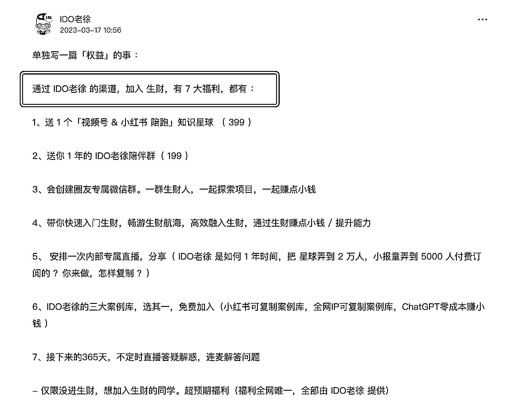
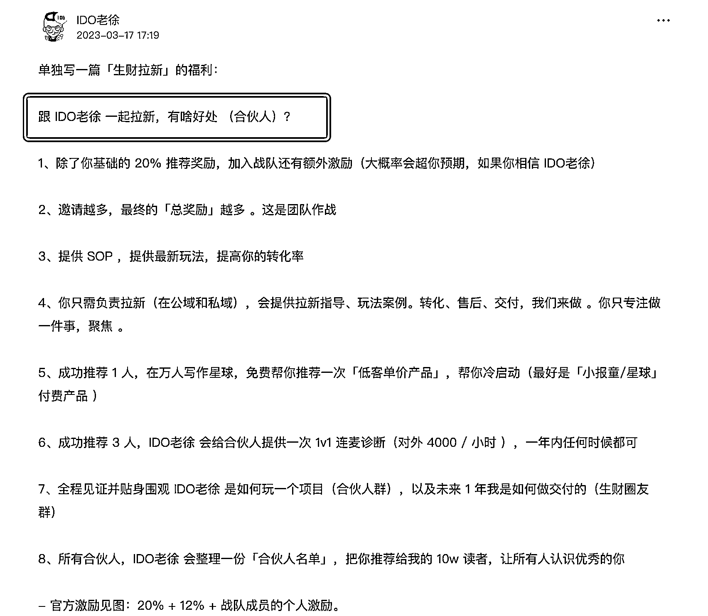

# 《普通人的「生财 418 拉新之路」，可复制路径》

> 原文：[`www.yuque.com/for_lazy/thfiu8/hw4gbbai4yw7g2bm`](https://www.yuque.com/for_lazy/thfiu8/hw4gbbai4yw7g2bm)

## (147 赞)《普通人的「生财 418 拉新之路」，可复制路径》 

作者： IDO 老徐 

日期：2023-04-06 

普通人的「生财 418 拉新之路」，可复制路径 

1、去年，老徐第一次尝试了拉新，最终数据，应该是 20 人左右 。 

2、经过了一年的私域沉淀，今年的 418 拉新，截止此刻（3 天），179 人（ 图 1 ） 

3、一年时间， 新增了 150 人，做了啥事 ？ 

1）去年疯狂玩低客单价的案例库（100 元以内），积累了 5000 位付费用户，且都加了微信好友 

2）我给了足够的邀请福利（七大权益），见 图 2 

3）我找了一批「合伙人」，一起来推生财。一个人的力量，太薄弱。毕竟我就是一个普通人，没有流量，不玩短视频，不出镜直播 。 

我给合伙人的权益（一起拉新），也足够（ 图 3 ） 

合伙人招募渠道：我日更的「公众号，星球，付费社群」等 

4）提前半个月准备 。可以看 图 2，图 3 的 发帖时间，是 3 月 17 日 

5）这种活动，一个人搞不来，太多运营执行的环节 。 从付费社群里，找了 飞巴 来「操盘」（规划整个玩法。他有经验，之前帮我操盘过活动）。以及从付费社群，找了 5 位「群管理员」（维护 围观群的秩序，以及内容分发）。 <ne-uli index-type="0"><ne-uli-i>●</ne-uli-i><ne-uli-c class="ne-uli-content" id="u66573fb6" data-lake-id="u66573fb6">这 5 位同学，全程感受了生财的玩法，这次也跟着加入了生财 。</ne-uli-c></ne-uli> 

6）过往 1 年，通过持续的日更，搞了个 1w 人的免费星球，吸引了一部分意向用户 

7）公众号日更，吸引了部分用户 

4、你可以做的（可复制路径） 

1）按如上思路，模仿。普通人去玩，拉新 10 个人，是没问题的 

2）按这个节奏沉淀，一年后，你也可以达到百人拉新的数据规模（虽然明年没有 418，但全年都可拉新），甚至数据会更好（前提是「执行力」）。 <ne-uli index-type="0"><ne-uli-i>●</ne-uli-i><ne-uli-c class="ne-uli-content" id="uab73480d" data-lake-id="uab73480d">老徐还在职场上班，没太多时间去精细化运营。很多环节做的非常粗糙，转化率绝对可以继续提升 。</ne-uli-c></ne-uli> 

如上， 简单记录下，希望对即将开启拉新的同学们，有一定的参考价值 。 

 

 

评论区： 

亦仁 : 优秀。预测一下，老徐整个 4 月整个拉新人数会是现在的 3 倍。 IDO 老徐 : 三倍 ，做不到 。压力太大，容易失眠 。 罗本 : 路径清晰，持续沉淀 飞巴 : 这 KPI 压力太有难度了[苦涩] 日更 10 年的张老板 : 搞起💪 小凡 : 加油，亦仁说你行你肯定行。[奸笑] 正宇 : 牛。 莲深 : 厉害