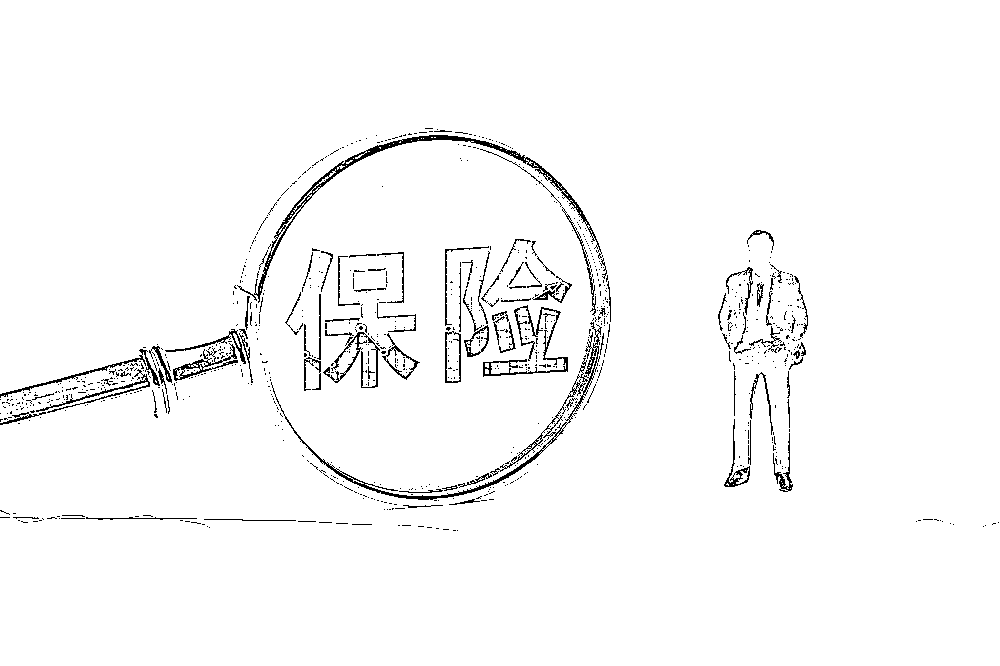

# 《全行业都爱惨的“转介绍”，为啥老是做不好？》

> 原文：[`www.yuque.com/for_lazy/thfiu8/ugaiew7kbil858zk`](https://www.yuque.com/for_lazy/thfiu8/ugaiew7kbil858zk)

## (27 赞)《全行业都爱惨的“转介绍”，为啥老是做不好？》 

作者： 奋斗的木鱼 

日期：2023-04-07 <ne-h3 id="d3fd8757" data-lake-id="d3fd8757">▍缘起 ▍</ne-h3> 

最近在接手一项工作，为企业某个产品提高复购和转介绍率，因为工作还在试验阶段，所以整体效果还没能跑出数据来做判断。 

由于接了这项工作，所以对“复购”和“转介绍”这个词语有着较过往多一点的思考，基于李叫兽的文章，一下子把过往的思路打通了，便把自己的思考写下来，以下均是个人观点，大伙且看且辨。 

以下从 4 点出发讲诉本文内容，共计2321 字，预计需阅读 13 分钟。 

1.什么是转介绍？ 

2.转介绍的好处有哪些？ 

3.为什么那么多企业做不好转介绍？ 

4.结语。 <ne-h3 id="3cf3f63c" data-lake-id="3cf3f63c">▎什么是转介绍？ ▎</ne-h3> 

不管哪个行业，我们都在关注一个词“转介绍”，那么，到底什么是转介绍呢？ 

从字面的意思去理解：转介绍即“转向他人进行介绍”，而这个转向介绍一般是从“购买方或使用者”转向“身边的人”进行的。 

那它的本质是什么？ 

在我个人浅短的认知里，我把它的本质定义为：一种利己+利他的分享行为。 <ne-h3 id="71ae25ad" data-lake-id="71ae25ad">▎转介绍的好处有哪些？▎</ne-h3> 

那么转介绍为什么有用呢？ 

或许很多人会冒出一堆答案：转介绍好成交、转介绍能拓客、转介绍能帮自己解决客户信任等等。 

那么“转介绍”为什么能达到以上的效果？ 

在回答问题前，我们要回到“产品”，在产品这里，其实有很多有意思的现象（详细请查看【李叫兽】对营销人来说，最难推的产品是什么？）。 

 

在李叫兽的文里，我们可以看到不同的产品，在被客户接受过程中，天然会存在不同的难点，例如巧克力与保险，为什么巧克力容易被人接受，而保险比较难？ 

因为不同产品在“产品接受门槛、产品缺乏先验性价值、产品带来负面形象、产品理解成本高、产品不符合认知”等问题上的程度不同导致的，在巧克力与保险对比里，他们在接受门槛，先验性价值等就不一致。 

有不一致的环节就会存在不同的转化难点，那么转介绍在这些环节里能做什么呢？ 

转介绍在这些环节里能做的太多了。 

1.寻找到能达标门槛的同类客户； 

2.提供产品先验或后验价值； 

3.避免负面影响； 

4.降低认知难度。 

 

1.寻找能达标门槛的同类客户 

转介绍这个动作优先会发生在转介绍人身边，“身边的人”能在身边，部分原因是彼此间具有相同的属性（爱好、职业、能力、收入水平等），且能获取到转介绍的信息大多源于有同类的需求，因此一旦某位转介绍人进行转介绍，触达到的人就已经被转介绍人进行了无意识的筛选，被转介绍人符合门槛的程度自然高。 

2.提供产品先验或后验价值 

第 2 点我们可以换个更通俗的话“我已经帮你测试过了”，产品的价值如何，直接看转介绍人就行。 

3.避免负面影响 

认识的或身边的人开始用了，自然也在帮助自己排雷，避免的可能由于负面影响带来的伤害。 

4.降低认知难度 

大伙是否发现，我们在看一个产品的时候，看到很多高大上的词语，但是我们转介绍的时候冒出的却是一些大白话，为啥呢？ 

因为我们更了解身边人对语言的理解、对事物的认知程度，因此我们讲的话会让身边的人更容易理解。转介绍人也会存在以上情况，转介绍人更了解被转介绍人，因此在信息传播和认知难度上，能更快更易得降低被转介绍人的认知难度。 

转介绍的作用远不止以上几个小点，它还能提供强有力的信任力、扩大信息源等特点，由于切分的维度较多，就不一一列举了。 <ne-h3 id="c9203f3e" data-lake-id="c9203f3e">▎为什么那么多企业做不好转介绍？ ▎</ne-h3> 

从上面看，转介绍的大部分起源其实是因为产品，所以做好转介绍，本质还是回归到产品。 

我们很多企业在转介绍的动作上的出发点很多是基于“购买方或使用者”利己的角度出发的，一说要提高转介绍，下意识的动作会出现以下几招： 

1.给出或提高转介绍的佣金，企图用企业认为的“高佣金”来推动客户进行转介绍； 

2.发动销售员，倒逼销售员对客户进行话术提醒，通过销售与客户的关系来拉动转介绍； 

3.制作活动，用活动的名义来提高转介绍。 

那么以上的招数有没有用的？ 

有用的，因为这些招数确实能驱动人去进行转介绍。 

但可惜，这些招数能驱动的人是极其有限的。 

为什呢？ 

有三个前提： 

1.转介绍的“利己”在客户内心有不同的标准 

转介绍虽然是有利己的存在，但这个利己的程度在客户内心是有不同标准的。 

客户需要的利己，不只有单纯的金钱或奖品的利己，还有社会关系网络、社会地位、精神价值（马斯洛需求）等，如果这个“利己”达不到客户的预期，客户不会产生转介绍这个行为。 

2.产品达到客户预期的程度 

一个产品，产品本身达不到客户预期，客户是不会愿意进行转介绍的，因为产品是解决客户的需求，如果客户本身都没能感知到解决了他的需求，这款产品对客户来说就是一个 60 分或不合格的产品。 

3.围绕产品的服务链条未达客户预期 

有了好产品，一定有好的转介绍吗？ 

客户在评价一款产品，并不是单独的评价产品，他把接触产品的整个链条都会将归纳为产品价值。 

这里我们可以结合“利己”的标准，如果一个产品好，但是围绕产品的服务本身很糟糕，你会不会担心转介绍的时候会带来很多潜在的风险（例：服务恶劣，导致被介绍人受了一身气）？ 

因此在企业层面，我们的转介绍率低，往往起缘是产品本身的问题，在产品的打磨上，我们没达到客户预期，这就导致我们在引导客户转接时，就像在旱地里种植，花了大力气却一无所获。 

其次，是围绕着产品的服务体系没有搭建好，导致产品的价值被其余的环节体验磨平。 <ne-h3 id="afd1aea6" data-lake-id="afd1aea6">▎结语  ▎</ne-h3> 

转介绍为什么深受老板们喜爱，因为它能帮助我们寻找客户、提供产品检验的现实案例、搭建与客户信任的桥梁等。 

为什么大多数企业转介绍做不好？ 

1.大多数企业没有认识到“转介绍”的前提是“好产品”； 

2.具备“好产品”的企业没有围绕产品搭建好“合格的服务链条”，导致其余的服务体验磨平了产品价值。 

评论区： 

暂无评论