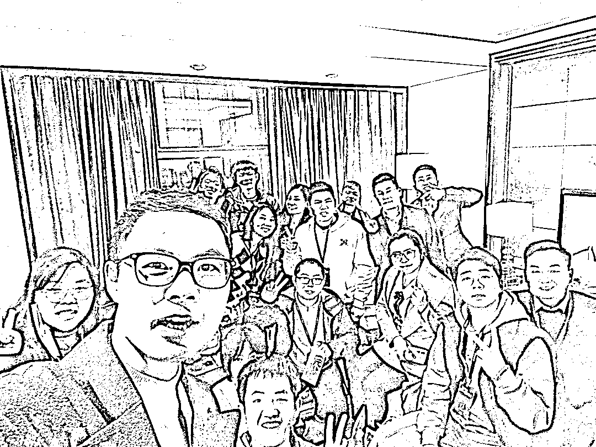

# 《线下小聚复盘：赚钱的个人核心竞争力》

> 原文：[`www.yuque.com/for_lazy/thfiu8/vsgagmv3x1konqyo`](https://www.yuque.com/for_lazy/thfiu8/vsgagmv3x1konqyo)

## (51 赞)《线下小聚复盘：赚钱的个人核心竞争力》 

作者： 曾丽@丽丽曾 

日期：2023-04-07 

线下小聚复盘：赚钱的个人核心竞争力 

大家好，我是丽丽，一个营销出身的运营。这是全国见面会时我组的小聚复盘。 

定这个主题背后的思考：项目、红利等都是不断变化的，我们要更好地赚钱，要去重点关注不变的（比如核心竞争力就是不变的中很重要的点），这样才能以不变应万变。 有核心竞争力后，可以迁移换项目、可以在一定程度上穿越周期、可以在大环境不好时有自己的小天地。 点击阅读： 

丽丽的小尾巴： 1、《如何通过运营挖掘超级用户付费价值，实现用户留存并提升产品体验？》 

非常感谢沐文老师、半夏老师对我这篇文章的指导。 

2、《才 391 个小红书粉丝，但引流私域 432 人成交 308 单的复盘》 

3、更多我在生财发布的文章 

丽丽曾 [https://q0hc3k7yqz.feishu.cn/docx/QMAddgzWDoln2jx40DBcDNCRnmh](https://q0hc3k7yqz.feishu.cn/docx/QMAddgzWDoln2jx40DBcDNCRnmh)[https://t.zsxq.com/0bCIucIMD](https://t.zsxq.com/0bCIucIMD)[https://t.zsxq.com/0aaQpKLAT](https://t.zsxq.com/0aaQpKLAT)[https://q0hc3k7yqz.feishu.cn/sheets/shtcnMMHEhPCxt8K49Y57e50aAd](https://q0hc3k7yqz.feishu.cn/sheets/shtcnMMHEhPCxt8K49Y57e50aAd) 

评论区： 

大麦-手机自动赚钱 : 很赞，组局 sop 曾丽@丽丽曾 : 有你的分享，更赞了啊哈哈哈 美妙人生 : 流程里有一些小细节都是比较用心的 曾丽@丽丽曾 : 被发现啦[玫瑰][玫瑰]很高兴遇见你啊哈哈哈 包一团 : 好棒，下次组局可以用到[呲牙] 曾丽@丽丽曾 : 期待你组局后的分享[呲牙]