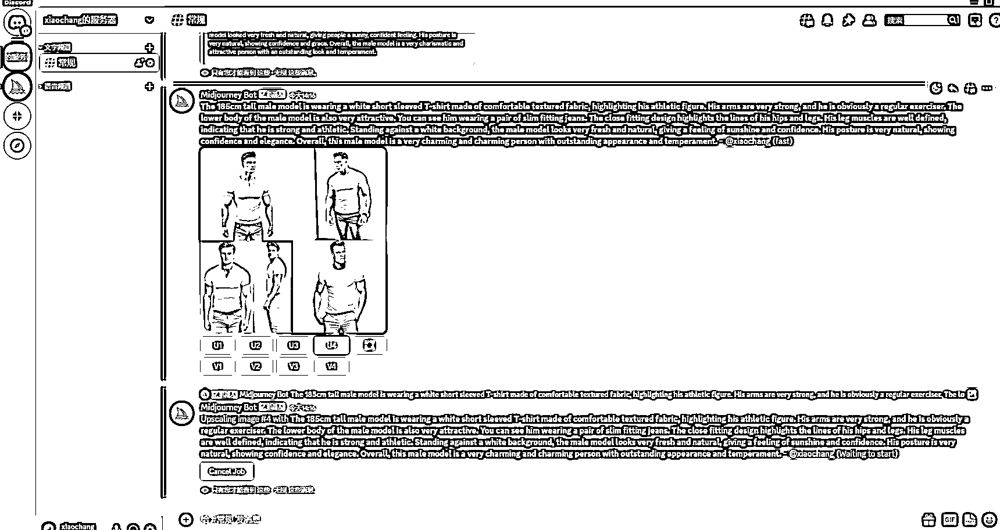
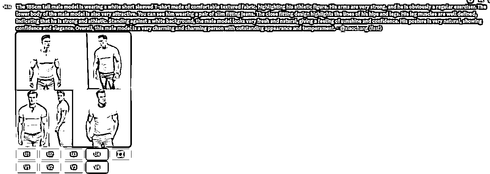
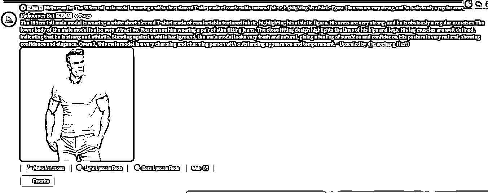
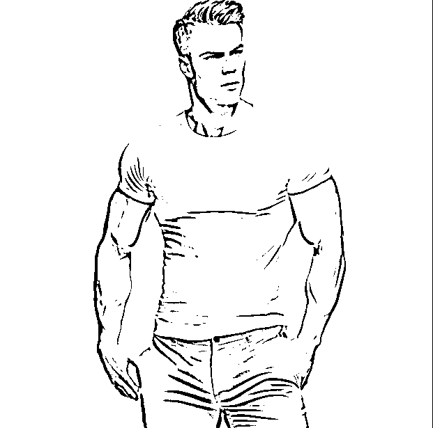
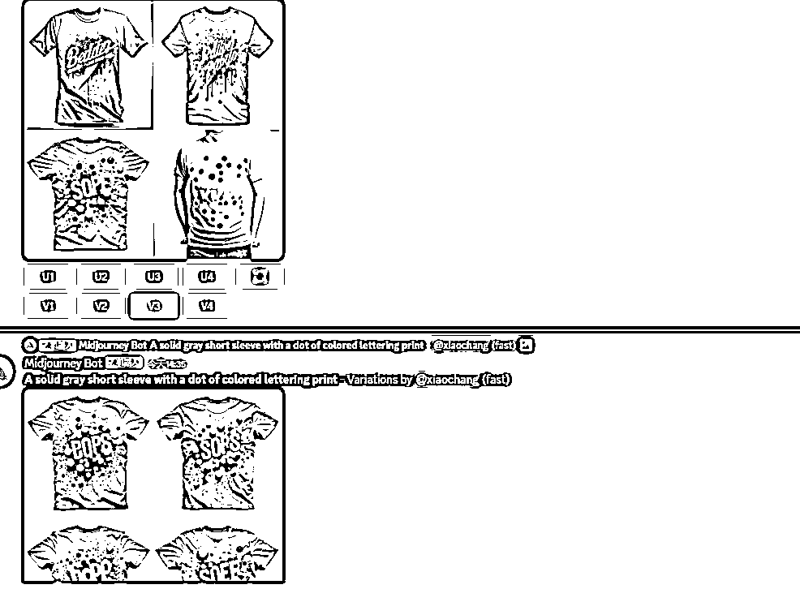
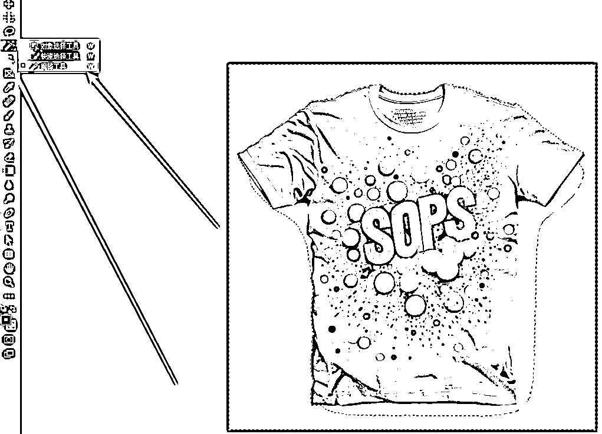
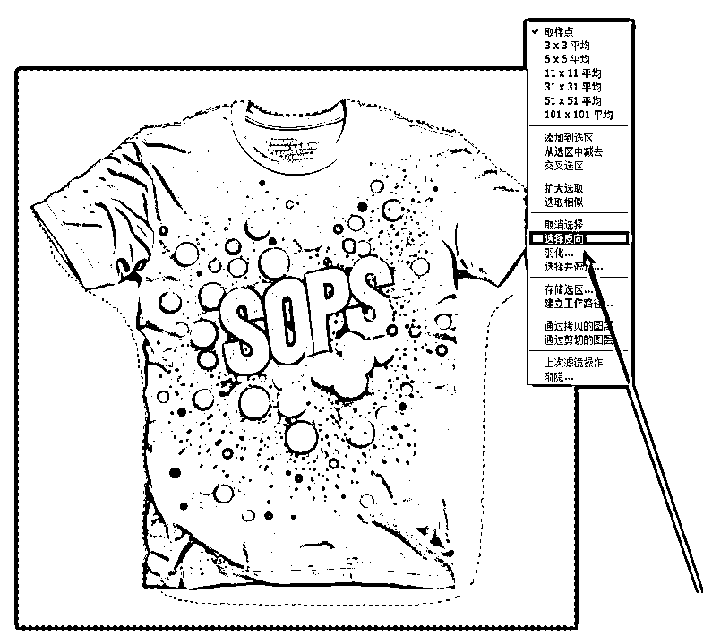
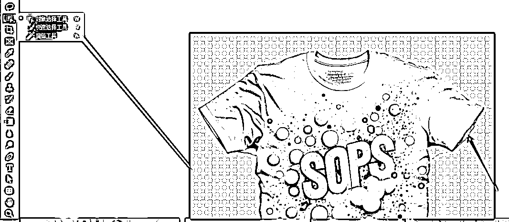
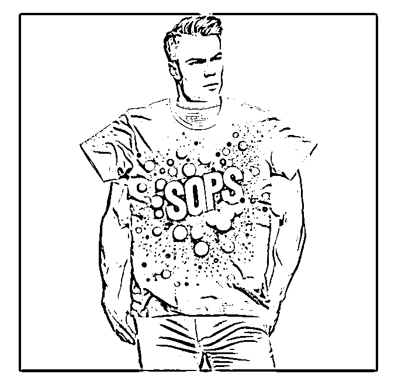

# 《用 AI 绘画制作电商模特主图思路》

> 原文：[`www.yuque.com/for_lazy/thfiu8/vs90br2geb55vfet`](https://www.yuque.com/for_lazy/thfiu8/vs90br2geb55vfet)

<ne-h2 id="c1a1c56b" data-lake-id="c1a1c56b"><ne-heading-ext><ne-heading-anchor></ne-heading-anchor><ne-heading-fold></ne-heading-fold></ne-heading-ext><ne-heading-content><ne-text id="ubd70919e">(90 赞)《用 AI 绘画制作电商模特主图思路》</ne-text></ne-heading-content></ne-h2> <ne-p id="uca19abec" data-lake-id="uca19abec"><ne-text id="uba92350f">作者： 侠狼</ne-text></ne-p> <ne-p id="uf9b16641" data-lake-id="uf9b16641"><ne-text id="u632a4f91">日期：2023-04-03</ne-text></ne-p> <ne-p id="uba0bd6e4" data-lake-id="uba0bd6e4"><ne-text id="u05746c2d">今天刷抖音的时候，刷到一个用 AI 绘画来制作电商主图的，今天我就把这个完整的教程以及思路写一下。</ne-text></ne-p> <ne-p id="u2a4cbc6b" data-lake-id="u2a4cbc6b"><ne-text id="u337115d5"> ChatGPT+Midjourney 制作思路分享</ne-text></ne-p> <ne-p id="u3a106d2d" data-lake-id="u3a106d2d"><ne-text id="ue2f0c07a">我的制作思路与实操制作技巧。</ne-text></ne-p> <ne-p id="u2dc01699" data-lake-id="u2dc01699"><ne-text id="u763e28ff">首先用 ChatGPT，让他帮我去写这个模特的描述，这里可以用中文对话，我们后面用翻译软件翻译回来就行。</ne-text></ne-p> <ne-p id="u7cdb3d24" data-lake-id="u7cdb3d24"><ne-text id="u0c2a87d8">目前市面上很多的这个接口类型的都挂了，这里就不提供了，我估计我提供没多久估计又会打不开。</ne-text></ne-p> <ne-p id="uda457e72" data-lake-id="uda457e72"><ne-text id="ud9defca4">关键词有了，接下来的东西就简单了。</ne-text></ne-p> <ne-p id="u96f091bb" data-lake-id="u96f091bb"><ne-text id="u8caeb9f3">这里注意一下</ne-text></ne-p> <ne-p id="u7d739746" data-lake-id="u7d739746"><ne-text id="uc8770cf6">目前测试发现，Ai 生成的模特要是涉及到了“性感”这个关键词，MJ 是会拒绝生成的。</ne-text></ne-p> <ne-p id="u560a10b6" data-lake-id="u560a10b6"><ne-card data-card-name="image" data-card-type="inline" id="tZYYT" data-event-boundary="card"></ne-card></ne-p> <ne-p id="u9d21a98a" data-lake-id="u9d21a98a"><ne-text id="u4adf3f10">去掉这个关键词就可以进行生成了，要是依旧生成不了，我们再按照他给我们的提示，删除一些对应的就行。</ne-text></ne-p> <ne-p id="u77abc2db" data-lake-id="u77abc2db"><ne-card data-card-name="image" data-card-type="inline" id="kaAwv" data-event-boundary="card"></ne-card></ne-p> <ne-p id="ue024c168" data-lake-id="ue024c168"><ne-text id="u068531bc">生成完成后，要是觉得不好，或者需要微调，或者图生图，我们点就行。</ne-text></ne-p> <ne-p id="ud9e939eb" data-lake-id="ud9e939eb"><ne-text id="ua77384ad">U1，U2，对应的是，你这四张合集里面的顺序。</ne-text></ne-p> <ne-p id="u11fcfd39" data-lake-id="u11fcfd39"><ne-text id="u615a63a0">V1，V2，对应的是你这四张图里面，你要拿那几张来做图生图。</ne-text></ne-p> <ne-p id="u9aff4171" data-lake-id="u9aff4171"><ne-text id="u22bfdef5">我觉得 V4 可以，我点击图生图，然后点第四张。</ne-text></ne-p> <ne-p id="u18ebe676" data-lake-id="u18ebe676"><ne-card data-card-name="image" data-card-type="inline" id="E8IR3" data-event-boundary="card"></ne-card><ne-card data-card-name="image" data-card-type="inline" id="zy5So" data-event-boundary="card"></ne-card><ne-card data-card-name="image" data-card-type="inline" id="YuocL" data-event-boundary="card"></ne-card><ne-text id="u92be9105"> 最终的图，我们拿下来，模特这样就有了。</ne-text></ne-p> <ne-p id="u5cfa4147" data-lake-id="u5cfa4147"><ne-card data-card-name="image" data-card-type="inline" id="Dl4jj" data-event-boundary="card"></ne-card></ne-p> <ne-p id="u4ddb4056" data-lake-id="u4ddb4056"><ne-text id="u06153ca7">之后，我们去找个商品主图，因为我这边没有，我就用 AI 给我生成吧。</ne-text></ne-p> <ne-p id="ud11b9dde" data-lake-id="ud11b9dde"><ne-text id="u7a00e49a">我不是做设计的，又不想碰到版权问题，所以就直接用 AI 生成短袖图片了。</ne-text></ne-p> <ne-p id="u4dbbbce0" data-lake-id="u4dbbbce0"><ne-text id="u4fb77566">我英语不好，就一直用翻译软件帮忙了，其实只要敢做面对这些都没啥难度的。</ne-text></ne-p> <ne-p id="u995ffc88" data-lake-id="u995ffc88"><ne-text id="u915488dc">给 AI 的关键词：A solid gray short sleeve with a dot of colored lettering print</ne-text></ne-p> <ne-p id="ua042cec8" data-lake-id="ua042cec8"><ne-card data-card-name="image" data-card-type="inline" id="UNmmb" data-event-boundary="card"></ne-card></ne-p> <ne-p id="u22369744" data-lake-id="u22369744"><ne-card data-card-name="image" data-card-type="inline" id="MSLWV" data-event-boundary="card"></ne-card><ne-text id="u4c5f99d1">好了，接下来两个东西都有了，我们进行下一步操作，图片的话默认是白色底，我们去掉。</ne-text></ne-p> <ne-p id="u380fc9fa" data-lake-id="u380fc9fa"><ne-text id="u36d392ca">打开 PS，选择魔棒工具，反向选择一下，快捷键 Ctrl+J。</ne-text></ne-p> <ne-p id="uac5f12d6" data-lake-id="uac5f12d6"><ne-card data-card-name="image" data-card-type="inline" id="d1Ya9" data-event-boundary="card"></ne-card></ne-p> <ne-p id="uffa1227b" data-lake-id="uffa1227b"><ne-card data-card-name="image" data-card-type="inline" id="fcD8i" data-event-boundary="card"></ne-card></ne-p> <ne-p id="u87352917" data-lake-id="u87352917"><ne-text id="u191c7e8f">还有一些边边角角，我们可以用快速选择工具选中去操作，我的 PS 就只有那么点基础，有兴趣的可以做更好，我主要是提供教程方法。</ne-text></ne-p> <ne-p id="uf5f60da5" data-lake-id="uf5f60da5"><ne-card data-card-name="image" data-card-type="inline" id="cglWx" data-event-boundary="card"></ne-card></ne-p> <ne-p id="u3d8708f4" data-lake-id="u3d8708f4"><ne-text id="ud4d7e040">扣好了，我们把这个图片丢过去，然后导出，再发给，Discord，也就是我们的 mj。</ne-text></ne-p> <ne-p id="u6adfb65f" data-lake-id="u6adfb65f"><ne-card data-card-name="image" data-card-type="inline" id="tULgP" data-event-boundary="card"></ne-card></ne-p> <ne-p id="u198d78c4" data-lake-id="u198d78c4"><ne-text id="ud5e2c293">然后，我们将我们自己的图片上传后复制地址复制连接。</ne-text></ne-p> <ne-p id="u7ed9f076" data-lake-id="u7ed9f076"><ne-card data-card-name="image" data-card-type="inline" id="tynA3" data-event-boundary="card"></ne-card></ne-p> <ne-p id="ucceafa12" data-lake-id="ucceafa12"><ne-text id="u214d84dd"> 然后，我们在下方输入 /image prompt The 185cm tall male model is wearing a white short sleeved T-shirt made of comfortable textured fabric, highlighting his athletic figure. His arms are very strong, and he is obviously a regular exerciser. The lower body of the male model is also very attractive. You can see him wearing a pair of slim fitting jeans. The close fitting design highlights the lines of his hips and legs. His leg muscles are well defined, indicating that he is strong and athletic. Standing against a white background, the male model looks very fresh and natural, giving a feeling of sunshine and confidence. His posture is very natural, showing confidence and elegance. Overall, this male model is a very charming and charming person with outstanding appearance and temperament. - Upscaled by  --v 5  --iw 2</ne-text></ne-p> <ne-p id="u27e0e4f4" data-lake-id="u27e0e4f4"><ne-text id="u5f5dbdb0">Prompt 参数是，你的图片连接 你最后模特生成出来的图片词，完整的，复制下来，然后记得加上</ne-text></ne-p> <ne-p id="uf55d732f" data-lake-id="uf55d732f"><ne-text id="u34f69f48"> 据目前测试，要是衣服不带字母的话，生成出来的效果应该会更好的，纯色的估计效果会更好，因为个人时间关系，所以就先写那么多吧，有兴趣的后面可以自己花时间挖掘去玩玩。</ne-text></ne-p> <ne-p id="ubee6728a" data-lake-id="ubee6728a"><ne-card data-card-name="image" data-card-type="inline" id="KFHuV" data-event-boundary="card"></ne-card></ne-p> <ne-p id="u187353f2" data-lake-id="u187353f2"><ne-text id="uf7c65db2">思路是这样了，英文比我更好的，在这里应该可以做的更好，我这个是参考这个视频教程来的，也是做了一些补充，有需要的可以去看看这个原视频的玩法。 </ne-text></ne-p> <ne-p id="uc7909722" data-lake-id="uc7909722"><ne-text id="u1abe9761">总之思路就是这样，也算是复述了一遍以文字形式描述出来了。</ne-text></ne-p> <ne-p id="ud93e2026" data-lake-id="ud93e2026"><ne-card data-card-name="image" data-card-type="inline" id="vr4Lv" data-event-boundary="card"></ne-card></ne-p> <ne-p id="uf96af21e" data-lake-id="uf96af21e"><ne-text id="u1181f89c">我做的不算是很好，但是思路解刨，也算是更重要的，现有思路才会有更多实战玩法。</ne-text></ne-p> <ne-p id="u1d6e14ab" data-lake-id="u1d6e14ab"><ne-text id="u2d3fe720">Mj 这个会员，没有 visa 卡的，可以某宝找人代充，很快的。</ne-text></ne-p> <ne-p id="u1c4b0318" data-lake-id="u1c4b0318"><ne-text id="u7d7acc4a">具体的代充的问题我这边就不复述了。</ne-text></ne-p> <ne-p id="u320d78b7" data-lake-id="u320d78b7"><ne-text id="u7c686eab">不要问我像不像的问题，这些后期都是可以进行调整的，这个方法最快，要是觉得图片不行，不合适，大不了多生成几次就行了。</ne-text></ne-p> <ne-p id="ub901152e" data-lake-id="ub901152e"><ne-text id="u55eb1361">原视频地址：</ne-text>[<ne-text id="u4bd1a01b">https://v.douyin.com/AuXENRn/</ne-text>](https://v.douyin.com/AuXENRn)</ne-p> <ne-p id="u4fa04cea" data-lake-id="u4fa04cea"><ne-text id="u42551f71">最后，感谢@淘金之路太白姐姐，帮忙编辑，我的图片一直上传不上去</ne-text></ne-p> <ne-p id="ucee706ed" data-lake-id="ucee706ed"><ne-text id="u787e03f1">圈友有问题欢迎加我好友进行交流。</ne-text></ne-p> <ne-p id="u1960ba1e" data-lake-id="u1960ba1e"><ne-text id="u979b653c">我的微信：3957165，公众号：侠狼网创</ne-text></ne-p> <ne-hole id="uc2068b9f" data-lake-id="uc2068b9f"><ne-card data-card-name="hr" data-card-type="block" id="eNdlQ" data-event-boundary="card"><ne-p id="u65fdf425" data-lake-id="u65fdf425"><ne-text id="u0776cc74">评论区：</ne-text></ne-p> <ne-p id="ua33eb6a3" data-lake-id="ua33eb6a3"><ne-text id="uddbc1506">xq : sd,是不是这个思路呢</ne-text> <ne-text id="uc90fcc6c">侠狼 : 一样的，这个是图生图</ne-text> <ne-text id="u3f8f184f">xq : 好的，谢谢。才把电脑软件弄好。明天试试。</ne-text> <ne-text id="u50a7010d">笑爱丝 : 这个好</ne-text> <ne-text id="uab138288">晓岚 : 好思路[强][强][强]</ne-text> <ne-text id="u9c92a449">吉祥 : 有手就行系列</ne-text></ne-p></ne-card></ne-hole>