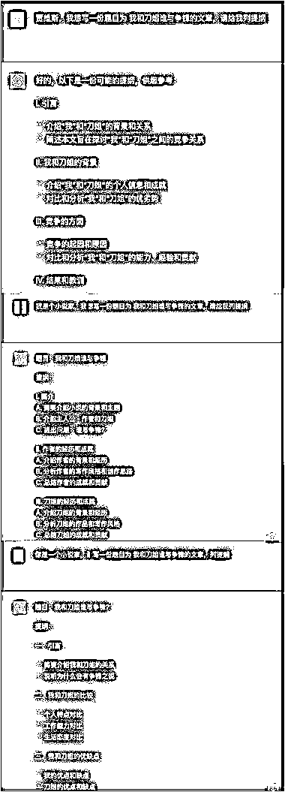
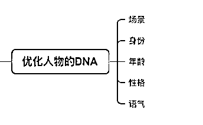

# 《GPT 调教心流法-身份篇》

> 原文：[`www.yuque.com/for_lazy/thfiu8/qn1qxpgoaga7f2p5`](https://www.yuque.com/for_lazy/thfiu8/qn1qxpgoaga7f2p5)

<ne-h2 id="21c1e844" data-lake-id="21c1e844"><ne-heading-ext><ne-heading-anchor></ne-heading-anchor><ne-heading-fold></ne-heading-fold></ne-heading-ext><ne-heading-content><ne-text id="uc8101028">(精华帖)(276 赞)《GPT 调教心流法-身份篇》</ne-text></ne-heading-content></ne-h2> <ne-p id="u67b91565" data-lake-id="u67b91565"><ne-text id="u13bbb1a2">作者： Bittle.白先生</ne-text></ne-p> <ne-p id="u6112c4de" data-lake-id="u6112c4de"><ne-text id="ub603fe68">日期：2023-04-04</ne-text></ne-p> <ne-p id="u6be2c478" data-lake-id="u6be2c478"><ne-text id="uac9cb1ec">有幸生日这天加入生财，分享等待已久的《GPT 调教心流法-身份篇》</ne-text> <ne-text id="ubd5a4b02">chatGPT 的调教使用心流法。听上去很虚，但作为一个 AIGC 的创作者，如果你静下心来细细品尝，对于你使用 GPT 会有质的飞跃。我相信市面上应该还没有心流法的文章，十年内容创作心流融入于 GPT，值得你细读！</ne-text></ne-p> <ne-p id="u987631c8" data-lake-id="u987631c8"><ne-text id="ue973c12d">为什么要学习心流法呢？</ne-text> <ne-text id="ub6468078">大家都晓得授之以鱼，不如授之以渔。看再多的教程，都是在“术”的层面，只有掌握好“道”，你才能灵活应用，举一反三。你保存再多的指令和教程，有多少会翻看了？所以融会贯通很重要。而且和 GPT 对话，是需要很多跳脱性思维的。如果你只停留在“索取”的思维上，只会得到一些格式化的回应。把 GPT 当作人、物，甚至是“场”，他就有很多的可能性，所以要大胆放飞自己的思维。用心去交流，时刻问自己，“它能明白我说什么吗？”。</ne-text></ne-p> <ne-p id="u7f67fdb8" data-lake-id="u7f67fdb8"><ne-text id="uf30aee42">接下来，请跟着我的思路，以及带上你们在最近实操的过程中的记忆，来验证心流法。为了确保你们有跟着我思路和有代入感，下文开始，GPT，简称小 G。</ne-text></ne-p> <ne-p id="u24fdea21" data-lake-id="u24fdea21"><ne-text id="uedd1f0a5">1、第一招 ——知己知彼，百问百胜</ne-text> <ne-text id="u76095b7f">都知道，你在与小 G 对话时候，要设定身份。问题是，身份怎么设定？有哪些身份，彼此如何区分？</ne-text> <ne-text id="uaffe5f0e">所以设定前，你要先明确或者意识到，身份的类型有哪些。</ne-text></ne-p> <ne-p id="u0b5e0d18" data-lake-id="u0b5e0d18"><ne-text id="ua3be4ec2">四个类型：</ne-text> <ne-text id="u42e0596a">技术身份：职业类型的专职人员</ne-text> <ne-text id="uc0875c9b">生活身份：邻居、大爷大妈等等工作身份：同事、上司、下属</ne-text> <ne-text id="uea5dc9f5">家庭身份：丈夫、妻子、儿女、姐姐等</ne-text></ne-p> <ne-p id="u0a800a91" data-lake-id="u0a800a91"><ne-text id="u05991dba">这些基本已经覆盖了你生命中会遇到的人。</ne-text> <ne-text id="u19fc067e">是的，你得把这些身份类型先在心里梳理出来，后边会有很重要的作用。</ne-text></ne-p> <ne-p id="u8e8eb005" data-lake-id="u8e8eb005"><ne-text id="u6d817cf5">这些身份是设定给小 G 的吗？格局打开！</ne-text> <ne-text id="u5f0766a0">我想告诉你的是，小 G 也需要知道你的身份！！</ne-text> <ne-text id="ucdcf894a">我做了一组对比问答，分别是</ne-text> <ne-text id="uec120020">不设定身份、设定我的身份、设定小 G 的身份</ne-text> <ne-text id="u76c31d33">（见图一）</ne-text> <ne-text id="uc4d1baa8">这组对比可以看出，当小 G 知道我是小说家身份之后，给到的反馈更优秀于其他的两个。</ne-text> <ne-text id="ue015ca48">更加工整，理解更加深刻，且充分融入到框架中。</ne-text></ne-p> <ne-p id="uf664051d" data-lake-id="uf664051d"><ne-text id="u97c43722">那怎么运用身份类型，请记住这个第一个心流点：</ne-text> <ne-text id="u0b792ba9">身份四问 ！</ne-text> <ne-text id="u4e86894b">1⃣️你是谁？</ne-text> <ne-text id="udfb8cdd3">4⃣️小 G 是谁？</ne-text> <ne-text id="ue20c56d0">3⃣️你想输出给谁看？</ne-text> <ne-text id="u20e8db94">4⃣️谁和你分享信息（情景设定）</ne-text> <ne-text id="ue3d0f178">用不同类型的身份运用在提问中，“知己知彼”，就能获得更优质的答案。</ne-text></ne-p> <ne-p id="u1eb7dc46" data-lake-id="u1eb7dc46"><ne-text id="u6021f11d">2、第二招—— 优化人物的 DNA</ne-text> <ne-text id="u529a8e70">为什么你总是要优化小 G 输出的文本？是因为你没有给他清晰的了解人物的 DNA。</ne-text> <ne-text id="u0eeb6c89">比如让小 G 输出一篇小红书笔记，我们需要种草的感觉，给姐妹分享的调调</ne-text> <ne-text id="u384f8f58">三组问题：</ne-text> <ne-text id="ud77c888f">1）写一篇关于 YSL 口红的小红书笔记</ne-text> <ne-text id="u61e1c14b">2）写一篇关于 YSL 口红的小红书笔记，用姐姐的口吻表达</ne-text> <ne-text id="ua9cdf606">3）写一篇关于 YSL 口红的小红书笔记，模拟我姐姐跟我分享的口吻，她大概 25 岁，有点暴躁和活泼</ne-text> <ne-text id="u7b9be892">（见图二）</ne-text></ne-p> <ne-p id="u73cf1476" data-lake-id="u73cf1476"><ne-text id="udb2af198">（声明一下，这些都是独立对话框在没有任何训练下直接出的结果）</ne-text></ne-p> <ne-p id="u53a24bff" data-lake-id="u53a24bff"><ne-text id="ua3641e1e">出来的结果很明显，</ne-text> <ne-text id="u346ab7be">第一篇是详情页的感觉，</ne-text> <ne-text id="ue7e848d4">第二篇是广告介绍，有销售味。</ne-text> <ne-text id="u0d185c72">第三篇就是一篇交流感浓厚、且个性鲜明的种草笔记！</ne-text> <ne-text id="u4f4022b0">你只要稍加表情就能发布了。是不是很赞？一步到位搞定小红书博文的感觉爽不爽？</ne-text> <ne-text id="u3e5e643d">所以，在提问的时候，但凡涉及到某个身份人物时候，要尽可能去优化它的 DNA。</ne-text> <ne-text id="u84becacc">可以从以下的角度入手：</ne-text></ne-p> <ne-p id="u84f2ccb4" data-lake-id="u84f2ccb4"><ne-text id="u37550ced">人物 DNA：交流场景、人物身份、年龄关系、性格、语气</ne-text></ne-p> <ne-p id="ufde0c3fb" data-lake-id="ufde0c3fb"><ne-text id="u66eed44c">图二中，我们做的是横向对比，同理，在纵向对话中，也可以通过 DNA 元素来优化。所以你只要记住一点，如果你需要小 G 输出与人交流的文本信息，就去丰富这个人物的 DNA。</ne-text></ne-p> <ne-p id="u738a5ccf" data-lake-id="u738a5ccf"><ne-text id="u6c1b3844">3、第三招——提问逻辑 化骨绵掌</ne-text> <ne-text id="u1d904b7e">提问的重要性不用多讲。小 G 是不是经常问非所答呢 ？一个小孩如果不能给你想要的答案，那你就得反思自己是否没有沟通清楚。更何况小 G 是一个拥有超级大脑的小孩，有海量的数据，它需要足够的线索来抓取有效信息，并回应的你精准诉求。那么又一个问题来了，什么是精准诉求？</ne-text></ne-p> <ne-p id="u87b0e8c2" data-lake-id="u87b0e8c2"><ne-text id="ue56305f5">“我想要一份旅游攻略”是不是精准诉求？并不是。</ne-text> <ne-text id="u7ea53e63">人有一个通病：在表达自己欲望时，会先说表面的需求或问题，而非核心诉求。</ne-text></ne-p> <ne-p id="u8f9db9af" data-lake-id="u8f9db9af"><ne-text id="u71219f4b">我举个例子，大家是不是经常会问别人“你饿吗？”，这个问题是真的关心对方吗？我相信很多时候是你自己饿了才会问的。</ne-text> <ne-text id="ubd2fe3be">所以你问别人饿吗？是表面问题，自己饿了，才是核心诉求。</ne-text></ne-p> <ne-p id="ubc46967e" data-lake-id="ubc46967e"><ne-text id="u1696c2ed">同样，《狂飙》大火，大家都看孙子兵法，这是表面需求，想成为高启强才是精准诉求。</ne-text> <ne-text id="u8d581489">想学好英语是表面需求，想获取工作晋升机会才是核心诉求。</ne-text> <ne-text id="ue3536583">“我想要一份旅游攻略” 是表面需求，想省心省力畅快游玩才是核心诉求。</ne-text></ne-p> <ne-p id="ud0de3a5b" data-lake-id="ud0de3a5b"><ne-text id="u9aa3fac0">提问逻辑的第一要义，把核心诉求告诉小 G！</ne-text> <ne-text id="u099d9853">你是什么人，想做什么事，达到什么目的，通过什么样的方法去达成，期望有什么样的结果。</ne-text> <ne-text id="u9820b5fe">摒弃自己平时的表面问题，你才有可能得到更好的答案。</ne-text></ne-p> <ne-p id="u9d5c7438" data-lake-id="u9d5c7438"><ne-text id="ufe52b6eb">现在你学会怎么提问，是不是就可以一步到位呢？no～解答问题小 G 需要足够的线索。</ne-text></ne-p> <ne-p id="u3f4d5556" data-lake-id="u3f4d5556"><ne-text id="u16e27599">第二要义，就是拆解逻辑</ne-text> <ne-text id="u92425d74">把你的问题当中涉及的元素分拆开来，特别是少见的词汇信息，先给小 G 热身检索，确保它理解的意思和你要的一致。你们俩的信息对称了，答案才会更加准确。</ne-text></ne-p> <ne-p id="ua7f72d2e" data-lake-id="ua7f72d2e"><ne-text id="u3641797c">举个例：“请作为创业者，写一份视频号关于茶农带货的商业计划书，用于路演”</ne-text> <ne-text id="ubb1cb5f7">这个问题，要拆分信息，1 视频号、 2 茶农带货、3 商业计划书、 4 路演</ne-text></ne-p> <ne-p id="u17e7be77" data-lake-id="u17e7be77"><ne-text id="u7021b0bc">其中“路演”在不同行业的意思不同，所以你需要提前和小 G 确认是不是给到你要的解读。</ne-text> <ne-text id="ue29bc37e">还有比如“谐音梗”这个词，小 G 是能解释什么是谐音梗，但他写不出这类文案，因为写出来也是基于英文的逻辑。</ne-text></ne-p> <ne-p id="u7b236198" data-lake-id="u7b236198"><ne-text id="ub5c916ef">因此提问逻辑两个要义：</ne-text> <ne-text id="u22ae7ece">核心诉求 和 元素拆解</ne-text></ne-p> <ne-p id="u8149bf4b" data-lake-id="u8149bf4b"><ne-text id="ue5fb58a4">4、第四招——用好 GPT 的万能方法论</ne-text> <ne-text id="ua62237c9">有一位名人说过，“没有形成方法论的时间积累都是经历，不是经验”。所以我要上大招了，如何与 GPT 沟通的方法论。经过前三招，你就可以讨论公式里，灵活运用了！</ne-text></ne-p> <ne-p id="u6bd16cdf" data-lake-id="u6bd16cdf"><ne-text id="u0ff9fc7b">step1 明确自己的核心诉求（目的）</ne-text> <ne-text id="u10c64368">step2 拆解元素（锁定信息库）</ne-text> <ne-text id="u9b8b457d">step3 设定身份（提问者，小 G，文本输出者，文本受众）</ne-text> <ne-text id="ud87b85b4">step4 丰富身份的 DNA 或者某个信息点的深度（优化答案）</ne-text></ne-p> <ne-p id="ue41b3aab" data-lake-id="ue41b3aab"><ne-text id="u27039892">基于上边这 4 步，理论上能满足你提问的 90%要求，然后再微调补充即可。这一套下来，犯错的概率是极少的。如果还不十分契合，那就需要用喂养数据的方式去训练，这里就不展开了。在思维模型上，还有一个技巧就是身份互换，“小 G，如果你是我的话会怎么做？”。这一段落 内容很少，不然怎么叫方法论呢？大道至简，朋友们。</ne-text></ne-p> <ne-p id="u60d61e72" data-lake-id="u60d61e72"><ne-text id="ubda5500b">AI 待续</ne-text> <ne-text id="uc05de836">使用 GPT 其实是也是训练我们表达的过程，他不仅提高我们的工作效率，也在减少沟通成本。</ne-text> <ne-text id="u5d181d5d">这套心法，基本适用于大部分人，因为我总结的底层逻辑，是基于人性洞察、营销洞察和思维模型相结合的。</ne-text> <ne-text id="u8f451679">可能有些朋友会觉得很虚，没关系，当你使用 GPT 时候触发到某个上述的心流点时，自然阔然开朗。</ne-text></ne-p> <ne-p id="u20e675ad" data-lake-id="u20e675ad"><ne-text id="u395afa30">这次分享主要是以身份篇为核心，其实还有“探索篇”，“物化篇”，“养成篇”可以继续挖掘。</ne-text> <ne-text id="uff1ff191">有机会再探讨，谢谢聆听，随时讨论。</ne-text> <ne-text id="u00ff0944">好奇的创意人永不落幕，我是 Bittle 白先生</ne-text><ne-card data-card-name="image" data-card-type="inline" id="kyZIL" data-event-boundary="card"></ne-card></ne-p> <ne-p id="u4aab2202" data-lake-id="u4aab2202"><ne-card data-card-name="image" data-card-type="inline" id="eO6Yq" data-event-boundary="card"></ne-card></ne-p> <ne-p id="ud6053e60" data-lake-id="ud6053e60"><ne-card data-card-name="image" data-card-type="inline" id="mziUw" data-event-boundary="card"></ne-card></ne-p> <ne-p id="u8190c794" data-lake-id="u8190c794"><ne-card data-card-name="image" data-card-type="inline" id="lUhY7" data-event-boundary="card"></ne-card></ne-p> <ne-hole id="u25533a3d" data-lake-id="u25533a3d"><ne-card data-card-name="hr" data-card-type="block" id="RtsiM" data-event-boundary="card"><ne-p id="uad40da2a" data-lake-id="uad40da2a"><ne-text id="u8428e09c">评论区：</ne-text></ne-p> <ne-p id="ueb31d846" data-lake-id="ueb31d846"><ne-text id="uc2d80000">AiBelieve : 生日快乐🎉🎉🎉</ne-text> <ne-text id="u88ec4cfc">田小田的甜 : 学习了，感谢！</ne-text> <ne-text id="u9c78acfb">阿紫 : 写的真好，生日快乐白先生~</ne-text> <ne-text id="u81a0efca">六条鱼 : 生日快乐</ne-text> <ne-text id="u0b3d936b">有期 : [强][强][强][强]</ne-text> <ne-text id="u168c8ff2">聂鲁达 : 有帮助，感谢</ne-text> <ne-text id="u69fe4486">叨叨 : 生日快乐，有看过一本书叫《心流》</ne-text> <ne-text id="uda4890c4">希声。 : 学到了</ne-text></ne-p></ne-card></ne-hole>