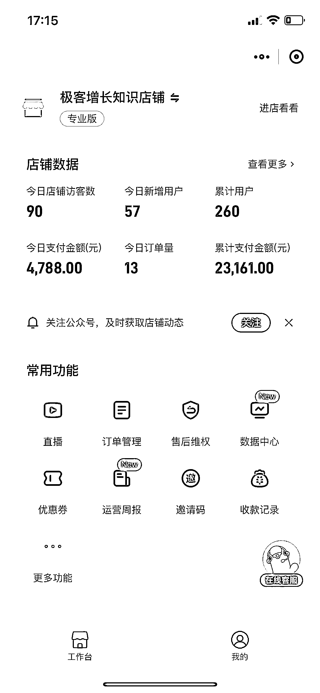

# 《抓住 GPT 封号热点事件，2 天变现 1 万》

> 原文：[`www.yuque.com/for_lazy/thfiu8/yo7ccgkx68l8kscg`](https://www.yuque.com/for_lazy/thfiu8/yo7ccgkx68l8kscg)

<ne-h2 id="104ef298" data-lake-id="104ef298"><ne-heading-ext><ne-heading-anchor></ne-heading-anchor><ne-heading-fold></ne-heading-fold></ne-heading-ext><ne-heading-content><ne-text id="ucaac56aa">(精华帖)(165 赞)《抓住 GPT 封号热点事件，2 天变现 1 万》</ne-text></ne-heading-content></ne-h2> <ne-p id="u419be7bf" data-lake-id="u419be7bf"><ne-text id="u9fa6a51f">作者： 令狐峰</ne-text></ne-p> <ne-p id="ue9c1b563" data-lake-id="ue9c1b563"><ne-text id="u67bd735c">日期：2023-04-04</ne-text></ne-p> <ne-p id="u0b94226e" data-lake-id="u0b94226e"><ne-text id="uf7c3ba38">大家好，我是令狐峰，极客增长的创始人。</ne-text></ne-p> <ne-p id="u7f8e1330" data-lake-id="u7f8e1330"><ne-text id="u2829163e">周日突然 GPT 针对亚洲节点的可疑账号，开始大规模封号，具体事件不在多做解释，GPT 封号事件不了解的具体可以看下面二张图，整个朋友圈一片哀嚎。</ne-text></ne-p> <ne-p id="u6f5b7893" data-lake-id="u6f5b7893"><ne-text id="u0d59ebb2">周日早上开始发生这件事情，我们意识到商业有机会，我和 赶紧行动，围绕 GPT 封号热点事件进行发售产品，第一天 9379，昨天变现 4788，虽然变现不多，但是快速拿到正反馈的感觉还是挺好的，因此我们来做一个简单的复盘。</ne-text></ne-p> <ne-p id="ubbafcb70" data-lake-id="ubbafcb70"><ne-text id="ue46fd4ba">更多内容，可以点击下方链接查看 ↓↓↓↓</ne-text></ne-p> <ne-p id="ud7d98685" data-lake-id="ud7d98685">[<ne-text id="u48bbaa60">https://bchje44bsl.feishu.cn/docx/KJ0CdYG18oMFStxpa17cxS0wnyt</ne-text>](https://bchje44bsl.feishu.cn/docx/KJ0CdYG18oMFStxpa17cxS0wnyt)<ne-card data-card-name="image" data-card-type="inline" id="sW2eU" data-event-boundary="card"></ne-card></ne-p> <ne-p id="u009186b2" data-lake-id="u009186b2"><ne-card data-card-name="image" data-card-type="inline" id="UxmVI" data-event-boundary="card"></ne-card></ne-p> <ne-p id="ue221202c" data-lake-id="ue221202c"><ne-card data-card-name="image" data-card-type="inline" id="s8LSH" data-event-boundary="card"></ne-card></ne-p> <ne-p id="u264762a4" data-lake-id="u264762a4"><ne-card data-card-name="image" data-card-type="inline" id="srbgN" data-event-boundary="card"></ne-card></ne-p> <ne-hole id="u2af6c673" data-lake-id="u2af6c673"><ne-card data-card-name="hr" data-card-type="block" id="m8jGB" data-event-boundary="card"><ne-p id="u0961342f" data-lake-id="u0961342f"><ne-text id="ua3f51528">评论区：</ne-text></ne-p> <ne-p id="u59d33ffb" data-lake-id="u59d33ffb"><ne-text id="u1e012948">书情小跟班 : 这行动力真强，热点把握非常精准</ne-text> <ne-text id="u24c82d28">芷蓝 : 每个异常事件最后都能落到一个个关键词上，厉害！</ne-text> <ne-text id="uad01cc9a">七小 : 令狐哥🐮</ne-text> <ne-text id="u2be345d7">聪聪 8.0@益生菌 : 执行力很强</ne-text> <ne-text id="u489f67f1">RPA 帮阿愚呱呱 : 厉害</ne-text> <ne-text id="u8fdcec05">金九渊 : 有看过极客的文章，推 notionai</ne-text> <ne-text id="ua7253091">凌波微影 : 首先，我们大家都知道封号这个问题存在，但是很多人却把它当成新闻热点看了就过了，但是有商业敏感度的人，知道这里存在抱怨，存在痛点，有痛点存在那么就会有相应的需求，针对需求提供产品。这一系列反应看似简单，但是却是我们大部分人缺少的。另外，就是具体的执行力很令人钦佩，制定目标，任务拆解，极短时间做出产品，这都需要超强认知做支撑，活该你赚钱了！</ne-text> <ne-text id="u4d038804">朱小茜同志 : 太厉害了吧，反应速度之快</ne-text></ne-p></ne-card></ne-hole>