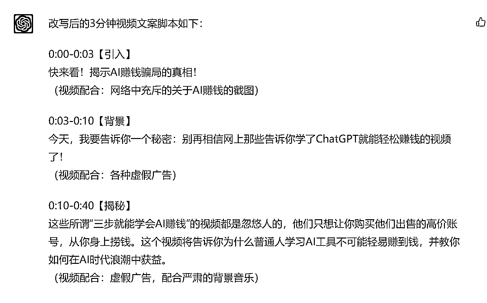

# 《如何用 GPT 无脑复制抖音热门口播视频》

> 原文：[`www.yuque.com/for_lazy/thfiu8/mwcwgwxohy4glrv3`](https://www.yuque.com/for_lazy/thfiu8/mwcwgwxohy4glrv3)

## (193 赞)《如何用 GPT 无脑复制抖音热门口播视频》 

作者： 小凡 

日期：2023-04-06 

大家好，我是小凡。在 AI 时代，让我们成为第一波富起来的人。这篇文章送给生财新到的小伙伴，也给大家分享我在 GPT 领域最新的研究成果。 

PS:这篇是我本人写的，不是 GPT。 

如追求最佳观感，可以移步飞书链接： 

[https://fjt9w880tn.feishu.cn/docx/AgWGdAk0fogwx2xtpo2cg3TCncb](https://fjt9w880tn.feishu.cn/docx/AgWGdAk0fogwx2xtpo2cg3TCncb) 

下文内容，与飞书无异。 

# GPT 是搞副业的必备工具 

为什么这么说？因为其实生财的项目库里已经有足够多的项目了，而且有非常多的低门槛项目。很多人在生财呆了快两年，为什么还没有赚到钱？我认为是一句生财里经常出现的话：“听话，照做。”我们没有做到位。 

不是项目不赚钱，而是我们在执行上面出现了问题。 

可能是我们认真地做了几条短视频发现没爆就没有坚持，也有可能其实是因为这些充满了大量干货的航海手册我们压根就没有理解到位。 

“听话，照做”这个道理，我们并没有做到知行合一。 

但是，现在不一样了，GPT 出现了。这是我在自己星球发布的另一篇文章，如何调教 GPT 成为“选题-封面-图文-标签”超级小红书博主里也有提到的： 

最需要学习 ChatGPT 的是任何一名线上内容创作者，而一切围绕 GPT 的内容、教学实际上他们的目标人群是内容创作者而不是普通个人。 

 

我甚至建议星球每一个在做线上内容的圈友，都入手一个 GPT 账号，并且要把它当做一项基础学科去学习研究。 

其实我们可以把 GPT 当成一个 3 岁神童，他的原始知识库是很粗浅的。但架不住他智商高呀，几千字的内容他一下子就能学会了。所以，他一定会成为我们 24 小时在线，任劳任怨，而且一教就会一点就通的天才童工。 

# 怎么做？ 

话不多说，直接上 PROMPT，抛一个实际运用案例来讲解一下如何调教 GPT 

## 第一步：给予设定（这个大部分圈友应该都知道） 

1.  输入 

你好 GPT~我有一个小忙需要你来帮助我，我希望你能成为我抖音脚本制作助理，我会教授你你需要参照的脚本框架，如果我向你输入的内容以“请学习”为开头，则我是在教授你知识，请你认真学习，学会后请回答“好的，我已经学会”。在教授一系列技巧后，我会以“请为下面内容改写脚本”为开头，向你提供短视频内容，请你根据你学到的技巧为我创作相应段视频脚本。如果你明白我的意思，请回复：“好的，小凡，很高兴帮助你，我将按照你说的成为你的抖音脚本制作助理。” 

1.  输出 

 

## 第二步：灌输知识（资料来源于抖音大航海手册） 

1.  输入 

请学习： 

视频脚本主要包括哪些方面 

1.景别：远景、全景、中景、近景、特写 

2.画面：通过各种场景，展现出视频要表达的东西 

3.台词（文案）：视频中要讲述的内容，可以是人物对谈，也可以是旁白 

4.运镜：镜头运动的方式，如：从近到远、平移推进、旋转推进等 

5.道具：视频中除任务外的内容，可以丰富视频画面的内容 

抖音上的作品不一定要视频形式，图文也可以，我们也经常能在小红书上看到数据非常好的图文笔记。 

但是随着现在短视频时代的不断迈进，内容视频化，已经是一个必不可阻挡的趋势，抖音本身也是一个视频属性非常强的平台。所以，我们建议在抖音上做内容、做创业项目 IP、垂直 IP 的创作者们，一开始就去学习如何制作视频脚本。 

请学习： 

常用脚本一：三段式脚本 

三段式脚本的核心是 “两重一轻”，开头 “重” 是为了吸引用户停留，让用户看下去提高你的完播率。 

所以说脚本的第一句话通常是你的标题，第一句话表述你这个视频的核心主题。 

然后是结尾 “重”，结尾必须给出另一个有力点击中用户，给用户一个关注你的理由，或者升华主体让用户感觉你讲的有价值你后续还会持续产生价值，这是我们说的结尾重。 

中间的 “一轻” 是指中间论述你的标题论点时可以适当 “偷懒”，但是也要保持节奏的轻快，去用相关案例佐证你的观点，最好是能用正面案例来不经意间的秀自己实力秀自己肌肉。 

无形装逼最为致命，不经意的实力和水平的显露才是建立的信任拉近粉丝距离的关键点。 

…………………………………………（还有很多，不做赘述） 

1.  输出 

 

TIP：注意，可以看到，在我们输入之后，GPT 不仅仅会说他学会了。他甚至还会自己总结这段内容里面他学到了什么，确实是真的学到。相比较我以前看航海手册的那种“一目十行法”，我真的感到羞愧了…… 

另外，当我看到“……同时，我明白了无形装逼的重要性……”时，我是真的笑喷了。 

## 第三步：输入从别的热门视频里扒下的文案 

1.  输入： 

你的学习能力太棒了！请根据你学到的常用脚本模板和爆款因素，选择你认为合适的脚本模板，并由选择性地穿插爆款因素，将下面这段内容改写，形成一份 3 分钟的视频文案脚本，需要包含时长、并建议配合怎么样的视频素材。不必担心文字太长超时，我可以加快我的语速： 

不要再相信网上那些告诉你学了 ChatGPT 就能赚钱的视频了，那些所谓三步就能学会 AI 赚钱的视频都是忽悠人的，他们只是希望你去购买他们售卖的高价账号，然后从你身上赚钱。 

………………………………………… 

1.  输出： 

 

 

甚至他还会说明，这个脚本他是用了哪些模板，用了什么爆款因素。你仔细想想你写的短视频脚本，有这家伙几秒钟学完之后写得好吗？ 

## 第四步：无脑制作 

GPT 都给我们把饭喂到嘴边了，还愣着干嘛？？？？？ 

1.  选题：来自热门视频，参照“爆过的选题往往都会再爆一遍。” 

2.  文案脚本：直接扒了同行，但是我们用了爆款脚本，甚至可能结构做得还比他们好。 

3.  录制：直接用剪映提词器录个口播就行，甚至现在还可以用数字人来做 

4.  剪辑：都告诉你配啥素材了，直接找素材就行了 

你就说牛不牛吧？什么？还要让 AI 帮你剪视频？？你怎么不说让 AI 直接给你打钱？？ 

（开个玩笑） 

目前 GPT 最大的一个问题还是没办法观看视频内容，暂时只能有 URL 的方式上传图片或者让其阅读视频的字幕来总结内容。没法去学习，就很难做出超越人类的模型来。所以我认为未来一段时间，短视频大体对于 AI 来说还是有一定门槛的。 

当然，我仅仅说了短视频还有门槛，但是图片和文字，我可以明确看到 GPT 有击败普通博主的潜力了。 

未来真正优秀的博主，一定是一边拥有超级优秀的内容制作法则，另一边能够得心应手调教 GPT 的双料人才。 

不过这也是我个人片面的认知，欢迎大家多给我拍拍砖，或许也有技术大牛已经搞定了 GPT 观看视频这个问题。生财里卧虎藏龙，我等小虫不敢班门弄斧。 

# 注意事项 

## 多夸夸这小子 

这人还挺傲娇的，我发现多说他做得好，他会帮我干活干得更卖力。甚至你说：“求求你了，神通广大的 GPT。”这逼还会把“神通广大的 GPT”放到文案里，真是不要脸！ 

## 记得分块发知识 

你发一长串，这小子其实也会说：“好的，我已经学会了”。而且他是一下子就回复你的，接着他会急不可耐地说：“请告诉我你要我帮你改什么内容，我已经准备好帮助你了”之类的云云。然后你给了改写的内容，但是他写出来的内容就会很垃圾，也没有参照你投喂的内容写。 

是不是有一股熟悉感？？？说的就是你呢！囫囵吞枣式地学了航海手册，然后就觉得老子天下无敌，我要年入百万了。我发现 GPT 也是这个尿性，你一旦投喂得多了，其实他事实上可能是因为算力还是什么的原因压根就没学会。所以他也不会跟我上面案例里一样，会自己做总结，做联想。 

好好想想，这是不是上学时，学渣和学霸之间的差别？学渣看了一遍就说自己会了，结果一做就废。学霸一步一步脚踏实地，每节课都做笔记，还会自己总结心得体会。这人与人之间的差距就这么来的，调教出来的 GPT 之间的差距也是这么来的。 

## 制作要求写得越具体越好 

你把要求写得越具体，指令越清晰，他就会越清楚你要的是什么。上述的案例我没有特别夸张，或许我之后还可以在联网以后尝试一下，不但让他给我提供建议的素材画面，还让他帮忙想想这些素材可以在哪里找到。 

## 要时常记得积累独属于你自己的 prompt 

上面提到过， 

未来真正优秀的博主，一定是一边拥有超级优秀的内容制作法则，另一边能够得心应手调教 GPT 的双料人才。 

一定要学会建立自己的 prompt 库，可以涵盖几个方面： 

1.  怎么发起学习指令让 GPT 更好地学会 

2.  怎么样的知识结构能让 GPT 更好地领悟 

3.  上文没有投喂范文，其实投喂范文也是可以的，所以我们也要建立范文库。在训练另外一个类型的 GPT 时我已经测试过，核心点是要让他去自己总结，会总结就说明他真的学会了。甚至你还能从他总结的知识点学到新东西。亏贼！ 

4.  还有一点案例里没有提到，那便是要不断修正，这个我相信大部分圈友都尝试过，就是说：你这个东西哪里哪里可以往哪个方向改云云 

## 把自己当成一名老师，而不是老板 

虽然我的标题写的是把 GPT 培养成打工人，但是大家如果仔细体会的话，会发现我们一直在教 GPT 怎么做得更好，我们是在传授。我们这样的调教方式，其实更像是让我们成为一名老师，把 GPT 当成一个智商 250 的天才神童去培养。 

我发现，太多人用 GPT 后就吐槽： 

这个 AI 不行，又是噶韭菜的。出来的内容没法用，还是没办法替代我这样的高质量人类捏~ 

真的是 AI 不行？还是你不行？这些人使用 GPT 时往往代入的是老板思维： 

“小 G，有个财务报告帮我做一下；小 G，帮写个短视频文案，关于健身的；” 

而 GPT 就像是一个初入职场懵懵懂懂的小白，他不善于拒绝，所以满口答应下来。但是他的老板又没有讲清楚他真正想要的是什么，也没有给他任何材料，什么入职培训都没有就让他冲上工作岗位干活。你觉得 GPT 能做好吗？而当 GPT 绞尽了自己脑汁，掏空自己在大学（OPENAI 训练的数据集）积累的有限的知识库，给老板上交了一份工作报告，结果得来的却是： 

“就这？就这就这？” 

“我还以为你们什么 OpenAI 大学出来的员工还真是那么一回事呢！” 

“整体还行，但是距离真正能用还差得很远呢。还得再修炼修炼。” 

“这样吧，你先给我干干什么翻译，帮我查查天气预报之类的杂活吧！”、 

你觉得，从你以前刚毕业初入职场的亲身经历来看，是员工小 G 的问题，还是老板的问题？ 

# 交个朋友 

小凡曾经做过 2 年风投，当年研究的就是 AI，那个时候还是 13、14 年，当时研究得很深入什么基础层、中间层、应用层，但那时都是什么智能驾驶啊，识图之类的东西，对普通人搞副业来说屁用没有。后来辗转反侧，也改了行换了几份工作，阴差阳转加入了生财，是缘分也可能是命中注定，毕竟优秀的人总会聚集在一起哈哈哈。 

随着 AI 绘图、ChatGPT 的大爆发，从我曾经的风投视角来看，这将是一个平台级的机会。互联网时代的继 PC、智能手机之类的第三次革命，不是 VR 不是 AR，也不是什么鬼元宇宙。而是 AI，甚至具体来说，是以 ChatGPT 为代表的智能语料库机器人（最后这个名词我瞎编的）。 

最后想和圈友们交个朋友，有 3 个点： 

1.  我运营了一个关于如何用 AI 做副业的星球，我是商业型的人，所以我会更专注研究如何应用 AI，而非解决探讨太多技术层面的事情。如果你认可我在 AI 领域的研究，可以联系我，备注生财圈友，有问必答。 

2.  虽然我是商业型的人，但是我需要结识更多技术型的人，毕竟 AI 还是一个高门槛的技术领域。有许多问题想与技术大佬讨论学习，当然不排除后面有更多商业合作的机会。 

前两天跟鱼丸咨询过，只要是龙珠圈友，就可以留下联系方式。那么，铺垫了那么多，如果在这 2 点中你有能够与我链接的地方，请联系我的微信：evanhhh6666，昵称：小凡。 

感谢@Lenry，@何轩，@徐同学，@嘟嘟 MD，都是非常优秀的生财圈友~ 

评论区： 

白起 : 好文，已收藏 老雷 : 咨询一点，你调教的 gpt，它的知识经验是否会被别的人共享？ 还是 这个 gpt 是独立的？为你个人账户单独使用学习经验？ 田小田的甜 : 感谢分享！ 大圣 : 学到了，接触 gpt 开始 大脑一直有这些想法，大佬把这些描述的更具体了，简直是喂饭 拔刀刘 : 有个问题想讨教下，gpt 真的吸收了那么多的上文内容吗？ 我曾经做了一个实验，给 gpt 发送几十篇文章，然后让他总结收到了多少篇内容，数量回答的很准确，但是让他总结一下第一篇文章的内容就不成了，大约只能总结最后的 2-3 篇内容。 所以判断 gpt 应该只能记住最后的若干条内容，太早发送的就没啥用了。题主有遇到这个问题吗，如何解决的？ wang : 你个人的，它只是当前这个聊天学会了你教的内容（能理解上下文），下次发起聊天还得重新来 傲软产品经理-Fel* : 同问 小凡 : 有这个问题，因为我是作为一个助理，他反而也不需要太多的知识储备，更多的是了解方式方法，所以我目前的解决方法是真传一句话，不会给过多的信息，只给方法。另外可能会重复给几次知识点。实在不行咱们从头再看，所以这也是我在文中提到要构建出自己的 prompt 库的原因。