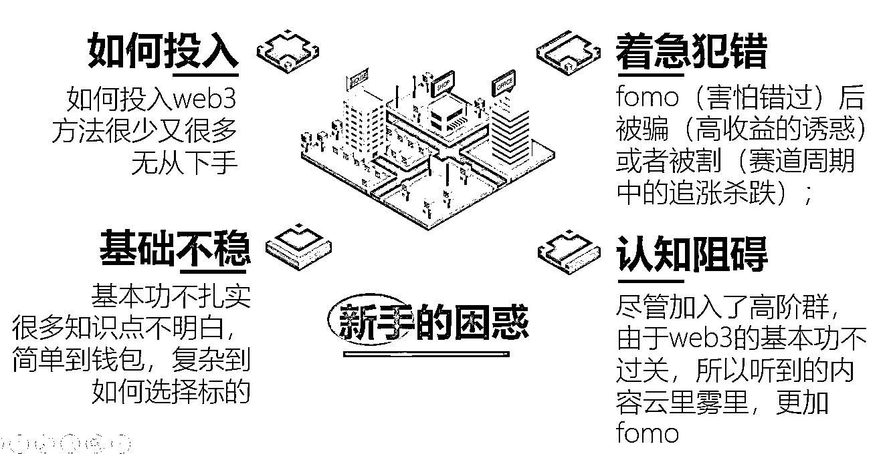

# 《24 小时满员的 Web3Going 新手营是如何达成的？》

> 原文：[`www.yuque.com/for_lazy/thfiu8/fk97dx8k281tncvk`](https://www.yuque.com/for_lazy/thfiu8/fk97dx8k281tncvk)

<ne-h2 id="6eb1f597" data-lake-id="6eb1f597"><ne-heading-ext><ne-heading-anchor></ne-heading-anchor><ne-heading-fold></ne-heading-fold></ne-heading-ext><ne-heading-content><ne-text id="u33a50855">(24 赞)《24 小时满员的 Web3Going 新手营是如何达成的？》</ne-text></ne-heading-content></ne-h2> <ne-p id="u430291db" data-lake-id="u430291db"><ne-text id="uf17f2ef9">作者： Start9527</ne-text></ne-p> <ne-p id="u7c945b9f" data-lake-id="u7c945b9f"><ne-text id="ua5b292ea">日期：2023-04-06</ne-text></ne-p> <ne-p id="ub72d1ebf" data-lake-id="ub72d1ebf"><ne-text id="ub49fc34f" style="background-color: rgb(255, 255, 255); color: rgb(47, 48, 52);">#start 讲 web3#</ne-text></ne-p> <ne-p id="u74fea840" data-lake-id="u74fea840"><ne-text id="u949b7d86" style="background-color: rgb(255, 255, 255); color: rgb(47, 48, 52);">#生财有术 no.25</ne-text><ne-text id="ucc6e4a17">#</ne-text></ne-p> <ne-p id="ueea03a00" data-lake-id="ueea03a00"><ne-text id="u7c6f31b7" style="background-color: rgb(255, 255, 255); color: rgb(47, 48, 52);">#24 小时满员的 Web3Going 新手营是如何达成的？#</ne-text></ne-p> <ne-p id="u848b169f" data-lake-id="u848b169f"><ne-text id="u158ab65d" style="background-color: rgb(255, 255, 255); color: rgb(47, 48, 52);">距离目标还差 25 篇原创文章</ne-text></ne-p> <ne-p id="u8ab28588" data-lake-id="u8ab28588"><ne-text id="u49ac696d" style="background-color: rgb(255, 255, 255); color: rgb(47, 48, 52);">酷！没想到一念一想的事情，真的就做成了，而且仅用了 24 小时就完成了一个既定的小目标，那是怎么做到的呢？这里做完整的复盘。给大家提供一个思路。</ne-text></ne-p> <ne-p id="uda90d7aa" data-lake-id="uda90d7aa"><ne-text id="ue66d40c0" style="background-color: rgb(255, 255, 255); color: rgb(47, 48, 52);">首先，是开局，之所以有这个事情，是因为两件事情</ne-text></ne-p> <ne-p id="ua31e1ff9" data-lake-id="ua31e1ff9"><ne-text id="u8b486bba" style="background-color: rgb(255, 255, 255); color: rgb(47, 48, 52);">1，我曾经在生财有术担任了两期生财有术小航海的 Web3 教练，大家对我影响都还不错，有不少学员都加了我，航海期间和航海后都会有相关的问题咨询我，我当时就想如果能统一给大家直播答疑就好了，因为 Web3 和大家都喜闻乐见的抖音，小红书等赛道的差距还是很大的，新手如果不知道其中具体操作的话，就真的是不知道，没有人手把手的带估计是很难跨过去的，指不定还会遇到被骗或者大坑，当时还和亦仁老师提过这个事儿，不过因为赛道的特殊性也没有太推进；</ne-text></ne-p> <ne-p id="u943211a3" data-lake-id="u943211a3"><ne-card data-card-name="image" data-card-type="inline" id="ZdTMp" data-event-boundary="card"></ne-card></ne-p> <ne-p id="u197ca017" data-lake-id="u197ca017"><ne-text id="ub16679be" style="background-color: rgb(255, 255, 255); color: rgb(47, 48, 52);">2，因为一位圈友和亦仁老师的互动，好像是在讲不好意思收费的应该怎么突破的交流，引起了生财有术航海家俱乐部社区的热烈讨论，影响我最深刻的一句话就是：我很贵，所以谈钱不伤感情。这句话如闪电一样击中了我，是呀，那么多学员问我问题，为什么我不能集中来处理呢？直接做个课程不就可以一并解决么？</ne-text></ne-p> <ne-p id="u269101ff" data-lake-id="u269101ff"><ne-text id="ud2af9347" style="background-color: rgb(255, 255, 255); color: rgb(47, 48, 52);">所以，就有了 Web3Going 的想法，当然名字是一变再变才最终有了它，web3going.eth 的域名也已经拿下，而且还涉及了与生财有术的吉祥物很像的吉祥物我叫它——小鲤，见下图。</ne-text><ne-text id="u15390dc3" ne-bold="true">鲤鱼，意为跳龙门前的鲤鱼，代指大家都是新人，在一个快速发展的赛道，有一跃成龙的寄托</ne-text><ne-text id="u453d96e2" ne-bold="true">。</ne-text><ne-text id="u35dbb68f" style="background-color: rgb(255, 255, 255); color: rgb(47, 48, 52);">所以，我希望接下来好好去运营这个项目，帮助更多新人在 web3 赛道，能走的不那么痛苦，并能够与优质社区能够无缝连接。</ne-text></ne-p> <ne-p id="uae439022" data-lake-id="uae439022"><ne-card data-card-name="image" data-card-type="inline" id="lmnTm" data-event-boundary="card"></ne-card><ne-card data-card-name="image" data-card-type="inline" id="S6JGg" data-event-boundary="card"></ne-card></ne-p> <ne-p id="u2abc03e4" data-lake-id="u2abc03e4"><ne-text id="uabb6e7de" style="background-color: rgb(255, 255, 255); color: rgb(47, 48, 52);">其次，是定位。一定是做自己能力范围内的事情，让别人花钱买单的交付物超所值才行，而不是为了赚钱而赚钱的事儿。我之前做樊登书店和樊登读书，对知识付费产品和低成本开实体书店还是比较有自信的，因为拿到过结果。但是这个在生财有术已然属于红海，大佬太多，尤其是最近的生财有术纳新，那叫一个卷呀。所以，我还是以我已经入圈两年的 web3 为主，而且我也拿到了结果（出了书，空投也没少拿，还有一年多的职场经历等等），正好这个版块在生财有术是蓝海，尤其是新手营更少竞争极小，因为高端的社区和新手之间其实是有一个鸿沟的，而我又有这个实力去做好这个板块的补位，所以，我就想以 web3 新手营为切入来做这个可以交付的产品。</ne-text></ne-p> <ne-p id="ued6c0727" data-lake-id="ued6c0727"><ne-text id="u7e6ab7e7" style="background-color: rgb(255, 255, 255); color: rgb(47, 48, 52);">最后，就是开干。当然不是无脑开干，本来两期生财有术 web3 小航海就帮我沉淀了不少学员，他们有的咨询过我问题，其实把这个消息告诉他们不算难。但是好巧不巧，亦仁老师在航海家俱乐部发了一个得意忘形的知识星球；好巧不巧，得意忘形的社区氛围居然就是可以含蓄的打广告（当然我硬广了一条，不过我会给得意忘形社区持续写几篇 web3 帖子的，这个我已经在践行了）；好巧不巧，我随意的一个帖子居然五十多位得意忘形的圈友加我，再不拿出点儿真本事就不靠谱了。</ne-text></ne-p> <ne-p id="u0f2e32bc" data-lake-id="u0f2e32bc"><ne-text id="uf7dcc441" style="background-color: rgb(255, 255, 255); color: rgb(47, 48, 52);">所以，我的具体工序如下：</ne-text></ne-p> <ne-p id="u3628da6f" data-lake-id="u3628da6f"><ne-text id="ud764c7a1" style="background-color: rgb(255, 255, 255); color: rgb(47, 48, 52);">1，于 4 月 1 号开通知识星球，因为知识星球相比于其他平台会更有传播度一些；</ne-text></ne-p> <ne-p id="uc28bcc40" data-lake-id="uc28bcc40"><ne-text id="u4a560c98" style="background-color: rgb(255, 255, 255); color: rgb(47, 48, 52);">2，用极短的时间草拟出来招募文案，发给几位连接比较深的圈友请对方帮忙指正，这一来一去就有了极好的调整，才有了正式版本（现在来看也依旧是完美的文案），并在 4 月 3 号晚上九点正式发布；</ne-text></ne-p> <ne-p id="u8cb29864" data-lake-id="u8cb29864"><ne-text id="u52fc8deb" style="background-color: rgb(255, 255, 255); color: rgb(47, 48, 52);">3，发公众号招募文案同时在得意忘形和生财有术同步发出第一篇之前在生财有术 Web3 小航海做教练的第一篇稿子，隔天又发了第二篇，在这两篇帖子的冲击下，对我本人感兴趣的便会自然链接到我；</ne-text></ne-p> <ne-p id="ud24589aa" data-lake-id="ud24589aa"><ne-text id="u845ac883" style="background-color: rgb(255, 255, 255); color: rgb(47, 48, 52);">4，优化自己的文案，和不同阶段加我的伙伴用不同的话术交流，最后选定了一个用于最终的版本；</ne-text></ne-p> <ne-p id="ubbdc0572" data-lake-id="ubbdc0572"><ne-text id="u2df77b6f">5，主动链接，给十几位之前打过招呼或者聊过的 web3 小航海的学员发了信息，并对我的新手营进行了介绍，没有发到的伙伴希望我这次首期结营后，口碑能影响到你。</ne-text></ne-p> <ne-p id="u8bb1c6d1" data-lake-id="u8bb1c6d1"><ne-text id="ue4b980fe">这一来二去，总计接近 150 人的有效沟通，转化达到惊人的近 30%左右，完成新手营的首期招募。而这只是开始，因为我知道课程交付和教会为止的承诺才是最考验我的，而我已经做好了准备，还请了一些嘉宾协助，希望能在新手营这个版块做出一些事情。</ne-text></ne-p> <ne-p id="u9eb65696" data-lake-id="u9eb65696"><ne-text id="ue48ce0df">仅用一天就完成了我之前做梦都不敢想的结果，还是很幸运的。</ne-text></ne-p> <ne-p id="u3b5ac5aa" data-lake-id="u3b5ac5aa"><ne-text id="u6970aadb" ne-bold="true">总结如下：</ne-text></ne-p> <ne-p id="u6416561e" data-lake-id="u6416561e"><ne-text id="u935bc199">其实，整个过程最重要的是三个关键要素</ne-text></ne-p> <ne-p id="u58685102" data-lake-id="u58685102"><ne-text id="ud3f7be7a">1，敢想敢干的心态；如果像往常那样，思前想后一定会错过最佳的时机。</ne-text></ne-p> <ne-p id="u7db0d7de" data-lake-id="u7db0d7de"><ne-text id="u0e26458d">2，有资源和运气加持；如果不是在航海家俱乐部听到亦仁老师的那句话和介绍的得意忘形星球，我想大概率我是不会起来的那么快的，资源促成了我的运气，运气帮助我完成了那一念一想。</ne-text></ne-p> <ne-p id="u7ebfc40f" data-lake-id="u7ebfc40f"><ne-text id="u0f24ecde">3，有能力胜任角色；当然最重要的是，我有能力做好指导 web3 新人这件事儿。</ne-text></ne-p> <ne-p id="u512dceae" data-lake-id="u512dceae"><ne-text id="u38a4e841">我希望通过这个内容和所有生财有术的圈友分享的是：</ne-text></ne-p> <ne-p id="ufd3ebca0" data-lake-id="ufd3ebca0"><ne-text id="ud8a28a3b">1，一切都没有那么难，想到就去干，不行咱们继续修和调整不就好了，怕啥；</ne-text></ne-p> <ne-p id="u5763385c" data-lake-id="u5763385c"><ne-text id="u1d955f12">2，小成靠努力，大成真的靠运气，这个训练营的成对我来讲其实是从内到外的激励，算是近两年来的大成了，与我而言；</ne-text></ne-p> <ne-p id="u00a6a2f9" data-lake-id="u00a6a2f9"><ne-text id="uba37776a">3，一定要知道我很贵，谈钱不伤感情，这句话打印出来，写到墙上，时刻提醒自己。</ne-text></ne-p> <ne-p id="ue0bc5c54" data-lake-id="ue0bc5c54"><ne-text id="u236205c0">当然，了解我的都知道我好为人师，所以，你有 web3 相关的问题，如果真的需要资询，我肯定依旧是知无不言言无不尽。</ne-text></ne-p> <ne-p id="u7d8f8ca4" data-lake-id="u7d8f8ca4"><ne-text id="ue8761b81">好了，这就是今天的主题，为了避开硬广之嫌，我特意去掉了价格课程介绍等，只是从成事的角度去分析了这件事，希望对你有启发。我是从生财有术私董会了解到的 web3，我必然会把我对 web3 的学习回馈到生财有术，希望大家一起掘进，一起生财有术，加油，Go！Start。</ne-text></ne-p> <ne-p id="uc3156183" data-lake-id="uc3156183"><ne-text id="u4df2270a">我的微信是：bookdao9527，欢迎链接呀。</ne-text></ne-p> <ne-hole id="ued963728" data-lake-id="ued963728"><ne-card data-card-name="hr" data-card-type="block" id="n4FmZ" data-event-boundary="card"><ne-p id="ud273ba26" data-lake-id="ud273ba26"><ne-text id="u754bec16">评论区：</ne-text></ne-p> <ne-p id="u4c38ca42" data-lake-id="u4c38ca42"><ne-text id="u6e2ae42f">so easy : 有脚本撸毛吗？</ne-text> <ne-text id="u7864213b">Start9527 : 没有😅都是手动一个一个做的。</ne-text> <ne-text id="u9d367633">思蒙 : 太棒啦，想到就干，这就是大多数人需要的第一能力，执行力很棒[强]</ne-text> <ne-text id="ue65c80de">Start9527 : 感谢🙏一起生财有术</ne-text></ne-p></ne-card></ne-hole>