# 《匿名信公众号小小复盘》

> 原文：[`www.yuque.com/for_lazy/thfiu8/pvvps8zg2n2bliyt`](https://www.yuque.com/for_lazy/thfiu8/pvvps8zg2n2bliyt)

<ne-h2 id="bffa48c0" data-lake-id="bffa48c0"><ne-heading-ext><ne-heading-anchor></ne-heading-anchor><ne-heading-fold></ne-heading-fold></ne-heading-ext><ne-heading-content><ne-text id="uc36e9d6c">(137 赞)《匿名信公众号小小复盘》</ne-text></ne-heading-content></ne-h2> <ne-p id="ub44dd06e" data-lake-id="ub44dd06e"><ne-text id="u290bca5a">作者： bink</ne-text></ne-p> <ne-p id="ub97c5ee3" data-lake-id="ub97c5ee3"><ne-text id="u0933130c">日期：2023-04-03</ne-text></ne-p> <ne-p id="u7b609958" data-lake-id="u7b609958"><ne-text id="u95c4d37c">hi~ 我是 bin，从 2022 年 7 月份了解到匿名信这个东西，然后就开始了我的实操，这是一个可以实现管道收入的小项目，长尾流量很香很香（现在也还有很多人做）</ne-text></ne-p> <ne-p id="u91d8ad76" data-lake-id="u91d8ad76"><ne-text id="ue5200ef3">从开始到现在我就发了不到十个作品（纯纯懒），累计变现 1w+，这是第二个系统的截图，第一个系统也有 5k，太长时间没有去弄了</ne-text></ne-p> <ne-p id="u1f862d48" data-lake-id="u1f862d48"><ne-card data-card-name="image" data-card-type="inline" id="Qv7gT" data-event-boundary="card"></ne-card></ne-p> <ne-p id="u4041194e" data-lake-id="u4041194e"><ne-text id="ued3319e3">变现：短信的成本 0.06~0.08 ，卖 0.99~1.5 一条，毛利润率 93%（二转可以做塔罗，情感挽回？）</ne-text></ne-p> <ne-p id="u801e52ac" data-lake-id="u801e52ac"><ne-text id="u02bf1b36" ne-bold="true">原理：客户通过微信公众号的短信系统给他人发送带签名的匿名短信。收件人可以通过公众号回复对方</ne-text></ne-p> <ne-p id="ua76d9a67" data-lake-id="ua76d9a67"><ne-text id="ua893168c">整体结构由公众号，短信系统，引流账号组成</ne-text></ne-p> <ne-p id="u0d5df6f9" data-lake-id="u0d5df6f9"><ne-text id="ueddc332f">前期的投入大概在 1500 左右，下面开始我们的实操</ne-text></ne-p> <ne-p id="u6e1dde39" data-lake-id="u6e1dde39"><ne-text id="u721962f1" ne-bold="true">一 交付设置</ne-text></ne-p> <ne-p id="u21bda626" data-lake-id="u21bda626"><ne-text id="u85b85307">交付主要全靠部署好的公众号自动完成，在这里需要准备注册公众号，对接系统，申请商户号这些基本设置</ne-text></ne-p> <ne-p id="udd33f69f" data-lake-id="udd33f69f"><ne-text id="u29b7c240">1.公众号注册</ne-text></ne-p> <ne-p id="u33a7cbe4" data-lake-id="u33a7cbe4"><ne-card data-card-name="image" data-card-type="inline" id="Xk8y0" data-event-boundary="card">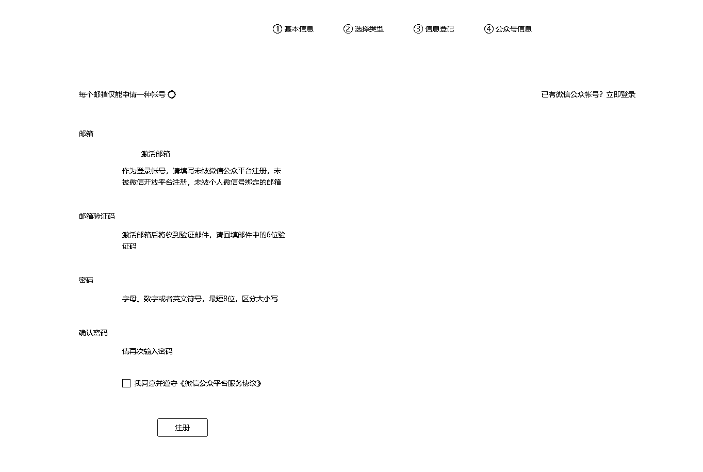</ne-card></ne-p> <ne-p id="ue1af5a26" data-lake-id="ue1af5a26"><ne-text id="ue5a46782">首先我们要去微信公众平台注册一个服务号，缴纳一个 300 块的认证费，设置好名字，头像，然后等他通过就行</ne-text></ne-p> <ne-p id="uae25963d" data-lake-id="uae25963d"><ne-text id="ub9c05b20">2.注册商户号</ne-text></ne-p> <ne-p id="u8328d52d" data-lake-id="u8328d52d"><ne-card data-card-name="image" data-card-type="inline" id="UbcEM" data-event-boundary="card"></ne-card></ne-p> <ne-p id="u208925d0" data-lake-id="u208925d0"><ne-text id="ua828b7fa">然后我们要去微信支付注册一个商户号，这个是匿名信收款需要用到的。</ne-text></ne-p> <ne-p id="uc40cc8ca" data-lake-id="uc40cc8ca"><ne-text id="u2691b387">3.接入系统</ne-text></ne-p> <ne-p id="ubc27c86f" data-lake-id="ubc27c86f"><ne-card data-card-name="image" data-card-type="inline" id="hm3kD" data-event-boundary="card"></ne-card><ne-card data-card-name="image" data-card-type="inline" id="AFyCF" data-event-boundary="card"></ne-card><ne-card data-card-name="image" data-card-type="inline" id="rLED4" data-event-boundary="card">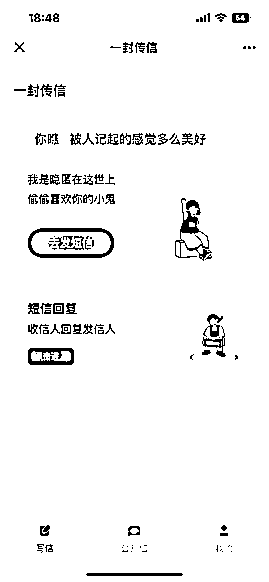</ne-card></ne-p> <ne-p id="u91b0aab5" data-lake-id="u91b0aab5"><ne-text id="ubb4bee72">这个就有很多选择啦，你可以根据你喜欢的 UI 来选择用哪一个系统，我用的是第三种（这种要自己注册域名），</ne-text></ne-p> <ne-p id="u513f1353" data-lake-id="u513f1353"><ne-text id="u76dd8a20">一般情况下淘宝就能搞定，通常都是服务器域名短信通道全包的。</ne-text></ne-p> <ne-p id="ue8d3499d" data-lake-id="ue8d3499d"><ne-card data-card-name="image" data-card-type="inline" id="aKB0Y" data-event-boundary="card">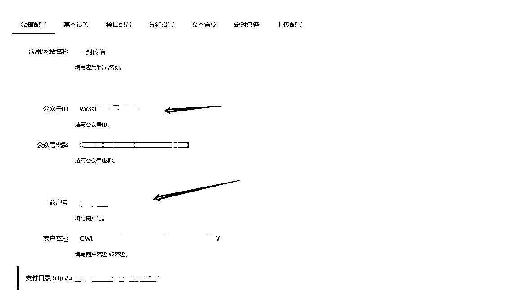</ne-card></ne-p> <ne-p id="u1ee6fc60" data-lake-id="u1ee6fc60"><ne-text id="ufa8135f9">然后我们需要在系统后台填入注册好的公众号 ID，跟微信支付秘钥（这里技术人员会手把手帮你部署，小白也不用太担心会复杂）</ne-text></ne-p> <ne-p id="u9fac909a" data-lake-id="u9fac909a"><ne-text id="ue1b842bc">4.优化公众号</ne-text></ne-p> <ne-p id="u9121047c" data-lake-id="u9121047c"><ne-text id="u452ad096">交付系统完成好之后我们就可以开始装修我们的公众号，这里用到的是芝麻小客服</ne-text></ne-p> <ne-p id="u759379ab" data-lake-id="u759379ab"><ne-card data-card-name="image" data-card-type="inline" id="IfDS9" data-event-boundary="card">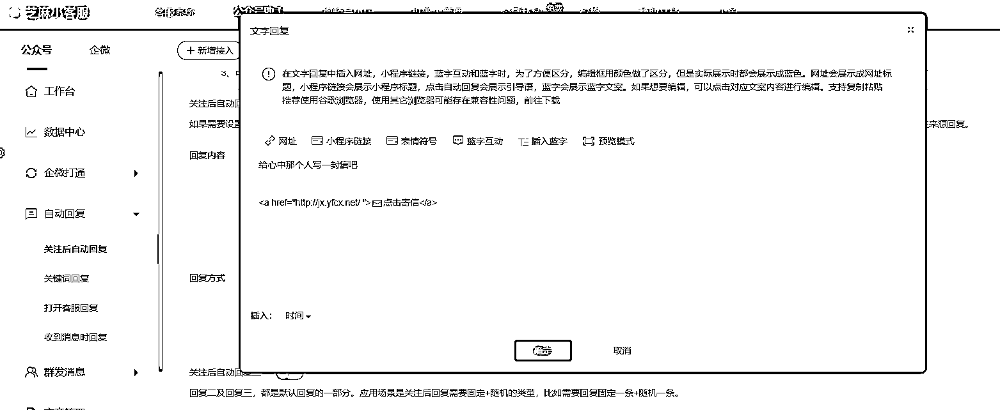</ne-card><ne-card data-card-name="image" data-card-type="inline" id="pLOhJ" data-event-boundary="card">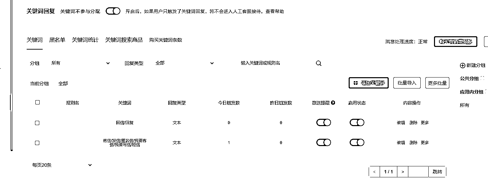</ne-card></ne-p> <ne-p id="u3c38f93a" data-lake-id="u3c38f93a"><ne-card data-card-name="image" data-card-type="inline" id="LJqT4" data-event-boundary="card">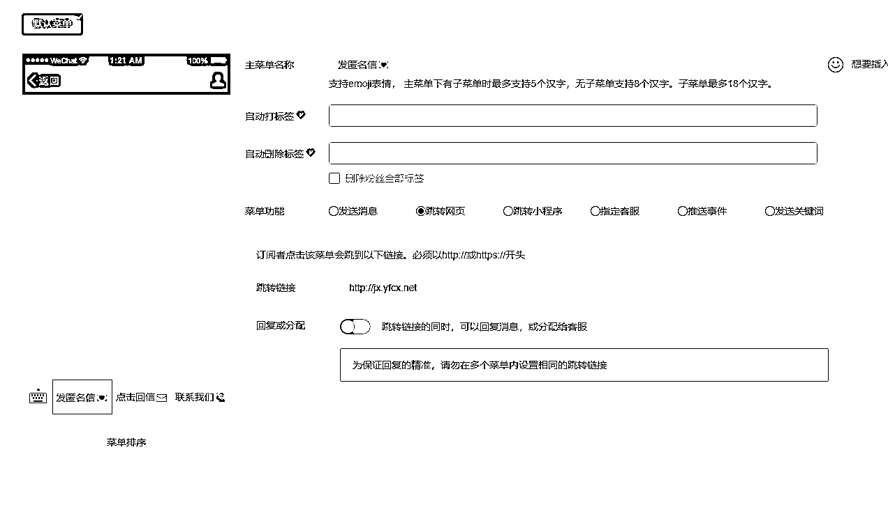</ne-card></ne-p> <ne-p id="uc1073751" data-lake-id="uc1073751"><ne-text id="u267ab06e">依次完成关注后回复的内容，关键词回复的内容，以及菜单栏之后，就可以直接上线了。</ne-text></ne-p> <ne-p id="u4844d932" data-lake-id="u4844d932"><ne-text id="u9fc9f440">做完这些，就可以开始引流变现。</ne-text></ne-p> <ne-p id="u77e4f5e7" data-lake-id="u77e4f5e7"><ne-text id="uf8b39bae" ne-bold="true">二 引流</ne-text></ne-p> <ne-p id="u3c786fb3" data-lake-id="u3c786fb3"><ne-card data-card-name="image" data-card-type="inline" id="ll6xP" data-event-boundary="card"></ne-card><ne-card data-card-name="image" data-card-type="inline" id="NHcL6" data-event-boundary="card">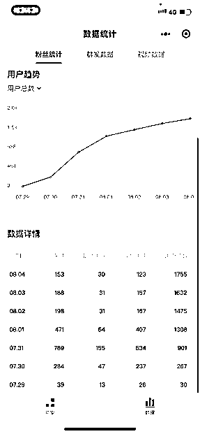</ne-card><ne-card data-card-name="image" data-card-type="inline" id="G1KXu" data-event-boundary="card">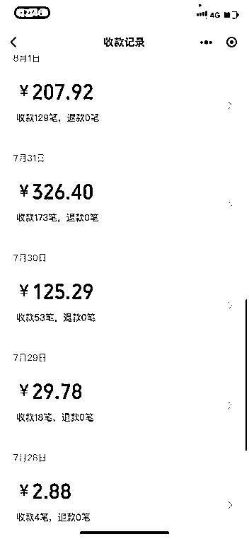</ne-card></ne-p> <ne-p id="u19bed415" data-lake-id="u19bed415"><ne-text id="u22365967">我是在 7-28 号完成部署的，然后 30 号开始尝试引流</ne-text></ne-p> <ne-p id="u0787c5ac" data-lake-id="u0787c5ac"><ne-text id="u88b6d79b">一个礼拜就收回了成本，还是在只发了一条视频的情况下</ne-text></ne-p> <ne-p id="ud04cd87a" data-lake-id="ud04cd87a"><ne-text id="uc7506147">1.抖音 快手 等短视频平台</ne-text></ne-p> <ne-p id="ua08ee69f" data-lake-id="ua08ee69f"><ne-text id="u1ed99d30">常见的内容多种多样， 这边建议是直接抄袭，直接抄袭 直接干</ne-text></ne-p> <ne-p id="u93521bc8" data-lake-id="u93521bc8"><ne-card data-card-name="image" data-card-type="inline" id="Yhmsh" data-event-boundary="card"></ne-card><ne-card data-card-name="image" data-card-type="inline" id="zJmwO" data-event-boundary="card"></ne-card><ne-card data-card-name="image" data-card-type="inline" id="xmdCI" data-event-boundary="card"></ne-card></ne-p> <ne-p id="u80044227" data-lake-id="u80044227"><ne-text id="uef9c6193">没有创作成本， 爆款的内核就是突出一个 EMO，只要你的故事够 e ，能引起的共鸣就够强，代入感也更强</ne-text></ne-p> <ne-p id="ucecb8c3e" data-lake-id="ucecb8c3e"><ne-text id="u7d14c616" ne-bold="true">同样的方法可以用在 soul，小红书，只要你会写故事</ne-text><ne-text id="ufbd3fed0">。</ne-text></ne-p> <ne-p id="u64809a6e" data-lake-id="u64809a6e"><ne-text id="ud1a0f9df" ne-bold="true">由于生财有很多引流大牛，我就不卖弄了。感兴趣的朋友翻一翻精华帖，再结合到这里来可能会更有帮助</ne-text><ne-card data-card-name="image" data-card-type="inline" id="nnxB4" data-event-boundary="card">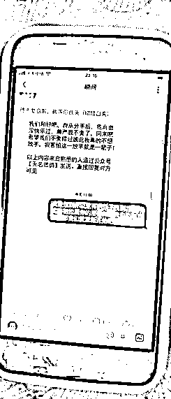</ne-card><ne-card data-card-name="image" data-card-type="inline" id="Fwe4B" data-event-boundary="card"></ne-card><ne-card data-card-name="image" data-card-type="inline" id="lmYgR" data-event-boundary="card">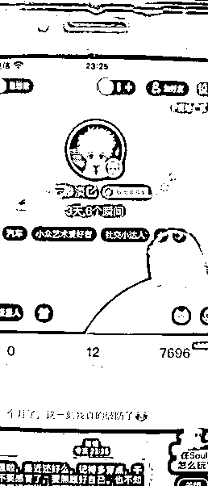</ne-card></ne-p> <ne-p id="u5524f38a" data-lake-id="u5524f38a"><ne-text id="ufecae041" ne-bold="true">咱们就是说，突出一个情感共鸣就行，故事全靠编，然后引起目标客户的感性冲动，那你的目的就达到了</ne-text></ne-p> <ne-p id="ua1c0e9da" data-lake-id="ua1c0e9da"><ne-text id="ubb8ebea4" ne-bold="true">三.变现</ne-text></ne-p> <ne-p id="u442c16e6" data-lake-id="u442c16e6"><ne-text id="u363b657f">变现很简单，一个就是直接变现，第二的话呢就是广告，或者你自己想做二转也可以</ne-text></ne-p> <ne-p id="u2a4abfcf" data-lake-id="u2a4abfcf"><ne-card data-card-name="image" data-card-type="inline" id="Upjbk" data-event-boundary="card"></ne-card><ne-card data-card-name="image" data-card-type="inline" id="OfLyE" data-event-boundary="card"></ne-card><ne-card data-card-name="image" data-card-type="inline" id="vIazE" data-event-boundary="card">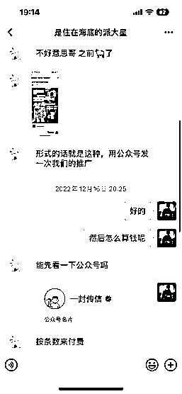</ne-card></ne-p> <ne-p id="u1c3509ac" data-lake-id="u1c3509ac"><ne-text id="uaa421800">比如说就有一个塔罗的找过来， 一般情况下都可以接的 ，或者你自己做多一个塔罗算命的业务也可以，这样链条比较完整</ne-text></ne-p> <ne-p id="u192c0017" data-lake-id="u192c0017"><ne-card data-card-name="image" data-card-type="inline" id="KsJf3" data-event-boundary="card"></ne-card><ne-card data-card-name="image" data-card-type="inline" id="vujTR" data-event-boundary="card">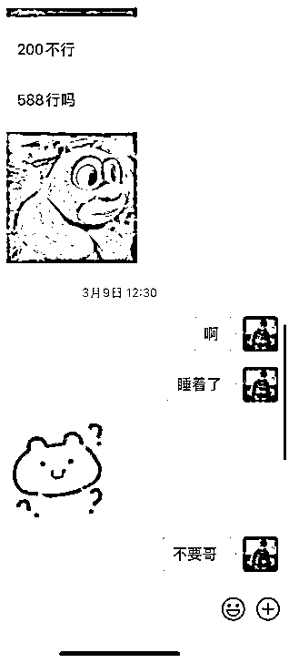</ne-card><ne-card data-card-name="image" data-card-type="inline" id="zlTPP" data-event-boundary="card"></ne-card></ne-p> <ne-p id="u440d01bd" data-lake-id="u440d01bd"><ne-text id="u7ce09bfa">然后还会有同行找你发广告，我也没同意</ne-text></ne-p> <ne-p id="u30b000f8" data-lake-id="u30b000f8"><ne-text id="ubd286a9b" ne-bold="true">这个项目最牛的一天 2w+，然后还有公众号的粉丝价值，甚至可以接入情感挽回？？？</ne-text></ne-p> <ne-p id="ucbd8151a" data-lake-id="ucbd8151a"><ne-text id="u11b5a370" ne-bold="true">总体而言这个小项目还是很有意思的，虽然只弄了一段时间，但是我一直到现在还有收益</ne-text></ne-p> <ne-p id="ubc1ece10" data-lake-id="ubc1ece10"><ne-text id="u1b6f1384" ne-bold="true">对于小白来说也是非常的友好</ne-text></ne-p> <ne-p id="ucba37ce4" data-lake-id="ucba37ce4"><ne-text id="u6f1db519">我的公众号是一封传信，感兴趣的可以稍微看一下</ne-text></ne-p> <ne-p id="uaed73195" data-lake-id="uaed73195"><ne-text id="uc6e32288">end</ne-text></ne-p> <ne-hole id="u9da1ba6a" data-lake-id="u9da1ba6a"><ne-card data-card-name="hr" data-card-type="block" id="LDbOS" data-event-boundary="card"><ne-p id="u2ce80542" data-lake-id="u2ce80542"><ne-text id="u4778c29a">评论区：</ne-text></ne-p> <ne-p id="u5d6689fa" data-lake-id="u5d6689fa"><ne-text id="ue2515cf1">金九渊 : 想了解下这个系统是找淘宝弄的？</ne-text> <ne-text id="u6f92a0e6">黎昕 : 第一次知道还有这样的项目，感谢分享</ne-text> <ne-text id="u7e6ce9b0">bink : 淘宝直接搜匿名信源码就可以  会出来一大堆</ne-text> <ne-text id="ue3bf6fd3">沐云丰 : 有个疑问，想请教一下如果用户发违规消息有没有对内容审核的办法？会不会被波及到？</ne-text> <ne-text id="u6b8c10d0">bink : 违规内容会被短信通道拦截，也可以设置成手动审核，不会存在法律风险</ne-text> <ne-text id="u36e861a5">Ante : 厉害了</ne-text> <ne-text id="u1d252e77">抽根烟 : 大开眼界</ne-text> <ne-text id="uacf01549">bink : 用个体户资质就可以了（几十块钱）</ne-text> <ne-text id="u9b5ddd9c">然后微信商户是对私的</ne-text></ne-p></ne-card></ne-hole>