# 《视频号航海新手，7 天涨粉 10W+实操手册》

> 原文：[`www.yuque.com/for_lazy/thfiu8/ozmpr370ff0dmt6e`](https://www.yuque.com/for_lazy/thfiu8/ozmpr370ff0dmt6e)

## (精华帖)(264 赞)《视频号航海新手，7 天涨粉 10W+实操手册》 

作者： 大星儿 

日期：2023-04-07 

大家看到这个标题是不是觉得很厉害，到底是怎么做到 7 天涨粉 10W+ 的？ 

很多人做视频号的第一步就是直接按照自己的喜好起号发视频，而我的第一步是去了解视频号平台和用户属性，从用户喜爱的内容去做账号定位。 

通过观察发现，视频号的内容类型还是偏泛娱乐为主，符合中老年用户群体的情感视频会有很大的流量，因此我的账号定位就是面向中老年群体做情感视频。 

定位账号后就是去寻找对标做爆款，我的方式是在抖音搜索关键词找爆款视频，通过二改原视频和替换视频画面的方式，重新打造出自己的爆款视频。 

这么看来是不是很简单？其实真正做的时候，我们可能会遇到账号限流、搬运视频违规等各种雷区，如果是新手来做，这些雷区可能就会出现粉丝不但不涨，账号也有可能起不来的状况。 

接下来，我跟大家分享我是怎么从了解平台属性开始，一步步找对标做爆款，在 7 天内把视频号做到 10W+粉丝的实操步骤。 

文章目录结构如下： 

一、视频号起号步骤 

二、打造爆款的 3 个方法 

三、5 个避坑分享 

四、个人心得 

大家好，我是大星儿，22 年 418 入圈生财，感谢生财团队的邀请，让我今天有机会在这里和大家分享视频号快速涨粉的实战经验，那我先来简单的介绍一下自己。 <ne-oli index-type="0"><ne-oli-i>1</ne-oli-i><ne-oli-c class="ne-oli-content" id="u044f9de5" data-lake-id="u044f9de5">视频号从 0 到 1 起号，7 天涨粉 10W+，累计播放 2000W+</ne-oli-c></ne-oli> <ne-oli index-type="0"><ne-oli-i>2</ne-oli-i><ne-oli-c class="ne-oli-content" id="u78270dc6" data-lake-id="u78270dc6">私域增长运营，熟悉公众号、企微、社群、小程序闭环打法，最高月 GMV170W+</ne-oli-c></ne-oli> <ne-oli index-type="0"><ne-oli-i>3</ne-oli-i><ne-oli-c class="ne-oli-content" id="u99fc74c6" data-lake-id="u99fc74c6">小红书从 0 到 1 起号，周涨千粉</ne-oli-c></ne-oli> 

话不多说，我们先看数据： 

7 天涨粉 10W+，累计浏览 2000W+，直到现在这个爆款视频每天依然会有尾量浏览和点赞，后续还出过几个 100W+ 播放以上的小爆款。 

  

 

 

 

作为生财里的小透明，分享我自己的一点运营心得，希望给同样还在纠结要不要下海的你一点帮助。 

# 一、视频号起号步骤 

## 

## （1）了解视频号平台属性 

想要在任何一个平台拿到成绩，熟悉平台规则是第一步。 

视频号是一个”场“，在视频号活跃的用户是”人“，选择在视频号买卖交易的商品是“货”，满足基本的人货场，接下来我们要了解活跃在视频号这个场中的主要人群是什么。 

### ① 视频号用户属性 

视频号的用户属性根据视频的传播方式，将其分为 2 类： 

1.当视频主要传播形态是通过转发朋友圈、微信群、公众号、朋友点赞等好友关系裂变形式传播的时候，视频号的用户人群就等于微信的人群。 

2.当视频主要传播形态就是在视频号体系内的【推荐】专栏的时候，视频号的主要人群就成了三四线的老年为主，一二线老年为辅，然后才是中年人、年轻人... 

明确视频号的真正活跃人群为——三四线中老年用户群体，他们是视频号内容消费的主要活跃者，通过视频号【推荐】专栏获取公域流量推荐，0 粉也可以出现爆款视频。 

 

### ② 视频号内容属性 

视频号平台内容类型的喜好度，主要还是偏泛娱乐为主，符合中老年用户群体的情感视频，对画质要求普遍不高，制作难度也比较低 

 

##   

## （2）找对标选视频 

### ① 抖音直接搜关键词 

抖音搜索故事、故事会、民间、情感、正能量、家庭情感故事等关键词，筛选条件：最多点赞——一周内，搜素靠前的视频其点赞、评论、转发数据都不错，点击头像进入账号主页，观察几个要素 

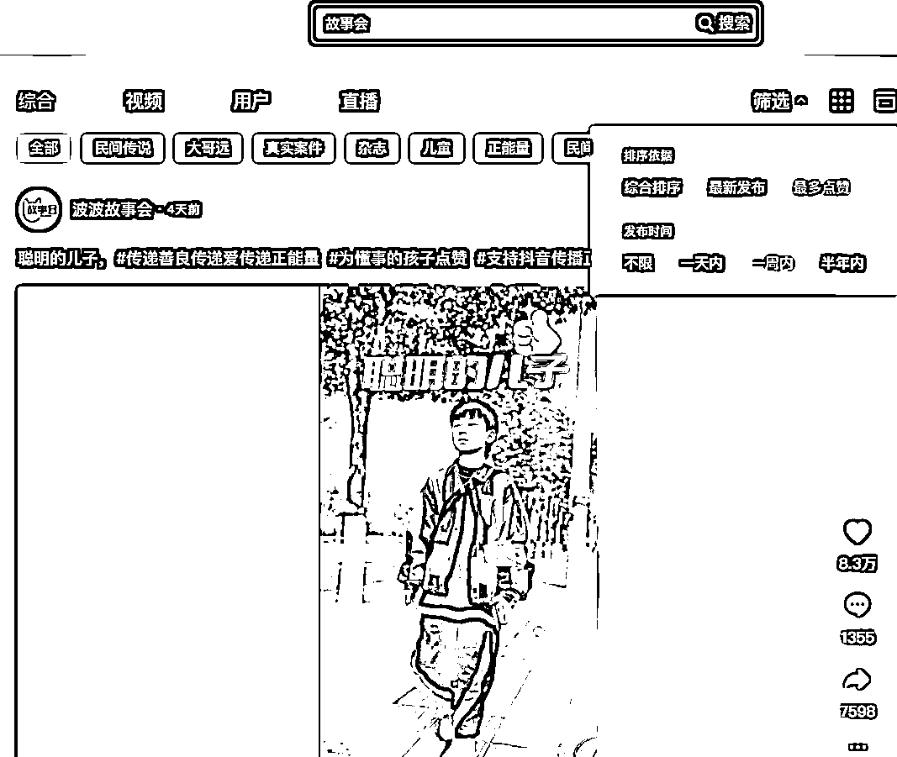 

1.账号主页各视频的点赞数据 

2.找到点赞量高且近 1-2 天内发布（至多不超过 7 天，因为数据好的视频，时间越长，很有可能已经被 BY 到视频号）。 

点开看用户评论，如果用户的头像明显是中老年人风格（花花草草之类的），那说明该视频及账号的主要受众是中老年人群体 

 

 

### ② 蝉妈妈平台搜索+数据验证 

方式一：蝉妈妈——视频——热门视频库/带货视频库——情感 

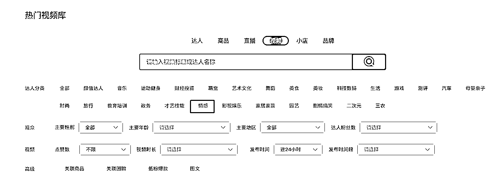 

方式二：蝉妈妈——视频——搜索框根据关键词搜索：故事、情感、正能量等。 

然后视频选择近 7 日内高赞的视频，点击进入账号主页——看数据和视频源是否充足，以便后期能找到足够的视频进行剪辑 

 

查看该细分类目下的相关账号，点击进入看具体的数据信息，主要关注 2 个核心数据： 

1.近期涨粉人数，可以判断账号涨粉速度及近期是否有爆款视频 

2.账号的视频用户画像，是否符合 50+ 用户群群体 

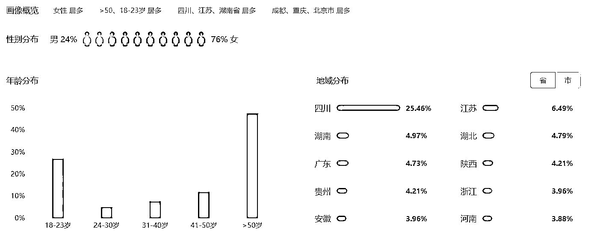 

3.找到相关账号后，搭建账号库，记录核心信息，并用抖音号关注账号，博主发布视频后第一时间接到消息 push，下载第一手热乎视频 

 

### ③ 视频号找对标 

用微信小号，搜关键词，找到类似的账号，完播、点赞、评论，过一会视频主页就会推荐类似的视频，头部账号建议也关注一下，主要分析 3 个点： 

1.账号的主页包装设计； 

2.账号的视频内容类型及视频数据情况，为后续伪原创视频提供选题素材； 

3.账号选品中心，分析同样的用户群体带货类型 

具体搜索方法： 

1.发现——视频号——搜索：家庭故事、正能量等关键词，然后会出现视频，看那些封面图一眼就很糙，没有个人 IP 出镜的视频 

2.点击进入主页，看账号的昵称，头像和简介介绍，是否挂商品 

3.参考对标账号，直接创建自己的账号 <ne-oli index-type="0"><ne-oli-i>1</ne-oli-i><ne-oli-c class="ne-oli-content" id="uccee96b9" data-lake-id="uccee96b9">频号内搜关键词，找视频——再找账号</ne-oli-c></ne-oli> 

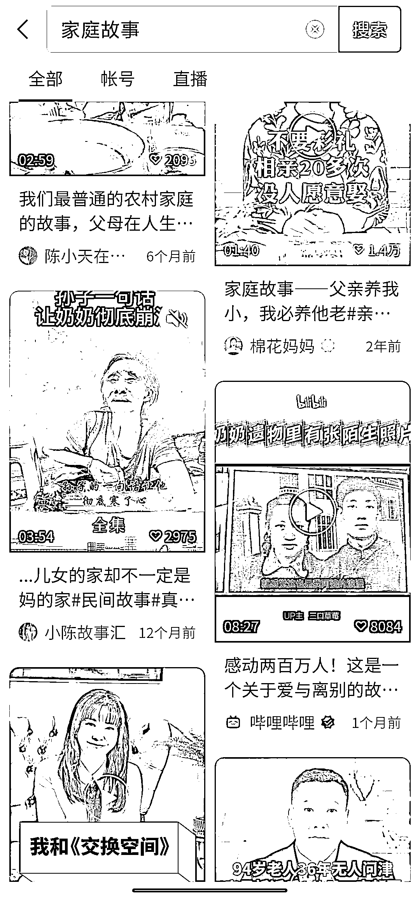 

 <ne-oli index-type="0"><ne-oli-i>1</ne-oli-i><ne-oli-c class="ne-oli-content" id="u58bddae5" data-lake-id="u58bddae5">点头像进账号主页，看包装，看视频风格和内容类型</ne-oli-c></ne-oli> 

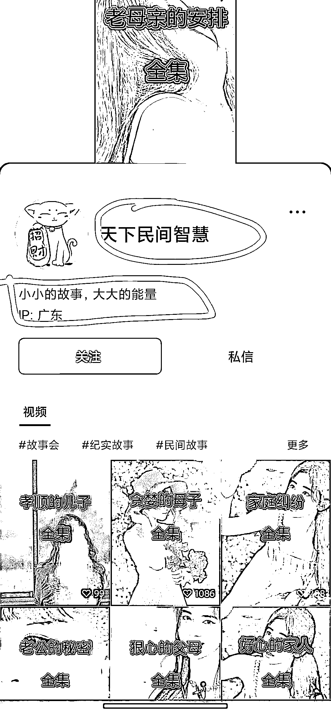 

 

注意：如果是真人出镜的账号直接 pass，一眼看起来视频封面及内容很糙，整体画面像素不高的，就是对标的账号类型（中老年人对视频的画面要求不高） 

## (3) 包装账号 

账号基本注册流程在航海手册中有，这里不过多赘述，主要说下账号的包装，核心看对标账号怎么搞 

① 头像 

可以是纯文字、也可以是图文形式，不建议直接用【点头像下单】以及易侵权的商标类图片，中老年群体我直接在小红书搜索老年头像，复制链接——去水印——保存图片，然后上传图片 

具体去水印方法：小红书右上角分享——复制链接——微信小程序搜索：去水印——排名第一个就可以——粘贴链接——下载去水印保存 

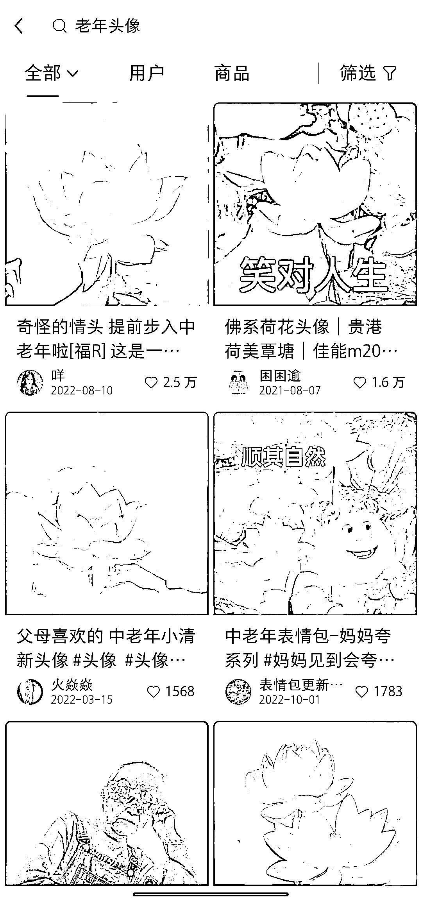 

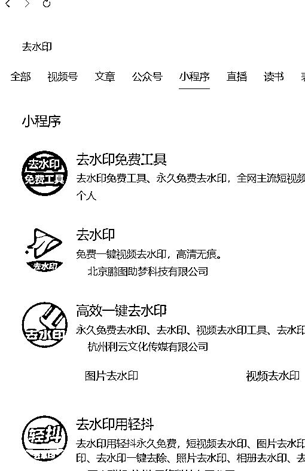 

② 昵称 

昵称一年只能修改 5 次，建议慎重修改，通常是根据自己要做的账号定位进行包装，常用的方法是采用关键词组合的方式，例如 xx 聊职场、xx 女装、xx 国学、xx 妈妈育儿好物等等 

我是直接参考对标账号：xx 故事会，昵称重复就换 xx 部分的文字，或者加后缀加数字 

③ 简介 

简介能随时修改，可以放一些账号价值提供的介绍，或者是促进成交的内容 

账号初期简介：讲民间故事，品百味人生（定位账号提供的价值） 

账号带货期简介： 

👇点击下方商品，下单购买 

👇点击下方商品，下单购买 

如果有引流私域：可以留微信号 

提示：直播的过程，如果简介有直接引导下单的话术，可能会被违规警告，要求修改，直播过程直接删除下单的简介介绍即可 

 

# 二、打造爆款的 3 个方法 

不论哪个平台，粉丝量基本都是靠爆款带起来的，视频号如何做爆款视频？ 

## （1）找爆款视频 

### ① 根据对标账号筛选视频 

根据 1.2 中的找对标账号方法，汇总账号库，从账号列表里找低粉爆款，最好是近 1~3 个月快速涨粉的账号，再筛选最近发布（ 7 天内）视频中点赞、转发、评论高的数据视频； 

 

### ② 抖音关键词搜索找爆款视频 

抖音直接搜索你想做的内容的关键词，筛选——点赞最高——1 天内，看视频排名，筛除 IP 类账号博主，下载源视频，根据上述提到的方式二改视频 

 

### ③ 改造爆款视频 

#### 方式 1 ：原视频二改 

步骤 1：使用圈友分享的去水印视频工具，复制单个/多个视频链接，去水印保存到本地 

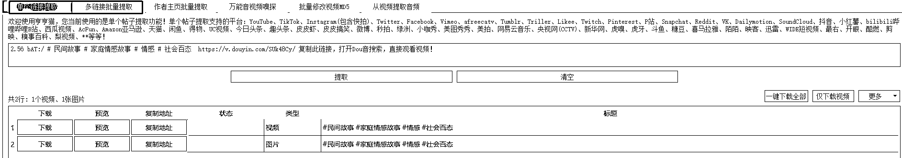 

步骤 2：打开剪映，导入视频源 

步骤 3：导入自拍视频，分离音视频，删除音频 

步骤 4：添加背景图，滤镜特效，音频调低音量 

形式模板：源视频+自拍音频+背景图+滤镜特效+音频调低音量，后续直接替换源视频即可，如果出现低播放（未过重），说明找到视频源被多次使用，需要再深层次多个视频混剪 

步骤 5：PC 端打开微信视频号后台，拖入视频，复制下载视频标题，发布即可。 

一般遵循早晨 6~7 点，12~13 点，下午 6 点之后的时间点发布 

 

####   

#### 方式 2：保留音频，替换视频画面 

步骤 1：同上先下载视频 

步骤 2：将视频导入剪映中，音视频分离 

步骤 3：删除视频画面 

步骤 4：添加自拍视频，作为画中画素材，分离音视频，并删除音频 

 

步骤 5：根据源视频大纲内容，选择合适的人物图片，导入剪映,操作区选中对应的图片，右上角动画——向左/向右滑动——设置动画时长：3.5s 左右即可 

步骤 6：拉长图片长度，保持与音频同时段结束，如果源视频中有关于抖音字眼及点击右侧+引导关注的字眼，记得选中视频删除 

 

## （2）做爆款选题 

做情感故事，核心是围绕着人性讲故事，老年人对什么感兴趣就按照这个选题方向批量复制。 

另外一个特点是中老年用户对于视频画面像素要求普遍不高，在咱们看来粗制滥造的视频，在老年圈广受喜爱积极传播 

所以我们不用在视频上大费功夫找高清好看视频（带货类除外，带货类还是要讲究视频高清流畅，视频画面优劣会影响转化率），非带货类视频重点是选题 

步骤 1：拆解爆款视频，思维导图梳理常见爆款视频的情感故事人物关系 

 

方式 2：素材库整理爆款选题库，交叉生成新的视频选题 

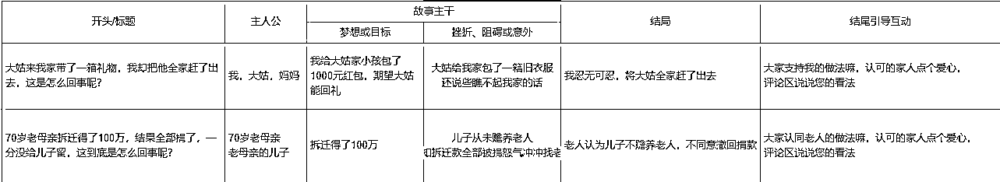 

视频故事选题需要包括： 

有情绪、有信息增量、性、金钱、暴力等至少 2~3 个元素，另外尽量写老年人的家长里短故事，不要写出轨等非主流社会宣传的选题故事 

视频开头：总结故事主干，用一句有悬念的话留住用户的注意力 

视频中间：解开故事开头的谜底，叙述故事发生过程 

视频结尾：结尾主要是引导点赞分享，通过大家认可/支持 xx 的做法嘛，来调动用户情绪，引发共鸣，顺势点一波赞，评论留言互动，提升视频播放数据，实现破圈传播 

## （3）视频爆款要素 

① 爆款选题： <ne-oli index-type="0"><ne-oli-i>1</ne-oli-i><ne-oli-c class="ne-oli-content" id="ua1364429" data-lake-id="ua1364429">讲故事—人的本性都是爱听故事的</ne-oli-c></ne-oli> <ne-oli index-type="0"><ne-oli-i>2</ne-oli-i><ne-oli-c class="ne-oli-content" id="u8f7b9e44" data-lake-id="u8f7b9e44">谈情怀—触动用户内心深处的情感共鸣</ne-oli-c></ne-oli> 

② 提升用户点赞方法： <ne-oli index-type="0"><ne-oli-i>1</ne-oli-i><ne-oli-c class="ne-oli-content" id="ubc2b00a2" data-lake-id="ubc2b00a2">引发共鸣—解决用户痛点或调动情绪价值，引导点赞</ne-oli-c></ne-oli> 

举例：大家认同 xx 的做法嘛/大家觉得 xx 这样做对嘛，认可的家人点个赞，评论区留下你的说法吧 <ne-oli index-type="0"><ne-oli-i>1</ne-oli-i><ne-oli-c class="ne-oli-content" id="uc66b19d1" data-lake-id="uc66b19d1">乞讨效应—用示弱赢得用户关注</ne-oli-c></ne-oli> 

举例：感谢家人们的观看，麻烦您点个赞吧，祝您阖家欢乐，万事如意~ 

③ 提升用户分享方法： <ne-oli index-type="0"><ne-oli-i>1</ne-oli-i><ne-oli-c class="ne-oli-content" id="uf08e9797" data-lake-id="uf08e9797">调动情绪—触及用户内心深处，感同身受</ne-oli-c></ne-oli> <ne-oli index-type="0"><ne-oli-i>2</ne-oli-i><ne-oli-c class="ne-oli-content" id="u5913aeed" data-lake-id="u5913aeed">代入感—自我代入感让用户身临其境</ne-oli-c></ne-oli> <ne-oli index-type="0"><ne-oli-i>3</ne-oli-i><ne-oli-c class="ne-oli-content" id="u1184d4f9" data-lake-id="u1184d4f9">共情效应—向往美好，支持正向能量传递</ne-oli-c></ne-oli> 

④ 制造悬念： 

开头黄金三秒，话说一半，吊人胃口 

比如：农村一位老人拆迁房子得了 100 万拆迁款，结果一分没留给儿女，这到底是怎么回事呢，大家接着往下看 

# 三、5 个避坑分享 

## 

## （1）准备好再开始 

不存在彻底准备好的时候，一直纠结一直准备只会让你在岸上旱死，大概率拖延着到最后不了了之 

所以别犹豫，现在立马就去做，在做的过程中迭代就行，也不用纠结设备好不好，账号头像昵称简介是不是要精心打磨，都不需要！ 

0 粉爆款主要靠视频公域推荐，账号搜索流量很小，不用纠结。 

我第一次搞视频号的时候，各种调研其他账号信息如何包装，用表格记录、分析，断断续续花了一个星期才搞完账号，事实证明这些并没有让我的流量出现爆发式增长； 

第二次开新号的时候定下来就立即开号，头像、昵称和简介花 10 分钟搞定，直接就开始发视频，流量也没受到影响。 

如果你现在看到这里并打算开始运营视频号，别犹豫，现在立马拿起手机，打开微信，创建一个视频号，头像可以改，昵称一年 5 次可以改，简介也能改，不要总想着一次做的很完美，先做再改。 

## （2）陷入流量数据自嗨 

对个人来说，流量一定是为变现去服务，所以当出现非带货类爆款视频后，赶快怼带货类视频，测试选品，有部分用户会通过爆款视频进入账号主页看到其他视频，有利于带货视频曝光。 

以终为始想最终的变现方式，到底是什么，在执行的过程要关注自己有没有偏离核心目的，如果明确就是带货变现，那就把更多的精力投入到选品中，数据爆了就开播，想办法用各种可以提升转化的方式去测试，去提升带货佣金。 

不要沉浸在爆款视频 ！点赞、评论、关注这些都是昙花一现的虚假繁荣，账号违规了视频分分钟零播。 

## （3）遇爆款没开播 

出现爆款视频，不要拖，抓紧直播，有选品就直接直播带货，没选品先把用户引流到私域（微信号最佳、小程序和公众号触达效果弱），仅存留在视频号上的粉丝很难再触达到。 

(因为大部分的视频流量还是来源于公域推荐，即使有几十万粉丝，用户依然没有形成从关注列表中只看你的视频的习惯，基本上是随便刷，刷到你的视频感觉不错再进行后续的动作) 

所以抓住机会要么转化，要么留存在可多次触达的私域场景。 

下方图片是当时爆款视频的相关数据，不到半小时就能涨几千粉，涨粉速度非常快，但是当时犹豫没有选品，直接开直播不知道讲什么，加上对直播比较畏怯，就一直让这种非常爆的状态持续 3-4 天白白流失掉了。 

如果在这种涨粉速度下开直播，通过短视频引流到直播间的用户，也能轻松让自己进入到场观几千人的直播广场中。 

所以当视频号出现爆款播放，不管爆的是带货类还是非带货类，先预约直播，下班就开播介绍产品，中途用户互动引导点赞打赏，可以提升直播间互动数据，把自己直播间推到更大的流量池中。 

在直播的场景下转化链路更短，互动及时性也强，相较短视频的转化方式，转化效率更高。 

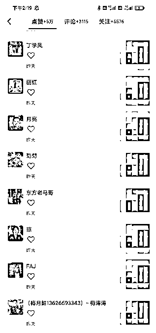 

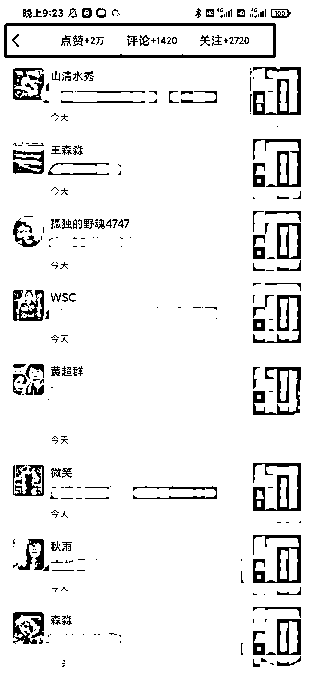 

 

后来还有一次是爆了 200W+ 播放的视频，当时距离视频爆发式增长过去 3 天，流量增速已经慢下来了，大概每半天能涨粉 3000 左右，然后上午预约了直播，下午开播场观轻松过 500 

短视频数据（ 2 月 3 日开始数据有明显增幅） 

 

直播数据 

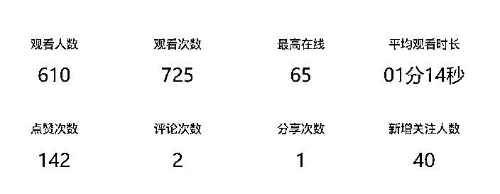 

## （4）重选题轻剪辑 

如果一个视频需要你深度的剪辑才能解决审核破重的问题，那这个视频果断放弃二剪 

抖音上很多该赛道的爆款视频，画面像素甚至不高，大家看了可能会觉得粗制滥造入不了眼，但是不同博主换个视频画面，脚本直接套用，依然可以爆，核心是视频内容引发用户共鸣，破圈传播 

剪辑是锦上添花，不要本末倒置。 

中老年情感号大概是唯一一个视频赛道对画质要求不高的类型，有的视频素材甚至摄像头的座机式拍摄，然后结合视频画面配选题文本，依然会有比较好的数据，内容为王（选题）在视频号依然适用。 

## （5）带货雷区新手不要碰 

抖音不限制的品类视频号可能会限制，定选品前可以先查查视频号带货类目限制，尤其养生茶、中医书籍、食谱书籍等新手慎入 

一是因为这些大众所知的选品已经是红海品类，素材基本被用烂了； 

二是因为容易擦边、违规，现在平台已经开始管控了，我当时从抖音 BY 发了 2 条养生食谱书带货，直接扣分限流，后续发啥都没流量。 

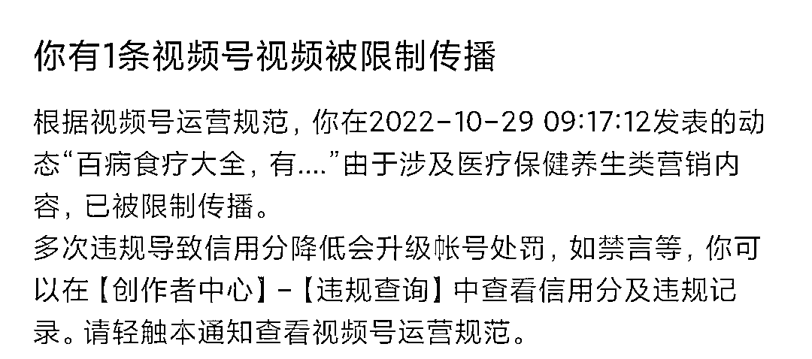 

# 四、个人心得 

## 

## （4）降低预期 

人心很浮躁，赚钱这件事，从最开始就降低自己立马能赚到钱的预期，不要妄想着出道即巅峰，任何一个行业里的成功者，都是经过专业积累沉淀的。 

看到别人赚钱着急嘛？着急就对了，别光心理上着急，行动起来，否则会越想越焦虑 

## （2）执行力拉满 

这点很重要！精华帖看的再多，那也是别人的，“先干了再说”，干完之后再根据结果去做反馈，然后再去做修改。因为只有参与之中才会能有更多的心得收获。 

## （3）敢于露面直播 

我之前面对镜头就会非常不自在，为了承接爆款视频带来的流量，匆匆开了直播，在直播间用户进来很快就流失掉了，评论互动也很少有人回复，慢慢的紧张的情绪也就稳定下来了。 

这也是我第一次突破自己，尝试出镜，做自己之前一直不敢做的事情，真的很爽！ 

评论区： 

ヾ 静默 : 新手报道第一天，对这一块很有兴趣，向你学习 大星儿 : [呲牙][呲牙]看完就可以尝试实操了 老龚爱分享 : 学到了[悠闲] lydia : 请问：在视频剪辑那个板块里，第二步的自拍视频是指什么？ 书情小跟班 : 非常优秀，认识一下 lydia : 另外，请问涨粉 10w 后的带货变现是不是也很厉害？ 十里承欢 : 学到了，但是去重的地方还是比较模糊不懂 。希望能出视频讲解[呲牙] 大星儿 : 自己拍的视频，这样不会和平台上的视频重复，提高原创度