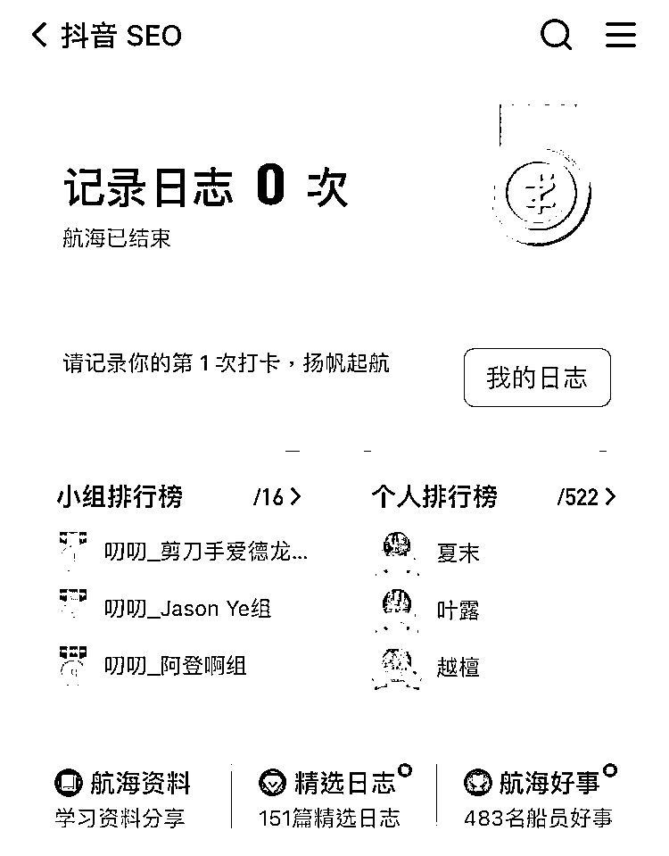

# 《抖音 SEO 的前景和选词指导》

> 原文：[`www.yuque.com/for_lazy/thfiu8/tkzswf1zglfqytz2`](https://www.yuque.com/for_lazy/thfiu8/tkzswf1zglfqytz2)

## (47 赞)《抖音 SEO 的前景和选词指导》 

作者： Hawli 

日期：2023-04-04 

大家好，我是李小随，是这期抖音 SEO 航海的教练。 

很荣幸收到生财有术的邀请，参与了抖音 SEO 航海的教学与答疑，跟各位教练一起，帮助 500+名船员深入抖音搜索，拿到成果。 

在航海的第一周，我给船员进行了一场分享，船员反馈不错，主题是关于抖音搜索的前景和选词的方法。 

大家都知道，做搜索，选词定生死。那么抖音搜的前景到底怎样，我们应该如何选词呢？来看看就知道了欢迎评论区交流哈 

链接直达： 

[https://i.shengcaiyoushu.com/docx/MTXHdDiceoxAnwxChbWcxPfxnrg](https://i.shengcaiyoushu.com/docx/MTXHdDiceoxAnwxChbWcxPfxnrg) 

评论区： 

芷蓝 : 小随太牛啦 Hawli : 谢谢芷蓝姐[耶] 子贡哥哥 : 小随老师的分享太棒了，感恩分享的极客工具 Faith : 拿到词以后怎么做排名啊，老师 Hawli : 看航海文档 Hawli : 有用就好 Faith : 在哪里啊，第一天加入的后生找不到。。。 鲸鱼🐳 : 小随姐姐无敌[呲牙]