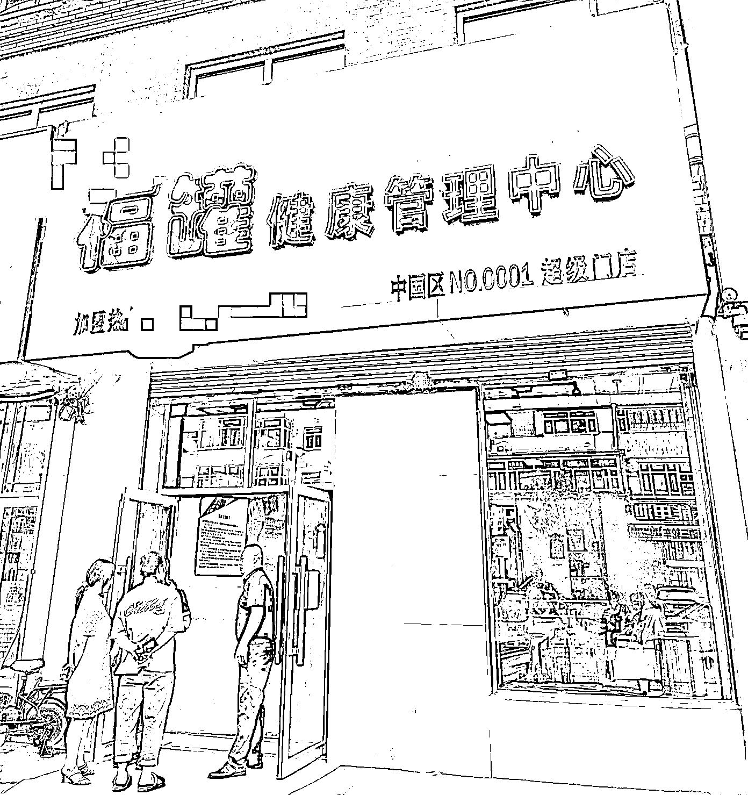
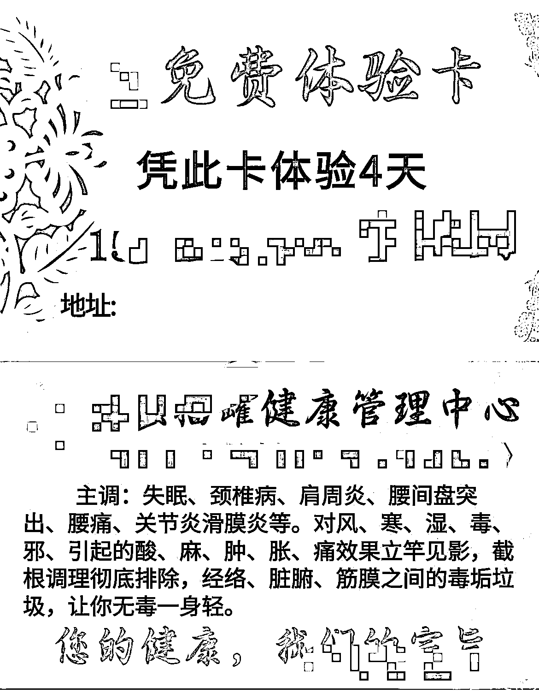
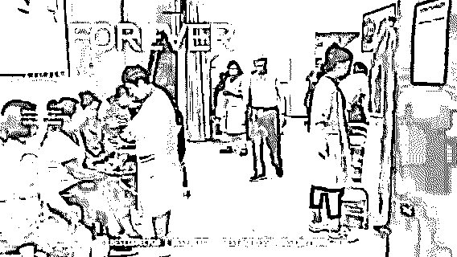
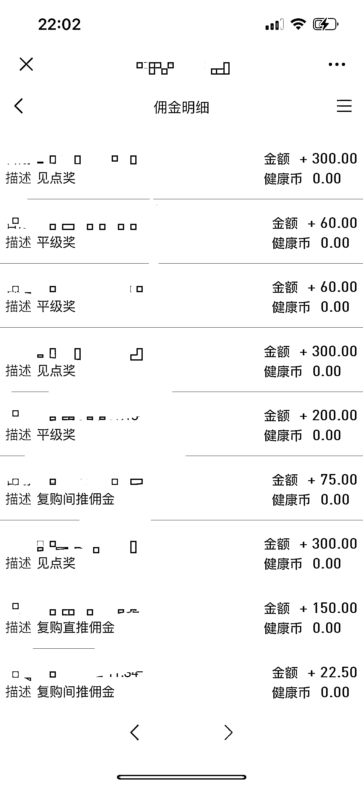
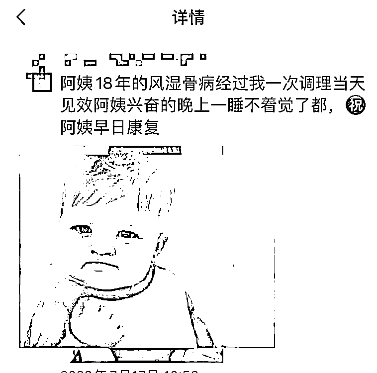
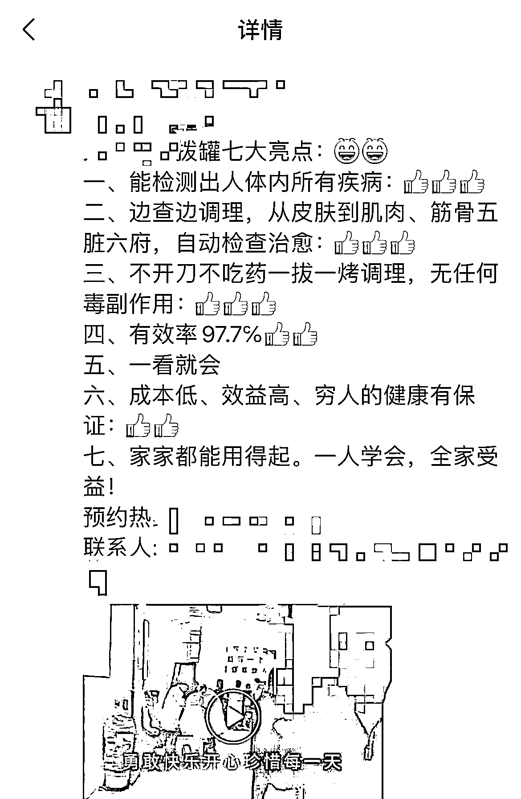
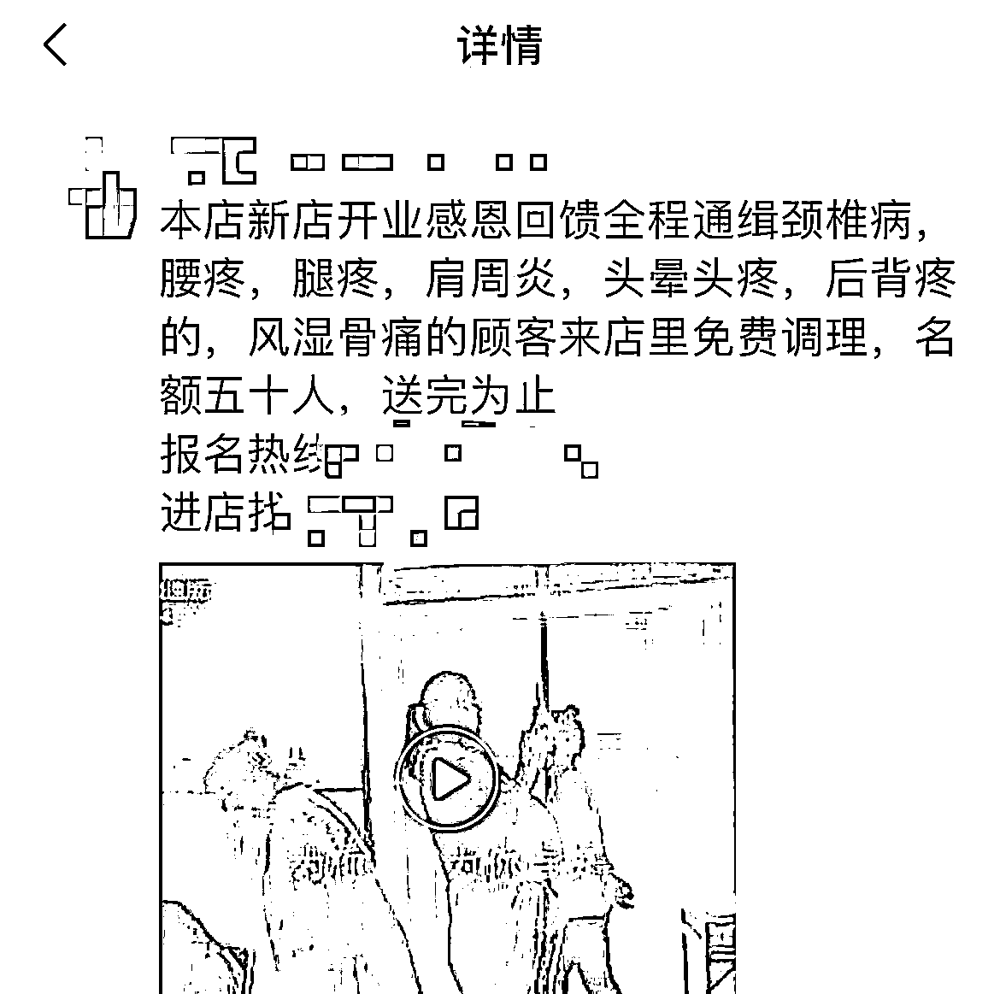
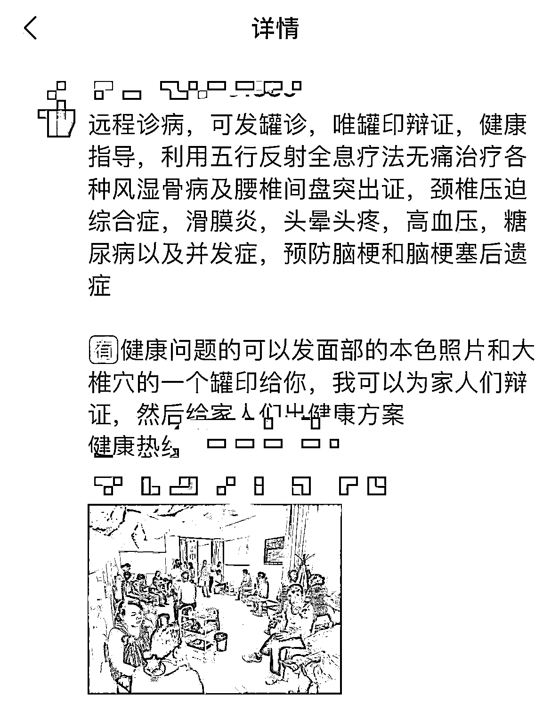
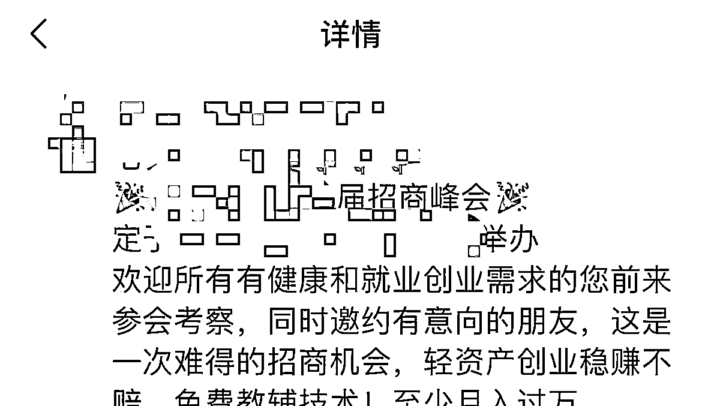

# 《从经营一家线下养生馆到发展为线上电商，靠理疗拔罐变现 50W+ 的经验分享 》

> 原文：[`www.yuque.com/for_lazy/thfiu8/vktkkaxtb7a9vtko`](https://www.yuque.com/for_lazy/thfiu8/vktkkaxtb7a9vtko)

<ne-h2 id="c560e696" data-lake-id="c560e696"><ne-heading-ext><ne-heading-anchor></ne-heading-anchor><ne-heading-fold></ne-heading-fold></ne-heading-ext><ne-heading-content><ne-text id="ud6e7322f">(48 赞)《从经营一家线下养生馆到发展为线上电商，靠理疗拔罐变现 50W+ 的经验分享 》</ne-text></ne-heading-content></ne-h2> <ne-p id="ubb8464c4" data-lake-id="ubb8464c4"><ne-text id="u4df2639a">作者： 大树</ne-text></ne-p> <ne-p id="u6a905f93" data-lake-id="u6a905f93"><ne-text id="u1bccb9b4">日期：2023-04-06</ne-text></ne-p> <ne-p id="u5e48e064" data-lake-id="u5e48e064"><ne-text id="ufa9cbdd0">如果让你做一家实体养生馆，你会怎么做？</ne-text></ne-p> <ne-p id="u546833a0" data-lake-id="u546833a0"><ne-text id="u803a01f1">很多人都是想把市面上所有关于养生的项目都推出去，相反，我就只做一个项目，把产品和技术做到极致体现出我们的专业，就能赢得消费者的信任，产生转化了。</ne-text></ne-p> <ne-p id="uc8934626" data-lake-id="uc8934626"><ne-text id="u9902bca3">我从经营一家线下养生馆发展到全国合作店面 20 家，主要是靠线下和线上联动运营。线下就是靠单一小众理疗拔罐产品切入市场，配合一套合作共赢的会员制奖励制度，以合伙加盟的方式做市场推广。</ne-text></ne-p> <ne-p id="uf69a5086" data-lake-id="uf69a5086"><ne-text id="uf21f7170">而线上则是通过朋友圈运营，利用活动、公益课程、受益者分享，专业知识讲解来引导意向顾客到店体验，再进行一对一的指导咨询和用户产生粘性实现复购增长。</ne-text></ne-p> <ne-p id="ue5ce7de8" data-lake-id="ue5ce7de8"><ne-text id="u10ecdf22">如果你也有这样的技术，但是不知道怎么去选产品做项目、如何建立拓客变现，接下来我就和圈友分享我从线下到线上养生罐拔罐产品变现的逻辑。</ne-text></ne-p> <ne-p id="ud843ee86" data-lake-id="ud843ee86"><ne-text id="ud734ee89">具体目录如下：</ne-text></ne-p> <ne-p id="ub327b1bd" data-lake-id="ub327b1bd"><ne-text id="u9a0c12c4">一、经营第一家养生馆</ne-text></ne-p> <ne-p id="u7f80d27c" data-lake-id="u7f80d27c"><ne-text id="u76228d7c">二、如何筛选有价值的产品</ne-text></ne-p> <ne-p id="ub34effa7" data-lake-id="ub34effa7"><ne-text id="u9ba15603">三、用户从哪里来</ne-text></ne-p> <ne-p id="uc31d3a8d" data-lake-id="uc31d3a8d"><ne-text id="u203ac4f6">四、关于用户如何承接进入私域实现复购</ne-text></ne-p> <ne-p id="u1b194da7" data-lake-id="u1b194da7"><ne-text id="u9f8ff03c">五、新人想做的门槛和建议</ne-text></ne-p> <ne-p id="u6acfda75" data-lake-id="u6acfda75"><ne-text id="u247287d7">生财有术的圈友们，大家好，我是大树，一个从事 5 年养生行业的 90 后创业者。</ne-text></ne-p> <ne-p id="u48ce3d1f" data-lake-id="u48ce3d1f"><ne-text id="u6d96715e">本想依靠这个小众项目闷声发点小财，奈何混入了生财有术这个赚钱高手如云的社群，整日接受真诚、利他的分享，接下来和大家分享的内容，还请各位看官多多指点，同时也欢迎对健康养生行业感兴趣的朋友一起交流探讨。</ne-text></ne-p> <ne-h1 id="034a50eb" data-lake-id="034a50eb"><ne-heading-ext><ne-heading-anchor></ne-heading-anchor><ne-heading-fold></ne-heading-fold></ne-heading-ext><ne-heading-content><ne-text id="u9f514abc" ne-bold="true">一、经营第一家养生馆</ne-text></ne-heading-content></ne-h1> <ne-p id="u68d8b4d7" data-lake-id="u68d8b4d7"><ne-text id="u6772796a">我的家人曾经由于腰间盘突出，生活不便，四处问诊没有得到有效的治疗，后来经人介绍接触了一个拔罐疗法，用远红外磁疗罐配合中草药，通过负压吸纳，将体内的风寒湿邪能够排出体外，达到截根拿病的效果。</ne-text></ne-p> <ne-p id="u04fefa56" data-lake-id="u04fefa56"><ne-text id="u70487693">有些医学可能不认可这种疗法，但是见证了一个个的康复案例证实的确有效（关于原理这里不阐述太多了，主要分析项目逻辑）</ne-text></ne-p> <ne-p id="u2d501c2e" data-lake-id="u2d501c2e"><ne-text id="u11788f0c">经过陪伴家人的调理过程，我发现生活中有颈椎病、肩周炎、风湿骨痛滑膜炎的人群特别多，由于不健康的生活习惯导致的这些症状，即使去到医院花了很高的费用，也没有很好的治疗方案。</ne-text></ne-p> <ne-p id="u1e55c886" data-lake-id="u1e55c886"><ne-text id="ued23af31">我想如果能通过这种花费少且行之有效的方法帮助普通百姓摆脱风湿骨病等疼痛的困扰，会是一件帮人助人，挽救家庭，积大功德的好事！</ne-text></ne-p> <ne-p id="uca808784" data-lake-id="uca808784"><ne-text id="u215cf1cc">如果通过我的产品和技术帮助 10 万人解决了病痛，每人给我 10 块钱，我还要分出去 5 块钱，让更多的受益者像我一样在传递健康的路上顺便积累一点财富，然后帮助更多的人！</ne-text></ne-p> <ne-p id="ua3648193" data-lake-id="ua3648193"><ne-text id="u6f56ba6e">我本身对中医健康养生这一块非常热爱，平时喜欢看一些中医经络穴位方面的书籍，于是我就开始参加培训，学习技术，自学中医理论知识，开了第一家以专做拔罐调理疼痛项目的养生馆。</ne-text></ne-p> <ne-p id="u85970de8" data-lake-id="u85970de8"><ne-card data-card-name="image" data-card-type="inline" id="X5IXn" data-event-boundary="card"></ne-card></ne-p> <ne-h1 id="e13e55df" data-lake-id="e13e55df"><ne-heading-ext><ne-heading-anchor></ne-heading-anchor><ne-heading-fold></ne-heading-fold></ne-heading-ext><ne-heading-content><ne-text id="u06c812b5">二、如何筛选有价值的产品</ne-text></ne-heading-content></ne-h1> <ne-p id="u52f188df" data-lake-id="u52f188df"><ne-text id="ub981f861">对比市面上琳琅满目的养生项目和产品：推拿、按摩、针灸、刺血、火罐、汗蒸、艾灸、泥灸、膏药、口服营养品等等。</ne-text></ne-p> <ne-p id="u59f26f56" data-lake-id="u59f26f56"><ne-text id="u78aed139">有的是很耗费人力，无法同时服务很多的顾客，需要聘请技师；</ne-text></ne-p> <ne-p id="ubdc4b845" data-lake-id="ubdc4b845"><ne-text id="uc246fc3f">有的需要专业的操作技术，上手难度大，并且需要有医师证；</ne-text></ne-p> <ne-p id="u2dca6cef" data-lake-id="u2dca6cef"><ne-text id="u7e329447">有的调理周期长，效果不能立竿见影；</ne-text></ne-p> <ne-p id="u7674b363" data-lake-id="u7674b363"><ne-text id="u2ef50169">有的是价格昂贵，普通百姓承担不起费用；</ne-text></ne-p> <ne-p id="udc13f6be" data-lake-id="udc13f6be"><ne-text id="u33c06faa">有的是项目有局限性，不适合复制放大。</ne-text></ne-p> <ne-p id="ua47b2d1c" data-lake-id="ua47b2d1c"><ne-text id="u158220ce">综合对比分析，一项能够排除以上弊端，且能得到顾客认可，经得住市场考验，让患者花小钱治大病的方案，可复制放大的项目产品由此产生。</ne-text></ne-p> <ne-p id="uc8459c18" data-lake-id="uc8459c18"><ne-text id="u81dbe015">我建议店面专做一款产品，将一个项目做到火爆，因为现在市面上卖养生类产品的特别多，营销方式（套路）也是五花八门，很多中老年群体都会比较抵触了，所以我要求店面不推销任何产品，只做调理服务。</ne-text></ne-p> <ne-p id="u07914632" data-lake-id="u07914632"><ne-text id="ue1fbf905">有很多营养保健产品厂家代理都找过我合作，但是都被我婉拒了，我认为将一个产品做多极致更能体现出我们的专业，更能赢得消费者的信任！</ne-text></ne-p> <ne-h1 id="6ebb67f2" data-lake-id="6ebb67f2"><ne-heading-ext><ne-heading-anchor></ne-heading-anchor><ne-heading-fold></ne-heading-fold></ne-heading-ext><ne-heading-content><ne-text id="ud9b7b5af">三、 用户从哪里来</ne-text></ne-heading-content></ne-h1> <ne-h2 id="7c983f03" data-lake-id="7c983f03"><ne-heading-ext><ne-heading-anchor></ne-heading-anchor><ne-heading-fold></ne-heading-fold></ne-heading-ext><ne-heading-content><ne-text id="u9adc541f">（1）线下养生馆市场推广</ne-text></ne-heading-content></ne-h2> <ne-p id="u205373de" data-lake-id="u205373de"><ne-text id="uf48e40f1">开第一家店的时候，选址选在了一个县城的繁华街道，东北县城的老龄人口有健康需求的人群比较多，试营业期间就召集了身边的亲朋好友。</ne-text></ne-p> <ne-p id="ucad8b7de" data-lake-id="ucad8b7de"><ne-text id="u5f9222d8">只要家里有颈椎病、肩周炎、腰疼、腿疼、滑膜炎的统统来店免费体验 7 天，不用花钱，只为宣传，承诺调理不好不要钱，调理好了帮我转介绍顾客过来，新顾客可以免费体验，介绍人还可以继续免费调理。</ne-text></ne-p> <ne-p id="uc24391c6" data-lake-id="uc24391c6"><ne-card data-card-name="image" data-card-type="inline" id="acuQ9" data-event-boundary="card"></ne-card></ne-p> <ne-p id="ue7a33f0d" data-lake-id="ue7a33f0d"><ne-text id="ucfc00a91">因为对产品有足够的信心，能坚持来按疗程调理的基本都很满意。就这样口碑在一座小县城很快就传播开了。</ne-text></ne-p> <ne-p id="ub9579079" data-lake-id="ub9579079"><ne-text id="u77febfcd">到店的顾客我都会准备好红枣枸杞茶水，教大家做养生操，让大家边喝茶边聊天，边调理身体，店里的顾客有说有笑，氛围特别好，有新顾客进店都会被这种氛围所感染，身心得到放松。</ne-text></ne-p> <ne-p id="u08906540" data-lake-id="u08906540"><ne-text id="u9e0abd37">鼓励顾客之间互相分享心得，分享自己的病痛和调理之后的好转变化。</ne-text></ne-p> <ne-p id="u173b0250" data-lake-id="u173b0250"><ne-card data-card-name="image" data-card-type="inline" id="IBV6T" data-event-boundary="card"></ne-card></ne-p> <ne-h2 id="6787e828" data-lake-id="6787e828"><ne-heading-ext><ne-heading-anchor></ne-heading-anchor><ne-heading-fold></ne-heading-fold></ne-heading-ext><ne-heading-content><ne-text id="ua65bab56">（2）合伙人模式</ne-text></ne-heading-content></ne-h2> <ne-p id="ud7661517" data-lake-id="ud7661517"><ne-text id="u5be8ed86">由于顾客太多，服务的老师不够，我就发起了招募合伙人，免费教技术！</ne-text></ne-p> <ne-p id="ub85cddb5" data-lake-id="ub85cddb5"><ne-text id="u81f2e9ba">家里有想寻找事业的可以来店里学习，免费教技术，提供实操场地，并且合伙人可以带顾客来店，是你带来的或者你服务的顾客后期付费调理，我都会给你一部分的利润。</ne-text></ne-p> <ne-p id="ufcde36e6" data-lake-id="ufcde36e6"><ne-text id="ud27ff8d4">在这其中，也有很多本身是顾客后来转变为合伙人的，他们的亲身经历更能打动新的顾客。</ne-text></ne-p> <ne-p id="u713975d3" data-lake-id="u713975d3"><ne-text id="u3d4cf4f0">这样既带动了店里的顾客流量，又解决了人手紧缺的问题。</ne-text></ne-p> <ne-p id="ue23667a8" data-lake-id="ue23667a8"><ne-text id="ua12d1cd7">开业一个月，筛选了 18 位愿意共同做这份事业的合伙人，考虑到一个线下店面的触及人群范围有限，在这期间也有一些客户咨询加盟事项，如果想要快速扩大到全国市场，此时需要开放加盟，吸纳更多的合作伙伴。</ne-text></ne-p> <ne-p id="u744c7845" data-lake-id="u744c7845"><ne-text id="u41d64d59">首先找到技术团队开发设计了一个线上商城，然后制定了一套社交电商新零售的会员制奖金模式。一个人干不过一个团队，一个团队干不过一套系统。</ne-text></ne-p> <ne-p id="u6bad1999" data-lake-id="u6bad1999"><ne-text id="uaa92f843">拥有一套完善的系统才能让大家抱团在一起，设置奖金池，按照贡献值分红，公司的业绩和每一个团队，每一个个人都有关系，设置帮扶基金鼓励所有会员互相帮助，互相成就，保证市场的良好发展！</ne-text></ne-p> <ne-p id="u77f7d197" data-lake-id="u77f7d197"><ne-card data-card-name="image" data-card-type="inline" id="nS3Gm" data-event-boundary="card"></ne-card></ne-p> <ne-p id="ued622d2d" data-lake-id="ued622d2d"><ne-card data-card-name="image" data-card-type="inline" id="nsYKz" data-event-boundary="card"></ne-card></ne-p> <ne-p id="udc38f0f1" data-lake-id="udc38f0f1"><ne-text id="udbb1a067">加入会员即可获得一套产品外加八大调理技术的学习。</ne-text></ne-p> <ne-p id="u3fa2d552" data-lake-id="u3fa2d552"><ne-text id="ub530c76d">整合了一下人脉资源，联系一些做过直销，带过团队的领导人，分享了整套产品、市场前景、收益模式和未来趋势，一些团队长表示愿意合作，就这样开启了推广加盟。</ne-text></ne-p> <ne-p id="ud6f9ed9c" data-lake-id="ud6f9ed9c"><ne-text id="u322429a1">让开店的会员继续复制我们的拓客方式，前期没有顾客的时候就是免费体验，发名片贴广告也要召集第一批顾客在当地范围内做出口碑。</ne-text></ne-p> <ne-p id="ue040d6ba" data-lake-id="ue040d6ba"><ne-text id="u3c5beba2">有了稳定的进店顾客，接下来指导大家分享：通过朋友圈转发获得免费体验资格，邀约到店的顾客都会做好登记，记录好推荐人，在店里办会员的会有推广权益，同时还可以学习技术。</ne-text></ne-p> <ne-p id="u38169d4f" data-lake-id="u38169d4f"><ne-text id="u731e781d">同样办会员的按照制度发放奖励。进店的顾客由专业的老师接待，送免费调理。</ne-text></ne-p> <ne-p id="u013c4322" data-lake-id="u013c4322"><ne-text id="u0cf73c09">加盟店的合伙人，公司会派老师驻店进行指导，或者来总店参加技术培训。</ne-text></ne-p> <ne-p id="u39745a9d" data-lake-id="u39745a9d"><ne-card data-card-name="image" data-card-type="inline" id="S8mXU" data-event-boundary="card"></ne-card></ne-p> <ne-h2 id="3be69ed7" data-lake-id="3be69ed7"><ne-heading-ext><ne-heading-anchor></ne-heading-anchor><ne-heading-fold></ne-heading-fold></ne-heading-ext><ne-heading-content><ne-text id="u5ef7a04d">（3）线上引流</ne-text></ne-heading-content></ne-h2> <ne-p id="ud2dfc007" data-lake-id="ud2dfc007"><ne-text id="ue38de32c">由于疫情期间，很多线下店无法营业，我们团队就决定转向线上，我负责带领大家做线上引流拓客。</ne-text></ne-p> <ne-p id="ud921d1a9" data-lake-id="ud921d1a9"><ne-text id="ucee26b92">文案策划：集思广益，制定多套文案、邀约话术、配图，提供给会员分不同阶段直接转发。</ne-text></ne-p> <ne-p id="uca0b6328" data-lake-id="uca0b6328"><ne-text id="ubdad1e61">让会员们可以简单快速的复制下去！文案要求通俗易懂惠民接地气。</ne-text></ne-p> <ne-p id="u9441d230" data-lake-id="u9441d230"><ne-text id="u84cdab86">文案类型：</ne-text></ne-p> <ne-p id="u8df21a51" data-lake-id="u8df21a51"><ne-text id="u7c0706b6">① 开业活动宣传</ne-text></ne-p> <ne-p id="udc6501b5" data-lake-id="udc6501b5"><ne-card data-card-name="image" data-card-type="inline" id="d2gjH" data-event-boundary="card"></ne-card></ne-p> <ne-p id="u5aa65434" data-lake-id="u5aa65434"><ne-card data-card-name="image" data-card-type="inline" id="XJk4d" data-event-boundary="card"></ne-card></ne-p> <ne-p id="u49c63a59" data-lake-id="u49c63a59"><ne-card data-card-name="image" data-card-type="inline" id="Mqrj8" data-event-boundary="card"></ne-card></ne-p> <ne-p id="udc070979" data-lake-id="udc070979"><ne-text id="u2c0f7b1d">通过开业活动宣传，设定开业福利：连续转发 5 天朋友圈，送免费调理，这种转发朋友圈的裂变方式虽然老套，但是针对县城的中老年群体还是很有效果的，还可以找本地的微生活付费转发，消息基本上就可以覆盖全城了。</ne-text></ne-p> <ne-p id="u52ebe1a8" data-lake-id="u52ebe1a8"><ne-text id="ueccb861d">类似的一些超市开业，金店搞活动，送礼品、送鸡蛋，愿意转发的人都有很多，还有专门用软件实现扫码一键转发的（圈友有同类顾客群体需求的可以用起来）</ne-text></ne-p> <ne-p id="u6aef1274" data-lake-id="u6aef1274"><ne-text id="u327e2837">文案中体现出明确的调理范围，赠送的项目价值以及名额紧缺，为了筛选用户，可以收小额红包，比如发 9 块 8 红包预定名额，愿意发红包的基本都会来，不想发的想来也都可以，开业初期就是要人气！</ne-text></ne-p> <ne-p id="uacc5fc39" data-lake-id="uacc5fc39"><ne-text id="u95cf2dca">② 效果反馈类：</ne-text></ne-p> <ne-p id="uc34bfcec" data-lake-id="uc34bfcec"><ne-card data-card-name="image" data-card-type="inline" id="XZmKU" data-event-boundary="card"></ne-card></ne-p> <ne-p id="ued1fc654" data-lake-id="ued1fc654"><ne-card data-card-name="image" data-card-type="inline" id="J5GSh" data-event-boundary="card"></ne-card></ne-p> <ne-p id="u38a122a1" data-lake-id="u38a122a1"><ne-text id="uec41e2ed">③ 产品介绍类：突出产品特色，介绍调理范围</ne-text></ne-p> <ne-p id="u557f4ccc" data-lake-id="u557f4ccc"><ne-card data-card-name="image" data-card-type="inline" id="VrfQB" data-event-boundary="card"></ne-card></ne-p> <ne-p id="u71ef218e" data-lake-id="u71ef218e"><ne-card data-card-name="image" data-card-type="inline" id="KjmvY" data-event-boundary="card"></ne-card></ne-p> <ne-p id="u374c1615" data-lake-id="u374c1615"><ne-text id="udb33a9cf">④ 店内火爆场面：配图/视频</ne-text></ne-p> <ne-p id="u57afab27" data-lake-id="u57afab27"><ne-card data-card-name="image" data-card-type="inline" id="Tgzeg" data-event-boundary="card"></ne-card></ne-p> <ne-p id="u253c3a89" data-lake-id="u253c3a89"><ne-card data-card-name="image" data-card-type="inline" id="iyHCn" data-event-boundary="card"></ne-card></ne-p> <ne-p id="u9bac29c3" data-lake-id="u9bac29c3"><ne-text id="u9815a11e">⑤ 健康知识分享</ne-text></ne-p> <ne-p id="u3cd59f87" data-lake-id="u3cd59f87"><ne-card data-card-name="image" data-card-type="inline" id="c1jXo" data-event-boundary="card"></ne-card></ne-p> <ne-p id="u3fdb98dd" data-lake-id="u3fdb98dd"><ne-card data-card-name="image" data-card-type="inline" id="Uh9xM" data-event-boundary="card"></ne-card></ne-p> <ne-p id="u1020dc68" data-lake-id="u1020dc68"><ne-text id="udf3ee2f6">日常多分享一些健康养生的相关普及知识，为顾客提供价值，吸引有健康需求的顾客关注朋友圈。</ne-text></ne-p> <ne-p id="u913746cf" data-lake-id="u913746cf"><ne-text id="u13a99062">⑥ 招商会议类</ne-text></ne-p> <ne-p id="u7905c3ff" data-lake-id="u7905c3ff"><ne-card data-card-name="image" data-card-type="inline" id="Z3sdB" data-event-boundary="card"></ne-card></ne-p> <ne-p id="u748d26a5" data-lake-id="u748d26a5"><ne-text id="ubdb6f3d2">招商会议，线上线下都可以进行，有条件的就组织线下的招商会议，主要是招商加盟，招募合伙人。</ne-text></ne-p> <ne-p id="ub231241d" data-lake-id="ub231241d"><ne-text id="u9dc16460">也可以组织线上会议，组织招商会议群！</ne-text></ne-p> <ne-p id="u87028de9" data-lake-id="u87028de9"><ne-text id="u4d5d49ab">指导会员通过群发，发朋友圈，一对一邀约，筛选自己或家人有健康需求的顾客，引导进微信群，每天晚上请团队讲师进行分享：</ne-text></ne-p> <ne-p id="u2f81694f" data-lake-id="u2f81694f"><ne-text id="u3d29fde3">一、公司背景</ne-text></ne-p> <ne-p id="u277482ff" data-lake-id="u277482ff"><ne-text id="u5e5d74cd">二、产品背书</ne-text></ne-p> <ne-p id="u83592866" data-lake-id="u83592866"><ne-text id="uc114bd25">三、九穴功能功效</ne-text></ne-p> <ne-p id="u71f838ce" data-lake-id="u71f838ce"><ne-text id="u2957ef12">四、古法经络绝技的功能</ne-text></ne-p> <ne-p id="ua67b7329" data-lake-id="ua67b7329"><ne-text id="u21d6a026">五、市场商机</ne-text></ne-p> <ne-p id="u6c8bfd67" data-lake-id="u6c8bfd67"><ne-text id="u8105c0a1">六、模式讲解</ne-text></ne-p> <ne-p id="u20d2aa7f" data-lake-id="u20d2aa7f"><ne-text id="u12cd87c8">七、价值远景</ne-text></ne-p> <ne-p id="u5e1896de" data-lake-id="u5e1896de"><ne-text id="u35a7a920">八、开设公益养生课堂</ne-text></ne-p> <ne-p id="u6375f443" data-lake-id="u6375f443"><ne-text id="u97d8c838">以公益课程为福利引导，团队长做邀约人数比赛，红包奖励邀约人数多的队长。</ne-text></ne-p> <ne-p id="uab17c127" data-lake-id="uab17c127"><ne-text id="u677811ed">会员下单之后组织视频技术一对一指导，鼓励大家随手拍视频，记录调理过程，采访心得，指导顾客将视频发到抖音、快手，教会员按照邀约话术，邀约进群，市场讲师进行统一讲解，答疑。</ne-text></ne-p> <ne-h1 id="2dd422b2" data-lake-id="2dd422b2"><ne-heading-ext><ne-heading-anchor></ne-heading-anchor><ne-heading-fold></ne-heading-fold></ne-heading-ext><ne-heading-content><ne-text id="u34cde598">四、关于用户如何承接进入私域实现复购</ne-text></ne-heading-content></ne-h1> <ne-h2 id="94def60b" data-lake-id="94def60b"><ne-heading-ext><ne-heading-anchor></ne-heading-anchor><ne-heading-fold></ne-heading-fold></ne-heading-ext><ne-heading-content><ne-text id="ua304de8d">（1）社群运营</ne-text></ne-heading-content></ne-h2> <ne-p id="u504321fe" data-lake-id="u504321fe"><ne-text id="u2cad9b25" ne-bold="true">组建 6 类群</ne-text></ne-p> <ne-p id="u659ce7cd" data-lake-id="u659ce7cd"><ne-text id="ua178aa98">① 核心群：公司合伙人商讨公司发展方向和营销方案</ne-text></ne-p> <ne-p id="u82389743" data-lake-id="u82389743"><ne-text id="u1ea10dd4">② 团队长群：团队长为市场推广主力，有自己推广的分店，也有属于团队推广的会员和用户</ne-text></ne-p> <ne-p id="u33b42632" data-lake-id="u33b42632"><ne-text id="u817cdeaf">③ 店长群：开实体店的店长，拥有本地的客户群体</ne-text></ne-p> <ne-p id="u0a037fb2" data-lake-id="u0a037fb2"><ne-text id="u2863774f">④ 会员群：付费会员可以免费到店调理半年，可以学习调理技术，免费学习养生课程</ne-text></ne-p> <ne-p id="uf0a4f54c" data-lake-id="uf0a4f54c"><ne-text id="u4a143c4e">⑤ 顾客群：到店做过调理，了解产品的顾客</ne-text></ne-p> <ne-p id="u479e4b08" data-lake-id="u479e4b08"><ne-text id="ubfcc1fa3">⑥ 围观群：市场推广人员邀请进来的意向用户</ne-text></ne-p> <ne-p id="uc8f27108" data-lake-id="uc8f27108"><ne-text id="u8d610a8a">通过从下到上，层层递进，用公益课程，受益者分享，专业知识讲解来引导意向顾客到店体验，用体验式营销促进会员转化，会员当中分 3 类群体：</ne-text></ne-p> <ne-p id="ua088c2db" data-lake-id="ua088c2db"><ne-text id="u4fee6ba6">① 想免费调理身体的</ne-text></ne-p> <ne-p id="uc7f9fdd3" data-lake-id="uc7f9fdd3"><ne-text id="u6bb8d347">② 想学习技术帮家人调理的</ne-text></ne-p> <ne-p id="u93ca8a61" data-lake-id="u93ca8a61"><ne-text id="ub96b0715">③ 想开店推广赚钱的</ne-text></ne-p> <ne-p id="u6c2f9d0f" data-lake-id="u6c2f9d0f"><ne-text id="ud42f6227">针对想推广赚钱的会员，鼓励开店，开发市场，进行市场推广、奖金模式方面培训，市场业绩达标者晋升为团队长，优秀团队长晋升合伙人，享受整体业绩分红。</ne-text></ne-p> <ne-h2 id="c657fd81" data-lake-id="c657fd81"><ne-heading-ext><ne-heading-anchor></ne-heading-anchor><ne-heading-fold></ne-heading-fold></ne-heading-ext><ne-heading-content><ne-text id="ubbd891af">（2）私域转化</ne-text></ne-heading-content></ne-h2> <ne-p id="u10958fd0" data-lake-id="u10958fd0"><ne-text id="u478dbe66">因为产品属性和市场效果，产品本身会有很强的复购，这样的顾客是一定要积累的私域进行重复消费转化的。</ne-text></ne-p> <ne-p id="u0b08bc3e" data-lake-id="u0b08bc3e"><ne-text id="u490795a6">内部系统已有的用户都会让客服以技术指导答疑的理由留存到微信，再邀请到用户交流群学习，因为很多人都想要看别人的效果。</ne-text></ne-p> <ne-p id="u62212fe8" data-lake-id="u62212fe8"><ne-text id="u7efcbcb2">大家眼见为实还能够增加产品使用黏性，群内会经常分享一些健康养生的知识，搞一些健康话题的讨论互动，保持大家的活跃度，用红包鼓励分享。</ne-text></ne-p> <ne-p id="ue75b4a6a" data-lake-id="ue75b4a6a"><ne-text id="u3e0f3e85">每到一些节日或者电商的促销日会做复购的优惠活动。</ne-text></ne-p> <ne-p id="uc10571d0" data-lake-id="uc10571d0"><ne-text id="u76fde59f">通过外部电商平台下单的用户，因为产品使用需要指导，而且每个人的体质症状不一样，都需要一对一的指导，在发货的时候会送一张人体穴位图，上面会有指引关注公众号，领取使用教程，添加指导老师的联系方式获取一对一指导！</ne-text></ne-p> <ne-p id="ue669ab8d" data-lake-id="ue669ab8d"><ne-text id="u264b1cca">以此为引导积累到私域，重复上面的复购转化。</ne-text></ne-p> <ne-p id="u13f9529f" data-lake-id="u13f9529f"><ne-text id="u2b9d003e" ne-bold="true">关于私域这块，如何保证长期稳定的复购？</ne-text></ne-p> <ne-p id="u635ba53a" data-lake-id="u635ba53a"><ne-text id="uca4f890e">首先在合伙人模式当中，设置了复购的奖励，店长和会员自己复购是有折扣的，如果推荐的用户产生复购也会有奖励，这样从公司到店长，再到会员，只要有团队的，都会一起努力增加复购。</ne-text></ne-p> <ne-p id="udaf7df95" data-lake-id="udaf7df95"><ne-text id="u1b065ac4">对于店长来说，只要有稳定的顾客，不断有新的顾客进店，一直会使用新产品带动复购。</ne-text></ne-p> <ne-p id="uf32f8c64" data-lake-id="uf32f8c64"><ne-text id="u8789dca5">对于个人使用的用户，大家可能会关心别人都使用的怎么样啊？</ne-text></ne-p> <ne-p id="u36c043ac" data-lake-id="u36c043ac"><ne-text id="u55ab102d">在店附近的顾客鼓励大家到店里一起拔罐，一起参与活动，会让大家融入氛围。</ne-text></ne-p> <ne-p id="uad6c5d2b" data-lake-id="uad6c5d2b"><ne-text id="ud834b6e5">在线上群里每天都会发大家都在拔罐的视频，拔罐之后的好转感受，让使用者能够感受到产品很好，让每个人，每个家庭都真正的受益了！</ne-text></ne-p> <ne-p id="u5655553c" data-lake-id="u5655553c"><ne-text id="ub4bfe30e">通过氛围烘托，让用户保持长期的使用，并且要介绍身边的亲人朋友来体验。</ne-text></ne-p> <ne-p id="ub376adb4" data-lake-id="ub376adb4"><ne-text id="u962ec25e">未来的方向也可能会扩展一些与现有产品实现互补的新品，因为拔罐属于排湿排寒排於堵泄的方式，中医上有清调补的理念，要融入合适的补的产品。还可以借助这套模式融入一些健康相关的付费课程。</ne-text></ne-p> <ne-h1 id="d9023cce" data-lake-id="d9023cce"><ne-heading-ext><ne-heading-anchor></ne-heading-anchor><ne-heading-fold></ne-heading-fold></ne-heading-ext><ne-heading-content><ne-text id="u4d362a0a">五、新人想做的门槛和建议</ne-text></ne-heading-content></ne-h1> <ne-p id="ud2fa1b30" data-lake-id="ud2fa1b30"><ne-text id="ufe3ef1cb">门槛：健康养生类的项目都会涉及到医药类资质，还有操作技术培训，售后指导的问题。</ne-text></ne-p> <ne-p id="ude712850" data-lake-id="ude712850"><ne-text id="u75ef90e1">用户群体年龄偏大，指导起来麻烦一点，有的需要手把手教那种，还涉及到一些专业的中医经络穴位知识。</ne-text></ne-p> <ne-p id="u4812bb19" data-lake-id="u4812bb19"><ne-text id="u6ce2cfc6">建议：从事相关行业的圈友可以借鉴经验，跨行业的新人慎入。</ne-text></ne-p> <ne-p id="u5effa5db" data-lake-id="u5effa5db"><ne-text id="u73eae6e0">如果你也有一项技能，想要通过这样的模式去放大，首先选品要产品过硬，复购性强，能够形成口碑传播，快速裂变。通过频繁的使用反馈，用户评价积累，建立长期信任。</ne-text></ne-p> <ne-p id="uf483e438" data-lake-id="uf483e438"><ne-text id="u7b5bb623">然后可以参考借助一套合适的奖金激励模式，使团队之间利益形成捆绑，每一位参与者的定位都是老板，共享分红。</ne-text></ne-p> <ne-p id="u44aff339" data-lake-id="u44aff339"><ne-text id="u850b013e">白岩松老师讲到：”大健康产业将是未来中国第一产业“，让每一个家庭都有一个懂健康的人</ne-text></ne-p> <ne-p id="u9d601270" data-lake-id="u9d601270"><ne-text id="u8d7ec824">自己健康是美德</ne-text></ne-p> <ne-p id="u8663c8e8" data-lake-id="u8663c8e8"><ne-text id="u9d7c2362">助人健康是功德</ne-text></ne-p> <ne-p id="u1ce49515" data-lake-id="u1ce49515"><ne-text id="u55562203">经营健康是大德</ne-text></ne-p> <ne-hole id="uecf35020" data-lake-id="uecf35020"><ne-card data-card-name="hr" data-card-type="block" id="q0yiu" data-event-boundary="card"><ne-p id="u3d850de1" data-lake-id="u3d850de1"><ne-text id="u7565e286">评论区：</ne-text></ne-p> <ne-p id="uf507e671" data-lake-id="uf507e671"><ne-text id="uc20f6252">大树 : 欢迎生财圈友们，交流探讨，指点建议[握手]</ne-text> <ne-text id="u6bb5a983">HOT : 小兄弟厉害了，我也拔罐爱好者，没像你这么有心，再加上这执行力，杠杠的！</ne-text> <ne-text id="u7644bff1">大树 : 感谢支持肯定，养生正在年轻化[强]</ne-text> <ne-text id="u1df32048">周宇峰 : 咋学技术兄弟</ne-text> <ne-text id="u35bf0ba5">大树 : 可以推荐到就近的店里学习哦</ne-text> <ne-text id="u893f4ca4">伟业 : 树哥优秀！[强][强][强]</ne-text> <ne-text id="uf4fb7433">大树 : 感谢点赞[抱拳]有收获就好</ne-text> <ne-text id="uda744d31">爱张女士爱拉芳 : 六六六啊</ne-text></ne-p></ne-card></ne-hole>