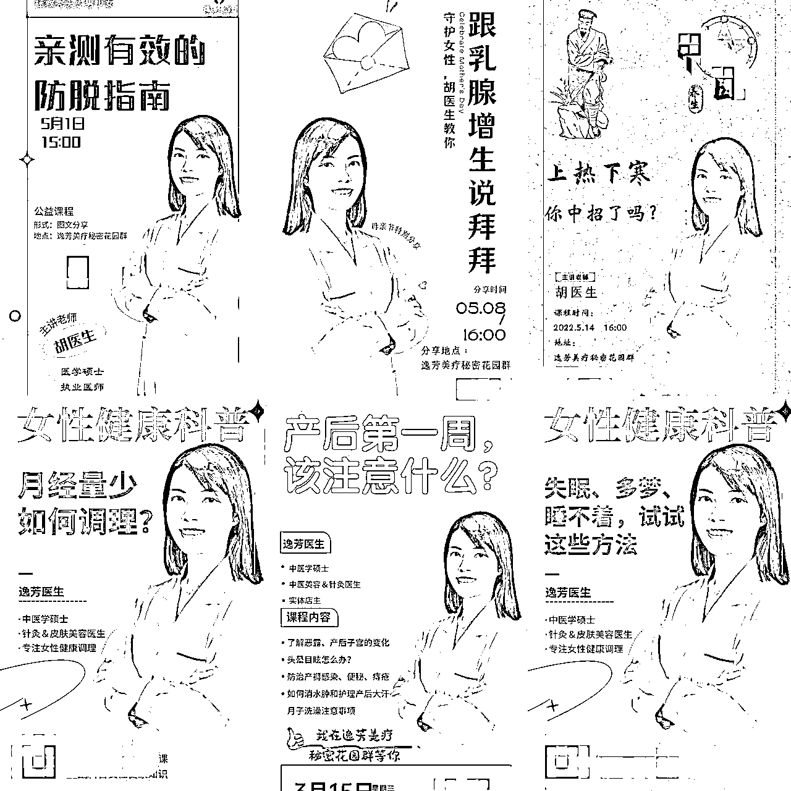
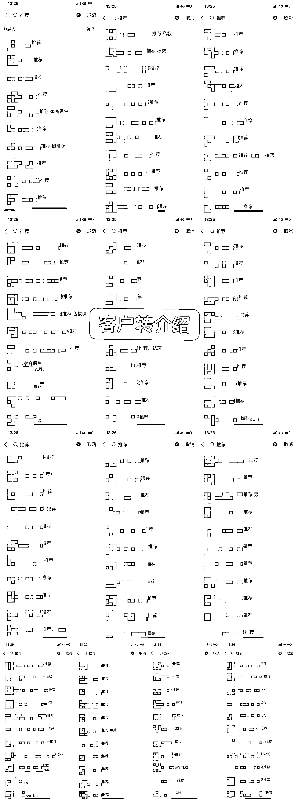
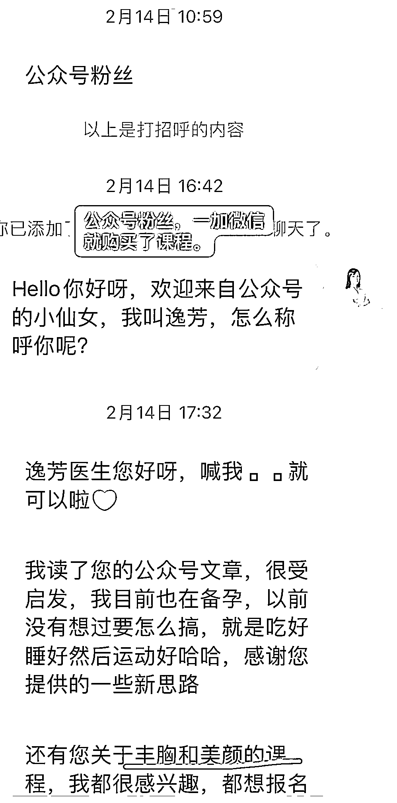
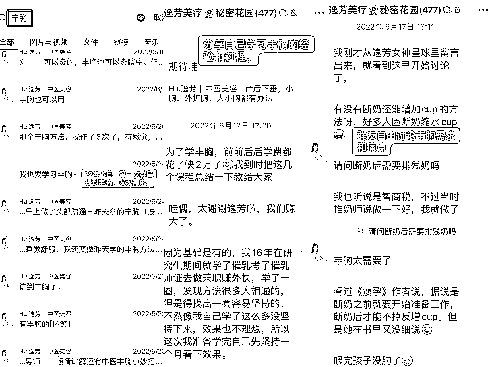
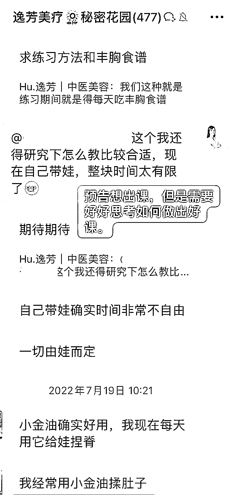
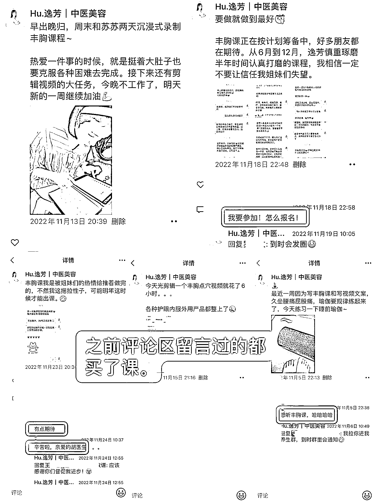
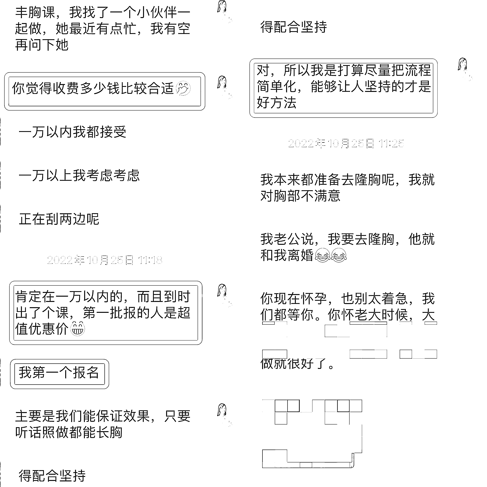

# 《精准定位用户需求，中医丰胸课 3 天收 100 学员，变现 20W+ 的经验分享》

> 原文：[`www.yuque.com/for_lazy/thfiu8/wbk2gv328b355fpy`](https://www.yuque.com/for_lazy/thfiu8/wbk2gv328b355fpy)

<ne-h2 id="234f529b" data-lake-id="234f529b"><ne-heading-ext><ne-heading-anchor></ne-heading-anchor><ne-heading-fold></ne-heading-fold></ne-heading-ext><ne-heading-content><ne-text id="ue73883e7">(54 赞)《精准定位用户需求，中医丰胸课 3 天收 100 学员，变现 20W+ 的经验分享》</ne-text></ne-heading-content></ne-h2> <ne-p id="udac99424" data-lake-id="udac99424"><ne-text id="u12cd73d6">作者： 逸芳的中医学习乐园</ne-text></ne-p> <ne-p id="ucc942a1e" data-lake-id="ucc942a1e"><ne-text id="u84e4012d">日期：2023-04-03</ne-text></ne-p> <ne-p id="u319ae9d3" data-lake-id="u319ae9d3"><ne-text id="ua416c4b8">一次在 500 人的社群里免费答疑指导时，我发现很多女性用户都有关于丰胸的困扰但没有办法解决，我就在群里和大家提出做一个“中医丰胸课程”，这一问，大家群里反馈很热烈，就这样用户需求把握了，课程定位就出来了。</ne-text></ne-p> <ne-p id="u354ae869" data-lake-id="u354ae869"><ne-text id="u4b5a1607">课程从发现需求，制作课程、价格定位、推广上线整整 5 个月的打磨时间，我基本上有一半的时间在和用户同步进展，获取用户对课程效果期望和呈现形式上反馈，相当于这个课程是我和需求用户一起完成的，我让用户看到我并不是为了割韭菜突然出课，而是真正在用心打磨产品，获得大家的信任和支持，最终转化的效果也是正向反馈。</ne-text></ne-p> <ne-p id="ua13bc9bf" data-lake-id="ua13bc9bf"><ne-text id="ub0490084">下面，我就和大家分享我作为一个做课新手，第一次就做高客单价课程，3 天收 100 位学员，变现 20W＋，并且在 3 个月后又做出第二个课程，3 天收到 200 位学员，变现 4W＋的经验。</ne-text></ne-p> <ne-p id="ua263e505" data-lake-id="ua263e505"><ne-text id="u87cf3a64">文章目录如下：</ne-text></ne-p> <ne-p id="u49970046" data-lake-id="u49970046"><ne-text id="u16f5469d">一、我目前的产品和服务</ne-text></ne-p> <ne-p id="u0b01fdce" data-lake-id="u0b01fdce"><ne-text id="u73a82d85">二、精准流量从哪里来</ne-text></ne-p> <ne-p id="u07e227be" data-lake-id="u07e227be"><ne-text id="ufa490166">三、如何打造你的第一个爆品</ne-text></ne-p> <ne-p id="u9dde5748" data-lake-id="u9dde5748"><ne-text id="u357b408b">四、流量变现：一炮打响的课程发售技巧</ne-text></ne-p> <ne-p id="u5dbb34cd" data-lake-id="u5dbb34cd"><ne-text id="ueba87381">五、持续复制，快速做出下一个产品</ne-text></ne-p> <ne-p id="u4387c641" data-lake-id="u4387c641"><ne-text id="u99e6f844">六、给新人做产品的建议</ne-text></ne-p> <ne-p id="u8825e57e" data-lake-id="u8825e57e"><ne-text id="ubfa329a1">生财圈友好！我叫逸芳，医学硕士，是一名中医美容医生，专注帮助 20-50 岁爱美女性通过中医实现美颜丰胸健康目标。</ne-text></ne-p> <ne-p id="ud99042fc" data-lake-id="ud99042fc"><ne-text id="u7bf83f63">如果你也是像我一样在某个领域有自己的技能和经验，想要做线上知识付费课程，这一篇实战经验可以帮到你。</ne-text></ne-p> <ne-h1 id="688d3943" data-lake-id="688d3943"><ne-heading-ext><ne-heading-anchor></ne-heading-anchor><ne-heading-fold></ne-heading-fold></ne-heading-ext><ne-heading-content><ne-text id="uf7bbc089">一、我目前的产品和服务</ne-text></ne-heading-content></ne-h1> <ne-p id="ud871017c" data-lake-id="ud871017c"><ne-text id="uec9c415b">我是 2018 年开始做线上的，是从一款微商产品营养美学做起，主要是卖口服胶原蛋白类产品，客单价在 2000-15000 之间。</ne-text></ne-p> <ne-p id="u8c9dc16d" data-lake-id="u8c9dc16d"><ne-text id="ue89bab36">当时微信只有 600＋ 人，而我身边主要是 20-30 岁之间的女性，这个客单价，对于我周围的人群来说不低，还有很大一部分人是我的医生同行，都工作不久，消费能力比较有限。</ne-text></ne-p> <ne-p id="udcd6c5f8" data-lake-id="udcd6c5f8"><ne-text id="u7a87cc81">但是我很认可这个品牌的价值观，也看好口服抗衰类的市场会越来越好，哪怕每个月只卖出一两单，也有小几千的利润，所以一开始就下定</ne-text><ne-text id="ud4c56d99" ne-bold="true">决心走长线，做高客单生意</ne-text><ne-text id="ud07a45ea">。</ne-text></ne-p> <ne-p id="u1a01f4ca" data-lake-id="u1a01f4ca"><ne-text id="u830d1bfe">除了这个口服产品，我还同时利用专业优势，做线上问题肌肤调理，通过线上免费接诊客户，精准搭配护肤品，通过护肤品差价来赚取收益。</ne-text></ne-p> <ne-p id="u436cf1f3" data-lake-id="u436cf1f3"><ne-text id="u42075375">后来又陆续增加了减肥类、益生菌、艾灸类产品，这是我 18-22 年 6 月之间的主要变现方式。</ne-text></ne-p> <ne-p id="udc334c66" data-lake-id="udc334c66"><ne-text id="u935a2d8a">19 年 20 年是爆发期，每年线上可以变现 60~70w，21 年开始受口罩问题影响，很多客户的收入下降，产品的销售和复购都受到了严重影响，收入骤减，21 年只有 20w 的收入。</ne-text></ne-p> <ne-p id="uc41c4431" data-lake-id="uc41c4431"><ne-text id="ucb7aee6b">我开始有些迷茫，一边继续做之前的事，一边思考如何破局。</ne-text></ne-p> <ne-p id="u7388231a" data-lake-id="u7388231a"><ne-text id="uc04adca6">22 年 2 月我找梁靠谱加入了玩赚合伙人，4 月又跟着她加入了生财，在这两个赚钱圈子里，视野和思路被打开了，我看到了各行各业赚钱的思路，也亲眼见证了很多从 0-1 做出产品和跑通闭环的圈友和合伙人，原来赚钱还有这么多方式。</ne-text></ne-p> <ne-p id="u1da0389f" data-lake-id="u1da0389f"><ne-text id="u1cd01513">靠谱就建议我也可以做课程产品，一开始都不敢想，我也能做课吗？会有人买吗？虽然感觉很遥远，但是听了这个建议，我心里就种下了一颗种子。</ne-text></ne-p> <ne-p id="u0d724158" data-lake-id="u0d724158"><ne-text id="u54635147">经过半年的计划和准备，在 22 年 11 月最后三天，我就推出了我的第一个付费课程【逸芳中医丰胸课】，首发价 1980，3 天收 100 学员，一炮打响，目前 3 个多月，累计变现 30W＋；</ne-text></ne-p> <ne-p id="u0e3ec3d7" data-lake-id="u0e3ec3d7"><ne-text id="u136cecee">然后 23 年 3 月又推出第二个课【逸芳中医美颜抗衰课】，首发价 199，也在 3 天收 200＋ 学员的好成绩，现在已经有 300＋ 学员了。</ne-text></ne-p> <ne-p id="u57fd1387" data-lake-id="u57fd1387"><ne-text id="u1bbff3bf">做出成绩，然后也开始收合伙人，帮助小白打造自己的产品体系。目前我的微信好友不到 4000 人。</ne-text></ne-p> <ne-p id="u90820ac0" data-lake-id="u90820ac0"><ne-text id="u3006f702">所以目前，我的主要产品有：</ne-text></ne-p> <ne-p id="u8fa8a10e" data-lake-id="u8fa8a10e"><ne-text id="ue3935b51">（1）虚拟产品：</ne-text></ne-p> <ne-p id="u3269679c" data-lake-id="u3269679c"><ne-text id="uf30654ad">《逸芳中医丰胸课》《逸芳中医美颜抗衰课》《玩赚合伙人》</ne-text></ne-p> <ne-p id="u6868ff43" data-lake-id="u6868ff43"><ne-text id="u632334be">（2）实体产品：</ne-text></ne-p> <ne-p id="u58b47727" data-lake-id="u58b47727"><ne-text id="ubde3ba65">美容抗衰、减肥、益生菌口服保养品；中医养生艾灸、护肤品。</ne-text></ne-p> <ne-h1 id="96889d8d" data-lake-id="96889d8d"><ne-heading-ext><ne-heading-anchor></ne-heading-anchor><ne-heading-fold></ne-heading-fold></ne-heading-ext><ne-heading-content><ne-text id="u7d9ac78c">二、精准流量从哪里来</ne-text></ne-heading-content></ne-h1> <ne-p id="u21203299" data-lake-id="u21203299"><ne-text id="ubf3ec640">前面说到我前几年做的产品都跟变美相关，90% 是女性客户，跟我做的丰胸课用户群体是重合的，也是这部分群体提出的需求让我找到了做课的定位。</ne-text></ne-p> <ne-p id="u011dd8f7" data-lake-id="u011dd8f7"><ne-text id="u0e92bcb8">4 年时间从 600 好友到现在 3000＋，这个增量速度其实不高，但是比较精准，所以变现不错，我的流量主要来源以下途径：</ne-text></ne-p> <ne-h2 id="15c102f3" data-lake-id="15c102f3"><ne-heading-ext><ne-heading-anchor></ne-heading-anchor><ne-heading-fold></ne-heading-fold></ne-heading-ext><ne-heading-content><ne-text id="u308d9ad6">（1）知识星球</ne-text></ne-heading-content></ne-h2> <ne-p id="u64da2a29" data-lake-id="u64da2a29"><ne-text id="u78fca07c">相信生财的圈友对知识星球很了解了，是一个知识分享平台，对于引流，它具有的优势主要有：</ne-text></ne-p> <ne-p id="u1e72676f" data-lake-id="u1e72676f"><ne-text id="u55242005" style="background-color: rgba(255, 246, 122, 0.8);">1.高质量的用户流量</ne-text><ne-text id="u475ca196">：知识星球是由领域专家和知名人士创建的，他们在各自的领域有着广泛的影响力和声誉。因此，从知识星球来的流量通常是有一定专业性和高质量的。</ne-text></ne-p> <ne-p id="u8d489ad1" data-lake-id="u8d489ad1"><ne-text id="u47499861" style="background-color: rgba(255, 246, 122, 0.8);">2.精准的用户匹配</ne-text><ne-text id="u9473d5d3">：知识星球的用户可以通过订阅自己感兴趣的主题，从而获取与自己兴趣相关的内容。这种精准的用户匹配能够使得从知识星球来的流量更加符合我们产品或服务的目标用户。</ne-text></ne-p> <ne-p id="u68e818a1" data-lake-id="u68e818a1"><ne-text id="u2c3a865d" style="background-color: rgba(255, 246, 122, 0.8);">3.高度的信任度</ne-text><ne-text id="ue627fccc">：知识星球用户通常对他们关注的领域有着深入的了解，因此，从知识星球来的流量更容易相信和接受在该领域的专业意见和建议。</ne-text></ne-p> <ne-p id="ua34ee319" data-lake-id="ua34ee319"><ne-text id="ud893a532" style="background-color: rgba(255, 246, 122, 0.8);">4.较低的竞争压力</ne-text><ne-text id="u5402d395">：相对于一些主流社交平台，知识星球上的用户流量量较小，因此，在这里进行推广可能会面临较低的竞争压力，使得推广效果更加显著。</ne-text></ne-p> <ne-p id="u6500ea25" data-lake-id="u6500ea25"><ne-text id="u482d58db">综上所述，从知识星球来的流量具有高质量、精准、信任度高和竞争压力小等优势，如果我们的产品或服务能够与知识星球用户的兴趣和需求相匹配，那么这里的流量将会对推广和营销活动产生积极的影响。</ne-text></ne-p> <ne-p id="ue37b03fa" data-lake-id="ue37b03fa"><ne-text id="u6a717948">我丰胸课程学员最精准的来源之一是我加入的一个高端付费情感知识星球，年费在 1400 左右。</ne-text></ne-p> <ne-p id="u9df47c23" data-lake-id="u9df47c23"><ne-text id="ud8bf6b6c">这个星球聚集了很多</ne-text><ne-text id="uccec760f" ne-underline="true">关注健康、美丽、时尚而且喜欢中医的一二线有消费能力的白领女性</ne-text><ne-text id="uee88f3e0">，她们对丰胸有着很高的兴趣和需求，星主也是一个特别喜欢和推崇中医的女性，是我密切关注 7 年很喜欢的博主。</ne-text></ne-p> <ne-p id="ue32ec417" data-lake-id="ue32ec417"><ne-text id="u094cb416">我不是特意去这个星球引流，连续续费 3 年了，主要是用来自己平时学习情感知识。只是去年开始，才会偶尔在星主提到中医时适当的表达自己的观点，平时默默点赞学习为主。</ne-text></ne-p> <ne-p id="ud0df1cbc" data-lake-id="ud0df1cbc"><ne-text id="u0cee6abe">同时，我也创建了一个自己的星球开始分享中医养生知识，把自己的知识星球名词改成了“逸芳的中医学习乐园”，这样我点赞或者评论时，其他星友看到是跟中医相关的，点进我主页看到我分享的实用知识。</ne-text></ne-p> <ne-p id="u4f86d663" data-lake-id="u4f86d663"><ne-text id="u2eff0d0a">如果喜欢就会加入到我的星球来，然后从星球引流到我的微信。目前星球用户 730 左右，引流到微信 200+，很多加上直接就直接转账下单。</ne-text></ne-p> <ne-p id="u03a52653" data-lake-id="u03a52653"><ne-card data-card-name="image" data-card-type="inline" id="yUtuX" data-event-boundary="card"></ne-card></ne-p> <ne-h2 id="9039450f" data-lake-id="9039450f"><ne-heading-ext><ne-heading-anchor></ne-heading-anchor><ne-heading-fold></ne-heading-fold></ne-heading-ext> <ne-heading-content></ne-heading-content></ne-h2> <ne-h2 id="8c746d34" data-lake-id="8c746d34"><ne-heading-ext><ne-heading-anchor></ne-heading-anchor><ne-heading-fold></ne-heading-fold></ne-heading-ext><ne-heading-content><ne-text id="u10fda20c">（2）微信社群</ne-text></ne-heading-content></ne-h2> <ne-p id="u942e61af" data-lake-id="u942e61af"><ne-text id="u48fbb373">建议每一个想做自媒体的圈友，一定要建一个你专业领域的用户群，免费付费的都行，我们也可以去同类社群混圈，专业性强的微信社群作为引流的优势主要有以下几点：</ne-text></ne-p> <ne-p id="uf0433f74" data-lake-id="uf0433f74"><ne-text id="ua7e3c8e1" style="color: rgb(38, 38, 38);">1.目标用户匹配度高：</ne-text><ne-text id="ua6658fed">专业性强的微信社群通常是由一群对某个领域或行业非常熟悉、有兴趣、有需求的用户组成的，这些用户可以被视为潜在的目标用户。</ne-text></ne-p> <ne-p id="u987f0b11" data-lake-id="u987f0b11"><ne-text id="uda6d2e88">因此，通过在这些微信社群中展示自己的专业或服务，可以提高目标用户的匹配度，从而吸引更多的目标用户关注和了解我们的产品或服务。</ne-text></ne-p> <ne-p id="ub183dae0" data-lake-id="ub183dae0"><ne-text id="ubd924abd">2.信任度高：在专业性强的微信社群中，用户通常具有相同的兴趣爱好，可以减少教育成本。</ne-text></ne-p> <ne-p id="u36fc53b9" data-lake-id="u36fc53b9"><ne-text id="u104c7859">3.传播效果强：一般进群的用户，他们身边还有很多同样对这个领域感兴趣的朋友，如果你的社群有价值，他们会主动推荐朋友进来学习和交流。</ne-text></ne-p> <ne-p id="u46bc5904" data-lake-id="u46bc5904"><ne-text id="u43af976f">用户粘性高：相对于一些主流社交平台，微信社群的用户规模较小，最多 500 人，用户交流和深度链接的机会更多，更容易产生信任。</ne-text></ne-p> <ne-p id="u428196f4" data-lake-id="u428196f4"><ne-text id="u27a2d61c">总之，专业性强的微信社群作为引流的优势是目标用户匹配度高、信任度高、传播效果强、用户粘性高等方面的优势。</ne-text></ne-p> <ne-p id="u03b42591" data-lake-id="u03b42591"><ne-text id="u674577bc">如果你的产品或服务与这些微信社群的主题或用户需求相匹配，那么在这里进行推广将会带来很好的变现效果。</ne-text></ne-p> <ne-p id="u7b3c0c94" data-lake-id="u7b3c0c94"><ne-text id="uaed8c2f5">比如 22 年我建了一个免费的</ne-text><ne-text id="u84ff567b" ne-underline="true">女性中医养生微信社群</ne-text><ne-text id="ub5301b29">，里面先邀请了一些我之前的老客户，然后新加进来的朋友也邀请进去。</ne-text></ne-p> <ne-p id="ub0914aaa" data-lake-id="ub0914aaa"><ne-text id="u383be1c6">我经常在社群中分享一些女性比较关注的健康话题和实用养生知识，和群友高频进行交流和互动，免费提供问诊等，很多群友觉得很有收获，就会</ne-text><ne-text id="udba9fe77" ne-bold="true">主动邀请身边的朋友一起加入</ne-text><ne-text id="u9b0c2d03">。</ne-text></ne-p> <ne-p id="u556849ab" data-lake-id="u556849ab"><ne-text id="u2ad83615">这个社群的好处是可以很好的增进我和老客户之间的感情，以及最快让新朋友了解和信任我。从一开始 150 人，现在群经常满 500 人，隔段时间就清理互动少的群友，加新人进来，所以社群氛围很好。</ne-text></ne-p> <ne-p id="ub5bf35f2" data-lake-id="ub5bf35f2"><ne-text id="uffa39ca6">另外我也会去加入别人的中医养生类社群，也能认识一些新朋友，但是不是我的主要引流方式。</ne-text></ne-p> <ne-p id="u0ada9dbf" data-lake-id="u0ada9dbf"><ne-card data-card-name="image" data-card-type="inline" id="hgv0a" data-event-boundary="card"></ne-card></ne-p> <ne-h2 id="c59f977d" data-lake-id="c59f977d"><ne-heading-ext><ne-heading-anchor></ne-heading-anchor><ne-heading-fold></ne-heading-fold></ne-heading-ext><ne-heading-content><ne-text id="u0c245485">（3）客户转介绍</ne-text></ne-heading-content></ne-h2> <ne-p id="u40bede03" data-lake-id="u40bede03"><ne-text id="uad50de79">我的很多客户还来自于老客户的转介绍（如图，推荐来的我都会备注），老客户通常已经了解我的为人处事、教学风格和专业水平，对我个人很信任，转介绍的客户成交率高，因为中间人已经给我做了信任背书。</ne-text></ne-p> <ne-p id="u3fecb15d" data-lake-id="u3fecb15d"><ne-text id="u7c65b9b2">经常帮我转介绍的客户我平时都会送礼物或者发红包，现在直接给课程分销 CPS，让大家帮我推荐的同时，也能得到实实在在的好处。</ne-text></ne-p> <ne-p id="ua9f381ce" data-lake-id="ua9f381ce"><ne-text id="ua394bc91">客户转介绍是一种非常有效的引流方式，其优势包括</ne-text><ne-text id="u70c2891d" style="background-color: rgba(255, 246, 122, 0.8);">目标用户匹配度高、信任度高、节省成本和增加忠诚度</ne-text><ne-text id="u81f4aef9">等方面。</ne-text></ne-p> <ne-p id="uda34eb5e" data-lake-id="uda34eb5e"><ne-text id="ub11aceea">如果我们能提供高质量的产品或服务，并积极与老客户建立良好的关系，那么客户转介绍将会成为你引流的重要渠道。</ne-text></ne-p> <ne-p id="ue430f044" data-lake-id="ue430f044"><ne-card data-card-name="image" data-card-type="inline" id="k3Hmy" data-event-boundary="card"></ne-card></ne-p> <ne-h2 id="e1444ef8" data-lake-id="e1444ef8"><ne-heading-ext><ne-heading-anchor></ne-heading-anchor><ne-heading-fold></ne-heading-fold></ne-heading-ext><ne-heading-content><ne-text id="u136a5569">（4）公众号</ne-text></ne-heading-content></ne-h2> <ne-p id="u85d98494" data-lake-id="u85d98494"><ne-text id="uc9b88a49">微信是目前国内最大的社交媒体平台之一，用户数量庞大，有很多人习惯在微信搜一搜里面用关键词检索自己需要的信息，如果你的内容和产品信息刚好被搜索到，就很有可能引流到精准客户。</ne-text></ne-p> <ne-p id="u630432dd" data-lake-id="u630432dd"><ne-text id="ua647c2a3">公众号我没有花很多心思，更新不稳定，主要是把平时社群的分享内容同步到公众号，也会有些转发量，虽然粉丝现在才 700 左右，但是也能引流一些学员。</ne-text></ne-p> <ne-p id="u50bcf9b8" data-lake-id="u50bcf9b8"><ne-text id="u4bff6db9">比如下图这个学员，就是看了我几篇公众号文章，加上就立即买了课程。</ne-text></ne-p> <ne-p id="u84f3782d" data-lake-id="u84f3782d"><ne-text id="u5a960775">所以一定要去各平台多曝光自己啊，你永远不知道你的下一个客户从哪里搜到你的信息和产品。</ne-text></ne-p> <ne-p id="u80e81b3a" data-lake-id="u80e81b3a"><ne-card data-card-name="image" data-card-type="inline" id="iQlZv" data-event-boundary="card"></ne-card></ne-p> <ne-p id="ubd27f021" data-lake-id="ubd27f021"><ne-text id="uba8a7955">综上所述，我的用户主要来源于高端情感知识星球、微信社群、客户转介绍、公众号 4 个途径。</ne-text></ne-p> <ne-h1 id="e3a71840" data-lake-id="e3a71840"><ne-heading-ext><ne-heading-anchor></ne-heading-anchor><ne-heading-fold></ne-heading-fold></ne-heading-ext><ne-heading-content><ne-text id="u4647f3bc">三、如何打造你的第一个爆品</ne-text></ne-heading-content></ne-h1> <ne-h3 id="50be28ff" data-lake-id="50be28ff"><ne-heading-ext><ne-heading-anchor></ne-heading-anchor><ne-heading-fold></ne-heading-fold></ne-heading-ext><ne-heading-content><ne-text id="ub90ef14f">第一阶段：发现需求，找到痛点</ne-text></ne-heading-content></ne-h3> <ne-p id="u842c458c" data-lake-id="u842c458c"><ne-text id="u412dad4b">要发现用户需求，找到精准痛点，我们可以从方法入手：</ne-text></ne-p> <ne-p id="u53b1b263" data-lake-id="u53b1b263"><ne-text id="uf37d4347" style="background-color: rgba(255, 246, 122, 0.8);">1.市场研究</ne-text><ne-text id="ub664c09e">：了解市场上已有哪些类似产品，以及它们的优缺点，这可以通过搜索网络、市场调查、读取行业报告等方式获取信息。</ne-text></ne-p> <ne-p id="u350a15ab" data-lake-id="u350a15ab"><ne-text id="ua208029b" style="background-color: rgba(255, 246, 122, 0.8);">2.目标用户调查</ne-text><ne-text id="u7b5eff19">：通过面对面或在线调查目标用户，询问他们的需求和意见。可以使用问卷调查或深度访谈等方法。</ne-text></ne-p> <ne-p id="ubf0e806c" data-lake-id="ubf0e806c"><ne-text id="u750553a9" style="background-color: rgba(255, 246, 122, 0.8);">3.用户反馈</ne-text><ne-text id="u7f161c34">：观察市面上已有同类产品的用户反馈，收集他们的建议和意见，以了解他们在产品使用中的体验和不满。</ne-text></ne-p> <ne-p id="u81b564a8" data-lake-id="u81b564a8"><ne-text id="ueb44ccd0" style="background-color: rgba(255, 246, 122, 0.8);">4.社交媒体</ne-text><ne-text id="ub8ba4ada">：在社交媒体平台上观察目标用户的行为和讨论话题，了解他们的需求和关注点。</ne-text></ne-p> <ne-p id="ufbeb987a" data-lake-id="ufbeb987a"><ne-text id="u5f7139c5" style="background-color: rgba(255, 246, 122, 0.8);">5.原型测试</ne-text><ne-text id="u81eeaaf1">：在产品设计早期阶段，制作初步的产品原型，然后通过用户测试来了解用户对产品的反应和需求。</ne-text></ne-p> <ne-oli index-type="0"><ne-oli-i>1</ne-oli-i></ne-oli><ne-p id="u3b98e062" data-lake-id="u3b98e062"><ne-text id="ub18845c5">以上这些方法可以帮助我们了解用户需求，而了解用户需求是开发出一款成功产品的关键。</ne-text></ne-p> <ne-p id="u55ffb6ba" data-lake-id="u55ffb6ba"><ne-text id="u475f2362">比如我作为一个专注女性中医养生美容的中医医生，我的社群里有 500 个女性成员，日常都在交流中医养生美容这块，并且我会免费答疑指导，不断提供价值，增加信任。</ne-text></ne-p> <ne-p id="u61d3a6fd" data-lake-id="u61d3a6fd"><ne-text id="u1ccf43b2">群里的互动交流氛围非常好，大家都愿意分享自己的想法和感受。</ne-text></ne-p> <ne-p id="uea254ac6" data-lake-id="uea254ac6"><ne-text id="u97cc559d">在交流中，有一次提及丰胸，发现了很多群友都有丰胸需求，但是不知道如何改善，比如天生胸部不够丰满、产后乳房萎缩等等。</ne-text></ne-p> <ne-p id="u190491ba" data-lake-id="u190491ba"><ne-text id="u75c131cd">我发现群里不论是未婚女性还是已婚已育女性来说，都对这方面很在意，丰胸不仅是一种美容需求，更是一种自信心的体现。</ne-text></ne-p> <ne-p id="u1d23a277" data-lake-id="u1d23a277"><ne-text id="uc35a4757">我自己也有这个需求，早几年就研究过各种丰胸方法，以前接诊过丰胸患者，研究生期间还学过催乳去做兼职，对女性乳房健康有过调查、研究、实践，之后在社群里分享了一些我的经验和心得。</ne-text></ne-p> <ne-p id="u7d17428f" data-lake-id="u7d17428f"><ne-text id="uc0d95907">随着越来越多的群友表示对丰胸感兴趣，有群友就提出希望我出课带大家一起丰胸。</ne-text></ne-p> <ne-p id="u29992945" data-lake-id="u29992945"><ne-text id="u73f8f8cb">想要精准找到客户需求，一定要多去与目标客户群体交流，了解她们的真实需求和问题，并提供有价值的解决方案，这是最重要的。</ne-text></ne-p> <ne-p id="ucd65c1ee" data-lake-id="ucd65c1ee"><ne-card data-card-name="image" data-card-type="inline" id="VTydR" data-event-boundary="card"></ne-card></ne-p> <ne-p id="u2bd4861a" data-lake-id="u2bd4861a"><ne-card data-card-name="image" data-card-type="inline" id="Wy2Kh" data-event-boundary="card"></ne-card></ne-p> <ne-h3 id="db61f90e" data-lake-id="db61f90e"><ne-heading-ext><ne-heading-anchor></ne-heading-anchor><ne-heading-fold></ne-heading-fold></ne-heading-ext><ne-heading-content><ne-text id="u5434f066">第二阶段：做有差异化有竞争力的产品</ne-text></ne-heading-content></ne-h3> <ne-p id="u7bd4a013" data-lake-id="u7bd4a013"><ne-text id="u1a0d1dde">确认需求后，我们作为一个小白，想要做出一个有差异化有竞争力的产品，可以从以下几个方面入手：</ne-text></ne-p> <ne-p id="ud7eb2dbb" data-lake-id="ud7eb2dbb"><ne-text id="u3475d320" style="background-color: rgba(255, 246, 122, 0.8);">1.定位目标用户</ne-text><ne-text id="u72c7e651">：首先，你需要明确你的产品的目标用户群体是谁，他们的需求是什么，有哪些痛点和问题需要解决。然后，你可以从这些方面出发，为用户提供有价值的功能和服务。</ne-text></ne-p> <ne-p id="ua747b5ce" data-lake-id="ua747b5ce"><ne-text id="uee56b26d" style="background-color: rgba(255, 246, 122, 0.8);">2.创新设计</ne-text><ne-text id="u87f60457">：在产品设计方面，可以从用户体验和界面设计入手，打造有吸引力、易用性强、独特性强的产品。可以借鉴市场上已有的产品，但是需要在细节方面做出改进和优化，让产品更符合用户需求。</ne-text></ne-p> <ne-p id="ua94a66fb" data-lake-id="ua94a66fb"><ne-text id="ua04198a8" style="background-color: rgba(255, 246, 122, 0.8);">3.强化品牌定位</ne-text><ne-text id="u887fdc22">：品牌定位是差异化竞争的重要手段，你需要通过差异化的品牌形象、宣传语言和营销策略，让你的产品在市场上具有独特的形象和品牌价值。</ne-text></ne-p> <ne-p id="u6681c5c2" data-lake-id="u6681c5c2"><ne-text id="u787b9afe" style="background-color: rgba(255, 246, 122, 0.8);">4.提供高附加值</ne-text><ne-text id="uf7689190">：除了基本功能之外，可以为用户提供一些附加价值，例如增值服务、优惠券、会员体系等，让用户对产品的认知和价值更高。</ne-text></ne-p> <ne-p id="u704652be" data-lake-id="u704652be"><ne-text id="u547bcd32" style="background-color: rgba(255, 246, 122, 0.8);">5.不断优化和创新</ne-text><ne-text id="ud099a926">：市场竞争日益激烈，你需要不断地优化和创新，跟上市场的变化和用户需求的变化，保持产品的差异化竞争优势。</ne-text></ne-p> <ne-p id="u0c4767f6" data-lake-id="u0c4767f6"><ne-text id="u50d41f61">总之，差异化是产品竞争的关键之一，你需要通过市场调研、用户研究、创新设计、品牌定位等多种手段，为用户提供有价值、有差异化的产品和服务，从而赢得市场和用户的认可。</ne-text></ne-p> <ne-p id="ue972e696" data-lake-id="ue972e696"><ne-text id="u72ca2857">比如我的课程内容是丰胸，目前市面上丰胸方法是整形手术为主导，存在风险和副作用，以及费用高的问题。</ne-text></ne-p> <ne-p id="uaf3bc228" data-lake-id="uaf3bc228"><ne-text id="u976378e7">中医丰胸相较于整形手术具有更高的安全性、持久效果、经济实惠、个性化治疗和改善乳腺健康等优势，这是我的课程优势。</ne-text></ne-p> <ne-p id="uf46e251d" data-lake-id="uf46e251d"><ne-text id="u300a073f">同时我意识到我的潜在客户都分布在不同的城市，无法通过我的线下方式接受丰胸服务时，这是一个重要问题。</ne-text></ne-p> <ne-p id="u2b57a124" data-lake-id="u2b57a124"><ne-text id="uf040df9c">我虽然知道中医丰胸是有效的，但我之前的丰胸方法都需要医生操作，我开始思考如何在线上为大家提供服务。</ne-text></ne-p> <ne-p id="u7e3d4547" data-lake-id="u7e3d4547"><ne-text id="udac47a10">而且调研发现目标人群很多跟我一样是宝妈，她们平时照顾孩子很忙碌，这应该是很多人的痛点，我需要寻找一种简单易操作，在家自己就能完成的线上中医丰胸课程。</ne-text></ne-p> <ne-p id="u44b3ad50" data-lake-id="u44b3ad50"><ne-card data-card-name="image" data-card-type="inline" id="YVABg" data-event-boundary="card"></ne-card></ne-p> <ne-p id="u9685d7c5" data-lake-id="u9685d7c5"><ne-text id="u739b44f0">于是根据群里的讨论，我总结了下我的课程应该具有以下特点：</ne-text></ne-p> <ne-p id="u453284d7" data-lake-id="u453284d7"><ne-text id="ua4376fea">首先，课程内容必须简单易懂，注重实践操作，让学员能够</ne-text><ne-text id="u33d98dac" ne-bold="true">在家里轻松完成</ne-text><ne-text id="u9739ec61">；</ne-text></ne-p> <ne-p id="u7baca411" data-lake-id="u7baca411"><ne-text id="u1e63c173">其次，课程的时间应该灵活，最好能够</ne-text><ne-text id="ubcda1def" ne-bold="true">碎片化时间</ne-text><ne-text id="ub67a7cca">完成，方便学员们安排自己的时间；</ne-text></ne-p> <ne-p id="ua8e95ad5" data-lake-id="ua8e95ad5"><ne-text id="u2c95f5c4">最后，课程的</ne-text><ne-text id="u4422684e" ne-bold="true">价格也应该亲民</ne-text><ne-text id="u159c9437">，以便更多的人能够受益于中医丰胸。</ne-text></ne-p> <ne-p id="u11f85ce5" data-lake-id="u11f85ce5"><ne-text id="u42a41527">做成线上付费课程，我不仅能够解决客户无法线下接受服务的问题，还可以通过网络推广来帮助更多的人实现丰胸梦想。</ne-text></ne-p> <ne-h3 id="6385e3f9" data-lake-id="6385e3f9"><ne-heading-ext><ne-heading-anchor></ne-heading-anchor><ne-heading-fold></ne-heading-fold></ne-heading-ext><ne-heading-content><ne-text id="ue7937a34">第三阶段：预告产品，同步进展</ne-text></ne-heading-content></ne-h3> <ne-p id="u34d3f8e8" data-lake-id="u34d3f8e8"><ne-text id="u372bf846">让潜在客户见证我们的产品制作过程是非常重要的，因为这可以让客户更深入地了解你的产品和品牌，并建立更强的信任和忠诚度。以下是几个原因：</ne-text></ne-p> <ne-p id="ue59b9eed" data-lake-id="ue59b9eed"><ne-text id="u49c4bc7d" style="background-color: rgba(255, 246, 122, 0.8);">1.建立透明度</ne-text><ne-text id="u30059f22">：让客户参与产品制作过程可以展示你的透明度和诚信度，因为你愿意让客户了解产品的制作过程，并且向他们展示你在为产品制作付出的努力。</ne-text></ne-p> <ne-p id="u0181069a" data-lake-id="u0181069a"><ne-text id="u88d65acb" style="background-color: rgba(255, 246, 122, 0.8);">2.增强客户参与感</ne-text><ne-text id="u81832fdf">：当客户看到你愿意与他们分享产品制作的进展和细节时，他们会感到自己在整个过程中扮演了重要角色，从而增强他们对产品和品牌的投入感和忠诚度。</ne-text></ne-p> <ne-p id="u6fa91e53" data-lake-id="u6fa91e53"><ne-text id="u96954e33" style="background-color: rgba(255, 246, 122, 0.8);">3.提供反馈机会</ne-text><ne-text id="u3dbf995f">：让客户观察产品制作的进展和细节，可以为他们提供反馈机会，以便你可以及时调整和改进产品，从而更好地满足市场需求和客户期望。</ne-text></ne-p> <ne-p id="u899e0137" data-lake-id="u899e0137"><ne-text id="ufb522d5d" style="background-color: rgba(255, 246, 122, 0.8);">4.建立品牌形象</ne-text><ne-text id="u20eb042b">：让潜在客户了解你的产品制作过程可以帮助你建立品牌形象和价值观，因为客户会看到你在制作产品时用心和责任。</ne-text></ne-p> <ne-p id="u4f1d6122" data-lake-id="u4f1d6122"><ne-text id="u3218e056" style="background-color: rgba(255, 246, 122, 0.8);">5.增强市场竞争力</ne-text><ne-text id="u319288ef">：通过让潜在客户见证你的产品制作过程，可以增强你的品牌在市场上的竞争力，因为客户会对你的品牌有更深入的了解和信任。</ne-text></ne-p> <ne-p id="uf24bab36" data-lake-id="uf24bab36"><ne-text id="u811e911c">比如当我开始制作线上丰胸课程时，我会在养生社群、朋友圈同步我的进展，告诉大家我为了确保可以做出保证效果的课程，非常重视如何编排课程的内容，我看了许多相关书籍并报名参加了相关课程，一直在了解最新的信息和研究把这些融入课程。</ne-text></ne-p> <ne-p id="u3e19331e" data-lake-id="u3e19331e"><ne-text id="ud69e08f8">让潜在客户可以不断了解我的用心和专业，一步步见证课程的完成。</ne-text></ne-p> <ne-p id="u037bef6c" data-lake-id="u037bef6c"><ne-text id="u02cb7c80">就像醒醒说过的，让用户参与到我们的产品研发过程，她会更放心和有一种责任感，甚至有的人觉得像自己生出来的孩子，看哪哪好，不买一个说不过去。</ne-text></ne-p> <ne-p id="u1e1d3900" data-lake-id="u1e1d3900"><ne-text id="u39368f2d">这不是说要套路别人，是要用公开的方式反向提醒自己好好做事，她就有一种类似看着自己孩子慢慢长大的成就感。</ne-text></ne-p> <ne-p id="u25d032b9" data-lake-id="u25d032b9"><ne-text id="u001a2544">我当时发这些朋友圈时在下面留言的朋友后来都买了课。</ne-text></ne-p> <ne-p id="u609e2b09" data-lake-id="u609e2b09"><ne-card data-card-name="image" data-card-type="inline" id="dkIZE" data-event-boundary="card"></ne-card></ne-p> <ne-p id="u20936c59" data-lake-id="u20936c59"><ne-card data-card-name="image" data-card-type="inline" id="wSMnE" data-event-boundary="card"></ne-card></ne-p> <ne-p id="u3022abfb" data-lake-id="u3022abfb"><ne-text id="u5b687d88">同步进展。获得反馈的同时我们可以</ne-text><ne-text id="u73b03a93" ne-underline="true">不断根据用户需求迭代</ne-text><ne-text id="ud2da9440">，比如很多见证者就强烈表示期待和必买我的丰胸课程，我都会一一把这些人备注，然后去私聊一部分人，对课程的效果期望和呈现形式，以及对课程价格的预算。</ne-text></ne-p> <ne-p id="ua84fc1b4" data-lake-id="ua84fc1b4"><ne-text id="u07a525b4">因为准客户的需求是最真实和直接的，把收集到的信息再融入我的课程设计中，看到在准客户们的帮助下做出来的课程大纲，让我对课程的推出越来越有信心。</ne-text></ne-p> <ne-p id="ud9d01aa0" data-lake-id="ud9d01aa0"><ne-card data-card-name="image" data-card-type="inline" id="hqE3v" data-event-boundary="card"></ne-card></ne-p> <ne-h3 id="a61c95ff" data-lake-id="a61c95ff"><ne-heading-ext><ne-heading-anchor></ne-heading-anchor><ne-heading-fold></ne-heading-fold></ne-heading-ext><ne-heading-content><ne-text id="ud84b7641">第四阶段：小白制作课程从何入手</ne-text></ne-heading-content></ne-h3> <ne-p id="u499668e8" data-lake-id="u499668e8"><ne-text id="u272cfd92">做好课程大纲后，最后就是思考如何呈现课程了。</ne-text></ne-p> <ne-p id="ufa337e8b" data-lake-id="ufa337e8b"><ne-text id="uc7ff71d2">依据我自己几年的报课经验，这一类实操课程，学员的目的是拿到结果，不需要很多理论知识，所以我决定少理论，用跟练方式呈现，并且每节内容在 10 分钟内完成。</ne-text></ne-p> <ne-p id="u6e6b13b7" data-lake-id="u6e6b13b7"><ne-text id="udbe6cede">我觉得再好的内容，如果学员打开率很低没有收获，那也是没有用的课。</ne-text></ne-p> <ne-p id="uf3048b4f" data-lake-id="uf3048b4f"><ne-text id="uf989358f">作为一个课程制作小白，第一次自己做视频课程没经验，我是这样做的：</ne-text></ne-p> <ne-p id="u87397968" data-lake-id="u87397968"><ne-text id="ua34675c8" style="background-color: rgba(255, 246, 122, 0.8);">1.学习基本的课程设计和教学理论知识。</ne-text></ne-p> <ne-p id="u67a709ca" data-lake-id="u67a709ca"><ne-text id="u951b8fd3">在制作课程之前，了解一些课程设计和教学理论知识是非常重要的。</ne-text></ne-p> <ne-p id="u2e4dbce5" data-lake-id="u2e4dbce5"><ne-text id="uefd1de09">可以通过阅读相关的书籍、课程或者文章来学习这些知识。我自己是主要是看了《做课》这本书以及我们玩赚合伙人亚萨老师的的课程制作课。</ne-text></ne-p>  <ne-p id="u3587e64b" data-lake-id="u3587e64b"><ne-card data-card-name="image" data-card-type="inline" id="qch36" data-event-boundary="card"><ne-p id="u50904c51" data-lake-id="u50904c51"><ne-card data-card-name="image" data-card-type="inline" id="mKH8D" data-event-boundary="card"><ne-p id="ue63ec0a3" data-lake-id="ue63ec0a3"><ne-text id="u2b96c05b" style="background-color: rgba(255, 246, 122, 0.8);">2.选择适合自己的制作工具。</ne-text></ne-p> <ne-oli index-type="0"><ne-oli-i>1</ne-oli-i></ne-oli><ne-p id="u0f8925c5" data-lake-id="u0f8925c5"><ne-text id="u90314ec5">视频课程的制作需要用到一些工具，比如录屏软件、视频剪辑软件等等。</ne-text></ne-p> <ne-p id="u001356cc" data-lake-id="u001356cc"><ne-text id="ucb884ac0">拍摄录制我是用的苹果手机原相机，剪辑视频用的手机版剪映 APP，剪映很适合新手上手剪视频。</ne-text></ne-p> <ne-p id="u649abea8" data-lake-id="u649abea8"><ne-text id="u5d03ca49" style="background-color: rgba(255, 246, 122, 0.8);">3.观看一些优秀的视频课程，学习其制作技巧和特点。</ne-text></ne-p> <ne-p id="u87ddfc1d" data-lake-id="u87ddfc1d"><ne-text id="ub93fa936">可以通过网上搜索或者推荐的平台观看一些知名的视频课程，比如千聊、小鹅通、学浪等等。通过观察这些优秀的视频课程，可以学习到一些制作技巧和特点。</ne-text></ne-p> <ne-p id="u4488b07b" data-lake-id="u4488b07b"><ne-text id="udd57cd5f" style="background-color: rgba(255, 246, 122, 0.8);">4.制定一个详细的脚本。</ne-text></ne-p> <ne-p id="uc5063560" data-lake-id="uc5063560"><ne-text id="u1f4499d7">在开始录制视频之前，脚本尽可能写详细一点，这样拍摄的时候可以大大减少重拍，提高效率，包括哪些用文字提示屏幕上，哪些地方加入声效，哪些地方需要停顿，开头语，结束语等等。</ne-text></ne-p>  <ne-p id="ud44ab293" data-lake-id="ud44ab293"><ne-card data-card-name="image" data-card-type="inline" id="fjbNb" data-event-boundary="card"><ne-p id="u238fad38" data-lake-id="u238fad38"><ne-text id="u6c266499" style="background-color: rgba(255, 246, 122, 0.8);">5.开始录制和剪辑视频课程。</ne-text></ne-p> <ne-p id="u5ca556e4" data-lake-id="u5ca556e4"><ne-text id="ub97aa7ed">开始录制视频课程，一定要先布置好符合你课程风格的录制环境，打光灯、手机支架这是必备的拍摄工具，另外比如我的丰胸课，最好在一个温馨舒服的环境下拍摄，所以我还买了一些鲜花来装饰。</ne-text></ne-p> <ne-p id="udf79b967" data-lake-id="udf79b967"><ne-text id="u644a7794">在做课程的时候，我已怀孕 6 个月，不方便自己出镜演示，找了很久才找到一个合适的朋友做我的课程模特（很多女生害羞不愿意出镜），我当“导演”。</ne-text></ne-p></ne-card></ne-p></ne-card></ne-p></ne-card></ne-p>