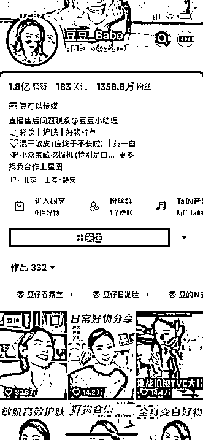
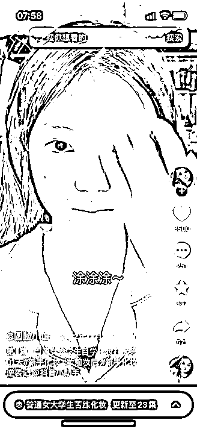
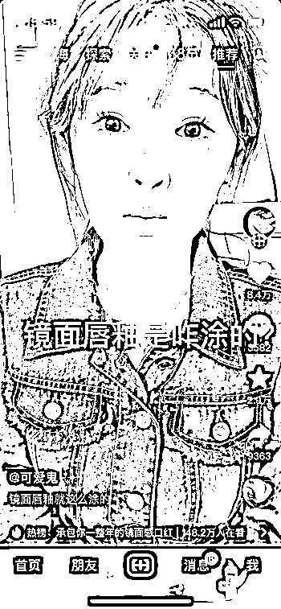
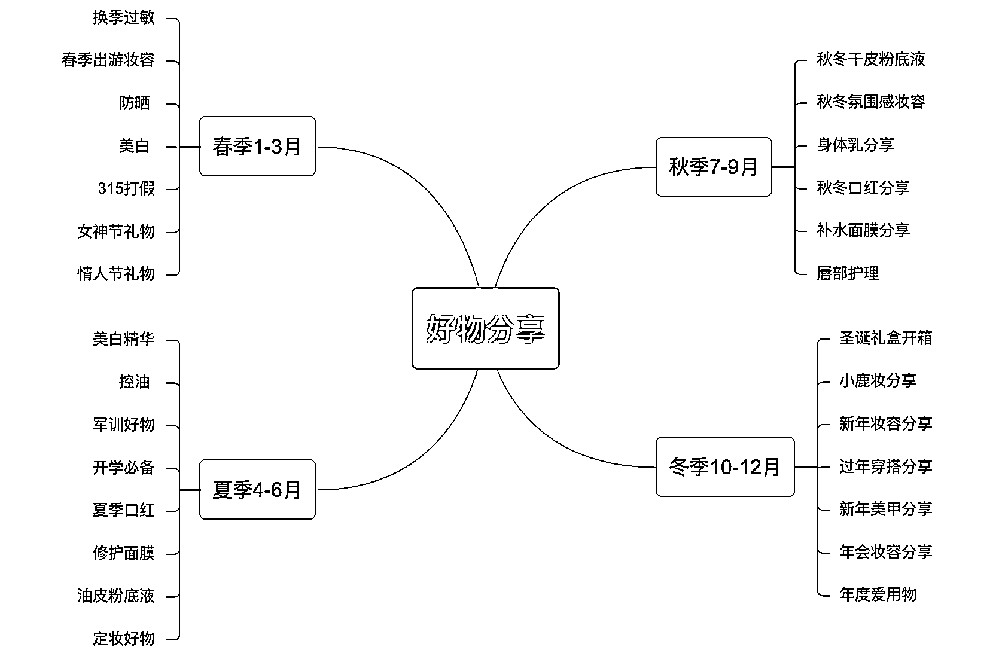
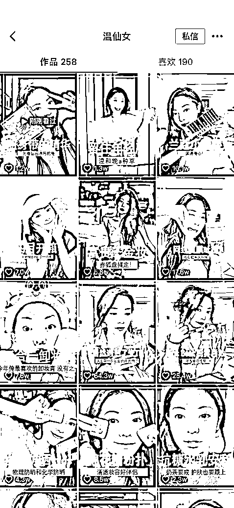
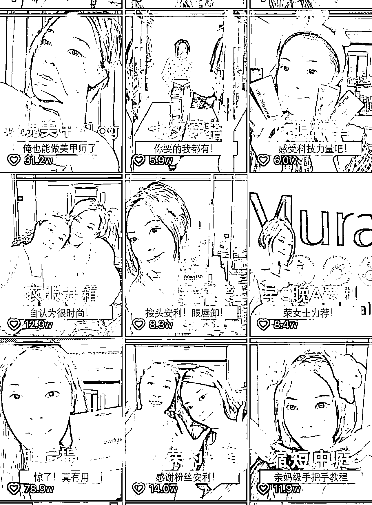

# 《头部美妆账号运营多年的经验分享：如何做一个能变现的美妆账号》

> 原文：[`www.yuque.com/for_lazy/thfiu8/bd6ug3qeo32zw8fi`](https://www.yuque.com/for_lazy/thfiu8/bd6ug3qeo32zw8fi)

## (90 赞)《头部美妆账号运营多年的经验分享：如何做一个能变现的美妆账号》 

作者： zinnia 

日期：2023-04-03 

红得发紫的美妆赛道还能赚钱？我曾经一度觉得美妆 MCN 已经做到红得发紫，很难变现了，但事实却是，你学到其中的一二，千粉也是能够赚钱的。 

红海下像程十安这类的头部达人确实是很难做，但是做小而美还是很有机会的，只要有品牌做投放，哪怕你只是 1000 粉丝的素人，只做口红试色的账号，都有机会变现。 

今天我就从账号最初的策划到内容再到商业化，来说一下做美妆账号的基础方法论。 

具体目录如下: 

一、自我介绍 

二、美妆行业的现状 

三、红海情况下，如何做一个有变现能力的美妆账号 

四、什么样的人适合做美妆账号 

五、如何做美妆账号的内容策划 

六、美妆账号的门槛和想做的一些建议 

# 一、自我介绍 

我是美妆编导小萌，独立做过好些美妆达人 0-1，也做过 10-100 的突破，也做过头部达人，双十一 3 个月广告营收近两千万【没有做直播】，也有帮网友达人线上运营全广告的账号。 

在孵化各类美妆达人后得出的经验，流水线的 0-1，也就是素人孵化是可以有方法论的。 

# 二、美妆行业的现状 

做美妆孵化已经是红海了，红到发黑的海吧，但是只要有品牌不断增生，那美妆圈子就会不断扩大，玩法也会越来越多。 

总而言之，就是美妆【此文的美妆都包括护肤】大概真的是女性必花的一笔钱，美妆达人必然能割一茬韭菜的板块，也是素人美妆爱好者真的能赚很多点外快的部分。 

目前来说千万粉左右的头部美妆达人依旧是那一拨人，这个点我可以说多少需要一些天赋或者非常好的契机以及大量的投放。 

但是能做到美妆头部的基本都是有 1-3 年左右内容沉淀的，没有很快就能破千万粉大关的垂类美妆博主。 

其次是中腰部美妆达人，很多也是老达人以及新起的专家类达人，比如护肤博士、化妆师等等有背书的； 

最后一类就是小达人，很适合素人孵化的一部分，比如这两年的真学生党美妆达人起的特别多火的也有不少，很多几千粉几万粉的垂类美妆小达人就来自这里，我觉得大概是这个年纪的妹子是青春又洋气，又有很多时间玩手机，追求变美。 

总的来说美妆这块蛋糕很大，吃的人也很多。 

 

 

 

 

# 三、红海情况下，如何做一个有变现能力的美妆账号 

（1）换汤不换药，精分的形式激起情绪刺激，搞笑表演型性格的美妆博主，这个算是个性非常突出，对内容也有很大加成。 

举个例子，早期我们做性格不鲜明的小美女达人的时候最喜欢做一个抓人眼球的人设就是精分美少女，就是美丽的搞笑女的意思。 

其实这个人设因为情绪的冲击力，对感官的刺激性，它始终没有淘汰。 

比如我做过一个达人，她在蓝海期做到 80W 粉丝后面就一直无法突破，然后在这个基础上，我就重新给她做了定位，就是帮你省钱的学生党种草机，精分就是她的表演风格，内容风格找了豆豆，就是闺蜜悄悄话分享的好物，包装风格上找了 B 站陈吃饭之类的那种荧光字，彩色大字综艺风，粉丝群体定位就是精准学生党 13-23 岁。 

内容也是围绕着学生党展开，很快就出了 60W+ 点赞的爆款，粉丝突破了 100 万，后续持续深化学生党种草机形象，租了宿舍，买了校服，将整个服化道做到极致，沉浸式的学姐感觉就有了，持续输开学宿舍好物、学生党平价面膜、学生党过年穿搭等几十万、百万赞爆款，涨粉至突破三百万。 

达人本身的天花板可能不是非常高，但是能够通过一些策划抓住粉丝痛点、人群痛点，在看到一些效果后持续深化内容直到将这波流量红利吃尽再进行迭代更新。 

但如今红海期对于这类精分达人账号的策划和达人本身的表演要求会更高，难度更大，不再是单独有一个精分性格就可能火出圈的状态，需要多个特点融合，比如精分性格+妆技干货+新形式。 

参考当下爆火的陈圆圆超可爱，将精分的的性格发挥到极致，再加上社牛的风格和同框连麦指导化妆的新形式，账号涨粉飞速。 

总的来说精分搞笑等具有情绪冲击力的美妆博主相对其他本身实力强的达人来说已经是非常好入门且容易有成绩的了。 

（2）技术型（也包括化妆师、护肤科专家），很会化妆（或者懂很多专业知识技能），有视觉冲击，那么哪怕她口播能力不强，她可以适当通过配音和剪辑手法弥补不足，这个能力也是自己的一个硬实力，不一定只做这种，但是至少有一个确定美妆底盘的核心能力。 

对了，这个化妆和展示一定不要做成擦边，不要做给 lsp 看的那种，他们都不是你的消费群体，一定要是斩女的内容，那么你后续面对同一类消费者可以延伸你的内容方向到好物分享、种草拔草等等也是理所当然。 

比如零吧啦，她之前多以变装为主，不过她本身是妆前妆后非常有冲击力的轻欧美妆等等，这类妆容变化本身就很吸引女生，自然会有粉丝问妆容技巧，那么在卡点变装打出爆款后，逐渐加入了彩妆好物分享。 

通过妆容展示加产品使用展示的方式，逐步增加种草力，往后在增加妆容教程、小技巧等，产出如新手轻泰妆、保姆级遮瑕教程等实用性内容。 

从单纯的展示到展示 + 口播，再往后逐渐加入一些生活片段作为噱头，如海边度假 vlog 等，增加视频可看性的同时提升粉丝粘性，整体来说，满足了视觉爽感、利他性、趣味性。 

另外商业化的角度，技术型内容产出者其实每一条视频都有很多广告位可以植入，比如妆教每一步她用到的产品可能是自己的也可能是广告植入，且能做的不突兀，整体商业化情况也会比较好，种草力强，粉丝反馈也好。 

 

（3）对买买买很热衷，时髦的消费者（koc 向上），很喜欢购物，包括买护肤品化妆品，冲浪达人，对当下网络流行趋之若鹜，会去尝试各种产品，研究买东西的。 

其实有时候做私生粉到一定程度，也能上位当明星对吧，自己疯狂对某个品类或者审美有偏爱，然后买遍了这类东西，其实就算是资深体验家了。 

那么说出来的东西即使不对也代表了一种大声量，持续做也有机会做大，并且能延伸迭代，逐渐成为新的明星。 

这里可以以温仙女账号为例，对于产品来说，其实当下我身边很多朋友自己囤面膜等等都是几箱几箱买，而很多所谓的美妆博主其实自己用过的都没多少。 

但是温仙女是非常走在网络前列的达人，会去看当下流行的产品，去看其他网红在用什么，会主动买很多产品测试，也愿意吃我们的安利球，去买我们觉得值得买的东西测评，对于是不是广告的产品她都会有些主观的输出。 

首先她试过的产品真的非常多，即便是抛开她原本大博主的身份，她也是非常具有代表性的消费者，所以我在分析账号时能明显从数据上看到观众非常喜欢看她的开箱和好物分享或者雷品吐槽， 

在内容中，我们也是将开箱和吐槽常态化的放到排期里，在这部分内容稳定输出之外，种草消费其实可以延伸到女孩子喜欢的其他层面，比如美甲分享、漂亮衣服分享，所以后续我们出了美甲 vlog ,也是打造出了 74.4W 的美甲分享爆款。 

甚至在今年还有很多人做去年的温精灵同款美甲，这类消费种草真的很出圈。 

其实生活中真的有很多女孩子买的东西比很多美妆博主都多，品类要广，比如有些女生喜欢海淘，会买国外小众开架，那么作为很细分的切入点也可以去落地，然后逐渐延伸到更大更多的品类。 

 

# 四、 什么样的人适合做美妆账号 

（1）有眼缘【肤浅点就是美貌】，对应青春美女，即有网红潜质的各类小美女，这些人就是各个平台随意玩着但是颜值或者风格非常有网红潜质的小账号里找； 

（2）有特点【直白点就是“丑”的有特色】，就是你的脸上是不是有些硬伤，比如痘肌满脸包或者眼睛小、嘴巴大等等，可以不化妆很邋遢，化完妆是绝世美女的【不管它后面靠滤镜还是美颜，对于屏幕前的感官动物来说能做到就是牛】； 

（3）口条好的素人。就是你是不是能逼逼，能靠情绪冲击吸引大家的。就像曾经陈圆圆那样很能讲且豁得出去。 

具体一点如果此刻在挑达人：我们一般海选达人会让面试者发一段自己拍的视频，以及给到一份详尽的个人资料表单， 

这个表单里会问包括从基本信息到谈过几次恋爱、为什么分手、喜欢什么明星、爱看什么剧、爱用什么产品、讨厌什么产品、最看重的是什么、梦想是什么，几乎是把一个人的信息从皮肉到个性到人生经历到三观全部问一遍。 

便于去判断此人是否适合做博主，适合做什么样的博主？最好能提炼出 1-3 个关键词，把人设范围圈到最小。 

# 五、如何做美妆账号的内容策划 

首先是基础的账号策划：就是给达人做好定位，这个账号的信息是可以用主谓定宾一句话可以概括的。 

比如张一一是深唇口红种草机，写到简介里就只要定语宾语：深唇口红种草机，这是非常关键的账号定位，让人一眼就知道你是做什么的，你的典型特点是什么，账号赛道是什么，这个定位决定了账号的精准程度。 

然后定一下表现风格，这个可以尊重达人的个性，也可以创造新性格。 

其次再加工账号名字，也就是达人艺名，这里可以多找几个，然后去抖音搜索框里搜一搜看看，比如当初我们做新账号曾经想用猫南北，这个名字一搜有一百多个，而且前排非常多的猫南北粉丝量还不低，那就意味着你用这名字很难被找到。 

我们当初很喜欢用叠词去取名，一一、二二、三三什么的，因为好记，但现在没有必要了，可以取个特别的，但是别太特别，不要有一堆难打的的符号，难打的字也可以避免，搜索起来打字麻烦。 

还有很重要的一点就是想清楚自己要割的韭菜定位，至少清楚要是女的，大概什么层次，比如学生党、时尚白领、贵妇等等。 

接下来找一个或者很多个对标账号，模仿和抄袭总归是创新之母，就像造星一样开始给达人一个身份，比如明星有谐星、有甜美、有狂拽酷炫，那美妆达人也有学生妹、高冷御姐、嘴毒 gay 哥等等. 

那就结合达人情况，找自己觉得可以模仿且能加入或者演绎出所谓自己风格的定位，比如黄黑皮大三学姐【这里这个达人不是真学姐也没事，宿舍可以租，装备可以买，同学可以演对吧】。 

而且可以集各家所长，也可以集各平台所长，风格找一个对标，内容找一个对标，包装找一个对标。 

（1）热门玩法： 

当下抖音有很多黄榜热点，如果你经常刷美妆相关就能非常频繁的刷到，比如说最近是春天，一直都会有早春穿搭出现在热榜上，很多人已经开始出门旅游踏青春游了，这时候也有出门必备好物这样的热点出现，当这些热点出现的时候你可以及时去跟进。 

这样的热搜带来的流量一定程度上很精准，因为经常刷的人就是关注这个赛道的人，也是在这个赛道消费的人，而且有这个热点且你能够及时上榜，后续这个话题流量拱得够大的话，也有很大机会可以给账号带来流量的突破，这里有一些预判性，就要说到下面一个玩法。 

 

 

（2）时间线玩法 

时间线内容也是跟着营销日历来，此处我可以称之为美妆营销日历，也是一些大爆款的轮回节点【就是每年那个点必出的一些东西】。 

一些爆款选题最基础的办法就是在去年今天的回忆上加工搞一搞，毕竟时尚是个轮回，爆款也是嘛～ 

 

【还有一些固定轮回选题大家自己搜搜，此处仅供参考】 

 

 

（3）过往爆款选题 

女生三大目标：变白、变瘦、变美，比如每年总有爆的美白秘籍，三步养成冷白皮，接下来就是军训好物、防晒好物，都是爆款率极高的选题，内容其实每年都没多大变，就是越来越沉浸式甚至逐渐夸张。 

除了赛道固定爆款外，个人账号的过往爆款也值得复制，或者说你有哪个内容总是做的流量还不错，那就值得反复去做，反复打爆的同时也在强化个人人设。 

比如温仙女曾经想要做专业的美妆技巧分享，但是花了很多功夫，拍摄成本很高的做了很干涩的内容，但是效果一般般，不符合账号调性。 

我总结内容之后，依旧认为产品安利、吐槽和个人抓马的讲故事观点输出更符合受众喜爱，且有破圈做大爆款的可能性，后续确认每个月可以有一条人设观点输出内容，比如后来做了温仙女跟朋友出门吃饭遇到有陌生男人要交朋友不成莫名出言不逊的故事，也是做到了 64.3W+ 点赞。 

大家喜欢你的性格，你就多展示一下，大家喜欢你的干货你就多做干货，大家对你讨论多，那就多看看相关讨论，能不能给你一些内容创作启。 

在上述爆款持续涨粉之后，我们发现大家对温仙女长相的问题讨论一直很多，尤其是 DO 脸还是很成功的情况下，结合到当时比较热门的话题女性成长变美，我们就打算说一下自己的一个变美思路，把 DO 脸和自我提升结合去讲一下，产出了现象级爆款“俺的变美历程”100 多万赞，后续每年再讲这个选题还是会爆。 

总而言之，多探索总结自己做过的爆款内容，自己没有就先做别人的爆款选题，自己有了就复制升级自己的爆款，直到把爆款的流量红利吃尽再换。 

 

 

 

# 六、美妆账号的门槛和想做的一些建议 

其实商业化对于美妆博主来说一般都不是问题，除非是假美妆博主，最根本的判断方式就男女粉比例，因为在我们固有的说法里男人消费力如狗，你一个做美妆的美女，如果吸的都是男粉，那肯定都是 lsp。 

这时候你还不如做颜值主播去，美妆博主肯定是吸女粉的，不管后台数据怎么样吧，反正不太可能一点不赚钱，有这消费粉基础，多少能变点现的。 

流水线美妆达人几万粉、十几万粉也能接不少广告了。 

再说一种不需要很大力气策划也能稳定赚钱的真美妆博主，就是会化妆的达人，画氛围感妆容的达人【就是当下大家都想画的美女妆】， 

很多小达人很会化网红美女妆，可能妆容感觉千篇一律，但是他们接商务产品合集可不少，毕竟人家有手！真会！ 

最后就是想做一定要坚持，一个内容方向至少尝试 5-10 期去测试，不要换来换去。 

评论区： 

牧之 : 666 zinnia : 1 笑爱丝 : 美妆确实很多，细分特性也越来越细，卖的产品几乎千篇一律 zinnia : 就考验怎么整活了，不过技术在江山在 楚菲 : 感谢分享！ 看到美妆号，突然想到勇仔，就是痘肌 然后教化妆那些 而且很多都是新手教程的，这个定位就到痘肌，瑕疵皮 ，新手化妆那块[愉快] 努力 : 专业 全面[强] 悠途 : 一看就是有实战的。护肤博主有什么好的人设和标签容易获得 40+姐姐喜欢的？ 希声。 : [强]