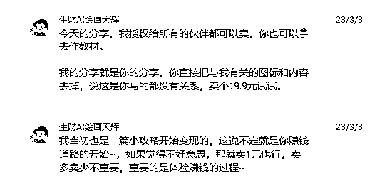
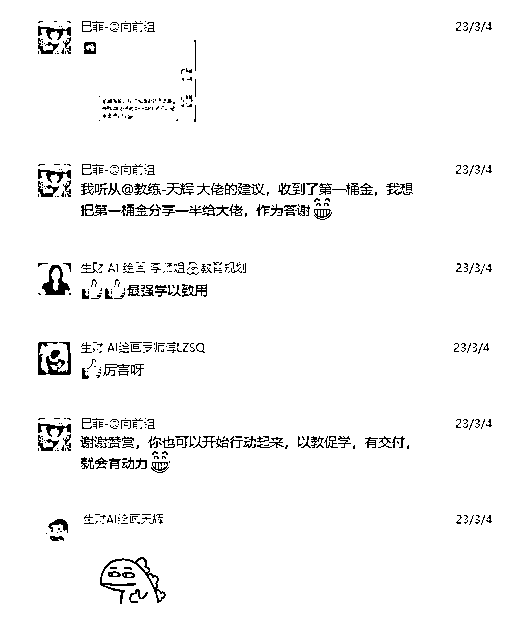
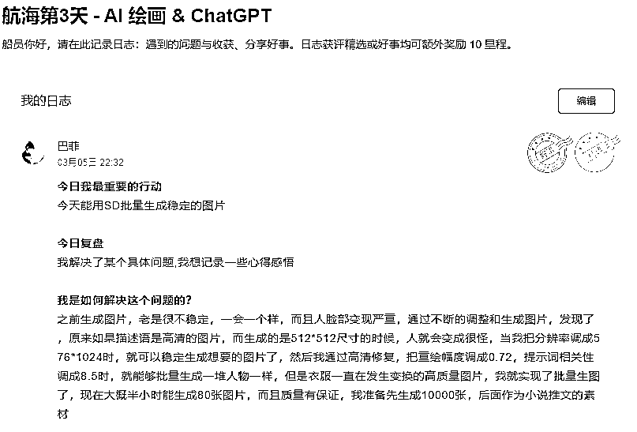
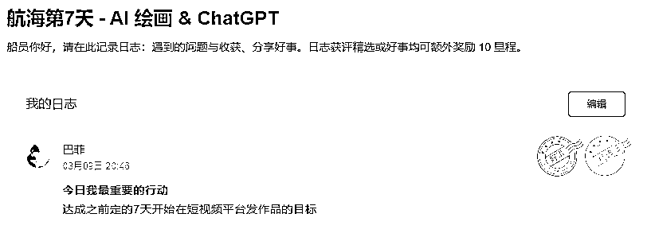
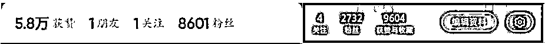
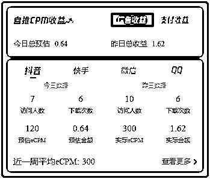
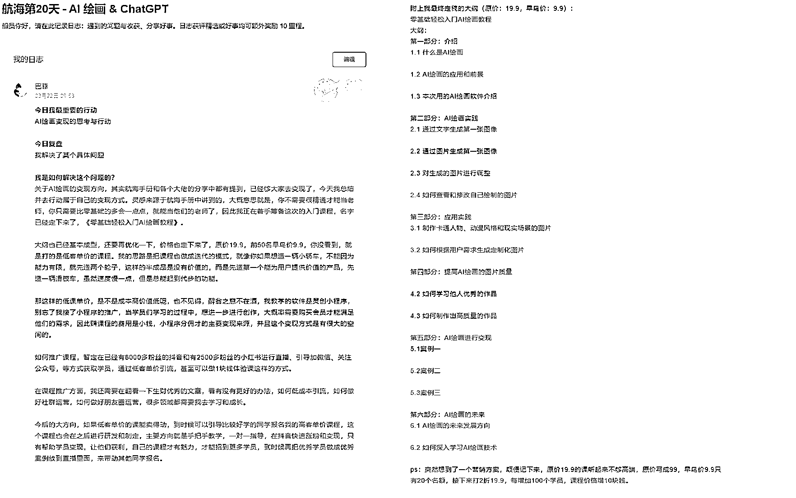
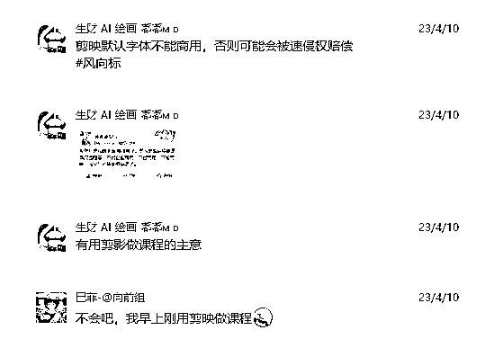
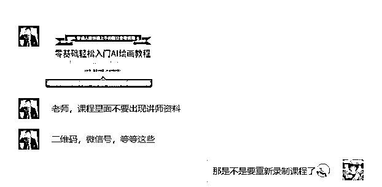

# 《来生财一年后我终于明白什么是“利他”》

> 原文：[`www.yuque.com/for_lazy/thfiu8/fc06fydifzxla88t`](https://www.yuque.com/for_lazy/thfiu8/fc06fydifzxla88t)

## (精华帖)(405 赞)《来生财一年后我终于明白什么是“利他”》 

作者： 巴菲 

日期：2023-05-09 

大家好，我是巴菲，主业是个 996 程序员，一个潜水近一年的小白。第一次参加航海，便在 15000 人中排名第二，短视频涨粉过万。而且直到参加这次航海，才发现生财这个平台，也很适合没有资源人脉的人开启副业挣钱，我就是这样赚到了人生副业第一桶金。今天我把自己这段经历整理分享给大家，希望能帮助更多尚未下场的圈友。 

 

## 一、背景介绍 

我是 2022 年 4 月 18 日加入生财的。和大部分加入生财的圈友一样，怀着一颗仗剑走天涯的心。希望能在生财里面，发现财富密码，日进斗金，走上人生巅峰。 

刚进入的时候，发现到处都是宝藏，市面上主流的挣钱项目，在这里几乎能找得到。我甚至幻想着，自己要一下子找 3 个项目，同时做起来，那么我很快就能实现财富自由了。 

我几乎是看到一个赚方法，就收藏一个。 

但是直到我的收藏夹已经有几百篇干货了，我还是没有赚到一分钱。 

这次的转机来自 2 月航海前，收到鱼丸关于新的航海的提醒。 

我心想，已经是第六期最后一次航海了，哪怕下一期不再续费生财了，那至少也要体验一下航海，进行一次实战，也不枉来生财体验一次。 

就这样抱着试试的态度，我报名了目前比较火的 AI 绘画&chatGPT。 

第一次参加航海，其实是有点畏惧的，是对陌生环境的恐惧。来到航海群，举目四望，一个熟人的 ID 都没有。因为之前从来没有链接过圈友，作为一个和大家完全陌生的小白，心中有些落寞，不知道如何融入这个实战团体。 

当发现大家都是老朋友，我只能故作镇定小心翼翼的尝试第一次的发言。然而在接下来的 21 天里，我却慢慢的成了这个群里最活跃的成员之一。 

 

子安在开船仪式里面说过了航海要做的五件事： 

【共读】实战手册 

【持续】探索实践 

【举手】主动提问 

【互助】热心解答 

【高频】交流经验 

这五句话深深影响了我的航海行动。 

##   

## 二、我如何通过航海实战从零涨粉 

航海的第一天，我和大部分人一样，阅读了航海手册。手册内容太详细了，我看了一整晚，最后还是选择有侧重的去学习部分比较感兴趣和重要的知识点，并很快的能上手画出第一幅图。 

航海日志模板，有一个设计特别不错，那就是日志的最后会要求必须写接下来的目标。 

为了能给自己有一个努力的目标，我在第一天日志就立下了 7 天在短视频平台发布第一个视频的目标。 

 

接下来就围绕着这个目标去行动。 

航海的第二天，天辉教练授权我们使用他分享的内容。发到朋友圈，通过小额收费和朋友们一起学习。 

 

当天晚上，我就发了朋友圈。我在朋友圈里面，巧妙的运用了原价 29.9，前 10 个报名的只需要 19.9 这样的文案。 

第一天就卖出去了几份。成了群里第一个因为快速的执行力，得到了这次航海的第一个正反馈的人。 

虽然变现不多，但是让我很快尝到成功的甜头。我把自己的这份行动经验分享到群里，得到了很多圈友的称赞。 

 

他们纷纷因为我的行动力和乐于分享加为我好友，这给了我很大的信心。当天我也拿到了自己航海日志的第一件好事。 

做对他人有帮助的事，并且得到大家的认可是会让人上瘾的，这让我更加努力想要学习和分享。 

在航海的第三天，我已经可以从一开始的出图质量差的程度，变成能生成稳定的人物图片的水平了。这在我看来是一个不小的进步，于是把这次问题解决的过程，记录到航海日志里面，意料之外的获得了好事和精选。 

 

又一次让我意识到，在航海的每一天，积极去行动，努力解决问题，遇到困难在群里寻求帮助，不仅能提升自己的能力。也能帮助到其他圈友，得到大家的认可。 

因此接下来的每一天，我都在不断钻研并解决问题并且把这个过程分享到群里，以及记录到作业里，因此大部分航海日志都是精选，得到了更多圈友的称赞。 

再次让我体会到越分享越幸运，越分享越有收获。在利他的过程中，我成就了自己的 AI 绘画技术和人脉。 

时间来到航海的第七天，我在抖音和小红书，同步更新了我的第一个作品，顺利完成了第一个七天目标。 

 

 

并制定了第二个目标，七天后，抖音视频播放量有一个量级的提升，在第九天把这个量级设定为具体的数值，出个 10 万播放量的小爆款视频。 

 

但是第一个作品发布的 24 小时之内只涨了个位数的粉丝，赞也是寥寥无几。第二天，我又发布了两个作品，效果都不好，点赞都是个位数。 

发了三个作品都没有几个人看，属实对我有点打击。甚至有一个作品，被判定为低质量违规，让我更加受挫了，但是想到自己的目标，默默告诉自己不能放弃。 

但我对自己的图片质量还是挺有信心的。毕竟很多圈友都夸好看的东西，必然不会太差。 

我看抖音上面其他人，同种类型的视频，播放量都挺不错的。如果排除是作品质量有问题，那我要反思，到底自己和爆款的差距是什么。 

我发现爆款视频的背景音乐听着很舒服，是不是我也可以拿来用。针对上面的思考与猜想，我把爆款视频的背景音乐拿过来用。搭配自己的作品看起来挺不错的，抱着试试的心态就发布了。 

让我感到惊喜的是，一天的时间，就跑了 2 万播放量，涨粉 1000。当我发现出一个爆款，我立马又用同样的格式一天内共发了三个视频。 

我的理解是乘胜追击，刷到我爆款视频的人，如果进我主页，肯定想看更多的同类型视频。 

这样做有两个好处，一个是让爆款带动我新视频的流量，另一个是让新视频带来更多的关注，让用户确信关注我可以经常看到他喜欢看的视频。 

时间来的第十四天，我并没能完成 10 万播放量爆款的小目标。其中最高播放量的视频是 7.6 万。尽管没达成目标，但也已经很接近了。 

 

我在想如何制定接下来的目标，才能寻求更大的突破，实现真正意义上的跑通项目，做到变现。于是我定了接下来的七天目标，完成 AI 绘画入门课程的大纲。 

接下来的几天里面，抖音继续保持的快速的涨粉，小红书也快速涨粉突破 1000 粉丝。 

到航海结束的那一天，抖音粉丝 8600，小红书粉丝 2700。 

 

 

这段时间里面，我没有花很多的时间去迭代视频。只是保持同一种风格和相同的更新频率，一天更新三个视频。然后把更多时间投入到课程的准备中。 

## 三、我如何通过参加航海变现 

接下来讲讲，作为一个 AI 绘画零基础的人，是如何通过参加航海进行变现的。 

当我通过 AI 绘画软件生成的图片，在抖音出爆款涨粉之后，我就一直在寻求变现的方法。 

我的图片属于好看的壁纸类型，可以通过分享图片引流变现。航海手册有介绍到可以通过引流到壁纸小程序变现，因此我通过抖音的小程序神图壁纸，进行引流变现。下载一张图片的单价有 0.27，用户开通会员有几块钱。 

 

与此同时，我在灵创小程序发现了有推广合作的需求，抱着试试的态度，我加了他们的商务。 

他们合作的要求是在短视频平台至少要有 5000 粉丝，而当时的我，刚好有 6000 多粉丝，刚好踩线符合要求，于是我又多了一个变现的渠道。 

为了让抖音的流量更值钱，也为了能更好的推广灵创小程序，我改变了我短视频的变现策略——通过抖音引流对 AI 绘画感兴趣的粉丝到公众号，开发一套 AI 绘画的入门课程，通过绑定课程和灵创小程序。卖课的同时也推广小程序，两个渠道一起变现。 

想到好的方案之后，我马上着手准备课程的开发。 

第一次开发课程没有经验，刚好想起有优秀的小伙伴在航海日志里面分享让 ChatGPT 帮忙做课程提纲。 

我又回去复习了一遍，通过几次的修改便做好了课程大纲。 

由于之前 ChatGPT 的账号已经不能用了，所以没有找到当时调教的过程的细节，我就简单的贴一下课程大纲出来的效果。刚出课程大纲的时候，21 天的航海也快结束了。 

 

但是航海的结束并没有打断我在 AI 绘画变现路上继续往前探索。 

课程大纲出来之后，尽管没有经验，课程质量还没有保证，没有时间，不知道什么时候能做好，没有方向，不知道课程要上架哪个平台。但是我就开始在朋友圈进行课程预售了。 

因为航海期间一直在朋友圈持续分享自己 AI 绘画的成果。就靠一张简单的大纲宣传海报，第一天就卖出去了好几份。 

也是因为这种欠客户一个课程的状态，让我接下来在开发课程的时候，遇到困难都没想过退缩。 

钱都收了，再辛苦咬咬牙也是要坚持把课做完。 

经常是晚上加班到 9 点回家，写课件录视频到深夜 12 点多。 

 

所以会发现我的视频课程声音不大，因为怕说话太大声吵到了家人和邻居。 

做课的过程其实是一波三折的。 

因为一开始不清楚抖音的默认字体不能商用，ppt 的默认字体也不能商用。 

我课程都录制好了，准备找平台上架了。还好咱们大航海的群友嘟嘟，知道我在做视频特意发到群里提醒我。 

 

天呐！简直是毁灭性打击！ 

我昨晚刚熬夜录制的视频，今天又要重新录制一遍。怪我没有提前做好功课，太心酸了，想要放弃，想到钱都收了，算了吧，重头再来吧。 

折腾了一两天终于把商用的字体改成免费的了。找到了平台上架，审核了一天之后。商务跟我说，因为我的 PPT 里面有出现微信号和公众号信息，没办法过审，需要修改。 

 

我才意识到，自己把水印打在每一页 PPT 上面，又要重头再来一遍！ 

离终点就一步之遥了，又是一次通宵达旦。想着好事多磨，希望就在眼前，又斗志满满。 

完成所有视频的录制之后，我终于松了一口气，可以安稳的睡个好觉了。 

整个课程的制作，整整花了 20 天的时间。上架到平台的第一天，包括预售的部分，一共卖出 20 几份。 

 

虽然客单价不高，卖的数量也不多，但是已经感到很欣慰了。 

为了提高用户的体验，我决定把课程做成 7 天的课程训练营学习模式。通过每天布置作业，来提升学员的参与感。 

7 天的训练营结束，实事证明我的决定是对的。这样陪着学员通过每一次作业的进步，让他们喜欢上了 AI 绘画。在训练营结束之前就有同学问我有没有进阶的课程可以学习。很遗憾我没有时间开发进阶课程。 

为了不浪费第一波转化的流量，我当机立断，决定创建属于自己的知识星球，并成功转化了 5 个客单价 399 的付费学员。 

 

我在 AI 绘画的变现道路，就是这样通过一小个台阶，一小个台阶的向上攀爬的。从最开始的单张壁纸价格的 0.27 元，到目前一个知识星球付费用户的 399 元。 

我还在持续规划中，后面还想推出客单价 999,1999...的付费服务，通过一对一指导帮助学员通过 AI 绘画短视频变现。 

##   

## 四、航海环境是如何对我涨粉和变现提供帮助的 

如果没有参加本次航海，我不可能会自己去学习 AI 绘画。 

我一直觉得时间不够用，哪有时间去学习新领域的知识。但这次航海，我跟着完成了航海手册学习，高手分享学习，甚至跟着优秀的航海日志学习，让我随时调整错误的方向，更省力的快速进步。 

 

我每天都会去翻阅精选日志，并学习他们分享的优质内容。 

如何提升图片质量，我是看了精选的分享才有了启发。 

如何提升短视频的播放量，我也是从学习别人的日志来的。 

用 ChatGPT 出课程大纲还是看了小伙伴的分享，自己跟着用起来的。 

我的一些行动跟优秀伙伴的分享息息相关，我的成果离不开他们利他的分享。 

我的变现方法，则是来自航海手册的变现教程里面的，写着几十种变现方式的详细操作方法，并分析每一种适用的场景，我结合自己的情况，做出比较合适的选择。 

## 五、航海里给我带来帮助的朋友们 

在生财里经常听到一个词被提到，那就是“利他”。以前听并没有什么感觉，这次发生在自己身上才非常有感触。 

我在文章前面有提到，刚进航海群的时候，我一个认识的朋友都没有。但正是这群与我素未谋面的朋友，却给我带来非常多的帮助。 

首先感谢对我帮助非常非常大的两个圈友，子西和天辉。 

子西是我的第一个贵人，我们很聊得来。她懂命理，同时涉猎领域广泛，对信息的筛选和总结能力强。她跟我分享了很多制作课程的方法，朋友圈运营，社群运营的方法。教我如何链接更多大佬，向大佬们请教问题，就是在她的帮助和鼓励下，我才有机会得到其他大佬的帮助。 

同样对我非常大帮助的天辉教练。当我第一次带着课程大纲去请教他问题的时候，他非常耐心地倾听我的问题，并给予我很好的建议和指导。在他的帮助下，我改善了课程的不足点。 

在卖课之前，他又教我如何打造个人朋友圈 IP，如何通过稳定的在朋友圈输出，增加自己课程的曝光，教我朋友圈运营。在入门训练营结营后，学员转化到知识星球服务的时候，又给我提供了很好的方案，帮助我顺利完成付费转化。 

感谢领队何伟建，在航海期间，一直鼓励我们多去实战。看我经常认真记录航海日志，就建议我持续努力学习和分享，冲击排行榜。那时候，我才知道原来我已经在 AI 绘画的排行榜 top10。让我更有斗志去冲击更高的里程，最后达到了 AI 绘画的第二名，同时也是航海全榜的第二名。 

感谢饼公子，向他请教问题的时候，交流也很愉快，他也帮我解决很多疑惑，让我更坚定做课程的信念。 

感谢嘟嘟 MD，我们两个很聊得来，经常会讨论一些问题，相互鼓励，在我课程用到付费字体的时候，第一时间帮我纠正。 

感谢一三，指导我课程需要设置体验课，核心课，并教我如何转化。 

感谢 Loiy 卢艺，给了给我课程售卖技巧的建议，通过具体数字的展现，宣传的时候让课程看起来物超所值，才更有吸引力。 

感谢我们的组长向前，也一直给予我很大的鼓励。 

感谢排行榜第一名的浅色 bug 的喵，虽然我们没有过任何交流，但是看到他分享的那么多优秀航海日志，学习到很多。然后也觉得自己的技术和他还有差距，让我更有持续努力学习的动力。 

感谢和风，和他交流，给了我很多创作的灵感。 

感谢同个群一起实战的圈友们，我们一起努力，相互帮助，互相成就。 

## 六、写在最后 

通过这次的航海实战，不管在物质上还是精神上，都让我收获很多。 

从 AI 绘画零基础小白，到开展入门课程训练营，再到 AI 绘画联盟的合伙人。迈出了出圈的第一步，也让更多的人认识了我，也给了我很多的机会。希望我这次的分享能实实在在的帮助到还没有参加过航海的小白。 

送人玫瑰手留余香，我一路走来受到太多大佬的帮助和指导。同样的我也希望能尽自己的微薄之力，帮助更多需要帮助的新人。 

我已经申请挑战 5 月 AI 绘画航海的教练和志愿者，如果你也对 AI 绘画感兴趣，那我们到时候见。如果你对航海或者 AI 绘画有疑问，欢迎来和我链接交流，一起生财有术。 

最后的最后，要感谢那个上班 996，却又在航海 21 天里面，每天下班后至少 3 个小时死磕实战的自己，课程制作过程中一次次出错从来未曾放弃过的自己，敢于每天分享经验的自己。 

我也是个严重的社恐患者，但是我深知，默默的行动，独享成果，没办法放大自己行动的价值。 

低调做人，高调做事！在航海里高调分享自己的经验成果，帮助他人，也能让自己被看到！在生活工作中又何尝不是呢？在一次次的分享中成长和积累人脉，你将有意想不到的收获！ 

从今天起，让我们一起高调的行动起来，一起生财有术！ 

评论区： 

潇湘妃子 : 同为 996 的程序员，加个 V？[偷笑] 星月有心 : 感谢分享，对即将首次出海的我是一次及时的扫盲。让我更了解航海在做什么。感谢 巴菲 : 现在正是航海的报名时间段，我在 AI 绘画船上等你，我们一起冲[机智] 巴菲 : 好的哈，相互学习[愉快] 巴菲 : 冲～ 飞书何伟建 : 真棒👍 梁辰 : 棒棒哒 一次就好 : 真棒