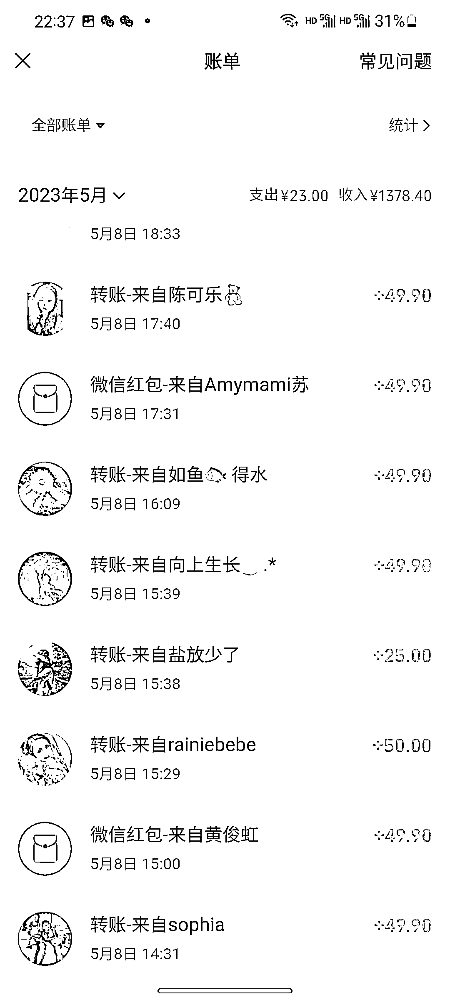
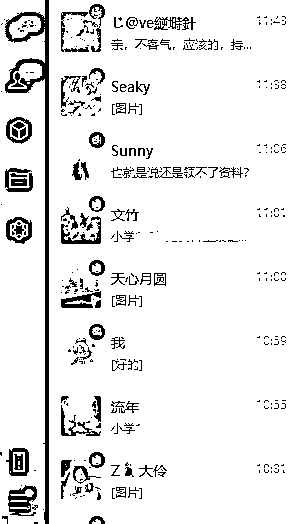
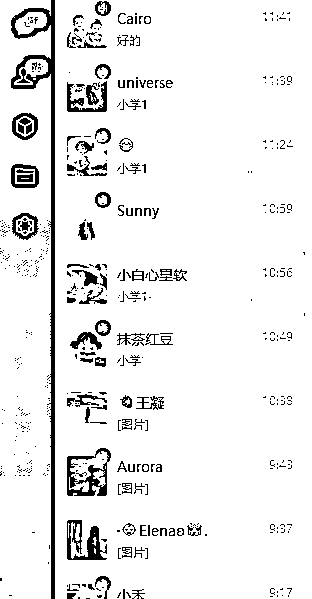
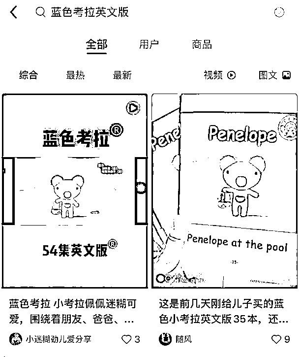
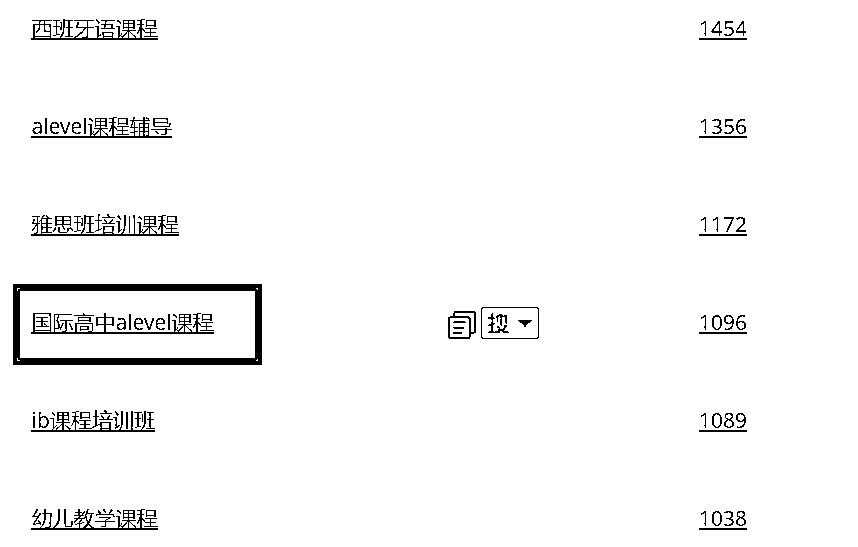
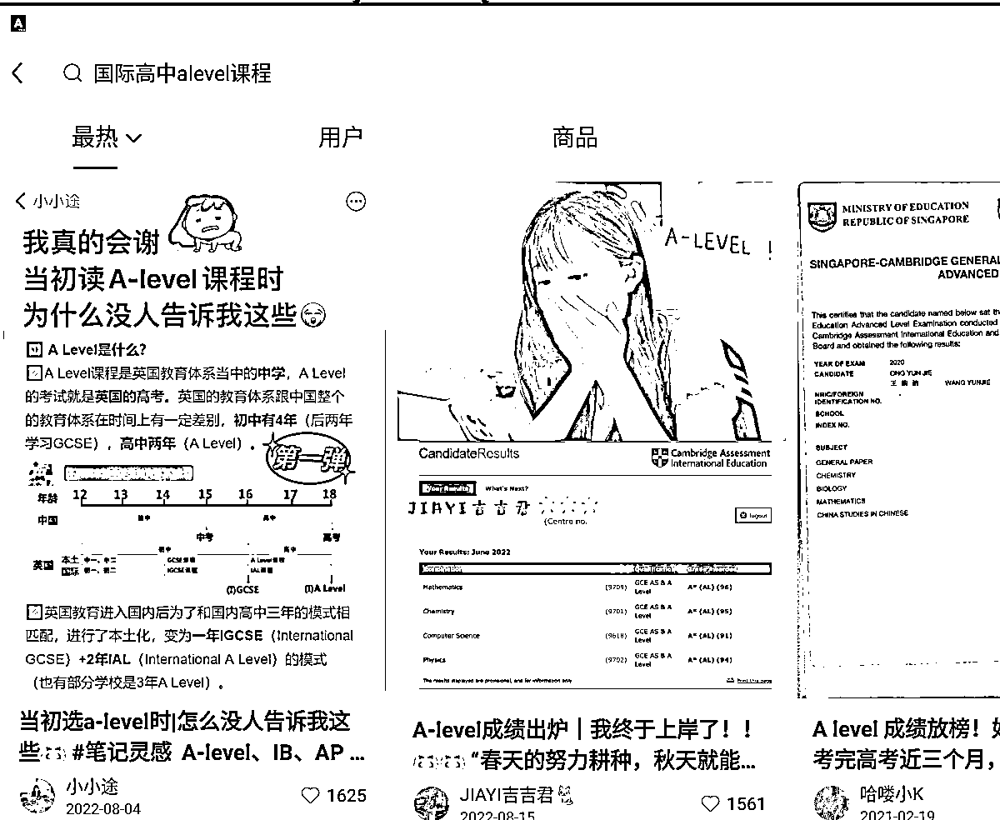
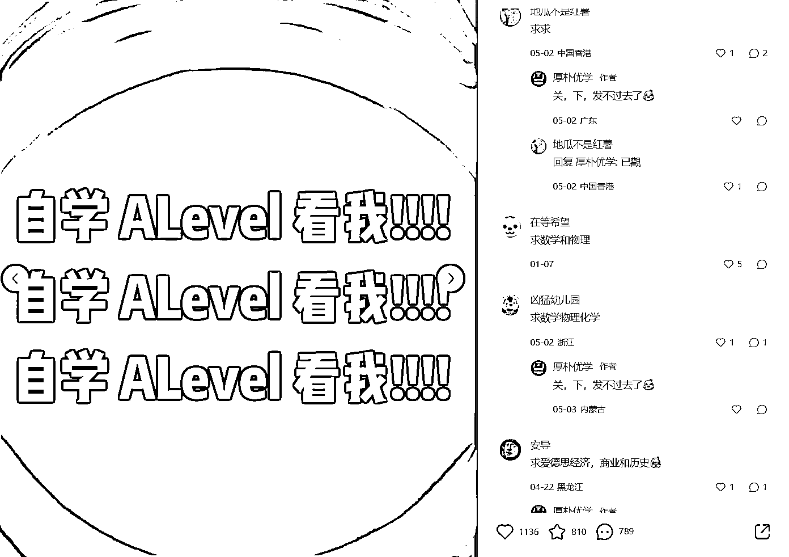
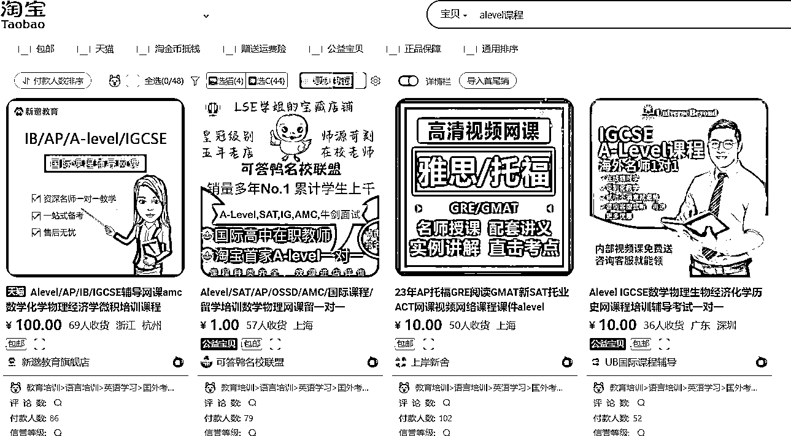

# 《小红书虚拟项目赛道选择、转化思路的案例拆解及全方位实操经验分享》

> 原文：[`www.yuque.com/for_lazy/thfiu8/wg494pypyxh50ay8`](https://www.yuque.com/for_lazy/thfiu8/wg494pypyxh50ay8)

## (160 赞)《小红书虚拟项目赛道选择、转化思路的案例拆解及全方位实操经验分享》 

作者： 黄岛主(虚拟项目) 

日期：2023-05-11 

大家好，我是黄岛主！ 

今天跟大家聊聊虚拟项目这方面的话题，我相信很多人都比较感兴趣的，因为虚拟项目变现的是纯利润哈！ 

关于这块我都感觉有点老生常谈了，主要是现在虚拟项目大家都在做，凡是做互联网行业的，多多少少都会跟虚拟项目沾亲带故，因为虚拟项目没什么成本在里面，而且需求也非常大，基本上各行各业都可以实现虚拟项目变现。 

而目前虚拟项目能做的平台也是非常的广，例如淘宝、拼多多、小红书、闲鱼、1688、抖音、视频号、快手等等，这些平台都可以完美的去操作虚拟项目。 

但我今天要分享的是小红书平台做虚拟项目，我认定你也肯定感兴趣哈。顺便也看看我们最近做的启蒙类赛道的利润，单价 49.9，效果还是很可观的！ 

 

小红书虚拟项目，说白了就是我们在小红书上发相关的虚拟资料笔记，当笔记有人看或者热门之后，会有人私信你，然后你把人引流到微信上，在通过微信去转化，最终变现。过程还是非常简单的，主要还是引流+变现吧。 

目前小红书上做虚拟项目的人并不多，只是个别行业内卷了，比如学科资料做的人就很多，但是学科资料确实很暴利啊，引流上很容易也不是问题，就是转化上可能现在要差了点，如图： 

 

 

上图可看到，流量基本上不是问题，就是转化上没原来的高了，这个赛道我们是从蓝海做到红海的，也算是圆满结束这个赛道。 

当然，你说这个不能做了吗？肯定不是！因为能做的赛道太多了，现在很多人小红书虚拟项目，都想吃现成的饭，都不想去自己挖掘更大的新赛道。 如果你不去挖掘新的赛道，你最终会被饿死，因为你做的赛道早晚有一天会枯竭的，而且整体项目也做不长久。 

所以，你想长久的去操作小红书虚拟项目，我是建议你去挖掘更多的赛道，因为虚拟资料又不是只有学科，就跟你谈恋爱一样，这么多类型的女孩，不一定要非得吊死在一棵树上，一样的道理哈。 

当然，目前市面上很多做 PPT、幼儿园公开课、考研等，但这些都是大热门了，这些可以做，但是你现在入手肯定是晚了。尤其是是公开课，现在很多做培训的也还在这个赛道上操作，但见效可能会差一些，毕竟做的人多了。 

所以 ，你首先要把这个赛道挖掘给搞定，如果以后你做不了当前的赛道，你要做好两手准备。 

那么，接下来的话，我会分享我选择小红书虚拟赛道的一些思路玩法，也是根据我们当前做项目一些经验做的总结。 

1、领域思路的放大 

我们既然知道了小红书有大量的宝妈群体，那么我们就可以从这方面去联想一些关键词根，你可以多思考下 0-6 岁的儿童方面都会学习什么？ 

例如：启蒙、幼儿启蒙、幼儿园、早教、0-3 岁培养、育儿、幼儿、幼儿逻辑思维、幼儿英语...... 

上述这些基本上都是词根，而后期我们要去挖产品，需要多考虑到更多的相似词根，然后去挖掘蓝海产品，词根多，就可以挖掘的很多。 

2、根据自己联想出来的词根，去尝试用软件去分析 

我们用名不虚传这个软件，这个不是为了打广告哈，确实是一款不错的软件，而且软件主要围绕淘宝去分析，因为电商平台上的数据可以直观的展现给我们，我们需要知道一个产品的大概数据。 

另外，我们做小红书说白了，就是淘上红模式，淘宝火的虚拟产品，如果放到了小红书上也可以测试操作。 

注意：除了名不虚传，还有很多比这个更好用的分析工具，这里我就不透露了哈！ 

我们举个例子：启蒙 

 

启蒙这个词，可以分很多的，譬如：英语启蒙、法律启蒙、地理启蒙、语言启蒙、音乐启蒙、反霸凌启蒙、早教启蒙等等很多的，每一个都是我们可以测试的品类。 

备注：词根分为 通用词根 ，通用词根挖出来的，又分为 行业词根、细分化领域的词根 

想要找到符合我们的，我们可以看这三个指标：搜索人气、成交转化、直通车成交笔数 

如图：我们看的是“直通车成交笔数”，可以看看左边的是什么品、右边的成交了多少笔。 

 

其中，我们看到了，反霸凌启蒙绘本，这个成交笔数是 324，从其他数据也能看到，搜索人气也是很高平的，说明这个品非常不错的，现在很多宝妈都在为反霸凌提前做准备，谁都不希望自己的孩子在上学的时候被霸凌。 

我们可以按照这个方法去看看求他的品，当然也有很多热门的，比如英语启蒙，这个虽然热门，但是可以做，现在很多宝宝都喜欢看英语启蒙动画，例如雅克第、宝贝鲨等等。 

可能英语启蒙大家很陌生，也可能是因为你没孩子，或者你从没关注过这类。其实这类在 0-6 岁的宝妈眼里都是大宝藏，而且很多儿童都喜欢看这类的。 

例如：小小优趣，这是一款 APP，里面包含了：Super Simple Songs、蓝色考拉、Maisy 动画等各种幼儿启蒙的视频和儿歌。 

这个小小优趣有孩子的人应该知道哈，这个是引进了从全球优选的 7000+动画，1000+儿歌音频故事，内容画质高清、绿色无广告，含中英文字幕，非常适合 0-7 岁的孩子进行英语启蒙和早教！ 

但是这个是收费的，价格不便宜，年费是 300+，所以很多人都开始走渠道去买，渠道卖才 100+年费。 

但是，如果你有视频片源，可以单独去卖！卖的时候，可以网盘，也可以 U 盘邮寄！ 

3、选品确定了，去分析下数据 

我们选定大概的虚拟方向后，可以去小红书上去看看有没有人去做，大概能有多少篇编辑去做 

譬如，我们以英语启蒙去做分析，例如蓝色考拉这个动画片，我们可以去搜下拉框，看下数据： 

 

如图：蓝色考拉 这个有 7400+笔记，说明做的人是有的但是不多，且不一定都是变现的，也有可能是无偿分享 涨粉的。 

再看看下拉框，有相关的，说明有人去搜： 

 

当我搜索后，其实有不少都在做的，这个你可以自己尝试着搜索分析下。 

 

我们可以看到同行的小红书对标，他是各类英语启蒙动画视频都做，蓝色考拉只是其中一个。这个时候，你可以加对方的微信看看对方怎么做的，毕竟知己知彼百战百胜。 

我们还可以去看看其他的赛道，这个是通过词根在 5118 工具上，挖掘相关行业关键词了，属于自主分析了： 

那么，我根据“课程”这个词根，然后挖掘了很多相关词 

 

比如我们看看这个词：大白菜 u 盘装系统教程，到小红书上搜下看看数据： 

 

你会发现是有人在做的，而且点赞量等数据都是非常符合要求的，因为点赞至少要 100 以上，不然我们会觉得这个赛道的资料没什么需求量。 

 

我们随便打开一个评论，这个评论是 22 年的了，但是这个不影响我们实际的分析，我们可以筛选下最新去看看： 

 

看到数据，充分说明，这个赛道的资料是有很多人 想要买的，我们可以再去淘宝上看看数据： 

 

淘宝上的数据虽然不是很多，但需求的人是有的，所以这个品类绝对可以做，如果你很在意版权你可以不考虑这个，因为这个版权很多时候只出现在电商平台，如果微信私域变现的话，基本上不用考虑版权。 

选品没问题，基本上我们就可以不断的测试新的赛道，如果你正在做的赛道突然同行增多或流量不好了等，你完全可以分析出一个新的赛道继续去做，基本上方法都一样，只是换了个其他的虚拟资料去做。 

可能这个时候你会为话术而烦恼，那么我分享下万能的虚拟项目话术给大家： 

关于变现话术，我们根据以往做项目的经验，提炼出了 5 个咨询核心： 

开场提问、鉴定白嫖、发报价表、收钱发货、补差价追销 

那么，我们以动画资料作为举例： 

1、开场提问 

客户加进来之后，要主动给客户发信息，其实这个时候，能自动回复就自动回复，有软件辅助，包括自动同意添加好友，添加后再去自动回复。 

那么我们主动发的信息基本上就是：你好，请问需要什么英语启蒙动画？ 

但如果客户直接跟你说我要什么课件，就不用说这句话了，基本上就是开门见山了。 

2、鉴定白嫖 

当你问完客户“需要什么英语启蒙动画”之后，基本上客户会告诉你他需要什么的。但是，这个时候你不知道他是不是愿意为这个去花钱。所以，我们要去测试鉴定客户。 

你可以发这么一段话术：亲，有的，但这些英语启蒙动画视频都是花钱和花费精力整理的，整理不易，所以低价有偿哦！（可以做成图片发给客户） 

如果客户回复：多少钱？ 

基本上如果他说多少钱的话，是可以判断出这个客户还是有花钱的意思的。 

所以，我们要去判断，这个客户是想白嫖还是想付费花钱买，还是预算有限不想花太多的钱去买。 

注意：如果对方确实不打算付钱，想白嫖，那么就免费发他几个动画视频，让他过把瘾，后期在慢慢转化。 

3、发报价话术 

客户回复多少钱之后，我们要发这些，看下话术参考： 

单份英语启蒙动画是 15 元（包含视频 MP4+配套音频+台词绘本+英文字幕） 

建议 49.9 元进动画课件群，所有的英语启蒙动画资料永久免费哦。 

然后这个时候，发几张网盘里的截图或者课程目录。如图案例：（可以手机端直接截图）注意：客户需要哪个就截个图，要勤快点！ 

 

 

发完网盘截图之后，再发这句话：亲，这是目前全网最新、最全、最划算的动画视频整合哦！ 

完了之后，再发这句话：亲，需要的话，微信转我，我发你资料，或者拉你进群，包含 1000g 英语启蒙动画和英语绘本资料，3000 多份启蒙动画资料，后期还会持续更新~（这个大家根据实际情况去改写） 

如果客户问网盘群怎么没人啊，就说之前的满了，新开的网盘群！ 

4、收钱发货 

客户买了之后，就发网盘链接就行了，这个时候要看对方买的是会员，还是单独的。 

5、补差价追销 

比如客户买了单独的了，我们要想办法让客户去买会员去进网盘群。 

所以，你给客户发完单课的网盘链接后，可以发这么一段话：祝小姐姐越来越漂亮，宝宝英语越学越好！（可以发个鲜花动态图） 

发完之后，再发一句话：小姐姐今天可以补差价进会员群呢，只需要补 34.9 就行，资料有 500 多 G，涵盖各种英语动画启蒙视频、绘本、音频等资料，需要可以入手了仅限今天哦~ 

发完这段话之后：可以录制会员网盘群的录屏视频，发给客户看，增加信任感、同时，也是给他展示里面丰富的内容 

客户付款之后，拉群 发欢迎语就行了！ 

另外，如果客户跟你讨价还价，你可以会员给便宜点，单课不要便宜，我们最终还是要转化会员这块。还有，节日里可以搞优惠活动！ 

关于话术差不多就这些，这个只是我分享的万能话术，你需要在此基础上去不断的改善，最后打造出属于自己高转化率的那个话术。 

写在最后： 

虚拟项目的玩法很广，尤其是单一平台的小红书虚拟，更是很多玩法，而今天我分享的仅仅是选品和转化方面的经验之谈，关于更多的玩法还得需要大家去不断的测试与实操，慢慢的你会发现小红书虚拟项目会很好玩。如果你有什么问题，可以与我交流。 

评论区： 

安迪 : [强][强][强] 大路边的西瓜 : 顶一个，做过幼师项目 安迪 : 最近一直刷到英语育儿的博主 婷婷 : [强][强][强]厉害 黄岛主(虚拟项目) : 🙏 黄岛主(虚拟项目) : 🙏 黄岛主(虚拟项目) : 幼师现在不好做了 黄岛主(虚拟项目) : 是的都是我这边出来的  我们在做的