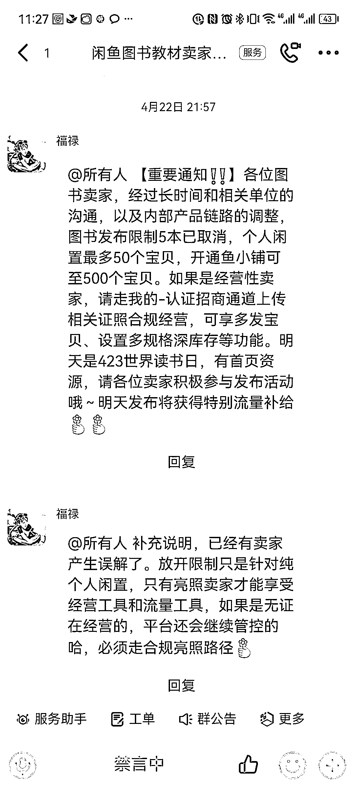
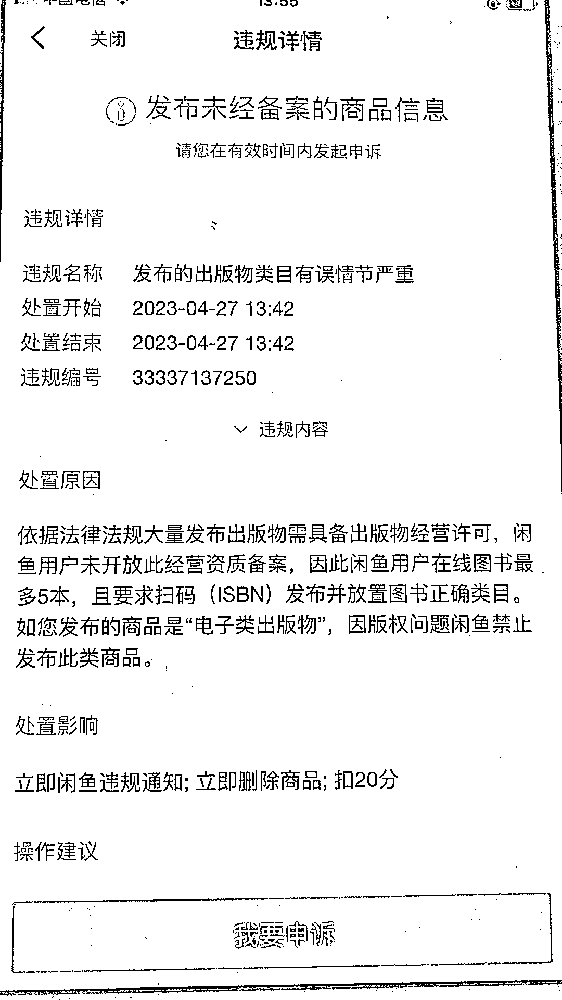

# 《闲鱼二手书航海，办理《出版物许可证》

> 原文：[`www.yuque.com/for_lazy/thfiu8/xz6564x7ynh7yntc`](https://www.yuque.com/for_lazy/thfiu8/xz6564x7ynh7yntc)

## (精华帖)(304 赞)《闲鱼二手书航海，办理《出版物许可证》 

作者： 老瞿 Qu 

日期：2023-05-09 

大家好，我是老瞿 Qu，致力于成为生财有术最懂二手书的男人， 

很荣幸被邀请成为生财 5 月份闲鱼二手书航海的教练， 

因为做闲鱼二手书项目有一个门槛，就是需要一个出版物许可证， 

首先我们应该用庆幸的心态去看这个问题， 

这是一个信息爆炸的时代，万物皆卷，当然有门槛的项目有一天也会卷，但有张证，始终会卷的好一些。 

针对出版物许可证大家可能遇到的问题，进行一个解答： 

### 1、是不是一定要办理出版物许可证？ 

为什么大家会有这个疑惑，是因为闲鱼官方 4 月 22 日在群里发了一条通知： 

 

所以很多人觉得是不是可以无证经营， 

但根据实操测试的结果来看，没有证违规的概率极高，很容易封号， 

扣 20 分就意味着商品全部下架，然后 7 天不得发布商品，多次违规就直接封号了。 

所以建议是办证，这是一个相对长期的项目，尤其你准备长期去经营的时候，可以办理一个证。 

 

### 2、为什么有些人没证也能发布图书，还卖的挺好的？ 

根据目前官方口径和实测结果，没证基本上很难存活， 

但闲鱼作为一个月活上亿用户的平台，每个人都可以发布商品成为商家， 

你看到的大概率是幸存者效应，就是 100 个人无证发布图书，99 个已经被封了， 

被封了你就看不到了，剩下 1 个被你看到了，所以我们真的不需要羡慕别人的运气。 

### 3、线下办理出版物许可证靠谱吗？ 

线下办理毫无疑问是最靠谱的，但是线下办理很难， 

办理个体户的营业执照比较简单，有个商业地址就行， 

但是出版物许可证对商铺的面积、消防都有一定的要求，而且大的城市有些都已经不办理了。 

这就导致线下办理周期特别长，费用基本上大几千，而且你如果用别人的地址，可能一年还要再给好几千。 

所以不推荐线下办理，有很多人试过，最后基本都放弃了。 

### 4、找代办公司办理靠谱吗？ 

根据目前了解，代办公司主要是靠一些政策的漏洞， 

或者他们在一些偏远的地区有关系去办理的，一般刚开始办的时候，都没有什么问题， 

但是后续可能地址被注销，出现地址异常的问题。 

我第一个证在淘宝办理的，2500，现在已经地址异常了， 

而且那家淘宝店已经关了，目前微信也联系不上了，基本上是跑路了，但闲鱼店铺目前正常运营。 

据了解，并没有什么海南不靠谱，江西靠谱的说法， 

我的第一个证就是山西的，一般代办公司会选择一个地址，一个比较偏远的地方， 

一旦出版物一个大范围地址的其中一家被投诉了， 

就有可能会牵连大范围地址的其他商户，就会被工商局整体调查，然后被批量注销。 

所以，市面上任何一个代办公司给你的保证都是不靠谱的，就看运气，有没有被投诉，有没有引起更高层面的关注。 

### 5、代办有风险，那要怎么办？ 

首先要承认代办这个行业就是擦边球，然后你线下也办理不了，你又想赚钱，所以还是得找代办公司办理。 

其次好的地方是：哪怕地址异常了，其实对你这个闲鱼店铺的正常运营，没有什么影响， 

闲鱼目前对这块的审核基本上等于没有，有证就行。在我看来，先不要纠结，赚自己能赚到的钱，遇到问题解决问题。 

也可以有个小建议，就是找一家相对稳定的和靠谱的或者身边朋友办过的，他们承诺售后问题的， 

你证出问题了，最坏的结果就是你付点年审的费用大概 300 元，他们给你重新办理一个，在不影响你闲鱼店铺经营的情况下给替换了。 

当然这种包售后的价格肯定会高一点的，毕竟大家都是为了赚钱，所以那种淘宝价格极低的，跑路的风险就越大。 

目前相对合理的市场价格在 1000-1500 左右，太高没有意义，承诺太多都是空的，太低的肯定是坑。 

所以在你没有更好的选择的时候，接受一个特殊行业的存在， 

然后不要为这些太过烦心，遇到问题解决问题， 

把精力都花在最核心的问题上：赚钱，不能因为这个就不赚钱了，对吧？ 

风险提示：不要用办的营业执照开【微信收款码】，可能会存在风险。 

### 6、办理营业执照上面的经营范围有没有什么要求？ 

有图书销售就可以，不同的地方叫法可能有点小差别， 

这个不用太担心，因为执照没有这个经营范围，出版物是办理不下来的，这个代办公司是都知道的。 

### 7、办理个体户好，还是办理企业好？ 

对于闲鱼卖书来说，都可以。 

但个人建议是办理个体户即可，因为企业还会涉及到报税，正常报税一年还要 1-2K 的费用， 

以及后期证照出现异常时候的注销，企业肯定比个体户麻烦很多。 

之前市面上的代办公司都是推荐大家办理个体户的， 

近期有部分代办公司推荐办理个独，下证快，不过为了长期考虑，个人还是建议办理个体户。 

### 8、自己有个体户或者企业可以直接办理出版物许可证吗？ 

按道理说是可以的，但是个体户或企业营业执照上面的地址要跟出版物许可证的一致， 

你个体户或者企业上面的地址代办公司搞不定，就需要让你变更地址什么的，挺烦的，而且费用一般也不低。 

建议是直接一套找代办办理就好，更加高效。 

### 9、证照办理的时候名称随机可以吗？ 

可以，因为中国人还是比较多的，基本上你想半天名称，最后都被人用过了，工商那边过不了的， 

所以系统随机的名称通过概率大很多。同时证照名称后期没啥用，因为你闲鱼店铺的名称也不需要跟这个挂钩。 

### 10、证照需要年审吗？ 

需要，一般是第二年开始需要年审， 

这个也建议找你的代办公司帮你解决，一般就 200-300 左右吧，可能根据市场会有点浮动。 

### 11、如何验证证照的真伪？ 

一般刚办出来的证都没啥问题，闲鱼都能审核通过的，出问题是后期。 

个体户营业执照你在企查查、国家企业信用信息公示系统都能查到，出版物的话只有在当地的政府网站才能查到。 

一般代办公司会给你一个网址，你可以上去看看，也可以直接让闲鱼给你审核， 

在闲鱼 APP-我的-认证招商直接上传，上传的时候就需要你填写验证网址的。 

如果刚办出来的证，闲鱼上传的时候查不到信息可以等 1-2 天， 

目前市面上有 2 种证，一种是很快出证的，基本上没有经过公示，你查不到，需要等 1-2 天； 

另外一种是办证周期在 1 周以上的证，都经过公示了，拿到电子版就可以去审核了。 

办证的时间，根据当下的政策监管以及出证地区会有些差异，一般在 1 天到 2 周左右。 

### 12、出版物许可证会过期吗？ 

个体户营业执照是长期的，出版物许可证目前市面上有 2 年到期的，有 5 年到期的，都可以。 

### 13、代办出版物许可证地址异常后，对自己征信有没有影响？ 

万一证照经营地址异常后，找代办公司，如果代办公司跑路了可以找其他代办公司，看看能不能解决， 

如果不能建议在异常后 1 年左右注销了，因为当地的工商局会可能会联系你，警告你不处理会上征信， 

不用太害怕，他们也是工作需要，为了安全起见，建议找代办注销掉，重新办理即可，目前个人有十几张证，还没有遇到信用问题。 

最后如果下决定做这个项目，建议早点办证， 

因为办证的过程中还可能遇到这个地方突然不给下证了，要换地方的情况，这样周期就会比较长，所以早点开始办。 

预祝大家在闲鱼二手书的航海中，都取得不错的成绩，只要用心去做，一般 1-7 天都能出单。 

另外本人不做代办相关的业务，这里只是一个经验分享，建议大家多对比几家，综合进行选择。 

大概能想到的就这么多，大家如果还有其他问题，评论区留言，知无不言。 

评论区： 

墨鱼 : 老师您好，出版物许可证和营业执照是都要办理吗？还是只办理一个就可以[呲牙] 老瞿 Qu : 没有营业执照是办理不了出版物，一套 芝士味小饼干 : 感谢老师的分享，前两天无意间发现老师小地瓜上的教程，赶紧先把证给办了。期待 5 月的大航海💪 墨鱼 : 好的好的，明白啦，感谢 康毅 : 瞿老师我提四个问题 1 像您讲第一个店铺地址异常的话，咸鱼是立刻就会把执照对应的店铺封掉吗？也就是这个执照对应的 3 个店都会挂的意思？2 我感觉大家都从孔夫子淘宝做价差的话，这个利润会越来越薄，不知道这么理解对不对 3 我看您之前帖子是有从大学毕业季收书，也有自建仓库，这两种模式您后续会怎么精力分配规划的，4 我看到有些图书馆会定期清库存，您会从这些渠道拿书吗？我看您也有提到一吨 2000 到 5000 块这样？🙏谢谢啦！ 老瞿 Qu : 1、文章再看一遍，目前闲鱼管的很松，没有影响； 2、二手书基本上走孔夫子和淘宝，大概率不会有仓库会同意给你对接货源，因为种类太多了，太烦，对接效率太低，你自己也赚不到钱； 3、实体很累，资金投入很大，操心的事情太多，不建议做实体，我目前仓库基本上已经给合伙人在管理了，未来会全面转无货源； 4、一般都是从大学生手里直接收的多，图书馆需要看他们清掉的是什么书，具体看。 威曹 : 老师您好，想问下那个官方群怎么进去，我有店铺已经认证好了，但是找不到哪里可以进群 老瞿 Qu : 钉钉搜一下群号，有时候能进有时候不能，群常年禁言，没啥东西