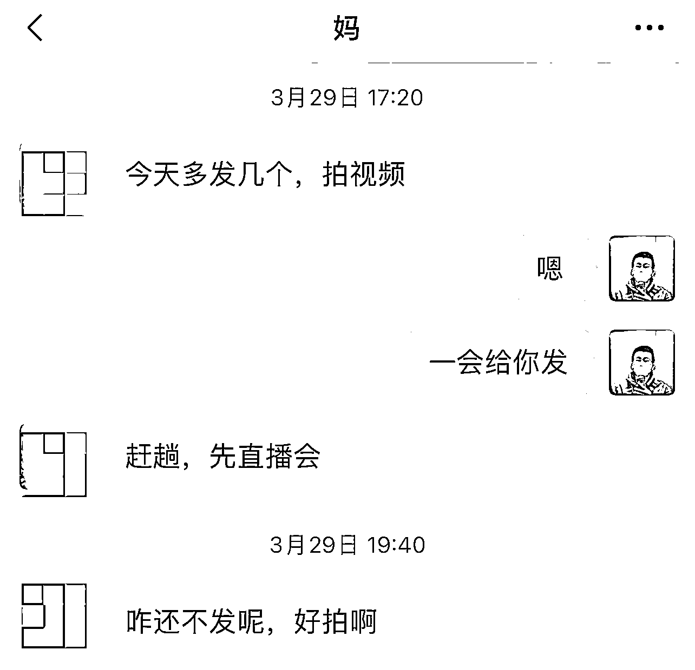
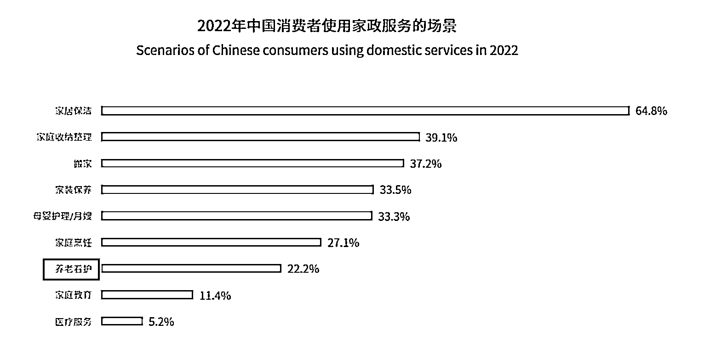

# 《高利润的中老年知识付费赛道，普通人入局都能做什么？》

> 原文：[`www.yuque.com/for_lazy/thfiu8/hlu2kstgdwxsgf5e`](https://www.yuque.com/for_lazy/thfiu8/hlu2kstgdwxsgf5e)

## (116 赞)《高利润的中老年知识付费赛道，普通人入局都能做什么？》 

作者： 渔火 

日期：2023-04-17 

近两年，中老年市场垂直方向的知识付费迎来了很大机会。 

比如之前圈友分享过的中老年唱谱课，通过在直播间用带唱简谱的方式完成变现，如果你不会音乐专业技能也没关系，还可以做其他类目比如书法、国画等。 

我自 2019 年开始，基本上都是针对中老年做知识付费的项目，两年期间在不花费很大的精力下，数据和营收都增长了很多，还拓展了不少中老年类目的知识付费和电商，也因此对中老年知识付费赛道有不少的感悟。 

接下来我按这四个板块和大家聊一聊，普通人做银发赛道的高客单知识付费，有哪些新的流量渠道和发展机会。 

一、为什么做中老年赛道？ 

二、中老年人群的消费习惯？ 

三、中老年市场近两年的变化？ 

四、2023，中老年赛道对于普通人的机会有多大？ 

大家好，我是渔火，一名在路上的创业者。 

很久没分享了，先说下近况，2021 年我作为联合创始人的项目，获得了真格基金领投的千万投资，自己作为创始人的中老年项目是 2019 年开始做的。 

最近有很多生财的铁子问我关于中老年赛道的问题，由于我和这帮银发大爷大娘的爱恨情仇羁绊了四五年，曾让 83 岁老大爷为我付费，还算有些心得，而且也真的觉得这是一群很可爱的人，用心提供价值和服务就会有回报的一群人！ 

 

（口罩期间班级群里相互关心） 

所以我今天主要分享的是 2023 年中老年赛道的一些机会，以及简述一下我见到的这两年中老年赛道的发展和变化（今天主要聊银发赛道的知识付费，其他类目改天分享） 

 

先说一下 2019 年我为什么搞银发赛道，当时找细分赛道的时候，先聊我当时的底层逻辑吧，我觉得这是搞钱最关键的，拿知识付费来说，我当时先粗略的看了下整体的发展路径。 

成人领域从早期的知乎时代-罗辑思维付费会员-樊登听书-付费问答-订阅课程-各种课堂专区分区圈子等，在对应到同期教培行业的发展，线下、线上课、一对一、大班课、小班课、社群、AI 课、训练营、行动营等等 

大概能感受到整个行业的发展路径是随着用户习惯和认识逐渐觉醒来发展的，对吧。 

当时 K12 大厂打架有多狠大家都知道，我一个普通人，得选个好做的赛道啊，对标了下银发赛道，你就知道银发赛道的知识付费有多初级了，这不就是原始阶段嘛。 

能预判的是，随着时间的发展，形态和内容肯定会越发的丰富，妥妥的机会呀，毕竟人年龄大了后更有钱和时间来为自己的兴趣买单！ 

光是兴趣生活类，琴棋书画、诗词歌赋、针灸养生、摄影朗诵、茶文化、手机技巧、花艺园艺等等调研下来发现都有一些小团队在闷声赚大钱，然后果断开始入局的，一直到现在。 

对了，再分享个数据，国家统计局公布 2022 年末 60 岁及以上人口接近 3 亿人，占全国人口的 19.8%，那么如果是 45 岁以上的人群有多少，可想而知！ 

 

今年，我能明显感觉到，大家对于银发赛道的关注度和进场的人数明显多了很多，发现很多铁子确实不太了解这波人，所以我先来和大家聊聊，这个人群的行为习惯。 

我这几个月曾蹲了下各平台银发赛道评论区的热词，我发现经常会出现的，“老年人没有网购习惯”“银发人群手机都玩不明白”“我开过养老院赔了”等等，看完我深度意识到很多人是完全不理解这波人群的行为和消费习惯。 

按理说都市银发是抖音八大人群之一，我之前以为很多人会很了解，小镇银发确实不好做，但是都市银发可是妥妥的有钱有闲的人呀。 

我自己的项目，我对有效用户的定义是一二三线城市的 40-75 岁人群，都是我的获客范围之内，而且效果也确实不错。 

觉得中老年人玩不明白手机？移动互联网都发展多少年了，我们山沟沟现在都有 wifi 了，我给你们看看我的母亲，1968 年生人，我帮她做了个视频号，一个月都已经一万六的粉丝了。 

 

（我妈每天催我给她脚本） 

 

（我妈做了一个月的视频号） 

每天直播加橱窗能卖个八百一千的货，我妈用的手机是红米手机，现在也是红米，前两年手机都玩不溜的人，大家不要小看中老年的学习能力，换句话说，不要小瞧五环外人群 

你以为中老年买东西都买便宜的？我给大家分享个我的数据，我的客单价是一门课 500-2000 不等，我的用户平均复购 3 门课以上，这是课程类的，随之的消耗品，书画类用户，每年要消费 2000 左右在笔墨纸砚和印章上。 

如果是艾灸方向涉及健康的，客单价更高，很多中老年退休后，有的跟着孩子在国外生活，有的在大城市照顾孙子，有的回到了老家，但是这并不妨碍他们追求自己的兴趣和生活 

 

（给大家截几个私域的用户） 

一句话总结就是，现在的都市银发，手机可以玩得溜，有钱，有时间、爱分享，对服务更关注、对线上付费逐渐适应并习惯 

 

拿我自己的赛道和我自己的经历，我把这几年大概分为三个阶段（知识付费为主的赛道，篇幅问题，今天不谈硬件、APP、电商等类目的） 

2008-2015 混萌芽期，这个阶段很多人都不知道怎么做银发赛道，这几年大部分的是做流量的平台，后期变现也表现不好，糖豆广场舞等垂直 APP 在那几年获取了大量的流量。 

2015-2019 野蛮生长期，这个阶段，出现了一些垂直的平台，比如美篇等社交平台、墨客、墨池、快乐 50 等垂直领域的机构、养老家政、健康睡眠等项目兴起、线下的老年大学（报名名额抢都抢不到）、音乐相册、天气软件等工具类产品，得到了快速的发展，吃到了一波红利。 

2020-2023 飞速增长期，这个阶段，大厂开始入场，先是红松短期内拿到了两笔由蓝驰、经纬等机构数千万美元的投资，知乎合伙人出来做的老年项目、尚德教育、大鹏教育（如今倒闭了，噫吁嚱）、高途等等都开始做银发赛道的知识付费我自己深有体会，中老年知识付费，2015 年到 2018 年，绝对是野蛮生长的几年。 

分享个数据，这几年最开始走最简单的公众号投放，完全不需要任何投放技巧和文章的转化技巧，书法课、国画课的 ROI 可以做到 20，而且复购率超高，什么概念，一个月投放花 5 万，能卖 100 万，而且客单价可以轻松拉到 2000。 

主要是用户巨便宜，当时我平均一个进群用户的成本在 5 元左右，注意，是垂直的兴趣粉，不是泛流量。 

而同期，是幼儿教育赛道和 K12 神仙打架的几年，当时优质的母婴流量从几十一个快速攀升到一两百我当时这个项目整个的启动资金，仅仅是小鹅通的平台费 + 找老师录制的体验课费用（最开始卖期货，有体验课和长期课大纲就开始卖）+ 第一个月的投放费用，整体成本不超过 5 万，就滚到了第一年营收两百多万。 

我总结这一切得益于我前面几年做幼儿赛道的经验，可以说如果做过 K12 或者幼儿教育，进到老年赛道，那些做课方法、服务方式和营销手段简直是降维打击。 

最近两年，随着大厂进场来普及用户认知，更多的垂直方向的知识付费都迎来了更大的机会。 

 

咱们不能说一提到银发赛道，能做的项目就都是开个养老院、弄点高毛利的保健品、走步送鸡蛋、针灸广场舞等。 

现在的银发族可不像前几年了，移动互联网都发展多少年了，现在大部分赛道都可以银发人群重做一遍的，银发族的社交、健康、衣食住行、兴趣爱好、线上工具等，很多维度都蕴含着很大的机会。 

随便举几个最近比较火的例子：老年 Keep、老红书、老年家政、老年睡眠、老年文娱、营业健康管理，正确带孙子的课程等等等等，太多了，说不完！ 

从我的角度，个人觉有几点原因 

（1）流量侧：更多元的触达用户的形式，视频号等中老年居多的短视频平台，还有类似美篇这种垂直平台的兴起，带来了更多的机会 

（2) 用户侧：大公司进场，用户认知和习惯逐渐培养起来，还有就是中老年对于服务的感知和认可，超过品牌加持。 

哪怕你是大公司的课程，我服务做的好，我课程更贴近用户需求，一样可以卖的很好，在中老年眼里，这些大公司和你没区别，并且现在的都市银发，已经能很熟练的下载 APP、转发评论、小程序打开、各种支付玩的很溜。 

（3）产品侧：现在中老年赛道的产品很匮乏，你在其他赛道做到 120 分才能有机会，可能在这个赛道做到 60 分就有点机会了，毕竟见过曾经的音乐相册软件和天气软件几个月可以获取几百万的流量。 

不过需要注意的是，流量获取阵地和产品形态要选好，说句实话，我测过很多主流渠道，有用户之后，测试过很多种形态的打法。 

测试下来，基本上微信体系内和视频号是路径最顺的抖音和线下也还可以（这里不包含银发电商玩法） 

 

（某班级群作业圈，虽然是大字手机，但是也超爱分享） 

对于我们普通人，个体来说，无论是搞流量还是做课程，都是机会超级大，如果你没有产品技术能力的话，我更推荐个体去做课，是真的香。 

我现在已经在从生活和兴趣的两个大维度上，大范围的做轻课去测试了，可能有的铁子会觉得这需要一些专业技能。 

其实说实话，我最开始是完全不懂书法国画的人，我仅仅是懂用户和流量，课程我找对应专业的人录制，老师出完大纲，我结合用户需求修改审核，甚至很多方向，你找个大学生，极低的成本就能给你出来很多专业的课程 

今天拿我最近做的一款电子琴课程来举个例子吧。 

之前有铁子和我说，一听电子琴，还是老年人学电子琴觉得好小众啊，能有人买单吗？ 

我来告诉你，音乐方向的课在银发知识付费里的是一个不小的市场，目前已经有很多规模不小的公司在做了，比如快乐 50，红松学堂等，而且客单很高。 

首先挖掘细分需求这个这里不做过多赘述，可以看我之前在生财分享的一篇文章，[https://articles.zsxq.com/id_pt1urnv5g4ah.html](https://articles.zsxq.com/id_pt1urnv5g4ah.html) 

挖掘好需求之后，我需要快速做 mvp 验证，这里我要解决的是流量和产品的问题，因为变现就是靠售卖课程对吧，那么我开始思考流量。 

于是我用视频号测了下，老年人音乐的几个方向，比如老歌混剪、乐谱、唱谱、乐器等，测了一圈，发现引流效果还不错，流量的问题前期基本上可以按这个跑了。 

产品这里是我要重点说的，做银发赛道的知识付费，最重要的是了解用户，不同的课程大纲，售卖结果可能天壤之别。 

我累计和不少于几千名用户深度沟通过，比如最开始我追求详情页设计优美、小鹅通装修美观、海报精致等，后来发现这帮人根本不在乎这个。 

他们报名课程最看重的是体验课的内容、老师的水平是否让他们认可、服务是否让他们满意，以及未来长期课是否能下载、永久回看等。 

甚至有几次我做 AB 测试，一个淘宝找人花了 1000 设计的详情页，居然没打过我用懒设计 10 分钟搞的一个绿背景，一堆大字堆叠的长图。 

（相对品牌，很多用户更在乎能下载和时效） 

 

所以，切记不需要产品多么华丽，你只要多和你的用户沟通，了解需求，定好课程形式，是需要录播 + 直播，还是全直播、全录播，然后定价，售卖，就完事了 

大体的思路没问题，剩下的就是执行过程中不断优化和调整了 

除了常规的知识付费类目外，在举几个我最近见到的一些团队在做的例子,也是我最近深度调研的方向 

①　老年家政 

大家都知道家政市场很大，这几年发展也很好，咱们的圈友也有做的很优秀的，目前由于老年家政主要是子女给父母下单的，服务内容比如：打扫卫生、做营养餐、测血糖、擦湿疹药膏、陪同散步聊天、陪同看病煎药等 

 

打法等同云家政的模式，只不过获客模式和方向上有所差别，大家可以看看天鹅到家上关于老人的服务已经订单量很多了，只不过服务项还有些单一 

②　中老年睡眠 

前段看数据的时候，从国民睡眠健康白皮书我看到 40 岁以上的人群睡眠问题已经很大了，而且逐渐严重. 

然后我去了解了下数字睡眠这个市场，已经有很多公司在做了，比如好睡眠、享睡等各种各样的 APP，还有一些和音乐助眠结合的白噪音产品等等。 

总之睡眠问题是个复杂问题，原因很多元 

 

作为普通人，我想切入的可能有三个方向，一个是偏教程类，超低价的课程来教大家怎么使用市面上各种各样的助眠产品。 

第二个可能是从心理、情绪方向疏导的课程。 

第三个可能是身体健康管理方向的课程，比如请专业的营养师规划一些晚餐或者晚上该怎么运动改善睡眠的课程等等 

③　中老年旅游 

这个通过数据的时候看到的，中老年旅游市场增速也很猛烈。 

那么年轻人经常会做旅游攻略，而中老年经常怕被骗，我妈就是一提旅游就怕被宰。 

那么作为普通人，是否可以通过做为中老年各种各样的定制的旅行攻略，来收取一点点服务费呢？ 

同时给靠谱的旅行社引流是否可以赚到佣金呢？而流量端，视频号里旅游类和风景类的视频有多火，相信你去看看就知道了 

④　中老年电商 

中来年电商这块相信不用说大家也知道，咱们星球不少书友都做的很好，还有卖图书的书单号等等 

和几个在做的团队聊过，目前他们卖的最好的是女装和鞋，尤其是鞋，利润率很高，这块就不做过多分享了，有相关资源的朋友可以考虑 

④　中老年宠物 

宠物赛道这两年发展很快，我觉得幼儿赛道一般有的，都可以在宠物赛道做一遍，之前看的报告，全中国每年新生儿 1000 万左右，宠物猫五千万，宠物狗也三千万左右了 

我调研下来，养狗人平均年龄基本上比养猫人的平均年龄大 10 岁，养狗人的平均年龄在 37 岁左右，发现了么，是不是平均年龄已经靠近中老年了，那么可想而知，中老年养宠物的人应该很多，其中我觉得应该养狗的更多。 

那么是不是宠物赛道的打法可以试试了，我给我妈做的就是宠物账号，毕竟我妈是 1968 年生人，她自己出来讲，公信力更强，目前做了一个月是一万七的粉丝 

（上面是一万六，这里是一万七，因为本文写作期间，涨了 1000 粉） 

商品橱窗加上直播（我妈直播纯聊天，没有任何技巧，我妈在老家）每天能卖 800-1000 宠物用品，佣金是 30% 左右，每天私信的人很多，几乎都是问各种各样养宠问题的，其实你百度就有，不过他们不会，也没这个习惯。 

这里面我觉得需求和想象空间很大，下一步我的策略可能不会让妈直播卖货了。 

毕竟直播需要直播能力，我妈学起来困难，可能走直播引流，到私域后售卖产品在扩展一下，如果你接入 AI 是不是能实现个性化的问答，“中老年的私人宠物医生”，是否能出针对中老年关于养宠经验的课程等等，篇幅问题这里也不展开了 

今天分享的均是我站在我的角度的思考，可能有的对有的不对，希望能对你有启发 

2023 年普通人在中老年赛道的机会就分享到这里啦～有问题评论区留言互动～ 

评论区： 

Ray♻️💥 : 我女朋友学音乐的，想教他做个人 IP😂 渔火 : 有个人技能做中老年赛道更容易 控心 : 是不是要有个人技能才好做 渔火 : 不用吧，懂用户就行，我没啥技能 阿顾 : 干货满满 受教了  感谢大佬分享 Jia : 干货很多，学习了 Jia : 主要你也有输出产品的资源 渔火 : 你没仔细看应该，比如最近电子琴和宠物方向的课是找的对应专业的大学生录的