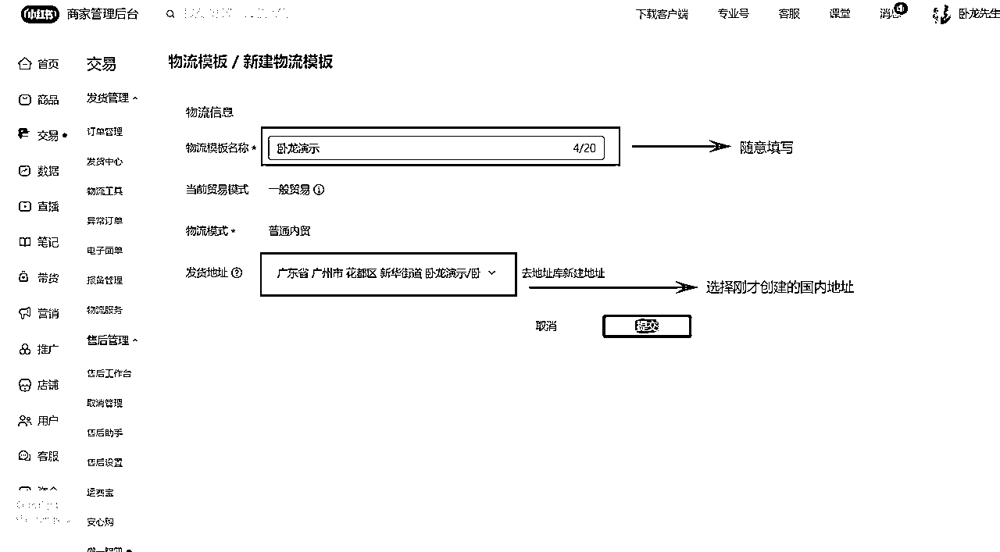

# 我是如何通过小红书无货源电商三个月营收 50w 的？（只讲实操，没有废话）

> 来源：[https://retjc9p6wl.feishu.cn/docx/AVx7dEXmpoRJazx3nH8cceBOnhd](https://retjc9p6wl.feishu.cn/docx/AVx7dEXmpoRJazx3nH8cceBOnhd)

# 前言

各位圈友大家好，我是卧龙，一个 00 后网创博主，今天就来拆解我是如何在三个月时间里通过小红书店铺变现 50w+。

小红书无货源电商，与传统的无货源电商模式都是一样的，无非就是换一个平台，至于为什么是小红书，原因很简单，因为其他平台体系已经完善，各种类目的商家非常多很，太卷了，但是小红书不一样，小红书是公认用户质量最高地平台，且电商体系目前还处于三缺状态：缺商家！ 缺产品！ 缺深度服务！

卧龙是今年一月份接触到小红书无货源电商的，期间找过很多优秀的同行付费请教学习过，通过不断实战总结优化迭代，形成了自己的一套方法论。

（目前店铺不爆单的情况下每天的销售额稳定在 5000-8000）

▼

今天卧龙就从基础-选品-货源-内容-流量-私域，这几个维度全方位的拆解小红书无货源电商这个项目。

本文目录：

# 一、基础篇

## 1.1 资金门槛

资金投入为保证金+垫付资金+软件费用。

### 1.1.1 保证金：

大部分类目都是 1000 元的店铺保证金，店铺入驻后无需缴纳保证金，即可发布商品上架售卖。

如果该店铺累计交易额超过 1 万元后，下个月月初才需要补缴保证金，真正实现“无门槛”开店；

### 1.1.2 垫付资金：

出单垫付资金，看产品的成本，例如：每单成本 20 元，出 100 单需要垫付 2000，回款周期是 7～15 天；

### 1.1.3 工具费用：

每个月不超 60 元 -200 的软件费用，做电商避免不了一些采集、拍单、选品等工具。

单个店铺除此之外没有其他费用，总计：保证金（1000 元）+垫付资金（2000 元 -3000 元）+软件费用（60 元 -200 元）=总计约 3000-4000 元即可操作此项目。

## 1.2 开店

店铺分为三种，个人店、个体店、企业店、旗舰店、专卖店，初期我们选择个人店即可，一个身份证只能开一个店，后续放大可以让亲朋好友开，或者是开个体店。

### 1.2.1 个人店开通流程：

手机端：打开小红书主页➟左上角三条杠➟选择创作者服务中心➟更多服务➟开店➟个人店➟普通商品➟填写身份信息。

电脑端：访问下面链接↓即可，流程与手机端无异：

注意：如果店铺名称重复者是无法开店的（店铺名称就是账号名称），申请开店之前可以去搜索一下，看看有没有重复的。

### 1.2.2 五种店铺的区别：

没有特殊类目或者需求我们选择个人店或者个体店即可，两者区别不大。官方说明文档：

部分类目可售卖的店铺类型有限，如个人店可售，卖类目相较个体、企业等范围会更小些。

具体各店铺类型已开放类目可前往下方链接↓查看小红书经营大类一览表：

## 1.3 后台配置

所有后台配置都会在电脑端的小红书商家后台演示，可以直接搜索“小红书商家后台”进入，或者点击下方链接↓：

### 1.3.1 信息公示：

信息公示必须配置，否则上架不了商品。

打开商家管理后台➟店铺➟信息公示➟填写相关信息➟最后四个类型全部勾上➟保存

### 1.3.2 运费宝：

运费宝就是运费险，卧龙建议还是开通，可以极大提高转化率，不过每单官方会收取 0.59 元的保险费。

打开商家管理后台➟交易➟运费宝➟开通全店服务

### 1.3.3 物流配置：

退货配置：相信大部分圈友都是做的无货源，但是小红书有七天无理由，用户申请退货退款平台会自动同意，所以我们要配置好退货地址，把地址设置在“港澳台”，然后在详细地址栏中引导用户联系客服。

打开商家管理后台➟交易➟物流工具➟新建地址➟填写相关信息➟然后保存即可。

物流模板配置：物流模板需要国内的地址才能配置，所以我们需要再新建一个国内的地址，然后配置上物流模板。

打开商家管理后台➟交易➟物流工具➟新建一个国内地址➟保存➟物流模板➟新建模板➟选择刚才创建的国内地址➟提交

### 1.3.4 资金配置：

需要绑定银行卡以及开通微信收款账户，如果不开通的话用户购买没有微信支付的选项，支付宝开不开通都不影响用户使用支付宝支付。（注：开通收款账户需缴纳保证金）

打开商家管理后台➟资金➟货款资金➟根据要求填写信息绑定银行卡以及开通微信收款账户

### 1.3.5 客服配置：

官方有两种模式，自主客服与代运营客服，新店默认是自主客服（就是自己回复用户消息），代运营客服顾名思义就是让官方给你回复消息，但是官方是收费的，初期我们可以自主回复不考虑代运营，因为不划算，就算爆单一个人也是回复得过来的。

我们只需要配置一下欢迎语、关键词自动回复、商品卡助手即可，具体配置的话术可以参考同类目的同行。

打开商家管理后台➟客服➟智能客服➟欢迎语➟关键词➟商品卡

建议下载手机端与电脑端的商家管理后台 app，这样方便回复用户咨询，手机端再应用商店搜索“小红书商家版”即可下载，电脑端访问商家后台右上角有“下载客户端”。

注意：机器人自动回复后，不算完成会话，必须人工在回复一条消息（文字表情都可以）！

## 1.4 商品上架

上架有两种，一种是直接复制第三方平台的素材以及标题等信息手动上传，一种是用软件一键采集自动上传，卧龙这里建议直接用软件，比较方便。（注：软件 29 元每月）

打开商家管理后台➟服务➟服务市场➟搜索”摸鱼铺货助手“一个国内地址➟设置运费模板、物流模板、发货时间、价格➟复制想要上传的商品链接，然后上传即可。

上传好了之后，并不会直接上架到小红书店铺，我们还需要在商品⇢商品列表里手动上传，上传之前可以先检查一下商品信息，看看有没有问题，没问题直接上传即可。

注：图片、详情页、标题都不能带水印、品牌 logo、极限词等，如有上传失败的根据失败说明重新修改即可。

# 二、选品篇

选品其实没有那么难，卧龙的选品流程就是先确定要做的赛道，然后在各大电商平台找爆款，然后去小红书看同行的销售数据以及笔记的数据，从而判断这个品值不值得做。

## 2.1 赛道选择：

赛道呢咱们就尽可能的选择需求大且竞争相对少的赛道，可以通过千瓜数据这个平台进行分析。

首先打开千瓜数据，点击行业流量大盘，主要就是看笔记总数以及互动总数这两个数据，笔记越多就证明这个赛道越卷，互动越多就证明用户对这类笔记的认可度高，越容易产出爆文，也说明关注这个类目的用户多，市场需求量大。

我们要做的就是把每一个赛道的数据收集下来，然后算出笔记数和互动总量的比例，做成一个表格，这样每一个赛道的数据一目了然，比例值越小，说明笔记数量相对较少，互动总量相对较多，这种就是我们要找的蓝海赛道。

千瓜数据平台：

## 2.2 产品选择：

### 2.2.1 同行选品法：

俗话说的好同行说最好的老师，看同行近期哪些品卖得好，那么这个品你去做大概率也是没问题的。

直接在小红书搜索关键词即可，例如鞋架：

筛选出销量高且是个人店铺的品，同行卖得好，那么这个品大概率可以做。

### 2.2.2 电商爆款选品法：

通过各大电商平台找爆款，拼多多、淘宝、抖店等等都可以，卧龙这里以淘宝举例。

淘宝首页➟右上角选择你看中的类目➟选择排行榜➟选择类目

尽可能的符合以下标准：

符合小红书人群、素材干净（方便搬运）、高颜值、高复购、高利润。

如果你不知道如何判断，还有个更简单的方法我们在各大电商平台筛选出爆款之后，可以去小红书找一下同款产品，看一下同行销量，如果销量有个 500 以上那么就证明这个品可以做。（注：要找个人店）

### 2.2.3 热度词选品法：

通过巨量算数、5188 等免费工具、禅小红等找自己类目下产品的热度词，卧龙这里以禅小红举例：

打开禅小红官网，点击左上角“热搜词”，选择你所在的类目即可

根据这些热度词，再去小红书搜索，找出销量高且是个人店的产品。

禅小红入口：

## 2.3 货源选择：

货源无非就是那几个平台，拼多多、阿里巴巴、义乌等等。

选好品之后，用以图搜品的功能在拼多多阿里巴巴等，找到同款产品，然后对比价格找最低的即可。

然后拼多多的话有两个问题，就是快递面单以及拼多多短信。

不过也很好解决，直接加商家微信，走私单，不走平台即可，正常情况下商家都会同意，毕竟多一个销售渠道就多赚一份钱，走平台的话也可以将收货人手机号改为自己的，然后备注让快递到了打买家的电话。

判断这个商家的选品是否可以作为我们货源的标准：

*   销量：1000 以上就可以。（部分新店，几十，几百也可以）

*   好评：近期动态查看，10 个里面 7 个以上好评就算不错。

*   利润：前期保证有利润就可以进行选择，后期单量上来之后可以跟商家谈价，或者是找更优质的渠道。

*   商家产品数：少于 100 个产品，一般正规商家都是几个产品，或者几十个产品，几千几万，很容易遇到也是做无货源的商家。

# 三、内容篇

小红书的笔记是由素材、文案、标题封面助成的，接下来卧龙会围绕这几个点，讲解如何制作出爆款笔记。

## 3.1 素材

素材的来源有四个渠道：电商平台、短视频平台、站内搬运、自己拍摄。

电商平台：

通过以图搜品的功能，找到同款产品，然后在主图/视频、详情页、评论区，找素材。

短视频平台：

短视频也是同样用以图搜品这个功能，找到同款产品的素材之后，用去水印工具下载下来。

自己拍摄：

前期的话建议直接搬运，后续出单之后可以考虑买个样品自己拍摄，拍摄场景可以参考对标账号。

### 3.1.1 素材要求：

*   素材不要找有 logo 或者水印的，通过电商平台不要找天猫、旗舰店、品牌店等，这些店铺版权意识极强，如果内容爆了，有可能会被起诉，这些尽可能地规避掉。

*   挑选构图美观画质清晰的图片/视频。（注意不要挑选到人脸完全露出或可看到一大半人脸的图片，以免造成侵权，明星混剪除外）

### 3.1.2 素材处理：

*   主题突出，画面干净，色彩和谐。

*   强调笔记看点，突出商品卖点和优势，提升转化。

*   抖音/快手的行业素材。（此类素材一定要进行二创去重，例：裁剪、加水印、加特效、加滤镜等）

图片处理，这里卧龙推荐用美图秀秀，美图设计室（可一键变清晰）、醒图、黄油相机这些 APP 也可以。

## 3.2 文案：

收集同行互动高的笔记，不看阅读与点赞，只要评论区有很多用户想买，都在问：“怎么买”、“什么价”、“求链接”，多收集这类的文案，然后进行洗稿，先抄后超。

我们做内容带货，终极目标不是为了出爆款，而是为了精准客户，不要把两者划等号，那些爆款如果带来不了精准流量，是完全没有任何意义的数字

种草带货笔记的文案其实不用写太多，你写得越详细，越有营销味道，用户反而越不买单，主打的就是要真情实感，用精准的文案去吸引精准的用户，可以看一下以下几个案例：

也可以使用一些工具，例如最近很火的 chatGPT，还有国内一些基于 chatGPT 开发的小红书种草笔记写作工具。（通过搜索引擎可以找到很多这样的工具，都大同小异）

### 3.2.1 如何收集优质笔记？

如上所述，我们收集的标准是看评论区的互动需求，我们可以通过小红书搜索产品关键词去收集优质的笔记，也可以利用一些第三方数据平台去收集，例如：千瓜、灰豚数据、禅小红等，卧龙这里以禅小红举例。

打开禅小红➟笔记➟搜索产品关键词➟筛选近 7 天（不一定非得七天内，但是时间越近越好）➟选择互动最多➟收集互动需求高的笔记

## 3.3 标题：

方法很简单，效果立竿见影，我的爆款标题就是这么来的，妥妥的流量密码​。

​如下图：搜手机壳 - 最热，翻看笔记会发现关键字就这几个：宝藏、高级、小众。

爆款 10 个里有 7 个几乎是一样的（爆款都是重复的）​直接抄，关键词不断排列组合，这样杂交出的标题自带爆款基因。

也可以直接套模板，下面是卧龙收集的一些带货爆款标题模板：⇣

## 3.4 封面：

封面制作可以使用，美图、可画、稿定等，多参考对标账号的爆款笔记封面，直接模仿即可。

封面图设计的关键三点：

*   设计好视觉焦点：“第一眼”突出，价值感清晰

*   规划好视觉动线：根据阅读习惯，引导阅读顺序

*   降低阅读成本：做让用户读得懂的内容

### 3.4.1 第一招：放大

突出重点，第一视觉落点明显。

### 3.4.2 第二招：制造视觉冲击力

使用夸张、吸睛、反常的、有表现力的图。

### 3.4.3 第三招：色彩对比

突出重点，营造反差。

### 3.4.4 第四招：色彩饱和度

大面积使用荧光色，整体颜色高饱和，对比强烈，非常醒目。

用高饱和字突出部分重点内容。

### 3.4.5 第五招：增加色块

使用色块来突出有价值感的文字内容。

### 3.4.6 第六招：重复排列

相同场景不同内容的规律排列，营造出规律感，令用户感觉舒服整洁。

## 3.5 笔记发布注意事项：

*   发布时可以带上标签，具体参考同行带哪些标签跟着带即可，添加标签可以让笔记推荐的人群更精准，也可以增加 seo 的权重。

*   发布前可先检测一下文案是否有违禁词，通过搜索引擎可以找到很多免费的网站或小程序。

# 四、流量篇

流量来源有两个，商城与笔记，而这两个板块又分为推荐流量与搜索流量，当然还有付费流，但是卧龙并没有做付费流，都是靠的免费流，有经验的小伙伴可以去研究一下，听说投产比很高。

## 4.1 商城推荐流量：

新开店铺，完成新手任务会给一定的曝光。（注：新店铺七天内有效）

还有每日上新品也会给一定的流量扶持，产品建议发一个垂类。

参加官方的一些营销活动也可以获取一些曝光，另外也可以设置店铺或者商品优惠劵。（注：官方活动优惠券与自主设置的优惠券两者是可叠加的，参加活动前记得先计算好利润）

## 4.2 商城搜索流量：

商城的搜索流量，前期新店肯定是做不了，红海品都很卷旗舰店品牌店很多，蓝海品又没有多少搜索流量。

要在主图、标题等植入关键词，而且商品要有销量且账号权重才能排上名，除非你愿意补单，但是商城的搜索流量很少，卧龙个人觉得前期没必要做，主要的流量来源还是靠笔记种草。

## 4.3 笔记推荐流量：

小红书与抖音的区别其实不大，推荐逻辑都差不多，前期几百的播放是很正常的，只要没有违规，保持一个垂类坚持发即可，每天保持更新，没有太多技巧技术可言。

后面作品多了，可以进行数据复盘，分析每一篇笔记的优缺点，然后持续优化迭代。例如：点击率少就优化封面，点赞收藏低就优化内容提高质量，互动低就优化选题，笔记结尾可以做互动引导

笔记有图文以及视频两种，不管是从流量的角度还是转化率的角度，卧龙都建议用视频，目前小红书的图文占比太高了，官方需要综合图文与视频的占比，所以目前发视频是有一定扶持的。

然后关于小红书账号这块呢，是越老越吃香，不建议注册新号去操作，如果之前没注册过可以先去注册一个，不着急发作品，放个两三天在去发。

笔记制作可看：

## 4.4 笔记搜索流量：

搜索流量也就是 seo，流量极其精准的转化率非常高，而且搜索流量是非常持久的，正常一篇笔记爆了之后过了一定周期就不会给你推流了，但是搜索流量不一样，它可能三个月，半年，甚至一年给你源源不断的带来精准客户。

### 4.4.1 关键词选择：

选关键词可以通过小红书站内以及一些数据分析工具进行选词，关键词热度高意味着排名的难度越高，热度少虽然排名容易，但是相对的流量就越少，这个需要自己去考量抉择，另外就是不要选择一些很大的词，尽可能细分一点。

小红书站内选词：首先在搜索框直接搜索自己的产品，下方有很多下拉词，这些都是被频繁搜索的关键词，可以直接拿来用。

搜索结果页上方也有很多分词，可以与产品词进行结合，例如：产品是手机壳，分词是个性，那么可以组成个性手机壳。

禅小红选词：打开禅小红，选择热搜词，搜索产品词。

百度指数选词：首先搜索产品词，然后选择需求图普，在这些圈子里去选词，圈子越小搜索量越大。

### 4.4.2 排名因素解析：

笔记的排名先后取决于：账号权重、笔记数据、用户行为、内容，这四点决定的。

账号权重：能提高账号权重就是你的活跃度，以及账号是否违规，有违规记录的账号不建议使用，活跃度这块的话前期可以养几天号，就是模仿用户正常操作，这期间可以顺便收集点对标账号以及优质笔记，如果笔记有比较好的互动数据也可以增加账号权重，可以适当发一些争议比较大的笔记引导互动，但是记得一定要发与自己类目相关的，不然会影响账号打标签。

笔记数据：你的笔记数据越好那么被用户搜索到的可能性就越大。

用户行为：用户通过搜索关键词进入你的笔记，其中的停留、点赞、收藏、评论等，都是对 seo 加权重的，笔记发布之后，我们可以用小号或者亲朋好友的账号，搜索笔记植入的关键词，然后筛选选择 “最新”，找到自己发布的笔记后可以对笔记进行点赞收藏停留等动作。

内容：笔记内容的原创度、垂直度、关键词植入、话题，都会影响排名，所以说内容这块一定要过关，即使你的账号权重低，但是只要你的关键词与内容质量高那么有可能第一篇笔记就能做上排名。

另外在讲一下关键词植入这块，选好关键词之后我们要在标题、素材、文案、标签，去植入关键词，标题一定要带关键词，还有素材，不管是图文还是视频都可以加上关键词。

文案开头也是需要带关键词，然后文案要围绕着这个关键词去写，不要特意的去堆关键词，语句要通顺自然，然后可以加一些跟内容相关的话题以及带关键词的话题。

# 五、补充篇

## 5.1 私域：

如果你的产品是强需求、高复购或者是人群质量高，那么可以引导加私域，客户第一次购买，你把他带到私域，会继续给你收入，甚至介绍朋友，根据用户属性，开发多种产品，平台规则变化太快，说改变，需要建立自己的壁垒，以便后续继赚钱。

要让用户心甘情愿的加你，那么你要根据人群设计一个诱惑力很大的钩子，这个钩子可以是反现、优惠劵、低价产品等。

引导加到私域后，你需要把人设朋友圈打造好以便转化成交，后续可以根据人群衍生出更多产品进行变现，尽量去选择高频复购的以及高利润的产品进行去做。

一定要重视私域！这是基本盘，可以一直吃复购的。

## 5.2 笔记维护：

*   如果笔记有咨询一定要第一时间回复，避免损失客户。

*   如果有影响转化的评论，那么不要犹豫直接删。

*   如果有笔记爆了，那么可以用小号去做托，夸一夸产品提高转化率，但是不要太明显，如果没有小号也可以找人刷。

# 六、避坑篇

## 6.1.1 笔记：

1.  发布笔记之前一定要检查好违禁词，以及素材是否有第三方的水印或者 logo。

1.  如果笔记违规了都会提示你应该修改笔记，但是卧龙不建议修改。

1.  因为你不知道哪里出了问题，盲目修改只会导致第二次违规。

1.  连续违规会对账号的权重造成影响。我的建议是直接删除。

1.  另外，笔记发布之后不要去修改内容，修改会影响账号权重，而且你会发现，修改过的笔记流量也很难起来。

1.  发布时话题不是越多越好，不要超过五个，而且要精准不要太泛，如果你是做手机壳，那么就加与手机壳相关的话题。

## 6.1.2 客服：

1.  客服不要选择代运营，代运营收费且不便宜。

1.  回复要注意违禁词，不能其他电商平台，例如：淘宝、拼多多等，被查到会罚款，一罚就是 2000 大洋。

1.  回复用户时如果出现与商品描述不符的情况，会违反广告法，也会罚款，最高 10 万。

1.  好评返现可以有，但不能直接说，这个也违规。

1.  .不能使用其他电商平台的“亲”要以“小红薯”、“薯宝宝”等词语代替。

1.  .关于自主客服这块官方还有一个考核标准，一周内必须回复率满百分之 80，未达标会对店铺以及账号进行限流三天， 考核是一周一次，每周二选取上周一到周日的回复数据做考核，用户会话低于 5 次者不考核该指标，简单来说就是一周内有 10 个人咨询咱们只要有回复 8 八个人就算合格。（注：智能回复不算必须人工回复）

在商家后台，数据⇨客服数据，可查看该店铺回复率，右上角可以筛选时间。

## 6.1.2 开店：

1.  首先要注意的就是 1 个手机号/身份证只能绑定一家个人店，开店之前确定你的小红书号和手机号以及微信号是否绑定的是一致的。

1.  如果你现有的手机号绑定的是 B 账户，用已经不使用的手机号绑定的 A 账户开店，那么 A 账户就无法提现，因为提现需要验证码。

1.  店铺改名这块，直接改小红书账号的名称即可，账号名称=店铺名称。（注：7 天内只能修改一次）

## 6.1.3 发货：

1.  如果超期发货会有 3 元 -30 元的罚款，还有缺货也会有 5 元 -100 元的罚款。

1.  设置发货时间时，要看好上家的发货时间，还有库存，避免出现缺货以及延期发货的情况，选货源时最好多选几家，留一两家备用避免特殊情况。

## 6.1.4 数据平台：

1.  如果使用不频繁的情况下不建议开通类似禅小红这种数据平台，有点贵，不过有部分平台是有会员可以白嫖的，禅小红现在就有注册送七天专业会员，在这期间内可以抓紧选品以及收集优质的对标账号以及笔记。

1.  如果使用比较频繁，可以通过闲鱼、淘宝等渠道，可以便宜些。

# 七、完结

前期笔记没流量是很正常，不要焦虑，在笔记质量没问题的情况下，保持更新频率即可，好了本次分享到此结束。

文档创建时间：2023.4.21

文档公开时间：2023.5.9

作者：卧龙先生

注：抵制盗版，转载请注明出处