# 小白可以轻松跑通的闭环项目：快手知识付费 -保姆级教程

> 来源：[https://uwdpzjnryu8.feishu.cn/docx/Dy8mdu2JUoyQYRx2UnocHwOinaf](https://uwdpzjnryu8.feishu.cn/docx/Dy8mdu2JUoyQYRx2UnocHwOinaf)

# 一、前言

第一次在生财发帖，前言写的有点多，想看项目的可以直接跳过～

## 关于我自己

大家好，这里是北京的圈友苍术，大厂研发工程师，三月份刚加入生财，目前带着一个三人创业小队。之前做的是传统行业/药物保健品方向的创业，这个方向做过的人都知道流水过百万很轻松，而且利润很高。但因为政策铁拳的原因没办法做下去了，于是决定转向互联网创业。

来到生财之后看了很多的帖子，最大的感触就是之前没加入生财这种圈子的时候刺激太少了， 原来觉得赚点钱超过了很多普通人的时候就安于现状了，实际上用生财中学到的思维和方法去回头看我们之前做的项目，错过了太多优化放大之后能暴富的机会。我相信这也是很多有过创业经历的人加入生财之后的常见想法。

## 关于我认为的生财真正价值

原先我对生财的了解就是一个创业项目合集平台，所以最开始接触生财时我买的盗版帖子集合，我的想法是反正是卖信息的何必花不少钱入正版。但看到很多精华帖子中都提到了“贵人”这个概念，并且直到看到了圈友凡灵逸尘的【玩赚ChatGPT 社群精益创业的七天实录】 （这篇帖子真给我打开了新世界的大门 原来创业还可以这么玩），我才终于醒悟：生财的真正价值，日积月累沉淀的知识是一部分，但更重点的部分在于人与人的链接。

生财的内容可以被复制被盗版，但是通过发帖交流、航海行动、以及各种互动中所链接到的人脉，没办法被窃取。那么如何才能与更多的创业者同路人建立连接？用亦仁大大的话来说就是利他、贡献。这也是我发布这篇帖子的目的，通过毫不私藏的利他，来认识、链接更多的人们。

大大方方的分享，是一种高效的链接方式。

真诚是社交中最大的杀手锏，反正往那一坐，自己掏出刀自己捅，把心把肺都掏出来，说一句，这就是我的全部了，你看着办对待吧，别管对方是大佬还是什么，哪怕在大润发杀10年鱼的心，都会被打动。

圈友比高这两句话对我触动很大～哈哈

## 关于快手知识付费

首先说说快手，这个平台大家从生财里应该很少听过，现在流行的主流项目基本都是视频号、小红书、抖音之类的热门平台，但快手很少有人提及，其一是因为快手与上述的平台相比确实流量没他们高（但是这跟很多小白没啥关系，小白做的事又不可能碰到平台流量的天花板），其次就是快手给人一种用户群体low，撑不起高单价的感觉。总之各种各样的因素导致了快手的项目并不热门，但也正因为如此，据我所知有非常多的人在快手上不断闷声发大财，而我们团队操作下来，发现快手确实是一个非常被低估的赛道，很适合很多刚刚开始互联网兼职的小白。

今天给大家拆解的这个快手知识付费项目，是一个典型适合小白的项目，他的优势是

*   操作步骤少（不像淘宝开个网店需要各种流程、认证，快手你只需要用普通的快手账号就可以。）

*   不需要资质（营业执照什么的都不用 啥也不用注册 这个轻松开各种店铺的同学应该有过体会）

*   闭环路径短（发出去之后自动成交等收钱，不用引流到私域，营造朋友圈等，对于小白来说少一个步骤就少很多坑，单一个私域封号就能把很多小白封的怀疑人生）

*   正反馈很快（运气好的话1-3天就能出单，能让小白快速挣到第一块钱）

综合这些优点，如果你是一个刚刚加入生财还没有项目、又或者是做了很多长链路的项目但实际上没真的赚到钱的朋友，那么我觉得你完全可以行动起来试试。

# 二、这玩意能赚多少钱？

先看一下我8个号做了4个类目，第25天的成绩，这个成绩在我知道的快手知识付费玩家里是很低的。

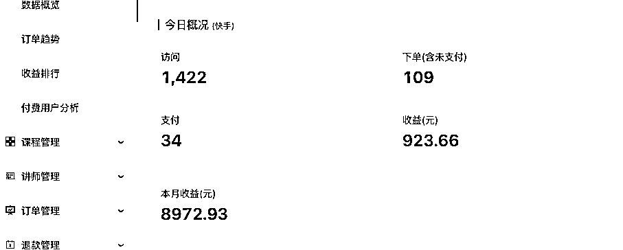

那么对于这个项目在这里简单下一个总结：

*   如果你只想赚每月几千块努努力过万这样钱当个副业，那么你跟着我文章里的赛道去模仿操作是完全没问题的。

*   如果你想每月赚几个W，那么需要按照文章里的方式，自己去找快手里的蓝海赛道，这个类似于淘宝蓝海，现阶段没那么难找，找到一个每月赚个3-4w不成问题。

# 三、这玩意咋做？

快手知识付费，说白了在快手上卖课，首先选好你要卖什么课（赛道），然后通过发视频带货或直播带货的方式卖课。

这里面最重要最重要的部分在于选赛道，这跟电商的选品类似。而选完赛道之后的玩法很多都是通用的。

在这第三节，我先把通用玩法讲了，第四节再谈赛道。

那么通用玩法到底怎么做呢？最简化的版本，你要做的事有：

1.  你要有快手账号

1.  要有课程平台的账号

1.  你需要有视频/直播内容（拿别人的视频混剪去重）

1.  要有你准备卖的课程内容（找到赛道之后咸鱼几块钱买一份现存的教程就行）

这些都准备好后开始发视频就完事了。

## 账号准备

### 快手账号

注册

快手账号新的老的都行，一个手机号用不同的方式可以注册多个快手账号。与此同时基本的起号注意事项如不要在wifi下注册、一机一卡两号啥的遵守下就行。快手客户端支持登陆两个号互切，那么一个手机就登陆两个号就可以，不要多余两个然后频繁切换。具体注册流程就不赘述了。

养号

养号这玩意比较玄学，有说有用的有说没用的，其实初期判断一个账号是否正常可以用发美女视频来看，其他平台比较火的美女视频你搬运过来过去重之后基本上能有个大几百、一千多浏览，如果只有几十的话建议养号或者干脆换号。

养号的方式就是你拿着账号模拟真人操作就行，刷刷视频看看直播 点赞评论，很多人会把养号这玩意流程说的很复杂，这个见仁见智，我个人不怎么养号，据我所知有不少快手玩家也根本不养号（也有很多养号流的）

### 课程平台账号

这里能选取的课程平台有很多，但我这里选易知课堂。快手刷的多的话可以看到很多人卖课都是选的这玩意，他最核心的优势就是不需要授课资质门槛，想卖啥课卖啥课，并且课程销量和评论都可以自己编。

注册

首先点这里 易知课堂 注册页面 注册，注册到最后会出现让交199押金的部分（易知不需要资质，与此相对的就需要押金，当然如果账号超过1万粉丝的话是不需要押金的），这里可以直接交199，到了条件会自动退回。

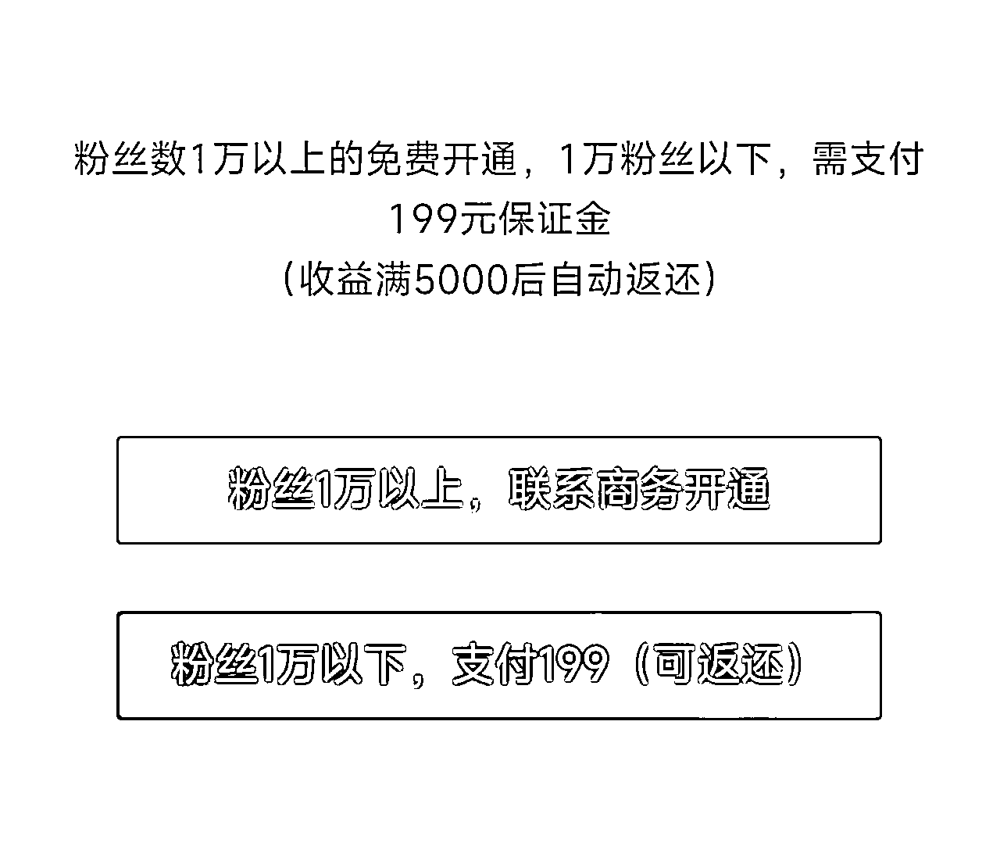

也可以文末加我好友有免交199的注册方式

## 短视频/文图/直播 内容准备

选定赛道（第四节会讲）之后，就是准备带货/引流的内容，引流有这几条路径：

*   短视频左下角挂课 靠短视频的流量成单

*   短视频不挂课，往直播引流，然后真人出镜直播或无人直播

*   文图挂课或引流直播间（这部分流量也挺好的）

这部分很多赛道都是通用的，就先讲了，先简单看看学学就行，因为不管做什么大多数情况下赛道都是最重要的。

### 短视频内容

内容的获取有两种方式

#### 搬运国外新鲜视频

直接去国外视频网站 油管 tiktok找最新发布的与你赛道主题相同的视频，最好是三天内发布的，这样很多人都还没来得及搬运，你可以通过一键下载Tiktok/油管视频这个链接把视频下载下来直接当做你的内容发出去，因为你是第一个搬运的所以直接过查重会算是你的“原创”。

但这种方式的视频流量效果不一定，因为本身视频来源就是新发的，没经过验证不一定会火。

#### 搬运国内热门视频

这个具体搬运啥没什么可说的，你在b站抖音快手小红书，找到和你赛道主题相同的视频而且比较火的视频，下载下来混剪去重。具体怎么下载基本上一搜就有，但是去重的话不太容易搜到 可以看知乎：抖音视频如何去重 这个链接学习一下。

常见的去重技术有

*   把多个视频改码率拼接在一起

*   视频加上画中画技术

*   掐头去尾 改速率 加遮挡 调色

*   最狠的去重：你直接拿A手机播放视频，拿B手机摄像头录A手机 可以说绝对不会被判重 但是相应的观感也不太好

所谓去重就是在观感和魔改中间取舍折中一下。

#### 有了内容之后

光搬运视频还不行，别忘了咱们核心是卖课，咱们要给课程引流。可以在视频中加一些小尖头指向左下角告诉他记得关注左下角课程链接，同时把左下角链接截图，图上加上文字【想学xxx点视频左下角】放在评论区置顶。

### 文图内容

这部分与短视频基本上一样，文图判重力度没那么大，全网搜图复制粘贴就完事了，文图也有些去重方式可以自己搜一下，我们做的时候是没有做去重的。

## 直播内容

直播就是为了卖课，所以直播内容有两种方式，要么你播的内容是引导人买课（侧面描述），要么你播的内容就是课本身。

另外有一个注意点：直播前是需要靠导流视频来预热的，比如直播前一两个小时你发一个自己已经比较有信心比较吸引人的短视频，视频中包含如果想xxx点击头像来我直播间。靠视频往直播间倒流。这个视频可以在投流上做一些付费。

直播与视频挂课相比优势在于，视频你想做好内容 肯定就没办法一直强调你左下角有课程，路径强化比较难。但是在直播中你可以每隔几分钟就提一下想跟主播学xxx，学同款xxx可以点击下方小程序卖课，说白了就是加强转化。

### 无人直播

快手现在不挂车的话，这是单纯挂小程序（也就是挂课）基本上无人直播是不封号的，所以没什么太需要注意的。

具体无人直播的操作方式，淘宝上直接花几块钱买一下，连带教程和软件什么的都有，在这里不赘述了因为这也没法上传软件，而根据软件的不同操作也不一样。

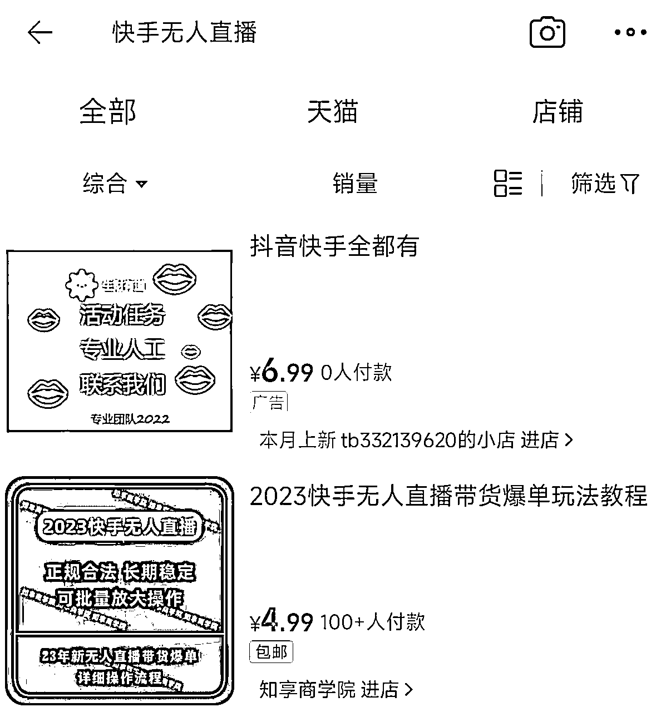

直播内容可以直接就是你课程的录播（为了转化你要在里面加语音 引导人买课什么的），还可以是你录制的（未必要真人出镜）专门引导人买课的视频。

### 有人直播

*   这部分我也没做过，但是有朋友在做，有人直播的直播内容要是展开说几万字也说不完，这个完全看你直播实力了，但我这边的建议就是如果课程单价超过50了甚至超过100了，最好还是用有人直播的方式。（因为可以根据观众互动加强引导）

## 课程准备

*   这部分没啥好说的，首先记住你买课卖的是能缓解人们想要学习课程的心态，而不是课程内容本身。人们通过买课缓解了他的内心焦虑/想学习的冲动/或者是给自己一种上进的舒适感觉。我卖了这么多课后台看总完播率不超过10%，大家都是买买意思意思，没几个真会学的。。

*   所以课程就咸鱼/淘宝直接搜集资源就行，哪怕是你录同行的教学都行（他那个教学都不一定是几手的了）

## 起号方式

跟你选的赛道主题有关，但这部分并没有什么特殊秘诀，有很多人把起号方式卖几百几千，你就算把这些课全买过来总结出来也就是我说的这两句话：找对标，先照抄。前两秒，有爆点。

唯一要注意的就是不管选什么赛道 视频前两秒都必须抓眼能吸睛或者引起情绪/抓住痛点，二秒完播率很重要。甚至所有视频可以用同样的前两面开头+后面内容不同的方式。至于前两秒到底发啥，你也可以抄对标账号的，或者是自己多发几个视频测数据。

## 课程部署

新建课程

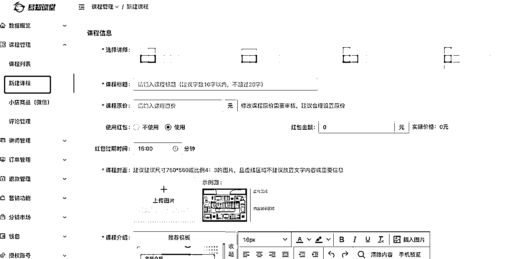

易知里面打开这个，选择讲师，然后搞上标题上传课程内容就行。注意课程销量和课程评论都是可以自己编造的，这部分别忘了搞。 上传完课程后需要联系找易知的客服审核（不找也会审核 但审核的很慢）

视频/直播挂载课程

这里附上客服发给我的挂载教程

# 四、赛道都有啥怎么选？

## 先提一下蓝红海问题

什么是蓝海，什么是红海？

*   其实蓝红海这两个词大家早都看过太多了，但其实很多人是并不明确这玩意怎么区分的，只是单纯的以为人多就是红海，其实不对。其实一个赛道是否是蓝海可以简单的根据两个方式：

1.  这个赛道是否搜索量很大，而总产出的内容不够多？如果是，那么就是蓝海。

1.  这个赛道是否投入的精力/金钱成本很低，但ROI很高？如果是，那么就是蓝海。

*   用这两个方式去区分，你会发现有些你以为是很红海的赛道 ，其实没那么红海或者干脆就是蓝海赛道，可能这个赛道你一搜索已经有几十个几百个UP主在做了，但你不知道的是这个赛道的搜索量比你以为的大得多，这几十几百个Up主的内容产出根本满足不了搜索的人群们，那这可能就是蓝海赛道。

*   又或者你以为你找到了没啥人做的蓝海赛道 ，就三四个UP在搞，但其实压根都没啥人搜索这个赛道，这压根都不是真实赛道（需求），也就没什么蓝红海之分。

## 赛道分类

*   赛道的分类，共有两个维度

第一个维度：

根据赛道的竞争程度分类，可以分为三类：

1.  红海赛道 （你5-10个号全卷进去纯模仿 一个月能赚个3-6千 ）

1.  当然了红海赛道其实是很有潜力的，如果你能在红海赛道中突围，又或者是你找到了红海赛道中的细分赛道/细分定位，那么收益潜力是很大的。

1.  举个例子，别人都卖小学教材，红海赛道卷麻了，你去专门做小学英语教材的账号，有没有搞头？你说也卷麻了，那你就专门做小学五年级英语教材，有没有搞头？也卷麻了，那你继续细分。

1.  再举个例子，很多人最近在搞小红书，别人都卖女装，那你卖微胖女装，有没有搞头？你说还是卷麻了，那你加上一个大众身高，比如162微胖女装展示，有没有搞头？还是卷麻了，那你再加上常见的特定身材，梨形/小肚子/XO腿/盆骨前倾balabala一堆限定词中选1-2个，会不会命中更细分的人群？

1.  说白了，红海中的细分，就是要你在红海中找到自己的独特定位，能在用户心智空间中找到一片未被占据的净土，然后你住进去。

1.  小蓝海赛道 （你开5-10个号进去模仿 运气好的话一个月能搞七八千乃至上万）

1.  蓝海赛道 （三四个号进去轻松上万，更高乃止无上限）

第二个维度：

根据流量来源方式，可以分为两类

1.  自然流推荐

1.  这种赛道的玩法就是先照抄对标，找到感觉之后自己有了一套输出视频的逻辑/SOP 然后疯狂发等人刷到就完事了。

1.  搜索词/主动搜索进入

1.  这种赛道不要求视频多，你十天发一百个视频，用户搜索完了看见的还是排名在前面的那几个。这种赛道要求的是你不断打磨自己视频的形式，打磨到本赛道内的极致（运用一些SEO的手段 但是快手其实排名更多的拼的还是标题封面内容），然后用2-4个排名靠前的视频挤占搜索位来获取流量。好处是不用每天都发。

关于推荐/和搜索词，这两个并不是互斥的，一个赛道你能同时吃推荐流量和搜索词流量肯定更好，但是红海赛道一般来说普通人入局是卷不动搜索词的，所以到底重心是放在推荐还是搜索词看你自己选择。

## 都有哪些赛道

如果我这篇教程不说具体的赛道，那纯粹是耍流氓了，等于一篇教程写了半天啥也没说，看了的人也赚不到钱。

同时如果这篇教程我把我知道的那些朋友（为了写这篇文章，咨询了很多人，建立了一些友谊哈哈）在做的纯蓝海赛道全说了，那更是耍流氓了，他们肯定要骂我。

所以我会挑几个红海/小蓝海赛道说一下，这些赛道你去做一个月赚个几千做好了上万是没问题的，想赚更多需要你按照上述红蓝海区分方式，找到你自己的蓝海赛道。

### 红海赛道

#### 台球教学

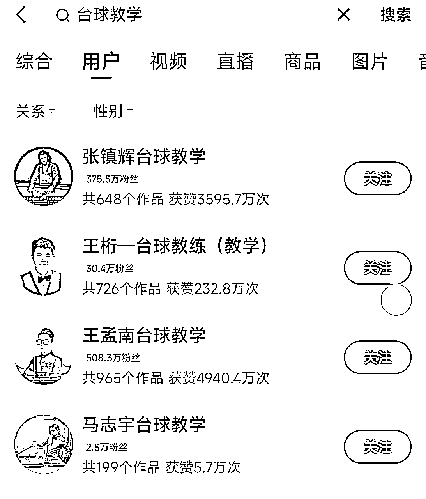

卖课方式：部分账号视频挂课，部分账号视频引流到直播卖课

评价： 这个赛道其实挺吃搜索词，混剪的有一些，但是头部玩家基本上是个人ip打法，直播也是有人直播。没那么适合新手，但是本身搜索量不低，用狂发视频走热度推荐的方式也能喝点汤。

#### 魔术教学

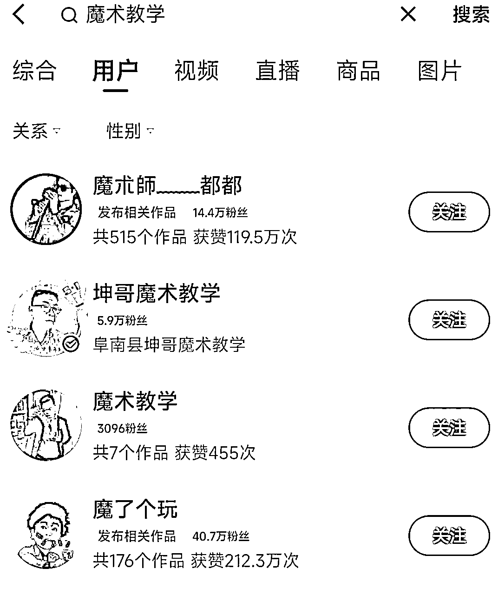

卖课方式：部分账号视频挂课，部分账号视频引流到直播卖课

评价： 与台球赛道有点类似，但是没有太头部的玩家，很多up在走视频卖课的方式，这个其实是直播效果应该会比较好的赛道，但反而直播出单没有占压倒性比例。

#### 办公软件

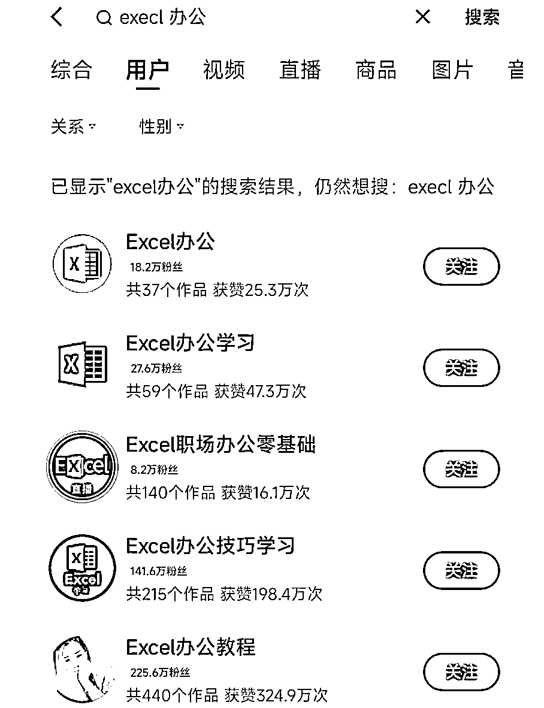

卖课方式：大部分倒流到直播卖课

评价：很经典的红海赛道了，但这个赛道并没有什么头部个人ip，大部分都是同质化视频+千篇一律的无人直播，小白可以去搞，直接照抄然后想办法突围，虽然非常红海，但也是有点适合小白的。

#### 驾考领域

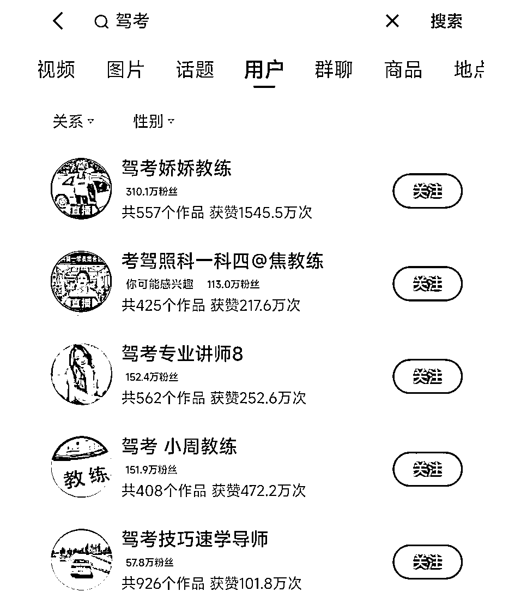

评价：这个赛道是红海，但没有想象中那么红。而且最近毕业季/放暑假，这部分流量会猛增，我的评价是小白也可以入局吃一部分。至于玩法可以自己找对标，这个不像Excel那样千篇一律，具体玩法花样比较多，选择一个适合自己的就行。

#### 编程教学

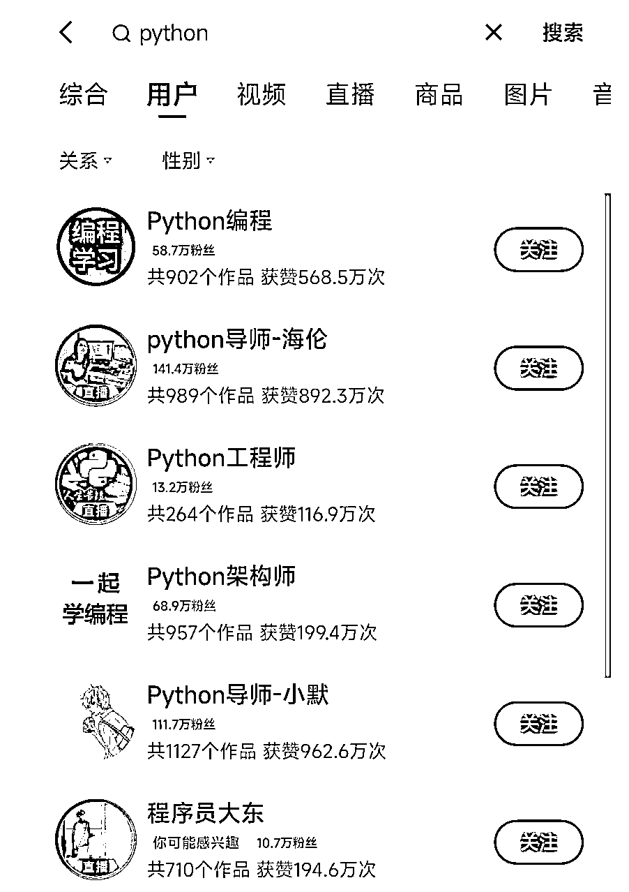

卖课方式：部分账号视频挂课，部分账号视频引流到直播卖课

评价： 这个赛道很大，而且细分的搜索词细分赛道非常多，有程序员/技术背景的话（没有也能冲）完全可以尝试在自己做的领域找找细分搜索词，能打出自己特色分一杯羹很容易，这部分可以关联毕业生就职/社招跳槽等，很多在公众号玩烂的东西都可以搬到快手上，你会发现竟然还能喝到汤甚至吃到肉。

### 小蓝海赛道

*   这部分赛道我评价为小蓝海，是都比较适合新手入局，快速出单快速拿到正反馈的赛道。

#### ChatGPT

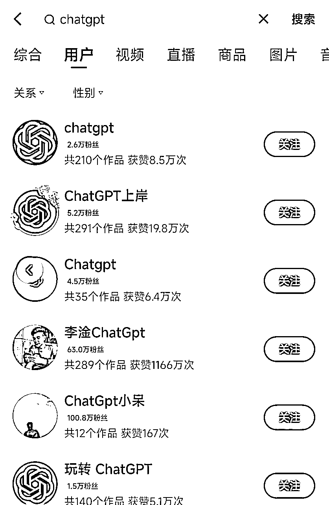

卖课方式：视频挂课为主

评价：抖音都已经玩烂的赛道，虽然快手热度不低但是没有太头部的up，小白是可以去玩的，而且这个素材很多，小红书抖音框框搬运就完事了。

#### 海外短视频

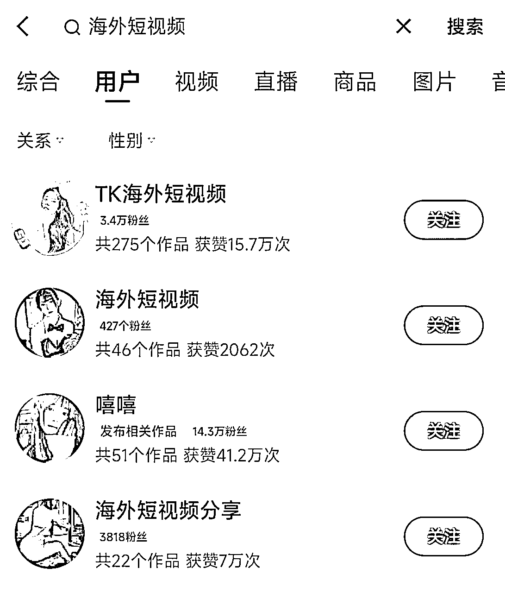

#### 

卖课方式：全部视频挂课

评价：近两三个月兴起的赛道，就是发海外tiktok的擦边视频然后挂课，课程内容是tiktok安装教学，教你怎么自己去看海外短视频。说白了就是运用人的擦边冲动心理，冲动消费。因为走的是美女擦边的盘子，所以盘子其实很大，具体看你转化。我的评价是小白可以去搞。

#### AI绘画

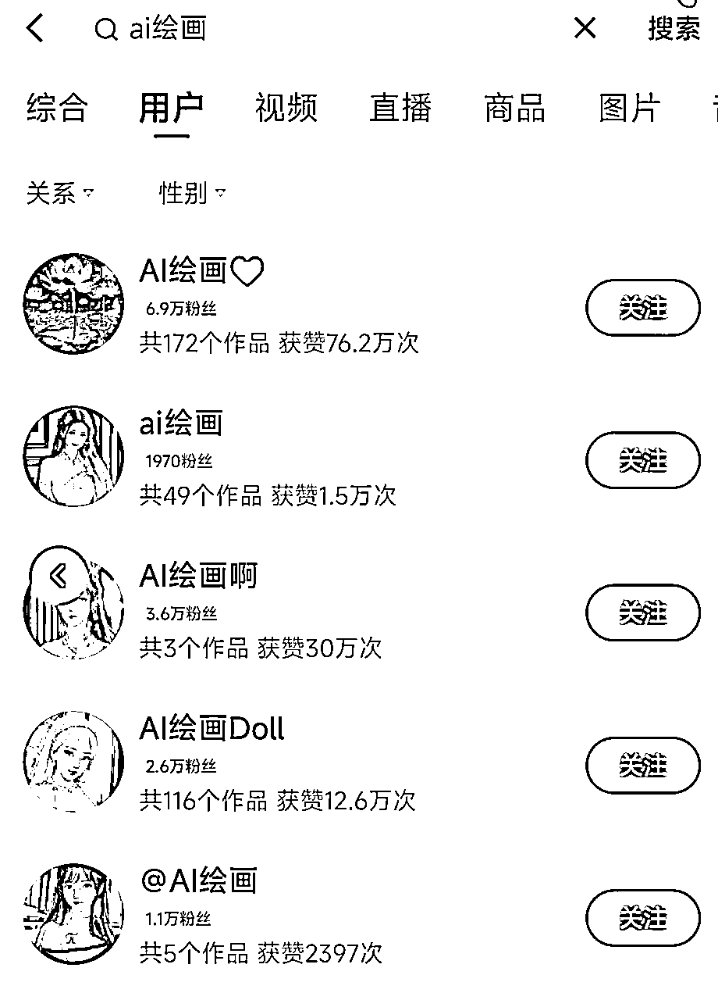

卖课方式：部分账号视频挂课，部分账号视频引流到直播卖课

评价： 类似GPT的赛道，但没那么卷，生态还在形成中。看了一些Up，会变现的并不多，基本上是视频挂课为主，看了一眼这部分的无人直播，我的评价是一个能打的都没有，你如果像excel那样搞出一套足够吸引人的直播内容然后视频导流到无人直播，你看你出不出单就完了。

#### 3D人模软件/网盘

这部分内容删了，有点太擦了，具体内容就是发一些很激情的2D/3D动画中的不那么激情的部分。有想了解的自己去查，这个有很轻松做到3-5w/月的。

### 蓝海赛道

*   这部分赛道我就没办法提供具体案例评价了，因为每一个蓝海赛道的价值相信大家都心里有数，部分蓝海赛道团队正在开发中。而且对于生财的体量，一个蓝海赛道分享出来他基本上就告别蓝海了。

*   这也是这篇教程的目的，我来分享出来怎么入门，怎么月入几千，因为这是真能做到的，但你要说我一上来教你月入几万，这个就太扯了。大部分教人月入几万的教程大家看了之后也能明白很难做到他说的那个程度。这篇文章主打的就是真实真诚，这个项目按照我文章里的分享，能做到什么级别程度我已经说了，如果你想打出更高的天花板，那可以自己不断深耕，创造属于你的蓝海。

### 写在最后

*   无论什么赛道 甚至无论是什么项目 最重要的事就是坚持，快手这个项目一天出单也有可能，前3-6天都不出单（目前我带的人里最长的也持续了6天没出单）也有可能，所以无论什么项目至少你上手跑一个月再去看他到底盈利状况如何，如果看别人当天就出单，自己两三天都不出的就直接删快手换项目了，那这种你大概率是做什么都不会出单的

# 五、关于链接

## 链接 v：【Coast231209】

## 链接我能做什么

*   快手知识付费项目

*   可以加入共创讨论群，避免单打独斗或者踩坑出不来。有大佬在里面分享赛道/指点解惑。也可以共同讨论，分享出单技巧。

*   小红书项目

*   这个我这边也在摸索，小红书店铺和小红书引流都在做。准备投一些聚光试试ROI，欢迎交流，和大佬取经。

*   Lemon8

*   这个平台预计五月开始全美大量铺开，我这边团队成员有在研究这个的，目前的看法是有极大潜力。如果你也准备做相关领域，欢迎交流进行项目共创，我这边团队内有一些平台内部只可意会的信息。

# 最后感谢生财提供的平台，与大家共勉。