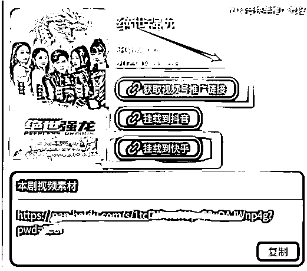
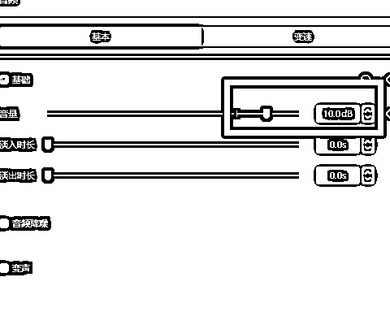

# 【短剧CPS】如何利用ChatGPT批量生产解说类短剧视频

> 来源：[https://lqvxac1mbv.feishu.cn/docx/EL9Fdl8WFoFxaixaJcLcqnXjn7r](https://lqvxac1mbv.feishu.cn/docx/EL9Fdl8WFoFxaixaJcLcqnXjn7r)

# 前言

大家好，我是惟乔。

加入生财一年，一直潜水中，目前副业搞两件事：

1、短剧cps

2、公众号

两条腿走路，一个是短期爆发，一个是长期运营，打造个人IP，在各平台引流到公众号+微信小号这个私域平台，做信任，然后做转化。

我是在3月入局短剧CPS。用了2-3天，一边剪辑，一边注册新号、养号。发了第一条视频就有30多万播放。

后续又陆陆续续有200多万的爆款，然后又开新号批量生产。

咱们生财的原则是，跑通一个项目流程，立马复制规模化放大，干就完了。

一个月左右的时间，产出1.4w左右收益。

说实话，因为性格原因，批量开了五个号，结果一天更3个号对我来说就已经很痛苦了，所以后来就减少了，目前主要是带学员做。关键是要做不痛苦的事情，把不喜欢的项目也要变成喜欢的来做。

阅读下面的内容，你能了解到：

1.  短剧CPS的基本操作流程

1.  短剧CPS的核心三要素

1.  剧情剪辑的基本公式

1.  没有创作经验，如何上手解说类短剧视频？

1.  如何批量产生解说类短剧视频？

1.  新手有哪些容易踩的坑？

# 短剧CPS是什么？

鉴于圈子里已有多篇精华内容介绍短剧CPS，在此不再赘述。

简单总结一下，短剧就是电视剧的一种，是直接在抖音/快手上看，但是要充会员才能看完整版。就像优爱腾的视频会员，我先给你免费看10集，剩下的就要花钱。

短剧CPS就是我们帮平台推广短剧，用户充了会员，我们就有相应的分成。

不是发了视频就有收益，是一定要转化充值。

整个项目的流程就是：

重点强调！！从素材库里拿到视频后，不能直接发，需要用剪映等软件剪辑一遍，把精彩内容剪辑在一起，合成一个新视频。

做过短视频的人可能会觉得好笑，这个也要强调。

但我遇到几个人，真的拿着素材库的视频，不作任何剪辑，直接往抖音/快手上传。

还有的人理解抄热门视频，是直接抄，连水印都不去，在抖音里下载下来直接发。

有些圈内人习以为常的操作，圈外人却需要费点脑力学习。就像用键盘，年轻人没人会想着这会是上网的门槛，但老年人就卡在这里，需要有个使用键盘的教程。

这个项目能不能赚到钱，一是取决于你的视频能否成为爆款，二是取决于转化高不高。能否成为爆款，关键是多发。

# 基本操作流程与细节

## 第一步：下载App，授权

### 九州短剧

短剧平台有很多，可以多平台操作。

大多数人应该都要做九州短剧，建议直接用九州官方app，一手数据！！

提现不收手续费，税由平台承担。

授权教程参照：

有1万粉丝以后，可以上星图接任务，收益更高。

## 第二步：下载原片素材，导入剪映剪辑

剧情上，开头3秒做到吸引人，中间持续刺激情绪，结尾还想看，引导转化。

具体怎么剪，后面有写。

## 第三步：导出视频，发布

使用授权的App发布视频，都直接在App中找到你要推广的剧，一键跳转到抖音、快手发布视频。能够挂载小程序，挂载小程序才能转化付费。

### 抖音九天剧场挂载教程

第一步：打开App-短剧-搜索短剧（输入名称）

第二步：搜索后，点击详情。

第三步：点击挂载到抖音，会自动跳转，选择视频上传即可

### 快手九州短剧推荐挂载教程

第一步. 点击挂载到快手，会自动跳转，选择视频上传即可

第二步：点右上角三点，然后点发快手。

第三步：点相册上传剪好的视频

第四步：此时会自动返回标题编辑界面，下方出现作者服务和剧名，就代表挂载成功了。点击发布视频就可以了！

### 视频号挂载教程

第一步：获取视频号推广链接

第二步：去视频号挂载

打开微信—我—视频号，点右上角相机标志，选择【发表视频】

其他平台的挂载方式基本操作流程都一样。

流程很简单，难点在第二步。

# 短剧CPS的核心三要素

## 如何弄账号？

1、账号注册

抖音：一台手机，一张电话卡，只登一个账号，用流量。家用WIFI其实无所谓。

快手：只要账号没违规，新旧都可以。

视频号：建议新号。

2、老号能用吗？

我们认为老号是注册很久的号，抖音不这么认为。

注册很久，没发过视频的号算新号。

注册很久，发过几百条视频但只有几百几千粉丝的号也算新号。

因为没打上标签。

真正的老号，是已经在一领域里打上了标签，有几万粉丝那种，如果要换一个新领域来做，相关性不强的领域，最好重新注册。比如原本有5万粉，换内容，至少要有5万粉才能对冲掉。

（来自抖音官方的解释）

3、养号

这个很玄学。个人做，有时间就养一养。

那种机构搞几百上千的机器号才容易被风控。

4、运营

1.  评论维护

1.  每一条评论都去回复，增加互动，这是做短视频的基本功，没什么好说的。

1.  上热门检测

1.  这个动作要做多次，不要只是发了视频才检测，过半小时，过两小时，过一天，都要点一点【上热门】（在视频右下角三点中），因为抖音的原创检测不是只在发视频时才做，只要播放量往上涨，随时都可能被检测出来原创度低，然后播放量就不涨了。

上热门检测这一步很重要，刚开始做这个项目，不了解平台的规则，很容易违规，新手要多做。

1.  置顶评论

1000播放后，可以置顶评论。有两种形式：

1.  文字 参考：家人们，评论区上方链接看后续

1.  图片

1.  小程序挂载检测

1.  用另一个微信号看一看，挂载的小程序还在不在。视频违规，小程序会掉；小程序本身违规，也会掉。

## 如何选剧？

1.  爆款剧

火过的内容还会再火，这是做短视频的原则，任何时候，任何领域都适用。

找爆款，去抖音/快手搜索关键词。

搜索关键词：短剧、九州小剧场、抖音短剧、抖音短剧新番计划、触摸短剧、超爽短剧等

筛选最多点赞、一周内，以及综合排序都可以看一下。

主要看这几点：

*   剪的什么剧

*   视频多长时间

*   剧的开头和结尾是什么

*   爆款剧账号粉丝量

优先选低粉爆赞作品。

1.  新剧

新剧没什么可参考的视频，需要自己按自己的逻辑来剪，下面会说到。

剧的质量也不稳定，但主要是抢先机。

如果说做短剧CPS是做短视频的蓝海领域，那么做新剧就是做短剧CPS的蓝海领域。

#### 关于垂直细分领域选剧的问题。

做小说推文，还会细分为都市、校园、古装等等。

短剧没这么复杂。

目前短剧的垂直领域没有分得那么细，主要就是分男频、女频。

如果你的剧是男频爆了，观察粉丝的男女比情况，确认是不是真的男性在看，那么后续重点就剪男频剧。

主流女频剧都是虐剧，虐完后反转，女主与男人、女主与小三、女主与家人，大多都是HE（happy end）。

男频剧都是爽剧——复仇、扮猪吃虎、穿越、艳遇。

## 如何剪辑？

剪辑主要关注两个重点。

### 保证剧情精彩

短剧的目标群体年龄段主要是40岁以上，男女都有，所以重点要围绕这群人做文章。

### 常见爆款剧情就三类

男频

1.  男主扮猪吃虎/复仇

1.  穿越/YY

女频

1.  女主被虐（非常毁三观那种）

而我们剪辑视频时，会衍生出更细化的主线。

比如女主被虐，可以细化为：

*   男主直接虐女主，二者直接冲突；

*   女二陷害女主，引发矛盾冲突；

*   婆媳矛盾冲突；

*   利用小孩博同情；

每条线可以单拎出来成一个视频，也可以多条线交叉在一起，对于过渡就要把握好。

剧情多变，但万变不离其宗，可能参考相同的模板。

剧情安排的主流思路：

一虐一反转算一个循环，刺激观众情绪的起伏，最后在反转前停住，引导看后续。

虐只是一个指代词，与虐剧无类，所有的剧种剪辑都可循环这个道理。

这么说有点抽象，具体可以看这个视频。

1.  男主给狗下跪，一虐；男主继承家业，一反转；

1.  男主被保安拦下，二虐；管家来救主；二反转；

1.  爷爷给男主配秘书，这是过渡剧情；

1.  男主再次来到小区；三虐；秘书驾到；三反转；

此时结尾，引导看后续。

这个视频是加了解说的，不加解说原理也是一样的。

我们在剪辑时，就是不断重复循环【虐-反转】。

如果是剪2分钟的视频，可能中间只反转一次，一共两个循环就结束。

如果是剪10分钟的视频，那么5-6次循环再结束。

那些非必要的过渡剧情，全部不要。

如何判断非必要？

删除这些剧情后，仍然看得懂，不会让观众云里雾里的——怎么突然出现一个人物，他是谁，为什么要帮主角？

这个逻辑玩熟以后，剧热不热门，在你这里都一样，你都能剪得精彩，你就是爆款制造机。

当然要熟练掌握这个套路，首先在拿到素材时，必须把视频完整的看一遍，然后做上笔记。如图所示。

### 一定要去重

去重就是不让视频限流，如果你的视频和别人的一样，被判抄袭，就会限流，严重的会封号。

对于没有混剪经验的新手来说，去重是个难题。

#### 什么是去重？

算法检测你的视频是不是抄袭，最重要的手段就是抽帧对比。

视频是由图片组成的，一张图片为一帧。

当我们上传视频后，系统会抽一定数据的图片，与库存做对比，如果重复度达到多少，就会判断为抄袭。

原理如此，实际更复杂。

因此，去重的关键就是让画面变得和别人不同，让系统检测不出来。

#### 通过剪辑手法去重

去重主要围绕着改画面去做，主要会用到：

1.  切割画面。只留三分之二、二分之一等。

1.  镜像。将画面左右对调。

1.  加过场动画

1.  加标题

1.  重新加字幕

1.  加扫光

一般建议是用4种，但同样是用4种去重方法，有的人就能过原创，有的人就过不了。

纸上得来终觉浅，绝知此事要躬行。

我建议大家都去找看起来相同的视频，去对比二者的差异之处！！！

下载两条肉眼难看几乎一模一样的视频。放到剪映里，两个画面同时播放，然后对比找细节。

上图两条视频轨道的空白处，就是两个视频不同地方。

不用做太多，做过一两次对比，你就知道如何组合运用去重手段。

#### 通过剧情改变去重

1.  模仿爆款视频时，不要去每一个画面都和爆款视频对应。我们只要保证开头和结尾一致就行了，中间部分，可以和原视频一样，但是要删减掉一部分台词，甚至将台词进行调换顺序。比如原本是A、B、C、D台词，你改成C、D、A、B，或者增加一段台词E。

1.  多用插叙。先讲最精彩的部分，然后再通过回忆交代背景。小学语文说过，就不多讲了。值得注意的是，如果用上解说，插叙的过渡会更加丝滑。

如果是做解说类，不需要太多去重。本身解说就已经是很好的去重了。

# 如何快速批量产出解说类短剧？

从形式来划分，短剧视频主要分为三大类：混剪、解说、半解说

去抖音搜索时，我们会看到头部账号、爆款视频，大多都是加了解说的。

所以想要长期做短剧推广，必须加解说。

做解说至少有3点好处：

1.  提高转化率。解说更能调动人。

1.  竞争小。当剪辑大军入场后，我们必须要建立壁垒，提高自己的竞争力，这就要用到解说。

1.  去重效果好。

但是对于一个没有影视解说经验的人来说，半天也憋不出个屁怎么办？

ChatGPT啊！

## 如何用chatGPT创作解说？

第一步：用剪映或者轻抖等小程序提取文案。

以剪映为例：

1.  去抖音找到原视频。

1.  用去水印下载视频。软件很多，生财里搜索一下。

1.  将视频导入剪映里，拖入轨道，右键，

1.  校对、修改已生成的字幕。

1.  导出字幕。

第二步：修改文案

1.  复制字幕发送给chatgpt，等待回复。

但是要注意，ChatGPT不是所有文案都会帮你修改。比如涉及到一些不道德、不恰当的内容，会拒绝你。

此时有两种解决方法：

1、手动修改

2、分段投喂，违规那一段就手动修改。

1.  复制文案，再手动修改后。

纯手动修改其实也没什么门槛，基本上有手就会。如果chatgpt改不了文案，也可以快速手动修改。

*   改名字称呼。

*   美女：漂亮女人、女人、女总裁、美女总裁、总裁老婆；

*   男人：小伙、小哥、富少、富二代；

*   战神：特种兵、兵王、神将、元帅；

*   小孩：小男孩、小女孩、小机灵鬼；

*   改数字。5块钱改：500万。

*   改成语。比如恼羞成怒改：羞恼成怒

*   同义句替换。

*   这个小孩太调皮了，天天装疯卖傻，就因为他不喜欢这个后妈。——这个小男孩太调皮了，整天装疯卖傻，就因为他不喜欢后妈。

第三步：配音。

我用的是微配音，直接用微信小程序操作。

配音员选择云飞羽，这是最常见的影视解说配音。

该软件需要付费。如果有免费的，声音质量较高的，大家可以尝试。

效果设置如下：

语速8.0-8.5都可以。

这里推荐wav格式，如果选mp3格式，可能会出现波形与声音对不上，剪辑时会浪费时间。

注意配音时，可以缩短静音，可以减少停顿。参数设置如下：

配好音后，选择下载即可。

第四步：使用剪映进行剪辑

1.  将声音导入剪映中，音量调至10.

1.  添加视频素材开始剪辑

这一步可以套用前面讲的【虐-反转】的套路，也可以直接使用抄热门视频的。

1.  素材添加完之后，先别急着生成字幕

先做封面，此时没有字幕，画面比较干净。

封面不要选远景，手机太小，根本看不清，最好是选人物特写，能表现出人物脸部情绪的图。男频选美女。

像下图这种就不合适。

1.  自动生成字幕。

生成字幕时，有个取巧的方法，字幕用白底黑字，直接把原字幕遮住，可以不用再做模糊特效，减少操作时间。追求画面效果还是使用模糊蒙版的方法。具体操作方法直接在抖音中搜索【蒙版字幕】

制作模糊字幕效果时，先全选片段，然后新建复合片段。

然后再复制一层，利用模糊特效+蒙版盖掉原字幕，再用新字幕替换。

特别注意！在改第二条、第三条视频时，要先解除复合片段，然后再分段修改素材，不要直接在复合片段上修改。否则，工作量增加一倍。

1.  加背景音乐

解说常用背景音乐：

https://music.163.com/playlist?id=2291372005&userid=119290564

https://music.163.com/playlist?id=5296607978&userid=119290564

https://music.163.com/playlist?id=2561549991&userid=119290564

如果是做半解说，原声部分会有自带的背景音，若要追求视频质量，可以根据剧情分段加背景音乐。

短剧常用的BGM：

1.  虐剧——程响！程响！程响！抖音音乐界的半边天。重点是《晚光洪流》《人间烟火》《故事终章》

1.  爽剧——下面两个

1.  裁剪掉部分画面。

我一般用蒙版来做，如下图。

1.  为裁剪后留下的一上一下的黑边做背景填充，增加画面原创度。

以上，一个视频大致完成，剩下的就是小细节的修改，最后导出视频即可，导出选项直接默认，不用修改。

但是要注意：

解说类个性特点太鲜明，不要原封不动的抄，容易违规被举报，违规了还检测不出来，突然流量就下降了。

最好是自己把文案弄下来，改一下，然后用AI配音，换个配音员。

## 全解说

如果不要台词，全解说，只要场景大致一致。比如解说为A场景，画面为A场景就行，不需要台词的一一对应。剪辑的时候就比较省事，不用去找台词。

这样做的优点是：

批量操作很容易。一条视频剪出来后，我只需要换画面，就能生成一条新视频。

具体操作如下：

这一段是A场景。

把A场景切分为A1、A2、A3、A4，然后打乱顺序，随机组合，B场景同理。只要画面场景一致，基本不会影响视频的观看。

或者替换相同的场景。可以往前挪几秒，或者往后挪几秒，中间去掉几秒，只要解说的内容与画面场景不要相差太远就行。

又或者，将A场景分段后，对A2、A4做镜像处理。

这里还有一个小技巧，可以使用智能剪口播来切分。

这样操作一下，再加上去重方法。

比如换字幕字体、颜色、每个视频上下切边的宽度改变。这些可以做成模板，只需要制作一次，下次直接导入预设即可。新组合的视频，又是原创。

目前我还是手动操作，不知道哪位大佬有自动化的方法，可以配音后自动选择对应的场景配画面，全自动化批量生产，那就是完全解放生产力。

全解说其实跟做小说推文很像，只不过全解说的画面跟语音内容是强相关。

缺点：

有很多情绪张力很足的地方，无法体现出来。

用半解说，可以解决这个问题。

## 半解说

半解说又分为两种。

一种是解说-原声-解说-原声

另一种是开头解说1-2分钟——原声到底。

第二种可以随意延长视频时长，打出差异化。

原台词部分不动，只把解说部分切片，切成A1、A2、A3、A4，然后把解说打乱，或者添加一段新的。再加上其他去重手段，又是一段新视频。

具体操作方法同上。

## 更进阶的玩法

以下两个想法并未实践，分享出来，期待大家一起来尝试，摸索出一条路来。

1、将剧情导出，投喂给ChatGPT，让AI自动生成解说。

2、同一主角的多部剧混剪。比如顾安然的剧，有多部剧均有被小三虐的剧情，把这几部剧相应的剧情都提出来，合成一个新视频。这样剪会产生意想不到的效果，而且去重效果也好。

# 新手经常会遇到的问题

生财里有很多保姆级教程，但是作为纯小白，看完是挺爽的，干货满满，但自己一实操会发现问题其实很多。

所以真心建议大家，别只看别人的分享，一定要上手才有感觉。

如果你想做短视频相关的项目，无论是哪一类，都先实操起来，建立对短视频的基本认知。

以下几个是新手常见的问题，对熟练短视频的人，这些都已经成为基本认知，但是对于纯小白，却是影响项目是否能做下去的关键问题。

### 一定要新号吗？

我用新号和老号都做了，结果同样的视频，老号爆的效果更好，还提升老视频的播放量。

抖音官方的说法，只要粉丝基数少，没有打上标签的，不管你什么时候注册的，有没有发布过作品，都算新号。当然不能违规。如果有违规，最好是注销后，卸载抖音，重新下载抖音注册。

### 播放量太低怎么办？

爆了以后，同样会面临播放量低的问题。

特别是那种只爆了一两条就涨了几千上万粉的账号，系统打不上标签，再发新的内容，由于话题不一致，吸引的人群不同，按已有人群模型推不出去。播放量就会越来越低。

如果突然只有100-200的播放，那多半是账号没标签，推流不精准，找不到人群。

怎么办呢？

就是多发，一天发2-4条，坚持一周以上。

做短视频项目，一定要有心理准备。不可能天天high。

关键是执行力，靠量来搏上热门概率。一天单账号干2-4条视频上去，干他一个月，不赚钱来找我。

### 去重要用多少？

去重并不是越多越好，原则是不能影响画面观感。

### 千万别违规

别想着走捷径，去抄袭别人的视频，很容易违规。有学员连续违规4次，账号直接封了一个月。

常见违规就是低俗和抄袭。

抄袭容易理解，自己抄没抄，心里有数。而低俗，如果是毫无视频经验的小白，多踩几次坑就明白了。

### 起步阶段别原创

好几个学员都是相同的问题，自己的理解并不是代表大众喜欢。

几十万粉丝的大号，都是在互相模仿文案，抄剧情。

模仿，但不是全抄。

### 低俗、暴力问题

可能做其他类型的短视频很难遇到低俗、暴力的问题，便是做短剧CPS经常有。

短剧90%都有低俗、三观不正的情节。

低俗主要有几点：

1.  穿得少，漏得多

1.  侮辱人格

狗东西、呆子、贱人

1.  暴力

打架，侮辱别人，复仇，这种不要太多。特别是又是脏话、又是威胁，然后再打架。这种特别容易违规。如果非得剪这样的内容，可以采用解说的方式。

这些内容都尽量避免，虽然有的账号你看到这些内容也有，但人家就是能爆，有流量。原因一是总有漏网之鱼，二是有的账号有一定的放松。能给抖爸爸赚钱的账号和一个无名小号，当然适用的规则会有所不同。

正常传视频挂小程序可能通过检测的视频，如果上星图，就可能审核不通过。星图要严格一样，所以最好平常发视频的标准都按星图的严格要求。

### 7、新手最大的问题：发了三五条，没有流量就放弃了。

这是遇到最多的情况，大家都想发一条视频就有几百万的播放量，哪有那么容易。所有做短视频的项目，都在一个坚持二字上。不停的发，不间断更新，不管播放量有多少，每天2-4条，冲就完了。

很多人遇到的问题都不算真正问题，而是内容发得太少。

最后，做这个项目一定要趁早，目前好转化的剧，99%价值观非常不正确，简直毁三观，早晚得被监管，那时会有一堆平台做不下去。平台做起来了，推广的佣金也会给得低。目前佣金是真高，九州的有些剧，在星图上给到100%的佣金，简直无情啊。