# 看我如何靠写作月入5万！写作BOSS项目保姆级分享，精华内容全在这里！

> 来源：[https://cxqeimz77vr.feishu.cn/docx/G2Zwdm2H7ol8FYxHEn7c0H2dn3c](https://cxqeimz77vr.feishu.cn/docx/G2Zwdm2H7ol8FYxHEn7c0H2dn3c)

你好，我是饭饭，目前是一家电商公司的小老板，经历了近1年的时间，不断开店、封店、试错、总结、复盘，我从最开始的1个人负债状态到目前的团队扩增至6人稳定盈利，终于跑通了整个项目的闭环实现了从0-1。这是个操作简单、易复制、能够增增财增量的操作项目，通过帮别人写文章，实现了收益保障。目前我们操作了拼多多、小红书、闲鱼、淘宝、视频号和抖音这几个平台，每个平台都取得还不错的效果，视频号和抖音目前不够稳定，本文我将围绕稳定的几个平台去做详细介绍，让圈友少走弯路。目前这个项目旺季能给我带来一个月6w左右的收益，淡季3.5w左右，在星球看见的“真诚、利他主义”，对我自己团队价值观的感染挺大的，今天就把项目详细拆解的分享给各位，有一句话是这样说的，同行不同利，且看且珍惜~，如果有好的玩法和不足之处欢迎评论区交流。

注意，此文有数据，有案例，有赚钱实操，万字长文，建议仔细阅读收获会较大！！！

为了方便阅读理解，先做要点：

1.写作不一定是做自媒体，代写也能赚钱！ 【提认知】

2.通过电商平台接单写作，各有玩法 【 获技能】

3.看完此文可以掌握写作赚钱渠道 【接单渠道】

后看大纲：

# 一、项目认识

## （一）项目简介

关于项目：通过在电商平台开写作店铺，帮客户写文章。任何一个行业单单一个“代”字，里面就藏着亿级资产！

像图中的付款人数并不能代表付款金额，写作属于定制类产品，价格不定，基本玩法通过电商平台获取到精准客户咨询，然后双方交流、根据需求报价，多数都是私域对接付款，微信、支付宝或者银行卡付款的。

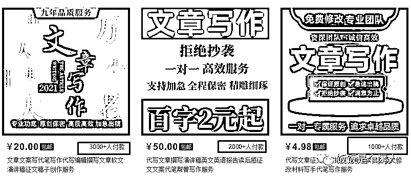

没接触过这个行业的圈友可能不清楚到底要写哪些东西可以赚钱，这里我详细举例，帮助各位阅读，根据我们店铺一直下单的情况，目前市场上会经常遇见的下单写作的类型有包括但不限于如下：

演讲稿、新闻稿、读后感、征文发言稿、 报告总结等...

情书、道歉信、感谢信、节日祝福等...

软文广告类 、宣传软文 、短视频文案、 广告文案等.....

产品介绍、品牌故事、品牌软文、营销软文等......

网店文室类 、详情页文案 、剧本、脚本等.......

回忆录、公文、会议纪要、思想报告、创业计划书等等.......

这些都是大家比较常见的，不做赘述，我重点说一下回忆录，这是我们一个不错的一个营收点。

【回忆录解答】

目前写作变现中还有很大一部分是回忆录撰写。回忆录的市场呈现出一定的增长趋势，回忆录是一种个人传记体裁，现在消费能力的提升，越来越多的人意识到记录自己的人生经历是非常有价值而且重要的，根据市场研究公司的数据，国内代写回忆录市场的规模在过去几年里逐渐扩大。预计该市场的年度增长率约为10%左右。

受众群体： 都说三年入行，目前饭饭在回忆录方面我们入门时间较短，但是根据目前接触的情况来看，回忆录的受众群体相对广泛，例如很多普通公众、知名人士、企业家、政府官员和一些上了年级的老年人等。非常多的人开始认识到回忆录对于个人和家庭的重要性，把回忆录当做一个载体，去留下自己的事迹和回忆，这个是具有一定的传承价值的。

回忆录认知： 回忆录不难，只要文笔不是太差基本都可以写，怎样找到客户才是最关键的。

找客户有一定的方法和技巧的，可以说只要你掌握了方法后，找到客户就不是难事，如果没掌握方法，靠自己摸索的话，两年三年也不一定能找到一个客户。

这里我把过去实操中找客户的一些技巧和开店方法总结成了这篇文章，看了文章后，新手就知道怎么找客户了。

只要按照我的方法去做，一年遇见2个以上的客户，一年光回忆录方面收入5万以上还是很容易的.

所以怎么找到客户属于写回忆录赚钱的关键和核心。

为什么别人愿意写回忆录: 其实我觉得回忆录就像是主人公或者他身边人对他自己的肯定，可以通过回忆录记录下了记录他的经历，这在精神层次和教育层次是非常有价值的，让别人来从中学习并欣赏。

我这里举一个简单的例子：在去年的时候给我们当地县城的一位做建材生意的老板写了一本，我和他是在公益协会认识的（我和他都是本地公益协会的成员）他算是一个中小私企的老板，白手起家，但是他的学历也不高，和我认识以后深入交谈，他是第一次听我说这个回忆录，挺好奇也挺喜欢的，然后就付费我这边来帮他写了，很大一部分群体是需要回忆录去记载肯定自己的人生经历的。

## （二）为什么是写作BOSS？

接上面内容。我做了写作类型的介绍，我告诉大家为什么要成为写作BOSS，做这个项目的心态一定要摆正，我们不能单独的充当写手，这样上限太低，手一伸就碰到天花板，把自己当做一个老板，建好桥梁，做好运营，赚更多的钱。写作是一个定制类服务，我们面临的客户分为三种：

1.有质量需求的， 这类客户最注重的是质量，找到你是希望你写出高质量的稿件，放高姿态，做好质量才是王道。

2.找你救急的：这类也能收不错的单价，质量要求不高，能过就行，一般遇见的都是哪些领导安排下来他没有去做、或者学校老师安排的需要上交的作业等等。

3.想低价应付作业的。这种会到处比价，事情最多的一部分客户，这部分客户我建议过滤，赚不到钱还能折磨人。

基本逻辑就是：获取用户，对客户进行解答，

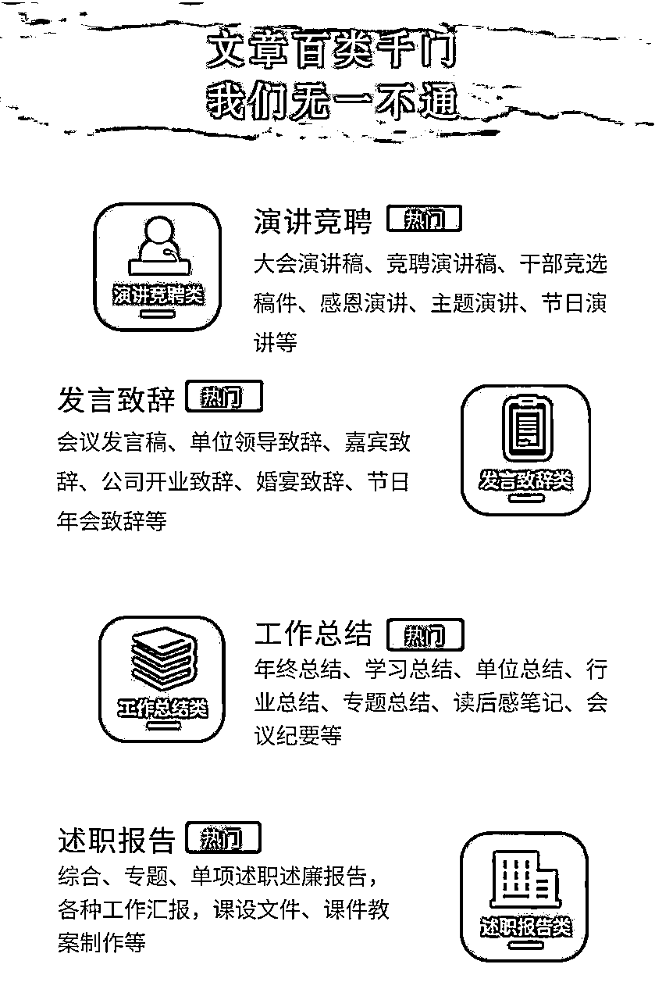

## （三）项目收益

目前的情况这个项目高峰期的时候能给团队每月带来11w左右的营收，淡季稳定在6w左右，多店铺操作，算是能养活团队，也是目前饭饭的主营业务，收益图仅作参考展示，表明真实性，为了不打扰阅读，请圈友继续重点阅读后面实操内容。

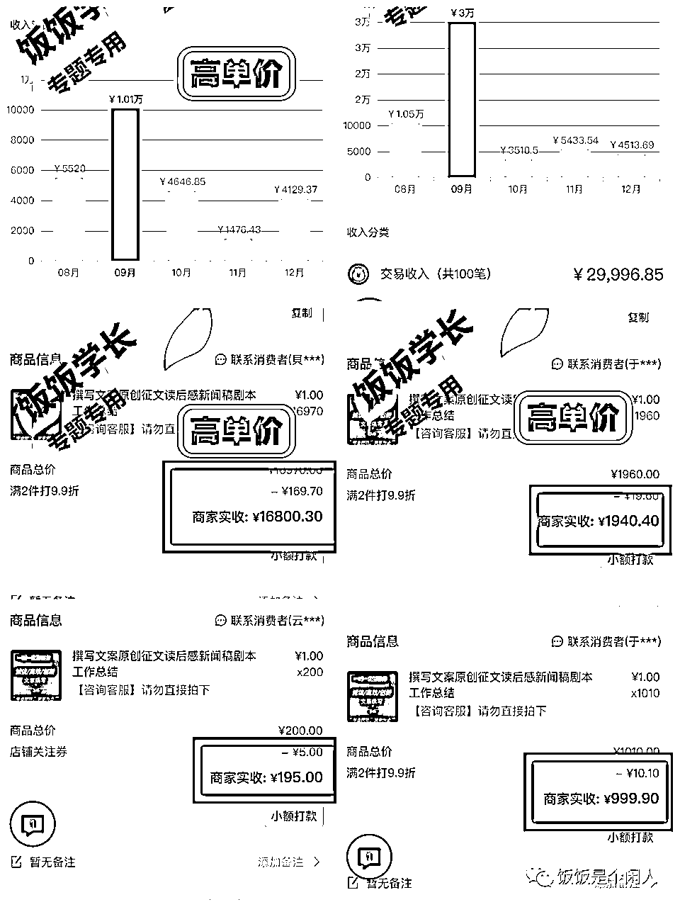

## （四）市场分析

1.市场规模

做项目肯定是得清楚的认知到自己做的事业能不能长久发展，据统计，近年来国内代写服务市场规模呈现逐年增长的趋势。根据中国互联网信息中心的数据，2020年，我们国内网民规模达9.87亿，其中高等教育阶段学生人数超过4000万，这为代写服务提供了庞大的市场需求。据不完全统计2020年中国在线教育市场规模达到了4800亿元人民币，其中学科教育占比最大，达到了44.3%。这就是一个庞大的用户群体，回忆录作为一个大市场，根据市场研究公司的数据，国内代写回忆录市场的规模在过去几年里逐渐扩大。预计该市场的年度增长率约为10%左右。

2.市场主要玩家

国内代写服务市场的主要玩家包括代写平台和自由写手。

3.市场热点和趋势

个性化服务：随着市场竞争的加剧，越来越多的代写服务平台开始注重个性化服务，提供定制化、专业化的写作服务，以满足客户个性化需求。

优化写作质量：代写服务平台开始注重代写人员的质量和能力，加强审核和培训，以提高写作质量和客户满意度。

多元化业务： 代写服务平台开始拓展业务范围，包括商业写作、创意写作、翻译服务及其传统的学术指导服务等

目前代写服务市场具有庞大的市场需求和潜力，是一个快速增长的市场，特别是在在线教育和远程学习的背景下，行业的发展会更加迅速。随着国内高等教育水平的提高，越来越多的学生需要代写服务，这也为市场提供了更多的机会，搞钱的机会还是很多的。

搞钱的机会这么多，那如何去接单，如何接到更多的单？

重点看接下来的内容

## （五）接单渠道分析

目前市场的接单平台太多了，可以通过社交平台或者电商平台来接单。

社交平台：抖音、视频号、QQ、皮皮虾、微博等等

电商平台：拼多多、淘宝、小红书、闲鱼、天猫【目前天猫我也没跑通】

两者相比之下我更推荐电商平台，来的客户更精准，转换难度非常低，客户进店就是两个结果，要么下单、要么走人，社交平台相对交付过程漫长一点，需要创作笔记、维护评论区、然后引流、打造朋友圈转换。

这里我就详细来告诉大家怎么去做这些平台、

# 二、开店平台选择

## （一）各电商平台优劣分析

【拼多多】

优势：

1.用户基数庞大：拼多多平台是中国最大的社交电商平台之一，拥有数亿的用户基数。这意味着如果你能够在拼多多平台上写作，你有很大的机会接触到大量的潜在用户。

2.低门槛：相比于其他平台，拼多多平台的门槛相对较低，1000保证金。不需要像在其他平台一样具备特定的技能或经验，就可以开始在拼多多平台上开店写作。

3.社交属性强：拼多多平台注重社交属性，用户可以通过分享、点赞等方式来增加曝光度和粉丝数。

劣势

1.稿费水平偏低：拼多多平台对于写手的稿费水平相对较低，可能难以满足高质量作品的要求。

【淘宝】

优势：

1.巨大的用户群体：淘宝是中国最大的电商平台之一，拥有数亿的用户群体。

2.较高的稿酬水平：相比其他平台，淘宝平台对于高质量作品的稿酬水平相对较高

劣势：

1.审核门槛较高：淘宝平台对于文章的审核和开店技巧要求比较高，对于一些新手或没有写作经验的人来说可能会难一点。

2.竞争激烈：淘宝平台上的写作市场竞争激烈，是我写到的平台中竞争最激烈的。

【闲鱼】

优势：

1.精准的潜在客户：闲鱼平台主要是以二手交易为主，平台上的用户都是具有明确需求的消费者，如果在闲鱼平台上写作与用户需求相关的文章，会有更高的转化率。

2.高额的稿费水平：闲鱼平台上的高质量作品往往可以获得较高的稿费，很好赚钱。

3.零门槛

劣势

1.用户群体相对较小：相比淘宝和拼多多等平台，闲鱼平台的用户群体相对较小

小红书

优势：

1.精准的潜在客户：小红书平台的用户主要是以女性大学生和研究生为主，非常高质量，准确来说非常有钱~

2.高额的稿费水平：小红书平台对于高质量作品的付费比例相对较高

劣势：

1.审核制度严格：小红书平台对于作品的审核要求相对较高

3.有一定的门槛：需要有一定创作笔记的能力

【抖音】

优势：

1.巨大的用户基础：抖音是一款非常流行的短视频平台，拥有大量的用户，每天有数以亿计的用户在上面观看和分享短视频，因此平台上有着广阔的用户群体。

2.多元化的内容类型：抖音的内容类型非常丰富，除了短视频之外，还有舞蹈、音乐、搞笑、美食等各种类型的视频，可以针对这些特点来生产图文或者视频笔记，吸引精准用户。

3.高效的内容传播：抖音平台的内容传播非常快速，只要笔记搞得好，就能很快地在平台上扩散，带来更多的曝光量。

劣势：

1.引流难度较大

2.流量分配不稳定

【抖音】【视频号】

这个平台操作下来和抖音非常相近，不做赘述，然后比抖音多一个优点，不用导流，可以直接加微信。

# 三、各平台写作开店实操详细步骤

心肝教学，觉得有用的记得给我点赞奥

## （一）拼多多接单实操步骤

1.拼多多开店准备

新手建议做个人店：准备一台手机、一张电话卡、个人身份证、1000元保证金【平台保证金，不做以后会退】

2.拼多多开店注册

很多圈友没做过电商平台，我在这里做了详细的注册步骤：参见

3.拼多多商品标题

标题非常重要，流量的大小直接和标题有关，错误的标题也会直接导致封店或者4w的保证金，这里我提供几个我们操作没问题和正在使用的标题给到各位圈友。

1.文章撰写原创演讲稿写作服务英文总结读后感征文心得

2.撰写文章原创演讲稿作诗主持写诗答辩稿作文读后感

3.原创文章撰写工作总结心得演讲发言稿策划文案软文作文述职报告

4.拼多多详情页制作

做文章类目的详情页不要做的太复杂，做一张副图上传就可以了，毕竟文章写作属于虚拟产品，各平台对虚拟都不是支持态度，不要用做电商实物的心态去做虚拟。

这里推荐两个作图软件：【搞定设计】【创客贴】

上面有很多模板直接套用就可以：这里放一组我们常用的模板给大家参考

商品主图比例： 800*800px

图1 图2

5.拼多多商品发布如何避开4W保证金

这个方法目前知道的人并不多，不少人专门卖这个教程都收费上百元,请看点击蓝色部分查看教程

6.如何进行线下引导

这个步骤是最难的，也是很多人做不起来的关键，稍微违规容易店铺被限制。

这里推荐的两个方法和专业话术：【平台规则一直在变，不能保证一直吃香】

1.这边怎么跟您发文件呢？

然后客户会回复你联系方式，然后你主动添加即可。

2.发送图片

在聊天窗口输入微信号:

然后截图发给客户。操作如图

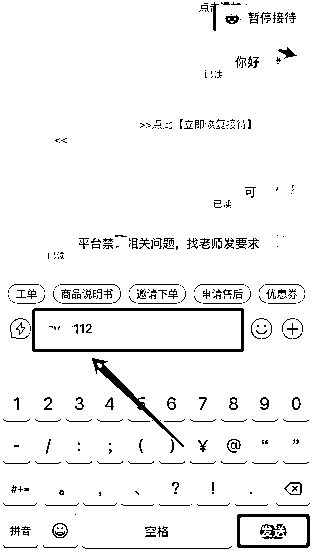

## （二）淘宝开店实操步骤

1.淘宝开店准备

淘宝的竞争大一点，需要设备、电脑和手机，资金、店铺保证金1000元【退店可退】其他费用：100-300 （运营资金）

开店环节：店铺头像、店铺名字、店铺保证金缴纳

名字】**文化、****文化设计、***文学社（名字好记一点、最好和所卖的产品有一定的关联）

头像】 U钙网有免费的头像设计，店铺的头像图片可以和名字相关联，给人一种专业的感觉

2.淘宝开店注册

3.淘宝商品标题

这里不要胡乱制作标题，测试安全的几个

【1】代写文章修改文案英文代笔写作服务撰写演讲稿征文读后感剧本创作

【2】文章撰写编辑润色修改征文读后感演讲稿情书剧本创作文案写作服务

4.淘宝详情页制作

淘宝做文章类目的详情页需要比拼多多详细一点。我们一般就是1张主图+3张详情页

这里推荐两个作图软件：【搞定设计】【创客贴】

上面有很多模板直接套用就可以：这里放一组我们常用的模板给大家参考

图1 图2

5.淘宝如何正确选择商品类目

类目: 教育培训>教学服务>>文章写作

6.淘宝发货细节

这个常用的解决办法就是客户下单以后发礼品包，客户签收后发送文章

7.如何进行线下引流

如图所示：

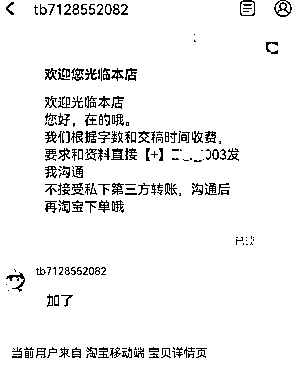

## （三）闲鱼写作开店开店实操步骤

闲鱼开店属于非常简单的，上手难度也比较低，但是这是目前我最喜欢的一个平台，低投入绝对的高回报，而且闲鱼上面做写作类目的竞争非常小。详细步骤如下、

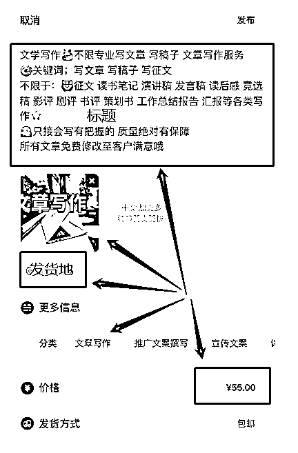

1.下载闲鱼app ,淘宝授权登录闲鱼app即可，新手下载以后不要更改任何信息就可以（新手避免胡乱编辑造成违规，确定不错的名字以后再写昵称）直接浏览闲鱼的主页面、功能按钮板块、好好熟悉一下闲鱼的后台。

2.标题发布：闲鱼是一个很自由的平台，标题没有固定的，只要不违规就可以，这里我提供常用的可参考：

【1】写作、改稿、润色、演讲、降重、调整还有考编咨询、倾诉皆可。建筑学硕士，事业编在编，我走过了一条可能你也想走的路，有问题可以来问我，工作闲暇尽心为你解答，帮你不走弯路，顺利上岸。

【2】文章写作服务 多砖业类型 包括不限于：征文 读书笔记 演讲稿 发言稿 读后感 工作总结报告 汇报等各类

，只接会写有把握的，所以质量绝对有保障。所有文章免费修改至客户满意哦 注：不接违反平台规定的文章

【3】写作不限于：征文 读书笔记 演讲稿 发言稿 读后感 竞选稿 影评 剧评 书评 策划书 工作总结报告 汇报等都可[比心] 只接会写有把握的 质量绝对有保障。所有服务采取一对一服务，包售后 服务满意为止！

3.商品图：这里推荐两个作图软件：【搞定设计】【创客贴】，闲鱼的商品图越简单效果越好。

图一 图二

4.发布地：这里建议选择哪些自带流量和光环，发达一点的城市，闲鱼上一个很实际的现象就是客户会看你商品发布地，例如一些硕士研究生找你做作业辅导的时候，他会根据你的发布地址来推测你有没有能力做他的单子。

5.发货：闲鱼上写文章不需要发货，写完直接选择无需发货，然后在微信上让客户签收再给他发送文件。

6.闲鱼引流方法

【1】图片引流，参见如下小红书

【2】电话沟通，让客户先拍下，然后打电话或者直接添加微信、

## （四）小红书写作开店实操步骤

小红书是一个高净值平台，环节比较简单，我给大家说一下我的基本逻辑：

小红书发笔记 引流 微信谈单成交

1.小红书平台注册

一个手机号就可以注册，不用实名认证（不用实名注册，小红书的用户都是在支付宝或者微信来付款的，不实名认证的好处是方便多注册账号）

2.小红书头像及其简介

小红书头像建议不用真人的，最后和微信头像一致（成交概率大增）

3.养号【由于做虚拟的比较敏感，养号还是有必要】

写作账号我的养号方法如下：每个小红书养号5-7天，每天养号3~4次，每次15分钟以上(刷刷写作相关的笔记，正常点赞收藏和评价，)，每天累计30分钟以上；

4.小红书笔记内容制作

【1】选题：这个板块是极其重要的，他取决于用户刷到你的视频之后会不会点赞？你选的这个标题是否符合他的心理需求？这个选题就是我们的一个标题。

【2】找素材：那这里我们该如何去找这个素材内容呢？找内容的渠道有抖音，快手，小红书。这些平台都是能搜得到的。那我们如何去判定这个内容的好坏呢？最重要的一点就是看他的点赞量，评论，收藏。如果这条作品的数据好，你就直接保存下来。然后用图片软件去做好看的图片。

【3】作图方法

1.用可画做，把内容提取出来，找你可画里你找好的模板，复制粘贴进去就行

2.用word文档做，做好点击打印（快捷键ctrl +P）截图即可，截图方法如下：

登微信：截图快捷键ctrl+ A

登QQ：截图快捷键ctrl +alt +A,这个截图可以用来提取文字，多用就熟悉了

注意：图文里的文字不要太小，尽量大而清晰，看这舒服就行

3.剪辑作品：

这里剪辑的话推荐:剪映。所以我这边直接用剪映这个软件来教你们如何剪辑作品。

4.发布作品：【和抖音一样】

发作品时间：中午11：30左右 下午：18：30左右

如果是一天发一条作品的，就放到下午18：30左右发

5.小红书引流方法

1.大小号引流（就是大号发作品，然后评论区用户咨询的时候@小号，通过小号发一个作品留联系方式）

2.图片引流（参见前面拼多多引流方法）

如图：

## （五）抖音写作实操步骤（与视频号相近）

两个平台的玩法一致，举一个例子即可，操作下来最大的区别就是抖音需要导流，视频号直接添加微信，抖音的难度高于视频号，这里就以抖音为例。

1.账号基础设置

【1】头像：建议做成漫画图，有利于增加视频平台用户的点击率。

找一张自己或者自己喜欢的的图片，然后去抖音剪同款那里搜索漫画图，选择一个适合自己的，自己也喜欢的就可以了。

【2】简介：模仿图中这些不错的同行，去改就行【注意】：不能出现可代写、帮写、一对一等词汇

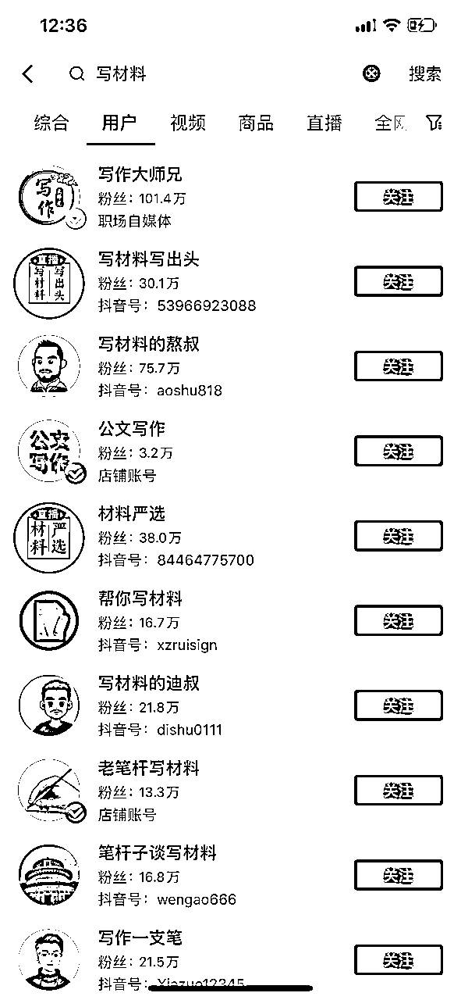

【背景】：下载一个图片设计软件，可画、稿定设计等等都可以做。如果你是需要做抖音背景图，你直接搜索抖音背景图即可。

注意：除了不能有代写，帮写此以外，不要出现引导加微信，加V这样的字眼。

基础设置完成以后就是如何制作优质的作品？

首先：在说如何制作作品之前，我想给大家说一下这个作品他主要的一个构成形式是什么样的？

一个优质的视频包括三个部分：

【1】选题

这个板块是极其重要的，他取决于用户刷到你的视频之后会不会点赞？你选的这个标题是否符合他的心理需求？这个选题就是我们的一个标题。

【2】视频

视频这个版块来说相当于也是重中之重吧，其实我们之所以以图片加视频的形式来做这个账号，是为了提高整个视频和播放的完播率， 这里呢就会牵扯到抖音的一个平台规则，我这里就不细说了。

【3】图片

这里的图片相当于我们制作作品的一个主体内容，用图片来制作视频，这后面的内容决定刷到你的用户，会不会给你点赞和收藏以及评论，在选图的时候一定要认真去准备。和你所发的作品内容能够相承接。

完成作品以后就是发作品：

发作品时间：中午11：30左右

下午：18：30左右

如果是一天发一条作品的，就放到下午18：30左右发

抖音引流方法：

1.创建粉丝群聊。设置小号管理员，管理员在群里回复消息，消息中留联系方式。

2.小号在评论区引导客户，小号改名为xx助手【大号助手】，相对安全一点。

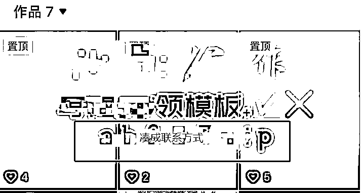

# 四：私域对接【微信】

## （一）私域打造

1.微信头像、昵称

【头像】推荐动漫网图

【昵称】xx老师 /xx学姐 / xx学社 等等相关的都不错

2.微信朋友圈封面

封面（与写作相关的就可以。简单清晰）

3.微信朋友圈内容

垂直写作领域

.（1）朋友圈围绕【业务】+【生活】+【感悟】去每日分享

.【业务】晒客户反馈图、成交图，如果新手期没有这些图的话可以从同行手里搬运。

.【生活】增加一些日常生活好看的图片，例如去哪玩的风景图、好吃的美食图等等

.【感悟】看过的好书、书中的经典句子、新闻的解读等等

目的：让朋友圈看起来更垂直更有温度一点，不要把自己打造成一个营销号，彰显自己的专业性的同时要让新来的客户感觉到你是一个活生生的写作老师，不是一个冷冷的中介，这样可以极大的提高成交率。

## （二）私域维护

1.如何谈单

首先与客户沟通，了解他们的需求和要求。

报价之前必问三个问题及话术

1确定写作类型、主题、字数、交稿日期。

【1】你好，咱这边需要写什么呢？

【2】需要写多少字呢？

【3】什么时候需要呢？

问清楚然后报价：报价我这我准备了详细的报价表，供各位参考

文章写作详细报价参考

2.常用话术

通过电商平台到微信的都是精准客户，成单很容易的，这里我针对棘手问题给出几个牛逼的话术给圈友参考，

以下话术可以直接套用：

举例子：客户A，我方B

【如果客户觉得贵】：

A:你这个太贵了吧！

B:回复：啊，有点超预算了吗，虽然我这个算不上市场上最贵的，但是我的写作价格绝不是市场上最便宜的，我只能给你保证不错的质量。 （先认可客户：相当于谈话的时候告诉了客户自己的门槛和标准，多数人心理都是，越贵的质量越好）

A:但是你这个也太贵了啊，算了，我考虑一下

B:嗯嗯，好的 【然后紧接着追问】

B：方便说一下咱这边预算多少吗？

A:xxx预算(如果预算满意，那就可以成交。如果预算不足，那就接下来的话术。

B:哦，是有点超预算了。那咱这边对质量的要求高吗？

A:写好一点/差不多就行

B:我写作的价格不是市场上不算太高的但绝不是最便宜的，因为我写稿的质量比较好，价格可能超你预算了。

到这个阶段如果客户和你砍价，那基本上就成交了，顺势给他降价一点就可以。这个阶段销售就很关键，适当的做一个销售角色，可以把利润增加15%以上，要让客户和你砍价，砍价就基本成了。

【如果客户担心被骗】

【1】 平台保障：

举例子：客户A，我方B

A:你们这个到时候收钱跑路怎么办？

B：哦哦，我能理解，有这个顾虑很正常，我也经常遇见很多客户反映这个问题，咱这边不用担心这个问题，我们这边支持店铺下单的，走平台保障，平台担保保护亲这边的权益。

【2】先付定金

A:你们这个到时候收钱跑路怎么办？

B：亲这边有这个顾虑太正常了，我们也经常遇见客户反映他们在其他地方下单以后遇到写手跑路的，所以我们支持了先付60%定金，写作完成以后录屏视频源文件内容和查重报告给您验收没问题以后再付尾款。

## （三）私域裂变

1.在日常的朋友圈更新中适度的增加朋友圈文案：感谢友友们的信任，推荐有红包哦

2.谈价借势裂变

很多客户会喜欢砍价的，借着他砍价然后优惠，装作很为难的样子让他帮忙推荐一下客户，效果巨好，如图：

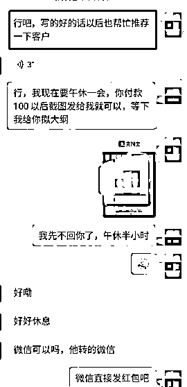

（四）私域用户画像

不同平台不同价格哦，由于所做的每个平台的用户群体不一样，同样的产品也能做出非常不错的价格，因此将不同用户标注不同标签用来区分是非常重要的。我的方法是注册不同的微信，微信A用来承接闲鱼、小红书和淘宝的用户，微信B用来承接拼多多的用户。因为微信A的客户价格偏高，可以比微信B的利润高出40%,左右。

# 五：写手招募与变现玩法

## 第1阶段：

找优质同行过度，就例如最开始的时候我是找淘宝上的大店来合作，他们赚一部分帮我写稿子，现在我体系成熟了，我成为了优质同行，就有很多同行往我这送单子，极大的扩充了我的体量。

## 第2阶段：

在开店的同时会不断有写手来应聘，制定规则，按你的需求来合作。

## 第3阶段：

高阶玩法，收费写手招募，这个玩法能够留下一群稳定的写手，做到一鱼双吃。而且这部分写手会是最稳定而且不会跑路的，极大的提高了自己内部团队的写作质量和写稿速度。通过长时间的供稿给这部分内部写手，他们也能通过写作赚到一部分钱，很稳定的双赢状态。

注意：不过现在chatGPT的冲击挺大的，能代替绝大部分写手、以上方法仅仅做参考激发灵感。

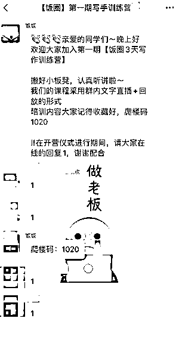

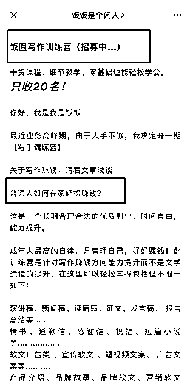

## 第4阶段

成为渠道 打造优质团队、主动链接和洽谈哪些小商家和大学生校园团队，成为稳定的写作供应团队：例如现在我就在往这个方向前进，合作了越来越多的同行，在这条路上也越来越完善了体系，收入也在增长。

这个行业上限很高，我们目前还在前进，希望能够探索出更多优质的玩法、后面阶段的玩法有机会再更新。

# 六、充分使用chatGPT

## 1.准备chatGPT账号

这里在星球上已经有非常多的项目都是关于chatGPT的解答和陪跑，而且我们已经有很多圈友上岸，然后这里就是充分的利用好gpt来提供稿件的质量和产量，大幅度降低写作成本就可以。关于chatGPT的深度理解参见其他圈友发的优质文章、

## 2.chatGPT写作指令玩法

【1】现在设定你是xxx角色

【2】现在需要按“xxx'来写一篇文章，拟出大纲

【3】按大纲写作

## 3.GPT的成果展示

【1】设定角色：根据你的需求来设定角色

【2】输入指令（这里输入的指令越详细越好、在使用GPT的时候把它想象成一个万能的写手，告诉他你的要求）

如果你还不能感受到GPT的强大，我简单的用咱生财有术星球来举例了一下，请看图：

如果你还不能感受到GPT的强大，我简单的用介绍生财来举例了一下，请看图：（简单输入指令写一篇介绍文章，全程写作不到10分钟便可以出初稿）

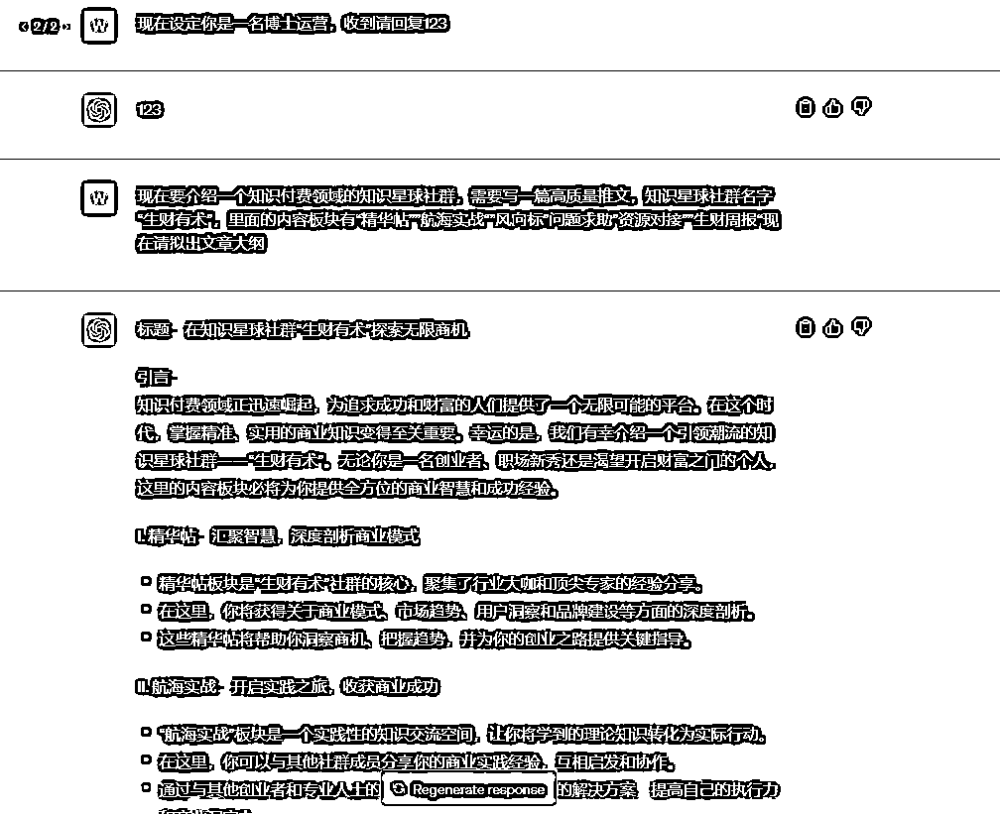

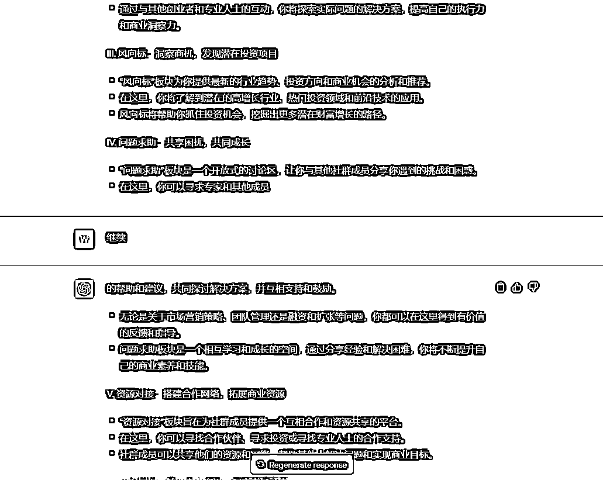

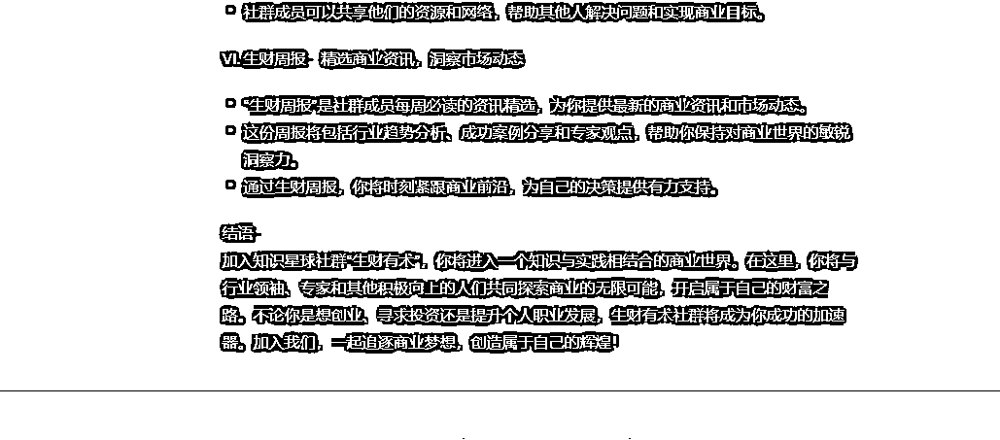

## 4.如何巧用chatgpt来保证文章质量

【1】切忌机械化复制

目前的AI始终是一个大型的语言模型，文字是模板化缺乏温度的，把他当做一个工具来使用效果更好，chatGPT写出来的文章不能照搬使用，适当修改，将内容变得口语化一点。

【2】根据客户需求将指令详细化

例如：我有一个客户是一名抖音机房搭建的自媒体博主，他找我连载他的自媒体招商账号的文章，他提出了他的需求是希望文章阅读量高一点，这就是比较泛的一个要求，因为他也不知道怎么样能够让文章阅读量更高。这种需要拿到长期合作的单子就肯定不能问他怎么能够让文章阅读量更高，这种情况客户没有给出详细指令的就只能自己做准备。这里将指令详细化有一个技巧：

网上搜索：自媒体招商账号爆文的一些相关内容，看看是不是他这种类型的博主需要有哪些技巧，具有吸引力的标题、有趣的场景、真实反馈的招商案例、具体的实操方法、等等一系列的指令就可以用得上。

【3】强化质优意识

我可以很自信的说目前我们处于这个赛道上服务质量赶超90%的同行，我在做实体期间一直受到一个服务理念的影响，那就是经常听见的那句话“客户就是上帝”，其实也得益于这个理念，我给团队非常多次的强调，我们的微信号就像一个实体店甚至优于实体店，精准客户进了你的微信号，那就是相当于一直在你店里坐着，在你店里下单的东西一定要以满足他的需求为基础，然后超出他的期望为目标，如果能坚持这个理念，我相信绝大部分同行也能像我一样回头率超70% ，

做文章写作行业有一个大忌，切忌做一次性生意。但凡是有找你需求写文章的客户90%以上都不可能只有一次需求，做好质量、做好服务你会发现客户频频回头，我们有很多客户现在找我们下单不止于10次以上，这种感觉真的很不错。例如我有一个客户，他的工作是的某医院的科室人员，他们的医院的公众号每周最起码需要写3篇关于医学科普的推广文，500-800字，我们给他写了他比较满意，现在已经连载12篇了，这种小文章收费85元一篇，500字交给写手老师一会就写完了。客户下单直接说写几篇，直接付款，都不需要多余沟通，这种案例太多，不做多余展示。

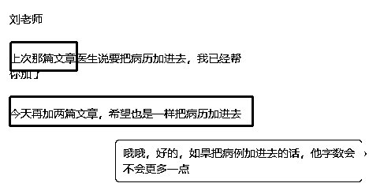

# 七：可能会遇见的项目风险

卖任何产品都分淡旺季，同样、做任何产品都会有一些坑和风险，这里我把所遇见的整理如下：

1.错误引流导致封店

这个问题是遇见的，在初期的时候我们由于平台规则不熟悉，错误的引流方式直接导致店铺被封禁，在操作的时候最好能够结合我已经提供的方式去优化和总结出适合自己的一套方法，如果不能总结出的话最好就直接用已有的方法。

2.电商平台打压期

这里最明显的就是315的时候，今年315的时候大量同行店铺被封禁，特别是淘系和拼多多，如果在这个期间被稽查到的没交平台规定的保证金的会直接封店，今年的315就是我的一波亏血状态，突然的一些封了好几个销量10w+的老店，这里一定要注意方法去规避。我拜访了很多同行以后终于找到了避坑方法：在即将严查期间到来的时候下架店铺链接，严查期间过去了再上架产品，这个方法让我有幸存活了两个大店。

3.禁接学术类型单子

当你开店以后你会发现有大量的精准客户，但是在这些客户中会有近40%,的回来咨询关于论文的，这里不建议去做、直接拒绝你会活的好好的，拒绝了所有关于学术论文方面的单子你会发现店铺越来越垂直、有助于你的店铺长存，有句话是这样说的“贪多嚼不烂”，精准的选好赛道，然后放大，你会越来越富有，借用@梁靠谱大大的一句话“一厘米的宽度，一万米的深度”那你就是一个领域的专家，同样，做好合规的垂直店铺，那你的店铺就是同类型店铺的大店。

4.被白嫖文章

这个是难免的，因为文章只要发过去客户就可以用了，想白嫖并不难，就目前我做过的所有行业中，我发现都会有亏损状态，写文章这东西难免会遇见的，你把文章发给客户以后他白嫖你，然后仅退款，这是会遇见的情况，这里我觉得把心态摆正，算在运营成本里面，能赚钱就得能承受有成本的亏钱，不过很好的一个点，这类型的客户很少。

# 写在最后

我是饭饭，感谢阅读到最后，如果文章对你有用的话可以在这个帖子评论区点赞留言，让我们混个脸熟，看完如果有疑问也欢迎在帖子下面留言，我会挨个解答。

目前角色是电商公司小老板，目前在电商和写作赛道深耕，开了多个写作店铺，在各电商平台摸索写作增收，目前年收卡在50个，希望今年在生财真诚分享，完成 破圈、提认知、实现踏入100个。

还有句话想和大家共享：

赚钱这件事本来就是不断的打破自己的认知然后重组思维，实操落地。

从0到1的这个过程应该是比较艰难的，但是我从去年的负债累累到今年的小有收入也就是突然找对了属于自己的赛道，在星球之中，做好筛选，选定适合自己的项目，强化自己的执行力，让钱追着自己跑。

原创：饭饭

注：禁止转载，仅供星球阅读