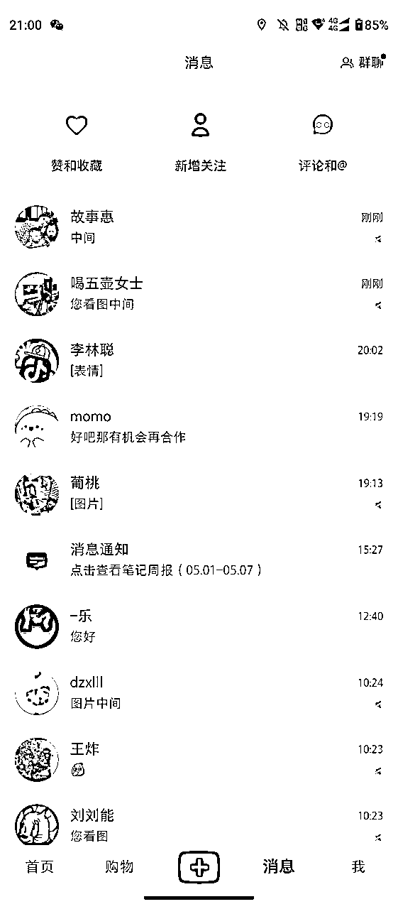
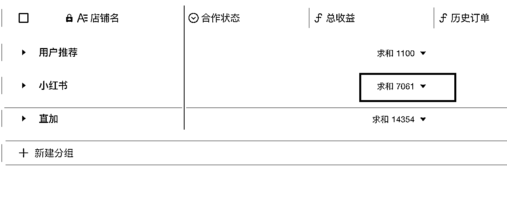
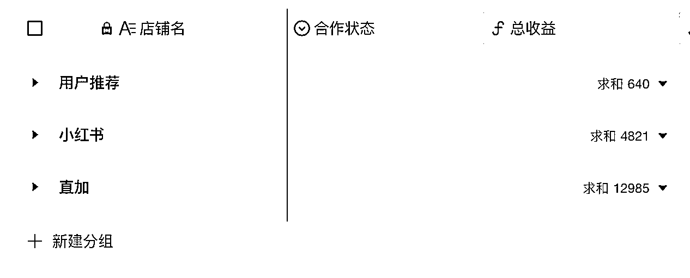
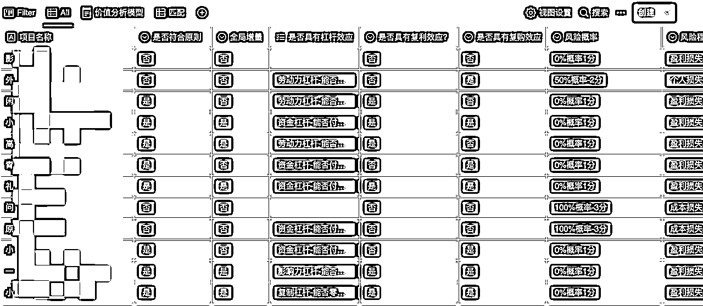

# 新手小白如何借助生财小航海每月多赚 2 万元（附：小航海项目筛选模型）

> 来源：[https://wchekk4hs9.feishu.cn/docx/Gn5NdifvBorUbdxvGl6ceQgXnpg](https://wchekk4hs9.feishu.cn/docx/Gn5NdifvBorUbdxvGl6ceQgXnpg)

## 一、自我介绍

各位圈友们大家好，我是郑州圈友毛韩。从 2020 年加入生财的小透明，到 2021 年 9 月份开始行动，再到如今跑通一个项目，并每月净收益约 2w 块。

而且每月还保持着近 20%的增长率，这中间的从 0 到 1 的过程我认为对我来说非常有价值，我想应该也适用于大多数新手圈友。

所以借助本次小航海的时机，写下这篇文章是我对这段经历的复盘，倘若能对同样是小白的你有一些帮助，那就再好不过了，同时也借此感谢河南生财群里大哥们，尤其是@凡灵逸尘 的指导，以及刘小排、明白等老师。

### 1、问题探讨

本文围绕几个问题给大家分享：

*   如何借助小航海赚到第一笔钱？

*   阅读精华帖的目的是什么？

*   如何筛选要报名哪个航海项目？

*   如何放大一个项目？

### 2、心态旅程

我是一个对赚钱这件事很感兴趣的人，从高中就开始做各种小项目，如应用试玩、彩票套利。在大学时，我也做过头条号、淘宝客。

但因为个人能力不行，只能从那些「钻漏洞」的项目中赚到一些钱，而那些比较正规点的项目几乎一份没赚。后来在工作的几年里，几乎一直都是 996，每天对工作充满激情，一心只想着把公司业务搞上去，也就没有心思去做副业。

等到后来公司不行的时候，又觉得只靠工资根本赚不了大钱，也是在 2020 年，我加入闻名已久的生财有术。刚加入生财时和很多圈友一样，早就久仰生财的大名，在 418 当天和大家一样迫不及待的以最低价进入。

进入生财后就开始看精华帖，发现各种各样的项目和玩法层出不穷，但好像这些距离我很遥远，仿佛在看电影一样，很虚幻。

看着大家各种年入百万、年入千万，或是成功跑通一个项目时，仿佛自己不属于这里，这一切如楚门的世界一样，只是为了我特意安排的一场“焦虑盛宴”。

这种焦虑感一直持续两个月，后来认为越看越焦虑，既然也找不到好项目，索性就不打开生财。直到有一天，我看到鱼丸发的朋友圈说小航海要开始，圈友们都可以报名参加。

此时我看到小排老师的蓝海项目挖掘很有意思，仿佛是为我量身定制的一样，正所谓缺什么来什么，于是我就报名参加入小航海。在小航海开始时，我拜读小排老师写的航海文档，那两天惊为天人。

*   原来赚钱这件事可以这样做

*   原来赚钱的技能是一系列模块的组合

于是从那以后，我就开始在空闲时间重新阅读精华帖、拆解引流渠道和搭建产品的方式及变现方式。但只有模块、没有在做的项目，有种打造好兵器却无用武之地的感觉。于是就按照小排老师教的方法论，在小红书挖掘蓝海项目。

### 3、项目挖掘

我的挖掘方法很简单：

1.  先随便找个词根，那时我刚好在某位圈友（记不清）的公众号看到了帮外卖商家删差评赚取服务费的项目

1.  于是我在 5118 搜索了相关的百度数据，百度上有很多关于这方面的新闻，所以收录页比较多，几乎和搜索流量差不多。

1.  但是本着在一个流量池不是蓝海，在另一个流量池可能就是蓝海想法（那时我在蓝海挖掘航海群里特意向小排老师请教过这个问题）

1.  我又搜索了小红书的数据，发现只有不到 10 条笔记，但是搜索流量并不低（具体多少确实忘记了，很久的事了）

1.  之后，我又经历了差不多一年时间的懒惰，才开始着手去行动。

### 4、项目测试

结果也很明显，我在开始做这个项目时，先找两位同行了解整个项目流程。随后开始在美团外卖 App 直接找到商家打电话，询问是否需要此项服务。

执行阶段：

第一天我打 13 个电话，就有一个商家表示要合作。但是鉴于做这个项目需要购买查差评软件、并且我还不太熟悉删除差评的具体操作，于是选择将业务外包，把我接到的单直接转给同行做。

第二天我打约 50 个电话，有 2 个商家表示要合作。

第三天我工作忙一天，于是在晚上直接用微信加商家电话，那天加了 20 个好友，有 1 个商家咨询的。

那时候，我光给同行介绍业务，都介绍至少 20 单。我的收费标准是每单 50 元服务费，同行是 40 元，这是我真正意义上靠方法论赚到的第一笔钱，约 200 多块钱。

后面熟悉业务，我拿着前面赚的钱买了个软件，开始自己给商家处理。

但那时候不太熟悉业务，确实损失不少客户。也刚好在去年，家里孩子出生，我也从公司离职，那时候这个业务每月已经可以赚 2000 块钱。离职后，我就想将这个业务放大，争取能覆盖每月支出。

### 5、项目放大

于是开始买手机、每天加微信、打电话，靠着这种直接的引流方式，每个月能赚到一万元左右。但是每天加微信打电话实在太耗时间。

而我又有孩子需要照顾，每天只有不到 4 小时时间可以自由支配。后来计算 ROI 有点低，就想需要换个引流方式了。刚好我在之前学习小红书引流的引流方法。

于是从 3 月份开始，我便在小红书引流，到目前为止，如果你去小红书搜索「外卖差评删除」，前 20 条笔记中至少有 5 条是我发的。

小红书渠道也让我每天都可以引流至少 5 个商家到微信，每月引流约 200 人。（其实现在我还没好好做，每隔几天想起来才发一篇笔记，并且只有一个账号）如图所示：最近 7 天才发了两篇笔记。

下图是 4 月份的总收益：

从小红书来源的客户收益 7000 元，从微信直加来源的客户收益 14000+，用户推荐的客户收益 1100 元，累计收益 22515 元。

下面是 3 月份的总收益：

从小红书来源的客户收益 4800 元，从微信直加来源的客户收益 13000，用户推荐的客户收益 640 元，累计收益约 18000+元，环比增长率 20%左右。

因此，这个项目到目前也算是步入了增长期，目前的重点就是放大收益。

我目前的规划有以下几个：

1.  增加小红书发帖数量及账号数量，争取能在小红书搜索相关关键词时，Top50 内有 40 条都是我的笔记，做到局部垄断单一流量池的局面；

1.  参加抖音 SEO 小航海，尝试以同样的操作垄断抖音相关流量

1.  再以同样的方式尝试垄断快手、微信搜一搜、知乎等其他 seo 相关的的流量

1.  针对现有的客户，扩展其他变现场景。如找做外卖运营的圈友合作，将项目调整下。（ps：我们现在拥有外卖商家私域流量约 3w+，合作过的客户有 200+，有相关资源的可以对接一下）

1.  了解其他行业如电商行业的差评是否有同样的需求

至此，我的经历算是介绍完，虽然没赚到什么大钱，但我认为我收获的价值并非是这点钱，而是一套方法论体系。刚好我是一个善于反思、善于提炼方法论的人。我就想为何不把自己的新手经历写下来，并帮助更多新手赚到第一笔钱呢？于是就写了下面这套方法论分享给大家。

## 二、方法论

这套方法论由我经历的四个阶段组成：

1.  初入生财：没日没夜地看几天精华帖。发现大佬如此之多、赚钱方法如此之多、项目如此之多，发誓今年一定要借助生财赚到自己的第一桶金。但当时的我只是"看"精华帖，至于这些精华帖对自己而言除了感官的刺激还代表着什么却一概不知。

1.  筛选项目：在看许多精华帖后，想立刻开始实战一个项目，于是在项目库挑选、筛查各种项目。这个项目做的人太多了，竞争太大；那个项目已经红海，收益不高；另一个项目天花板太低了，这都落伍的玩法了等等等，这都是我当时的 Filter。

1.  尝试动手：当真的确定好一个看起来似乎完美的项目后，却始终不敢开始行动、把手弄脏。原因如担心赚不到钱、担心还没开始风口就过去，亦或是从未相信过自己能够赚到钱

1.  更加焦虑：当真的跑通之后，如何放大收益？招人？投付费广告？还是其他的？那么多方式难以选择与自己项目更加匹配的。

这四个阶段似乎是每个生财新手都会有的经历，所以对于新手而言，如何用好生财、如何借助生财开展第一个项目、走完以上四个阶段是最重要的。

毕竟第一个成功的项目带来的正反馈与自信比其他任何时候来得都要猛烈。那么，每个阶段如何跨过呢？下面是我总结出来的一些心法。

### 1、第一阶段：初入生财-锻造武器

初入生财看几天精华帖后，你会发现几乎所有项目都符合一个最简单的商业模型「流量-产品-变现」，而这也是亦仁、涛哥、小排老师、明白老师这些老师们都说过的话，可以在他们的帖子中找到。

既然每个项目都符合这个模型，那么如何引流、如何搭建产品、如何设置变现方式其实就是最基本的武器。

关于武器库这篇，可以看明白老师的精华文和我之前写过的一篇文章。

https://wx.zsxq.com/dweb2/index/topic_detail/118511118582252

https://t.zsxq.com/0dAVx4L1I

于是，阅读精华帖的目的就出来了。前期阅读精华帖，目的就是拆解并学习圈友是如何引流、如何搭建产品以及如何变现的。

举个例子：当我们了解小红书资料引流项目相关帖子时，按照流量-产品-变现模型来拆解，你会得到以下三部分信息：

1.  流量：在小红书铺设关键词，来获取搜索流量

1.  产品：产品是个人微信号为载体的虚拟课件和其他相关课件

1.  变现：变现是直接通过微信售卖

当我们外卖 cps 相关帖子时，同样按照模型拆解，可以得到以下三部分信息：

1.  流量：通过投放公众号广告、外卖小哥广告来获取流量

1.  产品：产品是以公众号为载体搭建的领券小程序

1.  变现：变现是让用户直接在公众号和小程序领券下单

当我们拆解完两篇帖子后，会得到共计 6 个模块。当我们要去做其他项目时，其实只需要把这几个模块拼在一起，就能得到一个新的模式。

比如，我们同样去做小红书资料引流：

1.  流量：流量可以以小红书搜索流量为主，再去测试投放公众号广告，毕竟微信指数显示微信搜索流量同样很大

1.  产品：产品我们可以以公众号为载体，同时加上微信小程序下单自动发货，这样能够节省很大的人力成本

1.  变现：同上

这还只是只拆解了两篇精华帖得到的 6 个模块拼接，生财有近 4000 的精华帖可以拆解，如果先花 1 个月时间将每篇都拆解完，能得到多少个模块？

有了这些武器后，无论在战场遇到什么情况，不能手把拿捏、也算是游刃有余。即便是我们没有彻底掌握某个兵器，但至少当需要用到时，你会想起来"有个兵器能够战胜对方"。

如果你真的拥有了至少 10+个流量渠道，你会发现这些引流方式都有一个规律，这个规律我称之为“流量形态”，它们分别属于不同的三种形式：

1.  关键词——通过关键词链接到用户。如 SEO，我的规划就是做关键词相关的流量

1.  关系链——通过关系链链接到用户。如微信裂变、如做外卖 cps 在美团商家群发引流帖子就是用了「商家」这个关系链。

1.  算法推荐——让算法将自己推荐给目标用户。如短视频平台。

1.  有人会问：知道了，然后呢？ 然后很简单，你只需要举一反三，比如学会如何寻找关键词、如何铺设关键词，那是否就掌握了「关键词」的流量密码？

### 2、第二阶段：筛选项目-明确战场

有了「流量、产品、变现」模块后，就相当于士兵有了武器。但战场在哪里？那么多战场和制高点，我到底该去攻打哪一个？很多人又迷茫了。生财项目库有那么多项目可以选择，到底该选择哪个项目呢？

在生财中其实有很多讲如何判断要做哪个项目的精华帖：

1.  我最喜欢的小排老师的两个帖子

https://wx.zsxq.com/dweb2/index/topic_detail/182844115125482

https://wx.zsxq.com/dweb2/index/topic_detail/184214255522812

1.  战劲老师的帖子

https://wx.zsxq.com/dweb2/index/topic_detail/241158845554181

但是你会发现一个问题，老师们好像看一眼就知道一个项目的全貌、并且能力、资源方面都能达到项目要求，所以在他们选择项目时，摆在面前的是几乎所有可见的项目，所以老师们是在"挑选"项目。

但新手不能，新手还没有那种商业"网感"，并且无论是个人能力还是拥有的资源都比较有限甚至没有，所以新手选项目，是"筛选"。只要能筛选到 1 个自己能做的项目，其实都算谢天谢地了。

举例：假如有一个红利期项目，要求会编程、初期投入成本 10w、要求团队至少 30 人，大佬们直接就做了，但普通人拿不出这么多钱和团队。 再比如小航海中的美团电商要求单店铺保证金 5000，学生党大多数拿不出来，但打工人肯定可以做。 再比如做闲鱼需要做客服，时刻盯着后台，还有主业的职场人肯定不合适，但自由职业就可以。

所以，老师们判断项目的标准其实和新手不太一样，老师们更加关注项目本身的风险及盈利，我们新手更应该关注自己的能力和资源和项目是否匹配。

于是我就根据老师们提到的「判断一个项目行不行的因素」，又结合自身经验构建出一个「项目筛选模型」，用来辅助我筛选项目。

这个模型直到现在我依旧在用，而且每隔段时间我都会有意识地再填入一些参数、并修改一下标准。模型很简单，其实只是一系列参数组成的表格，目前覆盖了近 20 项参数。

### （1）项目筛选模型参数

* * *

*   [ ] 项目名

*   [ ] 一句话描述：如：在小红书引流搜索流量，卖虚拟资料变现

*   [ ] 是否能创造全局增量、所有角色都能获得价值：这个问题来源于刘润老师的文章，在我看来在初阶生财可以不用考虑，我也只是当成理想目标在寻找。

*   [ ] 是否是违法违规、损人利己、钻规则漏洞的项目：这个问题来源于我以前的经历。如果你做过薅羊毛、灰产相关项目，就该知道每月换一个项目、和平台规则对抗是多么痛苦的一件事。

*   [ ] 风险评估：主要用于评估风险

*   [ ] 风险概率：这个项目有多大概率有风险？比如会被请喝茶？比如外卖删差评就是灰产，有风险概率。

*   [ ] 风险程度：如果有风险的话，损失程度如何？是只会损失盈利？还是成本也会损失？亦或是损害名誉、倾家荡产？比如做割韭菜的 IP 就会损害名誉及信用。

*   [ ] 收益评估：主要用于评估收益

*   [ ] 反馈周期：多久见到第一块钱？收获正反馈？对新手来说正反馈很重要。

*   [ ] 最高收益：你预测这个项目最多能赚多少钱？天花板多高？

*   [ ] 附加价值：主要用于评估项目的积累。

*   [ ] 是否能积累到货源、资源。比如做无货源电商就可以积累到一些性价比较高的货源。

*   [ ] 是否能积累到人脉、粉丝。比如做外卖删差评就可以积累到私域流量粉丝

*   [ ] 是否能积累到专业能力。比如做英文工具站就可以积累到编程和搭建网站的能力

*   [ ] 是否具有杠杆效应&复利效应&复购效应

*   [ ] 杠杆效应：这个项目能否利用到杠杆？商业杠杆有四种：劳动力、资金、影响力以及可 0 边际成本复制的产品。

*   [ ] 复利效应：这个项目是否存在复利效应？简单点讲：今天做的事是否会让明天的你更轻松？或者更赚钱？

*   [ ] 复购效应：这个项目是否会产生复购？比如外卖删差评的复购效应很明显，几乎合作过的客户都会继续合作。

*   [ ] 市场评估：

*   [ ] 持续周期：这个项目会存在多久？其实以我们的视野肯定看不到全貌，但是我们也可以给项目设置一个大致区间，比如 1 年、3 年、10 年以上、30 年以上

*   [ ] 市场渗透率：当前需求/需求总量，主要针对需求端、用于判断是否是增量市场。

*   [ ] 供需状态：当前供给/当前需求。主要针对供给端、用于判断是否是红海。

*   [ ] 优化空间：产品优化空间有多大？如果市场同行都特别强，而自己又特别弱，那可以再斟酌斟酌。

*   [ ] 能力评估：主要评估自己是否有能力和资源来做。

*   [ ] 所需技能：是否重新学习至少 1 个技能？

*   [ ] 是否需要重新学习行业知识？比如你从未做过淘宝，要去做淘宝无货源，那就需要从头学习行业知识。再比如从未出海看过，那英文工具站对你来说显然比较困难。

*   [ ] 是否需要重新学习一个技能？如果你从未剪过视频，那去做视频号带货就需要重新学习剪辑。

*   [ ] 所需资源：是否需要粉丝货源、已有产品等

*   [ ] 是否需要有私域流量粉丝。比如快团团要求有粉丝。

*   [ ] 是否需要有货源。比如闲鱼等电商项目，如果有货源就会更好。

*   [ ] 是否需要有自己的变现产品承接。比如抖音 SEO 的航海，如果你现在什么产品都没有，参加这个航海只是能学到 1 了个引流方法，但依旧需要有自己的产品承接。

*   [ ] 所需时间：

*   [ ] 每天耗时多久？比如有些项目需要全天、有些项目每天只需要 2 个小时。对于部分还有主业的圈友来说显然只能选择 2h 的项目。

*   [ ] 是否需要随时紧盯？比如电商客服。对于还有主业的圈友来说就不合适。

*   [ ] 所需成本：首次投入大概多少

*   [ ] 比如有些圈友是学生，一个店铺 5000 保证金确实不好拿出手。

*   [ ] 个人评估

*   [ ] 是否符合优势。

*   [ ] 是否符合兴趣。

* * *

### （2）如何选择合适的项目

有了上面这个筛选模型，我们只需要根据自己目前的情况筛选不同参数，并根据参数重要性进行优先级排序，就可以得到一个不错的且符合自己的项目：

我通常的操作流程为：

1.  先筛选自己的原则。比如违法违纪的决不能干，所以先筛选

1.  再筛选自己的能力。将上述能力评估的每一项都根据自己目前真实情况筛选一下

1.  再筛选收益。先筛选收益后筛选市场的原因是，一个项目能否赚到钱更取决于自己的能力、而非市场多大，至少对目前的我来说是这样的。

1.  最后筛选市场。

筛选完之后你可能会得到一个或几个项目，如果一个项目都没有过滤到，那么你需要考虑三个问题：

1.  是否是自己的条件太苛刻？filter 太多？可以尝试降低一些标准或者取消一些条件。毕竟 filter 太多是找不到项目的第一个原因（源自小排老师文章 https://wx.zsxq.com/dweb2/index/topic_detail/185255552411582）

1.  是否是看到的项目太少？可以再去项目库翻翻、多看一些项目

1.  是否是对项目不了解？所以在填入对应项目的参数时不正确？如果是，可以再去详细了解一下圈友们的帖子。

拿我自己举例，我最初的筛选条件是：

1.  持续周期至少 10 年

1.  要求启动成本低于 1w

1.  每天耗费时间 2 个小时内

1.  不需要有粉丝、货源等资源

1.  反馈周期也就是最快需要在 1 个月内见到钱。

经过筛选后我的项目库匹配到 0 个项目，是的，没有一个符合的。但是当我把持续周期改成 1 年时，就有好几个项目可以做。比如小红书资料引流、比如闲鱼无货源。

所以作为新手，不用非要筛选长期项目才做，没有能做一辈子的项目。在你没有资金、没有资源、粉丝和时间的时候，首先要考虑的是这个项目你能不能做、是自己能力是否匹配，其次是能否积累一些资源，好为下个项目做铺垫、其他都是次要的。

多说一句：其实在我看来积累比收益更加重要。积累能让我步入下一个阶层，但收益不能。钱只能判断我现在有钱，积累才是让我未来更加值钱的。

创业做有积累的项目和无积累的项目区别就像"在厂里打螺丝和做技术员的区别一样”，做技术员可以积累技能、技能可以迁移到其他公司，而打螺丝只能赚到钱、什么也积累不了。所以打螺丝的要"换项目”的话，只是换个厂打螺丝。

如果你已经准备好武器库，不妨试着搭建一个项目过滤模型。或者你也可以先筛选项目，再根据项目去打造趁手的武器。两者顺序并不冲突。

如果你没有时间搭建过滤模型，我已经替你搭建好了一个基于「本次 5 月小航海」的筛选模型。你可以直接利用筛选模型筛选出更匹配自己的小航海项目，直接开干。

使用方法：

* * *

1.  用电脑打开筛选模型：https://wchekk4hs9.feishu.cn/base/TpsBbwxhYaplTWsUGmpc6k6QnXc

1.  点击右上角三个点-创建副本，到自己的飞书文档中

1.  根据自己目前的情况，筛选模型中每个参数

* * *

请注意：

1.  模型中所有项目的参数均为我个人认知，你可以根据自己的认知和情况，修改每个项目的参数

1.  模型中所有参数均为我个人认为比较重要的参数，你可以根据自己的情况，新增或修改每个参数

* * *

### 3、第三阶段：勇敢行动-把手弄脏。

拿起武器也确定战场后，下一步需要做的就是冲锋陷阵、上阵杀敌，拿下一个又一个高地。但据我个人经历来看，大多数人在这还是会遇到问题。

虽然一切都准备就绪，但有些人还是觉得不够全面。我怎么判断我能打得过面前的敌人？我怎么确定这个战场是不是已经和我想象的不一样了？我又怎么保证自己一定能拿下高地呢？

一句话：开始行动、遇到问题、解决问题。因为行动就是这么简单，简单到一句话就能说清楚。

* * *

比如你要做淘宝蓝海，别管其他的，先注册个店铺、随便上传个商品；

比如你要做小红书，别管其他的，先注册个账号、随便发个笔记；

比如你要做抖音，别管其他的，先注册个账号、随便发个视频；

然后你会发现，怎么没流量呢？接下来就是想办法获取流量； 之后会发现，怎么有浏览但没转化呢？那就想办法优化转化率；

* * *

总之，就是立即开始行动、遇到问题就想办法解决。自己解决不了就花钱解决、花钱买不到就找人请教，总会能解决。除此之外，你也可以参考《福格行为模型》设计一下自己的行为。

简单点讲，福格行为模型=动机 x 能力 x 触发物。（可参考书籍《福格行为模型》）当你遇到挫折、或者行为与预期不符的情况时，可以通过这个模型来分析一下自己为什么没做到。

举例：我在做闲鱼，今天要上传 5 个品，但我没有完成。

* * *

动机：是我不想上传吗？为什么？我对做这个项目没有动力吗？为什么？

能力：我不会上传吗？还是太过繁琐、耗时，导致增加了阻力？如果是，那我能否借助软件上传？或者让别人来做？

触发物：是我忘了上传吗？我能否设置提醒，提醒我做这件事？

* * *

同样的，这个模型也可以用于其他任务中，如学习、工作等等只要是需要发生行为的任务，都可以用这个模型分析。

### 4、第四阶段：放大项目-增加盈利

到这里，我们假设你已经跑通了第一个项目，目前是如何将项目放大、赚到更多钱的问题。如果你在生财搜索「放大」这个词，把所有帖子看一遍，会得到以下几个结果：

* * *

1.  矩阵：通过更多账号来形成局部垄断，获取同一个流量渠道的更多流量；

1.  投放：通过投放 ROI 为正的广告来获取更多流量。

* * *

你会发现，这些点说的都对，但是怎么用到自己的项目上？如何选择这么多项目放大方法呢？正好我最近也在处理自己项目上的放大问题，分享一下我的方法。

通常情况下，一个项目有两种放大方法：

* * *

1.  业务本身：放大业务本身，简单点讲就是放大当前业务的盈利。

1.  其他业务：再做其他关联业务，简单点讲就是将当前业务迁移、或扩建。

* * *

### （1）业务本身

要从业务本身，在不增加其他业务的情况下，放大业务的盈利，我们要清楚一个项目的收益的增长模型是什么。

增长模型是用户增长领域的专业名词，指将一个商业项目用一个公式代表，再将公式拆解后得到增长模型。（来自个人随口瞎说）

举例：小红书资料引流这个项目的最终指标就是收益。

* * *

最终指标：收益

*   收益 = 客单价 x 支付人数

*   收益 = 客单价 x 支付率 x 咨询人数

*   收益 = 客单价 x 支付率 x 咨询率 x 添加好友人数

*   收益 = 客单价 x 支付率 x 咨询率 x 添加率 x 小红书引流触达数

*   收益 = 客单价 x 支付率 x 咨询率 x 添加率 x 小红书引流触达率 x 私信人数

*   收益 = 客单价 x 支付率 x 咨询率 x 添加率 x 小红书引流触达率 x 私信率 x 阅读量

* * *

我这个模型非常简单哈，如果实用的话还可以将新老用户区分开，因为大多数新老用户的转化率是不同的。

当你拥有了这样一个增长模型后，你会发现放大基本业务的收益其实很简单，就是将中间的每一步转化率都提到最高、然后把最源头的流量也提到最高就行。

* * *

*   把支付率提高：想办法增加咨询人数的支付率，从而提高收益。比如每隔 2 小时给咨询过的客户催单。

*   把咨询率提高：提高添加好友后的咨询率。比如通过主动私聊，提升咨询率。

*   把添加率提高：提升私信发联系方式的转化率。比如使用自动回复软件做到 1 分钟内回复用户私信消息。

*   把私信率提高：提升浏览用户的私信率。比如可以在评论区引导用户私信、也可以对感兴趣的用户主动私信。

* * *

上面这个案例我只说了转化率，那流量如何提高？其实一样可以把引流业务作为一个产品来看，拆解为增长模型。

还拿小红书举例，小红书流量大小的唯一判断标准就是阅读量。

* * *

*   阅读量 = 免费阅读量 + 付费阅读量

*   阅读量 = 推荐阅读量 + 搜索阅读量 + 同城阅读量

*   阅读量 = 推荐阅读量 + 单个关键词流量 x 点击率 x 单篇帖子覆盖关键词数量 x 单账号帖子数量 x 人均账号数 x 客服人数

*   单个关键词流量：这个因素不受我们控制，可以忽略。

*   点击率：通过优化图片、优化标题来提升点击率

*   单篇帖子覆盖关键词数量：通过覆盖更多关键词来获得更多关键词的流量

*   单账号帖子数量：很好理解，多发帖子就对了

*   人均账号数：多运营一些账号。其实就是所谓的矩阵打法

* * *

可以看出，无论是产品本身还是流量入口，其实都可以作为一个单独项目去拆解为增长模型，甚至于客服数量这个指标也可以拆解为增长模型。

* * *

*   客服数量 = 当前客服数量 + 新招聘客服数量

*   客服数量 = 当前客服数量 + （A 渠道招聘数量 + B 渠道招聘数量）

*   客服数量 = 当前客服数量 + A 渠道招聘数量 + B 渠道沟通人数 x 面试率 x 入职率

* * *

放大一个项目业务本身的收益，就是将每一个环节的转化率都提到最高，同时将最源头的流量提到最高即可。

如果流量不够就努力引流、如果渠道流量总量不够就挖掘另一个流量渠道。至于如何挖掘更多流量渠道？请参考上方「兵器库」部分。

### （2）扩展业务

不过，上面所讲的是放大项目中主要提升业务本身收益的方法，如果你的项目已经将上面的玩法打通，其实还有第二种放大方法，那就是扩展其他业务、增加变现方式。

就像小米的烤红薯业务一样，使劲挖掘同一类用户的更多价值。

* * *

*   假如你是做小红书幼师资料的，你也可以找人开个幼师升级课、幼师考证课，以此增加变现收益。

*   假如你是做淘宝蓝海的，你也可以在 pdd 卖同样的产品，以此增加变现收益。

* * *

如果要把这些方法归类到同一个模型中，我总结出以下几个方式：

* * *

1.  业务迁移：

1.  针对同一类型用户增加上下游其他业务：如小红书幼师资料做幼师考证课程

1.  针对不同类型用户做同样业务：如本地相亲的新开展中老年相亲业务

1.  变卖流量：帮他人打广告。如做直播带货的除了带货本身，还可以在场景里加入其他曝光广告

1.  卖影响力：贴牌、代理、加盟

1.  培训：卖商业模式，把同样的项目卖给别人一起做

* * *

举例：如果你是做小红书资料引流的

业务迁移：

1.  你可以利用好现有流量，结合他人的课程做幼师考证课程；

1.  也可以将同样的项目思路用到「考公、考证」等其他项目；

1.  变卖流量：如果你没有精力再去做幼师考证课程，也可以给做课程的人导流，卖流量

1.  卖影响力：甚至，你可以成立一个资料品牌，招收合伙人一起做这件事

1.  培训：当然，如果没有品牌、也不想维护品牌，可以直接把当前的项目给卖掉，做培训

* * *

举例：如果你是做外卖 cps 的

1.  业务迁移：

1.  你可以利用好现有的流量，和商家合作做霸王餐业务；

1.  也可以针对现有流量，增加其他的业务场景如打车返利、淘宝客等；

1.  变卖流量：你可以在小程序或公众号给别人打广告。

1.  卖影响力：你可以设置分佣，招募代理。

1.  培训：你可以将整个项目卖给同样想创业的人。

* * *

举例：如果你是做本地相亲的

1.  业务迁移：

1.  可以和婚纱店、金银店合作，帮他们引流要结婚的新人

1.  可以开展中老年相亲业务

1.  变卖流量：可以在小纸条背面印上本地其他商家的广告

1.  卖影响力：可以在其他地区利用品牌影响力招募合伙人

1.  培训：可以将整个业务卖给其他地区的人一起做

* * *

当然，还有可能你的项目并不适合这个业务迁移方法，不过你也可以根据这套迁移方法的原理思考更适合自己的。

这套迁移方法的本质是：

* * *

1.  首先我们假设现在已经跑通、并获得一些资源。毕竟能做到这一步要么已经积累了一波粉丝，要么积累了一套货源。

1.  粉丝=流量，货源=产品

1.  当你拥有了流量，那么就可以考虑针对同一用户群体，扩展其他业务

1.  当你拥有了产品，就可以考虑挖掘其他类型的流量，增加用户覆盖范围

* * *

## 三、最后总结

总结一下上方提到的所有内容：，新手赚第一笔钱会经历的四个阶段及解决方案：

* * *

1.  第一阶段，初入生财-锻造武器：多刷精华帖、并拆解为不同的武器，可以直接用表格记录。

1.  第二阶段，筛选项目-明确战场：根据自己的经验搭建或直接使用我为你搭建好的项目库筛选模型，筛选更适合更匹配自己的项目。

1.  第三阶段，勇敢行动-把手弄脏：开始行动→遇到问题→解决问题

1.  第四阶段，放大项目-增加盈利：首先根据增长模型想办法扩展「业务本身」的盈利，其次筛选适合自己项目的业务扩展方式，增加其他盈利。

* * *

文章出现的所有链接：

1.  《如何通过分析成功案例，帮自己建立赚钱清单》https://wx.zsxq.com/dweb2/index/topic_detail/118511118582252

1.  蓝海项目挖掘蓝海复盘 https://t.zsxq.com/0dAVx4L1I

1.  如何判断自己的创业项目好不好？https://wx.zsxq.com/dweb2/index/topic_detail/182844115125482

1.  判断项目行不行的极简方法 https://wx.zsxq.com/dweb2/index/topic_detail/184214255522812

1.  如何分析一个互联网项目的可行性？能否值得去做？https://wx.zsxq.com/dweb2/index/topic_detail/241158845554181

1.  为什么你进了「生财有术」，还是赚不到钱？https://wx.zsxq.com/dweb2/index/topic_detail/185255552411582

1.  5 月小航海项目筛选模型 https://wchekk4hs9.feishu.cn/base/TpsBbwxhYaplTWsUGmpc6k6QnXc