# 视频号还能做吗，三个月通过视频号赚20W

> 来源：[https://k93b5ikes3.feishu.cn/docx/I8BLdIIfbobzkYxCLGBctYqbnae](https://k93b5ikes3.feishu.cn/docx/I8BLdIIfbobzkYxCLGBctYqbnae)

大家好，我是橘子海，2021年加入生财有术，在21年底辞职，去年初开始做短视频电商卖货，目前全网有茶业IP粉丝15W+，但让大家失望了，卖货成绩并不好。

去年5月份接触了视频号，前期操作和大家一样，通过软件选品发视频，视频爆了开直播，这种情况一直持续到12月左后，靠数量也博得了几个概率，运气好的情况下一个月也能赚几万块钱，难点在于选品和素材。

今年1月份开始转换了一下思路和方法，不在追求爆款，也不开视频号小店和直播，主要是懒和能力有限，直播对个人来说成本太大了，但我发现收益也并没有减少。关于选品的方法星球积累了非常多的资料，这里不在赘述，我着重跟大家分享一下我的操作方法。

我主要做的是一款农村家庭使用的大型设备，算是高客单价产品，总的两个型号，一个698-938，一个1588，其实两款成本相差并不大，我为了区分高低所以才把定价相差大。便宜款的利润在30%左右，1月份到现在出了1100多单，退货的不多，退货运费个人承担，在200左右了。

### 一、选品

我们都知道视频号消费人群主要是30+，二三线城市偏多，但一些常见的商品比如日用服饰食品等，做的人非常多，真的是需要靠运气才能跑出来。

在视频号除了比较常见的红海类目，我们更应该关注农村下沉市场，这些人对抖音深恶痛绝，过年回去都能听到他们抱怨抖音对小孩子影响太大了，并且他们从来不看抖音的，但是总要有打发时间的东西，就会常用微信。

所以选品我们可以着重关注一下这部分下沉市场，并且实际数据都不错。比如农村的设备，苗木果树，农机农具等，

如果是农村的，关注一下家里都有什么设备。

关于价格，有人说网上上千的东西比较难卖，价格贵的没人网上买，但情况不全是这样，比如农村买台简单的粉碎机在乡镇一般都要上千的价格，但是拼多多可以便宜一半，还有些偏远山区交通不便的，乡镇没有卖的，有钱也买不到的，都是一些机会。

### 二、素材

#### 1、IP，通过IP去找素材

这几年我们一直都在说要做IP，IP能长久一点，那就直接去搬运IP，不必追求爆品。

直接搬运别人的IP不就可以帮你快速测试出来吗？至于跳真人认证，基本没遇到过，遇到过按照提示找同性别人认证也都能过。

没有技巧，只能去多刷，通过抖音搜索行业，选择人那一栏，会出来非常多的，然后挨个去看，找真人IP出镜属性比较强的，粉丝量可以找10W甚至5W以下的最好，这种大概率背后是个人或者没有很大的团队。到目前为止我还是直接搬运，没有二次剪辑，找到IP以后搬运整个账号内容，到你觉得差不多可以原创就直接真人自己出镜原创，完美过渡。

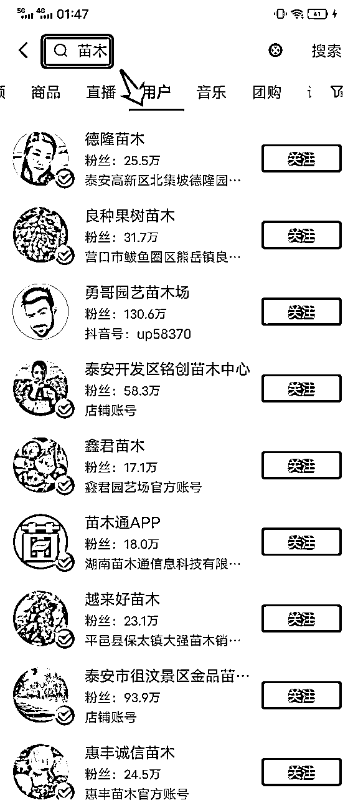

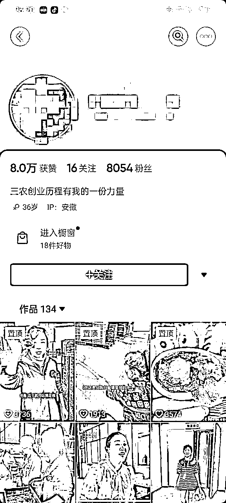

#### 2、通过素材反推去找商品，先找素材再决定品

商品是基于素材传播的，不用去测品什么火不火，能火的只有素材，不是品。

想想农村人喜欢看什么，需要什么。抖音里有个非常好的例子，相信大家都知道的沈丹的画面。

只要选对人群，素材没什么问题，并且他的账号没有在视频号发过，肯定有大概率能火，退一万步他的素材不火，直接换下一个达人IP的素材接着发。

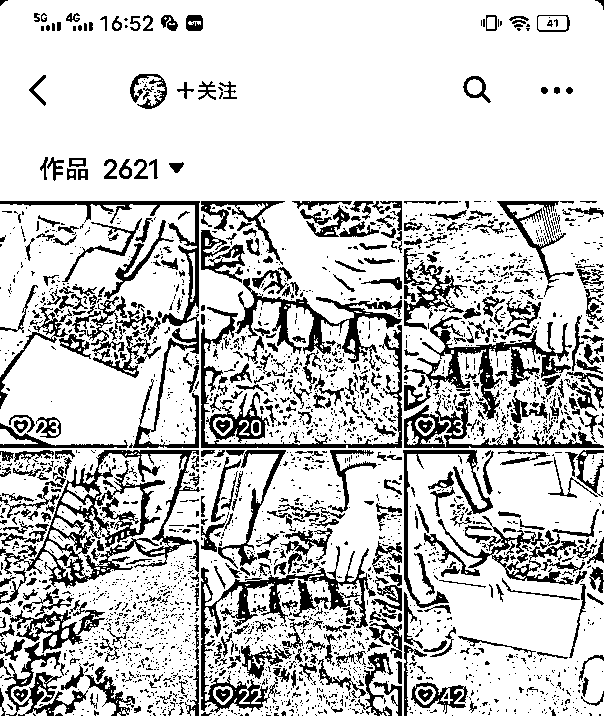

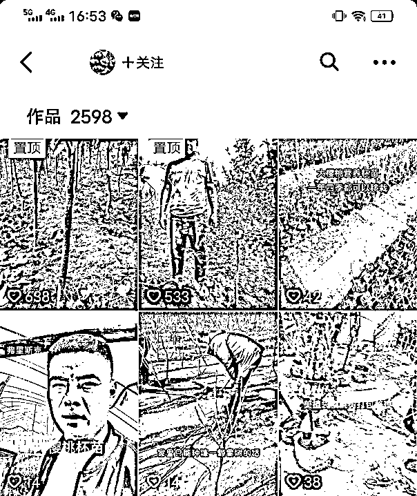

#### 3、寻找低粉爆款的达人

通过考古家去寻找，选择达人，带货标签，再选择粉丝数，最后选择视频达人，这样就会出来很多低粉但是带货数据还不错的达人，这些大部分都是个人相对垂直的IP号。

看第一个才1.5W粉丝，但是带货金额50W+，要不就是品不错，要不就是素材不错，总之是非常优质的研究对象，如果视频号没有他的素材，就能直接搬运过去。

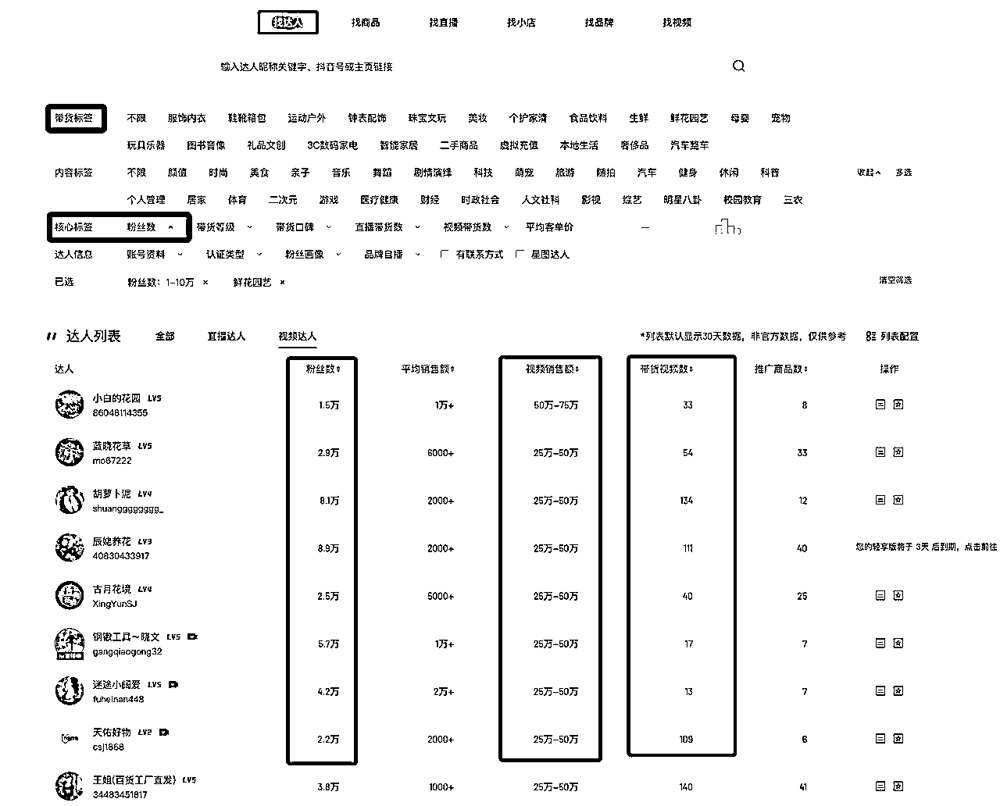

#### 4、商品制作过程展示类的画面

人都有猎奇心理，比如你看到肥皂，会不会好奇是怎么制作出来的，上面的字怎么雕刻的，怎么包装的，环境怎么样。

工厂、流水线、展示工艺、特殊技艺的视频在视频号上也很容易火。

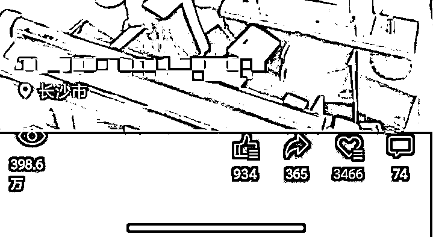

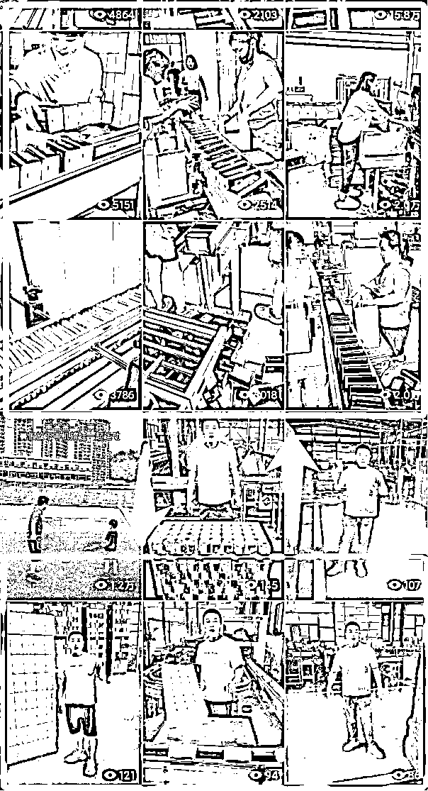

上面这张图刚开始发的数据都比较差，后来只发了流水线工作的视频，数据对比很明显，最后也有连续好几个百万的播放。但也要注意，发工厂发流水线，可能吸引来的客户是找工作的比较多，下面评论和私信都是在问招人。

### 三、视频号包装

对于农村中老年人来说，电话依然是他们的主要沟通方式。

在视频号主页可以直接留微信和电话依然是这类人群的主要转化方法，并且前面提到农机等，价格一般比较高，普遍800+以上，开视频号小店确实不划算，选品中心这类产品也比较少，并且决策周期会比较长。

简介里留电话留微信，突出我是工厂源头就可以。（还有种账号名称直接设置成电话的，这个要看运气，有时能通过有时不行）

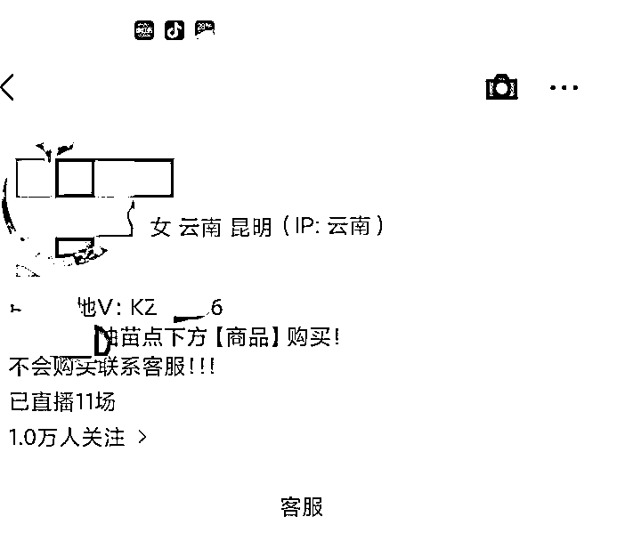

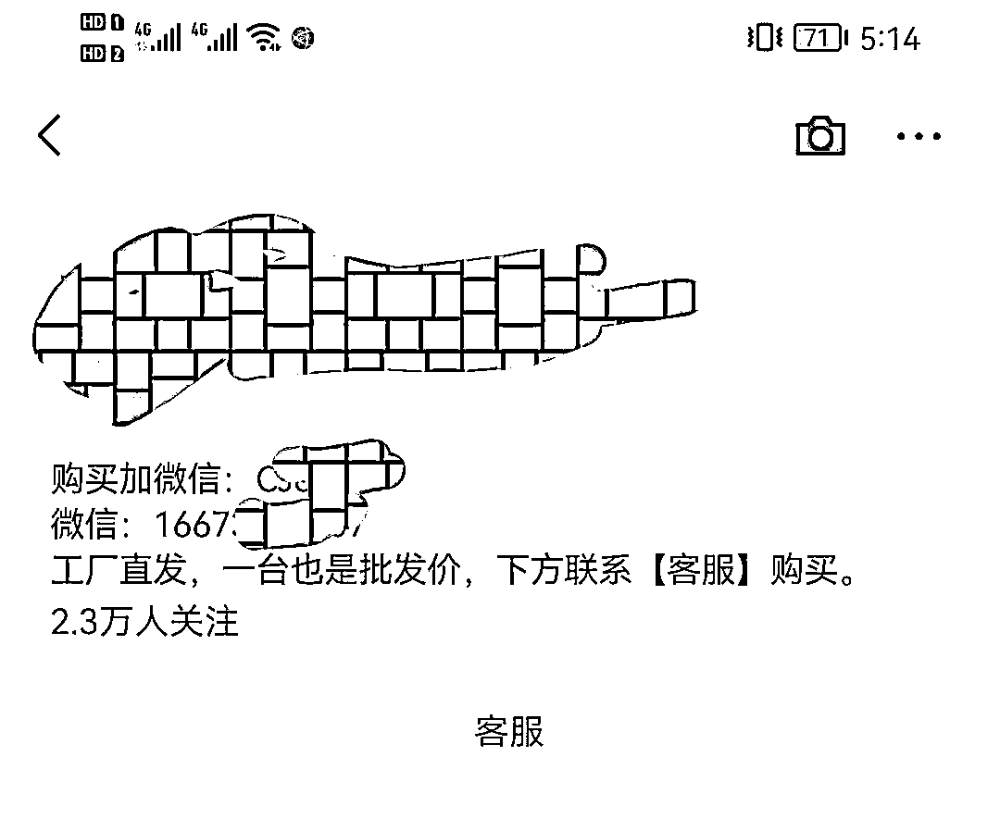

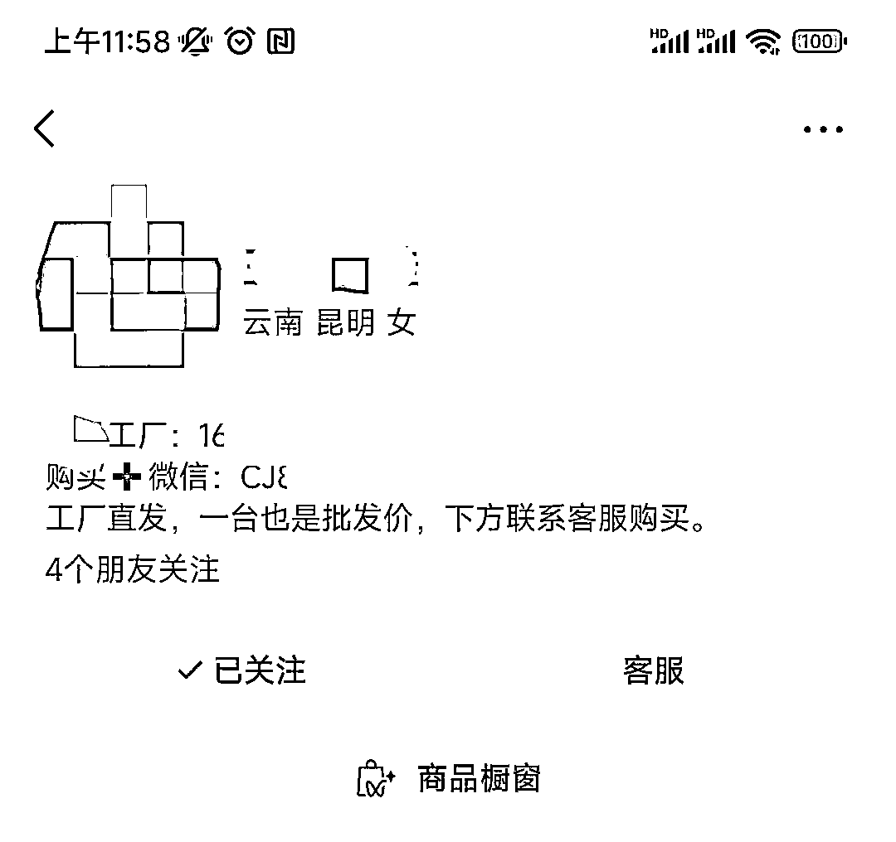

### 四、转化

#### 1、商品

通过抖音搬运来的视频，我开始也是先通过抖音去找对应商品，但是抖音价格太高了，如果照抖音的价格根本没有利润，我又去拼多多找，也没找到一样的，最后找了一个外观最相似的产品，也有一个合理的利润。前期不用担心商品，就手动拼多多一件代发，大件的商品只要你能下单10件，肯定会有老板主动来联系你。

如果需要软件自动代发可以用鲸吞代发，可以避免平台给用户发送拼多多消息。

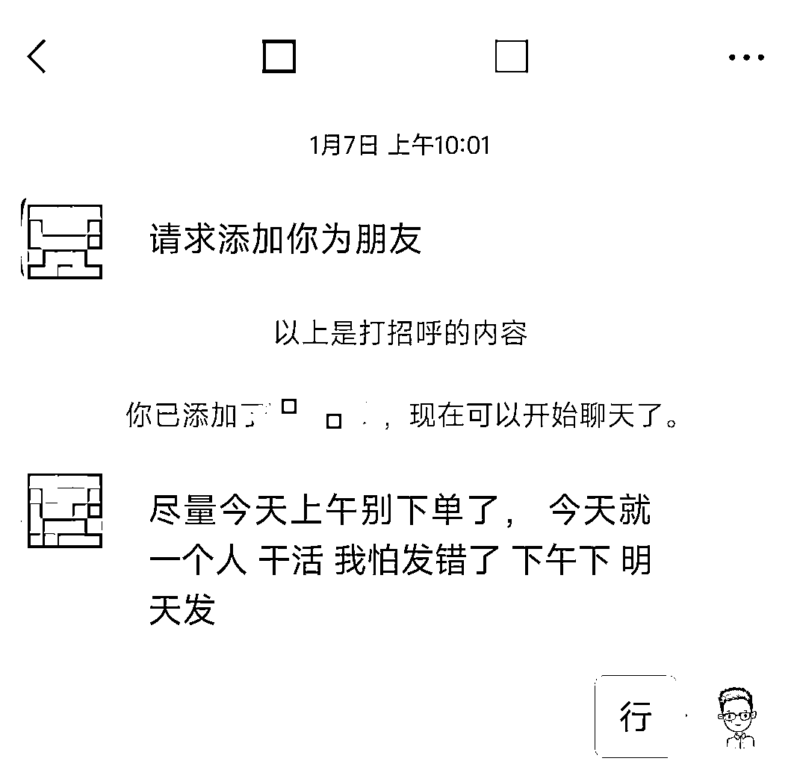

#### 2、通过“客服”发送购买链接购买

前面提到我没有开视频号小店，这里是基于押金和个人运营成本考虑，一个人没办法兼顾太多，小店考核要求又多。但是又得看起来专业一点，你的商品总有个载体去盛放，我这里用的是微信小商店，没有押金要求，上架商品基本不需要什么资料，其他比如有赞什么的都可以。把商品上架之后，能生成一个分享链接直接购买就没问题。

客户点击视频号主页的“客服”按钮，可以直接发送购买链接。

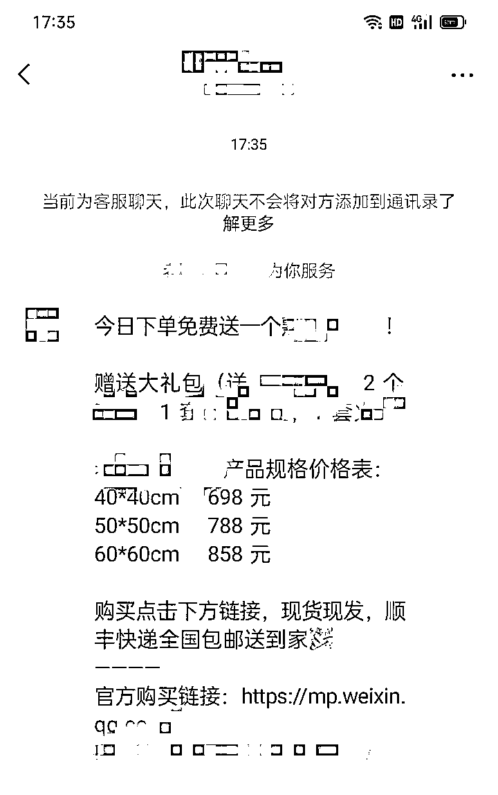

操作：

1、注册一个企业微信，通过企业微信绑定视频号，如果仅仅是发送消息，不需要添加企业微信就不用认证。

2、通过微信客服里的欢迎语去编辑这段文字内容。

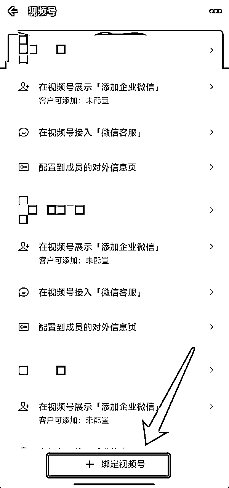

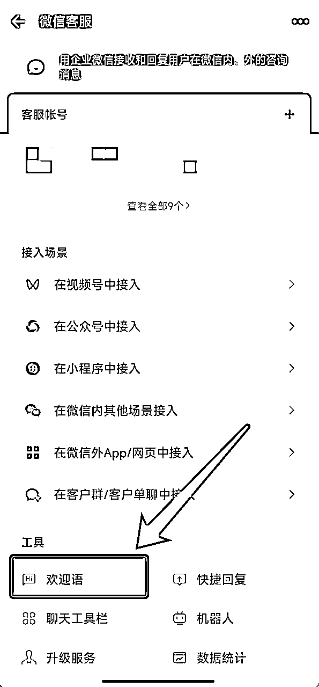

#### 3、加微信转私域购买

在视频号主页留电话和微信，一天大概能接50个电话左右，我本身有听力障碍，非常不喜欢打电话，所以经常会没有接到，但过后都会手动挨个添加微信。

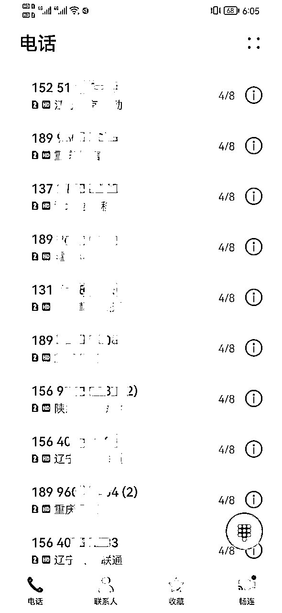

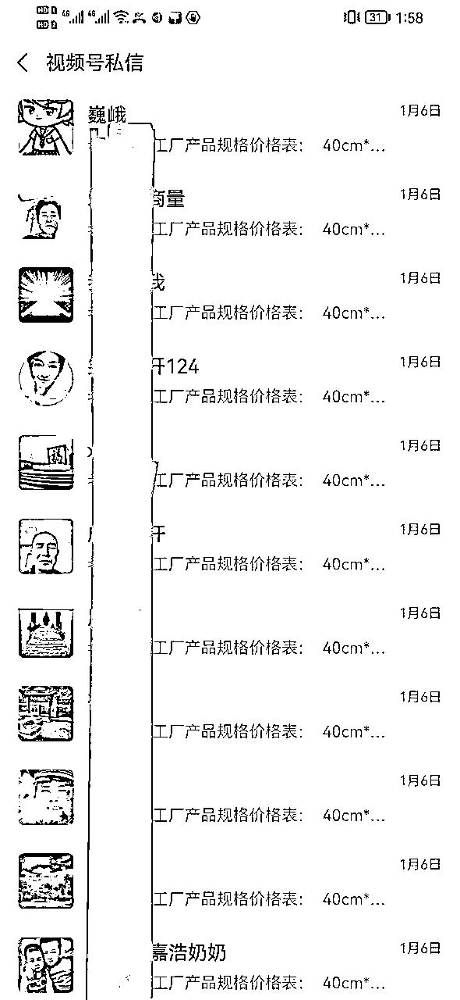

三个月也积累了几千个客户，并且对于农村中老年人来说，能加你的微信本身就是一种非常大的信任，他们微信好友一般就几十个人。

加上微信以后，你能卖给他农机设备，是不是也能卖果木苗木，他们购买渠道非常单一的，基本一辈子没出过县城，买东西只能通过特定时间去赶集。

平台红利终会过去，只有私域才是自己的积累。

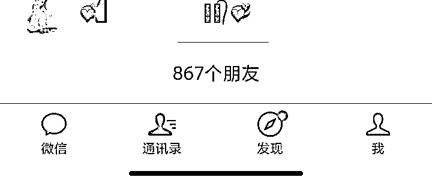

##### 1、微信聊天

我私域做的并不好，都称不上运营，刚开始的时候就是发个购买海报过去，让客户自己看，但我发现很多人根本不会扫码，还是一个劲问价格，后来第一次做了个产品规格，包含了各尺寸和价格。

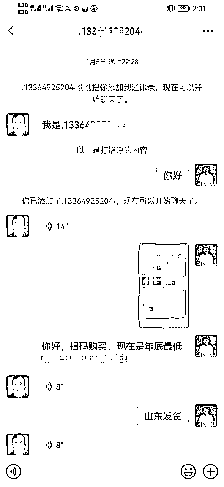

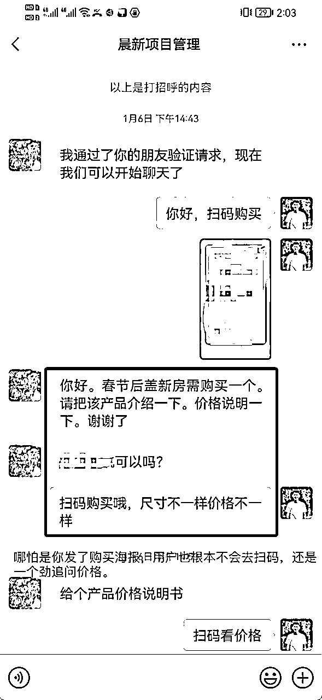

根据用户的问题第一次做了产品规格图(图一)，包含了规格和价格，用户也能一眼就看明白自己需要哪一个，这样也能看起来专业一点。

中途优化了好几次，图二是现在用的，把购买链接加上，并且提示是官方购买链接。（不要小看“官方”两个字，我测试过好多次，对于文化普遍不高的农村人来说，加这两个字转化能提升不少，得益于现在的各种反诈宣传）

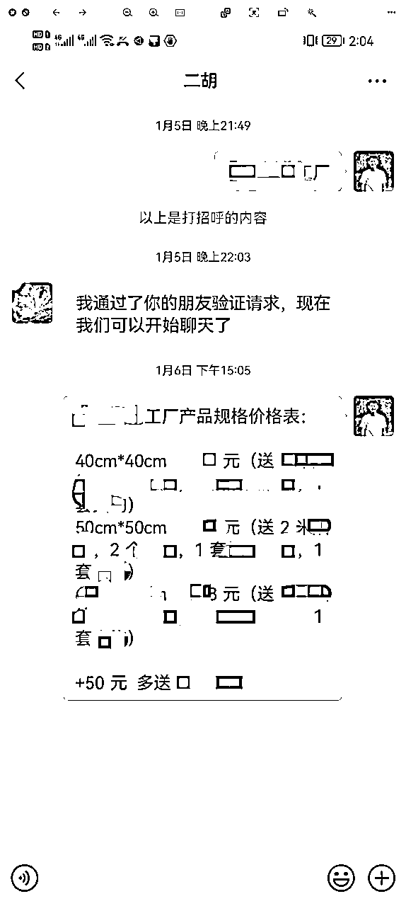

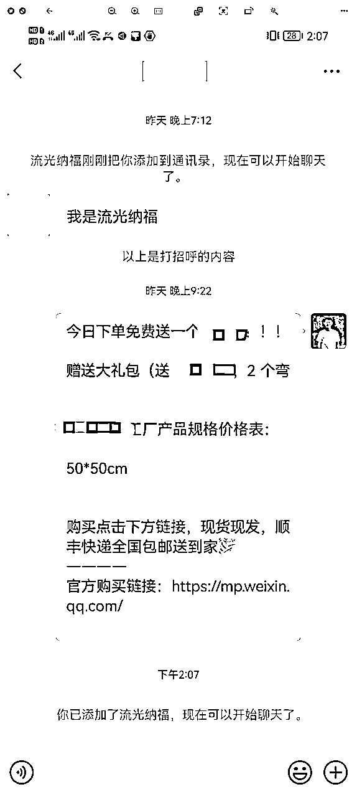

##### 2、朋友圈

我的朋友圈比较简单，偶尔发一下，并且简单的3行字，告诉他我有什么，有什么特点，价格怎么样就好了，不要长篇大论，一些农村老年人的手机上文字是选择放大模式了的，你写太多根本没人会看完。

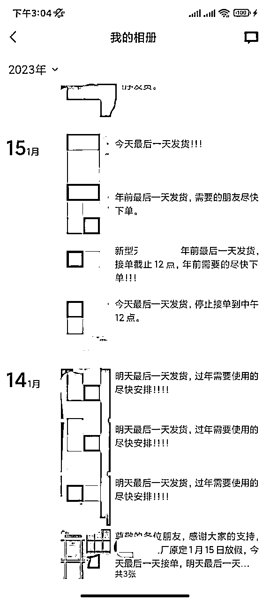

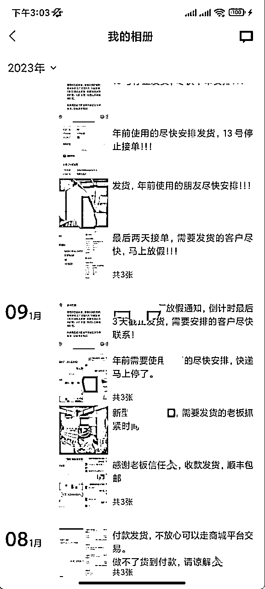

#### 4、成绩

积累了三个月，私域只有三千多个好友，但就是这3000多个好友，三个月时间一个单价600+的商品卖了1100件，利润30%左右，有部分微信付款的未统计，还有部分可能直接下单未加微信的。

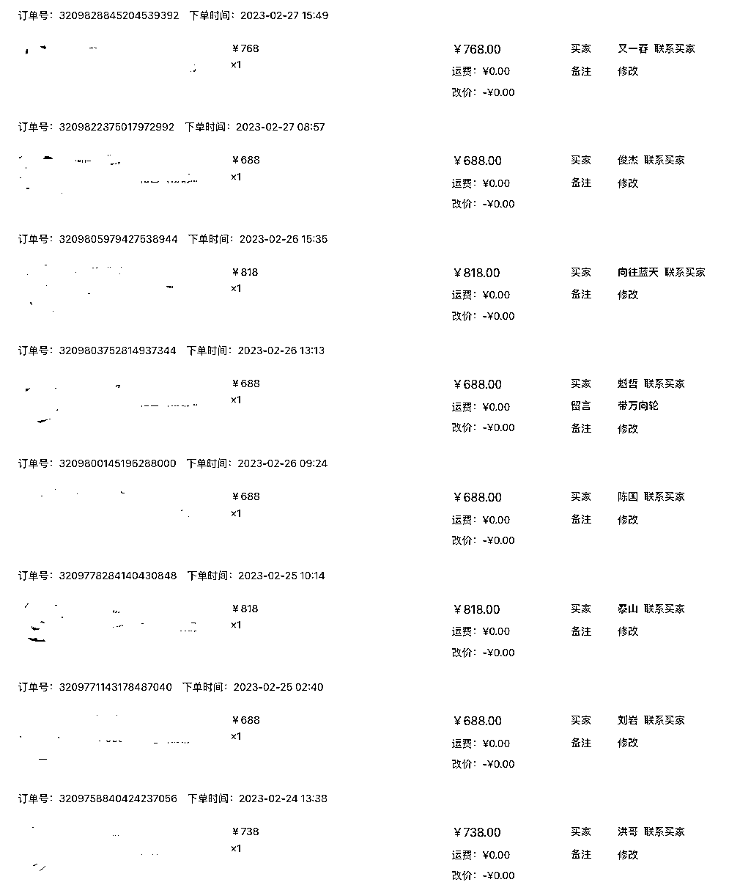

#### 5、多平台分发

这个也是属于意外之喜了，我们通过刚才的方法找出的达人都是粉丝不高的蓝海领域小达人，他们是个人或者有团队但也不大，往往只做了一个平台，找到你满意的达人后，除了视频号，顺手快手小红书也都搜一下，如果没有他本人我们就能直接去发。

图一是快手，4.7W粉丝，我直接在简介里留的电话和微信，目前没遇到什么问题；图二是小红书，才1000多粉丝，可能也是平台用户不一样，但小红书成交率比较高，来询价的基本都能成交。

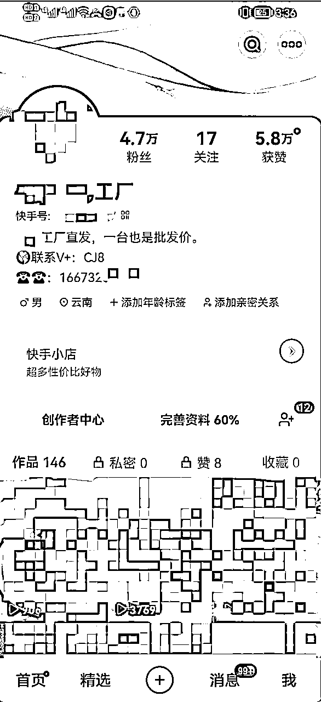

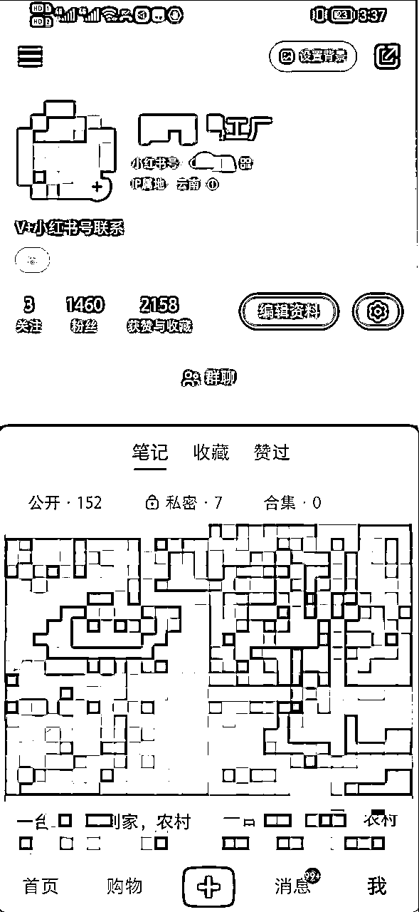

小红书引流很严格，要特别注意一下，不然很容易违规。我建了群，小号评论，群名改联系方式，把联系方式写在纸上写在书上做干扰拍照发，用计算器打出联系方式拍照发，这些都试过。

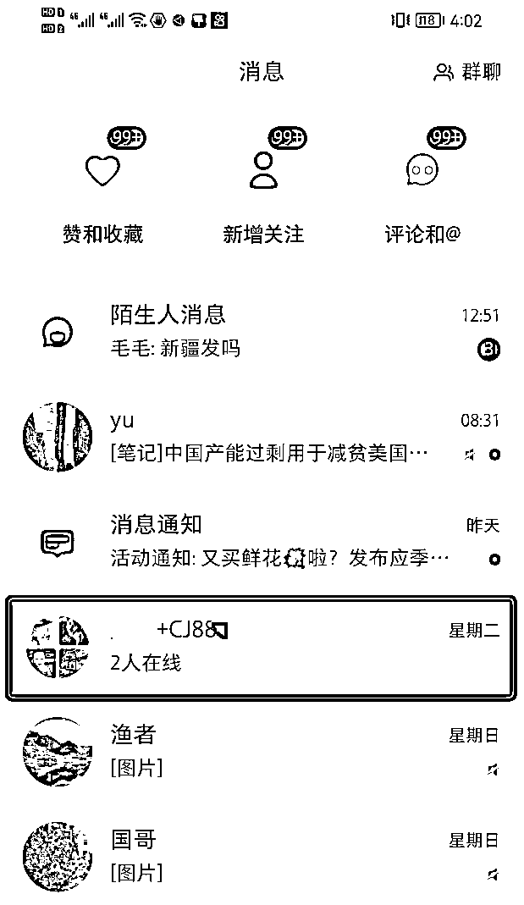

#### 6、被原创发现

搬运的视频被原创发现，一种原创作者直接投诉，那就自认倒霉，接受事实；一种原创作者主动联系，这种情况就主动去沟通，先承认自身的错误事实，再摆事实讲道理，尽量把利益最大化。

我这个作品发快手爆了之后也被原创作者刷到，主动打电话联系我，要求删除停止侵权，后来在沟通之下算是默认了可以继续发，然后我带他们的货。

这种作者只做一个平台的情况，一般都是个人或者因为时间精力等等的问题，反正视频也拍了，如果有个人愿意给他卖货，这样大家也都能赚钱。

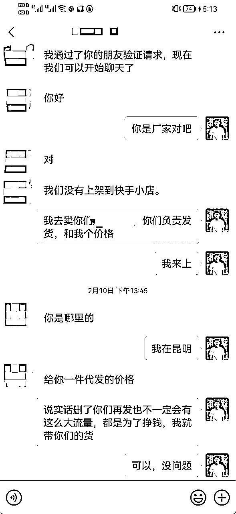

### 五、以下是我的几点想法

#### 1、人群，多关注下沉农村人群

视频号的消费人群30+以上的二三线城市以下，我们一般只是一句简单的概括中老年人，提到中老年一般也只会想到养生中医广场舞等等，我不否认，但是大家都这么想导致卖这些东西的也挺卷的。而我国还有很大一部分是农村中老年人，这些地方交通极其不发达，他们连县城都没走出过，偏远山区到五六线小县城都要几个小时车程，一辈子面朝黄土背朝天，终其一生都在地里劳作，买东西只能靠特定的日子去赶集。

所以关注他们的需求，线下买不到的，能提高他们生产力的，衣食住行需要的都不错。

三农不止是帮助农民卖东西，也可以把东西卖给他们。

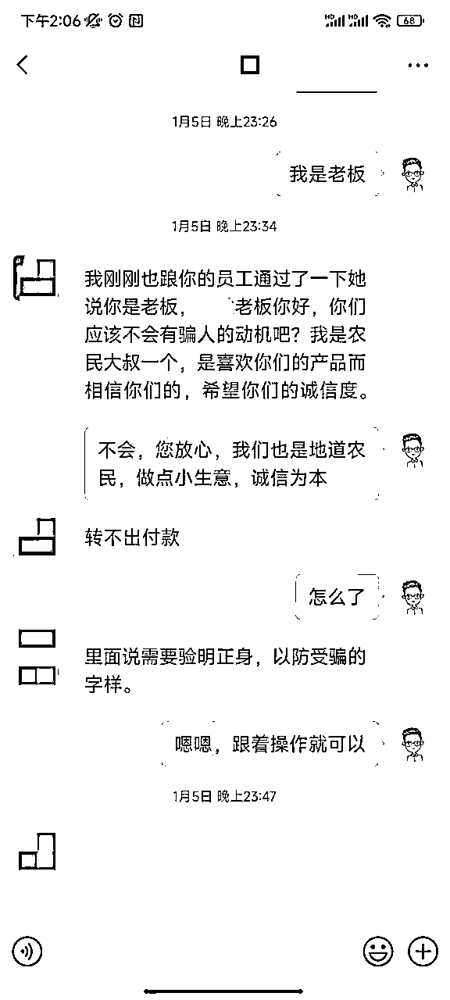

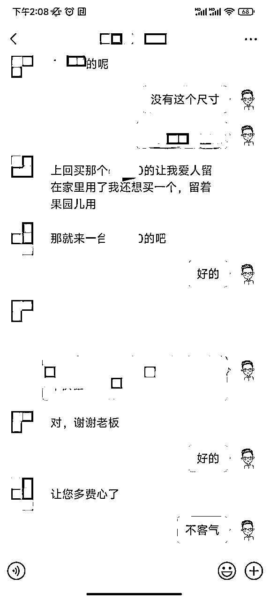

#### 2、做IP，做内容，能长久一点

做过视频号的朋友都知道，我们一般基本爆过一次账号后面慢慢就废了，怎么发也没有用，又得开新账号。但如果你搬运的是IP，和你做IP同样的道理，只要不被本人投诉，能活的长久一点，在合适的时机切入真人原创，就能变成你的IP账号。

人＞内容，还是内容＞人，这是个值得思考的问题。

在视频号上人群大于兴趣，我只要能卖掉a品类，就必然能卖掉同人群属性下的B品类。

#### 3、做自己擅长的事情

不可否认，这两年我们都听了太多了，直播是电商最大的杠杆。但当你只有一个人的时候，要想一下是不是适合做，喜不喜欢做，做直播你快乐吗。像我这样连和别人说句话都会脸红的人，做直播我会感觉比较痛苦，对我来说成本太高。如果心理痛苦，还赚不到钱，你肯定坚持不下去。

#### 4、跑通从0到1后，要建立自己的核心竞争力

核心竞争力来自于某一细分领域的深耕。我知道我们很多人在做视频号的时候就抱着这是个短期项目赚点钱就走，一波流，没有长期的基本盘，就什么都沉淀不了，什么资产都没有，去年做搬运，今年说搬运不好做了，就只能换下一个项目，这种项目制的创业有点累，看天吃饭。

我们的认知沉淀、声望沉淀、人力沉淀、现金沉淀，都是来自于一个领域，不要一直在变，把平台当成你的一个工具而已。

#### 5、历经千帆，归来仍是少年

希望我们都能保持初心，想想自己从哪里来的。

这一年多的时间确实见到了太多的不堪，尤其是视频号上面，群里闲聊也好身边有人这么做的也罢，收钱不发货，以次充好，上传假单号蒙骗老年人等等，如果有这个念头的时候想想自己父母，想想家里的长辈们，换位思考。