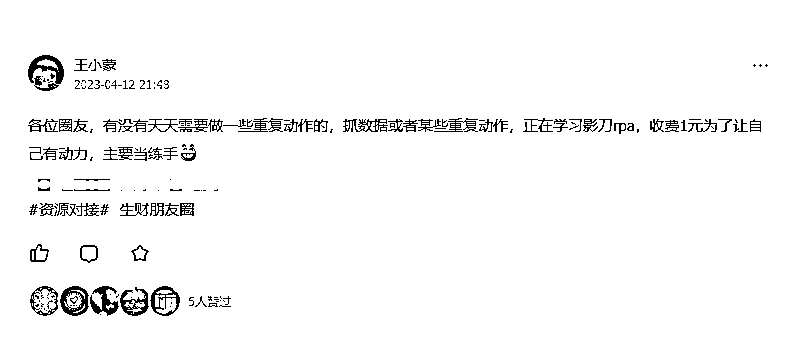
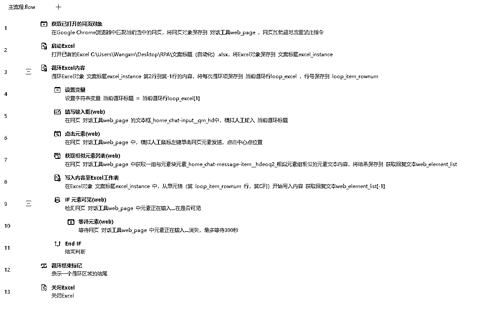

# 通过ChatGPT+RPA 13次拖拽实现文案全流程自动化

> 来源：[https://rztam6ckur.feishu.cn/docx/IZx7dx2CSo9x23xioUFcNaHcnRd](https://rztam6ckur.feishu.cn/docx/IZx7dx2CSo9x23xioUFcNaHcnRd)

4月12号在生财发了一条关于rpa的资源对接，主要是2个目的：

1、确定市场是不是有这个需求；

2、通过圈友的需求推动我学习rpa解决具体问题。



因此一位圈友加到了我，需求是因为太忙，经常需要将文案标题重复粘贴到ChatGPT再将文案手动粘贴到表里，比较浪费时间。

先来看下实现后的效果（建议电脑端观看，电脑录屏手机可能看不清）

整体代码过程实现比较简单，根据需求做实现过程拆解

开始前准备：

已打开chatgpt网页、表格已填写文案内容

### 1、表格部分：

### 表格文案填充，将要实现的文案通过公式实现

A列填入要写的文案标题

B列填写

```
=CONCAT("写一篇","“",A2,"”的文章，标题+正文")
```

### 2、影刀实现自动操作

整体测试比较简单，影刀获取网页、打开文案表格、循环提取文案标题、在chatgpt填写文案标题(过程中等待chatgpt输入完毕)、抓取最后一条回复、



影刀rpa整体来说真心比较简单，B站也有影刀官方的初中高阶课程，过程中基本不用任何代码，有点类似小孩玩儿的编程机器人,如果工作中有天天机械重复的某些动作（类似于日报表、数据抽取）完全可以通过RPA解放自己的双手。