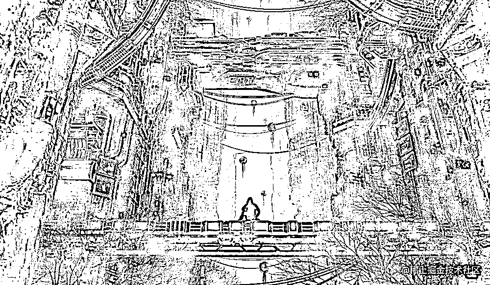
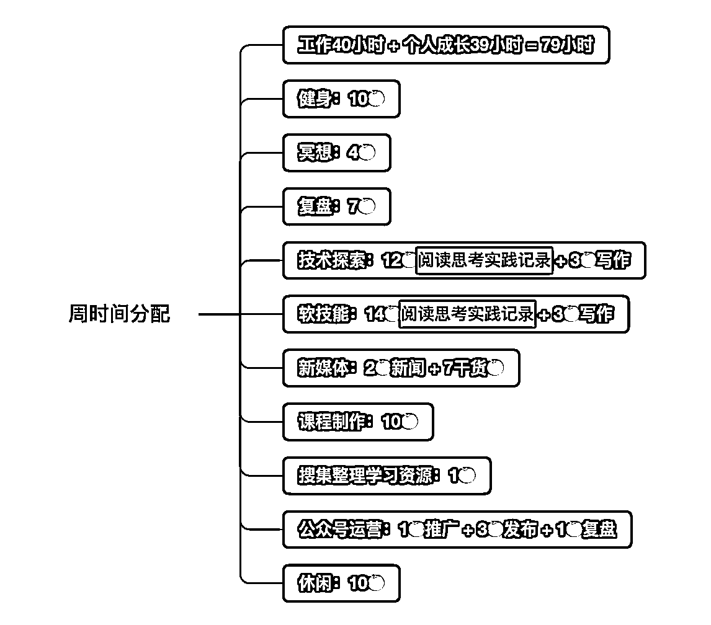
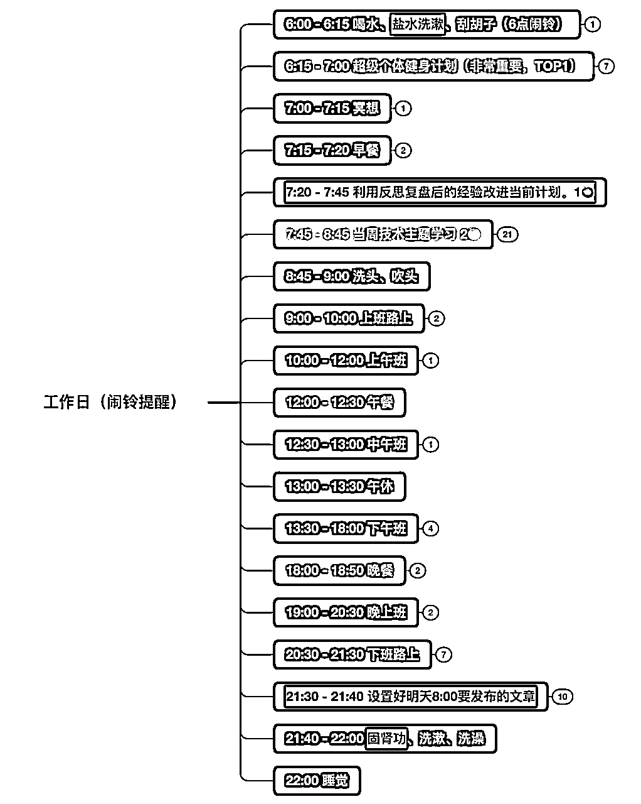
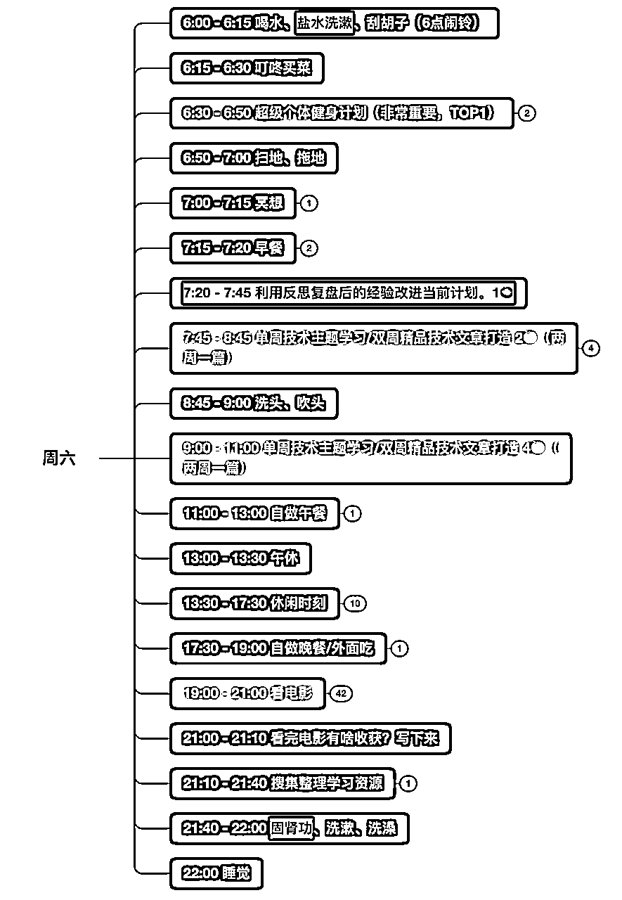
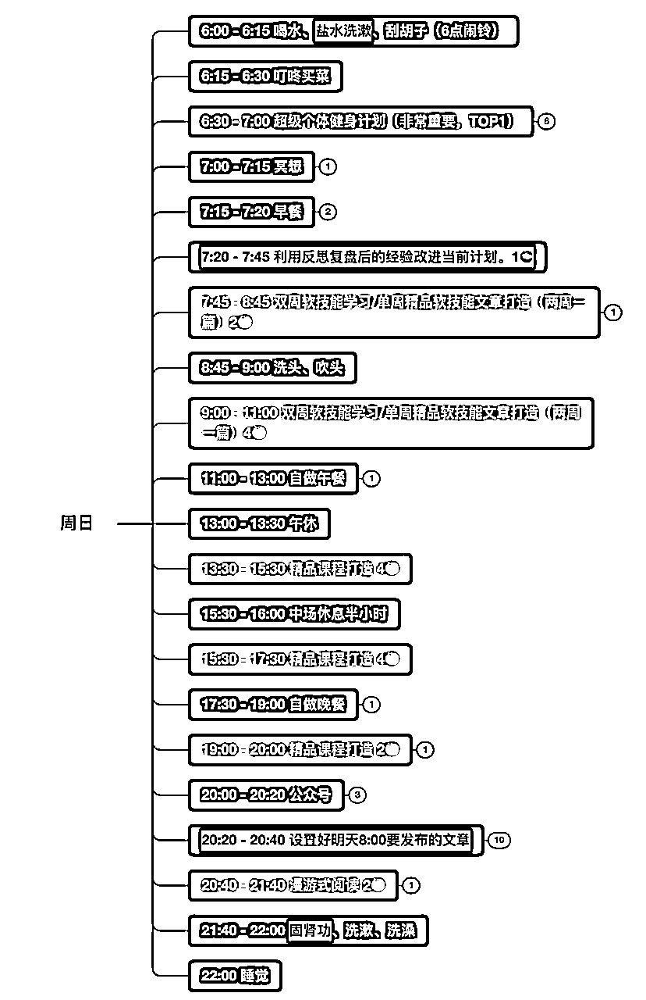

# 一篇文章，助你实现认知突破，重获新生

> 来源：[https://iv8irdz7945.feishu.cn/docx/M5lpdRp7OoHZAYxuDiicgGtSnpg](https://iv8irdz7945.feishu.cn/docx/M5lpdRp7OoHZAYxuDiicgGtSnpg)

如何实现认知突破？

今天，我将从 23 个环环相扣的问题出发，一步一步，帮助你实现质的突破。

## 1、为什么许多人的人生都难免陷入混沌之中？

因为他们对未来充满模糊。

而只有制造清晰，才能消除心中的模糊。

### 如何制造清晰？

从混沌到清晰，关键在于，通过学习不断地加深自己对事物的认知，只有认知越清晰，我们的行动才会越坚定，然后再去持续做那些高耗能、有挑战的事情。

## 2、成长是什么？

成长就是克服天性的过程。

而成长的本质就是让大脑对事物的认知变得更加清晰。

## 3、为什么我们需要终身学习？

因为当我们知道的规律越多，就越能定位自己所处的阶段和位置、预估未来的结果，进而增强自己对未来的信心和持续行动的耐心。

而培养耐心要从接受自己缺乏耐心这一事实开始，只有在心底知道持续做一件事情的好处有多大，我们才能对它有足够的耐心。

## 4、如何找到更多高质量的学习资源？

留心你认为好的书里面被作者多次提到的书，这些信息往往都是你继续发现好书的线索。

## 5、什么才是真正的学习？

现实结果是最好的“评判师”，如果学习不能让自己发生真正的改变，那学再多又有什么用呢？

你根本不用在意自己读后记住了多少内容，即使整本书都记不起来了也没关系，只要有一个点、一句话触动了自己，并让自己发生了真实的改变，这本书就没有白读，这次阅读就是有效的。

因此，懂得百点不如改变一点。

真正的成长不在于自己懂得了多少道理，而在于自己真正改变了多少。

## 6、如何开始真正地学习？

一个人的感性能力要远大于理性能力。

能够真正在感性层面触动你的那些知识或事物，才是你大脑真正感兴趣的。

因此，你只需学习那些让你深深触动的知识，尝试去打碎各家的知识体系，只取其中最触动自己的点或块，然后将其拼接成自己的知识网络。

即先用感性能力帮助自己选择，再用理性能力帮助自己深入思考。

使用这种关键点触发的方式能够让你学会高效读书，高效学习，甚至找到自己真正的兴趣。

而这种“凭感觉”的方法之所以如此高效，是因为它能够帮你感知真正适合自己并需要的东西，让你始终处于学习的“拉伸区”。

此外，当你在阅读一句或一段话产生了关联思考🤔的时候，一定要立马把它记下来，这些才是真正能被你吸收的精华。

最后，利用费曼技巧，通过自己的语言，用最简单的话把一件事情讲清楚，让外行人也能听懂。

## 7、学习的本质是什么？

学习就是把新知识关联到旧的知识体系中，然后再通过刻意练习将链接处的地方进行深度缝合。

## 8、关于学习，最需要注意的一点是什么？

凡是当你遇到卡壳、学不下去的情况时，只有一个原因：那就是你对此前学过的基础不熟练，没有达到掌握的程度。

因此，你在心态上要“慢”，允许自己学得少、学得慢；在动作上要“快”，要求自己熟练、迅速。

要耐下心来渐变，才能实现真正地突变。

## 9、如何实现持续高效地工作和学习？

那些轻松的学霸，他们学习时从不过度消耗自己，只要感到精力不足，就停下来主动休息，这反而使他们精力桶的水位得到快速回升。

这其实就是利用了类似番茄工作法的原理：持续性专注，间歇性休息，让精力在每一次消耗之后都有一定的时间恢复。

## 10、如何增强你的自制力和行动力？

在一天精力最充沛的时候，强迫自己去做对你而言那些最重要和最难的事情，一旦进入正向的增强回路，你便能拥有强大的行动力——这正是增强自制力和行动力的奥秘。

## 11、为什么一定要做计划？把自己限定在一个时间框架之下不会很痛苦吗？

做规划的目的并不是让自己严格地按计划执行，而只是为了让自己心中有数。

如果当天计划有变也没关系，有了这份预案，你能够在处理完临时任务之后，把自己迅速拉回正轨，但如果没有这份预案，你极有可能在目标和时间都模糊的情况下选择娱乐消遣，最终又陷入混沌与迷茫之中。

## 12、制定计划时最需要注意什么？

尽量不要同时设定很多目标，主动降低期待，不要急于看到成果。因为只要目标或欲望一多，你必然会焦虑丛生、急于求成。

## 13、理性思维有什么坏处吗？

理性思维的局限在于它只相信自己所见所闻的一切事情，对于已知之外的未知，它会主动怀疑并排斥。

因此，按照乐观构想（感性）、悲观计划（理性）、乐观实行（感性）的路径，就可以巧妙地避开理性思维的局限。

## 14、良好的情绪控制能力是怎么做到的？

生活处处是选择。

每当遇到需要选择的情况时，你要是能先停留几秒思考一下，就有可能激活自己的理智脑，启用元认知来审视当前的思维，然后做出不一样的选择。

### 元认知是什么？

我认为就是感受自己在想什么、在思考什么的能力。

而一个人的性格和脾气好不好，也取决于他多角度看问题的能力：视角单一的人容易固执、急躁和钻牛角尖，而视角多元的人则表现得更为智慧、平和与包容。

其实，在很多优秀的书籍和文章中都展现了作者看待问题的独特视角，你若摘取，便能向高人学习。

所谓的耐心或好脾气很多时候其实就是对他人适当降低期待，例如对待任何人，一般都先假设他是正直、善良和诚信的，尝试先从好的角度去思考他的行为。

假如真的碰到一件烦心事，可以通过写作复盘来疏解自己的烦心事，当你写下来的时候，你会发现也没什么大不了的，其实一切都是妄念。

因此，当你心情不好、焦虑等症状发生时，其实就是你的理智被情绪所挟持了，这个时候如果利用理智将内心的情绪“写下来”，情绪就会平缓下来，而你的理智就能够把控肉身、掌控全局。

## 15、为什么要注意你的态度和语言？

你看待一件事情的态度会影响你的行为，而你的行为则会影响现实结果。

因此，如果你碰到坏事的时候，一定要说不好意思和谢谢，避免自己被坏情绪侵蚀。

注意你自己的语言，语言会影响你的思维：

*   无论遇到什么事情，说积极的话，不说消极的话。

*   无论遇到什么人物，说和善的话，不说刻薄的话。

*   无论遇到什么问题，说开放的话，不说绝对的话。

## 16、焦虑是2022年的10大关键词之一，如何更好地缓解焦虑？

让你的感受回归你当下的行动，工作、学习、跑步、睡觉、吃饭。

身心合一的要领不仅是专注于当下，更是享受当下，而这种享受必将使你更加从容，不慌张、不焦虑，做更好的自己。

## 17、高手为啥成长都很快？

看过了的就是鸡汤，做到了的才是干货。

你和高手都懂得很多道理，区别是高手做到了，你只是在想的阶段。

此外，高手们一旦发现别人的好习惯，就会立刻将这个习惯变成自己的，将其内化为自身之中。你说，他成长快不快？

## 18、为什么高手都爱冥想？

冥想会让人更聪明，科学研究表明，通过这种集中注意力的冥想练习，人大脑皮层表面积增大，大脑灰质变厚，意味着练习冥想可以从物理上让你变得更加聪明。

因为，一个人【大脑皮层表面积】和【大脑灰质厚度】是影响人聪明程度的因素。

## 19、为什么高手都爱反思复盘？

反思其实就是一个自我完善的过程，越是好的反思，着眼点往往越细微。

在反思中，你可以用充足的时间来复盘当时短暂的思维过程，找到其中的不足之处，对其进行优化。

与此同时，找出更好的认识角度，还能启动理智脑，消除情绪的模糊地带，改变本能的默认选择，使你在下次遇到类似的问题时不会陷入情绪，无法自拔或是无力做出更好的选择。

长期练习复盘会大大提升你的认知水平、情绪水平和选择决策能力。

### 如何复盘？

复盘主要关注3点：回忆触发点的经过、挖掘深层原因、制定改进措施。

无论何时，都要把对方的情绪和意见分开对待，这样，即使在最糟糕的事情中也能学到有用的东西。

### 痛苦真的是一件坏事吗？

痛苦哪里是什么坏事，它其实是上天给我们的成长信号与提示！

如果当天遇到了让你痛苦的事，一定要深入反思，找出让你痛苦的根源是什么？借此优化自己的思维方式，以在未来面对相似痛苦的时候能够立即将其斩杀。

这，才是真正的成长与变强。

因此，只要有困难或不舒服的事情出现，我心里就会暗喜，知道自我提升的机会又来了。

## 20、你知道吗？运动能让人更聪明

科学研究证明，运动能够使大脑长出更多新的神经元，这意味着运动可以在物理上让你变得更“聪明”。

然后，在运动后的1~2小时内进行高强度、高难度的脑力活动，比如写作、编程、阅读、解题、背记。

通过这种方式，可以让你的新神经元受到刺激，不断生长，真正从物理层面做到持续变强。

## 21、如何改变他人？

是什么曾经拯救过你，你最好就试着用它来拯救这个世界。

如果你想要改变一个人，更好的建议不是劝说，而是改变自己，通过自己的行为与结果去影响他人。

因此，一定要立足长远，让自己真正成为一个“有价值、可影响、能吸引”的人。

## 22、改变自己的关键是什么？

改变自己的关键是创造价值。

而写作是普通人创建价值的一种最低成本的方式，它能解开那道限制你人生可能性的“枷锁”。

而一个有价值的作品，特别是精心打磨的作品所产生的影响力要远远超过个人在台面上的高声叫卖。

因此，如果你有了自己的作品或产品，不要拿着手电筒去找客户，也不要想着去说服别人，如果你发现这个人竟然还要被说服，那就只能证明你作品散发的光和热还不够。

所以，一定要扎扎实实地生产具有长远价值（最好能持续10年）的内容。让内容抓住读者的痛点，满足读者的需求，最终才能换来读者的关注和支持。

### 什么才是具有长远价值的内容？

针对我目前的情况而言，有两种好的写作路径：

*   1、借助移动端性能优化领域，深入挖掘与探索计算机底层的实现机制与奥秘。

*   2、构建一套互联网人必备的底层思维认知体系。

### 最好的写作方式一般都具有哪种特点？

好的写作就是聊天，好的聊天也是写作。

先用合适的故事引起对方“感性小人”的兴趣和注意，然后把想要表达的道理通过“感性小人”转达给“理性小人”。

### 正确的写作应该是怎样的？

远离热点、静心阅读、用心关联、持续打磨，力争用最底层的知识和简单易懂的表述去驱动读者更新自己的知识体系。

你一定要保证你的作品要足够好。它要好到能让人眼前一亮，让人觉得醍醐灌顶、能传递极度的美，或对他人产生巨大的帮助，且有长久的生命力。

越是在传播手段发达的社会里，越要坚守价值。因为这个世界已经不缺乏传播途径了，但价值依旧稀缺！

写作、成长和成功其实是一回事：写作就是生产有价值的内容，成长就是做一个有价值的人，而成功就是我们能为这个社会做出的贡献。

究其根本，它们都遵循价值交换的规律。

因此，“一切成功都归结于利他之心”。世间的幸福和成事之法，皆因与此。

## 23、内向的人最大的优势在哪里？

内向成长者虽然在社交上不具优势，但在创造上更具潜力，所以专注于创造，并用创造的价值来吸引外界与之连接，往往是他们更具优势的人生赛道。

每周六的晚上，我都会看一部高质量的电影，并把其中有价值和触动我的点记录下来。

上个周六，我看了《成为沃伦·巴菲特》这部类似于自传的电影，巴菲特在影片中回想了他一生的经历与思考，还有他亲人和朋友看待他的一些视角与观点。

总体而言，我觉得这部电影很有价值，在这部电影中，我是带着”巴菲特之所以能成为巴菲特，他的成功究竟源于哪些特质？“这个问题去观看和分析的。

下面👇，是电影中关于巴菲特成功的12个特质与我的一些思考：

*   1、孤独、独立的人格：真正的强者都是特立独行的。

*   2、兴趣驱动：你必须花大量的时间专注于最感兴趣的事情，持续精进，不断实现复利，对其它的事情漠不关心。

*   3、胜负欲很强：对于每一件你感兴趣的事情，你都想要做到第一。

*   4、大量的阅读：每天花5～6个小时读高质量的书，只有大量优质的输入，才能有比较高质量的输出。

*   5、非常喜欢安静和简单的环境：只有足够简单安静的环境，才能在高效的心流状态下，创造出更多更好的东西。那些看起来有强大自控能力的人并非真的比常人更自律，而是因为他们会尽量避免置身于充满诱惑的环境中——这才是他们保持自律、实现高效创造的真正“秘诀”。

*   6、思考能力强大：思考能力像是武林人士的内功修为，决定着学习与掌握其他一切外家武功和招式的速度与可能。它也像是一台计算机的底层操作系统，决定着计算机的运算速度以及问题的处理速度。

*   7、好奇心：对感兴趣的事物持有强烈的好奇心，为了理解其本质，会不断地深入思考、深入挖掘。

*   8、耐心：耐心是每一个长期主义者必备的核心技能，越对未来有信心，越对当下有耐心。

*   9、只做自己认知以内的事情：如果你对一个事物没有充分的理解、深入地研究，千万不要把自己所有的资源投入其中。

*   10、复盘：巴菲特会竭尽全力找出当天的所有错误并修正，如果你每一天都能发现这一天中的错误并修正，那么你就比前一天的自己有了些许进步，虽然一天的进步很小，但在时间的长河中，日复一日，通过长期的复利积累，你最终会蜕变出全新的自我。

*   11、情绪控制能力强：如果你不能掌握自己的情绪，那么只要碰到一点不舒服的事情，就很有可能影响你一整天的效率和心情，因此，掌握情绪控制这个能力是每个人必备的技能。

*   12、懂得持续打造自己的个人影响力：复利，是世界的第五大奇迹。而影响力，在我心中则是第六大奇迹，如果有两个优秀的程序员，一个优秀的程序员被100个人知道，一个程序员被10万人知道，那么后者的社会价值就是前者的1000倍。在这个世界里，价值就等于收益，你能够给他人创造多少价值，你就能获得多少收益，给的越多，得的越多。

因此，从这些特质中，我们可以显而易见地看到，真正的成功人士，他们之间的许多特性都是相通的，而这些特质也是可以通过实践不断去培养的。

在写这篇文章的时刻，我已经通过长期的实践把这其中的许多特质与自身合为一体，并融入了自己的每日计划表之中，如下图所示：

这份周时间计划表，是我经过了2年的持续实践与复盘，长期打磨而成的作品。今天，我将它分享给你，希望你能从中发现真正能触动你的东西，并且从此开始你的蜕变之路。

未来已来，在此刻，我真诚地邀请你，一起成为这新世界的觉醒者。

作者：JsonChao，目前负责阿里巴巴国际版 APP 的交易领域业务，之前曾任职世界前20强企业的一线开发。我的使命是专注于个人的持续进化与财富增长，希望和你一起开启加速成长之路。

### 参考链接：

*   1、认知觉醒-开启自我改变的原动力

*   2、认知驱动-做成一件对他人很有用的事

*   3、成为沃伦·巴菲特 Becoming Warren Buffett