# 利用Colab和Stable Diffusion实现云端、免费、自动、批量、无限AI出图

> 来源：[https://zyb2zrrrem.feishu.cn/docx/Md2KdAjbDo0cdGxGMtncyb8CnLb](https://zyb2zrrrem.feishu.cn/docx/Md2KdAjbDo0cdGxGMtncyb8CnLb)

我是林同，加入生财两年，理工男，坐标广州，主业工程管理，爱好健身，有健身粉几万，在做运动健身产品推广，也是工具控，懂点写代码，喜欢偷懒，擅长让工具干活，自己多点时间摸鱼，以下是正文：

# 背景介绍

*   Stable Diffusion是目前最火的AI绘图工具，但安装使用对计算机配置有较高要求。

*   在硬件条件不具备的情况下，可以利用云端进行出图。

*   google colab提供了云端环境，可以实现免费云端出图。

*   AI绘图结果通常不能直接使用，大概30张中选1张能用的，因此需要大量出图，人工筛选。

*   由于colab分配给每个账户的算力有限，无法不断出图。

*   按本文方法可以利用colab和Stable Diffusion实现云端、免费、自动、批量、无限AI画图。

# 部署：Colab云部署Stable Diffusion WebUI

*   自备梯子账户

*   自备google账户

*   登录google账户，通过以下链接，打开笔记，点击运行代码块

*   本colab笔记属于camenduru大神

https://colab.research.google.com/github/camenduru/stable-diffusion-webui-colab/blob/main/nightly/stable_diffusion_v2_1_base_webui_colab.ipynb

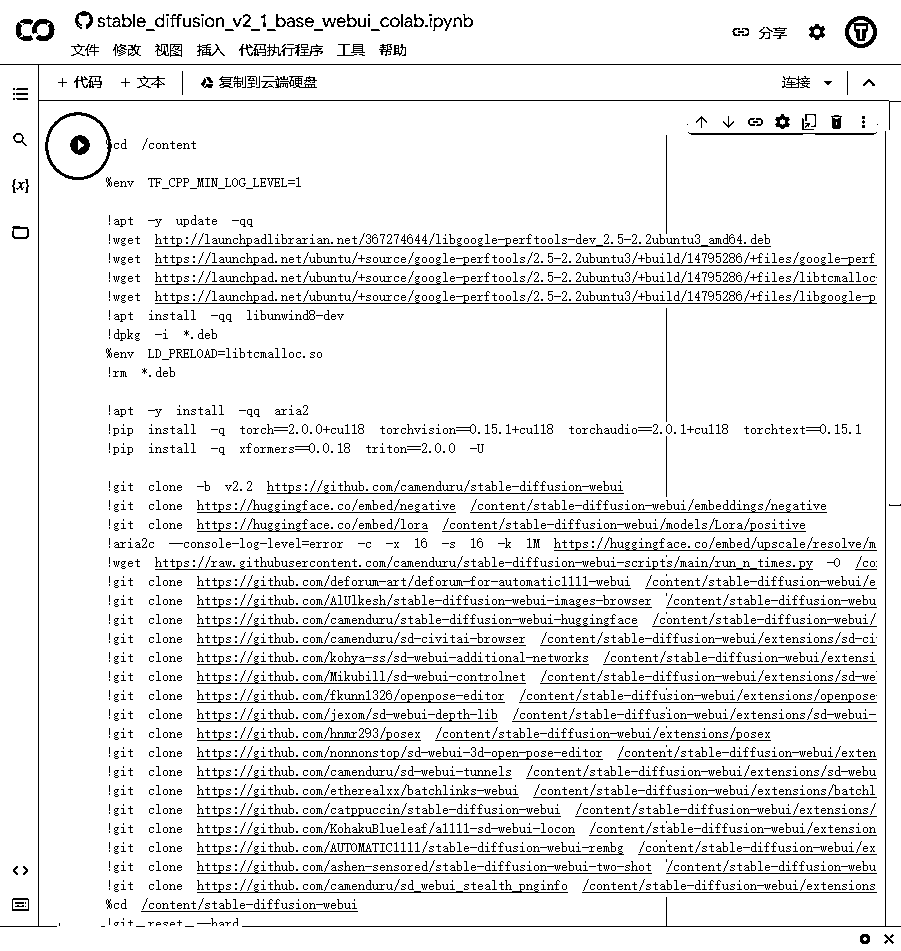

*   可能会弹出对话框，或者人机交互测试，根据提示往下走

*   代码块运作的时候，在下方可看到不断输出

*   期间可能会弹出几次人机交互测试，根据提示操作

*   等待完成资源下载和安装，直到出现几个Public WebUI Colab URL

*   这几个Public WebUI Colab URL就是部署好的Stable Diffusion WebUI操作界面地址，复制到浏览器打开

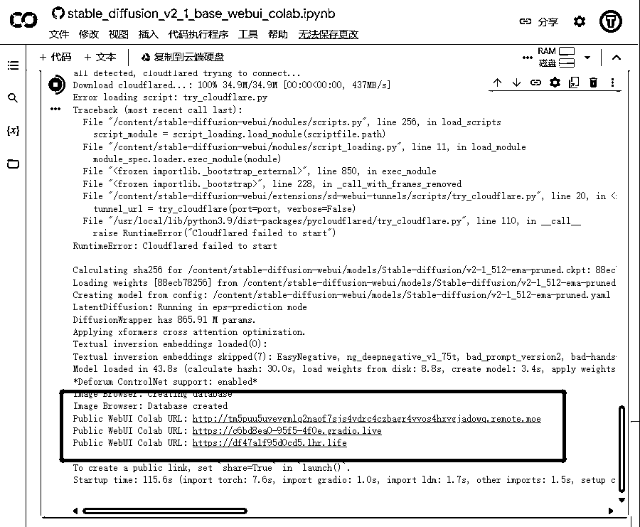

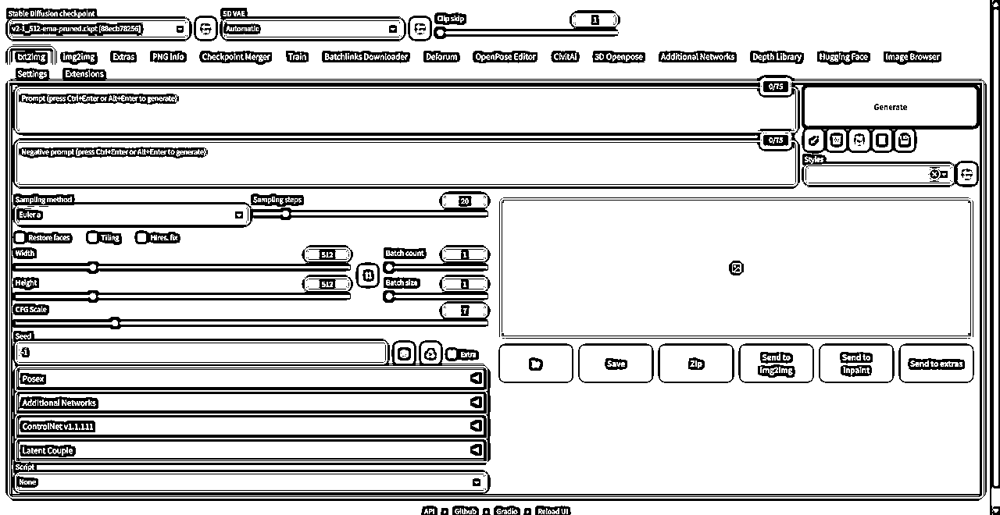

# 实操：Stable Diffusion 出图实操

## 下载大底模型

ChilloutMix 是基于亚洲人物训练集训练出来的大底模型，可以生成比较理想的亚洲人物状态

1.  点击Civitai选项卡

1.  Content Type选择Checkpoint

1.  Search by term打勾

1.  Search Term输入chilloutmix

1.  点击Get List，会从Civita中搜索并加载模型信息

1.  在Model中选择chilloutmix

1.  在Version中选择最新版本

1.  在Model FileName中选择模型名称

1.  等待Download Url中出现模型下载地址

1.  点击Download Model

1.  回到Colab界面，看到下载进度，等待出现Successful Downloaded说明下载完成

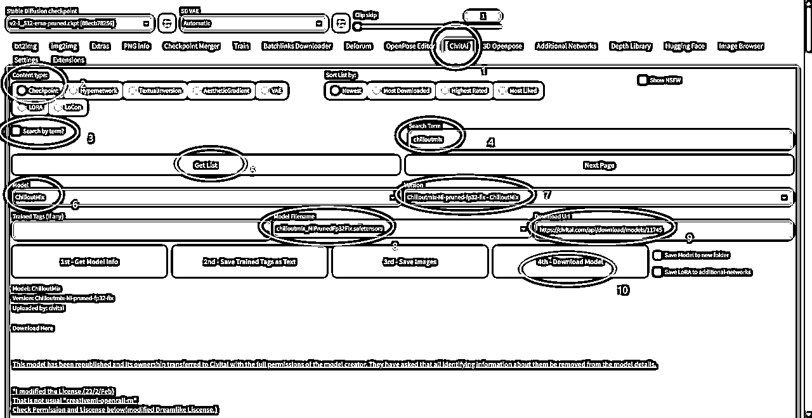

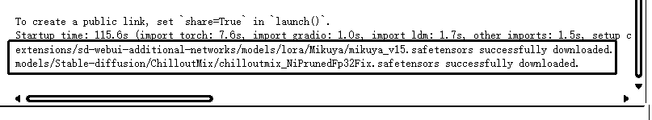

## 下载Lora模型

LoRA模型是一种可以生成出符合指定样式图像的模型，具有速度快、体积小等特点。

1.  点击Civitai选项卡

1.  Content Type选择Lora

1.  Search by term打勾

1.  Search Term输入自己喜欢的Lora模型名称

1.  点击Get List，会从Civita中搜索并加载模型信息

1.  在Model中选择

1.  在Version中选择版本

1.  在Model FileName中选择模型名称

1.  等待Download Url中出现模型下载地址

1.  点击Download Model

1.  回到Colab界面，看到下载进度，等待出现Successful Downloaded说明下载完成

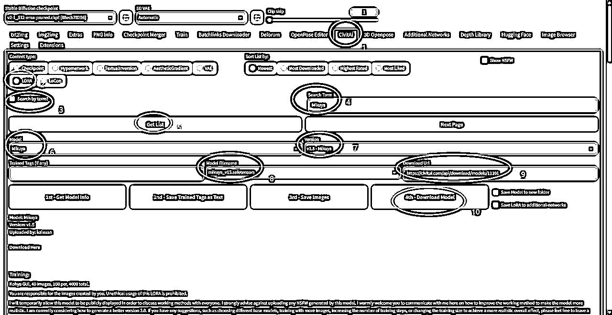


## 选择大底模型

1.  点击txt2img选项卡

1.  点击左上角刷新大底模型

1.  在左侧选择刚才下载的ChilloutMix

1.  等到界面刷新

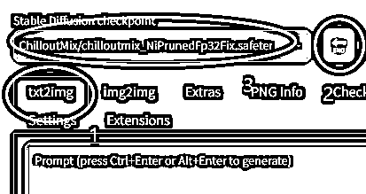

## 选择Lora模型

左下方展开Additional Networks

1.  Enable打勾启用Lora模型

1.  点击Refresh Model刷新模型

1.  在Model 1处选择刚才下载的Lora模型

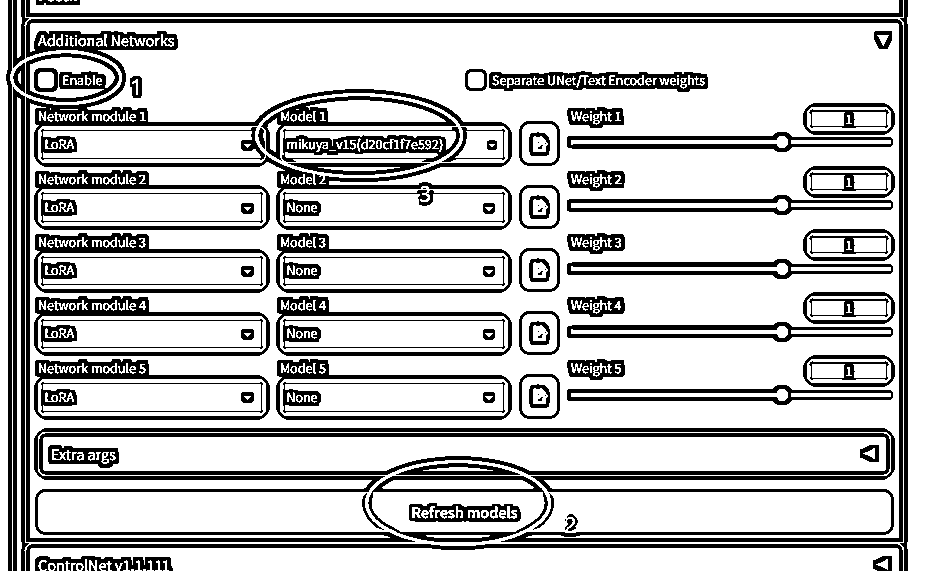

## 设置参数并出图

1.  输入正面提示词

1.  输入反面提示词

1.  选择采样方法

1.  选择步数

1.  选择面部修复

1.  选择CFG Scale

1.  修改长宽

1.  点击Generate出图

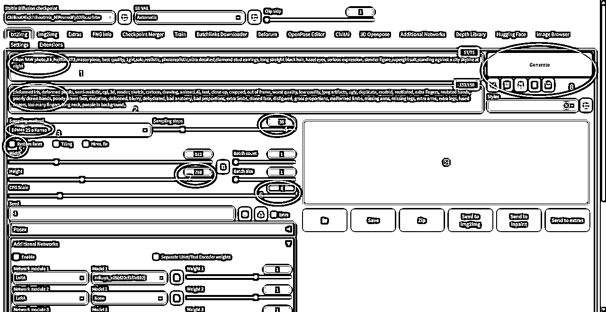


# 提高：自动、批量、无限出图

## 如何实现自动出图

使用Colab出图很快，大约30秒-1分钟可以出一张，当把参数设置调试好后，在Generate按钮右键，选择Generate Forever，让程序自动出图

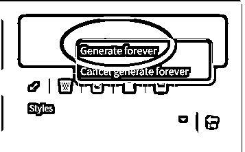

## 如何找到自动出图的图片

1.  回到Colab界面

1.  左侧找到文件选项卡

1.  图片存放路径在/content/stable-diffusion-webui/outputs/txt2img-images/出图日期

1.  双击某个图片，右侧可以打开预览

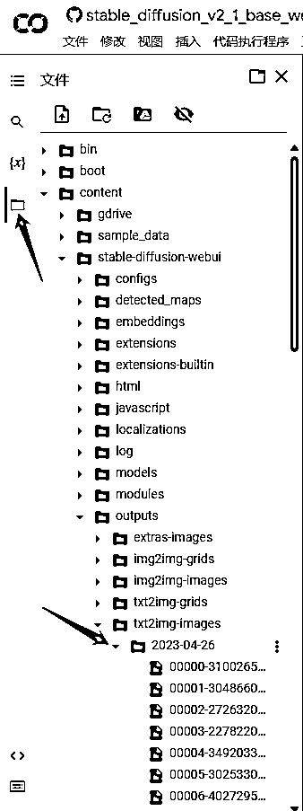

## 如何实现打包下载图片

回到Colab界面

1.  点击停止运行Stable Duffusion WebUI代码块

1.  点击+代码，新增代码块

1.  复制以下代码，粘贴到代码块，把路径修改为自己图片存放路径

1.  点击运行代码块，等待下方进度条走完，就自动下载

```
import os, tarfile

import os
from google.colab import files

def make_targz_one_by_one(output_filename, source_dir):
  tar = tarfile.open(output_filename,"w")
  for root,dir_name,files_list in os.walk(source_dir):
    for file in files_list:
      pathfile = os.path.join(root, file)
      tar.add(pathfile)
  tar.close()

  files.download(output_filename)

#把第二个参数修改为自己图片存放路径 
make_targz_one_by_one('neg_tar', '/content/stable-diffusion-webui/outputs/txt2img-images/2023-04-26')
```

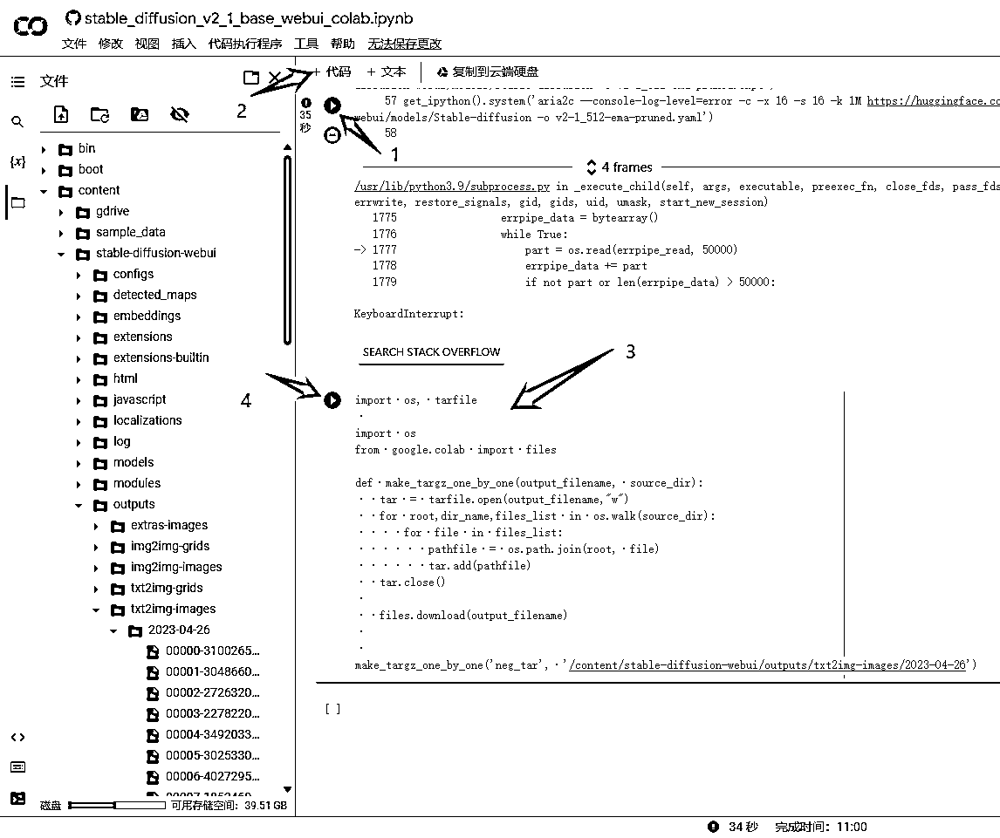


## 如何实现批量出图

*   电脑安装多款浏览器，如Chrome、Edge、Firefox等

*   每个浏览器登录不同的google账号，同时操作，批量出图

*   也可使用指纹浏览器批量出图

## 如何实现无限出图

*   每个免费账户每天大概有3-6小时的gpu算力

*   最简单的方法：氪金，升级Colab pro会员，增加可用gpu算力

*   准备大量google账号，或找到靠谱低价渠道购入大量账号

*   等某个账户的gpu算力消耗完，则换号继续

*   按5个浏览器计算，1分钟能出3张图，1小时可以出900张图，够够的了。