# 7天内从0到1利用instagram+Facebook完成私域变现2000刀

> 来源：[https://vvxlpvbvbp3.feishu.cn/docx/Nt9IdI0b0okp1MxGKBacQtxSn3e](https://vvxlpvbvbp3.feishu.cn/docx/Nt9IdI0b0okp1MxGKBacQtxSn3e)

大家好,我是Albert,连续创业者,爱折腾,搞钱才是王道

今天这篇文章希望可以帮助到对跨境电商感兴趣的朋友

一个人也能利用贸易差开启跨境之旅

促使这篇文章的诞生,来源于偶尔会在抖音刷到,教别人如何利用FB进行私域聊单

听起来很简单,其实需要准备大量的账号和设备,而且很难快速拿到结果

今天分享一个简单粗暴的方法可以快速拿到结果

实操过程中,会有一些小门槛,如果是纯小白的话,不推荐

如果是之前做过私域或者微商,在会一点投放技巧,那么这篇文章完全适合你

废话不多说咱们直接开始,大家一起生财有术 为了方便阅读图片统一放在最后

卖什么其实不重要,有没有货不重要,物流在哪里也不重要

我们开始一个项目之前,应该最大限度的去给自己做减法而不是给自己设置障碍

目前我们做的是欧美市场,卖的是原单太阳镜,我选择的是FB广告投放定向人群+购买咨询到ins

前期准备工作：

1：科学上网

2：一部手机+HK手机卡一张

3：电脑一台

4：FB个号+FB广告户

首先注册一个ins账户,注册一个WhatsApp,+科学上网保持IP稳定

Ins账户每天选择发5-10篇图文或者视频贴

素材来源：小红书,抖音

比如我是卖太阳镜的直接去搜 扒素材

INS连续发贴4天,也就是已经有了最少40篇帖子,在这里使用chatgpt来进行翻译简直是如虎添翼

首先我们先将ins个人账户切换成专业账户 由于我已经切换过了 在这里只是给大家演示一下

在ins设置中根据提示操作就可以

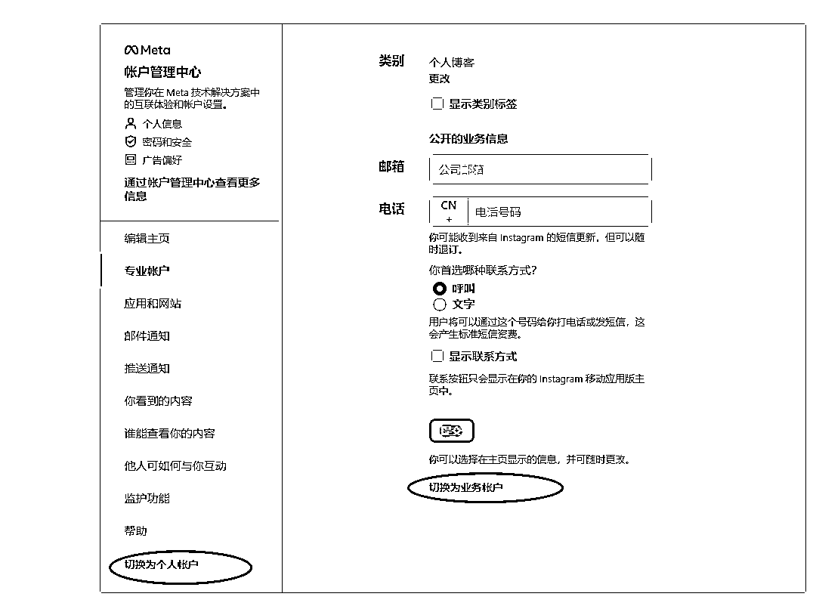

完成设置后 登录FB个户切换到公共主页,使用FB企业户授权FB个户 这样做的好处就是 广告挂了以后

我们重新绑定一个公共主页就可以了 一个FB个户是可以生成N个主页的

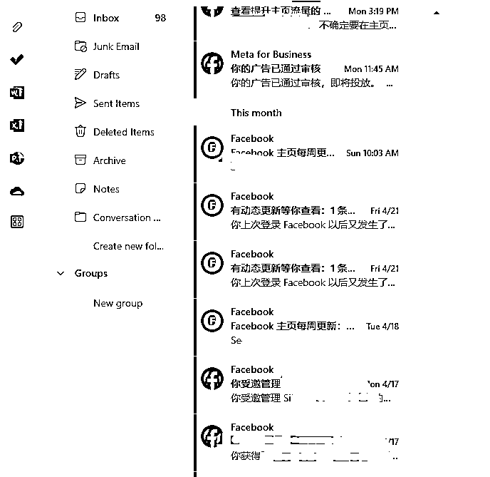

完成授权后,接下来就来到了广告投放后台,有过投放经验的圈友应该是非常熟悉这一套流程的

在这里演示下大致创建广告的流程

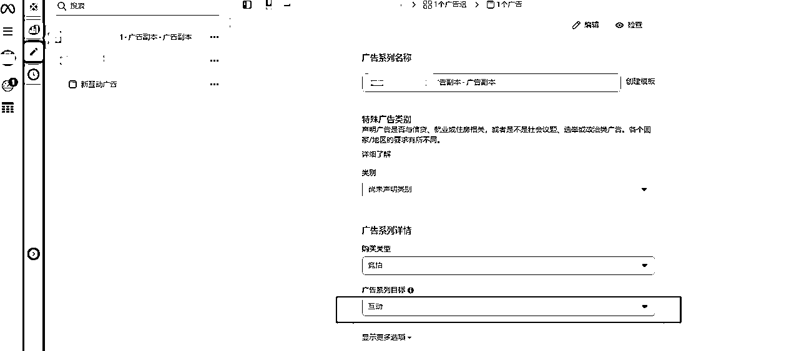

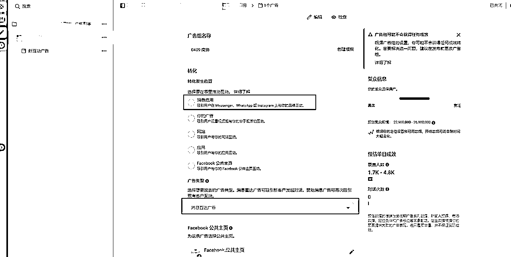

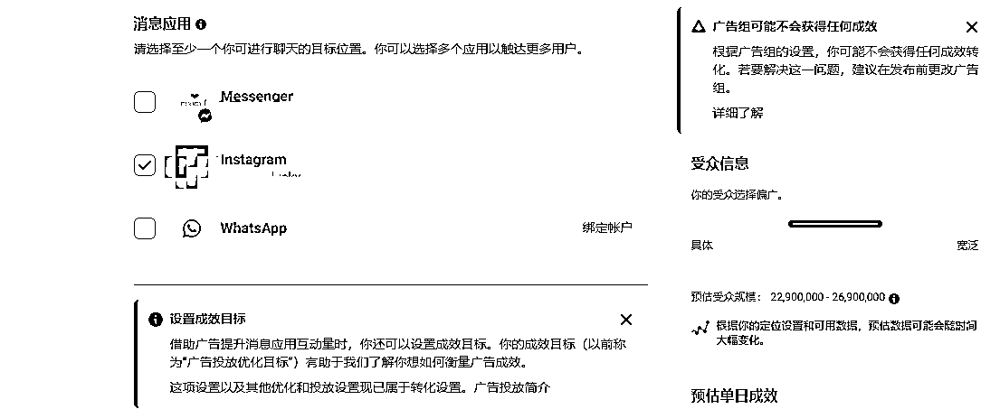

预算可以设置20美金,受众和国家看大家是选择的什么产品,在我看来只要是能顺利走物流的都能卖

看大家对客单价的预期来决定,接下来就是设置广告素材,以及引导话术,推荐使用视频素材效果会很好

一般一个有效对话的成本控制在5美金内,截图放在了最后。

接下来就是等待客户主动询价,来的都是精准客户,如何成交,尽量简单明了

介绍成品 询问客户使用场景 询问客户预算 阿里巴巴比价/报价/成交

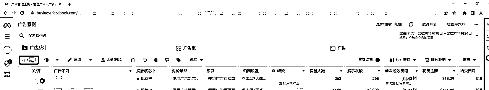

写在最后

要学会利用搜索,完成自己想要做的事情,其中的货源,物流,都是可以利用搜索来解决的

目前欧美正常一单100-300物流费

如果是无法搞定FB个户+FB企业户,也可以直接使用ins自带推广工具进行投放,

但是缺点是可能容易被封号,这个项目我从起号到出单,时间是一周

图中的客户已经属于二次购买了.

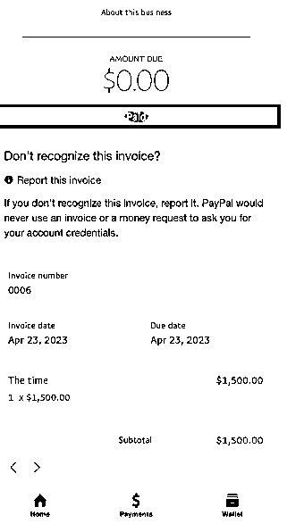

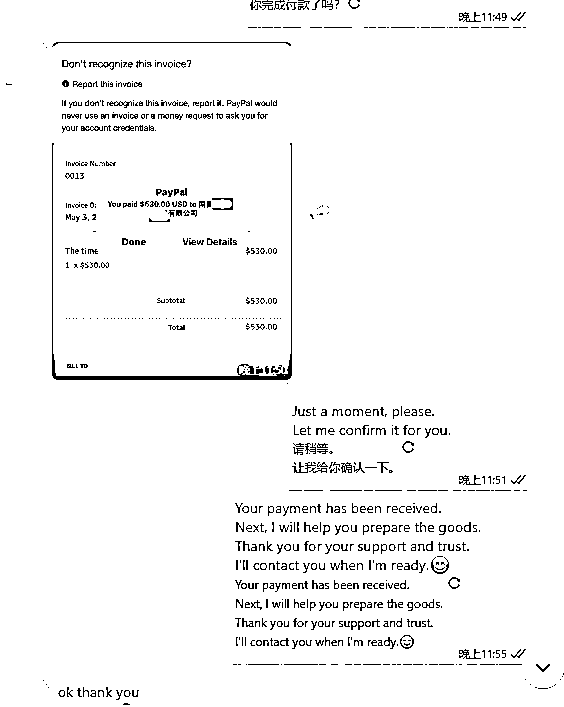

如何收款的问题,使用企业注册PayPal,进行收款。

如果对一个项目感兴趣,我认为这些都是可以解决的,只要善于搜索和学习,

生财也有很多大神做海外广告投放,大家也可以参考

最后的最后

这个项目的核心是不断的能够积累B端用户,那么我们就可以不断的利用贸易顺差和客户链接更多的可能

下图是客户打算采购2000把门锁

如果是纯小白,可以先从基础知识开始,如果已经有了一定的基础,一个人或者是小团队没有合适的项目

那么私域聊单这个业务,是完全合适的,成本可控,一切可优化

最后祝大家在生财有术 收获成长 多多赚米

文章写的有点乱,大家将就着看,多多交流 一起搞钱 LOL

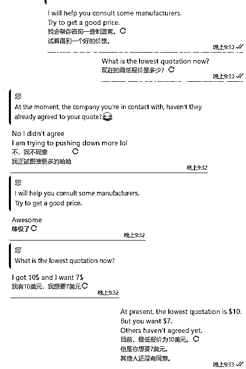

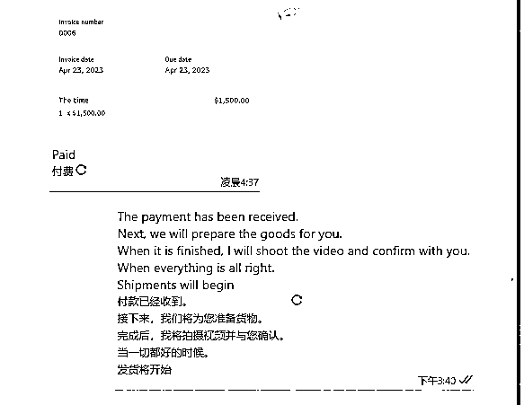

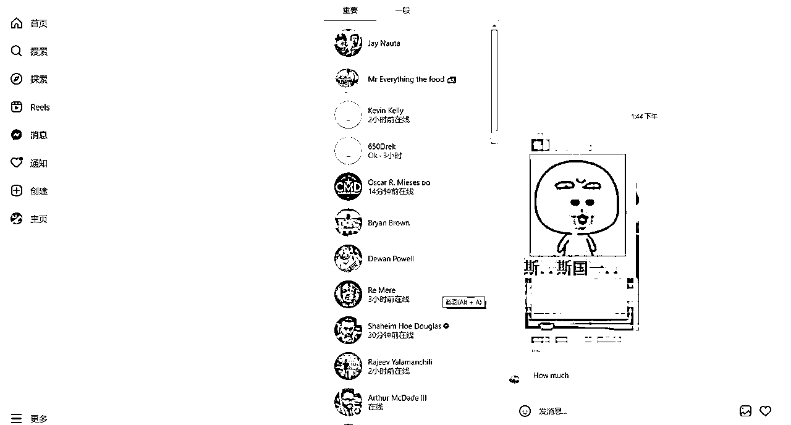