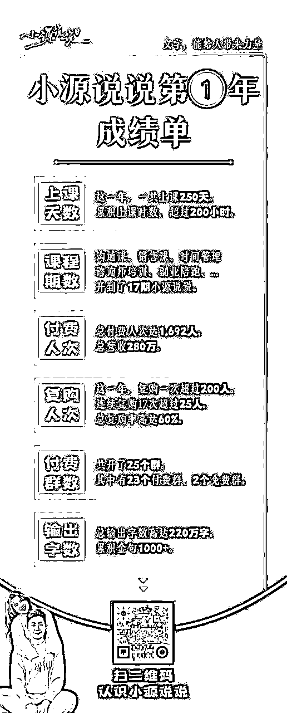
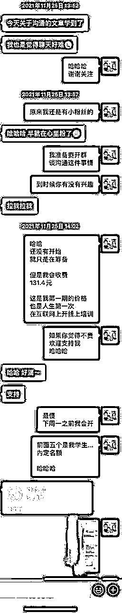
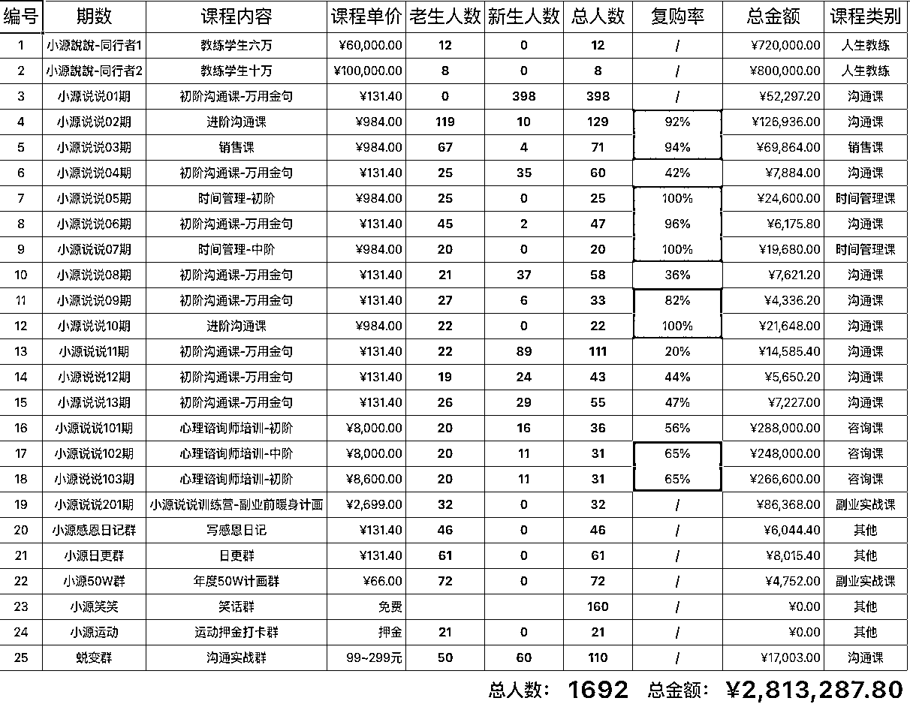
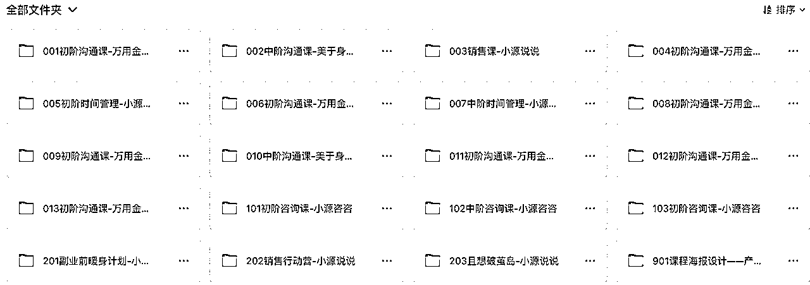
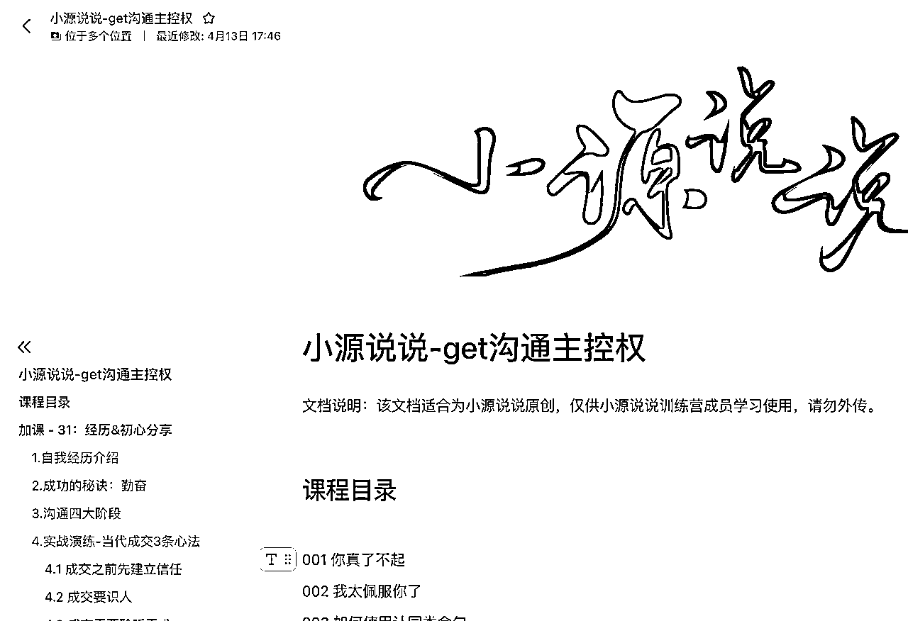

# 《9年传统行业 1 年时间，从一无所有，到年入 200 万》

> 来源：[https://oee5lr7gsk.feishu.cn/docx/QPFgdHgZsorQvdxDkl9cw58LnVf](https://oee5lr7gsk.feishu.cn/docx/QPFgdHgZsorQvdxDkl9cw58LnVf)

全文24,804字

大约阅读时间需要20分钟

# 0.从「线下」转型「线上」的起源

各位好，我是根源，也是做初入线上知识付费领域一年左右的新人。

因为生财有术大量的好文章，大量对的人，让我这一年少走了很多弯路，这一年来也有一些不错的思路、做法、以及成绩。

正式内容前，先付上去年的成绩单：

其实，任何的转型都得有个『契机』

这『契机』，可能是好的、也可能是坏的

🎯「坏」的契机：

因為失业

因为负债

因为技能被社会淘汰

……

🎯「好」的契机：

因为了解趋势

因为完成梦想

又或者因为想赚更多钱

……

转型期的契机有好坏

但转型后，不管因为什么原因，都是好的

因为转型，意味著另一个新的开始

过去九年，我所有的项目，都是从『卖产品』开始

也就是，跟人的链接都是因为「一个产品」有链接

这九年中，我做过了四种项目，这也代表我换过了四种产品

每次的换产品，我的人际关系『客户网』，都会经历一个非常大的洗牌

换一个产品（也能说换一间公司），老客户的流失率能控制在65%，已经是个很了不起的数据了。

也就是，1000人能留住350人

这次刚好因为疫情，天天只能在家

我就想，既然换产品，客户就会有个大变动，那为什么我不把自己当产品呢？

只要我不变，人就不会变动

这也是我做知识付费的开始，同时，也是第一次大转型的『契机』

### 但任何的转型，一定牵涉到『转换习惯』

过去我做的都是线下，但如果要做知识付费

就代表，我得把线下的很多习惯，转移成『线上习惯』。

可能是「一天看一小时群」，变成「一天得看八小时的群」；

很多口语化的说法，得换成线上习惯的语言

.....

我发现，转换赛道最难的，就是『转换习惯』。

因为这过程中，我们总会误会自己『不会』

但并不是

真正的原因都只来源于

还没习惯、不熟悉而已

* * *

# 1.转型前的关键准备——「混圈」

但这过程中，比起「转型」，我认为有一个很重要的步骤，这是多数人忽略的步骤。

原本行业 --> 正式转型

这中间，还有一个环节是：转型前准备

所有的行业转换，要有个准备期，就跟运动前要暖身一样。

这个转型前准备，我做了几个很重要的事情

*   第一：疏理圈子

*   第二：锁定圈子

*   第三：深入圈子

*   第四：深入后混周边圈子

## 第一：疏理圈子

最快的疏理就是，用圈子的『价格』

在一定水平上的『圈子』，不一定更有价值，但肯定相对有价值

我从付款超过四位数以上的群，或者是星球做了一个梳理

哪个经营起来价值更高？

哪个经营起来价值会更低？

筛选后，我决定深耕生财有术

* * *

## 第二：锁定圈子

當確定圈子之後，得先花大量的时间『看』

这时候，不一定要经营或者参与

但得先认真看，

看这个圈子中有什么习惯

有什么不能犯的

有什么做了，可以得到关注的

能理解成，要熟知圈子的规则

* * *

## 第三：深入圈子

熟知圈子的规则后，就得有步骤式的深入。

以我对生财的方式，就会是这样。

1、看大量的文章

这文章，不一定要是精华，我就是每天固定10~15篇，边看边记录。

我的纪录方式很单纯，就是把喜欢的文章放进收藏，有个印象，也知道回看要从哪找。

2、挑出喜欢的作者

上面我特别说，不一定要看精华文章

是因为，有些文章没进入精华区，但可能是适合自己的

文章适合，又或者是作者的表述自己喜欢，这时候我会特别，把人名记录起来。

然后挑出相同作者，还有哪些文章，我会一起看完。

3、联系作者

这里谈到的联系，不一定要加作者好友，可以是在底下留言，

多留几次言，让作者增加『关注度』。

三、五次后，就可以问作者的联系方式，礼貌的私信问（能加上某个自己喜欢的文章）

您好，很喜欢您的（某某）文章，对我有著非常大的启发，能否有您的vx，我加您。

4、写文章

因为生财的规则，把自己曾经有过的成功，又或者是失败经验，更新到星球里，有机会能变成精华。

但就算没变成精华，也能得到很多圈友的关注。

这时候，除了自己关注作者外，也会有人，主动联系我、认识我。

* * *

## 第四：深入后混周边圈子

上面的三个过程，大概进行3个月后，我就开始联系我很欣赏的作者，或者是主动跟我认识的朋友。

从中挑选2~3个我认为很不错的人，跟他联系，问问有没有周边的社群，是我能够参与的

这阶段，我自己的经济状况，并不是非常好，也因为经济能力没这么充足，我就得认真选。

每笔钱，都得花在刀口上

每个筛选过的人，我一定从金额最小的开始参加，如果觉得很棒，再继续复购。

同时能控制预算，也能很好的对这个人，有第二阶段的了解。

* * *

# 2.混圈的第二大阶段——「混群」

我会把『混圈』，分为两个阶段

*   第一阶段：混圈（也就是上面谈的）

*   第二阶段：混群

我谈的群，先单纯的定义：『微信群』

「混群」也是我认为转型前准备，第二个非常重要的大阶段

## 2.1「经营好人际关系」会比「卖什么」更重要

有80%以上的转型，甚至是有80%以上的副业，都脱离不了『销售行为』

就是得把产品卖出去

就是得把课程卖出去

就是得把程序卖出去

不管哪一种，都会跟『卖东西』有很大的关联

既然谈到卖东西，我第一个思考的关键问题

### 比起『卖什么』，我认为更重要的是『有谁能卖』

因为副业前的准备，是在一个「想卖什么产品还没确定」的状况下，进行的准备

先把未来，可能可以卖的对象准备好

这时候，当产品完善的时候，不就马上就有对象能卖了吗

也就是，对于我的副业前准备来说

「经营好人际关系」，会比「卖什么」要来的更重要

副业前准备

同时也是一种透过大量的接触新领域，顺便找好自己的定位

也找找什么东西会更适合自己

* * *

## 2.2 「混群」目的和意义

既然，副业前的准备，『人』如此的重要

那该怎么在不同的群里，更好的『混群』呢？

以及，混群的目的到底是什么？

「混群」对我来说，有几个很不错的好处

### 第一：群众影响力

过去我的背景，一直都跟线上没啥关系

真要我拿出什么线上数据，做过些什么，根本就拿不出来。因为完全没经验。

这也是转型不同行业，最难度过的一个门槛。得靠时间累积，才能让背景更丰富。

在几个锁定的群中，大量的出现，一天最少出现个20~30次。

想想一个场景：

你是一个群主

有一个新的付费会员

一天在群里最少聊30段话

这人不只遵守群规

还非常有礼貌

群的任务，他总是第一个完成

同时还会帮我活跃群

协助新加入的人

..........

身为群主的你，会怎么看待这个人？

要我是群主，这样的人肯定是宝阿！

* * *

### 第二：看似跟群主关系好

这点挺重要的

还记得，加入生财的第一个周边圈子，是涛哥的跑步打卡群。

说坦白的，當時进群的时候，是中年阿姨拉我进去的（是我生财的两位领路人之一）

我连涛哥是谁都不知道，只知道，好像很多人尊敬他，然后涛哥是群的群主

当时也没想太多，反正群里有聊天，我就凑上去聊个几句。

每次的跑步打卡，我几乎都全勤

就因为这个『凑上去聊个几句』，就让很多人误会，我是不是也跟涛哥很熟

我也是过了几周才知道

吗呀！原来涛哥是神，这人太牛了

但就是这个，就让很多人误会，我是不是也跟涛哥很熟。

这段话太重要了

这就很像，站在巨人肩膀上的感觉

我也就是爱闲聊，讲话还有点分寸，别人喜不喜欢一回事，最少我的沟通，不让人反感。

原本只有3分的我，因为常常『攀谈』，会让一些不熟我的群友，以为我有8分。

他们根本就不知道，我跟涛哥压根不熟

只知道，这人常常跟涛哥对上几句话，还跟群里爱跟涛哥聊天的人，也能聊上几句话

能造成这样的『误会』，其实就足够了。

但这里有个重点，虽然这是『好处』

但我并没有因为这样，就到处在外跟别人说

你说涛哥阿

我跟他可熟了

这是大忌

我只是在混群的过程中，发现到多聊天、多增加混脸熟，可以得到这样额外的『福利』。

* * *

### 第三：能结交很多新朋友

这个理由，是「混群」最重要的事情，换一个新环境，想尝试卖点新东西。

这不，身边的圈子也得有所调整

这副业前的准备过程，我只能说，懵懵懂懂的可能会卖知识付费产品

虽然还不确定，但假设这一年多的准备确定了

我肯定得有一群「习惯为知识买单」的新朋友

这样当我要卖的时候，才知道找谁卖

所以第三个重点，是混群中最关键的行为

我得认识大量的人

我得有大量的新朋友

当然，这个「大量」并不是说要数千人，

这一年的时间，我的微信人数，也就從4500到5300，其实就800多人。

一年800人，平均一天新增2人左右。以流量思维来说，这人真不多，但初期有这样的量，就是我定义的「大量」了。

上面谈的思维，可能跟传统的『流量』有不同的做法，一般来说，流量肯定是越大越好，但除了一开始大流量之外，还有另一种方式我认为也很可行，就是『小流量，天天做』。

想想，一天固定增加2个新人，这两个新人还是从某个群里、或者是某个活动里、又或者是某个训练营里面加到的好友，这可不算是『泛引流』，而是很精准的筛选，跟谁的关系更好一些，主动加好友（也可能是对方加我）。

一天2个的速度，只要匀速不停，一年算300天好了，也有600人了，这已经是很可观的数字。

这种做法有个好处，因为日日的人不多，就不会认为经营关系，是一件很困难的事情，想像一个场景，一次50人加好友需要经营、跟每天只经营『个位数』的新朋友，心情上是完全不同的，以初学者来说，这可以更好的照顾好每个新进来的名单。

我有另一种成交率的计算方式： 成交率 = 用心程度 + 时间

也就是，为了这个新赛道的尝试转型，我整整用了一年时间，做了『副业前转型准备』

这一年，我做的主要事情就是，

### 深入的混圈，有效率、有步骤、有方法的混群

然後，月复一月的持续

用著一整年的时间，固定的时间、做固定的事

我都不是胜在

一天加了多少人

一天在群里说了多少话

……

但我胜在

日日持续

每天只要固定时间到

我就做这件事情

这思维其实很重要

不管主业又或者副业，

「固定时间做固定的事」，都是非常重要的思維，甚至是行为。

* * *

## 2.3 「混群」的重要思维——小钱不要犹豫

「混群」其实还有个很重要的思维

### 小钱不要犹豫

付钱要付的果断，打红包不要小气

只要从文章认识，让我接触了很喜欢的作者。

假设，私下问到了这作者，有什么能参与的引流群

只要价格是400以内，我啥也不会多说，他一讲价格我就转帐

这件事情绝对不能拖拉，连群是干啥的，我都不会问。就是打钱要快

然后进群就开始观察，回到上面说的，混群的流程。

这很容易造成对方的好感

因为我是主动链接，结果对方说了有啥啥群，我还犹豫，然后问一堆问题，这举动就不太好。

既然要做，那就让对方感觉，你已经很懂我了，所以非常快下决定

付钱的这个速度，也能在对方心中，第一次就留下一个非常好的印象

上面提到的流程，我大概重复做了一年左右

其实也没什么诀窍，就是步骤重复做，过程中可能会做一点小小的调整

毕竟每个群，都有属于每个群的属性

但整体的流程变化不大，就是重复重复再重复。

* * *

# 3.混圈一年后，第一次尝试做知识付费产品，7天赚回10倍生财门票

就这么一直做到，2022年的年底，时间刚好是生财的杭州线下会。

因为一年多的混圈，这次的线下会，我也特别应征了线下的夜话官，当了一次小组长。

有了头衔，同时我也在大会群里很活跃，线下也主动的跟很多人加好友

那次的线下会分享有一位分享者是正义老师

老师说了一个方式，叫做：现金投票

大概的意思就是

产品还没发布之前，可以先问问身边的朋友，对于这样的产品，有没有付钱的意愿

有人愿意付钱再开课

若是没有人，那就想想有没有其他主题

参加活动的我，这个主题听进去了

也刚好有一个不错的契机，线下会结束后，刚好跟一位圈友聊天（直接看聊天截图）

很有趣的事情是，收這個錢的時候，我也没有课，啥內容都沒有，连内容都是当下临时编辑的。

反正就想著试试看吧！没想到，对方真的打钱给我。

这段对话中有三个关键词

1、课程主题

2、不贵的费用（131.4元）

3、开课时间

其实，当我说课程主题的时候，我根本就没想好

只是因为圈友提到了我的沟通文章，我就想这话题说不定有市场。

所以连课程主题，也都是临时想出来的。

回到正义老师说的现金投票

重点能收到钱，只要有人愿意付钱，

就代表，肯定有部分的市场。

因为这是我的线上知识付费第一次

我很清楚的知道，赚多少钱不是重点

重点是，人不能少，影响力得做出来。

开课前我就有三个大原则

1、低课单（131.4元）

2、重交付（每天讲课）

3、长时间（连续讲30天）

有了第一个人跟我付费，当天我就用同样的话术，连续找了十个人

因为这一年多的混圈混群，又有生财大会的时机点，同时，过程中我又挺活跃的

我发现，第一天找了十个人，十个人都愿意给我付钱

这过程，我都还没有课程内容....

接著，我就给自己设定一个目标

🎯连续十天，每天给自己一个成交十人小目标。

这十天我找的人，都是这一年认识的新朋友新圈子来的朋友

运气很不错，这一年的事前准备，都没有白费

十天很顺利的，让我成交了将近80人，也就是成交率高达80%

看起来很顺利，但我其实用了一整年的准备

第一次沟通课的细节，可以看以下的文章

https://t.zsxq.com/0eooZZbM7

这文章详细的说到，第一次的课程的完整细节。

* * *

# 4.初次接触的项目，必须要有的思维——让子弹飞一会儿

有一部电影我非常喜欢，片名是《让子弹飞》

我觉得任何的项目，都必须要有这个思维

### 让子弹飞一会儿

尤其，这是一个自己初次接触的项目

从第一次踏入知识付费，我就给自己，设定了一个时间目标

最少持续1～3年，基本是一年

只要没有持续一年以上，所有的反馈，都只是暂时的。

如果进入到一个新赛道，要用短时间的反应，来定义这行业『能不能做』

就跟「第一天健身就说教练不专业，因为练完胸肌怎么没变大」是同个道理

因为这样的大前提，我给自己设定的时间点，是以『年』为单位。

也因为这样的大前提，过程中遇到的挫折，心情都能很快的过关，不会因为过程中的反馈少，而有失落感。

今年在开始第一堂课前，我同时也给自己设定了一个年度目标

也就是这一年只要往这两个目标迈进，因为我在互联网上，是没有任何『背景』的。

*   🎯第一个目标：期数

不管上课人数多少，我得把期数开多

一期结束，就马上开下一期的方式

*   🎯第二个目标：课件沉淀

「脑子很多东西」跟「有多少沉淀的文字」，这完全是两回事。

文字沉淀的够多，就能从中筛选变成产品。

同时，文字课件沉淀的越多，也代表，我能透过更多的尝试，来测试哪种内容市场会更喜欢

* * *

# 5.做课程最好的方法，就是先「开」起来，再完善

我很喜欢互联网的生态

假设一个场景（线下实体）：

今天我开个小饭馆，如果要测试一个新菜，我就得研发后，让客户试菜。

物料得先买好，广告得先打好，因为不能确定菜的口味，市场喜不喜欢，前期肯定会有很多『浪费』

也就是，我得先付出成本，才能测试卖不卖得动。

但互联网生态很特别

假设我有一个课程（线上课程）：

但并不知道，这课程市场上喜不喜欢，就能用前面提到的『现金投票』

最终不管是一个人付钱，又或者是十个人，甚至更多人付钱，我都不需要付出『金钱成本』。

唯一要付出的，就是花点时间。但其他产业不只要花时间，还得先投入钱。

因为这样的大前提，我就敢做很多尝试，什么课都能开。

我一直有个思维

### 卖课的重点是『卖』

### 开课的重点是『开』

课再好，只要没有卖就不知道反馈；

课再好，只要没有开就没法从0到1；

也就是，业务能力会远远重要于做课能力

如果是我这样的思维，就会发现，做课瞬间就不难了。收了钱，课就得想办法做出来。

初期的做课，就一个『标题』，就可以到市场上卖

这时候就会有一个疑惑：

课程都还没完善，哪好意思卖？

当然可以卖！

光是打出一段文字介绍，就可以尝试问身边朋友，对这主题有没有兴趣

可以等收了钱，再开始做海报

甚至一堂课程的推广，都不一定要有海报

只需要文字介绍，甚至是一个标题

假设七天课程，也不需要收了钱就把七天全准备好

可以把七天的课程，用微信群交付，平均两天上一次课

第一天上完再准备第二天内容

第二天上完再准备第三天内容

……

每次课程完，因为初期的规则，都还有两天的时间准备

这样倒逼的方式，出课的速度可有效率了

这种第一次，人数多少都不是最主要在乎的

就算只有三个人报名，也是赚。因为没有任何金钱成本。

人少就是私塾班，人多就是训练营。

其实，做课是一个很严谨的过程

上面谈到的作法，比较适合两类人群

⭕️第一类就是初学

初入知识付费体系，这样的方式很值得用

因为能快速得到正反馈

也能快速的，让自己透过某些机制（先收钱），倒逼自己输出

倒逼自己输出的过程，同时，也是一种倒逼自己输入

这是相辅相成的

⭕️第二类适合很有经验的人

上面提到，做课是个很严谨的过程

但同时，做人不也是一个很严谨的过程吗？

如果原本的经验就丰富，其实，很多平时的口说，就可以是一堂课

这时候的讲课，不一定要很多章法。

因为，很多随性脱口而出的话语，对多数人来说，就是一种经验上的章法。

这两类人，就很适合我上面提到的做课方式

任何事情，只要有了开始，後面就是修修補補、打磨打磨

要把一堂课弄的好，其实不难

### 最难的就是「开始」

* * *

## 5.1「初学者」尝试这种思路的意义

另一个对于初学者的思路是

第一年，可以尽量『多尝试』开课，会什么主题就开什么主题

趁著大量开不同主题，能同时复盘「自己到底会哪些东西」

有可能：

我觉得微不足道的技能，竟然是最多人买单的

我觉得人生最精彩的绝活，竟然是卖的最差的

因為『我』觉得好跟『市场』需要

这完全是两码子事

不透过这样的大量测试，是不会知道，我的哪个技能是大众所需要

更细致的说：不會知道我的哪个技能，是我私域所需要

* * *

## 5.2 课程的交付和内容的沉淀方式

去年一整年，我开过的课程种类可多了

不谈课程，应该说开过的付费群种类可多了

沟通初阶

沟通中阶

销售课

时间管理初阶

时间管理中阶

日更群

感恩日记群

心理谘询师培训初阶

心理谘询师培训中阶

副业前暖身计画训练营

如何完成五十万前导群

……

下图是去年一整年，开过的所有群列表、价格。

我的大原则就是

### 想到什么开什么，第一年就当尝试

*   我开的所有付费群，有个大原则——交付全在『微信群』交付

*   交付的内容，主要沈淀在两个平台：核心是飞书，部分会沈淀到知识星球

也就是，飞书有的内容星球不一定有；但星球有的，飞书肯定有整理。

* * *

## 5.3「微信群交付」背后的逻辑和思考

会这么做有几个很大的原因，我把这归类在个人定位里。

⭕️第一个原因是

第一年，我更多要的是，

透过不同课程的测试，以及线上的互动，能让我得到市场对于这门课程的『反馈』

只要有反馈，我就能对课程有所修改

只要有修改，这课就有机会越打磨越好

微信群，是一个反馈最快的途径

⭕️第二个原因是

我其实不太喜欢学员付了钱后，看到的是一个影片回放，或者是文字回放，不管这笔钱是高还是低

因为我个人也不喜欢这样，如果我付了钱，

发现只能看影片回放，又或者是原本就复制贴上好的文字

这课我估计就不太看了

这没有对错

有可能新一年的开始，我也会把过去的课程，变成『产品』单独贩售

⭕️第三个原因是

课程用群的方式交付，可以从中，找到好苗子

未来如果要把这事情做大

### 个人肯定跑不动，一定需要团队协作。

未来的训练营才能跑的通

用群交付，可以找到很活跃的学员

这学员，就可以变成未来的团队班底。

⭕️第四原因也属于个人原因

我知道自己的公域引流，并不是太厉害

用群的方式交付，也能更好的，触达到每一个学员

这可以增加复购率

这过程中，我其实得到很多『相同』的反馈

上课上到一半，学员突然提问，我可以马上给出回答

这时候学员都会私下说：

老师

我没想到这课程

竟然都是你亲自上

这太让我意外了

我觉得，互联网的『公域』时代，少了一份对人的温暖。

### 公域进化到私域，要补上的就是这份温暖。

这份温暖，也可以说是一种『人味』。

如果说，我是如何定义自己的社群？

我会说，这是一个有『人味』的社群。

也因为这个『人味』

所有的操作上，我会去除所有的『自动化』

不管是发毕业结语

做毕业证书

一个一个的拉进群

作业的提醒

.........

所有的社群小环节，我全都是用人来驱动

虽然部分内容一样，但依旧坚持，一个一个手动发，多加上一个人名。

发完后，多一句嘘寒问暖。

* * *

# 6\. 课程设计的重要原则——「100-10-5-1」

我常在想

为了「维持商业人设」过日子，还是为了「坚持自己」维持商业人设？

我更偏向后者

因为这样的思维前提，做项目不会累

我不用为了迎合商业模式，就无法做自己

有时候，不一定是自己的樣子，市场不喜欢

更多的是因为，自己的样子坚持的不够长，导致，市场都还不知道，接受你的人还没出现

* * *

## 6.1 如何确认，我的课程是否有市场？

这里有个原则

就是「自己喜欢的样子」，在没有跟100人推荐过之前

这样子市场能不能接受，都还是未知数

所以100人是一个基础值

来决定，我喜欢的样子，到底需不需要做调整

这个思维，其实是一件事情无法坚持的关键点

总希望快速得到正反馈

可是初期的「转换」，正反馈本来就无法这么快出现

第一次卖课，没有一对一的跟一百人说过，就跟自己说：

这课市场不要

我应该不适合做知识付费

课程做不到五期，每期就只有不到十人报名，就说：

这课不好

我得换一个课程卖

对于这块有个大原则：

### 100 - 10 - 5 - 1

100：100人次付款

10：想办法完成10%的复购率

5：最少开5期（可以是不同主题）

1：包含1种『进阶课』

* * *

## 6.2 通过课程体系的设计，找到一个更好的「转化路径」

最后的『1』包含一种进阶课，这很重要

因為所有课程结束，一定要有个『转化路径』

就类似

我开完沟通初阶，一定要有个沟通中阶

销售初阶班，后面得有个销售中阶班

……

假设我已经开了销售中阶班，学员上完了怎么办？没有新课啦？

这时候有两种方式

*   第一种：弄一个新课程

*   第二种：让他复训初阶销售，免费

* * *

## 6.3 课程结业时间的注意事项

这里还有个小注意事项

课程的尾声，尽量不要卡在三大节日

1、春节

2、五一假期

3、十一长假

假设我的初阶沟通课结束的时间，刚好在04.28号，这就不太好。

因为一个长假过去，原本能成交的人，可能一个节日过后，对方就不想继续复购了

如果真不小心，课程真的在假期准备到的时候结束

最好的方式就是，假期之前先收钱，给一个比较大力度的优惠

然后特别备注开课时间，先把钱收著，留住学生。

那如果课程沒有遇到這樣的狀況，放假后继续上即可

* * *

# 7.课程完整的交付流程

比起「一堂课该怎么做」；

我觉得，可以尝试转换一个更大的框架，

「一次课程从开始到结束的交付过程中，我应该设定哪几个环节？」

因为这样的思考

做课就不是唯一重要的事情，而会变成其中一个『小部分』

有太多初学者，会把『做课』看得太重

但对于一个完整的课程来说

引流也重要

如何卖也重要

怎么呈现也重要

怎么结尾也很重要

……

每个看似重要的环节整合在一起，才是一个完整的交付

而不单只是，我把课程做出来

这一年多来，我有一个自己走通的交付流程：

1、课程主题

2、（现金投票）现有微信好友私信开始卖课

3、收钱，同时发上确定开营日期

4、开营

5、每天群里固定时间讲课（最少七天）

6、结业式

7、给出新课程资讯、老生优惠

8、私下一对一发毕业证书，同时询问复购意愿

* * *

## 7.1 课程主题

这其实容易，

只要重新的给自己人生，做个复盘

随便都能找出好几个主题

能尝试著开课

人生所有曾经学过的东西，都值得透过成长后的自己重新分享一次，尤其在这么美的互连网时代。

* * *

## 7.2 现金投票

现有微信好友私信，开始卖课

我发现，多数刚进互联网的小白，会有个『误区』

这误区就是，一有课程马上开始『引流』

发朋友圈

或者是写公众号

又或者是更新小红书

……

但是，对于一个刚开始，想尝试做知识付费的人，我都不建议这么引流。

因为初期的效果，肯定不大。

没有名声、没有背景、这时候哪谈的了流量

所以这阶段

我非常非常的建议，从目前现有的『微信通讯录』开始卖！

初期的卖课，

### 一定要当个『主动者』，不能当『被动者』。

*   『被动者』

意思就是我发个文章、发个朋友圈，就有人主动来问我课程

*   但『主动者』，必须得主动出击

就跟街边卖艺一样，一个一个勤勤恳恳的敲门拜访

同时，也能训练自己介绍产品的能力

同时，更能重新透过这个步骤，疏理自己的通讯录关系

「微信通讯录」，是个很少人愿意花时间，深耕开发的宝地

明明通讯录很多人，但第一个想到的

就是小红书

就是公众号

就是透过买量来增加购买

……

可是这些举动，最终不还是要导入到通讯录吗？

也就是，多数的通讯录，只是一个更小的『公域流量』

所以初期的课程推销，我都建议

### 从自己的通讯录开始，一个一个聊，一个一个问

每天最少聊十个人，设定最少成交两个的进度

当成每次开课的必要过程

一般来说，不管我的哪一期课程

我都会重新的聊，通讯录里面没聊过的新名单

只是到了越后期，因为有人转介绍，会有新增的好友

我就会以新好友为主，旧好友的比例降低

每次都筛选一点

每次都筛选一点

……

次次的筛选

总能从过去的朋友中，找到一些愿意为我付费的人

这方式尤其适合，初期没有流量的小白

因为最开始的阶段，只要没有背景，又或者没厉害的人帮忙推荐

所有的平台发产品图片，几乎不会有太大效果

除非，原本的经历非常强大，可能是某某大厂，又或者是什么样的人背书

发的目的，不就为了能产生转化吗？

所以初期的阶段，最好的转化方式，就是一对一聊

这是初期最精准的方式

也是初期

可以更有效的找到报名者的方式

* * *

## 7.3 收钱，同时发上确定开营日期

只要对方有意愿，我会事先编辑好一段话，类似这样：

### 1）课程第一期的版本

----------这是我第一期的方式--------------

043 靓号会员你好

在這，先谢谢你对我的信任​

啥都没问就付了钱​，这是闺蜜级别的对待​

是这样的，两个重要的事情​得跟你说

*   第一件事儿是拉群

日期：11/29（周一）​

时间：19:30~20:00​

这是統一拉群时间​，到时候所有的细则​

都会在群里统一宣布​

到时候，是由我亲自拉你进群​​，提前跟你说一声

*   第二件事儿是自我介绍

这是拉群前，除了付我钱之外，最重要的事情

以下为自我介绍链接

麻烦你点进去，完成一下这份资料，万分感谢～

* * *

### 2）课程最新一期的版本

付款后，都得有个『确定词』

到了现在快二十期了，我的内容有了精简，类似这样：

----------最新的迭代版本-------------

谢谢你的付款，也恭喜你获得一个挺厉害的群

等等会有两个手续

*   第一：会加入你进入一个主群

*   第二：有一个三人小群，主编会协助你加入飞书。

因为有些历史资料，飞书有挺完整的纪录

这个三人小群，也是一个核心小服务群

有什么不好意思问的，都可以在小群里面说

有个小备注：

小源说说体系不支持退费

以上若是都没问题

帮我打上
『确认没问题』

我就拉群啦

* * *

### 3）「确认词」需要包含的5个要点

付款后的『确定词』，最好能包含，以下几个重要资讯：

1、开课日期

2、谢谢对方（或是恭喜对方）

3、对方需要配合的事项

可能是改群名

可能是先进群

可能是链阶打自我介绍.......。

4、重要备注

小源说说体系就是不退费

5、让对方确定

只要没有发：『确认没问题』前，我不会收款

也就是，只要对方没打「确认没问题」，都还不能算正式成交

但目前为止，还没有在这阶段拒绝我的。

这个确认行为很重要

### 因为规则事先说，后面可以避免掉，很多不必要的纷争。

尤其是退费这个机制，能说清楚最好。

（这个确认是不管金额多少都会如此嘛？）

对的，不管大金额小金额，内容是差不多的

* * *

### 4）高客单价课程的「确认词」版本

但如果，金额比较大（像是训练营）

这部分内容可能会更多，包含了详细规则

目前，我有两个单价比较高的产品，

1.  一个是三万的年度训练营，

『确认词』是这样的：

付款前，我还有一件，比较重要的事情，属于产品机制

有 2 件事，我需要在付款前，向你说明一下。

*   第一：这个产品一旦付款后，不予退款。所以，请慎重考虑。

*   第二：因为达成目标，最核心的一点就是 —— 每天都做一些，围绕目标相关的事情。

所以，为了更好的帮你达成目标，我们训练营会有一个硬性的达标率：

一年训练营期间（周六日，法定假日正常休息），完成任务的打卡率必须大于 85%。如果没有达到，这个训练营服务会自动中止，并且不予退费。

最后我想说，这个机制的意义在于，我想让你明白，

一个人要获得更多结果，比如赚到更多钱，就必须付出更多。

这个付出，一定是要落实到每一天的行动上。

勤奋、努力，从来都是成功的基本条件。

如果你做好了，这一年付出不亚于任何人的努力的准备，那么欢迎你来一起。

我相信，这一年下来，你会收获到自己想要的东西，并且成为一个全新的自己。

以上 2 条内容，如果你同意的话，回复“确认”。

1.  我还有一个十五万的教练费

『确认词』是这样的：

这不是一笔小钱，需要你慎重考虑

钱很大、时间也很长，是一份长期的信任

同时，也是一笔我认为，会是你这辈子付的最值得的钱

然后就是，小源说说体系不退费

如果上述的都没问题，请打：『确认没问题』

如果没问题，我们就把这事情正式的定了！

不管长、不管短，我都会有一个确认词

训练营的确认词，基本上会是打最详细的

就只为了避免，之后可能产生的纷争

因为谈到钱，只要事情没说清楚都会牵扯不清，很麻烦

* * *

## 7.4 开营（课程的第一天）

我的每一次课程开营，都会包含两个很重要的元素：

1.  发红包（超过4包以上） 一般都是开场2个红包、结尾2个红包，第一个红包是普通红包，每个人领固定数字的、另一个就是随机红包，最少100元10包，这样的数字，才能让领到的人基本都有『双数』以上。

1.  时间短 大概会在10~15分钟左右结束，不耽误太久，因为开营就是做简单的介绍，课程都是课程的事情。

1.  介绍上课方式、开课时间 上课时间、上课方式、上课天数、群的基本规则、这几个都是开营的过程，一定要包含的重要元素。

* * *

## 7.5 每天群里固定时间讲课（最少七天）

讲课的时间点尽量不要随意更换，如果第一天是晚上八点上课，那整一轮的课程尽量都在晚上八点准时交付，尽量不要有临时更改时间的状况。

因为固定上课时间，如果课程不只一期，可以让持续报名的学员知道，这个时间到，就是小源说说准备讲课啦，可以养成多数的学员，这个时间不排其他行程的习惯。

* * *

## 7.6 结业式

从怎么开群，到怎么去找课程内容，一直到怎么销售，

最重要的尾声就是

如何结业式

以及如何发毕业证书

以及如何去做新一堂课的复购

我认为这个过程，其实是整个尾声里面最关键的一个环节，

当然，步骤也不难，就是要费点时间，要费点心思。

我的每一堂课都会有一个结业式。

那一般假设是七天的课程，总共的时间都会进行到九天。

因为第一天会是开业、上七天课、然后到第九天就变成结业式。

那结业式我一般会有两大流程：

*   第一个流程

就是除了发红包之外，还有做这堂课的一点课后心得，

以及介绍下一轮课程打算开什么，

同时还会给上老生报名新课程的（复购）的优惠券，

可能是200，可能是300，可能是多少钱的优惠券。

那这优惠券，大概都会是

课程的七折左右，七折到八折之间。

但是这个券，我不会设定只能报名下一堂课。

可能这个人是第一期的学员，如果他第二期不报，他选择第三期报，

那这时候，我的优惠券也适用。

就是优惠券如果是省300，他报第三期的课，

依旧可以使用这个省300的优惠券

但是，这个优惠券最多只能使用一次，想在什么时候用呢？不一定。

可是大原则就是

如果他是报名初阶课程下一次的优惠券，如果那个优惠券的折抵是300块，

但是那个课程初阶课程也是100多块，那这时候就没办法折抵。

一定得折抵比原本的价格在更高的课程。

所以，我一般都会在尾声给出这样子的券，

然后我不会给那个兑换的时间限制。

* * *

## 7.7 给出新课程资讯、老生优惠

就我自己的小源说说体系为例

最初阶的课程，又或者是第一次对我付费的人、甚至是转介绍

基本上我不会给任何优惠，一定是原价购买

因为我跟这个人过去没有交集

信任感也不够

也不确定是否认同我的价值观

当然第一次对我付费的人，肯定都是三百以内的消费（一对一咨询除外）

除了刚刚的没信任感之外

我的想法是

这种一百到三百的费用给优惠，坦白说，也优惠不了多少钱

打个折了不起省个几十块，其实没太多意义

​

与其这样

我还不如把这个优惠力度，给到老生身上

也就是愿意第二次购买的人

举个例子：

初阶课299元，进阶课1500元

初阶课我不给任何优惠，

但如果上完初阶，愿意报名进阶课，我就给一张200元的折价券。

这就等于初阶课程，只要99块，几乎是三折的价格。

好处就是「筛选」以及「把优惠给老人」

* * *

## 7.8 私下一对一发毕业证书，同时询问复购意愿

那在群的结业式完毕之后

我都会「一对一」地重新发一次毕业证书，

以及给一段我个人对于课程的反馈以及结尾，然后还会给上上课的回放。

以及私下再把优惠券跟那个新课程的介绍，

同时「一对一」地跟每一个人说。

我发现这个举动其实很棒，

因为如果这个举动是人工发的话，

我又可以刚好跟学员可以有一些对话，可以有一些聊天，

所以，

### 其实私下一对一的发毕业证书，

### 反而是，我在整个课程体系里面复购最高的一个举动。

当然，可能也是因为在结业式之后的过程，

（群里面）介绍新课程的这个环节我并不擅长，

我发现每一次结业式的过程，

我顺便介绍新课程，大概都只会有5%的人复购。

但是如果说我在私下的一对一说

就可以让这5%的复购率提升到30%

所以，我认为一对一发毕业证书，跟重新聊聊天，介绍一下课程结业式的内容

会是一个我所有课程必须经历的一个阶段，

也就是十几堂课以来，每一次的毕业证书，其实都是我一对一手工发的。

然后所有的课程复购都是我一对一亲自说的。

这个其实可以让他感觉到，我很认真地在乎每一个学生，很认真的照顾每一个学生。

也因为我的这个举动，

我一开始都觉得是不是上课的体验感不好啊，

或者是新课程的那个内容他不喜欢

后来发现不是，是因为整个知识付费的现况——有太多课程了。

如果这个课程又是属于三位数的，可能299，可能599这样子的价格，

这个其实是一个知识付费很通俗的费用体系，

那这样子的费用体系，会让那个人付了钱之后会想，

我到底要认真上课，还是这个课程我就先买了吧，然后有空再听？

我发现三位数的课程，很难让一个人，

在不经历其他课程的情况之下，只专注于上我的课。

这个比例太少了。

所以在做课程复购的时候，我可能一对一私发给他。

他当下不会回，但是过了两天之后会突然说

老师

我前几天我因为在忙

因为那个没有空看学习

我今天看到了

那我想继续报名下一次的课程

我发现，如果我开始「一对一」地去做毕业证书的发放、再做新课程的介绍，

就可以让这个人，过几天之后会发现信息遗漏了。

因为群太多了，他不一定会看群，

但他可能会看一对一的私聊，

那他不看群，就代表对于这个课程不重视吗？其实也不是。

可是我最开始会误会，这个人是不是觉得我的课不好，

因为这个人在群里面也不活跃，也不写作业，也不给反馈，也不参与聊天话题，

结果之后他竟然愿意花钱再继续买。

所以，我发现用群的活跃度，来显示这个课程好与坏，我认为不够客观。

因为，

### 私域最终其实是一对一的私聊，而不是我这个群有多少人。

我发现群有多少人，这个人多少多少钱买了我的课，

这个都还不是私域的终点。

我认为私域的终点，其实还是回到「一对一」的聊天。

所以，如果最终可以做到，一个「一对一」的聊天，

然后让他感觉，老师是很重视每一个人的。

这举动其实可以让转化率提高。

同时，也可以让我们跟学生之间的关系可以更密切。

这时候我们可以去看

哪些人会愿意私下跟我多聊一点

哪些人不愿意私下跟我聊

这个其实都可以透过私下的聊天，做一个很好的检视标准。

同时，也可以去让自己有一个更清楚更客观的课程反馈。

所以，总结这一块，我觉得

### 从「群发售」之后，一直到「一对一的聊天」，这个过程是一定要走的。

尤其这过程不止要走，

还得让讲师，就是让群主，亲自地做这件事情。

这个过程如果做了

其实，是可以让学员能够有挺不错的好感，也可以增加转化率。

所以，我觉得这是课程尾声我认为很必要做的一件事。

* * *

# 8.如何搭建一套完整的知识付费体系

做知识付费的初期

我认为，有这几个事情很重要，一定要在初期就马上执行

1.  主编体系的搭建

1.  内容沉淀平台的确定

1.  社群规则的设定

1.  付款方式的多元化

1.  课程交付的时间段

1.  涨价机制的构建

1.  引流方式的选择

## 8.0 知识付费体系的三大阶段

先说一下，我对知识付费体系的定义

我其实会把知识付费分为三大阶段，

应该是说，把老师跟学生的关系，分为三大阶段，

### 第一阶段：学生选老师

在没有流量的时候，其实是学生选老师。

因为没有流量，

所以我就得用不同的课程内容，去吸引不同的学生进来尝试听听。

看我上课有没有什么吸引他的，或者我的教学方式是吸引他的。

### 第二阶段：老师选学生

到了第二阶段，就变成是老师可以选学生。

因为在教学的过程，我觉得磁场很重要、价值观很重要。

有可能这个东西我觉得很棒啊，但是学生不喜欢。

这时候不代表这东西不行，而是可能前期我的量太少，

所以我没有办法筛选到一些，或者没办法筛选到一群喜欢我价值观，以及喜欢我上课方式的学生。

所以到了第二阶段就变成是

我开始通过不同的方式，来选择什么样的学生是我想吸引的。

但这过程得花时间。

如果说，没有上个五期六期，没有个三四百人的付费学生。

都很难去做到让老师可以选学生。

因为最初前期没有流量的阶段，

如果我就以老师选学生的方式，没有人为愿意为你付费的。

所以这就会导致，我就没有一个池子可以让我去选择，什么样的学生是我更喜欢的。

所以第一阶段的学员数量非常地重要。

第一阶段的量如果没有做大的话。

就很难进到学生老师的第二阶段，就没法开始想选一些我喜欢的学生上我的课。

### 第三阶段：老师「影响」学生

然后到了第三阶段，就是我依旧可以选择我喜欢的学生。

但这个过程我还可以做到，让那一些感觉不错的人，但是可能目前他还不是我对标的学生。

我能够透过

上课的每一天的价值观输出

每一天的教学模式，

甚至，私下的聊天

把这个人慢慢的转变成我喜欢的学生。

所以我会认为知识付费体系会分为三阶段。

如果说可以到第三阶段就会有个好处，这个人原本就算不是我喜欢的人。

但是可以因为我的上课，因为我的模式，让这个人慢慢变成我喜欢的角色。

所以，这三个阶段，在知识付费，如果做了一年，能够有这样子的改变。

倒是挺厉害的一个过程。

* * *

## 8.1 主编体系的搭建

### 1）为什么要搭建主编体系？

我记得第一期开课，

每天都有很多内容输出，但我苦于不知道该如何整理

秀儿就跟我说：

你可以到群里问

有谁愿意当小助手阿

（小助手 = 主编）

因为这句话

让我有了一套属于自己的主编体系

以及对主编的思维

如果，只是要请主编整理文章

我会觉得，有点可惜

把一个『大用』，用成了『小用』

### 主编，其实是最贴近讲师的角色

也因为贴近

所以主编也最能懂老师的价值观

所以初期

我不建议只找短期用的主编

要找长期使用的

也就是，训练主编的过程

同时也是筛选自己团队的『雏形』

* * *

### 2）主编福利，应该如何给？

### 主编的福利，不要给钱

毕竟，请主编是帮我做事的

做事情，肯定得要有酬劳

但我不建议这个酬劳，用『金钱』支付

可以选择

*   送ㄧ对一谘询

*   也能给一个更大的折扣，送下一期课程优惠券

*   又或者是，送一个特别的小礼物

我对于主编的福利

都是以上的三个，让他们选一个

假设一般学员报名下阶段课程，可以有八折优惠券

主编我就给五折、甚至给到三折

不用金钱是因为

### 合作过程中的筛选

### 「用钱」是最没价值感的

给钱最快，但给钱也最没价值

* * *

### 3）如何去筛选对的人，作为主编？

过程中，我要做的是『筛选』对的人

我绝对认同

对的人不是训练出来的，而是挑出来的

但也不是每个「对」的人，都跟讲师契合度是高的

所以挑对的人的过程，也要顺便筛选

最开始，每个主编我给的福利都一样

不会因为他做事情的多寡，而给出不同的福利

大原则：

### 福利先说，再做事

因为福利先给

我就能从做事情的态度中，以及认真程度中

找出配合度高的

找出风格我喜欢的

找出细心度高的

就因为福利都给一样，筛选出来的好苗子才客观

不然，就会造成主编的努力，为的只是得到更好的福利

为了某件事情的追求，不一定是这个人的真正样子

所以这样的方式，只为了从中知道：

每个人的真实性格以及习惯

这样的挑选人才会更精准、更有效率

因为每一期的开始

一定会有主编再次复购

新的一期，除了主编复购之外，就算人数已经足够

我依旧会在新的课程中，再次招生新课程主编

最少用五期的课程筛选，选出大概7~10人的核心主编团队

每一期，我的主编复购率，几乎都能有85%左右

也就是，主编团队每次的复购，大概也就流失个1~2人

最后，我的主编全部都变成同行者，也就是我的终身学生（6~10万）

### 主编机制若是做的好

### 未来想把体系扩大，才能有信得过的人选。

因为主编，也会是未来的训练营工作人员

同时，主编我还会有个要求

就是，群里的所有作业，主编一定要带头做完

除了是活跃群之外

同时，也是我筛选主编的要求之一。

* * *

### 4）主编体系在知识付费体系中的作用

主编体系，

其实会同时完成知识付费第二阶段（老师选学生）

跟第三阶段（老师「影响」学生）

就是我可以透过主编的做事过程、做事风格、做事态度。

来决定这个主编会不会是我持续想用下去的主编。

然后持续用下去的过程，也可以透过我的边教学或者是边给出不同的建议，看这个主编的配合度。

这主编，也可以慢慢变成我更喜欢的，更适合我的学生。

所以如果主编用的好，就可以同时完成知识付费的第二阶段跟第三阶段，这个到后期会很轻松的。

因为「对的人」，他在做转介绍的时候，

可以把这个老师的风格、上课方式，以及老师的大概情况、上课习惯……

跟转介绍的人讲的很清楚。

这时候就可以发生一件事。

就是所有转介绍过来的学生，不太需要透过大量的学习或者大量的听课，来熟悉我。

而是在「转介绍」这个环节，在我学生跟他介绍的这个环节就能够快速的知道。

这个老师

听完我朋友的介绍

我就很喜欢了

所以这时候的上课

转介绍的学生一进来，可能就会配合度非常的高，

甚至是出勤率非常的高，或者是写作业的打卡率也非常的高。

所以，如果第一阶段可以从大量的学员中找出更好的主编，把主编训练起来。

其实，这是能让「后续的转介绍水到渠成」的一个过程。

我认为转介绍的目的，并不是要这个人可以帮我推多少人。

当然这是风格问题，就是有些风格是必须得有很大的流量，

那我可能更适合去做转介绍，或者是老朋友的单子。

因为他们对我有熟悉度。

所以我觉得主编的培训，最大的好处就是

当我在把主编训练好的时候，所有的转介绍过程。

我就不需要再花太多的时间，让新的人知道我在干一些什么。

所以他(转介绍的学生)一进来上课之后，

我可能就会发现，感觉这学生是对的学生。

所以，这个会是我认为主编结构里面很关键的一个环节。

也就是，知识付费体系的第三阶段，

我不止能够去选到「对的学生」，还可以把「契合度没有那么高」的学生变成「很契合」的学生。

* * *

## 8.2 内容沉淀平台的确定

前面谈到了，

第一个叫主编系统，我认为第二个很重要的事情是沉淀的平台。

因为所有的上课内容

都必须要有一个地方，可以当成这个文章沉淀的载体。

### 第一阶段：知识星球

像最开始我选择的载体是知识星球，

我认为把所有的文章沉淀到知识星球上面，

在未来要做查找，或者是做编辑，或者是做搜寻，会是一个很好的选择。

那个时候，我是想把内容沉淀跟运营做在一起，

就是因为星球上是可以留言的，是可以回复的，甚至还可以提问，互动性会比较强。

但是，如果说我单纯只是要做知识性的沉淀，

我倒是不太建议选择知识星球，

我要运营群，同时还要运营星球，这个让我感觉有点吃力。

因为，那时候都微信收款，并没有转到用知识星球收款。

当时没有转的原因，就是觉得只是星球手续费比较高。

然后，上面的运营，我花的时间又不是这么的多。

只是因为大家用，我就觉得星球是一个最好的选择，所以当时走了一个错路。

就是我把所有的人弄到知识星球上之后，我还得重新做一次收费。

因为，最开始我的课程，其实没有这么快的转到星球。

然后，后来才发现可能有更适合我的选择。

所以，第二阶段我就没有选择把课程的沉淀放到星球上去了。

我把所有的互动都只在微信群里面做，但是我不在星球上面做互动。

* * *

### 第二阶段：飞书文档

我第二个选择的沉淀平台就是飞书。

那时候因为疫情的关系，飞书其实是免费的。

我发现飞书上的整理资料，是一个非常好的整理体系。

它不只排版，不只表格，不只所有的编排系统，

甚至，要让学生可以随时查看过去的历史记录，都非常的方便。

所以，我的内容沉淀平台，最终选择了飞书。

然后甚至所有的主编系统，所有的课程内容，所有的问答。

都会在飞书里面有非常好的建档，所以这个是我认为很重要的。

第二个就是内容沉淀平台，在一开始必须得选好。

选哪个平台都好，就是在最开始要『确定』。

* * *

## 8.3 社群的规则的设定

第三个我觉得最重要的是规则。

如果一开始开社群，就可以有一套属于自己的规则。

我觉得这个在后期，如果课程开的越多的时候，

可以让很多老生，或者是很多新参与的学生，可以知道

### 这个老师的人设是什么样的人设。

* * *

### 规则一：不设定社群内学员的任意链接，但会特别备注「基本礼貌要做到位」

这规则可能是「群里面你要任意加人，我不干涉」。

因为毕竟互联网是一个开放的平台，我也限制不了「你不加人」。

所以，与其「限制」还不如「特别的备注」：

人可以随便加

但记得要有礼貌

然后记得要表明来意

我觉得这个是其中的一种规则。

* * *

### 规则二：社群的提问不设限

再来的规则可能就是

我的每一个群，不管是销售，不管是沟通，不管是时间管理，

我其实都会多开放一个栏目，叫做提问。

*   第一个点是

也就是任何问题都可以提问。

那这个问题不会只限于销售

也不会只限于沟通

也不会只限于咨询

……

就是如果这个是咨询群，他可以提出别的问题都行。

就是我的所有群都会开放，能够随时的提问，

甚至随意的提问，没有次数限制的提问。

其实这么说出来，提问的人不会多。

可是有个好处是，只要有人提问，这个群就会多一个活跃度。

*   那第二个是

提问我只限于在群里解答，就是我不会私下回应。

因为私下回应就变成咨询环节，但是群里回应就变成是群的互动。

所以我的所有群都会开设一个提问的系统，任何提问都可以在群里面回答。

然后，我会给出解答。

* * *

### 规则三：领完红包记得说谢谢

还有像是如果有人发红包，领红包，记得说谢谢。

不要领红包，人就不见了，或者是领红包只给对方拍一拍。

我觉得所有的群里面谈的就是「互动」。

人与人之间的相处，谈的也是「互动」。

我认为所有的互动如果可以增加，感谢每个人在群里做的一点付出。

这个是可以增加群的活跃度，以及增加人与人的链接感。

所以，这三个就是我的群里面，固定会有的三个规则。

* * *

### 规则四：不退费

然后，我设定的第四个规则就是不退费。

我一直觉得两天无理由退费，三天无理由退费。

这个事情是个人定的。

那我想都成年人了，既然大家都成年，

### 我觉得成年人必须得为自己的每一个决定负责。

所以我的群一开始就设定，

只要是小源说说体系的课程，我都不给退费。

付了钱就付了钱，那付了钱之前，我会让你特别的考虑。

但如果说考虑完之后，你最后决定付钱了，我就没有让你退费的可能了。

所以这个是我的群里面会有的第四个规定。

这些规定其实因人而异，只要一开始把规定先设定清晰就好，

然后所有的规定可以慢慢的完善，并不用一次到位。

可以第一期的规定是两个，第二期规定变成第二期的规定变成三个，

可能到第五期所有的规定就完善了。

然后这边还有一个特别点是，

### 所有的规定，我都觉得在表达的方式上，不要讲的太过于直接。

因为文字的表达，很容易让别人误会。

如果说文字使用错误，在讲规定的过程中，

可能会让对方一看发现，怎么虽然你打的是规定，但是为什么我看的心里这么不舒服？

所以我觉得规定的这件事情，文字上的描述以及编辑，

需要特别的留意，特别的把内容做一点修改。

这个在前面我谈到，就是「确认付费」这块，其实有大概的说到一点。

* * *

### 规则五：固定时间上课

接着第五个是固定上课时间，

这个上课时间就是不管是用文字上课或者是用直播上课，

可以设定每一天可能晚上八点，或者晚上九点，或者是早上十点都好。

选定一个固定的上课模式，固定的上课时间。

如果说时间固定，未来的集数拉的又长，

就能够让过去的学员知道

七点到了。我得上老师的课了

或者九点到了，我得上老师的课了。

所以，前期把时间固定下来，我觉得是一个很好的设定。

这时候可以让每一个学生都知道，这时间到了，我就得把它空下来。

就不会因为

第一期是七点上课

第二期变八点上课

第三期结果变十点上课

……

我认为这个对于学生来说，就不知道该怎么去调配时间。

* * *

## 8.4 付款方式的多元化

### 1）让课程的「付款方式」多元化

下一个就是付款方式。

当然这个就要么微信、要么支付宝、要么就是银行转账。

那我觉得这一块如果可行，

假设有个人的公司的话，其实是可以申请一些能够刷卡的二维码。

我觉得付款方式如果可以更多元化一些，其实可以增加成交率的。

然后，这过程我其实有些学生，他是会分期的。

因为有些课程价格比较高嘛，可能要四位数，可能要3000块，可能要8000块，

像分期我也能接受，只是分期这部分如果要做的话，得很清楚的跟他讲分期的规定。

* * *

### 2）分期付款的规则

### 如果分期规定，一开始说清楚，后续就不会有太多的麻烦。

那我的分期规定呢，有几个，

#### 第一个规则：一定要上过我的课。

就如果这个学生没有报过，我过去任一堂课，

然后他想分期，我是不会给分期的。

就是我只会给有过信任的学生分期，

也就是对于老生

假设四位数的课程

我都会提供分期服务

我会让对方，做一个分期计划发给我

这阶段就是一种筛选了

看这个人除了有意愿之外

思维能不能清晰

分期计划有了之后

等他付完了首付

我就会给出完整交付

给首付之前我都会特别跟他说

时间到你记得准时给我就好

假设真的遇到状况

记得跟我说一声提前说都没问题～

因为，我不会提醒

所以，你要自己记得

但每个月的时间到，我不会提醒他

记得就记得，真不记得那这人我就当评估错误

目前为止，我没有哪一笔分期是拖延，或者是没给的

一笔都没有

这个目的，是能让对方感觉到我给出一份『完整的信任』

这过程中可以筛选出很多很多非常优质的学员

因为，准时是一种很棒的『好特质』

找出好特质的人比能力好要来的重要太多了

当然，这是我自己的评估点

#### 第二个规则：分期时间我都不会设定太长。

假设这个课程是21天，我大概都会跟他说，

分期的话三个月内得分完

因为分期时间太久，其实后续后续很麻烦的。

所以最好是不要超过三个月以上的分期。

我觉得这是一个比较好的时间段。

当然如果这个课程价格本身就比较高的话，

那最多就是往后延多一个月，我觉得已经很极限了。

所以分期的期数不要设定的太长。

#### 第三个规则：我会让他自己把时间记录下来。

然后每一次的转账

会在转账的备注栏上面备注还剩余多少钱。

我同时会跟他说，时间到了，你要记得转，因为我也不会做记录。

这么做的好处是可以信任每一个愿意来学习、跟因为不得已所以分期的学生。

所以其实每一笔分期我都没有催促过对方还款。

但是我会多一块，就是如果时间到了，分期的钱没有到账，

那到时候呢，我会先暂停课程，我不会继续把课程交付下去。

这个我会在一开始说清楚，然后我就会跟他说时间到了就记得准时转给我。

那如果说过程中遇到什么情况，提前跟我说一声就好了。

因为，毕竟每个人都有每个人的情况。

我觉得那没有关系，但是不能不说(说明情况)。

这几个是我对于分期的一个小规定和小原则

我会在一开始就跟对方讲的很清楚。

* * *

## 8.5 课程交付的时间段

再来就是，课程交付的时间段。

我第一次的沟通课，其实用了31天交付。

那从那次交付完之后，我就跟自己说，

### 所有课程的交付尽量不要拖太长的时间。

超过20天的交付课程，我就认为太长了。

因为一堂课上到后期其实会疲惫的。

这里谈的『疲惫感』不一定是课上的不好，

可能是学生在上课的过程，会接触到很多的新资讯。

然后每天写作业，写20天可能也会烦。

所以我觉得

交付课程的时间尽量可以压缩在14天，

除非这是一个非常高客单价的课程。

像我的咨询课

第一期我交付了90天

第二期交付了30天

到了第三期的咨询课，我就变成30天交付

因为这个价格得8000块。

所以，金额越高，我觉得交付期越长，但是再长也不要超过30天。

所以我的课程就分为三大类。

*   第一大类：低客单价的课程

就是14天以内的，就7~14天，

做一个比较简单的轻交付。

可能文字交付。

*   第二大类：训练营或者是咨询课。

那只要是训练营跟咨询课的时间，大概都会在30天左右。

像这样子的课程，我一般都会选择直播交付。

然后时间不会超过一个月。

*   第三大类：同行者

同行者可能就是终身交付

那这个交付就没有时间的问题了。

所以我大概分为这三类。

* * *

## 8.6 涨价机制的构建

接着就是

所有的系列课程，如果第一次开课，

我都会给出比较低的价格，以及比较重的交付。

像第一次沟通课，我就交付了30天，收100多块，

然后，第二期我就变回七天，也是收100多块。

然后，第我的第一期咨询课是90天收8000块，

那第二期就变成60天，但是我一样收8000块，

就是要让自己有一个稳定的涨价系统，

*   一种叫涨价。

*   一种就是把时间缩短，但是价格不变。

如果说在自己的上课体系，可以有一个很好的涨价机制。

这个其实可以增加自己的价值感。

如果是固定的涨价机制，就不会让一些学员会说，

哎，老师

为什么上期这么便宜

这一期变贵了

我想要优惠

这时候就不有这种情况发生。

因为他如果这期不报，下一期就再更贵。

所以，涨价机制，

是一个，我觉得在一开始上课的时候，就得设定放在体系里面的。

* * *

## 8.7 引流方式的选择

然后，我的对外引流，其实只有做两块，

因为我也没做小红书，也没做视频号，甚至我不直播，也不拍抖音。

1）第一个对外引流方式：公众号

我只有做公众号，然后我公众号的人数其实也不多，关注人也就2500人。

我就仅用这样子的人数，去做引流裂变，其实是远远不足的。

2）第二对外引流的方式：混圈

但是，我有做的第二块是比较少人会精通的，就是我前面提到的「混圈」。

像我有混了一两个金额比较高的圈子，

在里面，我会活跃，我会聊天，我会回答群里面的问题，我会常常说话，

那这时候就会有人推荐我。

因为，在群里面，觉得我不错的人加我好友，我都会顺手就成交他。

这就能够让这个顺手成交的过程，他就会帮我推荐，

可能在群里面就是说，

哎

根源老师的课程，我觉得很不错，

能够帮助到什么……

这时候，就会有人再加我好友。

所以我的主要的两条拉新渠道，

一个就是公众号，当然公众号的成交比例其实低的，

但是虽然低，可是2500人的关注，

也让我变现了十多万，我认为也不错了。

就是我光是在微信公众号的主动加我好友的引流里面，

我也成交了一个10万块的同行者，

所以，其实重点还是在于，

### 我有没有一个，更好地与人一对一沟通的系统

我的强项在转化，

那如果说，你有不同的强项，就要在那个强项里面多发一点力。

要清楚地知道自己什么地方强，

像有人就引流特别强，

有人就转化特别强，

有人可能交付特别强，

我觉得要清楚的，透过这么长时间的课程交付，

去找到一个自己最擅长的地方，然后把那边放大，这时候就可以走出一条自己的路。

* * *

# 9 知识付费初期的十一点建议

## 9.1 选择「轻」的交付形式，不要一开始就选「重」的交付

我不太建议初学者，

就是没有过知识付费经验的人，

一开始就开重交付的训练营。

因为最开始如果交付开的越重，会「没有办法转」。

那「没办法转」的意思就是，

当我有新的想法，或者是我交付的过程，

发现这个群好像没有那么活跃，又或者是这个好像跟我的感觉是不一样的时候。

一开始收太高的价格，做太重的交付，其实是会有挺大的问题。

因为前期做知识付费的目的是

要让自己养成以及习惯线上讲课的感觉。

如果这个感觉熟悉了，等人数充足之后再做重交付，我认为会更好一点。

### 因为，初期的知识付费

### 要的是「量」，而不是「我要把人交付的有多么的完整」。

所以，最开始前面的三个月到半年，就是前面的五期到十期的过程，

我都觉得不要这么快的开「训练营」，而是开「知识付费体系」。

就是我单纯的给出知识的教学，然后做一个比较轻度的交付模式。

把课件变得简单，把内容变得好上手。

如果说呢，这时候发现，

有很多人喜欢我的上课内容，喜欢我的上课风格。

等五到十期之后，可能累积了200到300人的付费学生之后，

再想着来开行动营或者开训练营。

因为这时候开行动营跟训练营，

我就可以收高价格，然后我就可以做一些更重的交付。

这时候打卡率才会高，这时候交付的人，才可以更加地与讲师有共鸣点。

所以，其实我去年的课程，

我大概有接近快六个月的时间，我开的全部是三位数的课。

就除了心理咨询师培训之外，我大概开了好几期的三位数课程。

我一直到了十月份，就是一直到了2022年的十月份，

我才开始开一期四位数的训练营。

就是让他们陪跑，让他们打卡，让他们去每一天固定做什么事情。

如果说，没有前面累积这么多期的主编以及学员，

我觉得我训练营开启之后，能够跟上这个难度的的人不会太多。

所以，我也一直到了很后面，

我收了快六个月的三位数课程，

到第七八个月开始，我才正式的收到四位数课程。

所以，我觉得前期的重点就是

### 交付越轻，内容越简单，越容易上手，但是价格可以先不用太高。

我觉得，这是一个初期做知识付费，我觉得比较好的筛选方式。

* * *

## 9.2 初期开课，建议开「价格低」的课程

延伸刚刚谈的，就是「价格高」跟「价格低」的课程，我到底要选哪一个？

有些人其主张开高价格的，

因为你要想如果一堂课2000块，我收十个人就2万了。

但是我一堂课200块，我得说100个人才有2万。

那10个人跟100个人，那这逻辑不一样啊，数量不一样啊。

❓那前期到底是要选择高价格，还是选择低价格的课程开？

我觉得，前期的半年都选择「低价格」开课。

因为，高价格的课程，我们最多的是

把交付做的更加重一点，但是人不会太多。

但是，如果我开低价格，

比如，200块，我如果只收了50个人，我只收了1万。

单纯就收入层面来看，其实我赚的钱是少的。

因为2000块的课，十个人，是2万块。

200块的课，五十人，也不过就1万块。

整整差了一倍的营收。

但是前期我还是会建议选择人多，不要选择金额高。

因为在一个没有任何背景的情况之下，如果我那么快速的就选择高价格，

这时候会发现

我不知道到底我的课程适合哪一些人

我也不知道我的服务方式到底哪一些人喜欢

所以，用一些更轻的交付

然后，每一次都把讲师的风格放一点进去。

如果说，我开低价格的课程，就可以吸引到很多人。

那这时候，开重交付的课程，可能就可以吸引很多人。

但是如果一开始我开重交付的课程吸引十个人，

这时候我在开低价课程，我不一定可以吸引到那么多人。

因为我并没有透过那么大量的人数来客观的评估：

到底我的方式这个市场喜不喜欢？

到底我的风格这市场喜不喜欢？

所以，前期我会建议，低价格轻交付的方式为主，多开几期。

* * *

## 9.3 报课的人数不那么重要，重要的是「开课的期数」

然后，前期的开课，我觉得人多人少其实不是这么重要。

因为，在过去没有任何经验的情况之下，

第一年只要设定期数，不断的开，然后内容不断的累积，其实就很足够了。

因为，很多时候的裂变，很多时候的倍增，都不会发生在第一年，

但是可能会发生在第二年，可能会发生在第三年，

所以，这件事情如果真的要进行，

我都觉得给自己拉到两年以上的一个规划。

在做知识付费的前期，就不会这么的失落：

就是为什么报名的人只有五个十个

或者为什么收的钱没有这么多

……

所以，前期我觉得可以把时间拉长，

这时候，就能够有不同的观点看待「上课的人数」。

像我去年总共开了十几期的课，有很多可能是，

我第六期开课，结果第二期的学生来复购；

第十期开课，结果第三期的学生复购；

我刚开到第十六期的时候，可能有第一期的学生来复购。

因为，他们看到的就是，

这老师应该挺厉害的。

他开了这么多期，每一期肯定都有学生。

所以，我觉得第一年要给自己设定一个很清晰的目标

### 就是我今年到底要累积什么？

我是要累积收入呢？还是要累积我的课件内容？还是说我要累积我的期数？

这些我都觉得是一个，最初要给自己定好的一个方向。

这方向如果确定，

就不会因为过程中发生一些什么小事啊，

或者一些什么预料不到的事情，然后就心慌、就失落。

* * *

## 9.4 善待每一位给出「负面反馈」的学员

在运营群上面有一个小地方，我觉得要特别的留意。

每个群里面总会有一些：

觉得上课内容不好

或者是觉得交付方式不好的

学不好的学员

如果说在群里面有这样子的学员，

直接在群里面可能讲

讲师不好，上课不好……

我都觉得这些人需要善待，

不要这么快的去怼他们，也不要这么快速地骂回去。

*   第一个是

群其实是一个公开的环境。

就算这些人已经进到了付费的私域，但我依旧觉得这是个公开的环境。

这么做，会显得讲师不够大气，

因为，讲师在群里面，

所有「反对问题」的处理，其实所有人都在看。

一个好的处理方式，可以让别人觉得

这个讲师够大气，这个讲师有大格局，这个讲师够大方。

但是，如果处理的方式太过于小气，或者是你就直接把对方骂走了。

这个就会让别人放在心里知道：

这讲师，可能就只有这样子

如果哪一天我也提出了我的质疑，

是不是这个讲师也会这么骂我？

所以，第一个点是我觉得要大气一点。

不要去骂他们，要更好的善待这些人。

*   第二个是

也只有这些人的出现，才可以让课程能够有所升级，有所迭代。

### 因为，好的意见无法让一个人成长的。

### 但是，不好的意见或者是需要改善的意见，可以让一个人有快速的成长。

所以，可以善待群里的每一个人，

不管这个人是用好的语气说想法，还是坏的语气说想法。

这一块如果说能够特别的留意，就会发现，

我们就不会有敌人，而是，所有的人都是能够帮助到我们的人。

* * *

## 9.5 讲师发红包，多大的红包合适？

下一个就是如果群主要发红包，就是讲师要发红包，

我的建议是既然要发就不要发小，最少都得发个一两百起跳吧。

如果说只是发一个红包，让大家领个零点几，

感觉大家体验到了领红包的快乐，但是却没有领红包的快感。

所以，如果说讲师群主真的要发红包，要发就发大，

最少让每个人领到两位数以上。

能够少发，但是不要发小。

因为如果说每一包红包都让别人领到零点几，

这时候就不会有人期待你发红包了。

所以，我觉得有一个点是，

既然红包要发，就发大一点。

不要让别人感觉，这群主怎么这么小气。

用这个方法做，

我觉得可以透过一些小动作，

让学员或者学生对讲师的印象，能够每一次都加分。

* * *

## 9.6 完善自己的通讯录

再来一个就是，要把通讯录做的完整一点，

这通讯录，倒不用包含到什么手机号，不用这么细。

我觉得通讯录最基本的就是

1.  姓名

1.  性别

1.  生日

1.  报过了哪堂课

如果说每一期都可以很清楚的知道哪些人又续费了，

有人可能是报了第一期，接着报了第四期；

有人可能报了第一期，然后报了第三期；

有人可能直接连续报两期

……

这些都好，这时候，我们就可以快速的知道，这个人他到底上过多少课。

那如果说这个人上过的课超过三期，那就可以给出不同的优惠。

也就是在确定要开很多期数之前，就可以让自己做一个比较完整的名单，

系统会知道多少人报多少期，然后我们把优惠给那一些上过越多期的人。

这块是我觉得初期也很重要的一个环节。

* * *

## 9.7 增加跟每个人的链接

前面其实有提到收费方式必须要多元，

但是在第一年开课的时候，我多数都是使用一对一的微信转账。

有一个很大的原因，我是刻意这么做的，

因为，当那个人特别加了我好友，然后给我付钱，

我就能够跟这个人多聊个两三句，然后亲自的把他拉进群。

我发现这个举动其实很棒。

他会认为所有的事情其实都是讲师亲自做的，

会让他有那种被服务的感觉，以及被重视的感觉。

尤其每一个人付钱给我，代表他一定要加我微信。

他加了微信之后一定得跟我聊两三句，

然后或者是附上可能付款的截图。

这过程如果做了，就可以让我知道，

这个学员在课堂上大概可能会有什么样的表现。

以及如果这样子的聊个两三句，

我能够透过文字，让这个人感觉到，

这老师挺特别的，他的联系方式我挺喜欢的。

像我开的是沟通课，

所以，光是他付钱，我给的一点回复，

都会让他觉得「我认为这个钱付的很值得」

因为老师的沟通确实挺好的。

所以这个举动，以及又是我亲自拉群，

是可以增加学生上课愿意认真听的一个挺好的筛选方法

以及一个事情的铺垫。

所以，在初期，

如果说人没有这么多的情况下，我都觉得用微信收款，

甚至你让那个人，一定要加好友入群，这个举动我认为是必要的。

因为，

### 私域的过程，其实就是增加跟每个人的链接，

如果跟每个人链接越深，

代表这个人愿意复购，愿意在群里面活跃，愿意写作业的意愿会更高。

因为，我认为互联网的时代，

其实人跟人的链接是距离变短了，但是温度也变短了。

距离变短就是，我在杭州，他在北京，我依旧可以跟他聊天。

虽然我能够用互联网的方式，快速的跟一个远距离的人聊天，但是会发现这温度就消失了。

因为发这个讯息不用钱，

既然不用钱，我就可以随意的使用文字，我就可以很粗鲁的使用文字。

所以，其实在私域这块，

如果说，能够把「人与人的关心」跟「对于每一个人的用心」放上去，

其实所有的小举动，都是为了增加下一次的转化率，

或者都是为了增加这个人对我能不能有好印象，

所以，很多的动作其实都会用手动操作。

能够一对一的跟这个人多聊两三句，

这个机会我是任何一个都不会放过的。

因为，这些东西都可以不小心就转化到一个愿意付高价的人。

再来一个点是，很多的人付了钱，可能就想着

反正老师就教东西，

就没想到我在学东西的过程

老师竟然会关心我的日常，

如果可以补足的话，这个举动会让这个学生，

有机会可以更快速的，或者是更丝滑的转到高价格的课程。

所以，我认为

「人与人的关系」跟「人与人的那种彼此用心程度」，

会是我这一年来我最注重的一个环节，也最关键的一个环节。

因为，这个东西如果补进来了，

可以让知识付费体系变得更完善，

而不会只有我单纯是教课，我单纯给你个技术，我单纯给你个课件。

* * *

## 9.8 透过「手动分销」的方式，加深关系

这个过程，我还做了一个比较特别的行为，

这行为其实跟互联网有一点相违背，

就是我所有的分销（就是学生推学生的过程），我都是手动分销。

像我也没有使用小额通，我也没有使用星球，

基本上第一年全部做的是手动分销。

这个人帮我推了什么课，我就会私下的把钱打给他。

然后把分润打给他的过程，

我就会顺便跟这个人聊个两三句，同时给一点感谢。

这件事其实有缺点的，缺点就是帮我推客的人其实不多，

那优点是，

推了一个之后，我就很好地跟这个转介绍的人聊，这个转介绍的人质感也不错。

同时，我还可以跟这个转介绍者，有第二次、第三次甚至到第四次的关系链接。

各有好坏，只是我知道自己的优势其实在于经营客户。

那如果经营的人很多，那种程度其实会让我造成很大的负担，有可能负荷不了。

所以，我第一年的最大目标，

应该说我第一年的设定，其实是

### 如何跟与我付过费的人、上过我课的人

### 有一个更深刻的链接，更好的关系维系。

当然这个事情因人而异，就是做量也是，然后做池子也是。

我的好处就是，

一开始的第一期课程，因为明白老师帮我写了一篇推文，报名了两三百多人。

所以，我有第一批足够大的量体，能够去不断的筛选，

边筛边转介绍，边筛边转介绍，

如果说第一期的人数没有这么多，

或者是付费的人数前期不到200人。

这个方式我就不建议。

应该这么讲，这方式我也建议，

但是必须要让自己的引流体系跟拉新体系做的再更完善一点。

可能写公众号

可能是一开始就用分销系统

我就觉得这一块其实都可以做的更完善，

只是我知道我的优势，我也知道我的弱项，所以我就选择避开了这一块。

这个方式(手动分销)，对于我的数据来说，其实也还挺漂亮的。

像第一年有1200人付款，但是复购（就是买过两次课程及以上）的人数有接近快600人。

所以，我的总体复购率其实有高达50%，

我认为有好有坏，

如果说一开始量体就很大，那可以用我的方式做，

但是如果一开始量体不大，

那可以尝试着「一对一」的去给分销，

「一对一」的去跟每个人多聊个几句，

以及尝试新的引流方式。

* * *

## 9.9 认真的对待，每一个加微信的人

但不管是哪一种方法，我认为有一条路是一定能走通的。

### 那条路就是，认真的经营每一个加我微信的人。

如果说有这样子的价值观，其实是可以很好地增加成交率的。

其实新好友加我的成交率，大概我都能够做到80%以上，

尤其，如果只是一堂100块或者200块的课程。

这很好成交的，因为我会认真的对待每一个加我好友的人。

就像线下开店

如果今天线下开了一家卖衣服的店，

这个人进来试穿不买，我难道就不服务他吗？

其实不会的，我依旧认真服务他。

因为

所有的聊天内容

所有的服务

所有的夸奖

所有的认同

……

为的就是增加成交率。

要一个人加我好友之后马上就能成交，这本来就不可能。

除非这个人是转介绍。

但是，如果说都知道，

自己的课程，在初期还没有这么多人购买的情况之下，

然后这么多人加好友，还不好好的去对待每一个人，

那我觉得太可惜了。

因为很多时候的成交，其实就是

### 我们会不会好好对待他，会不会用心的对待他。

如果他感觉到「这老师挺认真的」，

其实金额不高的课程，他是会愿意付钱的。

这边跟技巧无关，这边跟专业程度也无关，

而是，这一块我觉得在这个时代其实很稀缺的。

因为流量来的很容易，

尤其一篇小红书，或者一个视频号跟抖音。

要写出一个爆款，要拍出个爆款的影片，其实不难。

因为，已经有很多的方法在教这件事了。

但是，不管什么样子的爆款，

最终还是得回到，他加我微信，然后我得跟他聊天，然后想办法成交他。

所以，我认为这条路一直以来都能通，就是

### 认真的对待，每一个加微信的人。

### 认真的服务好每一个，不曾聊天的新朋友，甚至是旧朋友。

如果这块可以做好，

其实成交率，要能够维持在50%-60%以上，

在一个几百块的课程，我认为是能做到的，是真的能做到的。

* * *

## 9.10 定期做复盘

那最后呢，每三个月给自己一个大复盘，

一年最少会有四次的大复盘。

* * *

## 9.11 每一个月最少开一期以上的课

然后，每一个月最少开一期以上的课。

一个月一定要维持一期以上的课，

如果这件事情可以持续做一年，

我认为要让自己累积个三四百的付费的用户，难度是不高的。

我每一天认真的经营三个朋友，

不管是老朋友还是新朋友，

六个里面我们成交一个

等于是平均两天成交一个，

一年也可以成交100多人。

所以，我认为固定地让自己「一对一」地私聊，去经营新的或者老的名单，

这个事情在第一年是非常必须要做的事情。

因为，这样子的成交可以把控，

这个成交，跟「引流进来的新人」聊天的成交的把控度，是不一样的。

就是我写一篇好文章推课程，读者不一定会买。

但是，一对一聊，我就能够知道，我的能力可以增加多少的成交率。

* * *

# 总结：把战线拉长，知识付费是一个值得深耕的赛道

所以，上述的所有过程，

其实，我到第四个月开始做的事情，跟前三个月的事情是一模一样的，

第四个月做第三个月的事情

第五个月重复第四个月的事情

第六个月重复第五个月的事情

……

我只是把同样的事情我整整重复了一年，然后有了挺不错的效益。

所以我觉得把这件事情拉长，

不要在一开始没有太大正反馈的时候，就这么快的放弃。

我认为这样有点可惜。

### 所以把战线拉长。

### 然后透过每一次的过程，去做一点小小的调整。

我觉得这条路依旧是很值得走的。

因为，国内对于知识付费的这个事情，

其实，很多人愿意愿意为知识付钱的。

今天就算付了钱不学习，我依旧愿意付钱，是因为

我怕落后别人，别人学，我没有学，我就觉得这个太可惜了，

我怎么感觉输了别人，我就算不学付了费，我都觉得我比别人更进一步。

所以，如果一个课程的价格费用，并不是这么高，

我认为这个赛道，到现在为止，依旧是一个挺值得深耕的赛道。

所以，重点就是「重复」，把战线拉长，不要只是短短的一两个月就希望得到正反馈。

内容就到这啦。

希望有其中哪一段，能对看文章的你有启发，各位生财有术！！

* * *

尾声

内容就到这啦。

希望有其中哪一段，能对看文章的你有启发，各位生财有术！！

我是根源，同时也是第四期的生财圈友

一个有 2w+ 实战案例的心理咨询师

9 年线下销售、团队管理经验。

2022 年开始转型线上，做一些知识付费的项目。

过去曾发表过几篇文章

都能看到这，代表你对文章的喜爱

肯定有一定的程度！

也欢迎阅读过去我写过的历史文章。

2021年的文章（精华x1）

1.  精华《直觉式萨克斯 透过社群成功变现146万》 https://t.zsxq.com/116B1bcYc

1.  《73项被动收入打造》 https://t.zsxq.com/11EHjTH0P

1.  《杭州夜话02场，夜话官复盘》 https://t.zsxq.com/19IkX4UMl

1.  《年入百万，团队从20人到4万人》 https://t.zsxq.com/19JYt77hL

1.  《主题：如何更有效的链接见面会认识的圈友》 https://t.zsxq.com/19VY2LWg4

2022年的文章

1.  《互联网小白，第 1 次做线上产品，7 天赚回 10 倍门票》 https://t.zsxq.com/11ooZZbM7

1.  《把捣乱分子『逆势』转成爱用者的好方式》 https://t.zsxq.com/19lipLhJ5

1.  《 好的内容，是目前依旧没退旧流行的变现方式 》 https://t.zsxq.com/19BLMAYw1

1.  《明白老师的一个启发，让我从100天日耕的过程赚了30W+》 https://t.zsxq.com/19BgNoxfi

2023年的文章（精华x6）

1.  《私域的意义不是管理，而是经营》 https://t.zsxq.com/19WEsfSq1

1.  精华《9年传统行业 1 年时间，从一无所有，到年入 200 万》 https://t.zsxq.com/10nmEr1cA

1.  精华《25个提高微信成交率的小技巧》 https://t.zsxq.com/11AgRW24F

1.  精华《35 个让私域收入翻 3 倍的技巧》 https://t.zsxq.com/11FmV2aqZ

1.  精华《续篇 - 25个提高微信成交率的小技巧（26 - 50）》 https://t.zsxq.com/13yRbmUwo

1.  《 私域话题：涨价之后，如何回复以及留住客户？》 https://t.zsxq.com/11UJk9HxQ

1.  精华《成为自由职业者的20个必备特质 》 https://t.zsxq.com/14XTxhh15

多亏加入了生财有术

让我少走了很多弯路。

也积累了一些经验、心得

如果圈友有什么需要探讨的

欢迎加我微信「 AF54094 」交流~

也能扫码撩我~

* * *