# AI推文三天百万播放项目拆解，0-1适合新手向

> 来源：[https://ei8pv02rhq.feishu.cn/docx/R2wRd6dN2oUtkOx9I3WcLHAOnzc](https://ei8pv02rhq.feishu.cn/docx/R2wRd6dN2oUtkOx9I3WcLHAOnzc)

### 一、前言

大家好，我是刚开始尝试自由职业成为超级个体的 凌空，小说推文是我第一个下场入局的项目，很快就跑通了0-1，但是实践三个月后我决定从入门到放弃，但是大家可以借鉴一下我的项目操作经验，网上报了两个推文项目的陪跑199+299,算是对这个赛道有所经验可以来分享。

第一次分享，可能比较粗糙，大家可以提提意见。

此处先贴图

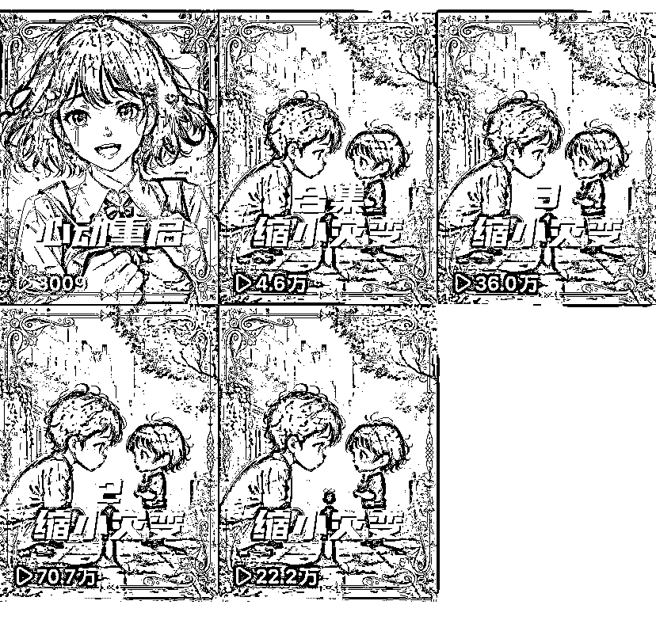

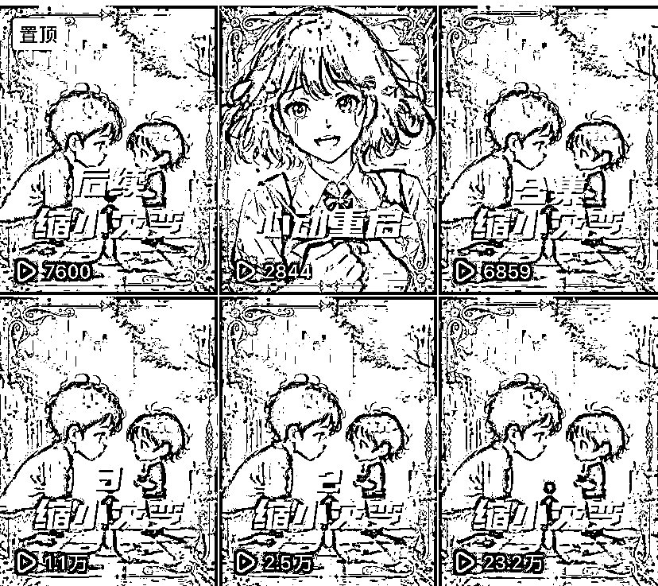

（左边快手，流量给得很足） （右边抖音，第一条二十多万已经很满意了）

看完这篇帖子你也可以用ai生成属于自己的作品。

废话不多说，直接上干货

（小说推文项目介绍我就不复述了，生财有很多大佬已经分享过了，这次我只分享如何用ai制作自己的作品）

* * *

### 二、为什么要做ai推文

AI推文的起源是一些之前做漫画解说的博主，发现小说推文项目比漫画解说赚钱多了，于是开始转型，通过SD生成二次元画风的作品来无缝衔接之前积累的粉丝，目前个人认为做得比较好的漫画转小说的博主大家可以去搜索下

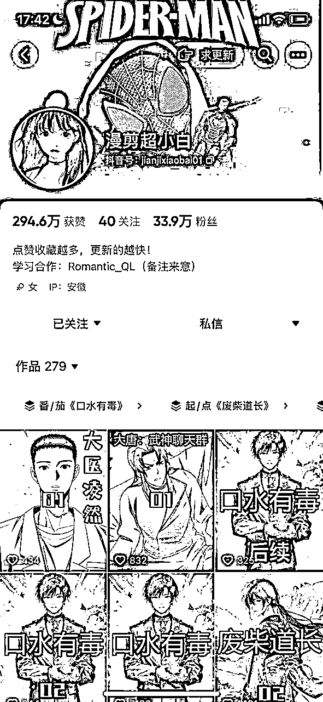

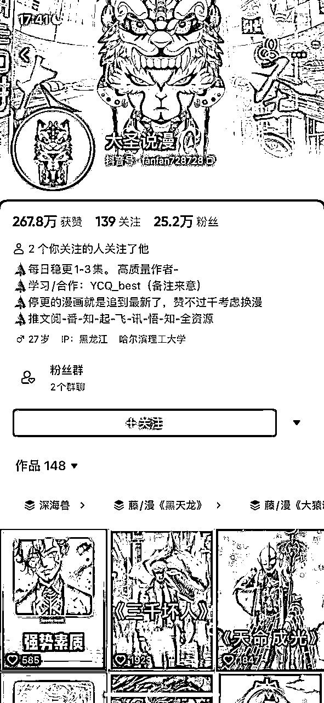

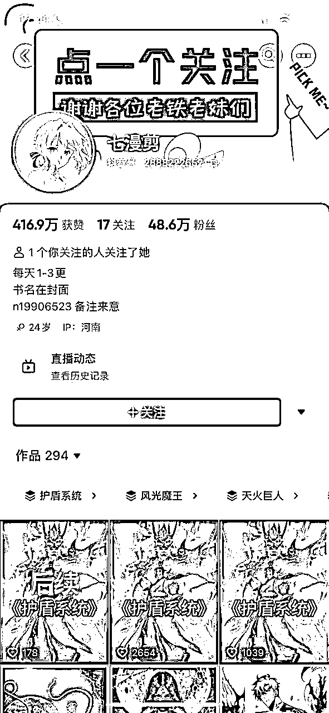

此处分享一条抖音61w大爆款视频，是我看到现在推文数据最高的一条，目测县城一套房首付有了

https://v.douyin.com/DtLUKum/

但是现在ai推文博主有一部分都转去做解压素材了

**目前推文赛道很卷

**女频知乎、最右等平台的文章只要改个开头，所以适合批量化矩阵化操作

**QQ阅读，番茄等男频平台需要提取精华，可能前五章的内容提炼到2000字左右，配上解压或者ai才能发布，内容产出成本很高

我开始做ai推文原因是因为上次生财见面会见了seven大佬和元哥大佬后得知他们有居多的号在卷女频，所以依然决然走上一条复制性没有这么强的风格化道路。

注：本贴不讲如何选文改文，只讨论如何用ai生成画面让用户更有代入感。

举个例子：

请大家默念下面这段文案

这场灾难来的没有任何征兆，全人类一夜之间缩小了2000倍，彻底沦为食物链最底端的存在，老鼠、蟑螂、甚至以前可以随便踩死的蚂蚁，现在都可以轻松杀死人类。

而缩小后的人类，正在逐步向一个全新的物种慢慢变化。

这是我用ai配音后的音频

这是我加上SD生成的画面后的效果

音效+BGM+画面=引以为傲的作品。

贴上原书：QQ阅读搜索《缩小灾变》即可收看原文

建议大家都去搜下，就可以看到我的开头文案完全是自己编的，可能是截取了前十章的精华+夸张后的效果

（案例演示完毕，接下来该实操，没接触过的小白也可快速上手）

* * *

### 三、前期准备

本次使用的工具是Stable Diffusion（吃本地配置但是也可以云部署）

如何部署不教学，可以直接看秋叶大佬的视频资源也在那

如果电脑配置不高，也可以云部署

全网最简单的stable diffusion腾讯云部署教程，没有显卡照样玩转AI绘画_哔哩哔哩_bilibili

整合包安装完后还需要下载模型，我推荐大家用这个

civitai.com

（科学上网即可下载）B站大佬融的模型，基本用这一个就够了

配音我用的是逗哥配音

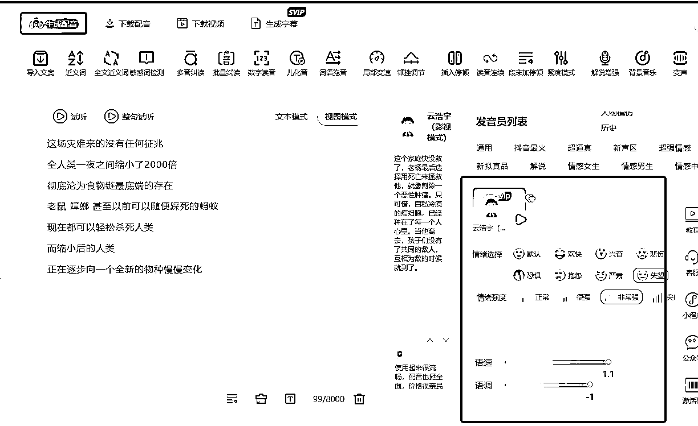

声音用的云浩宇（对标魔音工坊的魔云熙）

建议声音情绪选择可以多尝试，每种声音的听感是完全不一样的，注意，爽文千万别用失望的情绪，配出来的完全没法听

* * *

### 四、实操

先给大家一用一段文案打个样

你曾经有一个喜欢了你三年的女孩

她一次次认真得和你表白

你也对她渐渐有了朦胧的好感

一切按部就班下去或许会是一个幸福的故事

但是家里出了点事情

你只能一边读书一边挤出时间打工

打开我们的SD界面，按照我的设置来调试

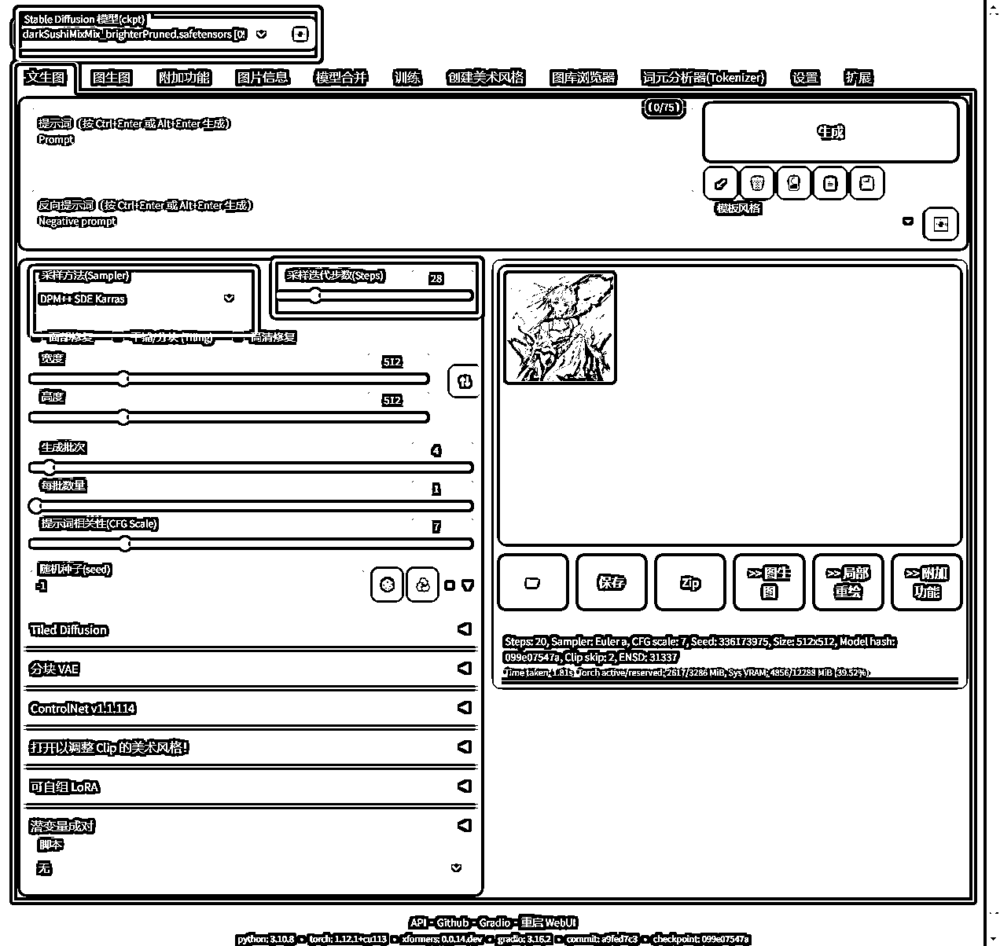

**开头的素材一句话一张，30秒过后的素材可以一段话一张

那么，这段话如何通过ai来实现画面感塑造并且生成对应关键词呢？

我的公式是：一个主角+面部服装细节描写+动作+背景

拆解下每段话：

“你曾经有一个喜欢了你三年的女孩”=一个美女+漂亮的脸+校服+脸红+在桌上托腮+教室

通过翻译软件翻译成英文=A beautiful woman , beautiful face , school uniform ,blush , chin on the table , classroom

即可得到以下图片

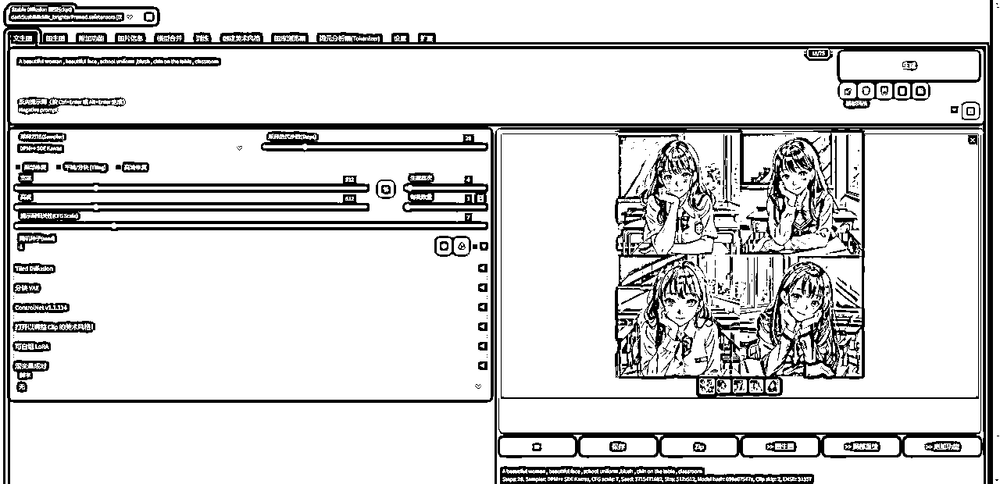

是不是快接近你心里的预想了？但是还会有一些小问题，清晰度、多了只手等，那我们加上关键词预设

正面词：super detail, award winning, best quality, 16k, UHD,A perfect and delicate face

反面词：lowres, bad anatomy, bad hands, text,error, missing fngers,extra digt ,fewer digits,cropped, wort quality ,low quality,normal quality, jpeg artifacts,signature,watermark, username, blurry, bad feet,

一般我在人像图都会预设这些词，大家先照抄就行了，非常万金油，那我们输入关键词后再打个高清修复看看效果。

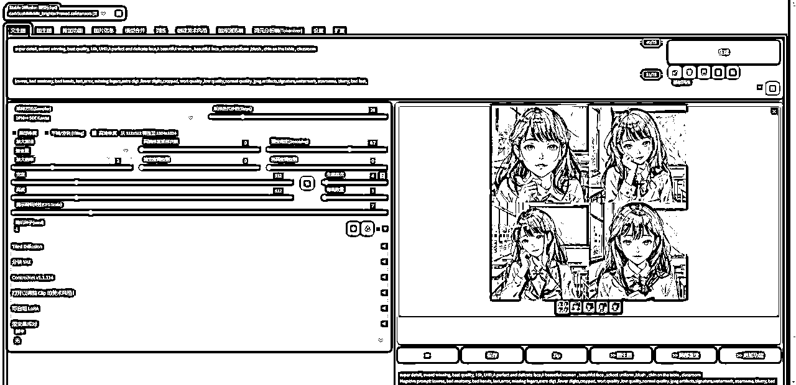

有没有满足大家心里的幻想呢？没有的话可以加上你希望出现的词哦

当然其他场景图只需要替换对应关键词即可，生成图片很简单，但是很吃电脑配置

我的显卡是3080ti基本开了高清修复四张图需要50秒左右，很耗时间，基本一条四分钟视频光制作部分得花个4-6个小时。

等图片生成后我们同步打开剪映添加关键帧

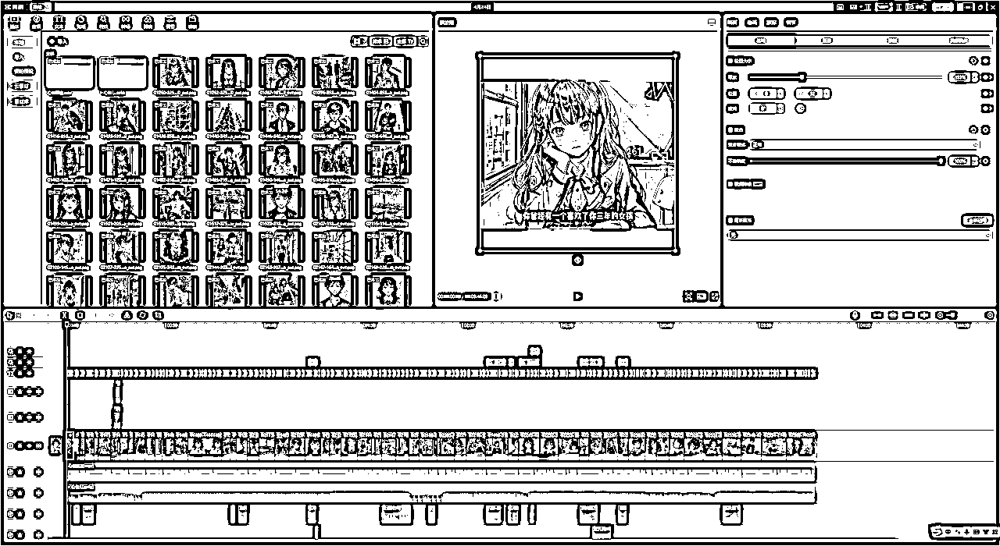

这是我的一条成品，点开主轨的图片

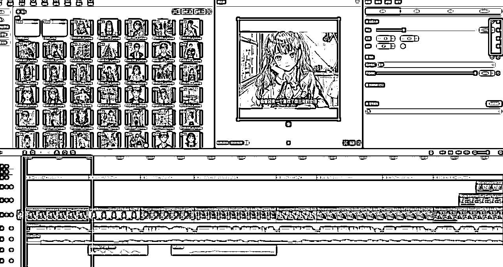

4：3的比例让图片充满全框

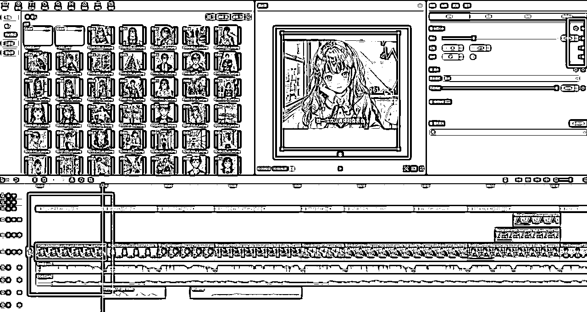

图片配上文字的末尾，往下拉一点再打上关键帧就能发现图片动起来了，不像ppt这么干吧

之后依次按照自己喜好打上各种音效，完全形成自己的大作

AI推文没有什么秘籍，很多人一位ai绘画上手难度很高，但其实拆解完公式后非常简单，一个翻译软件+一个性能还行的电脑即可。

附上这个文案的成品，大家可以看下

PS：附上个五百块买来的秘诀，如何控制人物统一性呢？

是不是你在画的时候感觉十张图组合在一起都是不一样的主角？

其实很简单

只需要预设好人物的细节特征，比如我心动重启的女主统一关键词都是暗红色眼睛+黑色头发

一般面部细节统一大家看着才会有连续性。

* * *

### 五、总结

AI推文有好有坏

优势：文案+内容100%纯原创，可挂中视频，自己在创作的时候非常有成就感，低成实现自己的导演梦，观看的时候代入感也是满分。

劣势：视频制作时间过长，一段四分钟的视频文案+画面我需要接近8个小时才能搞定，无法矩阵化操作，收入有限，可能花了一两天做的视频不给播放心态会爆炸。

我做推文做了三个月，也被割了韭菜，也出了作品，0-1跑通后我决定放弃推文这个路线，全职养活自己感觉不大行，但是兼职副业特别香，几乎没有成本，有手就行。

如果大家不和我一样有些对于作品的精神洁癖，不建议大家花这么久的时间做一条作品，可以参考上期航海高手分享里面王微笑大佬的方式，一个人一天可以产出好几十条作品，虽然是解压素材，但是赚的盆满钵满，月入十万有手就行。

如果大家有更好的提升效率的方式也可以讨论。

接下来想尝试以绿植为品类目标，小红书或者视频号的电商项目，也希望能加到大佬一起玩。