# 小红书职称赛道日引流100+，分享我的实战经验

> 来源：[https://qjv17b58t3.feishu.cn/docx/PXNKdZTf4oc9byxoyCwcFUlNn8b](https://qjv17b58t3.feishu.cn/docx/PXNKdZTf4oc9byxoyCwcFUlNn8b)

## 写在前面（2024.5.17）：

1、这是我23年4月写的内容了，但最近很多浏览和咨询，我写点补充放「写在前面」，但正文不改

2、这个赛道在我做之前，点赞过百的笔记非常少，几乎没什么对标，但高客单好成交，确实是一个很蓝海很好赚钱的赛道（但现在我不做判断）

3、这篇文章发出来后，陆续收到一些老板的报喜，比如成都的：“一个人，一个月也能搞四五万”

4、职称赛道有意思的地方是，除了个别资源丰富的，大部分公司只能做当地的职称申报服务，比如广东省的职称公司，一般只能做省内人群的生意，所以成都圈友跟我学习了，跟我也不是竞争关系

5、这个赛道按道理很适合做投流（聚光投放），我也懂这个，有需要的可以找我聊天...

我在运营账号的过程中，遇到一个问题：笔记数据不佳如何优化？

当我列出了它的原因后，突然想到，如果我解决了这些原因，那最终的结果不就是得到一篇爆款吗？所以，如果我直接用新号搬运老号的爆款，按道理可以规避掉所有数据不好的原因，于是我这么做了。

结果有的账号直接起飞，但有的账号还是起不来，接着我研究起不来的原因，这就是第一章「快速起号」。因为「搬运老号爆款」的方法有效，所以目前不仅应用于起号，同时也应用于兼职团队，横向复制。

第二章「高效做号」是本文的高潮，感兴趣的可以直接跳到这部分。第三章「安全引流」，解决的是“近期小红书严打引流”的问题。好了，左侧是目录，让我们开始今天的分享吧！

# 一、快速起号

## 章节纲要

我们通常说一个账号起号快，是指它在运营初期，得到了不错的互动数据，有了一定的账号权重。

我们先来看数据不好的原因：

*   通常是「选题、标题或封面不佳」导致的，尤其是选题的角度

*   陷入「笔记违规」，尤其是触及敏感词的麻烦，得不到正常的推荐量

*   「急于求成」，刚注册就发引流笔记，被判营销账号，得不到正常的推荐量

按照逻辑，如果我们能规避掉数据不好的原因，那我们就能完成「快速起号」的目标。

## 1、快速起号的秘诀

👉先说结论，秘诀就是「复制爆款」。

因为一篇笔记如果成为了爆款，那么它基本是规避了「选题、标题或封面不佳」和「笔记违规」的问题。

👉此时你可能会有两个疑问：

*   复制爆款不怕被举报吗？

我们采取「矩阵运营」，换言之，复制爆款，即新号搬运老号爆款，不存在被举报。

*   已经发过的笔记再发一遍不是重复了吗，怎么还会有流量？

真相是「小红书不怎么查重」，重发的笔记依然有流量，并且很大概率再次成为爆款。

## 2、先养号再起号

对比数据不好的原因，按照逻辑，「复制爆款」能成功还需一个前提条件：账号能够得到正常的推荐量。

因为我们做账号，主要目的就是引流，所以我们特别容易在账号运营前期踩雷，一不小心就被判定为营销账号，得不到正常的推荐量。所以，我们在起号前，还需要有一个「养号」的动作，规避掉被判营销账号的可能。

这两点是实践与推敲出来的小技巧：

*   我们试过升级成企业号，事实证明确实更抗风险

*   取昵称不要有营销词汇、个人简介不要留联系方式，等等

### 2.1养号的正确打开方式

👉先容我做个概括：

一方面要规避掉被判营销账号的可能，另一方面要争取被打上正常账号的标签。通常来说，我们至少要花两三天的时间，像正常账号那样去互动，即正常关注、点赞、收藏、评论等。

我们在正常互动的过程中，最好先去搜索所做领域的关键词，并与热门笔记进行互动，因为平台是个性化推荐，会根据我们的阅读偏好打上标签，进行首页内容的推荐。

所以，如果我们多与领域热门笔记互动，那么当我们打开小红书时，首页推荐就不仅仅是当天的平台热门，也会给你推荐关注领域的近期热门，而这些内容有很多的好处，比如有的可以直接拿来当素材（下图举例）、有的可以直接拿来当选题，有的可以借鉴引流方式，等等。

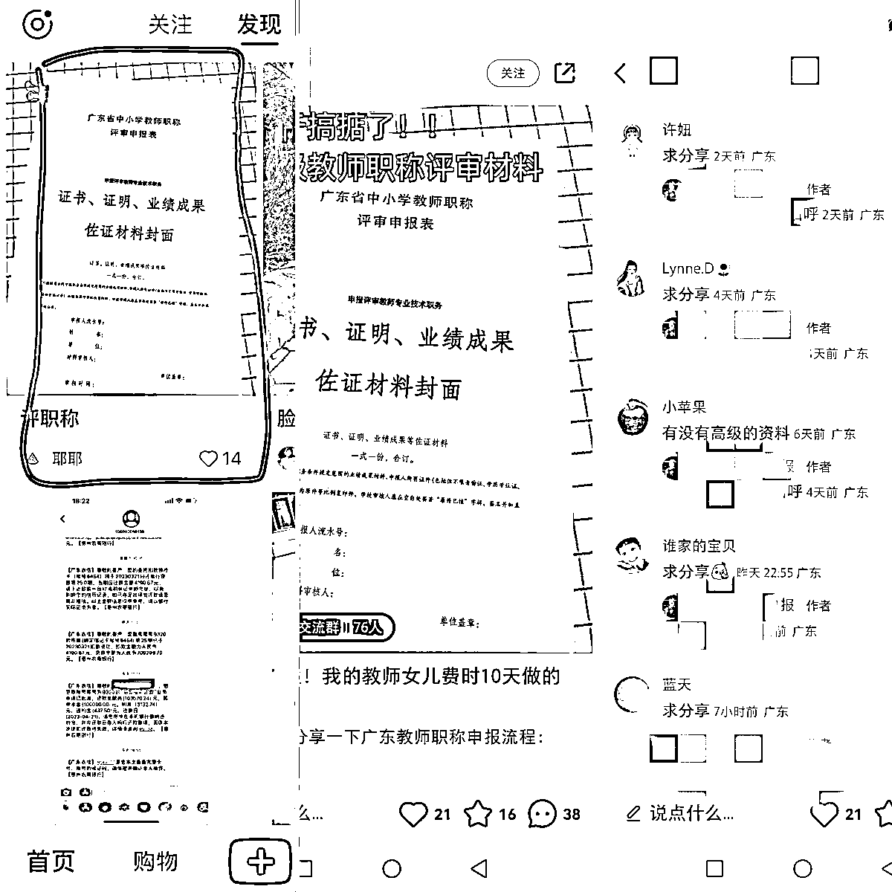

👇以下是多次实践后复盘出来的最佳养号打开方式：

1.  「点赞」领域内容，方便系统识别标签，首页推荐内容给我们

1.  「收藏」爆的引流好的选题文案，方便整理出来用Excel做内容库

1.  「关注」关键词热门笔记下的作者，方便整理出来作为对标账号，并参考规划自己的账号定位

1.  「拆解」并「学习模仿」同行业务路径

具体做法是走一遍他们的业务流程，比如评论区有人问“求分享”，看同行回复话术；如果同行回复的是“打个招呼”，那我们就去打个招呼，看同行私信话术；如果同行私信回的是“看我头像看简介”，那我们就点进主页看一下，看同行引流路径，等等。

### 2.2 补充与总结

📌注：

*   如果账号已注册一段时间并有使用，可以跳过养号阶段，快速起号

*   如果账号前期笔记普遍低于100个阅读量，通常是养号没做好，可以断更几天，再快速起号，依然可行

*   前期「复制爆款」，同样要避免营销性质的爆款，有选择性的复制

通常来说，至少前两天前五篇都不要复制营销性质的爆款，营销笔记与干货很好区别，此处不赘述

# 二、高效做号

## 章节纲要

「搬运老号的爆款」就是快速起号的秘诀，那么问题来了：

*   每一个老号都曾是新号，它们没有老号可以搬运，怎么快速起号呢？

答案也是一样的：“搬运”“老号”的爆款

这里的“搬运”指的是内容翻新，“老号”指的是领域内的老号，具体实操方法请看这一章「高效做号」

我总结了咱们领域常见的两种笔记类型，简单地概括成「文字篇」与「图片篇」，以下拆解的爆款笔记方法论，均是验证过至少20条以上的爆款、且整体的操作思路与流程保持基本一致。

这一章节主要是小红书笔记创作的高效流程，结合咱们小众领域的特点，我探索出了两种高效的玩法：

✅基础玩法：爆款笔记

✅进阶玩法：小红书SEO

注：同样是先避开营销性质的笔记，直到起号基本完成后，再按照一定的比例进行笔记类型规划。

## 1.基础玩法：爆款笔记

### 1.1文字篇

1）寻找领域爆款笔记

以「教师职称」关键词为例，用工具（小红书笔记批量下载软件）提取了这个关键词在小红书的爆款笔记，并按点赞数排序。

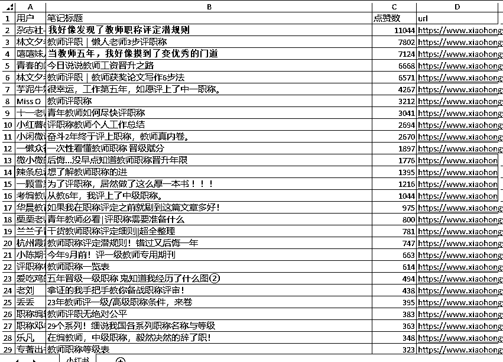

2）复制文案

以第一篇爆款「我好像发现了教师职称评定潜规则」为例，直接提取了它的文案，然后复制

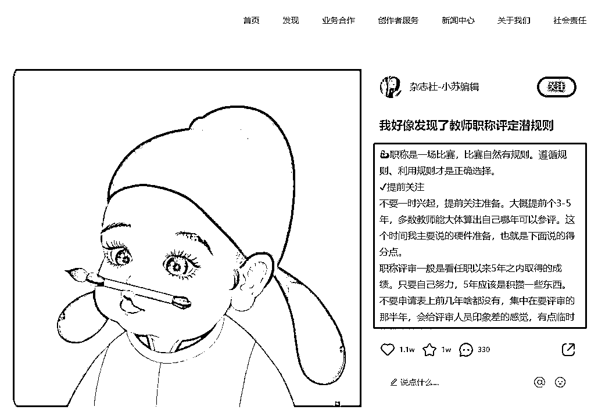

3）chatGPT+小红书

参考文案：接下来我将向你提供一段文案，请先阅读并分析，完成后只需要回复“已准备好”，并等待我的下一步指令。以下是文案内容：xxx（复制粘贴文案）

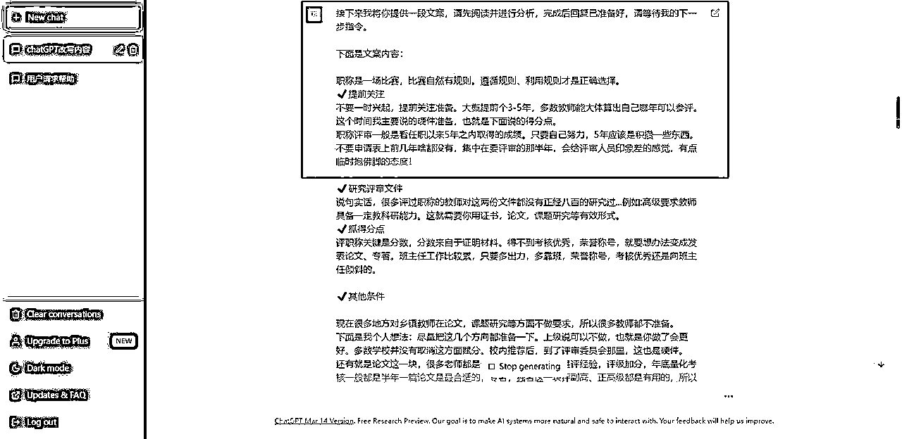

4）用chatGPT改写文案

参考文案：请将这段文案，用小红书的风格，在不改变原意的前提下进行改写，要求有emoji表情，语言最好生动有趣（设置语言风格有助于提高伪原创质量）

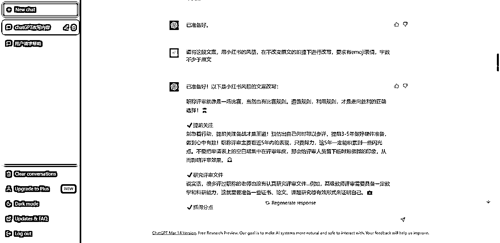

5）套用领域数据比较高的标题

我也试过用chatGPT取标题，但效果并不满意，最后还是选择相信数据（最靠谱），提取了两个合适的标题

*   第一个是「我好像发现了教师职称评定潜规则」，因为原文是文案标题，所以我直接用于封面标题了，第二个是「当教师五年，我好像摸到了变优秀的门道」，稍微替换关键词用于文案标题。

*   也可以套用「小红书爆款标题公式」，以及「有流量密码效果的标题关键词」，测试多遍，同样效果很好。

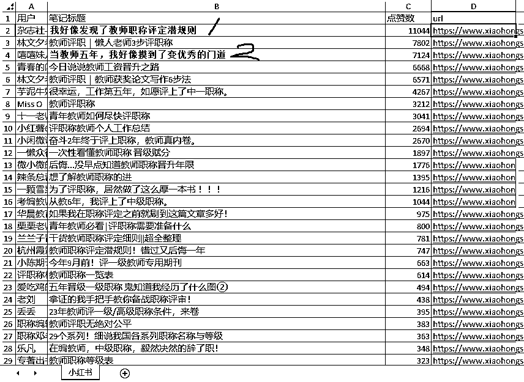

6）最终效果展示

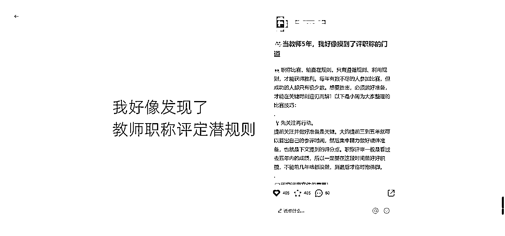

### 1.2图片篇

1）寻找领域爆款笔记

同上，以这篇「后悔没早点知道教师职称晋升年限」为例，用微信截图直接识别文字，提取文案

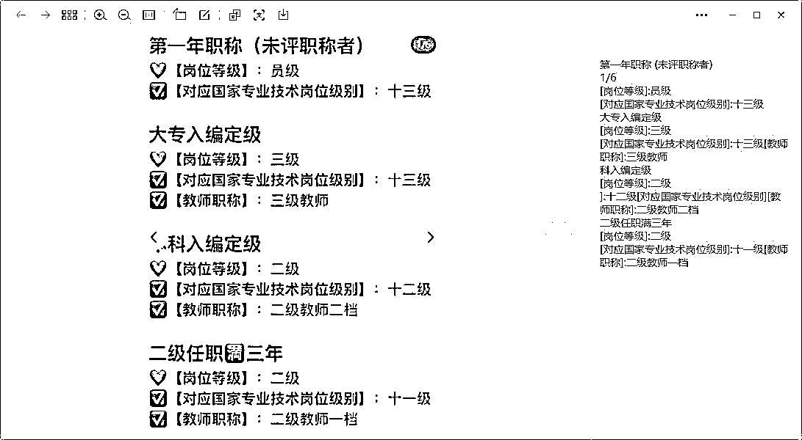

2）用Excel表格做爆款封面

用腾讯文档表格（其他同类软件也行）制作成合集类笔记的封面（最容易出爆款的封面之一），大多数图片类笔记都可以切换成这种风格去展示

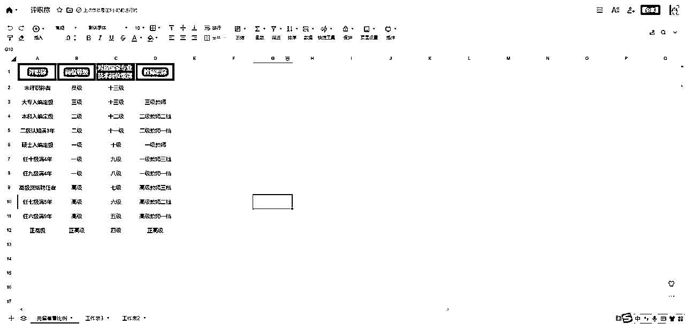

3）chatGPT+小红书

如果这篇文章有详细的正文内容，那么步骤同上，如果没有详细的正文内容，那么参考文案：我准备写一篇文章，主题为「xxx（复制文章标题）」，内容已经整理成Excel表格进行展示，请帮我写一段符合主题的正文。

4）用chatGPT改写文案

同上。

5）套用领域数据比较高的标题

同上。

6）最终效果展示

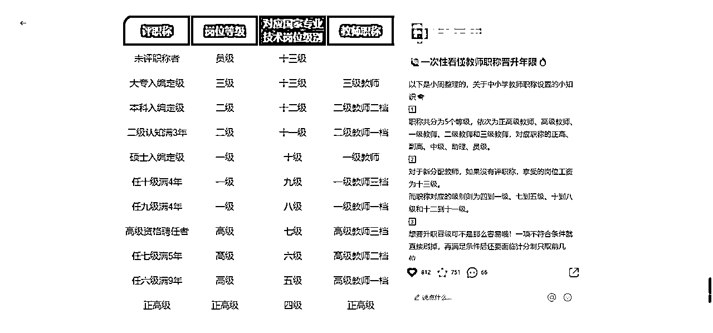

图片篇的爆款笔记，其实不需要有详细的正文内容也可以，简单总结一下内容就行。

为了照顾下总结能力差，又有强迫症非得写点什么东西在正文的同学（对，说的就是我），我通常还会用chatGPT的阐明/精简/举例的指令打造出一些纯原创的文案，用于正文。

## 2.进阶玩法：小红书SEO

### 2.1为什么要做小红书SEO

我们做的是小众领域，且主要目的就是引流，所以为了覆盖到更多的目标人群，启动了「小红书SEO」的玩法，即做好内容的搜索排名，当目标人群用小红书搜索关键词时，我们的笔记排名靠前。

目标人群会去搜索，但没什么同行发过相关笔记的关键词，我称之为「有潜力的蓝海词」。

*   当这样的蓝海词被搜索时，即使某个同行发过的笔记数据不是很好，但因为相关笔记实在是太少了，而它的笔记因为精准度高，还是会排在前面，吃掉大部分的精准流量。

举个例子：

有同行做了“二级职称”的蓝海词，但我因为没有SEO的意识，不知道要做蓝海词，做的全是领域爆款词“教师职称”“工程师职称”这些，即使数据好，但是当目标人群因为需求而具体搜“二级职称”时，同行精准度更高的笔记，即使数据一般也还是会排在我的前面，同时也更加吸引目标人群的点击。

### 2.2怎么做小红书SEO

1）捋一遍领域关键词

前段时间，我们把领域的关键词都捋了一遍：

*   工程师职称的，诸如助理工程师、初级工程师、高级工程师等

*   教师职称的，诸如一级教师、二级教师、三级教师、继续教育等

*   职称大方向的，诸如职称、职称申报、教师职称、工程师职称等

2）寻找关键词爆款笔记

然后，用工具（小红书笔记批量下载软件），提取了这些关键词在小红书的爆款笔记。

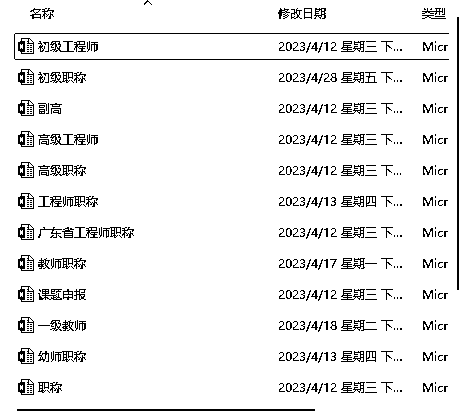

3）应用爆款笔记玩法

最后，用「爆款笔记」的玩法，高效创作出一篇又一篇，大概率比同行权重高的关键词笔记，为了占据更好的SEO效果，覆盖更多的精准搜索流量。

4）效果举例

*   有一个做工程师职称的账号，私信被咨询的跨度广了，比如有一篇笔记，虽然没有一个点赞和收藏，但被用户私信「分享笔记」了很多次，虽然不确定流量一定来源于搜索，但证明了小红书SEO的思路是有效的。

*   有个同行叫“老刘”，经常发广东各地的职称申报通知文件，我们刚开始也学他这么发，但因为数据不好就放弃了；有了小红书SEO思路后，不管数据好不好，都学他这么布局各个城市，现在每天都有一定的私信数量，是求分享通知文件的。

# 三、安全引流

## 章节纲要

⚠️小红书3月份以来，严打引流行为❗

据说是为了发展小红书电商，引导商家在平台内完成商业闭环

在小红书做引流的朋友，应该99%都收到了平台的「交易导流」提醒。

为了解决这个问题，我测试了很多方法，最后留下了两个方案，它们之间互为补充，搭配使用的引流效果还算满意，且暂时没再收到平台的导流提醒。

引流这一步其实很重要，如果承接不住流量，那前面的努力全白费了，以下介绍两种引流方法：

✅表情包+分享笔记

✅小红书群聊

## 3.1 表情包+分享笔记

「分享笔记」应该是小红书今年新增的私信功能，3月份的时候还在内测，目前已经放开内测了。「表情包」好像是一直都有的功能吧，跟微信一样，可以把你的图片添加到表情。

具体操作流程：

*   把你的话术，先做成图片，再添加到表情包

1）建议使用隐晦词汇，2）试过发图片也提醒违规，所以才做成表情，目前还没收到违规提醒

3）如果用户问得比较直接，可以不用发表情包，直接分享笔记

*   用小号做引流图，其他账号收藏笔记，私信时分享笔记

1）分享笔记时，可以分享的笔记类型：点赞、收藏、我的笔记、历史浏览，所以建议统一用小号做引流笔记

2）细节是魔鬼！因为不能直接复制，所以引流笔记的微信号，如果复杂难记一定要改，不然影响通过率！

注意事项：

1.  发文字都有一定概率违规，通常情况下只需简单回复“好的”“可以”之类的就行。如果你有一套话术，系统没检测到违规，建议不要随意更换。（测试下来：有文字补充的，确实感觉添加率会更高）

1.  当天回复的前几条私信，切记长按信息是否有“引用”“回复”等字样，有则确保信息发送成功，如果没有就停止私信，通常等几个小时就恢复私信正常。（暂时不明原理，实践出来的结果）

## 3.2 小红书群聊

这一招我是在小红书学到的，我刷到一篇笔记，评论区全是“求分享”的意向用户，其中有个小号在引导关注，于是我就关注了，结果被直接拉入了群聊，最后得出「互关可以直接拉群」这个结论。

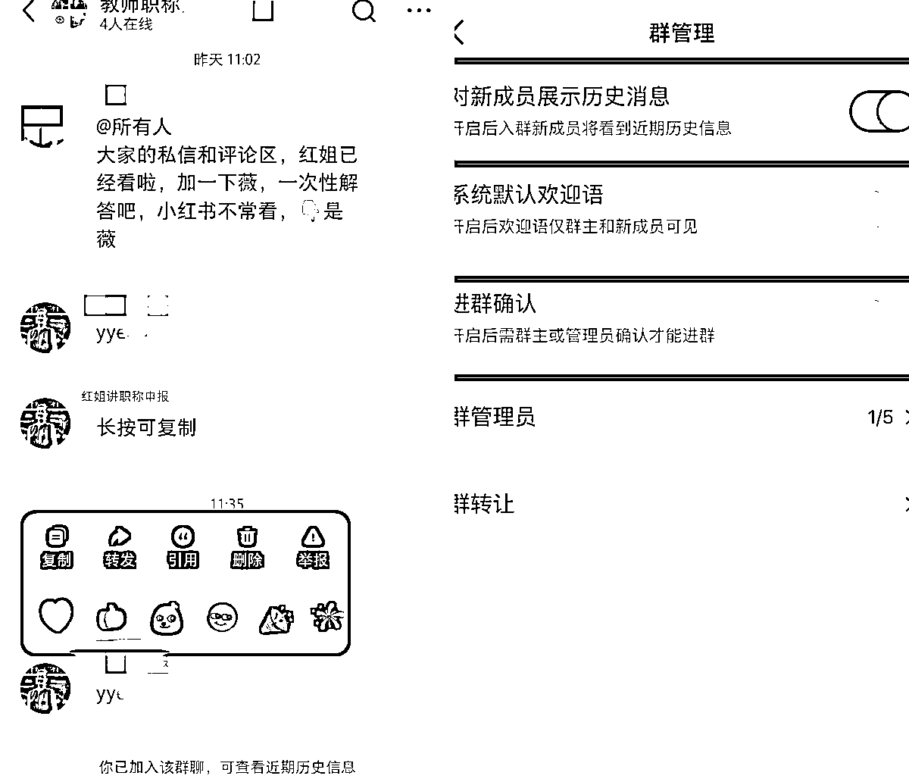

具体操作流程：

1.  评论区置顶评论，引导私信，参考话术：“有需要的姐妹打个招呼”

1.  做好评论区回复引导，参考话术：“丝”、“打个招呼就发”、“关🐷我”

1.  互关拉群，艾特所有人，参考话术：“大家的私信和评论，已经看了，加一下薇，统一处理，👇是薇”

注意事项：

*   细节是魔鬼！群聊设置，笔记挂群聊➡️取消进群确认➡️打开新成员展示历史消息👉新人进群自动被引导

*   互关直接拉人进群，目测最多可拉40人！但是，敲重点了！一个号可以建5个群，所以一个号一天能处理200人，完全够用！再循环利用，5个群拉满了，把1群的人踢出去，重新再拉40人！

*   即使账号禁言状态，也可以互关拉人，也可以在群聊讲话