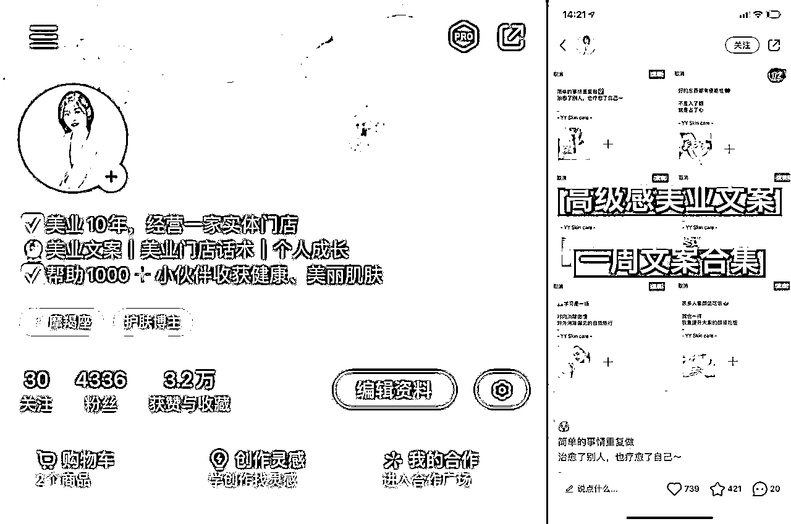
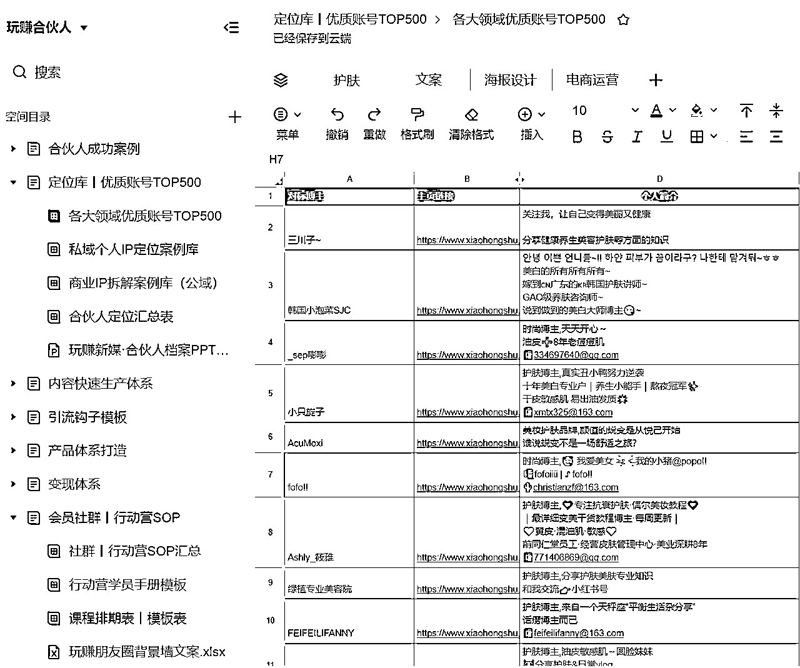
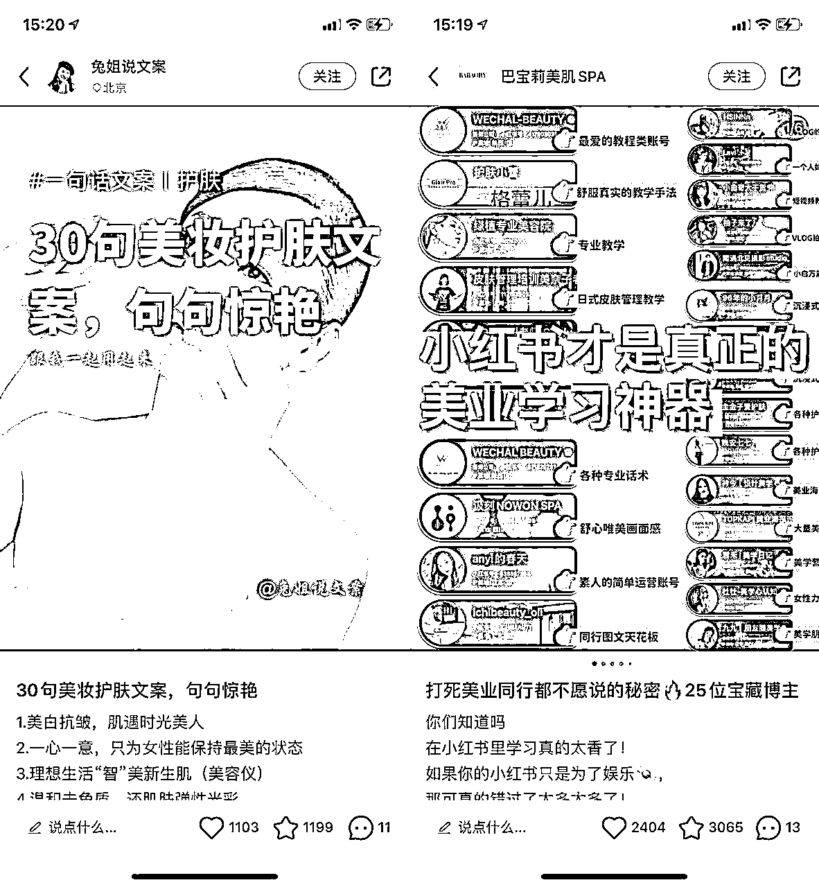
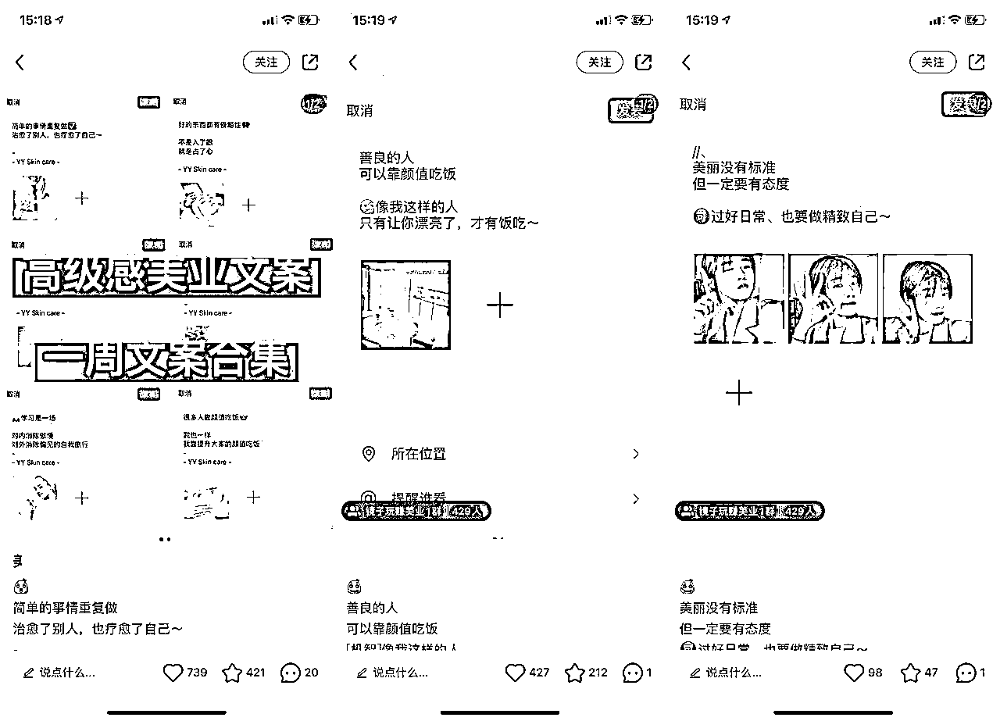
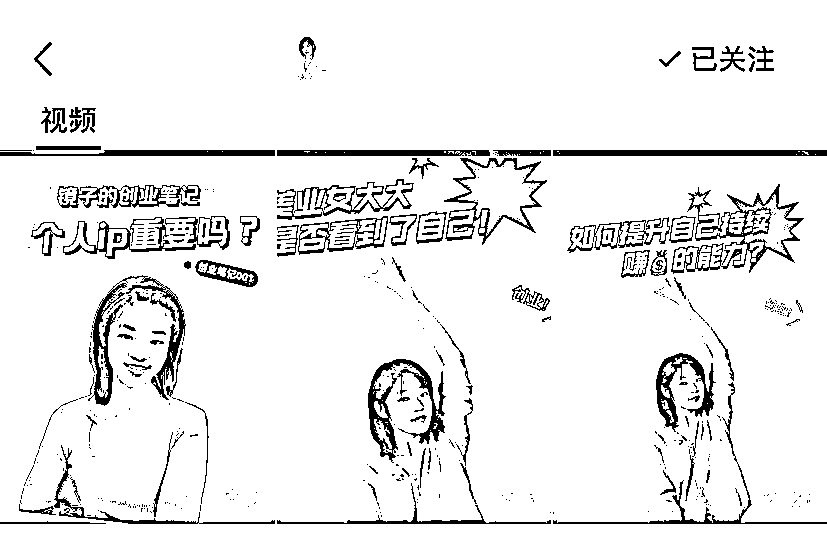
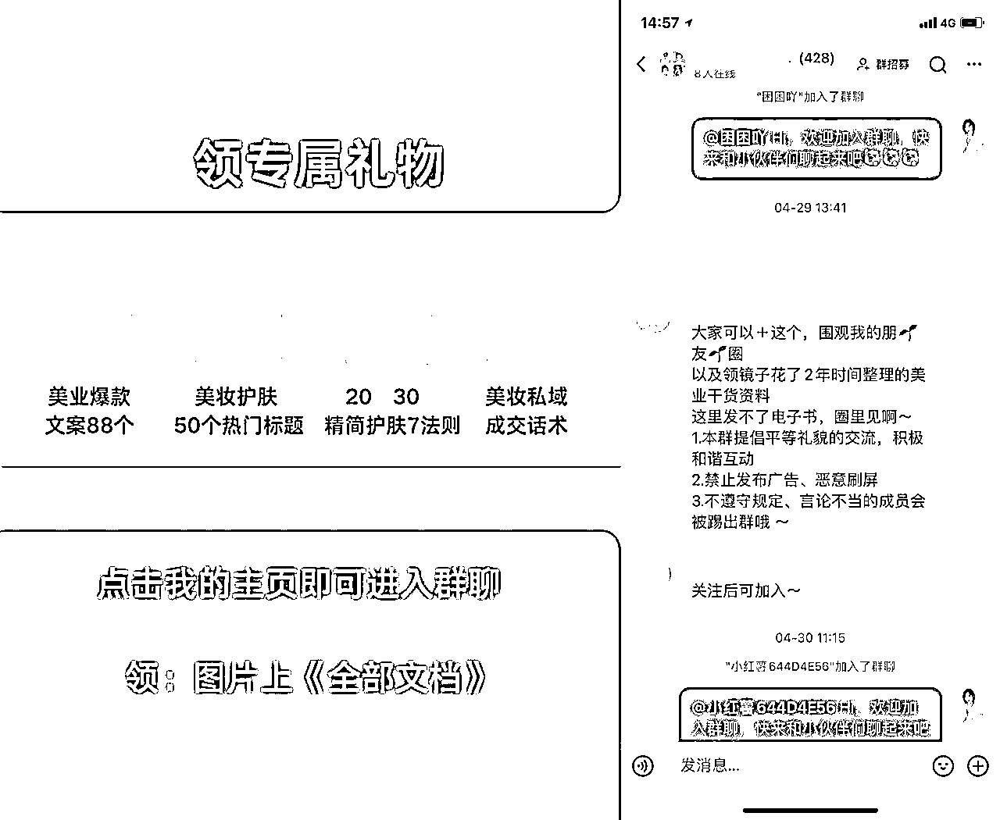
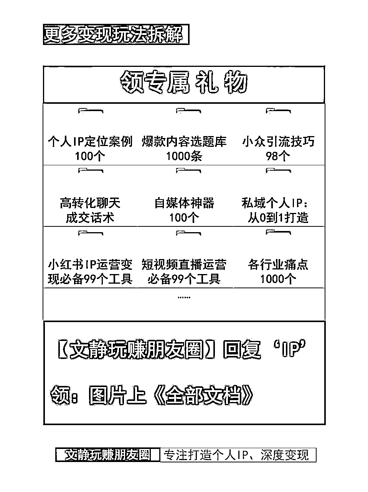
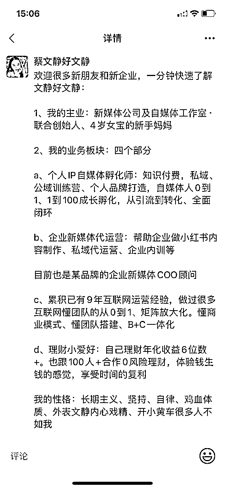

# 美业人，如何复用朋友圈内容发小红书，从0涨粉近5千，月增收5位数+丨小红书IP全案100个

> 来源：[https://n28vbku1px.feishu.cn/docx/WzBCdY4A8omv2cxsneMcn1lJnEb](https://n28vbku1px.feishu.cn/docx/WzBCdY4A8omv2cxsneMcn1lJnEb)

hi，这里是文静的小红书IP全案100个，这篇复盘分享来自创业开线下美业店已经10年的镜子，去年才开始学习朋友圈和小红书，结果把朋友圈的文案内容，用小红书的技巧，复用到公域上

帮助她走通了：小红书有粉丝，私域有新流量，线下美业店，三域相结合的大结果

为什么我想先分享这个案例呢？是因为我知道很多实体店创业老板，每天都好忙。在有限的内容，有限的时间里，怎么把一条内容，超简单地复用得N多次，是我觉得最值得借鉴抄钞的！

接下来，一起来看看她的小红书IP全案

# 一、高价值定位

在玩赚的个人IP五步法有讲：定位一定要找到适合你的值钱的细分赛道。那对于镜子来说，她每天都在做的事业就是美业店，把她线下店的内容经验，复用搬到线上，就很适用和相互赋能了

因此，镜子的小红书定位是：为美业人及美业同行创业者，提供美业文案、美业IP自媒体等技能培训和支持服务，帮助提高他们的新媒体技能水平，从而更好地开展线上业务并实现线上商业成功

在确定定位之后，也给镜子确定了她要吸引的客户群体、解决方案。以及镜子自己本人需要提升的IP核心竞争力

# 二、小红书账号4件套

很多时候，这4件套是你定位下的第一步，相信有小伙伴曾经有爆款，但转粉率差。极有可能就是这里没做好

用户点进来主页后，是带着期待和之前你一样好的笔记，期待的是确定性。所以你的四件套，都必须要给出下一步的确定性，告诉用户你能提供什么样的价值。这样，用户才会持续关注你，持续点进你的笔记，持续期待你的下一篇

用后羿采集器，给镜子提供了500个优质对标账号列表供参考，也分享了昵称、头像、简介、背景图等规则

个人昵称：昵称+行业动作

头像：真人出镜、体现美肤专业

简介：我是谁？我为谁喊话？我提供什么价值？我有什么资格？

我是谁？我有什么资格？（美业10年，经营一家实体门店）

我提供什么价值？（美业文案丨美业门店话术）

我为谁喊话？（帮助1000+小伙伴收获健康、美丽肌肤）

背景图：很多人会浪费这个宝贵的空间。你可以把自己想成为的那个样子放上去。当然，如果你有产品，可以直接放上去！

# 三、内容营销策略（单号）

首先必须认识到选题决定了你的流量上限，如果你一开始找的对标选题，就是只有几十个赞，那大概率，你模仿写出的笔记，也肯定无法爆到哪里去，因为你的前辈对标已经告诉了你，最好的数据量，就是这了。所以先找到点赞1000+的对标选题（常规类目），这个超级重要！

那如果在起号阶段，即一万粉之前（常规类目），镜子的第一版小红书的内容体系搭建，至少要包含这3个内容，而且比例是271

## a、工具合集丨蹭热门话题：20%。

作用：起号养号更快，数据更好

比如，举例：→美业同行学习25位博主、美妆护肤文案30句

## b、干货知识丨方法论丨案例：70%

比如举例：

1.  朋友圈文案：分享优秀的朋友圈文案范例，教美业人同行如何运用文案技巧，打造出有温度、有个性、有价值的美业朋友圈内容，提高阅读率和转化率

1.  朋友圈配图设计：分享朋友圈配图设计的技巧和方法，教大家如何通过图片和文字的组合，制作出视觉冲击力强、有吸引力的朋友圈内容，提高用户粘性和转化率

1.  美业朋友圈美学：分享美业朋友圈中的美学理念和设计原则，教大家如何制作优质的朋友圈海报、图文、视频等内容，提升美业朋友圈的审美和品质。

1.  分享自己的美业从业经验和专业知识，提供有价值的美业开店技巧、门店管理、团队管理、新媒体IP知识等，从而增加美业同行粉丝的黏性和忠诚度。

1.  私域私聊：分享私域流量运营的经验和技巧，教大家如何在私域社群中与用户建立良好的关系，提高私域转化率和粘性。

1.  私域社群：分享私域社群经营的心得和技巧，教大家如何打造独具特色、吸引用户的私域社群，提高用户忠诚度和口碑。

1.  美业创业日记笔记：分享美业创业的心路历程和经验，教大家如何在美业创业的过程中遇到问题时，保持积极心态、寻找突破口，提高创业成功率。

## c、个人IP：10%。

作用：为了更高收入更高客单的转化，外显的就是出现真实的人样、真实的线下场景（比如公司工作室、餐厅公园等）。内显，就是内容要写出你对该行业领域的深度思考，深度认知，避坑指南等等

举例：

## 快速5分钟做内容的技巧

内容具体怎么写呢？记住文静的三字口诀。一搜二调三发

1.去小红书搜索最近的美业朋友圈文案，下面会出现几个板块，抗衰、补水、祛斑、高级之类的

2.点赞收藏最多的，打开里面总有你想要使用的，再结合当下的季节、环境、节日调整下

3.搜索美业模特素材，当做文案的图片或者你拍照比较好看，直接拍店里的角角落落也可以

## 内容关键词长尾词

小红书的笔记标题、封面图、正文内容，是由一个个美业店护肤店的关键词长尾词，组成的。你可以搜小红书的下拉框，免费找到关键词长尾词，也可以买千瓜、灰豚等网站平台来

这里镜子直接整理了她常用的关键词长尾词：

美业、肌肤、美丽、漂亮、实体、便宜、上当、爱情、紫外线、精彩、生活、打工人、大嫂、防晒、放松愉悦、空间

#护肤[话题]# #美业朋友圈打造素材[话题]# #美业[话题]# #美业文案[话题]# #朋友圈文案[话题]# #朋友圈美学[话题]# #实体店[话题]# #同城热门[话题]#

# 引流钩子

账号的目标一开始也是奔着引流去的，所以大部分的笔记内容尾页，都是直接发了引流钩子

引流钩子用了成本最低的X本电子书，这样成本可控且相对安全

用粉丝感兴趣的文档，引导粉丝到群聊，然后微信小号在群里发微信号，想要的就直接加

# 下阶段迭代玩法

在跑通了小红书单号的涨粉和引流后，镜子已经进入到布局新的小红书矩阵号里。分C端和B端。整体IP线打通美业人的上下游：日常护肤技巧~美业运营技巧~个人品牌打造

小红书矩阵号1：美业人同行的朋友圈文案、小红书IP知识分享，变现产品：私域/小红书咨询陪跑

小红书矩阵号2：美业人同行开店，线下管理及线上运营，变现产品：美业店加盟

小红书矩阵号3：美业人的护肤知识课堂，变现产品：私人定制护肤品

…

这是小红书赋能美业实体店小老板的又一个故事，很开心镜子跑通了第一个线上的闭环，生财有术。继续用小红书和私域跑通更多线上线下的闭环，继续新的征程，新的生财有术！

如果大家对各行各业的小红书IP，更感兴趣，欢迎跟文静说~文静先优先吭哧地复盘写出来~

# 新朋友专属礼物

文静：专注深耕小红书IP、企业新媒体小红书矩阵。自己也是从副业自媒体→自由职业→工作室→公司团队

也给新朋友们，准备了一份专属的礼物，欢迎来链接，文静的朋友圈更有趣~

# 03:从0粉丝到频频小红书爆款，收入大五位数的家居博主，超详细5张搞钱王牌丨小红书IP全案100个

# 02：旅拍独立摄影师x小红书IP全案

# 01：美业人X小红书IP全案