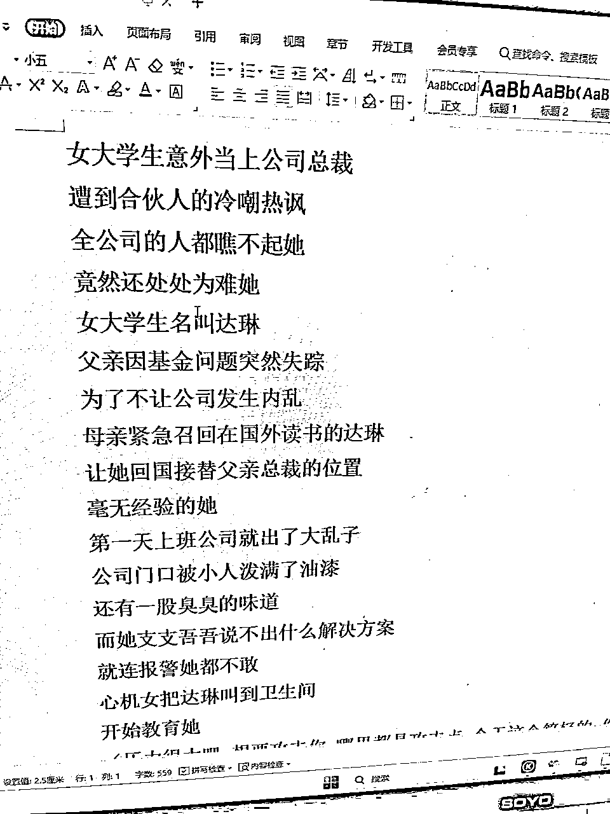
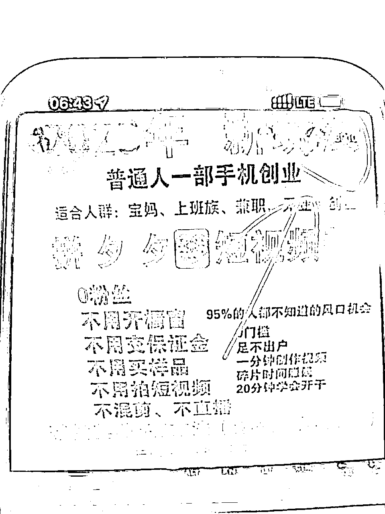

# 放弃高考，选择创业冒险，如今20岁月入6位数：我13岁到20岁的七年创业之旅

> 来源：[https://nt29oth9w1.feishu.cn/docx/YPhndkBKfocBV2xCfvucevIAn5y](https://nt29oth9w1.feishu.cn/docx/YPhndkBKfocBV2xCfvucevIAn5y)

大家好，我是梦宸，04年的大一学生，来自河北廊坊，土生土长的小县城长大，出生平凡，但一直不甘平凡。

从2016年我只有13岁拿着1块钱启动资金开始网赚，到如今20岁大一学生月入六位数。

在这七年的创业时光，同龄人在放假打游戏追剧，而我在默默的搞钱。夜晚我可以一整宿在研究项目的新思路，经历过项目的失败，父母的反对，但是没办法呀，因为我的骨子里有一颗永不服输的心。

今天的这篇文章是想激励所有人，我们要努力赚钱，因为有钱可以治愈自卑，是我们心里最大的底气。

今年2023年我还是一名大一学生，我想要完成一个人去杭州的梦想，想要吹吹西湖边的晚风，晒晒灵隐寺的太阳，那当然我也如愿去到了杭州，也体验到了电商与自媒体之都的创业氛围

我想让父母提起我时嘴角上扬，成为别人父母口中别人家的孩子，因此我买了西湖龙井和杭州当地有名的各种特产，“我说不要，儿子非要给我买”这应该是所有父母最骄傲的时刻

那大概努力的意义就是这样吧，说走就走的旅行，父母提起我们嘴角满是笑容，爱自己想爱的人，做自己想做的事

所以你如果不知道当下做的事情是否有意义，那么不妨看看我这七年的经历，过去的点滴连成了现在的我，请你听一听我的七年创业故事，或许对你有所帮助

# 零. 目录

# 一.13岁起步的网赚传奇揭秘

我还记得是2016年的那个夏天，正是我六年级毕业的那个暑假，我无意间被拉进了一个qq群，这个qq群就是刷qq业务的，比如刷qq会员，黄钻，绿钻，名片赞，空间访客等等这些东西。

当时毕竟年纪小嘛，都爱慕虚荣，都喜欢这些东西，但是我没有钱啊，兜里只有现金，我也给自己刷不了这些东西，那怎么办呢？于是我萌生了一个念头，那么我就先帮别人刷最便宜的名片赞开始，赚到了钱再给自己刷会员

那么我去哪里刷呢，我的渠道在哪里呢？

于是我百度开始查，查到了一个叫辉煌卡盟的网站，一看里面一万名片赞好便宜，才四毛钱一万赞，但是当时我的qq钱包一分钱都没有，正好班级群里面有个人发了一个红包，哎我抢到了一块钱，这样一块钱作为我的启动资金，开始了我的网赚之路

因为我手里的流动资金有限，就一块钱，所以只能卖最便宜的名片赞，首先第一步为了获得别人的信任，你自己得有名片赞吧，你自己名片赞这么少，别人怎么相信你，我就先拿出了四毛钱给我自己刷了一万的名片赞

然后接着我以超低价一块钱帮别人去刷，那么我也没有人脉资源呀，怎么办呢？我先给我的同学朋友去刷，毕竟才一块钱，于是有五六个朋友来找我刷名片赞

当时就在想，光靠卖给同学朋友也不行啊，这什么时候才能赚到钱呀，突然我就想到了，我也可以创建一个当时被别人拉进去的那样的qq群呀，我执行力比较高，说干就干

我把我qq号里面的所有好友全都拉了进来，然后再让同学朋友帮我拉一些人，群里很快就有了70多人，我的生意明显有了好转，群里每天都有十几个人找我刷名片赞，一看我这里刷的这么便宜，他们也会拉一些其他认识的朋友进来

这样的日子很快就来到了瓶颈期，我又想方设法加入了一些qq兼职群，去打广告，还是以一块钱超低价去吸引人，积攒了资金的同时还收获了一批人脉，但是我的骨子里天生就想要做食物链的最顶端

于是我找到了辉煌卡盟的站长，询问他怎么样才能搭建一个这样的网站，后来了解到可以搭建分站，普通版的150块钱，专业版的250块钱，当时我兜里已经赚了差不多300快钱左右，我毫不犹豫直接搭建了专业版的网站

那么接下来我的目标很简单了，就是让更多人知道我的网站，把我的网站宣传出去，然后从中赚取差价，我先在我自己的qq群宣传一波，并且告诉他们有了这个网站，不仅仅可以自己给自己刷，还可以给别人去刷然后赚差价，就这样经过我的各种宣传

六年级暑假毕业的那两个月我赚到了第一桶金，虽然只有1000多块钱，但是当时真的很开心，因为这是我自己的劳动成果

梦宸小课堂：

1.虽然当时年纪比较小，对于新奇的事物，敢想敢干，并且可以达到执行力拉满，其实赚钱并不难，比的就是你的执行力

2.没有资金，没有人脉不要怕，每个人并不是与生俱来的。

既然没有资金，那就先从0成本投入的小事开始做

既然没有人脉，那就先从身边的朋友入手，再在网络上打价格战（把价格优势打出来，只要不赔钱，哪怕你一分钱不挣都可以），以超低价开始引流

3.当你拿到结果以后，不要沉迷于现状之中，而是想办法去提升

# 二.虽然经历低谷，但从未停下脚步

我的父母总是愿意给我接受最好的教育，放弃了免费在老家读公立初中的机会，把我从河北廊坊送到衡水读私立初中

一提到衡水，想必大家先想到了地狱般的教育模式，对没错就是这里，但是经历了暑假网赚的洗礼，我的心早就飞了，不是我多爱钱，而是喜欢钻研项目的那种感觉

衡水的地狱般教育模式就是没有走读，只有住宿，并且一个月才放一次假，一次只放两天时间，一半的时间还在回家的路上

因为我家离学校200公里，就更不要提可以带手机进学校了，那么就意味着我每个月只有一天的时间来经营一下自己的卡盟网站

一天时间能干什么，什么也干不了，所以我的网站销量急剧下滑，因为我在上学，所以我七年的创业时光，有六年是每个月只有一天时间来经营的

但是没事，我不怕，即使只有一天时间，那我就利用好这一天时间，把这一个月我不知道的东西都了解一边，直到初一的暑假，迎来了我的巅峰时刻

梦宸小课堂：

虽然当时我一个月只放一天假，但是我仍然利用好了这一天时间，把所有的空余时间合理利用起来，一天中所有的空余时间加起来可不容小觑

比如：

吃饭的时间可以看一篇精华文章或者微信公众号

在公交车或地铁上可以刷一刷风向标，增加信息的敏感度

感觉自己效率不高累了的时候，看一看纸质书籍，放松一下大脑

晚上睡不着觉可以听一听商业性的电子音频

# 三.疯狂暑假赚金，14岁少年两个月撬动财富

期待已久的暑假终于来了，我想着利用好这两个月大赚一笔，我看到一个名为低调的，在一个QQ群中卖快手直播号，而且极为火爆，我在清楚了解了行情的情况下，转手就跟他付费学习

我记得是花了888（当时就已经懂得了知识付费，我把我卡盟赚的一千多大部分都拿出来学习了，那时候没有感觉到一点心疼）

因为当年是2017年，快手的直播还在内测阶段，绝大多数账号都没有直播权限，只能通过作品上热门来自动开通这个权限

那么我们做的就是把刚注册的账号开通权限卖给号商，而我们注册是没有成本的，那时候快手管理很松，根本没有设备问题，没有IP问题，更没有一机一卡一号的说法

我记得我当时拿着破旧的苹果5，一台设备同时注册5个快手号，一天时间就可以把普通的快手账号变成拥有直播权限的快手号，转手就卖给号商

当时号商的需求量非常大，根本不愁卖，一个号可以卖40-50块钱，纯利润就是40-50，没有任何成本，我就靠这个两个月暑假轻松赚取了人生中第一个五位数

梦宸小课堂：

1.无论做什么项目之前，先要了解清楚行业的前景，有没有向上发展的趋势，再看看自己适不适合做这项工作。只有知己知彼，才能百战百胜

2.学会去知识付费，因为知识付费真的能为你节省时间成本，前提是要选择一个对的靠谱的人，不要被割韭菜

3.跑通项目闭环，要学会放大，去拿大的结果

我当时很后悔没有去放大，毕竟当时年龄小，也没有能力去放大专注做这项事情

# 四.离家追求网赚，父母不解我心

那时候我妈妈在做刷单，刷一单只有几块钱，我于是把我这个赚钱的方法分享给我妈妈，但是当时换来的并不是鼓励而是各种指责和辱骂，说我现在不是赚钱的年纪，让我好好学习，不要瞎搞（现在回想起来，说的确实也对，毕竟那时候才14岁啊）

第二天我爸爸知道了这件事，就没完没了来回问我这么多钱哪里来的，我当时就说通过互联网赚的，但是他们不相信，然后转手就把我手机摔了

我一气之下就离家出走了，当时我心里还很不服气，自己赚钱怎么了，我就是喜欢这种感觉，我现在手里有钱，去哪不行？

自己围着县城溜达到了凌晨三点钟，最终我还是妥协回家了，和父母坐下来促膝长谈，说我一定要好好学习，知识才能改变命运，上学才是唯一的出路，等等这种老派的道理在我耳边萦绕，虽然我表面承认了我的错误，但是我真的不甘心，我就是不服输

说句实话，当时的网赚确实严重影响到我的学习成绩了，这是导致我只能上一个专科的原因

梦宸小课堂：

如果你正处于初中和高中上学的阶段，一定要把重心放到学习上，你现在的阶段不是赚钱，而是需要考上好大学，学历真的很重要

千万不要丢了西瓜，拣芝麻，这是我作为过来人的经验

最可怕的结果就是，上学上学没上好，钱钱没赚到，鱼和熊掌不可兼得

在未来赚钱的机会还有很多，真的不差这几年，记住一句话：是金子，总会发光

# 五.开拓新视野，拓展新领域

我并没有因为父母的话让我放弃赚钱，我还是在每个月仅有的一天假期和每年的寒暑假继续搞钱，直到快手官方把直播权限应用到了每个账号身上，只要实名就可以开启直播，不需要再单独开通直播权限了

这就意味着我的这份生意彻底的不能做了，同行们都开始转型做粉丝号，我也淡淡的退出了这个圈子

一个偶然的机会，进入到了撸界这个圈子，我现在还清楚的记得，我加的第一个撸界QQ群的群主是二郎，这个群就会发布一些关于公众号撸羊毛的活动

我当时感觉这个东西就很好，我感觉很好不是因为可以撸几块钱的羊毛，而是我也可以创建一个这种QQ群，我把他们的羊毛活动转发到我的群里面，然后让用户对我产生一种信任，到时候再去收徒弟带他们做一些付费的项目

当时对我来说，引流是个大难题，我把我qq号里所有好友都拉了一遍，一共才有100多个好友进群，当下需要解决的就是引流问题

我当时想到了一个利用男人的特性引流的好方法，就是创建一个qq小号，名字改成空间看莉哥视频，然后空间发一个qq群的二维码，配上合适的文案，再把这个小号拉到各种2000人左右的禁言群里面（大多数禁言群都是不用审核直接就能进入的）

进去之后，群里就会显示xxx邀请xxx进入群聊，因为我小号的名字比较特殊，很多人就很好奇点进空间看看，然后引入到我自己的qq群，我就用了这个小方法，三天时间引流了第一个2000人qq群

虽然引流速度非常不错，但是我也知道这个方法太过于敏感，并且对同行非常不友好，我立刻停止了这项操作，而是尽快融入到撸界大佬的这个圈层中

当时在撸界非常流行组团队，我记得一个叫茗门的团队正在招人，而门槛就是要有一个2000人的qq群，正好我符合这个要求，我毫不犹豫就加入进去

进去之后我仿佛看到了另外的一个世界，这个团队里面都是骇人听闻的大佬，我现在有了跟他们接触的机会，于是我利用开热度群的方法，用我自己一个2000人qq群跟其他大佬互换资源

于是就有了第二个第三个第四个2000人qq群，这也就是我快速用一个月的时间，从刚进入撸界的小白快速变成撸界大佬的原因

毕竟互换资源，最终总是有个瓶颈期，我又开始去寻找其他的引流方法，我再刷快手的过程中，我看到某位撸界大佬通过发布qq技巧类型的视频在偷偷引流qq群

我第一时间拿小号假装小白加入到了他的qq群里，然后令我震惊了，竟然用了三个小时就引流了一个2000人qq群，并且引流的人群正好都是精准的学生粉

我一直以来都是行动派，看到机会我就要抓住机会，我直接模仿他我也起了一个账号，虽然刚开始前几天发的视频都没有什么流量，但是突然有一天我也爆了一条视频，才几万的播放量，但是回头一看我的qq群也已经有了1200人，哇塞，这种引流也太爽了吧

当时引流过来我不知道怎么变现，但是没事，我看看那个同行是怎么变现的，我就抄他模仿他不就行了吗，他是通过一些赚钱的app拉新来变现，那么我立刻模仿他，然后继续怼作品，继续引流，继续干

就这样，短短一个月的时间，我引流了20个2000人qq群，但是，我暑假马上结束又要开学了

而这次开学我就要上初三了，要面临中考，后面的学习任务也会越来越重，我的20个2000人qq群也没有人管理了，等一年之后我中考结束之后，我再看我这20个qq群，基本上一点也不活跃了，但是我还是那一月变现了将近3w左右，我自然还是很开心的，毕竟上学这个事情，我没有办法改变，我也没有办法避免

梦宸小课堂：

1.引流本质就是利用人性（上文提到的是利用男人的好色引流，送资料是利用的人们的白嫖心理引流等等）

2.学会向上社交，敢于链接大佬。我当时就是向上社交，快速进入大佬圈层的

3.学会先抄后超，做好“守”“破”“离”三部曲，记住一句话：同行是最好的老师

# 六.疫情中崛起，一周内斩获1亿的流量

2020年正是我高一的寒假，而也就是这个时候爆发了疫情，也是我初中高中近6年来连续赚钱的最长时间（因为其他的时候顶多暑假连续赚钱2个月，其他时候就是开学在学校上课）

我也是利用了这段时间大赚了一笔，迎来了我的人生巅峰

我在刷抖音的过程中刷到了做影视剪辑的直播间，我当时看了真的非常感兴趣，而且看他们账号的流量动不动就几万几十万的点赞

于是我也尝试着去剪辑了几条视频，但是我发现我的视频发上去根本没有播放量，就500左右，我二话没说直接花了899去知识付费学习

知识付费确实能解决很多我当时的问题，学到了正确的方法之后，我开始发视频，第三条视频就爆了100w的播放量，我开始对自己越来越有信心了

但是困难就随之而来了，抖音开始第一次打击影视剪辑的创作者，几乎80%的账号都收到了限流的私信通知，当时在整个圈子里都很懵，根本没有解决办法，只能硬着头皮去申诉，能不能申诉通过全凭运气，当然我是没有申诉通过的

我并没有放弃，我直接注销账号（当时账号就已经一万多粉丝了，我直接注销掉了）我立马开始起新的账号，但是还是遇见同样的问题，收到限流通知，申诉失败，我又接着注销，继续从新起号，就这样来来回回循环了很多次，我的第五个账号终于是申诉通过了

我每天把我的时间全都花费到了看电影电视剧和剪辑的身上了，研究同行的剪辑思路和手法，研究开头怎么吸引人，中间怎么过度高潮，结尾怎么留下悬念吸粉，那时候正是疫情最严重的时候，封城封小区封在了家里，每天的日日夜夜都在剪辑的身上

经历了两个月的摸爬滚打，终于爆了一条5600w播放量，120w点赞的大爆款视频，正在视频最有热度的时候，我开启了直播，直播间瞬间1.4w人，整场直播59w的场关，光收音浪就赚了2000块，但是这场直播我只做了一件事，那就是做知识付费收学员，一场直播下来收了400多位学员

在抖音上面吃到甜头之后，我又开始尝试做快手，我一上来并没有盲目的把抖音上的视频同步发过来，而是先去研究快手上面做影视剪辑的同行，发现了一个很重要的问题，快手上面对影视剪辑非常严格，注重混剪，把抖音的那套玩法搬到快手上面来根本行不通

研究明白之后立即开干，基本上发一条视频爆一条视频，都是大几十万，上百万播放量的视频，开启了创作者激励计划，每天稳定收入几百块钱

后来，对，没错，又开学了，这段时间算是我初中高中六年时间连续赚钱最长的一段时间了，由于高中三年学业更加繁忙，导致我的快手和抖音号长时间断更，自然而然也就废掉了

梦宸小课堂：

1.遇到困难肯定是在所难免的，你能做的就是调整好心态，去努力克服困难而不是放弃

2.在尝试一个新的平台之前，先要了解清楚这个平台的底层逻辑，而不是一上来就盲目的瞎做乱做

# 七.放弃高考，勇闯创业天涯

高三的那个寒假，我做了一个重要的决定，就是要放弃高考，我的放弃高考并不是不上大学了，而是通过另一种途径去上大学就是走高职单招考试

在我们河北省，单招只能上专科，这意味着我上的一定是一个专科院校，我当时的学习成绩并不好，参加高考也不一定能上本科

虽然刚开始父母嘴上说的让我自己选择，尊重我选择的结果，但是他们心里肯定还是不想让我走单招的，走单招的话高三下学期就可以不用去学校了，我就有大把的时间可以搞钱，我在这之前我还没有大把的时间专注进行搞钱，现在就可以实现了

当时我在规划我接下来的方向，当时我还是想要继续做影视剪辑，但是两年多过去了，影视剪辑领域早已不是那个随便发视频就能上热门的时代了，现在更注重的是原创，因为电影电视剧一共就这么多，无论怎么剪辑，多少都会出现跟别人相同的画面

那么我就进攻影视解说的领域，影视解说相比影视剪辑难度系数大了很多，需要自己写文案，并且我在这期间还学习了电脑pr剪辑（之前剪辑都是用手机剪映）

我便开始了看各种电影电视剧，边看边记录情节对应在第几集的多少分钟多少秒，方便剪辑的时候快速找到这个片段，然后整理思路，写文案，对文案的要求还是非常大的，有的时候一篇文案来来回回要改几十遍，再去配音，最后剪辑。

不算看电视剧的时间，一个一分半的影视解说视频全程做下来，最快也要3个小时，而我当时一天需要更新三条视频，一天的时间全都花费在了这个上面

但是我愣是坚持了三个月，才涨了1w粉丝，只有一条400w播放量的视频，也就是这个时候我意识到了，抖音影视领域的风口已经过去了

那么我意识到我要开始转型了，我很早就养成了一个习惯，就是我有一个专门独立的微信号，但凡我在抖音快手小红书看到引流的或者主页放微信号的，我都会拿这个号主动加上去，我的目的就是为了要看他们的朋友圈，看看他们最近在做什么项目

当时我在朋友圈了解到，有做抖音好物分享的，有做闲鱼无货源的等等，我立马就看到了一个在做拼多多短视频带货的，我上去仔细翻了翻朋友圈，第一感觉就是这个团队真的很团结，每天很多人都在晒自己的收益，多的一条几千块，少的一天几块几十块

给我的第一种感觉就是很真实，然后我当时的标签备注了通过哪里加的这个人，看到了是通过抖音的直播间加上的，我立刻去蹲点看看她的直播

她的直播直接吸引到了我，无论是晒的结果也好，还是话术也好，我直接花499就跟她学习了拼多多短视频带货，进入到她的团队之后，跟我在她朋友圈看到的一样，很多人都在晒自己一天的收益，无论多少都在晒，我闻到了金钱的味道

掌握好方法技术之后，直接开干，我一个账号用了三个月的时间就赚到了4.6个w，当时我并没有做矩阵，而是选择了我也要像她一样开启抖音直播招收学员

我无论做什么事都不会盲目的去做，而是先了解清楚抖音直播间的推流机制以，学会做数据拉流量以及写好文案，再去开直播

刚开始直播第一个月，每天稳定同时在线50+，场关最高才1000，每天稳定引流私域15人左右，平均一天可以成交1-2位学员，到了第二个月，我的直播间最高同时在线3900人（没有买推流，纯自然流量），这四个月的时间，我收了400多位学员小伙伴，客单价499

但是随之而来的就是巨大的问题，我大一开学之后怎么办，开学之后怎么直播，在宿舍里直播不现实吧，宿舍里面肯定特别吵，会影响到直播效果还有我的心态

梦宸小课堂：

坚持了很长时间都没有在这个项目上拿到结果，就不要坚持了，这是在告诉你该转型了

# 八.孤独启航，开启大学的租房创业梦

方法总比问题多，既然宿舍不能直播，那么我就走读在学校外面租房直播，看房子是我，签合同是我，收拾屋子打扫卫生是我，组装桌子买设备还是我，全都是我一个人独自完成

这一刻我明白了，一个人单独出来创业真的不容易，没有人会理解你，同学朋友问我，在住在学校宿舍不好吗？一年才800块钱，在外面租房一个月就要1000多。

我仅仅只是微微一笑，是，对于你们来说，在学校住当然好了，如果我不在创业，我也当然想要在学校住了，但是没有办法

上午去学校上课，下午回到出租屋，一直忙碌到晚上12点再睡觉，反反复复，每天皆是如此，拒绝了一切无用社交（有一个玩的好的朋友就够了）对于他们大多数人，只是我大学生涯中的过客，我和他们未来发展的方向人生目标规划不一样，吃喝玩乐的交际我没必要参与

我的危机感是非常强烈的，因为我上的是专科学校，大学时间只有三年，其中两年时间在学校，最后一年需要出去找工作实习，那么我必须要在学校这两年期间干出点名堂来，曾经不顾父母的反对，我坚持了这么长时间，不可能说放弃就放弃

我在大学期间对于我来说，第一就是积攒创业资金，第二就是不断的试错

在大学试错成本还是很低的，毕竟生活的压力没有那么大，不断试错的目的就是找到一条适合自己的正确道路，不至于一毕业就非常的迷茫

我是一个喜欢折腾的人，不喜欢稳定的体制内工作，感觉这种工作对生活没有一点的希望，对于男人来说，买车买房是不可避免的，即使是本科毕业生，在大城市上班，一个月一万多的工资，你想想要攒多久才能买的起房子

买车，买房，娶媳妇，彩礼等等，对于一个男人来说，哪个不是巨大的压力呢

从去年开始到现在我一直都是在做拼多多短视频带货和抖音直播引流创业粉，成交一对一学员。我认为，市面上的项目那么多，哪个都有赚钱的人，哪个也有不赚钱的人。而且拼多多短视频带货对新人非常友好，因为知道的人比较少，现在还处于一个野蛮生长期的阶段

对于我来说，就要该赚钱赚钱，不要在赚钱的年纪谈佛系，这是我的态度

创业的路上本来就是孤独的，一个屋子，一台电脑，一个人；剪辑是我，直播是我，交付学员还是我；没有团队，没有任何人帮我分担，遇到困难也不能流泪，只能坚硬的挺着度过，只有雨后才能看见彩虹

创业就是一场孤独的战争，你站在未来看你现在的孤独都是值得的，All in 进来就是猛干，遇事不决，执行力拉满直接all in，不留后路，背水一战才是我的性格

这是我的七年创业经历，直到这里并没有结束，故事仍在继续，我还年轻才20岁，未来值得我去拼搏