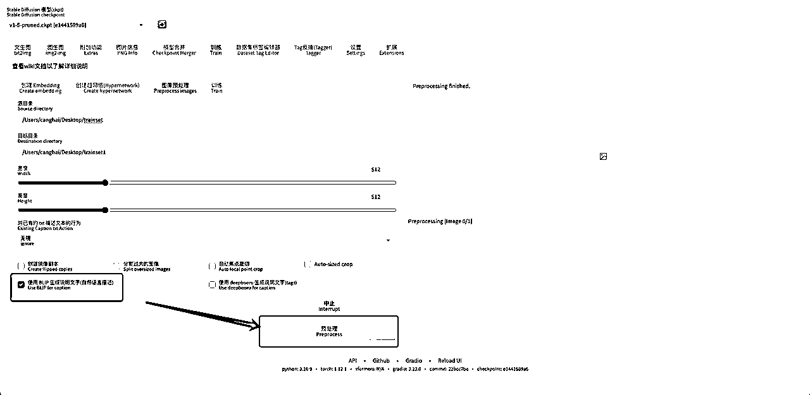

# Stable Diffusion 应用场景和模型训练

> 来源：[https://ov4jtf5rf0.feishu.cn/docx/ZXvbdq7RGoKEeLxryxAckCtSnPf](https://ov4jtf5rf0.feishu.cn/docx/ZXvbdq7RGoKEeLxryxAckCtSnPf)

时间：2023年4月16日 10:00-12:00

地点：广州市天河区海景中心东塔

参与人员：沧海（分享人）、李纳、哆啦娜娜、英卡、逍遥、来来、ruoqi、明月

分享内容：Stable diffusion的应用方向、模型训练的工作流

# 基础概念

## 一、什么是stable diffusion？

Stable Diffusion是2022年发布的深度学习文本到图片生成模型。它主要用于根据文本的描述产生详细图片，尽管它也可以应用于其他任务，如内补绘制、外补绘制，以及在提示词​（英语）指导下产生图生图的翻译。它是一种潜在​扩散模型，由慕尼黑大学的CompVis研究团体开发的各种生成性人工神經网络。它是由初创公StabilityAI，CompVis与Runway合作开发的，并得到EleutherAI和LAION​的支持。

## 二、Stable Diffusion 和 Midjourney区别

## 三、术语表

## 四、Stable Diffusion 应用方向

1.  辅助产品设计

原图:一双小白鞋

生成：通过controlnet的canny模型+prompt生成

1.  AI模特：石膏模特+实拍产品（服装、首饰），结合chilloutmix+controlnet+图生图inpaiting达到AI模特穿产品展示产品的效果

以上图片来自网络，由浪猪灰头发布

1.  AI建筑设计：建筑设计+室内设计，通过controlnet的canny模型+建筑lora模型，达到快速出图的目的

以上AI建筑方面的研究来自bilibili：AI建筑研究室-帆哥 https://space.bilibili.com/2161614

1.  训练风格模型：我本人工作和广告行业客户有接触，目前已经在着手尝试训练生成分镜的模型了

## 五、stable diffusion安装

# 模型训练

这里是我的模型训练的工作流，一共分为5步骤，接下来我会和大家介绍这里的细节

## 一、训练集准备

训练集是一切模型训练的基础，训练集简单来讲就是你希望模型需要学习的范本。训练集的质量直接影响到后面的模型训练，训练集的质量在我看来包含两部分，一个原图的质量，另一个是对图片的精准总结（即打标签tag）。

1.  图片准备：图片准备永远是训练的第一环，好的图片直接影响训练结果，简单说一下好的图片包含哪些点：

a）图片分辨率高：图片分辨率高有2个好处，一个是进行图片裁剪时有足够裁剪空间，二是图片的清晰度更高训练效果更好（训练像素风等特殊风格除外）

（图片来自unsplash）

b）图片样本丰富：

*   图片场景丰富，训练人物lora模型，可以包含各种场景，商场、沙滩、雪地等等；

*   图片角度丰富，训练人物lora模型，你提供一个人的正面、侧面、脸部特写、全身等多角度训练出的模型，在生成时效果更好（例如你的prompt输入里fullbody，希望生成一个全身照片，假如你的训练用的照片一直都只有照片半身照或者脸部特写，那么AI随便脑补生成全身时可能会出现崩坏的图片）；

tips：当图片不够时，可以尝试复制该图片使用镜像翻转提供更多的图片，同理也可以复制同一张图片进行裁剪，不过不建议放太多这种图片，容易训练过拟合

c）筛掉不佳图片：

*   挑出那些明显有瑕疵，例如训练人物模型，那些wink导致表情狰狞的图片，自拍照片手机挡住脸的图片（你也不想训练出模型，输入prompt生成一个小姐姐，结果小姐姐脸上长了一部手机是吧）

*   挑出多人的照片，只保留你要训练的人物的单人照片

*   挑出差异过大的照片，例如化妆后差距非常大的，尽量保证挑的图片整体统一

1.  图片裁剪：

a）图片裁剪不是必须的，最新的训练脚本支持图片自动分桶训练了，但是图片尺寸影响以下

*   当你训练的机器硬件不是很好的时候，统一裁剪到512*512的尺寸，机器训练更快

*   和你使用文生图的的业务场景相关，例如你用512*512的图片训练了模型，但是使用的时候生成大于512的照片（实测用515*512训练的模型生成1024宽度图片时，输入1girl可能会出现生成多个人），这个我猜测是模型没学到大于512的内容，在实际生成过程中模型会脑补空白的地方给重新执行了prompt

b）图片裁剪的方法：使用stable diffusion自带的图像预处理

*   设置要裁剪的图片的所在目录和输出目录：建议分2个文件夹，辛苦收集的原图备份好

*   设置裁剪后尺寸：初步学习设置512*512就行了

*   自动焦点裁切：这个意思是当图片比较大的时候，人物如果不在图片中心，开启这个时候会自动以人物为中心进行裁剪，不会把人物裁掉（训练人物lora模型时可以酌情考虑是否开启）

1.  打标签

a）基础知识：机器其实是不认识图片里有哪些内容的，早期都得依赖人类给图片打上标签，告诉机器这些图片是什么，像sd1.5模型就是用了LAION-5B的模型进行训练，我们可以看到这个训练集里每个图片的命名都是对图片内容的总结描述。

随着机器学的越多，我们已经可以利用已经做好的打标处理器，让机器帮我们打标签，我们只需要进行简单检查修改了。标签一共分为两种，一种是自然语言标签（人类能读懂的语言），一种是生成文字说明（对图片元素描述）。

*   自然语言标签：a woman with red hair and a blue shirt is looking at the camera with a serious look on her face

*   文字说明标签：!, !!, ..., 6+girls, :<, :d, :o, ahoge, anger_vein, angry, animal_collar, aqua_hair, arm_support, arms_behind_head, arms_up, ass_visible_through_thighs, asymmetrical_docking, bangs, bar_censor, bare_legs, bare_shoulders, bdsm, bell, belt, belt_buckle, belt_collar, black_collar, black_dress, black_gloves, black_hair, black_legwear, blonde_hair, blue_bow, blue_bowtie, blue_dress, blue_gloves, blue_hair, blue_headwear, blue_jacket, blue_legwear, blue_neckwear, blue_ribbon, blue_skirt, blunt_bangs, blush, body_writing, bondage, bound, bow, bowtie, braid, breast_press, breasts, breasts_outside, brooch, brown_eyes, brown_hair, buckle, buttons, capelet, censored, chain, chained, checkered_background, cheek-to-cheek, choker, cleavage, closed_mouth, clothing_cutout, collar, collarbone, content_rating, copyright_name, corset, couch, cover, cover_page, covered_nipples, cowboy_shot, cropped_jacket, crossed_legs, cuffs, d:, day, detached_sleeves, doujin_cover, dress, earrings, elbow_gloves, eyebrows_visible_through_hair, fat_mons, female_pubic_hair, frilled_hat, frills, frown, gloves, glowing, gold_chain, gradient, gradient_background, grey_background, groin, hair_between_eyes, hair_bow, hair_intakes, handcuffs, hands_on_hips, hands_up, hat, hat_ribbon, heads_together, holding, jacket, japanese_clothes, jewelry, jingle_bell, jitome, kimono, kneehighs, large_breasts, leash, leotard, long_hair, long_sleeves, looking_at_viewer, maid_headdress, medium_breasts, midriff, mini_hat, miniskirt, motion_lines, multiple_girls, musical_note, navel, neck_bell, neck_ribbon, neckerchief, o-ring, open_clothes, open_mouth, orange_background, orange_dress, outline, pants, parted_bangs, parted_lips, partially_visible_vulva, peaked_cap, piercing, pink_background, pink_lips, pleated_skirt, pocket, pout, pubic_hair, purple_nails, red_collar, red_eyes, ribbon, ribbon_choker, salute, sash, school_uniform, seiza, serafuku, shackles, shiny, shiny_clothes, shiny_hair, shiny_skin, shirt, short_dress, short_hair, short_sleeves, showgirl_skirt, side-by-side, side_ponytail, simple_background, single_braid, sitting, skirt, small_breasts, smile, speech_bubble, spoken_anger_vein, spoken_blush, spoken_ellipsis, spoken_heart, spoken_squiggle, spread_legs, spread_pussy, squiggle, standing, stomach, strapless, talking, tassel, tattoo, teeth, thigh_gap, thighhighs, thighs, thong, thought_bubble, traditional_chinese_text, twintails, uniform, v-shaped_eyebrows, vambraces, venus_symbol, very_long_hair, white_background, white_dress, white_gloves, white_headwear, white_legwear, wide_sleeves, yellow_eyes, yellow_neckwear, zipper

b）推荐打标工具：Waifu Diffusion 1.4 标签器stable-diffusion-webui-wd14-tagger，该插件可以在stable diffusion webui的拓展中下载，推荐的理由是感觉这个工具在生成文字说明标签时更精准，不会出现乱码的标签

*   使用tagger生成的文字说明标签：shengcai, 1girl, solo, realistic, looking at viewer, short hair, brown hair, lips, blurry, outdoors, blue eyes, blurry background, upper body, shirt, water, day, closed mouth, portrait

*   可以看到生成的标签质量比上一个打标器生成的质量要好，另外如果要训练lora模型，需要添加一个未来用于触发该lora模型的触发词，我这里在附加标签里添加了shegncai

4.减标签：如果我们拿这以上生成的标签去训练模型，训练完模型后，我们要生成这个小姐姐，我们需要输入和小姐姐个人元素相关的全部词才能生成生成（shengcai, 1girl, solo, realistic, looking at viewer, short hair, brown hair, lips, blurry, outdoors, blue eyes, blurry background, upper body, shirt, water, day, closed mouth, portrait），显然这些词非常长，也很容易漏输入，所以我们需要对标签进行删减。

a）基础知识：减少标签并不会导致模型在学习的时候不学习小姐姐的个人特征，而是会把这些删除的特征的权重全部加到前面的词汇里。例如删除 short hair, brown hair, lips, blue eyes,upper body, shirt,closed mouth这些tag后，这些tag的训练权重会自动加到shengcai这个排在标签序列前面的这个词里。这个时候当我们训练完人物lora模型时，直接输出shengcai作为prompt就很大概率会生成这个小姐姐了。（同理如果你要训练画风，就把词汇都删除，只保留一个触发词，这个词就会触发这个画风）

b）推荐减标工具：数据集标签编辑器stable-diffusion-webui-dataset-tag-editor，该插件可以在stable diffusion webui的拓展中下载，因为图片和标签的txt文本是一对对的，比如100张图片就有100个txt的标签文件，如果打开记事本一个个删除就很麻烦，该文件可以同时把100张图片的所有标签加载出来，可以批量执行删除。具体操作步骤如下：

*   载入已经打标的图片文件夹

*   选择batch edit captions-移除-frequency-descending（按照标签词汇出现的频率从高到低排序），然后选择和人物个人相关的标签（tag后面的数字是出现的次数，1girl 100是指100张图片的txt文本都总结出了1girl这个标签），点击remove selected tags就可以删除多余的标签完成批量减标了（当前图片来源于微博找的测试图片，所以打码了）

tips：如果频率出现特别低的个人标签，其实不处理也可以

## 二、训练模型

### Dreambooth模型训练

### Lora模型训练

## 三、模型测试和复盘

虽然开玩笑说训练模型是炼丹，但是我们还是得科学记录每词模型训练的变化，来使得整个训练效果越来越好，目前我是使用以下方式记录的

a）生成xyz表：把本次训练的不同epoch模型放在x轴上，y轴设置不同的权重参数，用文生图把模型跑出来图片看看

b）在本次生成的参数，以及xyz表肉眼查看评估结果一一填写进去

我的模型训练评估模版 https://docs.qq.com/sheet/DQ3ladU9GYmFXY2tI?tab=BB08J2

## 四、Lora模型仿训练参数

如果你在c站或者其他地方看到一个很喜欢的lora模型，你想知道怎么训练的，这个模型准备了多少图片，图片尺寸是怎么样的，拆分了几个文件夹，每个图片repeat了多少次，训练了多少epoch，用了什么底模型，现在都可以知道了，具体方法如下

a）打开lora模型，找到你喜欢的lora模型，点show metadata

b）以KoreanDollLike v1.0版本为例，它的元数据如下，所有训练参数已经知道了，如果要知道底模是哪个，可以拿底模的hash值去搜索目前公开的模型hash值，如果搜不到大概率是私人模型了

{

"ss_sd_model_name": "URPMChill.ckpt",

"ss_resolution": "(713, 891)",

"ss_clip_skip": "2",

"ss_num_train_images": "11000",

"ss_tag_frequency": {

"100_GiniS2": {

"a woman with long blonde hair standing next to a car": 1,

"a woman with long blonde hair sitting on a train": 1,

"a woman with long white hair and a black top": 2,

"a woman with long hair standing on a beach": 3,

"a woman with long blonde hair and a red lipstick": 1,

"a woman sitting on the edge of a pool": 1,

"a woman with long gray hair wearing a tiable": 1,

"a woman with long blue hair posing for a picture": 1,

"a woman with long blonde hair and a white shirt": 1,

"a woman with long black hair sitting in a car": 1,

"a woman with pink hair holding a silver ball": 1,

"a woman with pink hair and a pink sweater": 1,

"a woman with blue hair and a white dress": 1,

"a woman sitting on a wicker chair in a blue top": 1,

"a woman in a blue bikini and white panties": 1,

"a woman with long blonde hair wearing a hoodie": 1,

"a woman sitting on a stool taking a selfie": 1,

"a woman with pink hair and a black top": 2,

"a woman with pink hair and a black shirt": 1,

"a woman in a pink dress standing on a rock": 1,

"a woman with long hair standing in a car": 1,

"a woman with purple hair sitting in a car": 1,

"a woman with long purple hair sitting in a car": 1,

"a woman with long blonde hair sitting on a stair": 1,

"a woman with long hair sitting on a white surface": 2,

"a woman with long white hair wearing a black top": 1,

"a woman in a pink dress sitting on a bed": 1,

"a woman sitting on a couch with a fur coat": 1,

"a woman with pink hair posing in a pink bikini": 1,

"a woman in a pink bikini top standing next to a pool": 1,

"a woman with long blonde hair and a black jacket": 1,

"a woman sitting on a chair in a blue top": 1,

"a woman with pink hair and a white sweater": 1,

"a woman with long hair sitting on a chair": 1,

"a woman in a pink dress posing for a picture": 1,

"a woman with pink hair and a pink top": 1,

"a woman with long blonde hair standing in front of a window": 1,

"a woman with long blonde hair standing next to a wall": 1,

"a woman with long blonde hair standing on a balcony": 1,

"a woman with pink hair is in a bathtub": 1,

"a woman with pink hair sitting in a bathtub": 2,

"a woman with long gray hair and a white dress": 1,

"a woman with a white shirt and a gray scarf": 1,

"a woman in a white dress on a beach": 2,

"a woman with long hair and a white jacket": 1,

"a woman with long hair sitting on a pink chair": 1,

"a woman with long hair and a black shirt": 1,

"a woman with long hair standing in a field": 1,

"a woman with long hair and a black top": 1,

"a woman with long blonde hair posing for a picture": 1,

"a woman with long blonde hair posing on a bench": 1,

"a woman with pink hair and a plaid top": 1,

"a woman sitting at a table with a cup of coffee": 1,

"a woman with white hair and a black shirt": 1,

"a woman with long blonde hair and a hoodie": 1,

"a woman with long hair and a tie dye top": 1,

"a girl with pink hair and a plaid dress": 1,

"a woman with pink hair and a plaid dress": 1,

"a woman with pink hair holding a gun": 1,

"a woman with long hair wrapped in a blanket": 1,

"a woman with long purple hair and a white shirt": 1,

"a woman with long blue hair and a black top": 1,

"a woman with long white hair and a white top": 1,

"a woman with long pink hair and a necklace": 1,

"a woman with long blue hair and a white top": 1,

"a woman with long blonde hair in a pool": 1,

"a woman in a white dress is in a pool": 1,

"a girl with pink hair and a white sweater": 1,

"a woman in a white top is in a pool": 1,

"a woman sitting on a blanket in a park": 1,

"a woman with a blue dress sitting on a blanket": 1,

"a woman with long hair wearing a blue hoodie": 1,

"a woman with a white top and blonde hair": 1,

"a woman sitting at a table with a plate of food": 1,

"a woman with blonde hair wearing a white shirt and a black hat": 1,

"a woman with pink hair is posing in a pool": 1,

"a woman with pink hair posing in a pool": 1,

"a woman with blonde hair wearing a baseball cap": 1,

"a woman with long blonde hair and a blue top": 1,

"a woman laying on a bed with a peace sign": 1,

"a woman with white hair sitting on a bench": 1,

"a woman in a hat sitting on a boat": 1,

"a woman in a white dress posing for a picture": 1,

"a woman with long white hair standing on a sidewalk": 1,

"a woman with long hair standing in a field of grass": 1,

"a woman with long hair sitting on a bench": 1,

"a woman with white hair and a white dress": 1,

"a woman with a white hair and a striped shirt": 1,

"a woman with blue hair posing for a picture": 1,

"a woman standing on a street holding an umbrella": 1,

"a woman dressed in a white dress and angel wings": 1,

"a woman with long hair sitting in a car": 1,

"a woman with long gray hair standing in front of a brick wall": 1,

"a woman sitting on a bed holding a cell phone": 1,

"a woman in a fur coat smoking a cigarette": 1,

"a woman with a necklace and a white shirt": 1,

"a woman in a black dress and a fur coat": 1,

"a woman with a furry coat on posing for a picture": 1,

"a woman sitting in a car with a laptop": 1,

"a woman with long hair and a white coat": 1,

"a woman in a white bikini sitting on a lounge chair": 1,

"a woman sitting on a beach chair next to a pool": 1,

"a woman in a black and white dress sitting on a bed": 1

}

},

"ss_batch_size_per_device": "2",

"ss_bucket_info": "null",

"ss_cache_latents": "True",

"ss_color_aug": "False",

"ss_dataset_dirs": {

"100_GiniS2": {

"n_repeats": 100,

"img_count": 110

}

},

"ss_enable_bucket": "False",

"ss_epoch": "1",

"ss_flip_aug": "False",

"ss_full_fp16": "False",

"ss_gradient_accumulation_steps": "1",

"ss_gradient_checkpointing": "False",

"ss_keep_tokens": "None",

"ss_learning_rate": "0.0001",

"ss_lr_scheduler": "constant",

"ss_lr_warmup_steps": "0",

"ss_max_bucket_reso": "None",

"ss_max_token_length": "None",

"ss_max_train_steps": "5500",

"ss_min_bucket_reso": "None",

"ss_mixed_precision": "bf16",

"ss_network_alpha": "128.0",

"ss_network_dim": "128",

"ss_network_module": "networks.lora",

"ss_new_sd_model_hash": "045c5e4418b58424f891ce243c6fe91c4ed44cf8337fc4c2e915e9960860873d",

"ss_num_batches_per_epoch": "5500",

"ss_num_epochs": "1",

"ss_num_reg_images": "0",

"ss_output_name": "Gini_S2",

"ss_random_crop": "False",

"ss_reg_dataset_dirs": {},

"ss_sd_model_hash": "32a419ca",

"ss_seed": "1234",

"ss_session_id": "600408049",

"ss_shuffle_caption": "False",

"ss_text_encoder_lr": "5e-05",

"ss_total_batch_size": "2",

"ss_training_comment": "None",

"ss_training_started_at": "1675787873.1469538",

"ss_unet_lr": "0.0001",

"ss_v2": "False",

"sshs_legacy_hash": "dbbb0416",

"sshs_model_hash": "e2e472c066072e2b5e4db83156085fb75d4c23e4a67a81a0c857b47733c69582"

}

# 总结

Stable Diffusion的训练还是存在一定门槛，以机器配置和软件部署两个门槛为主，但是运用场景非常多，可以大幅度帮助各行业优化业务流，其中电商、设计行业有比较多的机会。另外youtube上已经有人尝试用stable diffusion制作动画mv了，未来这个方面可以持续关注一下。

本篇文章来自广州生财群里某个小伙伴突然咨询怎么训练画风，我就多嘴说了一句我会，就被推荐组局教大家怎么用了，大家真的是非常务实，谢谢群主沐文、组局官程先生的太太、场地提供者哲平，谢谢本次参与组局的小伙伴～最后声明，因本人能力有限，提供的教程可能存在错漏，如果和你了解的不符，一切以你为准～

我是沧海，一个从业了6年的saas产品经理，最近比较关注AI，欢迎沟通～