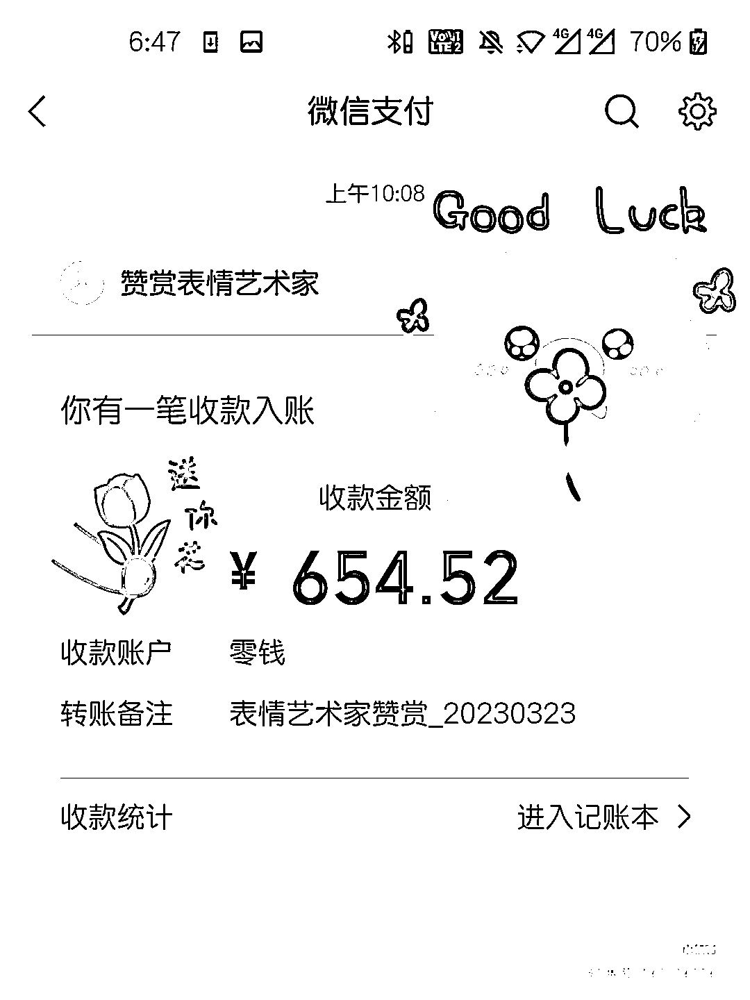

# 《如何利用 AI 搞钱，MJ 批量生成表情包 - 快速涨粉》

> 原文：[`www.yuque.com/for_lazy/thfiu8/ilus54p93ivcqini`](https://www.yuque.com/for_lazy/thfiu8/ilus54p93ivcqini)

<ne-h2 id="1aaac85d" data-lake-id="1aaac85d"><ne-heading-ext><ne-heading-anchor></ne-heading-anchor><ne-heading-fold></ne-heading-fold></ne-heading-ext><ne-heading-content><ne-text id="ud64af5d1">(198 赞)《如何利用 AI 搞钱，MJ 批量生成表情包 - 快速涨粉》</ne-text></ne-heading-content></ne-h2> <ne-p id="uf25bfe96" data-lake-id="uf25bfe96"><ne-text id="u59273153">作者： 珞珈 Lorjia</ne-text></ne-p> <ne-p id="uba436527" data-lake-id="uba436527"><ne-text id="ue2e106cf">日期：2023-05-08</ne-text></ne-p> <ne-p id="u1ed4924d" data-lake-id="u1ed4924d"><ne-text id="u39d850a6">《如何利用 AI 搞钱，MJ 批量生成表情包 | 快速涨粉》</ne-text></ne-p> <ne-p id="ubb35a28c" data-lake-id="ubb35a28c"><ne-text id="u13abc7e7">大家好，我是珞珈 Lorjia，主业是上市互联网金融公司运营，副业研究 AI 工具赚钱，目前已用 AI 绘画完成从 0-1 变现，小红书私域引流客户 36+（可选免费/付费），通过 AI 头像变现超 330+（定价 30 元/个，成交 11 个）</ne-text></ne-p> <ne-p id="u07d5fc75" data-lake-id="u07d5fc75"><ne-text id="u7474a337">近期用 AI 批量生成表情包赚钱的选题在小红书非常火爆，今天主要跟大家分享下如何用 AI 批量生成表情包，快速涨粉起号，并且上传微信表情开放平台赚取收益~（附具体操作步骤）</ne-text></ne-p> <ne-p id="u7a532aa8" data-lake-id="u7a532aa8"><ne-text id="ubdc43f51">为了更好的阅读体验，欢迎大家移步至飞书链接：</ne-text>[<ne-text id="ue6ef6c87">https://x3mtcltyd5.feishu.cn/docx/FJ8HdrA04o2efNx7E1ZcVgehnSe</ne-text>](https://x3mtcltyd5.feishu.cn/docx/FJ8HdrA04o2efNx7E1ZcVgehnSe)<ne-card data-card-name="image" data-card-type="inline" id="JYE1J" data-event-boundary="card"></ne-card></ne-p> <ne-hole id="u2c9de3f6" data-lake-id="u2c9de3f6"><ne-card data-card-name="hr" data-card-type="block" id="OiAJ1" data-event-boundary="card"><ne-p id="u1b689e85" data-lake-id="u1b689e85"><ne-text id="u1e67cb1c">评论区：</ne-text></ne-p> <ne-p id="ub53e6654" data-lake-id="ub53e6654"><ne-text id="uf0a981e6">野猫 : 感谢分享。</ne-text> <ne-text id="uf472e510">珞珈 Lorjia : 不客气，一起学习进步哈[愉快]</ne-text> <ne-text id="u9719a5b6">芳芳 : 感谢分享，非常棒</ne-text> <ne-text id="ud6c6e157">珞珈 Lorjia : 感谢支持[耶]</ne-text> <ne-text id="u0ab603f6">林家少爷 : 感谢分享，开始实操</ne-text> <ne-text id="u7322a897">云舒先生 Jon : 最后一句，人为刀俎，我为鱼肉，精辟</ne-text> <ne-text id="u53348367">珞珈 Lorjia : 何以生财，唯有实战</ne-text> <ne-text id="u7d5c774d">叫我去吃饭 : 感谢分享🙏🙏</ne-text></ne-p></ne-card></ne-hole>