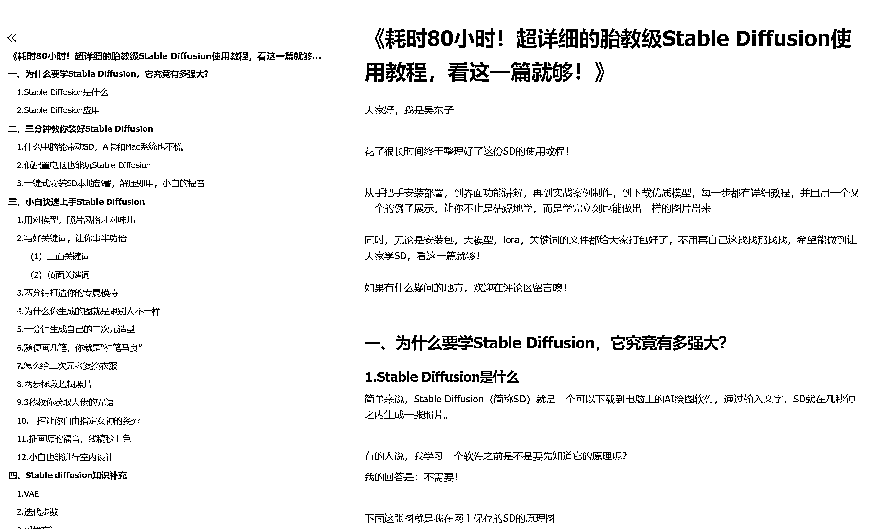

# 《Stable Diffusion 使用教程，看这一篇就够了》

> 原文：[`www.yuque.com/for_lazy/thfiu8/vytsx8a3xsw1bchl`](https://www.yuque.com/for_lazy/thfiu8/vytsx8a3xsw1bchl)

## (精华帖)(578 赞)《Stable Diffusion 使用教程，看这一篇就够了》 

作者： 吴东子 

日期：2023-05-08 

《耗时 80 小时！超详细的胎教级 Stable Diffusion 使用教程，看这一篇就够！》 

大家好，我是吴东子。花了很长时间终于整理好了这份万字 SD 的使用教程！ 

从手把手安装部署，到界面功能讲解，再到实战案例制作，到下载优质模型，每一步都有详细教程，并且用一个又一个的例子展示，让你不止是枯燥地学，而是学完立刻也能做出一样的图片出来！ 

同时，无论是安装包，大模型，lora，关键词的文件都给大家打包好了，不用再自己这找找那找找，希望能做到让大家学 SD，看这一篇就够！ 

如果有什么疑问的地方，欢迎在评论区留言噢！ 

为了更好的阅读体验，大家可以移步至飞书 [https://ry5hwpuf7b.feishu.cn/docx/HYrZdLBMRorB0qxKqFFcQ075nWf](https://ry5hwpuf7b.feishu.cn/docx/HYrZdLBMRorB0qxKqFFcQ075nWf) 

 

 

 

 

 

评论区： 

GEWO.GUO🌪 : 大写的牛逼 +龙 : 谢谢，边收藏边看[呲牙] 阿鹏 : 怎是一个“牛”字了得！ 孙伟悦 : 肯定是先收藏了[呲牙] 开心 : 你可真是太棒了[强] 欢乐马 : 请教下大佬，宽高比设置成 9：16 比例就会出黑图，是哪里的问题啊（用的云平台，显存也够）谢谢 西元 : 牛逼 红烧电饭煲 : 真滴牛我的哥