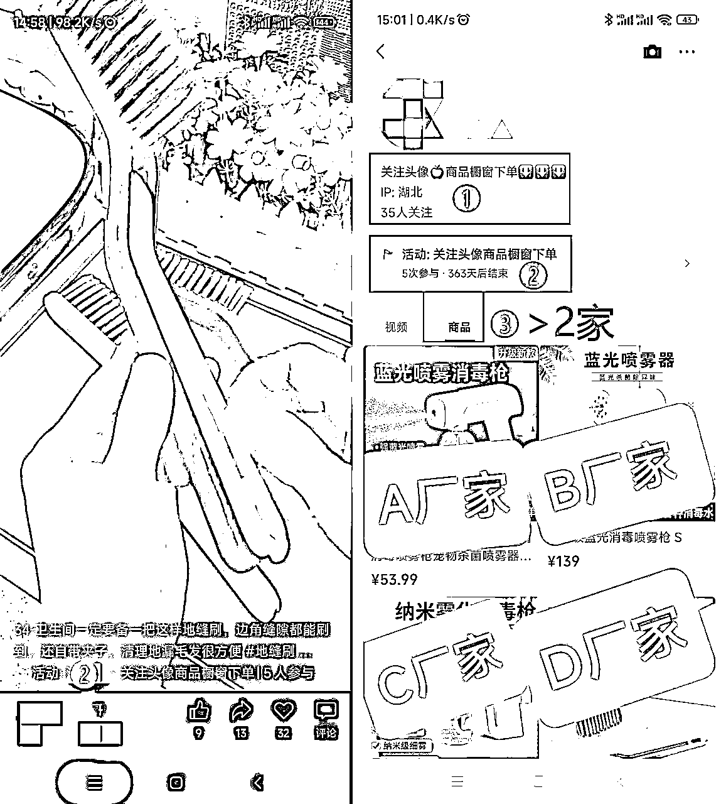

# 《80 后生财圈友分享视频号带货经验，赚钱的事多做十遍》

> 原文：[`www.yuque.com/for_lazy/thfiu8/xeppwim32gb33qg5`](https://www.yuque.com/for_lazy/thfiu8/xeppwim32gb33qg5)

## (精华帖)(150 赞)《80 后生财圈友分享视频号带货经验，赚钱的事多做十遍》 

作者： 东哥 

日期：2023-05-11 

大家好，我是东哥，一个普通的 80 后。进过工厂，做过销售，曾是多年深漂，目前在湖北十堰。年前一直在上班，年后开始全职视频号短视频带货，这次来分享一下我从 0-1 的过程，以及一些踩出来的经验。刚好正在报名的航海也有视频号带货，希望给大家一些参考，一起下场实战。 

先说目前的成绩。我是去年 2022 年 4 月加入生财，共参加过 4 次视频号航海（6 月，8 月，12 月，2 月）。账号年前有 3-5 个，年后不断添加新号进行运营，到现在有 20 多个账号，单个账号收益最高 1 万+，所有账号累计收益 4 万+。 

 

### 一、视频号带货如何流程化作业及放大成果？ 

标题上的这个问题，我现在总结起来，其实就这一句话：跑通流程，优化细节，多账号，流程化，赚钱的事多做十遍。 

发视频，产品上架，看数据，管店铺，催发货。这几个步骤，做视频号短视频带货的圈友应该都很熟悉，我们每天忙的其实就是这些事情，但就是这几个步骤，当我们可以多做十遍的时候，就已经是在进一步放大了。 

但是在这个项目跑通和放大的过程中，我也踩了些坑，学会了一些细节技巧，这里整理分享给大家，希望可以帮到也在做的圈友。 

1.1【明确视频号画像】 

视频号用户女性偏多，年龄偏大；如图 女性占 ≥85%，50 岁以上占比 ≥80% 。 

 

1.2【保证账号安全】 

一个身份证可以办 5 个号，比如 A1，A2，A3，A4，A5。 

其中 A2 - A5 的运营者绑定为 A1，电脑网页端视频号助手用 A1 账号可以切换登录各账号发布视频。5 个号绑定同个银行卡。手机号每大半个月打下电话保证正常不停机。 1 个账号是可以绑定 20 个账号运营的，但不安全，不建议。 

A，B，C 几个人的账号各自分开不要互绑，安全第一。 

另外把自己所有的账号进行编号，可以进一步提高效率，也方便管理。 

1.3【账号登录，硬件支持】 

每个微信可以切换登录 5 个号，安卓手机双开，一个手机可以登录 10 个号。建议买个好手机， 避免登录 10 个号后，手机变卡影响操作流畅度。比如我是买了 3 部小米的红米 Note 11T 的 8+128G 价格 1700 元。 

1.4【测品上架，关注数据】 

开始各账号测不同产品，发布视频时就要选择产品上架 2-3 个链接。 

至少每半天查看一下各账号流量。重点在出了 1-2 单后要立刻跟 2-3 家店铺留言及电话确认货源充足及发货速度问题，后面每天看看是不是 2 天内发货，延迟 3-5 天发货很容易退款退单。 

发现爆款后多个账号测同款产品，短视频引流到橱窗同个店铺抓紧时间抢钱，打仗速战速决利益最大化。 

1.5【利用商品橱窗设置，引导下单】 

在视频号助手【活动管理】创建 活动标题：关注头像商品橱窗下单，有效期 1 年。发布视频后每个视频下面就会显示活动标题，引导客户去橱窗下单。 

当视频爆了，是可以有 3 个置顶位的，置顶的视频会有更多流量，流量大小：左 1＞中间＞右 1。可以在后台根据视频数据做调整排序。 

另外短时间内爆了视频要及时开播提升转化率。短视频搞流量，直播提升转化。 

 

另外还有一个小技巧：橱窗里面根据出单情况产品排序。顶部爆款产品有 2-3 个供客户选择。另外橱窗里面再添加一些客单价≥30 元，佣金比率 ≥30%，销量过百的畅销品，也会有出单。 

1.6【定制爆款产品链接】 

爆款产品让店铺定制链接，主图，SKU，详情页，价格等都可以修改，这样可以促进出单以及提升客单价。 

SKU 太多太乱影响下单；另外价格上 1 份 29.9 元，2 份 49.9 元；客户更容易买 2 单或更多。 

3 月份养生茶我出了 70 多单，佣金 2300+ 定制 SKU 有 5 个：2 罐，3 罐，4 罐，1 罐，茶花三件套*1 份； 茶花三件套*2 份；价格 30-180 都有，三件套*1 份、2 份的都有出单； 

1.7【维护橱窗店铺分】 

平台越来越严格，越来越规范。现在视频号新开店铺的评分一般是 4.5 分，其中影响店铺分数的指标有 3 个：商品体验分，服务体验分，物流体验分。 

低于 4 分的店铺，很容易被平台隐藏下架，结果店铺无法被搜索到，产品链接被下架。当我们出现了爆款后，多个账号引流到同个店铺，结果因为店铺分不够，产品下架而浪费流量，是非常可惜的。 

我就有 2-3 款产品因为合作店铺分数低而下架，损失了不少佣金。所以尽量选择店铺分数高（≥4.2 分），以及物流分数高的店铺进行合作。 

物流体验分低的原因，一般是客户付款后发货慢（≥48 小时）易退款，或者因偏远地区运费高没有发货等。为了避免此类情况导致物流体验分低，建议有店铺的小伙伴，在店铺后设置偏远地区/港澳台地区等不发货；我们在找合作店铺时，也要注意店铺是否有设置。 

1.8【参与生财航海】 

星球航海手册及精华帖多看看，每 2 月 1 次的航海尽量多参加，跑通流程优化细节，然后流程化多账号出单。航海中有人出单多问问跟着学。 

另外出单了，千万要立刻跟店铺确认并跟踪发货时效问题。避免爆单后迟迟无法发货，最终需要售后处理等情况发生。 

### 二、只有自己一个人，如何持续做视频号？ 

手中无钱心中慌。去年初我还在工厂上班，去年 4 月加入生财后，看了不少精华帖，看的我热血沸腾。后来，我失业了，于是开始在家搞知乎，搞了 1 个月没什么动静，所以又开始上班。 

6 月中旬，我参加了视频号航海，第一次尝试视频号视频带货。刚开始的 10 多天，依旧没动静。直到 6 月底，郭晓文教练直播演示实操后，我按照教练的方法继续做，很幸运的开始出单了，这次赚了 800 元。 

后来再参加了 8 月航海，结果却收益甚微，还没 6 月那一拨来的好。再加上工作其实也一直不稳定，当时我都有种心慌使不上劲的感觉。再三考虑后，我决定先暂停下来，一方面关注自己的工作，另一方面也想想是否要继续这个方向。 

再到年底 12 月份那次航海，我又报名了视频号带货，想在 2022 年的最后一期航海再努努力。 

航海开始的前几天，感觉就跟每天上班下班一样没有惊喜。直到 12 月 7 日那天销售额近 3800 元（订单 150 个） ，我感觉不一样了。 

虽然冬季羽绒服湿巾这个品价格不高，但它持续出单到月底，单个账号累计订单 400 个，佣金 3000+ 元。 

 

我马上想到要放大。当时手中只有 3 个账号，一下子就觉得不够了。所以我 1 月份回家后又开通了一个账号，同时想到之前茶壶出了几单，所以又搬运了些视频发布在新号上，结果第二天发现出 30 多单，茶壶 80-200 元，佣金 45%。 

发现钱来了，我赶紧联系店铺催发货，然而大半个月里，我每天去这个店铺的多账号下私信、留言，留下电话却杳无音讯。 

最后这 30 多单仅发货了 1/3 ，到手的鸭子飞了。当然那两天联系不上我就切换了新店铺，累计切换了 5-6 家店铺。而因为店铺联系不上，延迟发货，疫情退货等原因，我还是损失了几千元的佣金。 

后来，这个品后面持续出单 1 个半月左右，单账号佣金 6800 元。 

年后 2 月初，我舅舅来市区办事，在我这边待了几天，我又把他的后台开通了测新品，当天就爆了。几个视频共 10 多万播放，销售 8800 元，单账号持续出单 2 个月，累计佣金 12000+。 

测出爆款手中缺少账号怎么办？我赶紧跑回去，用我妈妈的证件办了 5 个号，后来又用我爸爸的证件办了几个号，全部都用上，目前父母账号合计佣金 20000+。 

所以截止目前，累计收益应该是有 4W+ 了。然而我相信，这只是开始，我还在路上。 

回顾这段路，我认为能够做到现在，有两个点是必要的： <ne-oli index-type="0"><ne-oli-i>1</ne-oli-i><ne-oli-c class="ne-oli-content" id="udbf027dc" data-lake-id="udbf027dc">坚持/执行力</ne-oli-c></ne-oli> 

如果 12 月那次没有决定再尝试一次，没有坚持完整个航海，后面的结果和放大或许都不会发生，有时候真的就差坚持这一会… 而且找准方向了，要在同一个航海项目多次参加。这样可以跟着圈友在一起互帮互助，拼着一股热情不断的持续突破，这个期间为自己加油打气也很重要。 <ne-oli index-type="0"><ne-oli-i>1</ne-oli-i><ne-oli-c class="ne-oli-content" id="uab57ea90" data-lake-id="uab57ea90">家人的支持</ne-oli-c></ne-oli> 

年前的时候，父母其实不了解我在做什么，也没看到什么结果，当时是很不支持的。不过年后有了结果后，他们开始逐渐的了解我在做的事情，也获得了他们的大力支持，得以放大成果。 

比如视频号带货需要微信绑定银行卡这件事，我家乡镇上银行总共只有 2 家：邮政储蓄超过 60 岁不办银行卡，农村商业银行有了存折就不给银行卡... 我妈妈其实坐车晕车的，后来还是开车去了县城，办好了银行卡绑定手机号，真的是给了我很大的支持，也让我更坚定的走下去。 

### 三、视频号带货相关网址链接 

最后分享一下我在做视频号带货时经常拿出来翻看的资料，希望大家从中也能够汲取到一些经验和继续做下去的力量，一起航海一起生财有术。 <ne-oli index-type="0"><ne-oli-i>1</ne-oli-i><ne-oli-c class="ne-oli-content" id="u454638e4" data-lake-id="u454638e4">视频号选品思路&答疑-郭晓文老师</ne-oli-c></ne-oli> 

[https://shengcaiyoushu01.feishu.cn/minutes/obcnws3ukj4royr2ef811hk7](https://shengcaiyoushu01.feishu.cn/minutes/obcnws3ukj4royr2ef811hk7) <ne-oli index-type="0"><ne-oli-i>1</ne-oli-i><ne-oli-c class="ne-oli-content" id="u1fd756e3" data-lake-id="u1fd756e3">《视频号工具箱合集》建议收藏，每日更新—Alan 老师</ne-oli-c></ne-oli> 

[https://wx.zsxq.com/dweb2/index/topic_detail/184282454484252](https://wx.zsxq.com/dweb2/index/topic_detail/184282454484252) <ne-oli index-type="0"><ne-oli-i>1</ne-oli-i><ne-oli-c class="ne-oli-content" id="u3cd400ee" data-lake-id="u3cd400ee">视频号短视频带货 | 航海手册—生财有术</ne-oli-c></ne-oli> 

[https://search01.shengcaiyoushu.com/docx/DdRSd7Mk3oPdygx2p6ycYRUnnQb](https://search01.shengcaiyoushu.com/docx/DdRSd7Mk3oPdygx2p6ycYRUnnQb) 

评论区： 

Ray♻️💥 : 同做视频号，现在 6 个号感觉都已经忘记哪个手机是哪个号了哈哈 肉松 : 可以做个表格方便管理 Ray♻️💥 : 我看有些人是贴纸[呲牙] 博学的金鱼 : 买一些贴纸贴在手机背面，记录一下名称和手机号。再做一个电子表格，记录下所有的视频号和对应的手机。 Ray♻️💥 : [强] 东哥 : 视频号账号流水式编号 A1—A5；手机上账号切换登录；笔记本手写记着哪个账号对应哪个手机，每个月通电话保证手机号正常就行。 亦仁 : 感谢分享，已加精华。 东哥 : 感谢[爱心][爱心]