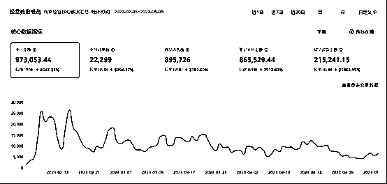

# 《如何从 0 到 1 做到月纯利 30W+，玩转小红书店铺无货源？》

> 原文：[`www.yuque.com/for_lazy/thfiu8/odn0b98vv6yxtkt9`](https://www.yuque.com/for_lazy/thfiu8/odn0b98vv6yxtkt9)

<ne-h2 id="6b938b91" data-lake-id="6b938b91"><ne-heading-ext><ne-heading-anchor></ne-heading-anchor><ne-heading-fold></ne-heading-fold></ne-heading-ext><ne-heading-content><ne-text id="ucb5a4fd5">(精华帖)(1034 赞)《如何从 0 到 1 做到月纯利 30W+，玩转小红书店铺无货源？》</ne-text></ne-heading-content></ne-h2> <ne-p id="u717f9023" data-lake-id="u717f9023"><ne-text id="uab35170d">作者： 宅男，（周恩俊）</ne-text></ne-p> <ne-p id="u3c1ed8ce" data-lake-id="u3c1ed8ce"><ne-text id="u9786e0a6">日期：2023-05-11</ne-text></ne-p> <ne-p id="ud84aec4a" data-lake-id="ud84aec4a"><ne-text id="u8e580deb">哈喽，大家好~</ne-text></ne-p> <ne-p id="u57944154" data-lake-id="u57944154"><ne-text id="u3506917b">平时在生财有术这里也收获到很多的认识，今天在这里，给大家分享一下，如何从 0 到 1，做到月纯利 30W+，玩转小红书店铺无货源，希望我的分享，对想做小红书店铺无货源的伙伴有所帮助；</ne-text></ne-p> <ne-p id="ufa0aa4f5" data-lake-id="ufa0aa4f5"><ne-text id="u209e2f74">主要围绕这几点内容去分享：</ne-text></ne-p> <ne-quote id="u048b5ab0" data-lake-id="u048b5ab0"><ne-p id="u6b6db56c" data-lake-id="u6b6db56c"><ne-text id="u4009dc9e">一个流量风口的出现，往往意味着赚钱商机，毕竟站在风口上，猪也能飞起来。</ne-text></ne-p> <ne-p id="u7970a742" data-lake-id="u7970a742"><ne-text id="ufcc49c1f">互联网赚钱的本质就是搞流量，有流量的地方就能搞定钱。</ne-text></ne-p> <ne-p id="u9b87d79d" data-lake-id="u9b87d79d"><ne-text id="ub7c3a103">但如今淘宝不好做，短视频市场饱和，那么 2023 年的新流量风口究竟在哪里？</ne-text></ne-p> <ne-p id="u19ebbe04" data-lake-id="u19ebbe04"><ne-text id="u289045ff">从目前的数据来看，毋庸置疑是月活跃 2.6 亿的小红书平台，这个平台目前正处于流量红利期。</ne-text></ne-p> <ne-p id="u90b74142" data-lake-id="u90b74142"><ne-text id="ud8fbb6d5">而今年最火的风口项目，则是小红书店铺无货源，相信你也通过朋友圈，抖音，视频号，知乎，等多个平台，也看到了这个项目，那么这是一个怎样的项目，应该如何去做呢？</ne-text></ne-p> <ne-p id="ufbec0be9" data-lake-id="ufbec0be9"><ne-text id="ufbda5236">作为比较早一批入局小红书店铺无货源的我们，给大家分享一下我们的操作经验。</ne-text></ne-p> <ne-p id="ue3cfcc90" data-lake-id="ue3cfcc90"><ne-text id="uda17bd4b">小红书是从去年年中开始，开始上线小红书店铺的，而我们是 10 月份左右就开始做这个小红书店铺无货源项目，并且在 11 月，12 月就有了一定的结果，然后其中一个店铺，单店做了近 100 万的业绩。</ne-text></ne-p> <ne-p id="u65be88c1" data-lake-id="u65be88c1"><ne-text id="u0dc5de79">给大家看看我们的实操数据，这是小红书商家版，这样的店铺，我们差不多有 15 个，这个不算最好的，算是前三。</ne-text></ne-p> <ne-p id="u74f1d14f" data-lake-id="u74f1d14f"><ne-card data-card-name="image" data-card-type="inline" id="VeFkx" data-event-boundary="card"></ne-card><ne-card data-card-name="image" data-card-type="inline" id="szP1S" data-event-boundary="card"></ne-card></ne-p> <ne-p id="uc8e6c7b0" data-lake-id="uc8e6c7b0"><ne-text id="u2529c9df">想要做好小红书店铺无货源，一定要先了解小红书的平台，以及了解它的底层运营逻辑，这样才能够让你更快上手。</ne-text></ne-p> <ne-p id="u2b0e36c9" data-lake-id="u2b0e36c9"><ne-text id="u9b3b1d43" ne-bold="true">1.为什么选择在小红书平台做店铺无货源？</ne-text></ne-p> <ne-p id="u2bed1407" data-lake-id="u2bed1407"><ne-text id="u5ebcd4cd" ne-bold="true">01.小红书的月活跃用户达到 2.6 亿人，这就是一个巨大的流量池；</ne-text></ne-p> <ne-p id="u25152f6c" data-lake-id="u25152f6c"><ne-text id="u2900f21a">根据相关数据分析，小红书这 2.6 亿的用户，其中以 90 后，00 后作为小红书主力军，女性用户占了 70%以上，男性占了 30%，以 1 到 2 线城市占了 50%以上，这说明全国最具有消费潜力的人群都在上面，这也是为什么，在小红书上去种草，能出单的原因，本身人群质量比较高。</ne-text></ne-p> <ne-p id="uff897602" data-lake-id="uff897602"><ne-text id="u2e86ed70">而且小红书是一个消费决策平台，像你去哪里玩，你会习惯看小红书攻略，看了攻略，去了那里，然后感觉还不错，无形中，就会更加信任小红书这个平台；</ne-text></ne-p> <ne-p id="u4f6df522" data-lake-id="u4f6df522"><ne-card data-card-name="image" data-card-type="inline" id="qeqXs" data-event-boundary="card"></ne-card></ne-p> <ne-p id="u4b9d38f1" data-lake-id="u4b9d38f1"><ne-text id="u7fc5c5fb" ne-bold="true">02.小红书店铺无货源是今年才火爆起来，今年也是平台重点扶持小红书的一年。</ne-text></ne-p> <ne-p id="u0102e474" data-lake-id="u0102e474"><ne-text id="u48edcc49">2023 年是小红书店铺无货源项目的风口红利期，今年入场，绝对能够斩获先机，越往后入场，竞争越多，平台规则越完善，这就意味着，今年的红利会越来越缩水，想要深耕小红书店铺的个人，或者团队，都建议越早入场越好，现在入场小红书就犹如 10 年做淘宝电商一样，大部分的人能赚钱，基本上都是赚风口的钱，当风口来临时，一定要学会抓住风口，才能更好的分的一杯羹。</ne-text></ne-p> <ne-p id="u71f51b85" data-lake-id="u71f51b85"><ne-text id="u5b6627be" ne-bold="true">03.把握时机，玩转小红书店铺无货源？</ne-text></ne-p> <ne-p id="u49eb3b7a" data-lake-id="u49eb3b7a"><ne-text id="u4001f24e">当你开了店铺之后，只需上架好产品，去批量铺种草笔记，不用投付费，就能够出单，这对比京东，淘宝这些老平台来说，无疑是最具有潜力和优势，淘宝店铺已经很饱和了，拼多多的店铺模式，一度受到平台的冲击，很多无货源商家都被冻结了款项，所以这一个平台也不轻松。</ne-text></ne-p> <ne-p id="uc5dbdd72" data-lake-id="uc5dbdd72"><ne-text id="u71913a59">我们的小红书店铺无货源模式，则是 1688 发货的模式，也是一件代发的，前期平台规则还不完善，根据没有打击无货源这一种说法，我们从 1688 批发进货，完全合法合规，不需要有任何的顾虑。</ne-text></ne-p> <ne-p id="u6db3e62e" data-lake-id="u6db3e62e"><ne-text id="u7d898bd1" ne-bold="true">2.为什么我们会深耕小红书店铺无货源？</ne-text></ne-p> <ne-p id="uc6e990e2" data-lake-id="uc6e990e2"><ne-text id="uc2f03d56">目前，小红书也非常重视电商板块，这也是平台营收来源的板块之一。</ne-text></ne-p> <ne-p id="uf96674d1" data-lake-id="uf96674d1"><ne-text id="u4dc751eb">以前，我们可能感觉没有那么明显，但是在今年，我们刷到商品的笔记比例明显增加，尤其是你关注或者在某个店铺购物之后，接下来刷小红书，基本都会优先把这个商品的内容推荐给你，说明小红书也是很重视电商这一块，有平台的支持，我们铺起来，就能够如鱼得水了。</ne-text></ne-p> <ne-p id="uf94040d8" data-lake-id="uf94040d8"><ne-text id="uc72253e1">关于小红书无货源店铺，我认为我也是有小小的发言权，最初从去年 11 月份开始测试，一直到现在，数据还在持续不断地往上走，就拿前面的单个店铺来举例子，冲了 100W 的业绩，这个业绩的利润接近 40W，后续店铺会随着时间的推移，权重会越来越高，并且我们布局种草的关键词也会慢慢被系统收录，稳定排名，后续即使我们暂停去铺笔记，店铺还是会出单，这些订单是通过在小红书关键词搜索进来的人群购买的，或者是小红书商城推荐，也会有一些复购的用户。</ne-text></ne-p> <ne-p id="u0cadf457" data-lake-id="u0cadf457"><ne-text id="u40f1872a">所以小红书店铺无货源项目绝对是一个正规，长期并且有积累性的好项目。</ne-text></ne-p> <ne-p id="udbd476a2" data-lake-id="udbd476a2"><ne-text id="uc3be98d5">在 2023 年，这也是最新的一个风口红利项目，这也是我们决定深耕小红书店铺无货源项目的原因之一。</ne-text></ne-p> <ne-p id="u9e3b7e84" data-lake-id="u9e3b7e84"><ne-text id="ua4000245" ne-bold="true">3.操作小红书店铺无货源运营流程是怎样？</ne-text></ne-p> <ne-p id="u015f4b38" data-lake-id="u015f4b38"><ne-text id="u034c9675" ne-bold="true">01.这个小红书项目的运营流程是怎么样的呢？</ne-text></ne-p> <ne-p id="u36520565" data-lake-id="u36520565"><ne-text id="u3b4b95b1">接下来，一步步给大家讲解；</ne-text></ne-p> <ne-p id="u1ce6ac14" data-lake-id="u1ce6ac14"><ne-text id="uf90c394d">小红书店铺无货源模式，简单来说就是我们先选定一个自己想做的类目，比如水果，萌宠，女性用品，女装，时尚用品，美妆，家居，生活百货，儿童玩具，母婴用品，鞋帽箱包，饰品，奢侈品，运动类目等，选定好了领域，就可以尝试去布局。</ne-text></ne-p> <ne-p id="u0087640b" data-lake-id="u0087640b"><ne-text id="ua98eac40">假设，你选择的类目是内衣，那么从我们可以直接在小红书搜索内衣二字，找一些销量高的同行，或者参考一些爆款笔记的类型，去选品上架到自己的店铺，上架好产品之后，就可以尝试去铺笔记了，铺了笔记出单之后，我们就可以去 1688 下单给客户发货，大概的流程就是这样。</ne-text></ne-p> <ne-p id="u0cfa27e9" data-lake-id="u0cfa27e9"><ne-text id="u086624ac" ne-bold="true">02.小红书的店铺类型有哪些，怎么进行开店？</ne-text></ne-p> <ne-p id="udb082848" data-lake-id="udb082848"><ne-text id="u43c93ed9">目前，小红书的店铺类型有个人店，个体店，普通企业店，专卖店，旗舰店和跨境店铺。</ne-text></ne-p> <ne-p id="u18c5f94c" data-lake-id="u18c5f94c"><ne-text id="ua1192654">开个人店是最简单的，不需要资质，只需要一张身份证就可以轻松开店，开个体店，需要一张营业执照辅助才能够开店，此外一张个体营业执照可以开三个小红书店铺，但是对应三个不同的小红书账号，其他的店铺，像普通企业店铺，专卖店，旗舰店这些都需要相应的营业资质才能够开店。</ne-text></ne-p> <ne-p id="ufb6abbae" data-lake-id="ufb6abbae"><ne-text id="uc83d5b7b">我们的小红书店铺无货源项目，目前主要做的店铺类型，就是个人店和个体店。这两个类型的店铺，目前来讲是成本最低，运营性价比最高的类型。普通企业店铺不是说不好，而是不适合批量铺，为什么呢，因为它的保证金比个体店和个人店要翻一倍，有些类目甚至更高，所以不适合批量，也不适合我们的模式。</ne-text></ne-p> <ne-p id="u2b22a134" data-lake-id="u2b22a134"><ne-text id="uaa42eb1e" ne-bold="true">03.小红书开店的具体流程是怎么样的？</ne-text></ne-p> <ne-p id="uede50158" data-lake-id="uede50158"><ne-text id="u465fe10a">首先，用注册好的小红书账号，在我的界面，点击左上角的三条横杠，进入创作中心，在创作服务那里选择更多服务，在内容变现板块，选择开通店铺，然后按照提示去开通就可以了。</ne-text></ne-p> <ne-p id="ua4c52514" data-lake-id="ua4c52514"><ne-text id="u4848bbbb">小红书开店无论是手机端，还是电脑端，都可以开店，如果选择电脑端开店，可以直接点击复制链接去电脑端开店然后就可以了。开店前，有个非常重要的细节，一定不能忽略了，那就是养号。</ne-text></ne-p> <ne-p id="u7bd0a42c" data-lake-id="u7bd0a42c"><ne-card data-card-name="image" data-card-type="inline" id="eHcfV" data-event-boundary="card"></ne-card><ne-card data-card-name="image" data-card-type="inline" id="mpFaB" data-event-boundary="card"></ne-card></ne-p> <ne-p id="u4409815f" data-lake-id="u4409815f"><ne-card data-card-name="image" data-card-type="inline" id="NFAmz" data-event-boundary="card"></ne-card><ne-card data-card-name="image" data-card-type="inline" id="PEw2s" data-event-boundary="card"></ne-card></ne-p> <ne-p id="uf922da89" data-lake-id="uf922da89"><ne-text id="u915fb7de" ne-bold="true">04.小红书开店之前的养号流程？</ne-text></ne-p> <ne-p id="ua52a7080" data-lake-id="ua52a7080"><ne-text id="ucd53981f">小红书账号开店前，我们一般建议先养 2-3 天，刷同领域的内容，或者模拟真实的用户去刷小红书，当然，我们不能单纯地刷，并且还要有点赞，评论和关注的动作，养了之后，第 3 天，我们就可以尝试发一篇笔记去测试流量了，这种笔记是纯干货分享，不带有任何广告的那种，发了笔记，如果浏览量在 50 左右，说明这个小红书账号是正常的，就可以马上开店了。</ne-text></ne-p> <ne-p id="u50266c50" data-lake-id="u50266c50"><ne-text id="ue6a03494">这里也给大家总结一下养号的具体流程：我们可以早中晚刷小红书，每天刷 2-3 个小时，同行账号，图文/视频都可以；</ne-text></ne-p> <ne-p id="ubc304d54" data-lake-id="ubc304d54"><ne-text id="u9f77a915">除此之外，还可以每天关注 3-5 个权威账号或对标账号都可以，对于喜欢的内容点赞+收藏+评论，养成一个真人操作状态。</ne-text></ne-p> <ne-p id="u7fc33b74" data-lake-id="u7fc33b74"><ne-text id="ucf6b95b4">小红书官方设置有自己的账号等级制度，可以依照官方的等级任务，依次完成来提升账号级别，这也是养号的步骤之一，建议是一机一卡一号，同一个设备不要频繁切换账号，不然会被系统检测到有问题。</ne-text></ne-p> <ne-p id="u5b583c61" data-lake-id="u5b583c61"><ne-text id="u887d4c5e">我们之所以这样做，是为了避免账号异常带来的开店时间成本，通常情况下，你不测试就直接去开店了，如果这个账号本身是异常的，怎么发都没效果，后面想要注销重新开店，需要等上 30 天，那就不划算了，所以需要提前测试，这也是一个比较重要的细节。</ne-text></ne-p> <ne-p id="udec6e820" data-lake-id="udec6e820"><ne-text id="u07cca27a" ne-bold="true">4.如何进行多平台，多技巧去定位？选品？定品？测品？优品？</ne-text></ne-p> <ne-p id="u22e614fd" data-lake-id="u22e614fd"><ne-text id="u8590e3d5">注册好店铺之后，那么怎么进行运营呢？</ne-text></ne-p> <ne-p id="u69f2d965" data-lake-id="u69f2d965"><ne-text id="u7c0101a5">小红书店铺无货源模式的运营流程是怎么样的，首先第一步是选品上架测试，测试的阶段，我们又可以分为 5 个步骤。</ne-text></ne-p> <ne-p id="ue5f9cc2d" data-lake-id="ue5f9cc2d"><ne-text id="ucb7982d7" ne-bold="true">定位：</ne-text><ne-text id="u8dd4972c">可以先根据自己的擅长或兴趣进行定品，看你有没有什么资源，资源是否符合小红书用户属性，如果符合，就可以去做，如果自有货源，也符合小红书用户属性，当然更可以去操作，在操作时，可以在小红书去看一下，有没有同行在卖，同行的店铺单品累计销量在 1000 以上，可以考虑去尝试，如果你没有这些资源，也没关系，就可以在拼多多这些平台进行选品，做无货源的模式。</ne-text></ne-p> <ne-p id="u3307decf" data-lake-id="u3307decf"><ne-text id="ua25b08e6" ne-bold="true">选品：</ne-text><ne-text id="u7a500313">我们主要是在拼多多，阿里巴巴，淘宝这些平台上面进行选择，以拼多多为例子，我们首先查看大类，比如大类有：内衣，食品，百货，水果，女装，母婴，电器，鞋包，手机，男装，家纺，美妆，饰品，家居，家装等一系列分类，假如我们选择了饰品这一个分类，那么看饰品分类前面那些高销量的产品，就拿某一个销量 10W+的发圈来举例子，我们选中这一款发圈之后，就可以去小红书去看一下这一款品。</ne-text></ne-p> <ne-p id="u962b35f1" data-lake-id="u962b35f1"><ne-text id="u1cd5da80" ne-bold="true">定品：</ne-text><ne-text id="ucc4288c2">通过搜索小红书搜索发圈，查看销量以及爆帖，如果这款产品，它在小红书的销量不错，那就是受众面还不错的产品，可以直接上架测试，上完架之后，我们可以模仿对标的同行去铺笔记，单个品，一天建议至少 2 条以上的笔记，也可以去通过找到小红书同行，看他的店铺有没有其它的延伸品，也可以去测试，一般我们的参考标准是这个品，累计出 1000 单以上或是他的种草帖子里面带的品，如：最近 15 天，笔记 100 以上点赞，最近 30 天，500 点赞，也可以通过小红书首页发现页去看，这些都可以作为我们定品的参考。</ne-text></ne-p> <ne-p id="u9aab7d15" data-lake-id="u9aab7d15"><ne-text id="u58da50f1" ne-bold="true">测品：</ne-text><ne-text id="udfe8086c">上完产品之后，可以铺笔记，查看这个笔记的浏览量，商品访问量，甚至加购数，已经选择饰品作为主要的大类，那么针对饰品这一块，还有很多销量高并且不错的产品，我们就可以一天 5-8 款商品地去上架，上完架之后，每款商品一天铺 2 条以上的笔记，再观察后续的数据。</ne-text></ne-p> <ne-p id="ub83395a5" data-lake-id="ub83395a5"><ne-text id="u1992608f" ne-bold="true">优品：</ne-text><ne-text id="u760a2f7c">前面测品上架完商品之后，一步步对商品和铺的笔记进行优化，商品的优化主要是看封面主图，次图和详情页的细节有没有做好，对商品的展示详不详细，笔记的优化指标主要是封面，文案（文案又分为标题和详情页），标签这三个大类。如果你的笔记内容主要是通过视频的形式去铺，那么就要多留意一下视频的封面吸不吸引，视频的 BGM 有没有节奏感，动感，卡点，符不符合我们要展示的场景，这些综合因素都要去考虑的，尤其是在你精心选好品上架之后，铺了笔记也没有效果的情况下，一定要多花时间去对比同行，看看同行的细节是怎么样的，然后一步步进行修改优化，特别是我们铺的种草笔记，一定要分析用户的痛点，如果是一个袜子的品类，是否透气，面料，弹力，舒服度等，把用户最关心的问题，在种草笔记中展现出来。</ne-text></ne-p> <ne-p id="ude7164f6" data-lake-id="ude7164f6"><ne-text id="u5b4dc35b">综合前面所讲的几个步骤，我们再拓展一下选品思路，选品这里，除了跨平台去参考淘宝、京东、拼多多和抖店的高销量产品之外，小红书平台本身也是可以参考。</ne-text></ne-p> <ne-p id="u187451f3" data-lake-id="u187451f3"><ne-text id="u03af334a">小红书的人群分析中，女性用户占了 70%以上，并且以 90 后，00 后这些消费主力军为主，这些都是精准的消费人群，舍得花钱，有一定的经济基础，并且购买率也高，所以在小红书选品非常有必要的方法之一，由于小红书的女粉众多，所以在女性用品类目这一块，我们是可以进行深耕。</ne-text></ne-p> <ne-p id="u9605e10c" data-lake-id="u9605e10c"><ne-text id="u67f77136">目前，我们测试有效果的店铺，大多数都是跟女性用品或者女性时尚用品相关的。比如，现在比较火的品类，内衣，内裤，美背，饰品（发圈，发夹，耳环，项链和手链等），美妆，防晒用品，厨房用品，家居好物等，大多数的购买人群，基本都是女性，几乎无一例外。</ne-text></ne-p> <ne-p id="uc7147657" data-lake-id="uc7147657"><ne-text id="ue53cc7c1">还有一个重要的选品细节，我们一定要学会去筛选年龄段，有个朋友上架了一款某个男明星爱豆的同款商品，笔记爆得多，但是转化率跟不上，这是什么原因呢，经过分析发现，过来看的都是这个男明星的迷妹，但是他们的年纪很小，18 岁以下，没啥购买力，导致转化率低，后面我们又测试了厨房用品，因为小红书女性用户多，以 90 后，00 后作为主力军，所以爆单得也快，我们选品也得考虑一下年龄段，不然辛辛苦苦铺的笔记都没有效果，那就太惋惜了；</ne-text></ne-p> <ne-p id="ue057d750" data-lake-id="ue057d750"><ne-text id="ua1ceae14" ne-bold="true">5.以“内衣”为例，如何找对标，分析爆款，找到适合品类?</ne-text></ne-p> <ne-p id="u92103825" data-lake-id="u92103825"><ne-text id="ubb4d51f7">接下来，我们以内衣为例子，仔细讲解一下如何找对标同行，分析爆款，快速出单。首先，我们可以直接在小红书上面搜索内衣。</ne-text></ne-p> <ne-p id="u53f03ea4" data-lake-id="u53f03ea4"><ne-card data-card-name="image" data-card-type="inline" id="E0kK6" data-event-boundary="card"></ne-card></ne-p> <ne-p id="uf052b0f1" data-lake-id="uf052b0f1"><ne-text id="ub0835a96">小红书搜索内衣，有三大栏目：全部，用户和商品，我们选择定到商品栏目，查看普通店铺（旗舰店不作为参考对标，参考旗舰店没有意义）的内衣销量，一般能够排得比较靠前的，都是销量高的商品，我们选择一款月销量 10000+的产品，作为选品，先把款式截图下来，然后到拼多多或者淘宝选择图片识别，找到同一品类的产品，然后从这些渠道把商品的图片素材保存下来，淘宝和拼多多的商品图片可以直接保存，没有任何的水印，有了商品图片之后，我们就要准备商品详情页的素材了。</ne-text></ne-p> <ne-p id="u669034bf" data-lake-id="u669034bf"><ne-text id="u3e7f2bfc" ne-bold="true">那么，商品的详情页怎么制作呢？</ne-text></ne-p> <ne-p id="u8c49b45d" data-lake-id="u8c49b45d"><ne-text id="u9782932f">有两种方法，第一种我们可以截图其他店铺的然后搬运拼凑在一起，第二种方法就是我们自己花时间去制作，可以在稿定设计，图怪兽这些作图网站进行搜索模板，然后自己模仿这些商家进行简改，套用上面的模板修改，这种方法好是好，就是比较浪费时间，不如直接搬运来得快。</ne-text></ne-p> <ne-p id="u7291de42" data-lake-id="u7291de42"><ne-text id="uac39bac0">我们找好品除了自己编辑上架之外，我们还可以用蚂蚁搬家这一个工具去搬运，比如，我们选定了一款内衣作为选品，可以去淘宝和拼多多复制这一款产品的链接，然后用蚂蚁搬家一键复制上架，蚂蚁搬家目前支持很多渠道的平台进行铺货，像阿里巴巴，淘宝，拼多多，京东等等，都支持批量铺货，这种就适合前期想要简单粗暴，批量上货的玩法。</ne-text></ne-p> <ne-p id="u885a3628" data-lake-id="u885a3628"><ne-text id="uff09dbeb">这款工作可以在小红书电脑端，商家后台服务市场就可以找到，前期可以先试用一下，后面觉得效果不错的话，再购买会员，费用也不多，单月费用 29 元，需要铺货可以尝试购买。不过，我们使用这个软件工具搬运上架的时候，一定要花时间去检查，不要一大堆搬运过来就直接违规了，要检查图片敏不敏感，详情页有没有上家的信息，有的话，会违规，上架不了的，尽量多花时间去检查和修改。</ne-text></ne-p> <ne-p id="u04b5021b" data-lake-id="u04b5021b"><ne-text id="u07f90a1a">上架后，我们选定的这一款内衣之后，就需要开始铺笔记了，我们先在小红书搜索内衣这个词语，找到全部栏目，查看爆款笔记，是视频还是图文素材，如果是视频素材，我们也需要发布视频素材，视频素材可以多渠道获取 2-3 个进行混剪。</ne-text></ne-p> <ne-p id="u69595330" data-lake-id="u69595330"><ne-text id="u8b104b18">混剪的步骤也是很讲究的，不能简单改个滤镜，做一下分割，换个背景音乐就完事了，这种处理很有可能会违规，我们一般建议视频混剪。</ne-text></ne-p> <ne-p id="ucdd6136c" data-lake-id="ucdd6136c"><ne-text id="u74c9cc09">正确的步骤是：首先进行分割，然后打乱顺序，打乱顺序之后，再进行转场特效处理，处理完转场之后，再加画中画，透明度可以设置为 1 左右，这就是一个比较完整的处理步骤。</ne-text></ne-p> <ne-p id="u31992fef" data-lake-id="u31992fef"><ne-text id="u8caac49c">经过这个步骤的处理，一般视频不会被系统检测出来是抄袭或者伪原创，这就是一个全新完整的视频。当然，别忘了检查视频是不是带了别人的水印，如果视频带了水印，一定要弄个贴纸挡住水印，或者想办法去除水印，否则带有水印也是会导致违规的。</ne-text></ne-p> <ne-p id="u467cd1f4" data-lake-id="u467cd1f4"><ne-text id="u4d47fb3d">切记，一定不能粗心大意，小红书视频的比例，官方最佳参考为 16 比 9，或者 9 比 16，支持 MP4，MOV，MPV 这三种格式。</ne-text></ne-p> <ne-p id="uacf82f06" data-lake-id="uacf82f06"><ne-text id="u21f97ec5">说完视频素材的处理方法，我们接下来说一下图片的处理方法，图片在搬运过来时，一定要检查有没有水印，没有水印并且高清的图片，这种就是比较优质的素材。</ne-text></ne-p> <ne-p id="u5a82fe5b" data-lake-id="u5a82fe5b"><ne-text id="u8c998945">在对图片伪原创时，我们的步骤参考是，先对图片加一层滤镜，简单调一下色彩的明艳度，别小看这个操作，改完之后，这就是一张全新的图片，改完之后，图片中假如带有一些没必要的元素，比如一些英文字符，或者一些中文描述，又或者是一些多余的元素，我们可以尝试用小红书消除笔这个功能消除掉，或者加一些符合图片境界的贴纸挡住，就可以了。</ne-text></ne-p> <ne-p id="u6b2f04fc" data-lake-id="u6b2f04fc"><ne-text id="ue42b9a40">小红书图片的尺寸建议统一为 1 比 1，3 比 4，4 比 3，其中 3 比 4 为最佳观感。</ne-text></ne-p> <ne-p id="u3cf906a7" data-lake-id="u3cf906a7"><ne-text id="u4a276b58">我们在小红书发笔记的时候，除了图片和视频素材，还有一个不可或缺的步骤，那就是写文案，文案分为标题，正文内容，还有笔记标签这 3 个部分。</ne-text></ne-p> <ne-p id="u0c310df3" data-lake-id="u0c310df3"><ne-text id="u32367509">以内衣为例子，文案我们也是参考爆款同行的去简改重组，标题建议控制在 25 个字以内，正文内容不限，但是不建议过长，只需简洁到位地进行描述，毕竟现在的人心太浮躁了，太长的文章内容估计会划走，没有耐心看完，所以只需简明扼要就可以了，标签这里的话，建议一定要重视，标签是获取关键词以及系统推送的流量分流的一个重要的指标，标签不能草草了事，打标签一定要认真，并且把关键词提炼到位。</ne-text></ne-p> <ne-p id="u29755c03" data-lake-id="u29755c03"><ne-text id="u851c815f" ne-bold="true">01.笔记标题：</ne-text></ne-p> <ne-p id="u2f26cc6a" data-lake-id="u2f26cc6a"><ne-text id="uf4e14bc6">同行 1：这内衣太会了!聚拢显大!还可以露背!!</ne-text></ne-p> <ne-p id="u35b1607f" data-lake-id="u35b1607f"><ne-text id="u91995db3">同行 2：九敏!!一穿上就有料!小胸的显大神器。</ne-text></ne-p> <ne-p id="u1039a785" data-lake-id="u1039a785"><ne-text id="u5c671cec">同行 3：直接封神!小胸 get 到了圆润胸型。</ne-text></ne-p> <ne-p id="u442471e1" data-lake-id="u442471e1"><ne-text id="uf2efd268">重新组合标题：</ne-text></ne-p> <ne-p id="u3a458f3f" data-lake-id="u3a458f3f"><ne-text id="u2fbb3a9e">这内衣太会了!一穿上就有料，小胸 get 到了圆润胸型</ne-text></ne-p> <ne-p id="u6af98e4f" data-lake-id="u6af98e4f"><ne-text id="u4f425e18">这个就是一个完整的标题，我们可以多参考同行的标题，然后杂糅重新组合成自己的标题。</ne-text></ne-p> <ne-p id="ua1c5f34b" data-lake-id="ua1c5f34b"><ne-text id="u14110d15" ne-bold="true">02.笔记文案：</ne-text></ne-p> <ne-p id="udccf46ef" data-lake-id="udccf46ef"><ne-text id="u1e114e6a">同行文案提取 1：</ne-text></ne-p> <ne-p id="uf8c3580a" data-lake-id="uf8c3580a"><ne-text id="u6c38c2b5">这内衣太会了!聚拢显大!还可以露背!!</ne-text></ne-p> <ne-p id="u880b78d0" data-lake-id="u880b78d0"><ne-text id="u7c27616d">这件无痕内衣肉眼可见的高级!!</ne-text></ne-p> <ne-p id="u7bd3421d" data-lake-id="u7bd3421d"><ne-text id="u2264f364">杯型炒鸡聚拢 轻轻松松就能穿出沟!</ne-text></ne-p> <ne-p id="uef1ea578" data-lake-id="uef1ea578"><ne-text id="uba24f7d1">同行文案提取 2：</ne-text></ne-p> <ne-p id="ub73ec509" data-lake-id="ub73ec509"><ne-text id="u47a4f6d0">九敏!!一穿上就有料!小胸的显大神器</ne-text></ne-p> <ne-p id="uca7fe13f" data-lake-id="uca7fe13f"><ne-text id="u80e88e5c">我也不想一直夸啊!!</ne-text></ne-p> <ne-p id="u91189b0e" data-lake-id="u91189b0e"><ne-text id="u2bfc981b">可是这内衣无痕又聚拢</ne-text></ne-p> <ne-p id="u70820622" data-lake-id="u70820622"><ne-text id="ubf1ba169">这肉眼可见的圆圆胸 狠狠地爱住了</ne-text></ne-p> <ne-p id="u93d2818f" data-lake-id="u93d2818f"><ne-text id="u102d7de8">是上薄下厚 1.8cm 硬核升杯埃</ne-text></ne-p> <ne-p id="u94461619" data-lake-id="u94461619"><ne-text id="u26d84ce0">轻松 get 蜜桃波波胸</ne-text></ne-p> <ne-p id="uab38c41d" data-lake-id="uab38c41d"><ne-text id="u4c45c38b">加高的侧比集中聚拢更显胸</ne-text></ne-p> <ne-p id="u39a6d42f" data-lake-id="u39a6d42f"><ne-text id="u452923cc">同行文案提取 3：</ne-text></ne-p> <ne-p id="ua7ca78c1" data-lake-id="ua7ca78c1"><ne-text id="u6353e0f7">直接封神!小胸 get 到了圆润胸型</ne-text></ne-p> <ne-p id="u667a85a8" data-lake-id="u667a85a8"><ne-text id="u0bc79cc4">最近买到的宝藏内衣，睡觉都可以穿，真的真的很舒服</ne-text></ne-p> <ne-p id="uf9a8e4d9" data-lake-id="uf9a8e4d9"><ne-text id="uea6a4c84">再夸一次这个面料，软糯舒适，真正的云朵感，太爱啦</ne-text></ne-p> <ne-p id="udb8552aa" data-lake-id="udb8552aa"><ne-text id="u8756a983">重新组合文案：</ne-text></ne-p> <ne-p id="uf33a4918" data-lake-id="uf33a4918"><ne-text id="u8ed95bd1">这内衣太会了!聚拢显大!还可以露背!!</ne-text></ne-p> <ne-p id="u70262140" data-lake-id="u70262140"><ne-text id="uf3bb1900">这件无痕内衣肉眼可见的高级!!</ne-text></ne-p> <ne-p id="u1ed83e72" data-lake-id="u1ed83e72"><ne-text id="ua8ee879a">我也不想一直夸啊!!</ne-text></ne-p> <ne-p id="u22944e03" data-lake-id="u22944e03"><ne-text id="uf544e48f">可是这内衣无痕又聚拢</ne-text></ne-p> <ne-p id="u1fad3eec" data-lake-id="u1fad3eec"><ne-text id="u231ee028">这肉眼可见的圆圆胸 狠狠地爱住了</ne-text></ne-p> <ne-p id="uf2e6eecf" data-lake-id="uf2e6eecf"><ne-text id="uf0d3984b">直接封神!小胸 get 到了圆润胸型</ne-text></ne-p> <ne-p id="ud5afd8dc" data-lake-id="ud5afd8dc"><ne-text id="uf473e92b">最近买到的宝藏内衣，睡觉都可以穿，真的真的很舒服</ne-text></ne-p> <ne-p id="uac8babe4" data-lake-id="uac8babe4"><ne-text id="u6509d0dc">标签就不一一列举了，但是也要学会提取关键字眼，以及多花时间打标签，选择热门的标签话题，例如：</ne-text></ne-p> <ne-p id="u4f918e66" data-lake-id="u4f918e66"><ne-text id="uaacbe8a9" ne-bold="true">03.标签：</ne-text></ne-p> <ne-p id="u936a9c35" data-lake-id="u936a9c35"><ne-text id="u82a159ef">#小胸聚拢内衣 #舒服内衣推荐 #大胸显小 #小胸显大 #大胸显小内衣 #大胸内衣#聚拢内衣 #无痕内衣 #高级感内衣#舒适内衣推荐 #小胸聚拢内衣 #内衣 #舒适内衣</ne-text></ne-p> <ne-p id="uaf944874" data-lake-id="uaf944874"><ne-card data-card-name="image" data-card-type="inline" id="MIDZV" data-event-boundary="card"></ne-card></ne-p> <ne-p id="uab724de3" data-lake-id="uab724de3"><ne-text id="uc4e0715f">这就是文案内容和标签的杂糅，融汇了同行的亮点，组成新的又可圈可点，最重要的是这个方法节约了大量的时间，可以快速量产，如果都是自己原创去写，一个店铺假设上架了 50 款商品，一款商品铺 2 条笔记，那得铺 100 条笔记，那真的要到猴年马月才能够铺完，太浪费时间。在铺的过程中，就浪费了大量的时间成本，这样只会让同行更领先你一步。</ne-text></ne-p> <ne-p id="ua15cea8d" data-lake-id="ua15cea8d"><ne-text id="u9b067ac9">前面以内衣为例子，讲解了视频素材，图片素材的获取和处理方法，同时也列举了文案标题，正文内容和标签的写法，这就是一个完整的笔记创作过程了。在举例子的时候，可能列举得比较详细，有些人可能会觉得复杂，但这其实一点也不复杂，最主要的是，我们在实操中，能省略的步骤就尽量省略，并不一定要每一条都这么细致，只要在这个基础上能够快速做出来，就足够了。</ne-text></ne-p> <ne-p id="ua069a905" data-lake-id="ua069a905"><ne-text id="ua5acecf7">其实，在实操上架铺货中，除了举例子的这一款内衣，其他的款式，也是需要铺起来的，因为我们的店铺不可能只上架一款产品，这是很难做出效果的。前期一个人操作，建议至少都 3-5 个店铺，并且每个店铺上满 50 款以上的商品，每个品，一天起码 2 个以上的笔记去铺，对于测试出单的商品，更要花时间去重点铺，我们在执行的过程中，一定要多研究同行，学习举一反三，边做边优化，只有这样才能够快速地出单。</ne-text></ne-p> <ne-p id="u82449f08" data-lake-id="u82449f08"><ne-text id="ua8bfc128">出单之后，我们做小红书店铺无货源这个项目才会更有信心，有了信心之后，干劲满满，才能轻松跨过后面的坎，真正通过小红书店铺无货源这个风口爆单，赚到属于自己的一笔营收。</ne-text></ne-p> <ne-p id="u5e4d6fb9" data-lake-id="u5e4d6fb9"><ne-text id="u544dcc02" ne-bold="true">6.店铺商品爆了之后，如何批量发货？</ne-text></ne-p> <ne-p id="ub13fc8e5" data-lake-id="ub13fc8e5"><ne-text id="u7fd3023a">小红书店铺无货源运营的底层逻辑已经介绍完了，那么出单后的运营维护是怎么样的呢？举个例子，比如，你刚刚上架完一款商品，铺了 2 条笔记，第一天的效果不明显，第二天零零散散出了 2 单，你轻轻松松地在 1688 下单发货了，第三天笔记一下子就突然爆了 150 单，这个时候，你一定会手忙脚乱地发货，以及客服对接。超过 48 小时不发货，平台又会进行处罚，那么怎么办呢，我们可以用逸淘这个软件工具去批量下单。逸淘可以轻松实现一键下单，方便快捷，相关的使用教程，可以去淘宝，拼多多，小红书甚至闲鱼找找。这里我们就不展开讲解了，毕竟下单的步骤并不复杂，简单摸索一下，便可实现批量下单。</ne-text></ne-p> <ne-p id="u0cef330d" data-lake-id="u0cef330d"><ne-text id="u3b9a1f39">笔记爆了之后，来问的人也会增加，这个时候会加大我们的客服工作量，哪怕打字速度再快，当客户问的多，问的问题复杂的时候，也是回复不过来的，客服响应速度，系统也会对我们的店铺进行考核评分，所以这一块，我们也需要注意，工作时间能够快速响应的，就尽快去处理。当然，一些电商常用的话术，我们也是可以进行设置的，比如欢迎语和关键词自动回复。</ne-text></ne-p> <ne-p id="ue76cd0d1" data-lake-id="ue76cd0d1"><ne-text id="ue3a61f7e" ne-bold="true">01.欢迎语：</ne-text></ne-p> <ne-p id="u2de40b3d" data-lake-id="u2de40b3d"><ne-text id="uc3657cf1">001.工作时间欢迎语：“亲，您好！在的哦，请问您看中本店的哪个宝贝了呢?我可以为您介绍的呢？”</ne-text></ne-p> <ne-p id="u76e1e81c" data-lake-id="u76e1e81c"><ne-text id="u70d0a97d">002.非工作时间欢迎语：亲，您好！在售的宝贝都有货,喜欢它就赶紧下单带回家吧~客服离线中,若有疑问欢迎留言咨询，上线后会第一时间为您解答。</ne-text></ne-p> <ne-p id="u26e6944c" data-lake-id="u26e6944c"><ne-text id="uc7334c85" ne-bold="true">02.关键词自动回复：</ne-text></ne-p> <ne-p id="u1c414463" data-lake-id="u1c414463"><ne-text id="ud0bbd444">001.发货时间：</ne-text></ne-p> <ne-p id="u3687c613" data-lake-id="u3687c613"><ne-text id="u5ea1f352">“亲，24-48 个小时左右发货的哦，这边亲放心，我们会尽快的给您安排发货的。”</ne-text></ne-p> <ne-p id="ucc1695fa" data-lake-id="ucc1695fa"><ne-text id="uc22b7a9f">002.质量问题：</ne-text></ne-p> <ne-p id="uf99e6282" data-lake-id="uf99e6282"><ne-text id="u81abaa9c">“亲，您好！请您放心，本店的产品在发货之前都是有做检查的，保证质量是没有问题的哦，如果您还是不放心的话，可以看看评价里面都是买家对我们家的肯定的。如果之后我们的宝贝还是出现了质量问题的话，本店是支持 7 天内无理由退货的哦。”</ne-text></ne-p> <ne-p id="ued415da9" data-lake-id="ued415da9"><ne-text id="u6cd84d7c">003.结束语：“非常感谢亲的惠顾，我们尽快为您安排发货，请您注意查收，不要忘记给我们好评哦！</ne-text></ne-p> <ne-p id="u2dc32ee7" data-lake-id="u2dc32ee7"><ne-text id="uaa8a5b15">设置好了欢迎语预计关键词自动回复，将会极大地方便我们的客服工作，提高工作效率，这样哪怕是客户深夜过来咨询，关键词自动回复解决了问题，一样不影响他们下单。</ne-text></ne-p> <ne-p id="ue1db3e25" data-lake-id="ue1db3e25"><ne-text id="u8dcc413e" ne-bold="true">7.当出现售后纠纷时，如何妥善解决，将损失最小化?</ne-text></ne-p> <ne-p id="u36afcfdd" data-lake-id="u36afcfdd"><ne-text id="u6f87b716">过来人都知道，电商本身就是一个不容易的行业，有出单，有爆单，就有退货退款，商品不可能每一件都是完美无缺的，当出现售后问题，怎么处理，才能够将损失降到最小呢？一般有售后的情况，我们要按照承诺给买家售后，同时也要及时跟上家沟通，了解上家的退货退款流程，跟上家说明了缘由之后，上家提供退货地址，我们这边再发给客户，客户按照地址退回之后，有了退货单号，我们再补充填到上家那边，这样两边都退，我们也没有什么损失。如果上家有运费险，那就更加方便了。</ne-text></ne-p> <ne-p id="u5d7c0b8a" data-lake-id="u5d7c0b8a"><ne-text id="ue346e95f">小红书的商品也是可以开通运费险的，不过，它的名字在平台叫运费宝，在物流工具那里可以开通。一般像有尺寸的商品，比如女装，鞋子这些商品都建议开通，因为不开通的话，如果客户因为尺寸不合适要退货，但是他们那边又不想出运费的话，就比较麻烦了。开通了运费宝，其实在一定的程度上也是可以提高转化率的，或许别人就是看有运费险才放心大胆购买的。</ne-text></ne-p> <ne-p id="u6e67d298" data-lake-id="u6e67d298"><ne-text id="u118a74c3">顺便提一下这个 7 天无理由退货，可以在上架的时候，就进行选择是否支持支持七天无理由退货，一般像水果生鲜类或者农产品可以不选择 7 天无理由退货，但是像女装这种退货率本身就很高的，可以选择支持 7 天无理由退货，这种也是可以提高店铺转化率。</ne-text></ne-p> <ne-p id="u98c28ff3" data-lake-id="u98c28ff3"><ne-text id="u2d0d9e86" ne-bold="true">8.常见的小红书店铺无货源问题及解决方法。</ne-text></ne-p> <ne-p id="uce64e4fe" data-lake-id="uce64e4fe"><ne-text id="u60c7f0d5">我们讲解了小红书店铺无货源项目的运营流程以及售后流程之后，接下来再给大家讲解一下在实操中遇到的常见的几类问题，以及解决方法。</ne-text></ne-p> <ne-p id="u82dfb610" data-lake-id="u82dfb610"><ne-text id="u24817f9d" ne-bold="true">01.用个体营业执照注册店铺，显示实名被占用的情况，怎么解决？</ne-text></ne-p> <ne-p id="u60502be1" data-lake-id="u60502be1"><ne-text id="u69dea4ea">一个个体营业执照可以注册 3 个小红书店铺，这 3 个小红书店铺分别对应 3 个不同的小红书账号，如果你已经用个体成功注册了第一个店铺，在注册第二和第三个店铺的时候，我们要先把这两个小红书账号升级成蓝 V，缴纳 600 元的认证费用才可以继续开店，这样才不会显示实名被占用，那么怎么认证升级成蓝 V 呢？百度搜索小红书专业平台，用小红书账号登录进去，在右边专业号认证那边升级，升级完成之后，就可以继续开店了，不会显示实名被占用，第三个店铺也是这么操作。</ne-text></ne-p> <ne-p id="ua62d3154" data-lake-id="ua62d3154"><ne-text id="ufd0aa01d" ne-bold="true">02.淘宝和阿里巴巴的视频怎么无痕扒下来？</ne-text></ne-p> <ne-p id="uc6151c24" data-lake-id="uc6151c24"><ne-text id="ud10daad6">淘宝和阿里巴巴的视频可以用哈士奇这个插件扒下来，这个插件扒下来的素材是没有水印的，处理好了就可以使用。</ne-text></ne-p> <ne-p id="u7fdb02f5" data-lake-id="u7fdb02f5"><ne-text id="ua5f023b9" ne-bold="true">03.小红书店铺一天建议上架几个商品，铺几条笔记？</ne-text></ne-p> <ne-p id="ua552034c" data-lake-id="ua552034c"><ne-text id="uc40dcd97">如果你是个人操作的话，我们建议前期可以准备 3-5 个店铺，每个店铺可以测试不同的类目，单个店铺一天可以上架 5-8 款商品，一个商品一天可以铺 2 条以上的笔记，出单商品可以铺更多，一天至少铺 20 条以上的笔记，坚持一个月左右，一定会有不错的效果。</ne-text></ne-p> <ne-p id="u7a999833" data-lake-id="u7a999833"><ne-text id="u4373ed32" ne-bold="true">04.小红书平台扣税比例是多少？</ne-text></ne-p> <ne-p id="ucfd8840b" data-lake-id="ucfd8840b"><ne-text id="u8a92dfbb">小红书销售额过万以上，平台会扣除 5%的佣金+0.7%的渠道费用。</ne-text></ne-p> <ne-p id="u282e861d" data-lake-id="u282e861d"><ne-text id="uc5333cd3" ne-bold="true">05.小红书店铺没有流量，可以注销重新开店吗？</ne-text></ne-p> <ne-p id="u4615ac3b" data-lake-id="u4615ac3b"><ne-text id="ubd96da05">不建议轻易注销了小红书店铺，因为开了店铺之后，假设有订单这些，注销了，需要 30 天才能够重新开店，时间成本太高了，等上 30 天，太漫长了，等到花儿都谢了。那么没有流量，又不注销，这个时候我们要怎么办呢？建议直接换品类去重新测试，选定一个要做的类目，重新养号，重新上架铺笔记就可以了。</ne-text></ne-p> <ne-p id="uc90ae2dc" data-lake-id="uc90ae2dc"><ne-text id="u1ece6bed" ne-bold="true">06.小红书的上家多，发货地址怎么填，退货地址怎么设置？</ne-text></ne-p> <ne-p id="ud333f2ff" data-lake-id="ud333f2ff"><ne-text id="ub483d7f1">小红书店铺发货地址设置成自己的真实地址，退货地址可以设置成国外的地址，例如设置成美国纽约州，这样买家有售后退不了货，会主动联系我们要地址的，我们再针对不同的上家，把对应的上家地址发给他们就可以了。</ne-text></ne-p> <ne-p id="u633b4430" data-lake-id="u633b4430"><ne-text id="u3ebbf269" ne-bold="true">07.小红书的运费模板怎么设置？</ne-text></ne-p> <ne-p id="uae5ad8e6" data-lake-id="uae5ad8e6"><ne-text id="u587b5ded">全国包邮，除了新疆，西藏，青海，内蒙古，甘肃，海南这些偏远地区，可以设置成一件运费 30 元，依次叠加。</ne-text></ne-p> <ne-p id="u34e9856e" data-lake-id="u34e9856e"><ne-text id="u343366c0" ne-bold="true">08.1688 批量拍单不会被限制或者封号吗？</ne-text></ne-p> <ne-p id="u3be47af3" data-lake-id="u3be47af3"><ne-text id="u743b75a4">肯定不会的，1688 本身就是专业源头的批发渠道，下单越多，权重越高，不会被限制或者封号的。</ne-text></ne-p> <ne-p id="ue0c73f6e" data-lake-id="ue0c73f6e"><ne-text id="u9b48ae27">这是我们运营小红书店铺无货源项目中，最常见的 8 个问题以及解决方法，再给大家分享一个小技巧，如果在实操中，我们再遇到一些自己没法解决的问题，可以直接咨询官方，小红书有商家版 APP，还有小红书网页商家版，如果真的有些问题比较棘手，可以适当请教一下官方客服，官方客服还有人工在线的，之后转人工，就会有专人答复你。</ne-text></ne-p> <ne-p id="u6cdc09ac" data-lake-id="u6cdc09ac"><ne-text id="u6665459e">小红书店铺无货源项目确实是 2023 年趋势最好的项目之一。</ne-text></ne-p> <ne-p id="ub5afc370" data-lake-id="ub5afc370"><ne-text id="u0c8a9c94">因为今年也是平台大力扶持电商的一年，如果你还在找合适的项目，或者是想找长期的项目，又或者是遇到团队工作室转型，那么小红书店铺无货源绝对是你的最佳选择。</ne-text></ne-p> <ne-p id="u14c8dfd5" data-lake-id="u14c8dfd5"><ne-text id="u1d0629a2">只要你脚踏实地，认真执行，用心对标同行，并且参考模仿他们的爆品，不停地优化笔记，相信你也可以迅速出单。</ne-text></ne-p> <ne-p id="u640812f3" data-lake-id="u640812f3"><ne-text id="u7d0a02d7">在选品这一块，再悄悄给大家分享几个热门的品类，像目前大火的类目有：水果，防晒帽，墨镜，内衣，美背，饰品，以及厨房用品，我们这几个爆单的店铺，几乎都是这几个领域的，想做可以对标优秀同行花时间测试，希望我的分享能够给你带来帮助，谢谢。</ne-text></ne-p> <ne-p id="u53a45861" data-lake-id="u53a45861"><ne-text id="u9165bc0c">写在最后，我想说的是~</ne-text></ne-p> <ne-p id="u588e302a" data-lake-id="u588e302a"><ne-text id="u3e214939">这个世界能轻而易举、毫不费劲做到的，只有贫穷和衰老，其它的都需要努力。</ne-text></ne-p> <ne-p id="u6e957203" data-lake-id="u6e957203"><ne-text id="u6e1f1c53">任何项目都不容易，不只是小红书店铺无货源电商，其他项目亦是如此，我们一定要深入了解，摸透它的底层运营逻辑，才有可能把这个项目做好。</ne-text></ne-p> <ne-p id="ue3a0cc6b" data-lake-id="ue3a0cc6b"><ne-text id="u838f3466">人生没有等出来的辉煌，只有闯出来的美丽。</ne-text></ne-p> <ne-p id="u6c2c426d" data-lake-id="u6c2c426d"><ne-text id="u131aac12">敢于迈出去，其实你就已经成功了一半，共勉！</ne-text></ne-p> <ne-hole id="ubc4b1b7f" data-lake-id="ubc4b1b7f"><ne-card data-card-name="hr" data-card-type="block" id="pqkw9" data-event-boundary="card"><ne-p id="u590c95e8" data-lake-id="u590c95e8"><ne-text id="u1620f364">评论区：</ne-text></ne-p> <ne-p id="u47ec9ba2" data-lake-id="u47ec9ba2"><ne-text id="u2bc05cfc">周彦充 : 哈哈，男哥出品，必属精品</ne-text> <ne-text id="u88791b6f">宅男，（周恩俊） : 感谢！</ne-text> <ne-text id="u7f75b944">橙橙喃 : 太详细了吧[玫瑰]</ne-text> <ne-text id="ufc98c44d">宅男，（周恩俊） : 谢谢 对大家有帮助就好！</ne-text> <ne-text id="u512603ce">蔡晓华 : 感谢 男哥分享，有个问题请教一下，一个账号一天 20 条笔记，不会限流判定为营销号吗？有了解到说前期一天一条，后面稳定小眼睛一天最好不要超过 3 条。</ne-text> <ne-text id="u4bcb699c">Pu : 感谢分享[强]</ne-text> <ne-text id="u5960264b">宅男，（周恩俊） : 不会的 前提是你的笔记一定要伪原创或原创 而且小红书平台也比较扶持商家 毕竟是双方互利 如果一天发 1 到 3 条太慢了 时间成本太高了 红利项目 就要抓紧去做</ne-text> <ne-text id="ubebb47ad">宅男，（周恩俊） : 谢谢</ne-text></ne-p></ne-card></ne-hole></ne-quote>